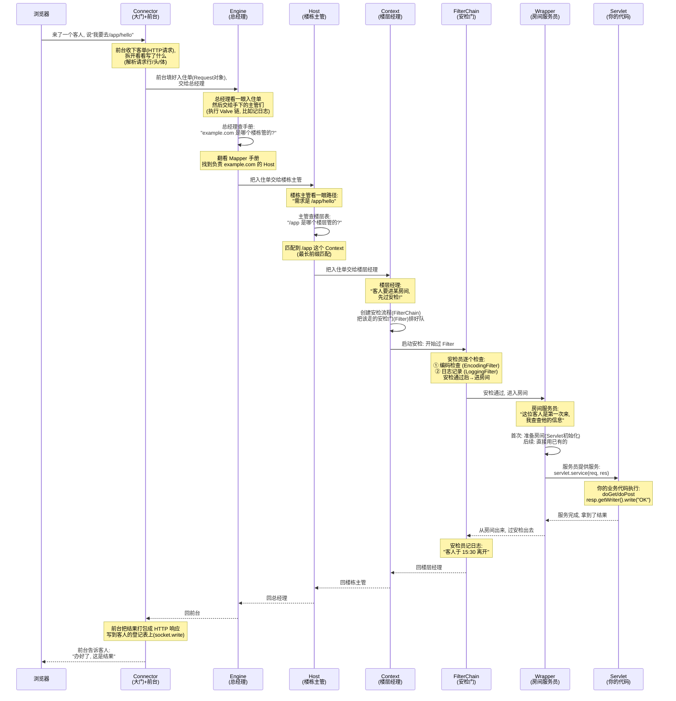

# Tomcat 内核级架构完全指南 — 从零理解 Servlet 容器

> 作者视角：Tomcat 内核级架构师 + Java Servlet 容器设计者 + Apache Tomcat 源码讲解专家
>
> 目标：带您从零彻底理解 Tomcat，最终能够自己实现一个 mini Tomcat（简化版 Servlet 容器）

---

## 目录

1. [Tomcat 本质——不仅仅是 Web Server](#一tomcat-本质不仅仅是-web-server)
2. [核心架构全景——Server / Service / Connector / Container](#二核心架构全景)
3. [Connector & Coyote——如何接客](#三connector--coyote如何接客)
4. [Container 层级——Engine / Host / Context / Wrapper](#四container-层级-engine--host--context--wrapper)
5. [Servlet 规范核心机制](#五servlet-规范核心机制)
6. [Filter Chain——责任链模式的巅峰实践](#六filter-chain责任链模式的巅峰实践)
7. [并发模型——从 BIO 到 NIO 到 APR](#七并发模型从-bio-到-nio-到-apr)
8. [完整请求流程——从 Socket 到 Servlet](#八完整请求流程从-socket-到-servlet)
9. [从 0 实现 mini Tomcat](#九从-0-实现-mini-tomcat)
10. [Tomcat 源码级结构讲解](#十tomcat-源码级结构讲解)
11. [企业级设计对比](#十一企业级设计对比)
12. [常见问题与排查](#十二常见问题与排查)
13. [学习路线](#十三学习路线)

---

## 1. Tomcat 本质——不仅仅是 Web Server

### 1.1 一句话本质

**Tomcat = HTTP Web Server + Servlet 容器 = 一个能接收 HTTP 请求并把它变成 Java 对象丢给 Servlet 执行的运行环境。**

### 1.2 与普通 Web Server 的本质区别

| 普通 Web Server (Nginx) | Tomcat |
|-------------------------|--------|
| 收到请求 → 读文件/代理 | 收到请求 → 创建 Java Request/Response 对象 |
| 返回文件内容或代理结果 | 找到 Servlet → 调用 service() → 返回动态生成内容 |
| 没有应用程序概念 | 有 Servlet 生命周期管理 |
| 配置静态 | 有 webapp 部署机制 |
| 适合静态/反向代理 | 适合动态 Java 应用 |

### 1.3 生活类比

**Tomcat = 一座酒店**

| Tomcat 组件 | 酒店类比 | 职责 | 典型数量 |
|-------------|----------|------|---------|
| **Server** | 酒店集团总部 | 代表整个 Tomcat 进程 | **1 个** |
| **Service** | 单体酒店 | 一组 Connector + Container 的绑定 | **1~N 个**（一般 1 个） |
| **Connector** | 酒店大门 + 前台 | 接待客人（接收 TCP 连接），登记入住信息（解析 HTTP） | **1~N 个**（HTTP 8080 + AJP 8009 等） |
| **Engine** | 酒店总经理 | 接收前台递来的客单，决定交给哪个楼栋 | **1 个**（每个 Service 唯一） |
| **Host** | 楼栋主管 | 管理一个虚拟主机（域名），把请求交给对应楼层 | **1~N 个**（一般 1 个 localhost） |
| **Context** | 楼层（部门） | 管理一个 Web 应用（一个 war 包），找对应房间 | **1~N 个**（部署几个 app 就有几个） |
| **Wrapper** | 房间服务员 (Servlet) | 一个人专门服务一间房，管理 Servlet 生命周期 | **1~N 个**（每个 URL 映射对应一个） |
| **Filter** | 楼层安检 / 门禁 | 进房前做安全检查/日志/权限，可插拔 | **0~N 个**（每个 web.xml 配置） |
| **Session** | 房卡 | 识别客人身份，不用每次重新登记 | **0~N 个**（每次活跃请求对应一个） |
| **Valve** | 酒店内部的监控探头 | 在容器 Pipeline 内拦截请求（Tomcat 内部用，开发者一般不用） | **0~N 个**（可插拔） |
| **Catalina** | 酒店管理公司 | 统筹所有酒店运营（Tomcat 的核心） | 代码层面就是 Server 的实现 |

**组件时序图（一次 HTTP 请求的完整交互）：**



**每一步在做什么（小白版）：**

| 步 | 谁 | 做了什么 | 为什么 |
|----|-----|---------|--------|
| ① | **前台 (Connector)** | 把客人递来的纸条(HTTP 请求)拆开看: 客人想干嘛(GET)、想去哪(/app/hello)、带了什么(Headers/Body) | 不拆开就不知道客人要什么 |
| ② | **前台→总经理** | 前台把填好的"入住单"(Request对象)交给总经理(Engine) | 前台只管接待, 决策得往上交 |
| ③ | **总经理 (Engine)** | 总经理先让手下的主管们依次看看(Valve链: 记日志→错误处理→...), 然后查手册(Mapper)找对应楼栋 | 每个主管过一遍是为了记录(日志/权限等); 查手册是为了知道该交给哪个楼栋 |
| ④ | **总经理→楼栋主管** | 找到负责 example.com 的楼栋主管(Host), 把入住单交给他 | 不同域名对应不同楼栋 |
| ⑤ | **楼栋主管 (Host)** | 看入住单上的路径 /app/hello, 查楼层表找哪个楼层(Context)管理 /app 这个应用 | 一个楼栋可能有多个楼层(/app, /admin, / 等) |
| ⑥ | **楼栋主管→楼层经理** | 把入住单交给负责 /app 的楼层经理(Context) | 找到对应的 Web 应用 |
| ⑦ | **楼层经理 (Context)** | 看到客人要进房间。先设置安检流程(FilterChain): 把该走的安检门(Filter)排好队 | 进房间前必须安检(日志/权限/编码等), 这是固定流程 |
| ⑧ | **楼层经理→安检门** | 启动安检: chain.doFilter(request, response) | 开始一个个过 Filter |
| ⑨ | **安检门 (FilterChain)** | ① 编码Filter先检查→② 日志Filter记下时间→③ 通过→可以去房间了 | Filter 可以插拔, 加一个 Filter 就多一道安检 |
| ⑩ | **安检门→房间服务员** | 安检通过, 进入 Wrapper(包裹 Servlet 的服务员) | 到这一步才真正接触到你的代码 |
| ⑪ | **房间服务员 (Wrapper)** | 如果是这位客人的第一次请求: 服务员先去仓库拿工具(Servlet.反射创建+init()初始化); 之后直接复用 | Servlet 是单例, 只初始化一次, 后续请求复用 |
| ⑫ | **房间服务员→你的代码** | 服务员提供服务: servlet.service(req, res) → 你的 doGet/doPost 执行 | 终于到你的业务代码了! |
| ⑬ | **你的代码→房间服务员** | 你写好了响应(比如 "Hello World"), 交还给服务员 | 业务逻辑完成 |
| ⑭~⑱ | **原路返回** | 服务员→安检门(记离开时间)→楼层经理→楼栋主管→总经理→前台(打包 HTTP 响应, 写回 Socket) | 每层都可能做后置处理(比如记日志: "这个请求花了 50ms") |

**关键规则（小白版）：**
- **每一层只做自己的事**：前台只接待, 总经理只分配, 楼栋主管只看域名, 楼层经理只管理应用, 安检门只检查, 服务员只调用你的代码。**各司其职**
- **进去原路出来**：请求从外到内一层层进去, 响应从内到外一层层出来。出来的时候每层还可以"补充记录"（比如写日志说"这个请求处理完了, 耗时多少"）
- **安检门可以加可以减**：Filter 是配置的, 想加就加, 想删就删, 不影响其他部分
- **服务员只有一个**：Wrapper 里的 Servlet 是单例（只有一个实例）, 所有请求都用同一个, 但处理的时候各不干扰

### 1.4 Tomcat 的三大角色

```
Tomcat = Coyote (HTTP 解析) + Catalina (Servlet 容器) + Jasper (JSP 编译)
               │                        │                        │
               ▼                        ▼                        ▼
         网络层 + 协议层          应用层 + 容器层          视图层 + 编译层
```

---

## 2. 核心架构全景

### 2.1 一句话本质

**Tomcat 是一个分层的嵌套容器——Server 包含 Service，Service 包含 Connector 和 Container，Container 层层嵌套（Engine→Host→Context→Wrapper），请求从外到内逐层传递。**

### 2.2 架构全景图（文件夹目录风格）

```
Tomcat Server
├── Service "Catalina" (默认)
│   ├── Connector HTTP/1.1 :8080
│   │   └── ... (结构同下, 只是协议不同)
│   │
│   ├── Connector AJP/1.3 :8009 (可选的, 和 Nginx 配合用)
│   │   ├── ProtocolHandler (NioEndpoint)
│   │   │   ├── Acceptor          ← accept 新连接
│   │   │   ├── Poller            ← epoll 轮询事件
│   │   │   ├── SocketProcessor   ← 提交线程池
│   │   │   └── ThreadPoolExecutor ← worker 线程
│   │   ├── Http11Processor       ← 解析 HTTP
│   │   ├── CoyoteAdapter         ← 转成 Catalina Request
│   │   └── Mapper                ← URL → Host/Context/Wrapper 映射
│       │   └── Container (Catalina)
│       └── Engine (org.apache.catalina.core.StandardEngine)
│           ├── Pipeline  ← 作用: 所有请求进 Engine 时先过一遍这里的阀门
│           │   ├── AccessLogValve          ← ① 记日志 (哪个 IP 什么时候请求了什么)
│           │   ├── ErrorReportValve        ← ② 如果有错误, 生成错误页面
│           │   └── StandardEngineValve     ← ③ 找子容器: 根据请求的 Host 名,通过 Mapper 找到对应的 Host 实例，比如请求 Host: example.com，Mapper 内部查 MappedHost[] 数组，找到后调 host.getPipeline().invoke()
│           │                                 ↑ 这个 Pipeline 对"所有域名"都生效
│           │
│           ├── Host "localhost" (或 example.com 等)
│           │   ├── Pipeline  ← 作用: 请求进入这个虚拟主机时先过一遍
│           │   │   └── StandardHostValve     ← 找子容器: 根据请求 URI 找 Context，比如请求 /app/hello，遍历该 Host 下的所有 Context，"最长前缀匹配": /app 匹配上 /app/hello，找到后调 context.getPipeline().invoke()，如果都没匹配上 → 返回 404
│           │   │                              ↑ 可以加自定义 Valve, 比如这个 Host 限流
│           │   │
│           │   ├── Context "/app1"
│           │   │   ├── Pipeline  ← 作用: 请求进入这个 Web 应用时先过一遍
│           │   │   │   └── StandardContextValve ← 找子容器: 根据 URI 找 Wrapper，比如请求 /app/hello (去掉 Context 路径后 /hello)，按优先级匹配 Wrapper:精确匹配 /hello → Wrapper(hello)、前缀匹配 /api/* → Wrapper(api)
│           │   │                               ──   默认匹配 /，找到后不直接调 Servlet, 而是创建 FilterChain
│           │   │                               ── chain.setServlet(wrapper.getServlet())
│           │   │                               ── chain.doFilter() → 走完 Filter → 才到 Servlet
│           │   │   │
│           │   │   ├── ApplicationFilterChain  ← 应用级别的安检通道
│           │   │   │   ├── EncodingFilter   ← 设置请求/响应编码 UTF-8
│           │   │   │   └── LoggingFilter    ← 记录请求耗时
│           │   │   │   └── ...              ← 你可以随意加 Filter
│           │   │   │
│           │   │   ├── Wrapper "/hello"
│           │   │   │   ├── Pipeline  ← 作用: 调用 Servlet 前的最后一步
│           │   │   │   │   └── StandardWrapperValve ← 内部阀门: 调 Servlet.service()
│           │   │   │   │                               ↑ 确保 Servlet 已初始化, 然后调用
│           │   │   │   └── HelloServlet     ← 你的代码 (doGet/doPost)
│           │   │   │
│           │   │   └── Wrapper "/login"
│           │   │       ├── Pipeline
│           │   │       │   └── StandardWrapperValve
│           │   │       └── LoginServlet
│           │   │
│           │   └── Context "/app2"
│           │       ├── Pipeline
│           │       │   └── StandardContextValve
│           │       │
│           │       ├── ApplicationFilterChain
│           │       │   └── AuthFilter       ← 权限检查 (只在这个应用生效)
│           │       │
│           │       ├── Wrapper "/api"
│           │       │   ├── Pipeline: [StandardWrapperValve]
│           │       │   └── ApiServlet
│           │       │
│           │       └── Wrapper "/health"
│           │           ├── Pipeline: [StandardWrapperValve]
│           │           └── HealthServlet
│           │
│           └── Host "myapp.com" (另一个虚拟主机)
│               └── ... (结构和 localhost 一样, 但可以有自己独立的 Pipeline Valve)
│
└── Service "Admin" (可选的, 管理端口)
    ├── Connector HTTP/1.1 :8081
    └── Container
        └── Engine
            └── Host "localhost"
                └── Context "/manager"
                    └── Wrapper → ManagerServlet

─────────────────────────────────────────────────────────────
层级关系: Server ⊃ Service ⊃ (Connector, Engine ⊃ Host ⊃ Context ⊃ Wrapper ⊃ Servlet)
每个容器都有 Pipeline: 请求进来先过 Pipeline → Pipeline 末尾的 BasicValve 负责找子容器
Context 的 FilterChain: 和 Pipeline 是两回事, 是应用级别(Servlet 规范)的拦截器
```

注意这个图和 2.3 的树形图角度不同——**2.2 展示完整内部结构（含 Pipeline、Valve、FilterChain 的职责）**，2.3 展示组件间的数量关系。

### 2.3 那 Service 到底是什么——最容易被忽略的"胶水层"

架构图上 Service 框住了 Connector 和 Container，但它**自己不处理任何请求**。那它存在的意义是什么？

**一句话：Service  = 一个 Connector 组 + 一个 Engine 的绑定关系。**

```
Tomcat 进程 (Server) .............................................. 1 个
  │
  ├── Service "Catalina" (HTTP 服务) ............................. 1~N 个
  │     ├── Connector HTTP :8080  ............................... 1~N 个
  │     ├── Connector AJP  :8009  ............................... (每个 Service 可以有多个)
  │     └── Engine (localhost)  ................................. 1 个 (每个 Service 唯一)
  │           ├── Host (example.com)  ........................... 1~N 个
  │           └── Host (myapp.com)  ............................. (虚拟主机, 一个域名一个)
  │                 ├── Context (/app1)  ........................ 1~N 个
  │                 │     ├── Wrapper (/hello)  → HelloServlet . 1~N 个
  │                 │     └── Wrapper (/login) → LoginServlet . (一个 URL 模式一个)
  │                 │
  │                 └── Context (/app2)  ........................ (每个 war 包一个)
  │                       ├── Wrapper (/api)   → ApiServlet
  │                       └── Wrapper (/health)→ HealthServlet
  │
  └── Service "Admin" (管理端口, 可选的)
        ├── Connector HTTP :8081
        └── Engine (admin)
              └── Host (localhost)
                    └── Context (/manager)
                          └── Wrapper → ManagerServlet

数量关系:
  Server    1
  Service   1~N       (一般 1 个)
  Connector 1~N       (每个 Service: HTTP + AJP 等)
  Engine    1         (每个 Service 唯一)
  Host      1~N       (虚拟主机, 一般 1 个 localhost)
  Context   1~N       (部署几个 war 就有几个)
  Wrapper   1~N       (每个 Servlet 映射一个)
  Servlet   1         (每个 Wrapper 包裹一个)
  Filter    0~N       (每个 Context 按需配置)
```

**关键规则：**
- 一个 Service **只能有一个 Engine**（绑定一个容器树）
- 一个 Service **可以有多个 Connector**（不同端口/协议连到同一个 Engine）
- 多个 Service 之间**完全隔离**（不同的 Engine，不同的容器树）

```
多 Connector 共用 Engine:
  HTTP:8080 ─┐
             ├──→ Service ─→ Engine (同一个容器树)
  AJP:8009  ─┘

  场景: 用户通过 8080 访问, 和 Nginx 通过 AJP 协议转发,
        最终到达同一个 Host/Context/Servlet
```

**生活类比：** 如果把 Tomcat 比作一栋办公楼：

```
Server = 整栋办公楼 (Tomcat 进程)
  Service = 一个公司的办公区
    一个公司可以有多个大门 (Connector: HTTP/8080 + AJP/8009)
    但只有一个总经理 (Engine)
    总经理管理多个部门 (Host)
    每个部门有多个工位 (Context/Wrapper)

  如果有两个公司 (两个 Service), 它们共用一个楼 (Server)
  但彼此独立, 互不干扰
```

**为什么要有 Service 这个层？** 因为 Tomcat 需要支持**一个进程监听多个端口，且不同端口的流量可以进入不同的容器树**。没有 Service，你就得启动两个 Tomcat 进程（两个 JVM）才能隔离不同端口的处理逻辑。

```
不用 Service 的方案:              用 Service 的方案:
┌──────────┐  ┌──────────┐      ┌── Service HTTP ───┐
│ Tomcat 1 │  │ Tomcat 2 │      │ Connector :8080    │
│ HTTP:8080│  │ AJP:8009 │      │ Engine(prod)       │
└──────────┘  └──────────┘      └───────────────────┘
  2 个 JVM, 2 倍内存           ┌── Service Admin ───┐
                                │ Connector :8081    │
                                │ Engine(admin)     │
                                └───────────────────┘
                                1 个 JVM, 共享内存
```

**组件数量关系图（谁有几个谁）：**

```
对一个典型的 Tomcat 来说, 各组件之间的数量关系长这样:

             ┌──────────┐
             │  Server  │ 1 个 (整个 Tomcat 进程)
             └────┬─────┘
                  │ 包含 1~N 个
                  ▼
             ┌──────────┐
             │ Service  │ 一般 1 个 (特殊场景可以多个)
             └────┬─────┘
                  │
          ┌───────┴───────┐
          │               │
          ▼               ▼
   ┌──────────┐    ┌──────────┐
   │Connector │    │  Engine  │ 1 个 (每个 Service 唯一)
   │(大门)    │    └────┬─────┘
   │1~N 个    │         │
   │不同端口   │         │ 包含 1~N 个
   └──────────┘         ▼
                  ┌──────────┐
                  │   Host   │ 一般 1 个 (可以多个虚拟主机)
                  └────┬─────┘
                       │ 包含 1~N 个
                       ▼
                  ┌──────────┐
                  │ Context  │ 部署几个 war 就有几个
                  └────┬─────┘
                       │ 包含 1~N 个
                       ▼
                  ┌──────────┐
                  │ Wrapper  │ 每个 Servlet 映射一个
                  └────┬─────┘
                       │ 包裹 1 个
                       ▼
                  ┌──────────┐
                  │ Servlet  │ 你的业务代码
                  └──────────┘

             ┌──────────┐
             │  Filter  │ 0~N 个, 可插拔
             └──────────┘

数量关系总结:
  Server 1 : Service N
  Service 1 : Connector N
  Service 1 : Engine 1
  Engine 1 : Host N
  Host 1 : Context N
  Context 1 : Wrapper N
  Wrapper 1 : Servlet 1
  Context 0 : Filter N (Filter 挂在 Context 下)
```

**举个例子（一个典型的 Tomcat）：**

```
假设你启动了一个 Tomcat, 部署了两个 Web 应用 (app1.war, app2.war),
每个 app 有 2 个 Servlet:

Server: 1 个
  └── Service "Catalina": 1 个
        ├── Connector HTTP/8080: 1 个
        ├── Connector AJP/8009: 1 个 (可选)
        └── Engine: 1 个
              └── Host "localhost": 1 个
                    ├── Context "/app1": 1 个
                    │     ├── Wrapper "/hello": 1 个 → HelloServlet
                    │     ├── Wrapper "/login": 1 个 → LoginServlet
                    │     └── Filter "/*": 2 个 (EncodingFilter + LoggingFilter)
                    │
                    └── Context "/app2": 1 个
                          ├── Wrapper "/api": 1 个 → ApiServlet
                          ├── Wrapper "/health": 1 个 → HealthServlet
                          └── Filter "/*": 1 个 (AuthFilter)

总数: 1 Server + 1 Service + 2 Connector + 1 Engine + 1 Host + 2 Context + 4 Wrapper + 3 Filter
```

### 2.4 各组件职责

| 组件 | 接口/类 | 职责 |
|------|---------|------|
| **Server** | `org.apache.catalina.Server` | 代表整个 Tomcat 进程，管理所有 Service |
| **Service** | `org.apache.catalina.Service` | 包含一个或多个 Connector + 一个 Container |
| **Connector** | `org.apache.catalina.connector.Connector` | 监听端口，解析 HTTP，封装为 Request/Response |
| **Engine** | `org.apache.catalina.Engine` | 最高级容器，处理所有请求，根据 Host 名分发 |
| **Host** | `org.apache.catalina.Host` | 虚拟主机，对应一个域名 |
| **Context** | `org.apache.catalina.Context` | Web 应用上下文，包含多个 Wrapper |
| **Wrapper** | `org.apache.catalina.Wrapper` | 包裹一个 Servlet，管理其生命周期 |
| **Pipeline** | `org.apache.catalina.Pipeline` | 每个容器都有 Pipeline + Valve 链 |
| **Valve** | `org.apache.catalina.Valve` | 阀门，类似 Filter，但在容器内部 |

### 2.4 为什么这样设计（设计模式）

Tomcat 采用了 **组合模式 + 责任链模式 + 模板方法模式**：

```
组合模式：Server ⊃ Service ⊃ (Connector, Engine ⊃ Host ⊃ Context ⊃ Wrapper)
           每个容器都有 addChild() / findChild() 方法

责任链模式：每个容器都有一个 Pipeline (Valve 链)
            请求经过每个 Valve 然后进入子容器

模板方法模式：ContainerBase 定义了容器生命周期
              init() → start() → stop() → destroy()
```

### 2.5 各组件工作机制详解

每个组件内部都有相似的骨架：**Pipeline（Valve 链）+ 子容器查找 + 递归调用**。

###### 2.5.1 Connector —— 网络入口

```
职责: 监听端口 → accept → HTTP 解析 → 创建 Request/Response → 交给 Container

内部结构:
                    ┌──────────────┐
                    │  Connector   │
                    └──────┬───────┘
                           │
              ┌────────────┴────────────┐
              │                         │
     ┌────────▼────────┐     ┌──────────▼───────────┐
     │ ProtocolHandler  │     │  CoyoteAdapter        │
     │                  │     │                      │
     │ NioEndpoint      │     │  coyote.Request →     │
     │   Acceptor       │     │  catalina.Request     │
     │   Poller         │     │  → Engine.Pipeline    │
     │   SocketProcessor│     │                      │
     │   Http11Processor│     └──────────────────────┘
     └────────┬─────────┘
              │
     ┌────────▼─────────┐
     │ 线程池 (Executor) │
     └──────────────────┘

数据流:
  网卡 → Acceptor.accept() → Poller.register() → epoll_wait()
  → SocketProcessor → Http11Processor.parse() → CoyoteAdapter
  → Engine.getPipeline().invoke()
```

###### 2.5.2 Engine —— 顶层容器

```
职责: 调用 Pipeline → StandardEngineValve → Mapper 找 Host → 子容器 Pipeline

StandardEngineValve 逻辑:
  mapper.map(hostName, uri, mappingData);     // 根据 Host 名匹配
  Host host = mappingData.host;
  host.getPipeline().invoke(request, response); // 调用子容器

内部结构:
  ┌─ Engine ──────────────────────────────────┐
  │  Pipeline:                                 │
  │    [AccessLogValve] → [ErrorValve] →       │
  │    [StandardEngineValve (BasicValve)]       │
  │         │                                   │
  │         │  request.getServerName()          │
  │         │  → "localhost"                    │
  │         │  → Mapper.match("localhost")      │
  │         │  → 找到 Host                      │
  │         ▼                                   │
  │    ┌─ Host ──────────────────────┐          │
  │    │  ... (下一层)                │          │
  │    └─────────────────────────────┘          │
  └────────────────────────────────────────────┘
```

###### 2.5.3 Host —— 虚拟主机分发

```
职责: 根据 URI 前缀找 Context → 404 或调子容器 Pipeline

StandardHostValve 逻辑:
  Context context = host.findContext(uri);       // 最长前缀匹配
  if (context == null) { response.sendError(404); return; }
  context.getPipeline().invoke(request, response);

内部结构:
  ┌─ Host("example.com") ──────────────────────┐
  │  Pipeline:                                  │
  │    [StandardHostValve (BasicValve)]          │
  │         │                                    │
  │         │  findContext("/app/hello")         │
  │         │  → 最长前缀匹配 "/app"             │
  │         ▼                                    │
  │    ┌─ Context("/app") ───────────┐          │
  │    │  ... (下一层)                │          │
  │    └─────────────────────────────┘          │
  └────────────────────────────────────────────┘
```

###### 2.5.4 Context —— Web 应用

```
职责: 创建 FilterChain → 加 Filter → 找 Wrapper → 启动链

StandardContextValve 逻辑:
  ApplicationFilterChain chain = new ApplicationFilterChain();
  for (filter : context.findFilters(uri)) chain.addFilter(filter);
  Wrapper wrapper = context.findWrapper(uri);
  chain.setServlet(wrapper.getServlet());
  chain.doFilter(request, response);

内部结构:
  ┌─ Context("/app") ───────────────────────────┐
  │   Servlets:  /hello → HelloServlet          │
  │   Filters:   /* → EncodingFilter            │
  │              /* → LoggingFilter             │
  │                                              │
  │   Pipeline:                                  │
  │     [StandardContextValve (BasicValve)]      │
  │          │                                    │
  │          │  创建 FilterChain                  │
  │          │  → EncodingFilter.doFilter()      │
  │          │    → LoggingFilter.doFilter()     │
  │          │      → Wrapper.Pipeline           │
  │          ▼                                    │
  │     ┌─ Wrapper ──────────────────────┐       │
  │     │  Servlet.service()             │       │
  │     └────────────────────────────────┘       │
  └──────────────────────────────────────────────┘
```

###### 2.5.5 Wrapper —— Servlet 包裹器

```
职责: 管理 Servlet 生命周期 (懒加载 init / service / destroy)

StandardWrapperValve 逻辑:
  Servlet servlet = wrapper.allocate();          // 首次 → 反射创建 + init()
  servlet.service(request, response);
  wrapper.deallocate(servlet);

生命周期:
  首次请求: allocate() → newInstance() → init() → return
  后续请求: allocate() → return 已有实例
  应用关闭: destroy()  → servlet.destroy()
```

###### 2.5.6 Pipeline & Valve —— 容器内部的责任链

```
所有容器的通用骨架:

  Request → Valve1 → Valve2 → BasicValve
                                   │
                                   │  有子容器 → child.getPipeline().invoke()
                                   │  无子容器 → servlet.service()
                                   ▼
                               Response 原路返回

容器嵌套时的完整调用链:
  Engine.Pipeline → StandardEngineValve
    → Host.Pipeline → StandardHostValve
      → Context.Pipeline → StandardContextValve
        → FilterChain → Servlet.service()
```

###### 2.5.7 完整协作图：所有组件一起工作

```
┌──────────────────────────────────────────────────────────────────────────────────────────────┐
│                           一次 HTTP 请求: 所有 Tomcat 组件如何协作                              │
├──────────────────────────────────────────────────────────────────────────────────────────────┤
│                                                                                               │
│  浏览器 → GET http://example.com:8080/app/hello                                               │
│                                                                                               │
│  ╔═══════════════════════════════════════════════════════════════════════════════════════╗     │
│  ║  阶段一: Connector 层 (Coyote / 网络 + 协议)                                          ║     │
│  ╚═══════════════════════════════════════════════════════════════════════════════════════╝     │
│                                                                                               │
│  ┌─ NioEndpoint ──────────────────────────────────────────────────────────────────────────┐  │
│  │                                                                                         │  │
│  │  ① Acceptor 线程 (1 个)                                                                 │  │
│  │    ServerSocketChannel.accept() → 拿到的 SocketChannel                                   │  │
│  │    → 注册到 Poller 的 Selector (OP_READ)                                                │  │
│  │                                                                                         │  │
│  │  ② Poller 线程 (默认 2 个)                                                              │  │
│  │    selector.select() → 发现 OP_READ 就绪                                                │  │
│  │    → processSocket(key) → 提交到线程池                                                   │  │
│  │                                                                                         │  │
│  │  ③ Worker 线程池 (默认 max 200)                    Thread-1                              │  │
│  │    ThreadPoolExecutor.execute(SocketProcessor) ──────── SocketProcessor.run()            │  │
│  │                                                                                         │  │
│  └─────────────────────────────────────────────────────────────────────────────────────────┘  │
│            │                                                                                  │
│            ▼  (worker 线程继续执行)                                                            │
│  ┌─ Http11Processor ───────────────────────────────────────────────────────────────────────┐  │
│  │  parseRequestLine()  → "GET", "/app/hello", "HTTP/1.1"                                 │  │
│  │  parseHeaders()      → Host: example.com, Connection: keep-alive, ...                   │  │
│  │  parseBody()         → (GET 无 body)                                                    │  │
│  │                                                                                         │  │
│  │  → 填充 coyote.Request 对象 (method, uri, headers, body)                                 │  │
│  │  → 调用 adapter.service(request, response)                                              │  │
│  └─────────────────────────────────────────────────────────────────────────────────────────┘  │
│            │                                                                                  │
│            ▼                                                                                  │
│  ┌─ CoyoteAdapter ─────────────────────────────────────────────────────────────────────────┐  │
│  │  ① 把 coyote.Request  → catalina.Request (添加 Servlet API 方法)                         │  │
│  │  ② connector.getService().getContainer() → 拿到 Engine                                   │  │
│  │  ③ engine.getPipeline().invoke(request, response)                                       │  │
│  └─────────────────────────────────────────────────────────────────────────────────────────┘  │
│            │                                                                                  │
│  ══════════╪════════════════════════════════════════════════════════════════════════════════   │
│            │   阶段二: Container 层 (Catalina / 逐层 Pipeline)                                │
│  ══════════╪════════════════════════════════════════════════════════════════════════════════   │
│            ▼                                                                                  │
│  ┌─ Engine ───────────────────────────────────────────────────────────────────────────────┐  │
│  │  Pipeline:                                                                              │  │
│  │    [AccessLogValve] → [ErrorReportValve] → [StandardEngineValve (BasicValve)]          │  │
│  │                                                       │                                  │  │
│  │                                                       │  request.getServerName()          │  │
│  │                                                       │  → "example.com"                  │  │
│  │                                                       │  → Mapper.map()                   │  │
│  │                                                       │  → 找到 MappedHost                │  │
│  │                                                       ▼                                  │  │
│  │  ┌─ Mapper ──────────────────────────────────────────────────────────────────────────┐   │  │
│  │  │  内部数据结构:                                                                      │   │  │
│  │  │    MappedHost[] = [                                                                │   │  │
│  │  │      {name="localhost",   contexts=[{path="/", ...}, {path="/app", ...}]},         │   │  │
│  │  │      {name="example.com", contexts=[{path="/", ...}, {path="/app", ...}]},         │   │  │
│  │  │    ]                                                                                │   │  │
│  │  │  map("example.com", "/app/hello") → {host, context, wrapper}                        │   │  │
│  │  └────────────────────────────────────────────────────────────────────────────────────┘   │  │
│  └────────────────────────────────────────────────────────────────────────────────────────┘  │
│            │                                                                                  │
│            ▼  host.getPipeline().invoke()                                                     │
│  ┌─ Host("example.com") ──────────────────────────────────────────────────────────────────┐  │
│  │  Pipeline:                                                                              │  │
│  │    [StandardHostValve (BasicValve)]                                                     │  │
│  │         │                                                                                │  │
│  │         │  findContext("/app/hello")                                                     │  │
│  │         │  → 遍历 Context 列表, 最长前缀匹配 "/app"                                      │  │
│  │         │  → 没找到? 返回 404                                                            │  │
│  │         ▼                                                                                │  │
│  └────────────────────────────────────────────────────────────────────────────────────────┘  │
│            │                                                                                  │
│            ▼  context.getPipeline().invoke()                                                  │
│  ┌─ Context("/app") ─────────────────────────────────────────────────────────────────────┐  │
│  │  Pipeline:                                                                              │  │
│  │    [StandardContextValve (BasicValve)]                                                   │  │
│  │         │                                                                                │  │
│  │         │  ① 创建 ApplicationFilterChain                                                │  │
│  │         │  ② 遍历 Filter 匹配列表, 加入所有匹配的 Filter                                  │  │
│  │         │     /admin/* → AuthFilter (当前路径 /app/hello, 不匹配, 跳过)                   │  │
│  │         │     /*       → EncodingFilter (匹配, 加入)                                      │  │
│  │         │     /*       → LoggingFilter (匹配, 加入)                                       │  │
│  │         │  ③ findWrapper("/app/hello") → Wrapper (HelloServlet)                          │  │
│  │         │     chain.setServlet(helloWrapper.getServlet())                                │  │
│  │         │  ④ chain.doFilter(request, response)  ← 启动链条                               │  │
│  │         │                                                                                │  │
│  │         ▼  chain.doFilter()                                                              │  │
│  └────────────────────────────────────────────────────────────────────────────────────────┘  │
│            │                                                                                  │
│            ▼                                                                                  │
│  ┌─ ApplicationFilterChain ───────────────────────────────────────────────────────────────┐  │
│  │                                                                                         │  │
│  │  pos=0 → EncodingFilter.doFilter(request, response, chain)                              │  │
│  │    ├─ request.setCharacterEncoding("UTF-8")               ← 前置处理                    │  │
│  │    ├─ chain.doFilter() → pos=1 → LoggingFilter.doFilter()                               │  │
│  │    │                        ├─ long start=System.currentTimeMillis() ← 前置              │  │
│  │    │                        ├─ chain.doFilter() → pos=2 → Wrapper.Pipeline              │  │
│  │    │                        │                                     │                     │  │
│  │    │                        │                                     ▼                     │  │
│  │    │                        │  ┌─ Wrapper(HelloServlet) ─────────────────┐              │  │
│  │    │                        │  │  Pipeline:                              │              │  │
│  │    │                        │  │    [StandardWrapperValve (BasicValve)]  │              │  │
│  │    │                        │  │         │                               │              │  │
│  │    │                        │  │         │  allocate() → 确保已 init     │              │  │
│  │    │                        │  │         │  (首次: 反射创建 + init())    │              │  │
│  │    │                        │  │         ▼                               │              │  │
│  │    │                        │  └────────────────────────────────────────┘              │  │
│  │    │                        │         │                                                 │  │
│  │    │                        │         ▼  servlet.service(req, res)                      │  │
│  │    │                        │  ┌─ HelloServlet ─────────────────────────┐              │  │
│  │    │                        │  │  HttpServlet.service(req, res)          │              │  │
│  │    │                        │  │    → doGet(req, res)                    │              │  │
│  │    │                        │  │      → resp.getWriter().write("OK")    │              │  │
│  │    │                        │  └────────────────────────────────────────┘              │  │
│  │    │                        │         │                                                 │  │
│  │    │                        │  ←──────┘  Response 开始返回                             │  │
│  │    │                        │                                                           │  │
│  │    │                        ├─ 后置: long elapsed = System.currentTimeMillis()-start    │  │
│  │    │                        └─ 日志输出: [123ms] /app/hello                             │  │
│  │    │                                                                                    │  │
│  │    └─ 后置: (encoding 无需后置处理)                                                     │  │
│  │                                                                                         │  │
│  │  FilterChain 结束 → 回到 StandardContextValve → 回到 Host → 回到 Engine                 │  │
│  └─────────────────────────────────────────────────────────────────────────────────────────┘  │
│            │                                                                                  │
│            ▼  Response 回到 CoyoteAdapter                                                     │
│  ┌─ CoyoteAdapter (返回处理) ──────────────────────────────────────────────────────────────┐  │
│  │  Http11Processor.prepareResponse()                                                       │  │
│  │    → setContentLength()                                                                  │  │
│  │    → socket.write(responseBytes)  ← 写入 SocketChannel                                   │  │
│  │    → 回到 Poller → 注册 OP_WRITE (如果需要分批写)                                         │  │
│  └─────────────────────────────────────────────────────────────────────────────────────────┘  │
│                                                                                               │
│  最终: 浏览器收到 HTTP/1.1 200 OK + body                                                     │
└──────────────────────────────────────────────────────────────────────────────────────────────┘

每个组件的角色总结:
┌────────────┬────────────────────────────────────────────────────┐
│  组件        │  一句话干了什么                                      │
├────────────┼────────────────────────────────────────────────────┤
│ Acceptor   │ accept() 新连接 → 交给 Poller                       │
│ Poller     │ epoll_wait() 等事件 → 就绪了提交线程池                │
│ 线程池      │ 执行 SocketProcessor (worker 线程)                  │
│ Http11Proc │ 解析 HTTP 请求行/头/体 → 填充 Request 对象            │
│ CoyoteAdapter│ 转换 Request 类型 → 调用 Engine.Pipeline           │
│ Engine     │ 执行 Valve 链 → Mapper 找 Host → 调子 Pipeline      │
│ Host       │ 根据 URI 前缀找 Context → 调子 Pipeline              │
│ Context    │ 创建 FilterChain → 加入 Filter → 找 Wrapper → 启动链 │
│ FilterChain│ 递归调 Filter → 最后调 Servlet.service()             │
│ Wrapper    │ 管理 Servlet 生命周期 → 调 service()                  │
│ Servlet    │ 业务代码: doGet/doPost                               │
└────────────┴────────────────────────────────────────────────────┘
```

每个组件只做自己层级的事，通过 Pipeline + 子容器递归完成请求处理。每个层级都可以插拔 Valve 实现横切逻辑——这就是 Tomcat 可扩展性的根基。

---

## 3. Connector & Coyote——如何接客

### 3.1 一句话本质

**Connector = 网络层 + 协议层适配器，它的工作是监听端口、接收 TCP 连接、解析 HTTP 协议、把字节流变成 Tomcat 内部 Request/Response 对象，然后丢给 Container。**

### 3.2 生活类比

```
客人走到酒店门口
  ↓
门童开门 (Socket accept)
  ↓
前台登记 (HTTP 解析)
  ↓
填写入住单 (创建 Request/Response 对象)
  ↓
交给楼层经理 (CoyoteAdapter → Container)
```

### 3.3 Connector 内部结构

```
Connector
  │
  ├── ProtocolHandler
  │     ├── Endpoint          ← 网络层 (BIO / NIO / APR)
  │     │     ├── ServerSocketChannel (监听)
  │     │     ├── Acceptor           (接收连接)
  │     │     ├── Poller             (NIO 轮询)
  │     │     └── SocketProcessor    (处理请求)
  │     │
  │     └── Http11Processor    ← 协议层 (解析 HTTP)
  │           ├── parseRequestLine()
  │           ├── parseHeaders()
  │           └── parseBody()
  │
  ├── Mapper                  ← URL → Host/Context/Wrapper 映射
  │
  ├── CoyoteAdapter           ← 适配器: Coyote Request → Catalina Request
  │
  └── Request/Response        ← 内部对象 (org.apache.coyote)
```

### 3.4 技术本质

**Coyote 的连接处理三部曲：**

```java
// 源码路径: org.apache.tomcat.util.net.NioEndpoint
// 简化示意

// 1. Acceptor 线程: accept 新连接
public class Acceptor implements Runnable {
    public void run() {
        while (running) {
            SocketChannel socket = serverSocketChannel.accept();
            // 注册到 Poller
            poller.register(socket);
        }
    }
}

// 2. Poller 线程: 轮询 IO 事件
public class Poller implements Runnable {
    public void run() {
        while (running) {
            // epoll_wait 就绪事件
            int keyCount = selector.select();
            Iterator<SelectionKey> iterator = selector.selectedKeys().iterator();
            while (iterator.hasNext()) {
                SelectionKey key = iterator.next();
                // 交给 SocketProcessor 处理
                processSocket(key);
            }
        }
    }
}

// 3. SocketProcessor: 从线程池执行 HTTP 处理
public class SocketProcessor implements Runnable {
    public void run() {
        // 创建 Http11Processor
        Http11Processor processor = new Http11Processor();
        // 解析 HTTP
        processor.parse(socket);
        // 交给 Adapter → Container
        adapter.service(request, response);
    }
}
```

### 3.5 三种 IO 模型对比

| 模型 | 类 | 原理 | 适用场景 |
|------|-----|------|----------|
| **BIO** (Tomcat 7-) | `JIoEndpoint` | 一个线程一个连接 | 连接少 (<1000) |
| **NIO** (Tomcat 7+) | `NioEndpoint` | 使用 Java NIO + Selector | 连接多, 现代默认 |
| **APR/native** | `AprEndpoint` | 用 C 写的 OpenSSL + epoll 原生 | 高性能 SSL, 极端场景 |

```
BIO:  线程 ── 连接 ── read() 阻塞     (1:1)
NIO:  线程 ── Selector ── 连接1      (1:N)
                     ── 连接2
                     ── 连接3
APR:  线程 ── epoll ── 连接1          (1:N, 原生)
                     ── 连接2
```

### 3.6 完整请求流程（Connector 层）

```
TCP 连接到达 :8080
  │
  ▼
NioEndpoint.Acceptor.accept()
  │  ← ServerSocketChannel.accept() 获取 SocketChannel
  │
  ▼
Poller.register(socket)
  │  ← socket 注册到 Selector, 关注 OP_READ
  │
  ▼
Poller.selector.select() 发现可读
  │
  ▼
Poller.processSocket(key)
  │
  ▼
线程池提交 SocketProcessor
  │  ← 从 Tomcat 的 ThreadPoolExecutor 获取线程
  │
  ▼
Http11Processor.parse(socket)
  │  ├── parseRequestLine()  → method, uri, protocol
  │  ├── parseHeaders()      → header 列表
  │  └── parseBody()         → body bytes
  │
  ▼
CoyoteAdapter.service(request, response)
  │  ← 将 coyote.Request 转为 catalina.Request
  │  ← 调用 Container Pipeline
  │
  ▼
进入 Engine Pipeline...
```

---

## 4. Container 层级——Engine / Host / Context / Wrapper

### 4.1 一句话本质

**Container 是嵌套的请求分发器——Engine 根据 Host 名找到 Host，Host 根据路径前缀找到 Context，Context 根据 URL 找到 Wrapper，Wrapper 调用 Servlet。**

### 4.2 生活类比

```
请求到达: http://example.com:8080/app/hello

Engine (总经理): 看请求头 Host: example.com
  ↓ 找到对应 Host
Host (楼栋主管): 看路径 /app
  ↓ 找到对应 Context
Context (楼层经理): 看路径 /hello
  ↓ 找到对应 Wrapper
Wrapper (房间服务员): 调用 servlet.service(req, res)
  ↓
返回结果
```

### 4.3 Container 层级结构

```
┌────────────────────────────────────────────────────────────┐
│                     Container                               │
│  (接口: org.apache.catalina.Container)                      │
│                                                             │
│  ┌──────────────────────────────────────────────────────┐  │
│  │         Pipeline + Valve 链                          │  │
│  │                                                       │  │
│  │  ┌──────────┐  ┌──────────┐  ┌──────────┐           │  │
│  │  │ Valve 1  │→ │ Valve 2  │→ │ BasicValve│──→ child │  │
│  │  │(日志)    │  │(权限)    │  │(内部阀门)  │          │  │
│  │  └──────────┘  └──────────┘  └──────────┘           │  │
│  └──────────────────────────────────────────────────────┘  │
│                                                             │
│  Children (Container[])                                     │
│  ┌────────────┐  ┌────────────┐  ┌────────────┐           │
│  │ Container  │  │ Container  │  │ Container  │           │
│  │ (child 1)  │  │ (child 2)  │  │ (child 3)  │           │
│  └────────────┘  └────────────┘  └────────────┘           │
└────────────────────────────────────────────────────────────┘

每个 Container 的工作:
  1. 执行自己的 Pipeline (Valve 链)
  2. Pipeline 最后的 BasicValve 负责:
     - 找到子容器
     - 调用子容器的 Pipeline
```

### 4.4 Mapper 组件——URL 路由的核心

```java
// org.apache.catalina.mapper.Mapper
// 负责: Host 名 → Context 路径 → Servlet URL 模式 的高效映射

// 内部数据结构
public final class Mapper {
    // 按 Host 名组织的映射树
    private final MappedHost[] hosts = new MappedHost[0];

    // 内部类: 每个 Host 包含多个 Context
    protected static final class MappedHost {
        public volatile ContextList contextList;
        // contextList 包含 MappedContext[]
    }

    protected static final class MappedContext {
        public final String path;            // /app
        public final WrapperMapping[] wrappers;  // Servlet 映射
    }

    // 核心映射方法
    public void map(MessageBytes host, MessageBytes uri,
                    MappingData mappingData) {
        // 1. 根据 host 名匹配 MappedHost
        MappedHost mappedHost = findHost(host);
        // 2. 根据 uri 前缀匹配 MappedContext
        MappedContext context = mappedHost.findContext(uri);
        // 3. 根据 uri 匹配 Wrapper (Servlet)
        context.findWrapper(uri, mappingData);
    }
}
```

**映射顺序：**
```
精确匹配: /hello → 精确
路径前缀: /app/* → 最长前缀
扩展名:   *.do   → 扩展名
默认:     /      → 默认 Servlet
```

### 4.5 完整请求流程（Container 层）

```
CoyoteAdapter.service(request, response)
  │
  ▼
Engine.getPipeline().invoke(request, response)
  │  ┌─ Valve 1: AccessLogValve (日志)
  │  ┌─ Valve 2: ErrorReportValve (错误处理)
  │  ┌─ StandardEngineValve (内部阀门)
  │
  ▼  (StandardEngineValve: 找到子 Host)
Mapper.map(host, uri, mappingData)
  │  ← 找到 Host = example.com
  │
  ▼
Host.getPipeline().invoke(request, response)
  │  ┌─ Valve 1
  │  ┌─ valve 2
  │  ┌─ StandardHostValve (内部阀门)
  │
  ▼  (StandardHostValve: 找到子 Context)
  │
  ▼
Context.getPipeline().invoke(request, response)
  │  ┌─ Valve 1
  │  ┌─ valve 2
  │  ┌─ StandardContextValve (内部阀门)
  │
  ▼  (StandardContextValve: 找到子 Wrapper)
  |  ← ApplicationFilterChain (调用所有 Filter)
  │
  ▼
Wrapper.getPipeline().invoke(request, response)
  │  ┌─ StandardWrapperValve (内部阀门)
  │
  ▼  (StandardWrapperValve: 调用 Servlet)
  │  ← 分配线程: allocateServletInst()
  │  ← 调用: servlet.service(req, res)
  │
  ▼
Response 原路返回
```

---

## 5. Servlet 规范核心机制

### 5.1 一句话本质

**Servlet 规范 = Java 对 HTTP 请求处理的标准接口定义——它规定了 Request/Response/Session/Filter/Listener 五个核心接口，让不同 Web 服务器（Tomcat/Jetty/Undertow）可以运行相同的 Java Web 应用。**

### 5.2 Servlet 生命周期

```java
// javax.servlet.Servlet 接口
public interface Servlet {
    // 1. 初始化 (只调用一次)
    //    由 Wrapper 在第一次请求到达时或启动时调用
    void init(ServletConfig config) throws ServletException;

    // 2. 获取配置
    ServletConfig getServletConfig();

    // 3. 服务 (每个请求一次)
    //    Wrapper 调用 → StandardWrapperValve
    void service(ServletRequest req, ServletResponse res)
            throws ServletException, IOException;

    // 4. 获取信息
    String getServletInfo();

    // 5. 销毁 (只调用一次)
    //    由 Wrapper 在 Context stop/reload 时调用
    void destroy();
}
```

**生命周期状态机：**

```
    new (构造)
      │
      ▼
    init() ──→ 初始化失败 → destroyed
      │
      ▼
  ┌───────┐
  │ ready │ ←── service() 被反复调用
  └───────┘
      │
      ▼
    destroy()
      │
      ▼
  destroyed (等待 GC)
```

### 5.3 HttpServlet 模板方法模式

```java
// javax.servlet.http.HttpServlet
public abstract class HttpServlet extends GenericServlet {

    // 模板方法: service() 分发到 doXxx()
    protected void service(HttpServletRequest req, HttpServletResponse resp)
            throws ServletException, IOException {

        String method = req.getMethod();

        if (method.equals("GET")) {
            doGet(req, resp);
        } else if (method.equals("POST")) {
            doPost(req, resp);
        } else if (method.equals("PUT")) {
            doPut(req, resp);
        } else if (method.equals("DELETE")) {
            doDelete(req, resp);
        } else {
            // 405 Method Not Allowed
            resp.sendError(HttpServletResponse.SC_METHOD_NOT_ALLOWED);
        }
    }
}
```

### 5.4 HttpSession 机制

**Session 本质：** 服务器端维护的一段临时数据，通过 cookie 或 URL 重写与客户端关联。

```java
// 源码: org.apache.catalina.session.ManagerBase

public abstract class ManagerBase implements Manager {
    // Session 存储 (ConcurrentHashMap)
    protected Map<String, Session> sessions = new ConcurrentHashMap<>();

    // Session 创建
    public Session createSession(String sessionId) {
        Session session = new StandardSession(this);
        session.setNew(true);
        session.setCreationTime(System.currentTimeMillis());
        session.setMaxInactiveInterval(30 * 60); // 30分钟
        if (sessionId != null) {
            session.setId(sessionId);  // 复用客户端传来的 ID
        }
        sessions.put(session.getId(), session);
        return session;
    }

    // Session 查找
    public Session findSession(String id) {
        return sessions.get(id);
    }
}
```

**Session 生命周期：**
```
客户端请求 (无 JSESSIONID cookie)
  │
  ▼
Context 创建新 Session
  │
  ▼
响应 Set-Cookie: JSESSIONID=xxx
  │
  ▼ (下次请求带着 cookie)
  │
  ▼
Tomcat 根据 JSESSIONID 找到已有 Session
  │
  ▼ (30 分钟无访问)
  │
  ▼
BackgroundProcess 清理过期 Session
```

### 5.5 ServletContext

```java
// 每个 Web 应用 (Context) 对应一个 ServletContext
// 源码: org.apache.catalina.core.ApplicationContext

public class ApplicationContext implements ServletContext {
    private final Context context;  // 关联的 Catalina Context
    private final Map<String, Object> attributes = new ConcurrentHashMap<>();

    // 获取真实路径
    public String getRealPath(String path) {
        // 将 /WEB-INF/web.xml 映射为文件系统路径
        return context.getRealPath(path);
    }

    // 获取初始化参数
    public String getInitParameter(String name) {
        return context.findParameter(name);
    }

    // 获取请求转发器
    public RequestDispatcher getRequestDispatcher(String path) {
        // 用于 forward/include 操作
        return new ApplicationDispatcher(path);
    }
}
```

---

## 6. Filter Chain——责任链模式的巅峰实践

### 6.1 一句话本质

**Filter = 请求/响应的拦截器链，在 Servlet 执行前和执行后织入横切逻辑（日志/鉴权/编码/压缩）。**

### 6.2 技术本质

```java
// javax.servlet.Filter
public interface Filter {
    // 初始化 (应用启动时)
    void init(FilterConfig filterConfig);

    // 拦截 (每次请求都调用)
    void doFilter(ServletRequest request,
                  ServletResponse response,
                  FilterChain chain);

    // 销毁 (应用关闭时)
    void destroy();
}
```

**FilterChain 实现：**

```java
// org.apache.catalina.core.ApplicationFilterChain
public final class ApplicationFilterChain implements FilterChain {

    // 当前 Filter 执行位置
    private int pos = 0;
    // Filter 实例数组
    private Filter[] filters = new Filter[0];
    // 最终要调用的 Servlet
    private Servlet servlet = null;

    // 核心方法: 递归调用 Filter 链
    public void doFilter(ServletRequest request, ServletResponse response)
            throws IOException, ServletException {

        // 如果还有 Filter 未执行
        if (pos < filters.length) {
            Filter filter = filters[pos++];
            // 调用当前 Filter, 传入下一个链
            filter.doFilter(request, response, this);
            return;
        }

        // 所有 Filter 执行完毕, 调用 Servlet
        servlet.service(request, response);
    }

    // 添加 Filter (由 StandardContextValve 调用)
    void addFilter(Filter filter) {
        // 数组扩容 + 添加
    }

    void setServlet(Servlet servlet) {
        this.servlet = servlet;
    }
}
```

**执行流程图：**

```
Request
  │
  ▼
Filter 1.doFilter()
  │  ├─ 前置处理 (before): 日志/鉴权/编码
  │  ├─ chain.doFilter() → Filter 2
  │  │                     ├─ 前置处理
  │  │                     ├─ chain.doFilter() → Servlet.service()
  │  │                     │                       │
  │  │                     │                       ▼
  │  │                     │                 Response 返回
  │  │                     ├─ 后置处理 (after)
  │  │                     ▼
  │  ├─ 后置处理 (after)
  │  ▼
Response
```

### 6.3 常见 Filter 实现

```java
// 日志 Filter
@WebFilter("/*")
public class LoggingFilter implements Filter {
    public void doFilter(ServletRequest request, ServletResponse response,
                         FilterChain chain) {
        long start = System.currentTimeMillis();
        System.out.println("[" + start + "] " +
            ((HttpServletRequest)request).getRequestURI());
        try {
            chain.doFilter(request, response);
        } finally {
            long elapsed = System.currentTimeMillis() - start;
            System.out.println("[" + elapsed + "ms] " +
                ((HttpServletRequest)request).getRequestURI());
        }
    }
}

// 编码 Filter
@WebFilter("/*")
public class EncodingFilter implements Filter {
    public void doFilter(ServletRequest request, ServletResponse response,
                         FilterChain chain) {
        request.setCharacterEncoding("UTF-8");
        response.setCharacterEncoding("UTF-8");
        chain.doFilter(request, response);
    }
}
```

---

## 7. 并发模型——从 BIO 到 NIO 到 APR

### 7.1 一句话本质

**Tomcat 的并发模型演进 = 从"一个连接一个线程"到"少量线程处理大量连接"，目的就是用更少的资源扛更多的请求。**

### 7.2 三种模型对比

| 特性 | BIO (JioEndpoint) | NIO (NioEndpoint) | APR (AprEndpoint) |
|------|-------------------|-------------------|-------------------|
| Java 版本 | Tomcat 7 之前默认 | Tomcat 7+ 默认 | 可选 |
| 底层实现 | ServerSocket | ServerSocketChannel + Selector | C 语言 (APR 库) |
| 模型 | 1 连接 : 1 线程 | 1 Selector : N 连接 | epoll + pollset |
| 非阻塞 | 不支持 | 支持 | 支持 |
| Sendfile | 不支持 | 支持 (Java 8+) | 原生支持 |
| SSL 性能 | 差 (JSSE) | 中 | 好 (OpenSSL) |
| 适用连接数 | < 1000 | 1000 - 10000 | 10000+ |

### 7.3 NIO Endpoint 架构

```java
// org.apache.tomcat.util.net.NioEndpoint

public class NioEndpoint extends AbstractEndpoint<NioChannel> {

    // 1. Acceptor 线程池 (默认 1 个)
    //    接收新连接
    private Acceptor[] acceptors;

    // 2. Poller 线程池 (默认 2 个)
    //    轮询 IO 事件
    private Poller[] pollers;

    // 3. 业务线程池 (默认 200 个)
    //    执行 HTTP 解析 + Container 调用
    private Executor executor;

    // 内部工作流程:
    // Acceptor → SocketChannel → Poller.register()
    // Poller → selector.select() → 就绪事件 → SocketProcessor
    // SocketProcessor → 线程池 → Http11Processor → Container
}
```

**NIO 连接处理流程：**

```
单个 Acceptor 线程
  │
  ▼  accept() 新连接
SocketChannel (非阻塞)
  │
  ▼  register()
Poller 线程 (epoll)
  │
  ▼  selector.select() 发现 OP_READ
  │
  ▼  processSocket(key)
ThreadPoolExecutor.execute(SocketProcessor)
  │
  ▼  worker 线程运行
Http11Processor.parse() → CaoyteAdapter → Container Pipeline
  │
  ▼  response 写回
Poller 注册 OP_WRITE → 异步写
```

### 7.4 Tomcat 线程池

```java
// 为什么 Tomcat 不用 Java 默认的 ThreadPoolExecutor?

// Tomcat 定制了 ThreadPoolExecutor:
// 1. 核心线程: 10 (可配置)
// 2. 最大线程: 200 (可配置)
// 3. 队列: 无界 LinkedBlockingQueue
// 4. 关键区别: 先创建线程到 max, 再入队

// java.util.concurrent.ThreadPoolExecutor 默认行为:
// corePoolSize → queue → maxPoolSize
// 问题: 突发流量先填满队列, 不立即创建新线程

// Tomcat 定制行为:
// corePoolSize → maxPoolSize → queue
// 优点: 突发流量立即创建线程处理
// 缺点: 需要正确处理 RejectedExecutionException

public class TomcatThreadPool extends ThreadPoolExecutor {
    public void execute(Runnable command) {
        // 重写: 先加到 maxPoolSize, 再用队列
        if (getActiveCount() < getMaximumPoolSize()) {
            super.execute(command);
        } else {
            // 入队等待
            if (!workQueue.offer(command)) {
                // 队列满 → 拒绝策略
                reject(command);
            }
        }
    }
}
```

---

## 8. 完整请求流程——从 Socket 到 Servlet

### 8.1 完整请求链路图

```
┌─────────────────────────────────────────────────────────────────────────┐
│                          一次 HTTP 请求全景                               │
│                                                                          │
│  Browser                                                                │
│    │  HTTP/1.1 GET /app/hello HTTP/1.1                                  │
│    │  Host: localhost:8080                                              │
│    ▼                                                                    │
│  ┌──────────────────────────────────────────────────────────────────┐   │
│  │                1. 网络层 (Coyote / Connector)                    │   │
│  │                                                                  │   │
│  │  Acceptor (NioEndpoint)                                          │   │
│  │    │  ServerSocketChannel.accept() → SocketChannel               │   │
│  │    ▼                                                             │   │
│  │  Poller                                                          │   │
│  │    │  selector.select() → OP_READ 就绪                          │   │
│  │    │  processSocket(key)                                         │   │
│  │    ▼                                                             │   │
│  │  ThreadPool → SocketProcessor                                    │   │
│  │    │                                                             │   │
│  │    ▼                                                             │   │
│  │  Http11Processor                                                 │   │
│  │    ├── parseRequestLine()  → "GET", "/app/hello", "HTTP/1.1"    │   │
│  │    ├── parseHeaders()      → Host, Connection, ...               │   │
│  │    └── parseBody()         → (GET 无 body)                       │   │
│  │    │                                                             │   │
│  │    ▼                                                             │   │
│  │  CoyoteAdapter.service(request, response)                        │   │
│  │    │  将 coyote.Request → catalina.Request                       │   │
│  └──────────────────────────────────────────────────────────────────┘   │
│    │                                                                    │
│    ▼                                                                    │
│  ┌──────────────────────────────────────────────────────────────────┐   │
│  │                2. 容器层 (Catalina / Container)                   │   │
│  │                                                                  │   │
│  │  Engine.getPipeline().invoke()                                   │   │
│  │    │  Mapper.map(host, uri, mappingData)                         │   │
│  │    │  找到 Host = localhost → Context = /app → Wrapper = hello   │   │
│  │    ▼                                                             │   │
│  │  StandardEngineValve (BasicValve)                                │   │
│  │    │  调用 host.getValue().invoke()                              │   │
│  │    ▼                                                             │   │
│  │  StandardHostValve                                                │   │
│  │    │  调用 context.getValue().invoke()                           │   │
│  │    ▼                                                             │   │
│  │  StandardContextValve                                             │   │
│  │    │  创建 ApplicationFilterChain                                │   │
│  │    │  添加所有 Filter → setServlet                               │   │
│  │    │  chain.doFilter(request, response)                          │   │
│  │    ▼                                                             │   │
│  │  ApplicationFilterChain                                          │   │
│  │    ├── Filter1.doFilter() → chain.doFilter()                     │   │
│  │    ├── Filter2.doFilter() → chain.doFilter()                     │   │
│  │    ├── ...                                                       │   │
│  │    ▼                                                             │   │
│  │  StandardWrapperValve                                             │   │
│  │    │  allocateServletInstance()                                  │   │
│  │    │  servlet.service(req, res)                                  │   │
│  │    │  ← 这里的 HTTP 请求终于到达了用户代码                       │   │
│  ├──────────────────────────────────────────────────────────────────┤   │
│  │                3. 用户 Servlet                                   │   │
│  │                                                                  │   │
│  │  HttpServlet.service(req, res)                                   │   │
│  │    → doGet(req, res)                                             │   │
│  │      → resp.getWriter().write("Hello!")                         │   │
│  └──────────────────────────────────────────────────────────────────┘   │
│    │                                                                    │
│    ▼                                                                    │
│  Response 原路返回                                                      │
│    Filter after 处理 → Host → Engine → CoyoteAdapter                    │
│    → Http11Processor → Socket → 网卡 → 浏览器                          │
└─────────────────────────────────────────────────────────────────────────┘
```

### 8.2 关键源码调用栈

```
Thread: http-nio-8080-exec-10 (worker 线程)
  │
  │  NioEndpoint$SocketProcessor.run()
  │    │
  │    ├── Http11Processor.service(socket)
  │    │     ├── parseRequestLine()
  │    │     ├── parseHeaders()
  │    │     ├── prepareRequest()
  │    │     └── adapter.service(request, response)
  │    │           │
  │    │           ├── CoyoteAdapter.service()
  │    │           │     ├── connector.getService().getContainer()
  │    │           │     ├── connector.getMapper().map(...)
  │    │           │     └── engine.getPipeline().invoke(...)
  │    │           │           │
  │    │           │           ├── StandardEngineValve.invoke()
  │    │           │           │     └── host.getPipeline().invoke()
  │    │           │           │           │
  │    │           │           │           ├── StandardHostValve.invoke()
  │    │           │           │           │     └── context.getPipeline().invoke()
  │    │           │           │           │           │
  │    │           │           │           │           ├── StandardContextValve.invoke()
  │    │           │           │           │           │     ├── ApplicationFilterChain.doFilter()
  │    │           │           │           │           │     │     ├── Filter1.doFilter()
  │    │           │           │           │           │     │     ├── Filter2.doFilter()
  │    │           │           │           │           │     │     ├── ...
  │    │           │           │           │           │     │     └── servlet.service(req, res)
  │    │           │           │           │           │     │           │
  │    │           │           │           │           │     │           └── doGet(req, res)
  │    │           │           │           │           │     │                  │
  │    │           │           │           │           │     │                  └── (你的业务代码)
  │    │           │           │           │           │     │
  │    │           │           │           │           │     └── (response 返回)
  │    │           │           │           │           │
  │    │           │           │           │           └── (context 处理完毕)
  │    │           │           │           │
  │    │           │           │           └── (host 处理完毕)
  │    │           │           │
  │    │           │           └── (engine 处理完毕)
  │    │           │
  │    │           └── Http11Processor.prepareResponse()
  │    │                ├── setContentLength()
  │    │                └── socket.write(responseBytes)
  │    │
  │    └── finish() / recycle()
```

---

## 9. 从 0 实现 mini Tomcat

### 9.1 Step 1：Socket Server (BIO 版本)

```java
import java.io.*;
import java.net.*;

// 最简单的 Socket Server
public class Step1_BioServer {
    public static void main(String[] args) throws IOException {
        // 创建 ServerSocket, 监听 8080
        // JVM 调用 OS 的 socket() + bind() + listen()
        try (ServerSocket server = new ServerSocket(8080)) {
            System.out.println("Listening on :8080");

            while (true) {
                // 阻塞等待客户端连接
                // JVM 调用 OS: accept() → 从全连接队列取连接
                Socket socket = server.accept();
                System.out.println("Accept: " + socket.getRemoteSocketAddress());

                // 读取 HTTP 请求
                InputStream in = socket.getInputStream();
                BufferedReader reader = new BufferedReader(new InputStreamReader(in));

                String requestLine = reader.readLine();
                System.out.println("Request: " + requestLine);

                // 读取 headers
                String header;
                while ((header = reader.readLine()) != null && !header.isEmpty()) {
                    System.out.println("Header: " + header);
                }

                // 返回固定响应
                OutputStream out = socket.getOutputStream();
                String response = "HTTP/1.1 200 OK\r\n" +
                                  "Content-Type: text/plain\r\n" +
                                  "Content-Length: 12\r\n" +
                                  "\r\n" +
                                  "Hello World!";
                out.write(response.getBytes());
                out.flush();

                socket.close();
            }
        }
    }
}
```

**JVM 与 OS 的关系：**
```
Java 代码                      JVM (HotSpot)              OS 内核
────────                      ────────────              ────────
new ServerSocket(8080)  →     socket(PF_INET, SOCK_STREAM, 0)
                               bind(fd, {8080}, 16)  →  分配 TCP 端口
                               listen(fd, 128)        →  LISTEN 状态

server.accept()          →     accept(fd, &addr, &len) → 从全连接队列取
                                                       如果队列空, 线程阻塞
                                                       去等待队列睡眠

socket.getInputStream()  →    read(fd, buf, len)      → 从 socket 接收缓冲区拷贝
```

### 9.2 Step 2：HTTP 请求解析器

```java
import java.io.*;
import java.util.*;

public class Step2_HttpParser {
    private String method;
    private String uri;
    private String protocol;
    private Map<String, String> headers = new HashMap<>();
    private byte[] body;

    // 从 InputStream 解析 HTTP 请求
    public boolean parse(InputStream in) throws IOException {
        BufferedReader reader = new BufferedReader(new InputStreamReader(in));

        // 1. 解析请求行: GET /hello HTTP/1.1
        String requestLine = reader.readLine();
        if (requestLine == null || requestLine.isEmpty()) return false;

        String[] parts = requestLine.split(" ");
        method = parts[0];
        uri = parts[1];
        protocol = parts.length > 2 ? parts[2] : "HTTP/1.1";

        // 2. 解析请求头
        String header;
        while ((header = reader.readLine()) != null && !header.isEmpty()) {
            int colon = header.indexOf(":");
            if (colon > 0) {
                String key = header.substring(0, colon).trim();
                String value = header.substring(colon + 1).trim();
                headers.put(key, value);
            }
        }

        // 3. 解析 body (根据 Content-Length)
        String contentLengthStr = headers.get("Content-Length");
        if (contentLengthStr != null) {
            int length = Integer.parseInt(contentLengthStr);
            body = new byte[length];
            int read = 0;
            while (read < length) {
                int result = in.read(body, read, length - read);
                if (result == -1) break;
                read += result;
            }
        }

        return true;
    }

    public String getMethod() { return method; }
    public String getUri() { return uri; }
    public String getProtocol() { return protocol; }
    public String getHeader(String name) { return headers.get(name); }
    public byte[] getBody() { return body; }
}
```

### 9.3 Step 3：Servlet API 设计

```java
// 1. Servlet 接口
public interface Servlet {
    void init(ServletConfig config) throws ServletException;
    void service(ServletRequest request, ServletResponse response)
            throws ServletException, IOException;
    void destroy();
}

// 2. ServletConfig
public interface ServletConfig {
    String getInitParameter(String name);
    ServletContext getServletContext();
}

// 3. ServletRequest
public class HttpRequest implements ServletRequest {
    private final String method;
    private final String uri;
    private final String protocol;
    private final Map<String, String> headers;
    private final byte[] body;
    private final Map<String, Object> attributes = new HashMap<>();

    public HttpRequest(String method, String uri, String protocol,
                       Map<String, String> headers, byte[] body) {
        this.method = method;
        this.uri = uri;
        this.protocol = protocol;
        this.headers = headers;
        this.body = body;
    }

    public String getMethod() { return method; }
    public String getRequestURI() { return uri; }
    public String getHeader(String name) { return headers.get(name); }
    public byte[] getBody() { return body; }
    public void setAttribute(String key, Object value) { attributes.put(key, value); }
    public Object getAttribute(String key) { return attributes.get(key); }
}

// 4. ServletResponse
public class HttpResponse implements ServletResponse {
    private final OutputStream out;
    private int status = 200;
    private final Map<String, String> headers = new HashMap<>();
    private ByteArrayOutputStream body = new ByteArrayOutputStream();
    private PrintWriter writer;

    public HttpResponse(OutputStream out) {
        this.out = out;
        this.writer = new PrintWriter(new OutputStreamWriter(body, StandardCharsets.UTF_8));
    }

    public PrintWriter getWriter() {
        return writer;
    }

    public void setContentType(String type) { headers.put("Content-Type", type); }
    public void setStatus(int status) { this.status = status; }

    public void flush() throws IOException {
        writer.flush();
        byte[] bodyBytes = body.toByteArray();

        StringBuilder response = new StringBuilder();
        String statusLine = "HTTP/1.1 " + status + " "
            + (status == 200 ? "OK" : status == 404 ? "Not Found" : "Internal Server Error")
            + "\r\n";
        response.append(statusLine);
        headers.putIfAbsent("Content-Type", "text/html");
        headers.put("Content-Length", String.valueOf(bodyBytes.length));
        for (Map.Entry<String, String> entry : headers.entrySet()) {
            response.append(entry.getKey()).append(": ").append(entry.getValue()).append("\r\n");
        }
        response.append("\r\n");
        out.write(response.toString().getBytes());
        out.write(bodyBytes);
        out.flush();
    }
}

// 5. HttpServlet (模板方法)
public abstract class HttpServlet implements Servlet {
    public void service(ServletRequest request, ServletResponse response)
            throws ServletException, IOException {
        HttpRequest req = (HttpRequest) request;
        HttpResponse res = (HttpResponse) response;

        String method = req.getMethod();
        if ("GET".equalsIgnoreCase(method)) {
            doGet(req, res);
        } else if ("POST".equalsIgnoreCase(method)) {
            doPost(req, res);
        } else {
            res.setStatus(405);
            res.getWriter().write("Method Not Allowed");
        }
    }

    protected void doGet(HttpRequest request, HttpResponse response) {} // 子类覆写
    protected void doPost(HttpRequest request, HttpResponse response) {}
}
```

### 9.4 Step 4：Servlet Mapping (URL → Servlet)

```java
// web.xml 模拟: URL 模式 → Servlet 类名
// <?xml version="1.0" encoding="UTF-8"?>
// <web-app>
//   <servlet>
//     <servlet-name>hello</servlet-name>
//     <servlet-class>HelloServlet</servlet-class>
//   </servlet>
//   <servlet-mapping>
//     <servlet-name>hello</servlet-name>
//     <url-pattern>/hello</url-pattern>
//   </servlet-mapping>
// </web-app>

import java.util.*;

// 简化的映射配置
public class WebAppConfig {
    // servlet-name → Servlet 实例
    public final Map<String, Servlet> servlets = new HashMap<>();
    // URL 模式 → servlet-name
    public final List<MappingEntry> mappings = new ArrayList<>();

    public void addServlet(String name, Servlet servlet) {
        servlets.put(name, servlet);
    }

    public void addMapping(String urlPattern, String servletName) {
        mappings.add(new MappingEntry(urlPattern, servletName));
    }

    // 根据 URI 匹配 Servlet
    public Servlet match(String uri) {
        for (MappingEntry entry : mappings) {
            if (uri.equals(entry.urlPattern)) {
                return servlets.get(entry.servletName);
            }
            // 支持 /* 通配
            if (entry.urlPattern.endsWith("/*")) {
                String prefix = entry.urlPattern.substring(0, entry.urlPattern.length() - 2);
                if (uri.startsWith(prefix)) {
                    return servlets.get(entry.servletName);
                }
            }
        }
        return servlets.get("default"); // 默认 Servlet
    }

    static class MappingEntry {
        final String urlPattern;
        final String servletName;
        MappingEntry(String urlPattern, String servletName) {
            this.urlPattern = urlPattern;
            this.servletName = servletName;
        }
    }
}
```

### 9.5 Step 5：Filter Chain (责任链)

```java
// 1. Filter 接口
public interface Filter {
    void doFilter(ServletRequest request, ServletResponse response,
                  FilterChain chain) throws IOException, ServletException;
    void init(); void destroy();
}

// 2. FilterChain
public class FilterChain {
    private final List<Filter> filters = new ArrayList<>();
    private int pos = 0;
    private Servlet servlet;

    public void addFilter(Filter filter) { filters.add(filter); }
    public void setServlet(Servlet servlet) { this.servlet = servlet; }

    public void doFilter(ServletRequest request, ServletResponse response)
            throws IOException, ServletException {
        if (pos < filters.size()) {
            Filter filter = filters.get(pos++);
            filter.doFilter(request, response, this);
        } else {
            servlet.service(request, response);
        }
    }
}

// 3. Filter 示例: 日志 Filter
public class LoggingFilter implements Filter {
    public void init() { System.out.println("LoggingFilter init"); }
    public void doFilter(ServletRequest request, ServletResponse response,
                         FilterChain chain) throws IOException, ServletException {
        HttpRequest req = (HttpRequest) request;
        System.out.println("[BEFORE] " + req.getMethod() + " " + req.getRequestURI());
        chain.doFilter(request, response);
        System.out.println("[AFTER] " + req.getMethod() + " " + req.getRequestURI());
    }
    public void destroy() { System.out.println("LoggingFilter destroy"); }
}
```

### 9.6 Step 6：Servlet 生命周期管理

```java
// Wrapper 负责管理 Servlet 生命周期
public class Wrapper {
    private final String name;
    private final Class<? extends Servlet> servletClass;
    private Servlet instance = null;

    public Wrapper(String name, Class<? extends Servlet> servletClass) {
        this.name = name;
        this.servletClass = servletClass;
    }

    // 懒加载: 第一次请求时初始化
    public synchronized Servlet allocate() throws Exception {
        if (instance == null) {
            instance = servletClass.getDeclaredConstructor().newInstance();
            instance.init(new SimpleServletConfig(name));
            System.out.println("Servlet init: " + name);
        }
        return instance;
    }

    // 销毁 (应用关闭时调用)
    public synchronized void destroy() {
        if (instance != null) {
            instance.destroy();
            instance = null;
            System.out.println("Servlet destroy: " + name);
        }
    }
}
```

### 9.7 Step 7：多线程处理 + 完整组装

```java
import java.io.*;
import java.net.*;
import java.util.concurrent.*;

public class MiniTomcat {
    private final int port;
    private final WebAppConfig config;
    private volatile boolean running = true;
    private ServerSocket serverSocket;
    private final ExecutorService threadPool = new ThreadPoolExecutor(
        10, 200, 60, TimeUnit.SECONDS, new LinkedBlockingQueue<>()
    );

    public MiniTomcat(int port, WebAppConfig config) {
        this.port = port;
        this.config = config;
    }

    public void start() throws IOException {
        serverSocket = new ServerSocket(port);
        System.out.println("MiniTomcat listening on port " + port);

        // 初始化所有 Servlet
        for (Servlet servlet : config.servlets.values()) {
            try {
                servlet.init(new SimpleServletConfig(""));
            } catch (ServletException e) {
                throw new RuntimeException("Servlet init failed", e);
            }
        }

        while (running) {
            try {
                Socket socket = serverSocket.accept();
                // 线程池处理请求
                threadPool.submit(() -> handleRequest(socket));
            } catch (IOException e) {
                if (running) System.err.println("Accept error: " + e.getMessage());
            }
        }
    }

    private void handleRequest(Socket socket) {
        try (socket) {
            // 1. 解析 HTTP 请求
            InputStream in = socket.getInputStream();
            OutputStream out = socket.getOutputStream();

            Step2_HttpParser parser = new Step2_HttpParser();
            if (!parser.parse(in)) return;

            // 2. 创建 Request / Response
            HttpRequest request = new HttpRequest(
                parser.getMethod(), parser.getUri(), parser.getProtocol(),
                parser.getHeaders(), parser.getBody()
            );
            HttpResponse response = new HttpResponse(out);

            // 3. 路由匹配
            Servlet servlet = config.match(parser.getUri());
            if (servlet == null) {
                response.setStatus(404);
                response.getWriter().write("<h1>404 Not Found</h1>");
                response.flush();
                return;
            }

            // 4. 执行 Filter 链
            FilterChain chain = new FilterChain();
            // 添加全局 Filter
            for (Filter filter : config.filters) {
                chain.addFilter(filter);
            }
            chain.setServlet(servlet);
            chain.doFilter(request, response);

            // 5. 刷新响应
            response.flush();

        } catch (Exception e) {
            e.printStackTrace();
        }
    }

    public void stop() {
        running = false;
        threadPool.shutdown();
        try { serverSocket.close(); } catch (IOException ignored) {}
        // 销毁所有 Servlet
        for (Servlet servlet : config.servlets.values()) {
            try { servlet.destroy(); } catch (Exception ignored) {}
        }
    }

    // 启动
    public static void main(String[] args) throws IOException {
        // 配置: 注册 Servlet 和 Filter
        WebAppConfig config = new WebAppConfig();
        config.addServlet("hello", new HelloServlet());
        config.addServlet("default", new DefaultServlet());
        config.addMapping("/hello", "hello");
        config.addMapping("/*", "default");
        config.addFilter(new LoggingFilter());

        MiniTomcat tomcat = new MiniTomcat(8080, config);
        tomcat.start();
    }
}

// 测试 Servlet
class HelloServlet extends HttpServlet {
    @Override
    protected void doGet(HttpRequest request, HttpResponse response) {
        response.getWriter().write("<h1>Hello from MiniTomcat!</h1>");
    }
}

// 默认 Servlet
class DefaultServlet extends HttpServlet {
    @Override
    protected void doGet(HttpRequest request, HttpResponse response) {
        response.setStatus(404);
        response.getWriter().write("<h1>404 - " + request.getRequestURI() + " not found</h1>");
    }
}

// ServletConfig 简单实现
class SimpleServletConfig implements ServletConfig {
    private final String name;
    public SimpleServletConfig(String name) { this.name = name; }
    public String getInitParameter(String name) { return null; }
    public ServletContext getServletContext() { return null; }
}
```

**测试运行：**
```bash
javac MiniTomcat.java && java MiniTomcat &
curl http://localhost:8080/hello
# → <h1>Hello from MiniTomcat!</h1>
curl http://localhost:8080/other
# → <h1>404 - /other not found</h1>
```

---

## 10. Tomcat 源码级结构讲解

### 10.1 源码模块结构

```
apache-tomcat-10.x.x-src/
  │
  ├── java/
  │   ├── javax/                     ← Java EE 规范接口
  │   │   ├── servlet/               ← Servlet / Filter / Session 接口
  │   │   └── websocket/             ← WebSocket 接口
  │   │
  │   ├── org/apache/
  │   │   ├── catalina/             ← Catalina (容器层)
  │   │   │   ├── core/             ← 核心实现
  │   │   │   │   ├── StandardServer.java
  │   │   │   │   ├── StandardService.java
  │   │   │   │   ├── StandardEngine.java
  │   │   │   │   ├── StandardHost.java
  │   │   │   │   ├── StandardContext.java
  │   │   │   │   ├── StandardWrapper.java
  │   │   │   │   ├── StandardPipeline.java
  │   │   │   │   └── ApplicationFilterChain.java
  │   │   │   ├── valves/           ← 内置 Valve
  │   │   │   │   ├── StandardEngineValve.java
  │   │   │   │   ├── StandardHostValve.java
  │   │   │   │   ├── StandardContextValve.java
  │   │   │   │   ├── StandardWrapperValve.java
  │   │   │   │   └── AccessLogValve.java
  │   │   │   ├── mbeans/           ← JMX 管理
  │   │   │   ├── loader/           ← WebappClassLoader
  │   │   │   ├── session/          ← Session 管理
  │   │   │   ├── startup/          ← 启动流程
  │   │   │   └── util/             ← 工具类
  │   │   │
  │   │   ├── coyote/              ← Coyote (网络/协议层)
  │   │   │   ├── http11/           ← HTTP/1.1 协议
  │   │   │   │   ├── Http11Processor.java    ← 核心处理器
  │   │   │   │   ├── Http11InputBuffer.java  ← 输入缓冲
  │   │   │   │   └── Http11OutputBuffer.java ← 输出缓冲
  │   │   │   ├── http2/            ← HTTP/2 协议
  │   │   │   ├── ajp/              ← AJP 协议
  │   │   │   └── ws/               ← WebSocket
  │   │   │
  │   │   └── tomcat/util/net/     ← 网络层 (NIO/BIO/APR)
  │   │       ├── NioEndpoint.java     ← NIO 端点
  │   │       ├── NioSelectorPool.java ← Selector 池
  │   │       ├── AprEndpoint.java     ← APR 端点
  │   │       └── SocketProcessorBase.java ← Socket 处理器
```

### 10.2 关键源码阅读路径

```java
// 1. 启动入口
// org.apache.catalina.startup.Catalina
Catalina.load()     // 解析 server.xml
Catalina.start()    // 启动所有组件

// 2. Connector 初始化
// org.apache.catalina.connector.Connector
Connector.init()    → protocolHandler.init()  → endpoint.init()
Connector.start()   → protocolHandler.start() → endpoint.start()
                                              → acceptor.start()
                                              → poller.start()

// 3. 请求处理
// org.apache.tomcat.util.net.NioEndpoint
Acceptor.run()
  → serverSocketChannel.accept()
  → poller.register(channel)

Poller.run()
  → selector.select()
  → processSocket(key)
  → executor.execute(new SocketProcessor())

SocketProcessor.run()
  → handler.process(socket)
  // handler = Http11ConnectionHandler
  → Http11Processor.service(socket)
  → coyoteAdapter.service(request, response)

// 4. Mapper 映射
// org.apache.catalina.mapper.Mapper
Mapper.map(host, uri, version, mappingData)
  → findHost(hostName)
  → contextList.findContext(decodedUri)
  → context.findWrapper(decodedUri)

// 5. 容器 pipeline
// org.apache.catalina.core.StandardEngineValve
StandardEngineValve.invoke()
  → host.getPipeline().invoke()

// 6. 调用 Servlet
// org.apache.catalina.core.StandardWrapperValve
StandardWrapperValve.invoke()
  → wrapper.allocate()  ← 获取 Servlet 实例
  → applicationFilterChain.doFilter()
  → servlet.service(request, response)
```

### 10.3 关键设计模式在 Tomcat 中的应用

| 设计模式 | Tomcat 中的位置 | 说明 |
|----------|----------------|------|
| **组合模式** | Container 层级 | Engine → Host → Context → Wrapper 都是 Container |
| **责任链模式** | Pipeline + Valve | 每个容器都有 Valve 链，请求逐层经过 |
| **模板方法模式** | ContainerBase | init() → start() → stop() → destroy() 生命周期 |
| **适配器模式** | CoyoteAdapter | coyote.Request → catalina.Request 适配 |
| **工厂模式** | ProtocolHandler | 根据配置创建 NioProtocol/BioProtocol/AprProtocol |
| **观察者模式** | Lifecycle | 组件启停时通知 LifecycleListener |
| **门面模式** | RequestFacade | 暴露给 Servlet 的是 RequestFacade 而非内部 Request |
| **享元模式** | 对象池 | Processor 池 / SocketWrapper 池 |

---

## 11. 企业级设计对比

### 11.1 Tomcat vs Nginx

| 维度 | Tomcat | Nginx |
|------|--------|-------|
| 本质 | Servlet 容器 (运行 Java 代码) | 反向代理 + 静态文件服务器 |
| 处理请求 | 创建 Java Request/Response 对象 | 读取文件 / 转发代理 |
| 动态内容 | 运行 Servlet / JSP | 不能直接运行动态逻辑 |
| 并发模型 | 线程池 (NIO) | 多进程事件驱动 (epoll) |
| 静态文件 | 可以但慢 (Java IO) | 极快 (sendfile 零拷贝) |
| 定位 | 应用服务器 | 流量入口/反向代理 |

**典型部署架构：**
```
Client → Nginx (反向代理 + 静态文件 + 负载均衡)
                │
                ├── Tomcat 1 (Servlet 容器 → Java 业务)
                ├── Tomcat 2 (Servlet 容器 → Java 业务)
                └── Tomcat 3 (Servlet 容器 → Java 业务)
```

### 11.2 Tomcat vs Jetty

| 维度 | Tomcat | Jetty |
|------|--------|-------|
| 体积 | 较大 (~30MB) | 较小 (~5MB) |
| 嵌入性 | 支持 (Spring Boot 内嵌) | 极致嵌入 (Eclipse 使用) |
| Servlet 兼容 | 完全兼容 (参考实现) | 高度兼容 |
| NIO 实现 | 自研 NioEndpoint | 基于 Java NIO |
| 社区 | Apache, 成熟稳定 | Eclipse, 轻量灵活 |
| 内存占用 | 较高 | 较低 |

**选择标准：**
- 传统企业应用 → Tomcat（稳定、标准、周边工具多）
- 嵌入式 / 微服务 / 内存敏感 → Jetty
- 两者在 Spring Boot 中都可互换：`spring-boot-starter-tomcat` vs `spring-boot-starter-jetty`

### 11.3 Spring Boot 内嵌 Tomcat

```java
// Spring Boot 在启动时创建内嵌 Tomcat
// 源码: org.springframework.boot.web.embedded.tomcat.TomcatServletWebServerFactory

public class TomcatServletWebServerFactory {
    public WebServer getWebServer(ServletContextInitializer... initializers) {
        // 1. 创建 Tomcat 实例 (不需要 server.xml)
        Tomcat tomcat = new Tomcat();

        // 2. 创建 Connector (默认 NIO, 8080)
        Connector connector = new Connector("org.apache.coyote.http11.Http11NioProtocol");
        connector.setPort(8080);
        tomcat.getService().addConnector(connector);

        // 3. 创建 Context
        Context context = tomcat.addContext("", baseDir);

        // 4. 注册 Spring DispatcherServlet
        Tomcat.addServlet(context, "dispatcherServlet", new DispatcherServlet());
        context.addServletMappingDecoded("/*", "dispatcherServlet");

        // 5. 启动
        tomcat.start();

        return new TomcatWebServer(tomcat);
    }
}
```

### 11.4 为什么微服务仍然用 Tomcat

| 原因 | 说明 |
|------|------|
| 成熟的 Servlet 规范 | 20 多年生态积累，无数框架（Spring/Struts/JSP）都基于 Servlet |
| 稳定的线程模型 | NIO + 线程池模型经受了大规模生产验证 |
| 丰富的监控 | JMX MBeans 提供全面的运行时状态 |
| 标准化部署 | WAR 包、web.xml、统一的生命周期管理 |
| Spring Boot 绑定 | Spring Boot 内嵌 Tomcat 使其成为 Java 微服务的第一选择 |
| 性能足够 | 现代 Tomcat NIO 模型可以处理数千并发 |

---

## 12. 常见问题与排查

### 12.1 线程池耗尽

**症状：** 请求不响应，日志中有 `Thread pool is EXHAUSTED`。

**原因：**
- 业务线程执行过慢（数据库慢查询 / 死锁 / 远程调用阻塞）
- 线程池太小（默认 maxThreads=200）
- 连接泄漏，连接不释放导致线程被长期占用

**排查：**
```bash
# 查看线程栈
jstack <pid> | grep -A 20 "http-nio"

# 查看线程数
jstack <pid> | grep "http-nio-exec" | wc -l

# 查看线程池状态 (JMX)
jconsole <pid> → MBeans → Catalina → ThreadPool
```

**解决：**
```xml
<!-- server.xml 调大线程池 -->
<Executor name="tomcatThreadPool" maxThreads="500" minSpareThreads="50"/>
<Connector executor="tomcatThreadPool" .../>
```

### 12.2 请求阻塞

**症状：** 部分请求永远不返回，或超时。

**原因：**
- `connectionTimeout` 太小（默认 60s, 慢客户端可能超时）
- 业务代码同步等待（`Future.get()` 没有超时）
- `ThreadPoolExecutor` 队列满 + 拒绝策略

**排查：**
```bash
# 查看所有连接状态
ss -tnp | grep 8080

# 查看线程状态
jstack <pid> | grep "BLOCKED" -A 10
jstack <pid> | grep "WAITING" -A 10
```

### 12.3 Servlet 单例问题

**症状：** 请求修改了共享字段，别的请求读到错误值。

**原因：** Servlet 是单例（默认一个实例服务所有请求），成员变量被多线程共享。

```java
// 错误: 成员变量被多线程共享
public class BadServlet extends HttpServlet {
    private String username;  // ← 线程不安全!

    protected void doGet(HttpServletRequest req, HttpServletResponse resp) {
        this.username = req.getParameter("user");  // ← 线程 A 写入
        sleep(100);
        resp.getWriter().write(this.username);     // ← 线程 B 可能已经覆盖
    }
}

// 正确: 用局部变量或 ThreadLocal
public class GoodServlet extends HttpServlet {
    protected void doGet(HttpServletRequest req, HttpServletResponse resp) {
        String username = req.getParameter("user");  // ← 局部变量, 线程安全
        resp.getWriter().write(username);
    }
}
```

### 12.4 Session 丢失

**症状：** 用户登录后，刷新页面又回到未登录状态。

**原因：**
- 多实例部署，Session 只存在一个节点（未配置 Session 共享）
- Cookie 域名/路径不匹配
- Session 超时（默认 30 分钟）
- 服务器重启（Session 存在内存中）

**解决：**
```
1. 配置 session cookie 路径: sessionCookiePath="/"
2. 集群部署使用 Redis Session 共享 (spring-session-data-redis)
3. 增大 session-timeout
4. 使用 sticky session (负载均衡只发往同节点)
```

### 12.5 内存泄漏（ClassLoader Leak）

**症状：** 重新部署 WAR 包后，`java.lang.OutOfMemoryError: Metaspace` 或 `PermGen`。

**原因：** Tomcat 热部署时会创建新的 WebappClassLoader 加载新版本类，但旧 ClassLoader 被某些全局对象引用，无法 GC。

**常见坑：**
```java
// 常见泄漏原因
public class MyListener implements ServletContextListener {
    // 1. 在静态集合中持有类实例
    private static List<Object> CACHE = new ArrayList<>();
    // 2. 使用 ThreadLocal 但未 remove
    private static ThreadLocal<Object> TL = new ThreadLocal<>();
    // 3. 在第三方库中缓存了 ClassLoader 引用
    //    (JDBC Driver / Log4j / Quartz / Groovy)
}
```

**排查：**
```bash
# 查看 ClassLoader 泄漏
jmap -clstats <pid> | grep WebappClassLoader

# 使用 Tomcat 的 MemoryLeakProtection
# 或 MAT (Eclipse Memory Analyzer) 分析 heap dump

# 开启泄漏检测 (conf/catalina.properties):
# org.apache.catalina.loader.WebappClassLoaderBase.CLEAR_REFERENCES=true
```

---

## 13. 学习路线

### 13.1 第 1 阶段：HTTP 基础（1 天）

- 理解 HTTP 请求/响应格式
- 理解 TCP 三次握手/四次挥手
- 理解 Cookie / Session 机制

### 13.2 第 2 阶段：Socket 编程（1 天）

- Java BIO: `ServerSocket` / `Socket`
- Java NIO: `ServerSocketChannel` / `Selector`
- 实现一个 echo server

### 13.3 第 3 阶段：Java 网络模型（2 天）

- BIO 阻塞模型
- NIO 非阻塞 + Selector
- epoll 原理

### 13.4 第 4 阶段：Servlet 规范（2 天）

- Servlet 接口 + HttpServlet
- Filter / FilterChain
- Session / Cookie
- ServletContext

### 13.5 第 5 阶段：Tomcat 架构（2 天）

- Server / Service / Connector / Container
- Engine / Host / Context / Wrapper
- Pipeline / Valve

### 13.6 第 6 阶段：Connector 源码（2 天）

- `NioEndpoint` — Acceptor / Poller / SocketProcessor
- `Http11Processor` — 请求解析
- `CoyoteAdapter` — 适配层

### 13.7 第 7 阶段：Container 源码（2 天）

- `StandardEngineValve` — 请求分发
- `StandardContextValve` — FilterChain 组装
- `StandardWrapperValve` — Servlet 调用
- `Mapper` — URL 映射

### 13.8 第 8 阶段：Filter / Lifecycle 机制（1 天）

- `ApplicationFilterChain`
- `Lifecycle` 接口和状态机
- `LifecycleListener`

### 13.9 第 9 阶段：手写 mini Tomcat（2 天）

- 实现 Step 1-7 的全部代码
- 目标: 可运行的 Servlet 容器，支持 Filter 链

### 13.10 第 10 阶段：性能优化（1 天）

- 调整线程池参数
- 开启 NIO
- 配置 APR 连接器
- 使用 JMX 监控

---

## 14. 最终目标检查清单

| 目标 | 达成标准 |
|------|---------|
| 自己写一个 mini Tomcat | MiniTomcat 类可运行，支持 Servlet + Filter |
| 理解完整请求链路 | Socket → Connector → Container → Servlet 每个环节都清楚 |
| 看懂 Tomcat 源码结构 | 知道 catalina/coyote/util.net 各自职责 |
| 能画出完整架构图 | 见上文 Server/Service/Connector/Container 层级图 |
| 能解释 Servlet 容器设计原理 | 组合 + 责任链 + 模板方法 + 生命周期 |
| 能对比 Nginx/Netty/Tomcat | 明白各自定位和适用场景 |

---

> **路标：** Tomcat 的本质就是一个把 HTTP 请求变成 Java 方法调用的容器。你从 Socket 走到了 Servlet，中间经过 Connector 的网络层、Coyote 的协议层、Catalina 的容器层——每一层都是"把上层的抽象翻译成下层的具体"。
>
> 现在你可以打开 Tomcat 源码，找到 `NioEndpoint.Acceptor`、`Http11Processor.service`、`StandardWrapperValve.invoke`——你会发现，和上面的 MiniTomcat 结构一模一样。
