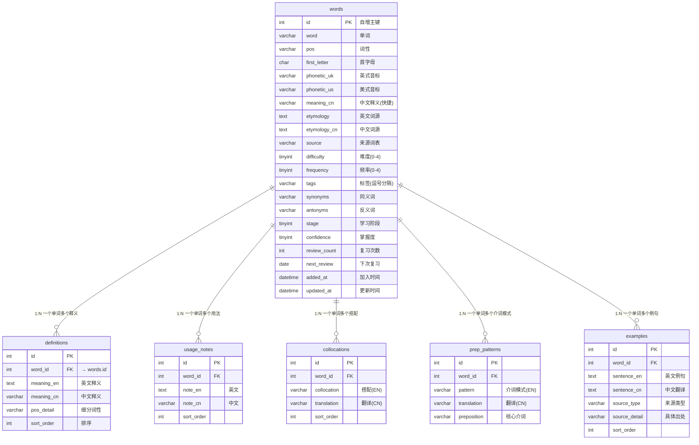

# 英语词汇知识库 · 数据库设计文档

> **版本:** v3（最终版）
> **数据源:** `a_verbs_CET46.md`（148 动词，771 介词搭配，771 条例句）
> **数据库:** MySQL 8.0+ / MariaDB 10.5+

---

## 目录

- [英语词汇知识库 · 数据库设计文档](#英语词汇知识库--数据库设计文档)
  - [目录](#目录)
  - [一、需求概述](#一需求概述)
  - [二、逻辑数据模型](#二逻辑数据模型)
    - [2.1 核心实体](#21-核心实体)
    - [2.2 ER 图](#22-er-图)
    - [2.3 实体关系说明](#23-实体关系说明)
  - [三、物理数据模型](#三物理数据模型)
    - [3.1 words — 词汇主表（核心）](#31-words--词汇主表核心)
    - [3.2 definitions — 释义表](#32-definitions--释义表)
    - [3.3 usage\_notes — 用法说明表](#33-usage_notes--用法说明表)
    - [3.4 collocations — 固定搭配表](#34-collocations--固定搭配表)
    - [3.5 prep\_patterns — 介词搭配表](#35-prep_patterns--介词搭配表)
    - [3.6 examples — 例句表](#36-examples--例句表)
  - [四、表关系图](#四表关系图)
  - [五、索引策略](#五索引策略)
  - [六、合并决策与规范化分析](#六合并决策与规范化分析)
    - [6.1 合并记录](#61-合并记录)
    - [6.2 反规范化说明](#62-反规范化说明)
  - [七、查询模式](#七查询模式)
    - [7.1 单词完整信息查询](#71-单词完整信息查询)
    - [7.2 间隔重复复习队列](#72-间隔重复复习队列)
    - [7.3 按首字母词性检索](#73-按首字母词性检索)
    - [7.4 介词搭配查询](#74-介词搭配查询)
    - [7.5 学习进度统计](#75-学习进度统计)
    - [7.6 新增单词追踪](#76-新增单词追踪)
  - [八、部署与使用](#八部署与使用)

---

## 一、需求概述

### 1.1 业务目标

建立个人英语词汇知识库，支持以下核心场景：

- **记录**：存储单词的发音、释义、词源、用法说明
- **学习**：通过搭配、介词模式、真题例句加深理解
- **复习**：间隔重复机制，自动排期
- **检索**：按字母、词性、来源、难度多维度查询

### 1.2 词类兼容性

| 词类 | words | definitions | usage_notes | collocations | prep_patterns | examples |
|:----:|:-----:|:-----------:|:-----------:|:------------:|:-------------:|:--------:|
| 动词 | ✅ | ✅ | ✅ | ✅ | ✅（核心） | ✅ |
| 名词 | ✅ | ✅ | ✅ | ✅ | ❌ | ✅ |
| 形容词 | ✅ | ✅ | ✅ | ✅ | ❌ | ✅ |
| 副词 | ✅ | ✅ | ✅ | ⚠️ 较少 | ❌ | ✅ |

---

## 二、逻辑数据模型

### 2.1 核心实体

```
┌─────────────────────────────────────────────────────────┐
│                        words                            │
│  (单词主表 — 每个单词一条记录，包含学习进度)              │
└─────────────────────────────────────────────────────────┘
         │ 1                      │ 1                    │ 1
         │ *                      │ *                    │ *
   ┌─────┴──────┐          ┌──────┴──────┐        ┌──────┴──────┐
   │definitions │          │usage_notes  │        │collocations │
   │  释义表    │          │  用法说明表  │        │  搭配表     │
   └────────────┘          └─────────────┘        └─────────────┘
         │ 1
         │ *
   ┌─────┴──────┐
   │prep_patterns│
   │ 介词搭配表  │
   └─────────────┘
         │ 1
         │ *
   ┌─────┴──────┐
   │ examples   │
   │  例句表    │
   └────────────┘
```

### 2.2 ER 图



### 2.3 实体关系说明

| 主实体 | 子实体 | 基数 | 外键 | 说明 |
|--------|--------|:----:|------|------|
| words | definitions | 1:N | word_id | 一词多义（如 bear 可作动词/名词） |
| words | usage_notes | 1:N | word_id | 多个用法提示 |
| words | collocations | 1:N | word_id | 多个固定搭配 |
| words | prep_patterns | 1:N | word_id | 多个介词模式（动词为主） |
| words | examples | 1:N | word_id | 多条不同来源的例句 |

> **注意：** 没有使用物理外键约束（`FOREIGN KEY`），所有关联通过应用层保证。这样做的好处是：批量导入时无需考虑插入顺序，删除数据时不受约束限制。

---

## 三、物理数据模型

### 3.1 words — 词汇主表（核心）

```sql
CREATE TABLE words (
    id              INT             AUTO_INCREMENT PRIMARY KEY COMMENT '主键',
    word            VARCHAR(50)     NOT NULL COMMENT '单词',
    pos             VARCHAR(30)     NOT NULL COMMENT '词性 (vt./vi./n./adj./adv.)',
    first_letter    CHAR(1)         NOT NULL COMMENT '首字母分区键',

    -- 发音
    phonetic_uk     VARCHAR(100)    NULL     COMMENT '英式音标 (IPA)',
    phonetic_us     VARCHAR(100)    NULL     COMMENT '美式音标 (IPA)',

    -- 释义与词源
    meaning_cn      VARCHAR(500)    NULL     COMMENT '中文释义（摘要，列表用）',
    etymology       TEXT            NULL     COMMENT '词源（英文）',
    etymology_cn    TEXT            NULL     COMMENT '词源（中文）',

    -- 分类维度
    source          VARCHAR(100)    NULL     COMMENT '来源词表 (CET-4,CET-6,考研,TOEFL,IELTS,GRE)',
    difficulty      TINYINT         NOT NULL DEFAULT 0 COMMENT '难度 0-4',
    frequency       TINYINT         NOT NULL DEFAULT 0 COMMENT '频次 0-4',
    tags            VARCHAR(500)    NULL     COMMENT '标签 (逗号分隔，如 "科技,法律,商务")',

    -- 语义关联
    synonyms        VARCHAR(500)    NULL     COMMENT '同义词 (逗号分隔)',
    antonyms        VARCHAR(500)    NULL     COMMENT '反义词 (逗号分隔)',

    -- 学习状态（间隔重复）
    stage           TINYINT         NOT NULL DEFAULT 0 COMMENT '学习阶段: 0=未学 1=学习中 2=复习中 3=已掌握',
    confidence      TINYINT         NOT NULL DEFAULT 0 COMMENT '掌握度 0-5',
    review_count    INT             NOT NULL DEFAULT 0 COMMENT '复习次数',
    next_review     DATE            NULL     COMMENT '下次复习日期',

    -- 时间审计
    added_at        DATETIME        NOT NULL DEFAULT CURRENT_TIMESTAMP COMMENT '加入知识库时间',
    updated_at      DATETIME        NOT NULL DEFAULT CURRENT_TIMESTAMP ON UPDATE CURRENT_TIMESTAMP COMMENT '最后修改时间',

    UNIQUE KEY uk_word (word)
) ENGINE=InnoDB DEFAULT CHARSET=utf8mb4 COLLATE=utf8mb4_unicode_ci COMMENT='词汇主表';
```

**字段依赖与约束矩阵：**

| 字段分组 | 字段 | 必填 | 默认值 | 依赖关系 |
|----------|------|:----:|:------:|----------|
| 标识 | id, word | ✅ | — | word UNIQUE |
| 词性 | pos, first_letter | ✅ | — | 无 |
| 发音 | phonetic_uk, phonetic_us | ❌ | NULL | 无 |
| 释义 | meaning_cn | ❌ | NULL | 无 |
| 词源 | etymology, etymology_cn | ❌ | NULL | 无 |
| 分类 | source, difficulty, frequency, tags | ❌ | difficulty=0, frequency=0 | 无 |
| 语义 | synonyms, antonyms | ❌ | NULL | 无 |
| 学习 | stage, confidence, review_count, next_review | ❌ | stage=0, confidence=0, review_count=0 | next_review ≥ 新增日 |
| 时间 | added_at, updated_at | ❌ | CURRENT_TIMESTAMP | 无 |

### 3.2 definitions — 释义表

```sql
CREATE TABLE definitions (
    id              INT             AUTO_INCREMENT PRIMARY KEY,
    word_id         INT             NOT NULL COMMENT '→ words.id',
    meaning_en      TEXT            NOT NULL COMMENT '英文释义',
    meaning_cn      VARCHAR(500)    NOT NULL COMMENT '中文释义',
    pos_detail      VARCHAR(30)     NULL     COMMENT '细分词性（与主表 pos 不同时填写）',
    sort_order      INT             NOT NULL DEFAULT 0 COMMENT '排序（从小到大）',

    INDEX idx_word (word_id)
) ENGINE=InnoDB DEFAULT CHARSET=utf8mb4 COMMENT='释义表 — 一词多义';
```

**设计说明：** 一个单词可能对应多个词性（如 `record` 可作名词"记录"和动词"录制"），此时主表 `pos` 填 `n./vt.`，细分的词性填入本表 `pos_detail`。查询时按 `sort_order` 排序。

### 3.3 usage_notes — 用法说明表

```sql
CREATE TABLE usage_notes (
    id              INT             AUTO_INCREMENT PRIMARY KEY,
    word_id         INT             NOT NULL COMMENT '→ words.id',
    note_en         TEXT            NOT NULL COMMENT '英文说明',
    note_cn         VARCHAR(500)    NOT NULL COMMENT '中文说明',
    sort_order      INT             NOT NULL DEFAULT 0 COMMENT '排序',

    INDEX idx_word (word_id)
) ENGINE=InnoDB DEFAULT CHARSET=utf8mb4 COMMENT='用法说明表';
```

### 3.4 collocations — 固定搭配表

```sql
CREATE TABLE collocations (
    id              INT             AUTO_INCREMENT PRIMARY KEY,
    word_id         INT             NOT NULL COMMENT '→ words.id',
    collocation     VARCHAR(200)    NOT NULL COMMENT '搭配（英文）',
    translation     VARCHAR(200)    NOT NULL COMMENT '翻译（中文）',
    sort_order      INT             NOT NULL DEFAULT 0 COMMENT '排序',

    INDEX idx_word (word_id)
) ENGINE=InnoDB DEFAULT CHARSET=utf8mb4 COMMENT='固定搭配表';
```

### 3.5 prep_patterns — 介词搭配表

```sql
CREATE TABLE prep_patterns (
    id              INT             AUTO_INCREMENT PRIMARY KEY,
    word_id         INT             NOT NULL COMMENT '→ words.id（通常为动词）',
    pattern         VARCHAR(200)    NOT NULL COMMENT '介词模式（英文）',
    translation     VARCHAR(200)    NOT NULL COMMENT '中文翻译',
    preposition     VARCHAR(20)     NULL     COMMENT '核心介词 (to/for/of/with/from/in/on/at/about/against/into/through/toward/upon/by/as)',

    INDEX idx_word (word_id),
    INDEX idx_prep (preposition)
) ENGINE=InnoDB DEFAULT CHARSET=utf8mb4 COMMENT='介词搭配表';
```

**核心约束：** `preposition` 字段建立了单独的索引，用于「查询某个介词的所有搭配动词」这一高频查询。

### 3.6 examples — 例句表

```sql
CREATE TABLE examples (
    id              INT             AUTO_INCREMENT PRIMARY KEY,
    word_id         INT             NOT NULL COMMENT '→ words.id',
    sentence_en     TEXT            NOT NULL COMMENT '英文例句',
    sentence_cn     TEXT            NOT NULL COMMENT '中文翻译',
    source_type     VARCHAR(30)     NULL     COMMENT '来源分类: CET46/KAOYAN/TOEFL/IELTS/ACADEMIC/COMMON',
    source_detail   VARCHAR(200)    NULL     COMMENT '具体出处 (如 CET-4 2021-06, Nature 2021)',
    sort_order      INT             NOT NULL DEFAULT 0 COMMENT '排序',

    INDEX idx_word (word_id),
    INDEX idx_source (source_type)
) ENGINE=InnoDB DEFAULT CHARSET=utf8mb4 COMMENT='例句表';
```

**来源类型枚举：**

| source_type | 说明 | 标注示例 |
|-------------|------|----------|
| `CET46` | 大学英语四六级 | CET-4 2021-06 |
| `KAOYAN` | 考研英语 | 考研英语 2020 |
| `TOEFL` | 托福 | TOEFL TPO 54 |
| `IELTS` | 雅思 | IELTS Cambridge 16 |
| `ACADEMIC` | 学术期刊 | Nature 2021, Science 2020, The Lancet 2022 |
| `COMMON` | 日常表达 | — |

---

## 四、表关系图

```
┌──────────────────────────────────────────────────────────────────────────────┐
│                                  words                                       │
├──────────────────────────────────────────────────────────────────────────────┤
│ id (PK)                                                                      │
│ word (UK) ● pos ● first_letter                                              │
│ phonetic_uk ● phonetic_us                                                    │
│ meaning_cn √                                                                 │
│ etymology √ ● etymology_cn √                                                 │
│ source √ ● difficulty ● frequency ● tags √                                   │
│ synonyms √ ● antonyms √                                                      │
│ stage ● confidence ● review_count ● next_review                              │
│ added_at ● updated_at                                                       │
└──────┬───────────────────────────────────────────────────────────────────────┘
       │
       ├──────────────────────────────────────────────────────────────────┐
       │         │              │               │                        │
       ▼         ▼              ▼               ▼                        ▼
┌──────────┐ ┌──────────┐ ┌──────────┐ ┌──────────────┐ ┌──────────────┐
│definitio│ │usage_not│ │collocatio│ │prep_patterns │ │  examples    │
│ns       │ │es       │ │ns       │ │              │ │              │
├─────────┤ ├─────────┤ ├─────────┤ ├──────────────┤ ├──────────────┤
│id (PK)  │ │id (PK)  │ │id (PK)  │ │id (PK)       │ │id (PK)       │
│word_id  │ │word_id  │ │word_id  │ │word_id       │ │word_id       │
│meaning_e│ │note_en  │ │collocati│ │pattern       │ │sentence_en   │
│meaning_c│ │note_cn  │ │translat │ │translation   │ │sentence_cn   │
│pos_detai│ │sort_orde│ │sort_orde│ │preposition   │ │source_type   │
│sort_orde│ └─────────┘ └─────────┘ │ INDEX(prep)  │ │source_detail │
└─────────┘                         └──────────────┘ │sort_order    │
                                                      └──────────────┘
```

---

## 五、索引策略

```sql
-- words: 查询入口
ALTER TABLE words ADD INDEX idx_first_letter (first_letter);   -- 按字母浏览
ALTER TABLE words ADD INDEX idx_pos (pos);                     -- 按词性筛选
ALTER TABLE words ADD INDEX idx_stage (stage);                 -- 学习阶段
ALTER TABLE words ADD INDEX idx_next_review (next_review);     -- 复习队列
ALTER TABLE words ADD INDEX idx_added_at (added_at);           -- 新词排序
ALTER TABLE words ADD INDEX idx_difficulty (difficulty);       -- 难度筛选

-- prep_patterns: 介词查询
ALTER TABLE prep_patterns ADD INDEX idx_prep (preposition);

-- examples: 来源分类
ALTER TABLE examples ADD INDEX idx_source (source_type);
```

**索引选择说明：**

| 索引 | 查询场景 | 选择性 |
|------|----------|--------|
| `first_letter` | WHERE first_letter='A' | 高（26 个值均匀分布） |
| `stage` | WHERE stage=1 AND next_review<=TODAY | 中（4 个值，但结合日期过滤） |
| `next_review` | 复习排序列 | 低（日期范围扫描，但不可缺） |
| `preposition` | WHERE preposition='to' | 高（10+ 个介词值） |

---

## 六、合并决策与规范化分析

### 6.1 合并记录

**合并动机：** 原始设计（v2）包含 13 张表，过于范式化，对于个人学习场景产生了不必要的 JOIN 开销。

| 原表（v2） | 现位置 | 合并理由 |
|-----------|--------|----------|
| `example_sources` | → `examples.source_type` | 来源类型仅 6 种固定值，无需独立表，减少 1 次 JOIN |
| `learning_progress` | → `words` 字段 | 每个单词唯一一条进度记录，无 1:N 需求 |
| `review_history` | → `words.review_count` | 个人场景只需统计次数，无需明细 |
| `word_relationships` | → `words.synonyms/.antonyms` | 关系类型简单，逗号分隔更直观 |
| `tags` + `word_tags` | → `words.tags` | 标签无层级结构，逗号分隔即可 |
| `word_forms` | 移除（可选 JSON） | 动词变形可从规则推导，非常用 |
| `word_media` | 移除（可选 JSON） | 当前无多媒体需求 |

### 6.2 反规范化说明

已进行的反规范化（Denormalization）：

| 字段 | 违反的范式 | 理由 |
|------|-----------|------|
| `words.synonyms`, `.antonyms` | 2NF（重复组） | 个人场景无复杂图查询需求，逗号分隔便于展示 |
| `words.tags` | 2NF（重复组） | 标签无元数据、无层级，逗号分隔足够 |
| `words.stage`, `.confidence`, `.review_count`, `.next_review` | 3NF（传递依赖） | 避免每次查进度都要 JOIN，提高复习队列查询性能 |
| `words.meaning_cn` | 3NF（冗余） | 列表展示时快速显示，避免 JOIN definitions 表 |

**保留的规范化结构：**
- `definitions`：一词多义 → 1:N 独立表
- `examples`：一词多例句 → 1:N 独立表
- `collocations`、`prep_patterns`、`usage_notes`：1:N 独立表

---

## 七、查询模式

### 7.1 单词完整信息查询

```sql
SELECT
    w.word, w.phonetic_uk, w.meaning_cn,
    d.meaning_en, d.meaning_cn,
    u.note_en, u.note_cn,
    c.collocation, c.translation,
    p.pattern, p.translation, p.preposition,
    e.sentence_en, e.sentence_cn, e.source_type, e.source_detail
FROM words w
LEFT JOIN definitions d      ON d.word_id = w.id
LEFT JOIN usage_notes u      ON u.word_id = w.id
LEFT JOIN collocations c     ON c.word_id = w.id
LEFT JOIN prep_patterns p    ON p.word_id = w.id
LEFT JOIN examples e         ON e.word_id = w.id
WHERE w.word = 'abandon'
ORDER BY d.sort_order, c.sort_order, p.id, e.sort_order;
```

### 7.2 间隔重复复习队列

```sql
SELECT word, meaning_cn, phonetic_uk, stage, confidence
FROM words
WHERE next_review <= CURDATE()
  AND stage IN (1, 2)
ORDER BY next_review ASC, confidence ASC
LIMIT 20;
```

### 7.3 按首字母词性检索

```sql
SELECT word, pos, meaning_cn, difficulty, frequency
FROM words
WHERE first_letter = 'A' AND pos LIKE 'v%'
ORDER BY frequency DESC, difficulty DESC;
```

### 7.4 介词搭配查询

```sql
SELECT w.word, w.pos, p.pattern, p.translation
FROM prep_patterns p
JOIN words w ON w.id = p.word_id
WHERE p.preposition = 'to'
ORDER BY w.word;
```

### 7.5 学习进度统计

```sql
SELECT
    stage,
    COUNT(*)                             AS word_count,
    ROUND(COUNT(*) * 100.0 / SUM(COUNT(*)) OVER(), 1) AS pct
FROM words
GROUP BY stage
ORDER BY stage;
```

### 7.6 新增单词追踪

```sql
-- 今天加入的
SELECT word, pos, difficulty, added_at
FROM words
WHERE DATE(added_at) = CURDATE()
ORDER BY added_at DESC;

-- 按周统计新增
SELECT
    DATE_FORMAT(added_at, '%Y-%u') AS week,
    COUNT(*)                       AS new_words
FROM words
GROUP BY week
ORDER BY week DESC;
```

---

## 八、部署与使用

```bash
# 1. 创建数据库
mysql -u root -p < schema.sql

# 2. 连接
mysql -h localhost -u root -p word_learning

# 3. 导入数据
source /path/to/data.sql;

# 4. 验证
SHOW TABLES;
SELECT COUNT(*) FROM words;
```

### 文件清单

| 文件 | 说明 |
|------|------|
| `schema.sql` | 完整建表语句（6 表 + 索引 + 示例数据） |
| `design_doc.md` | 本文档 |
