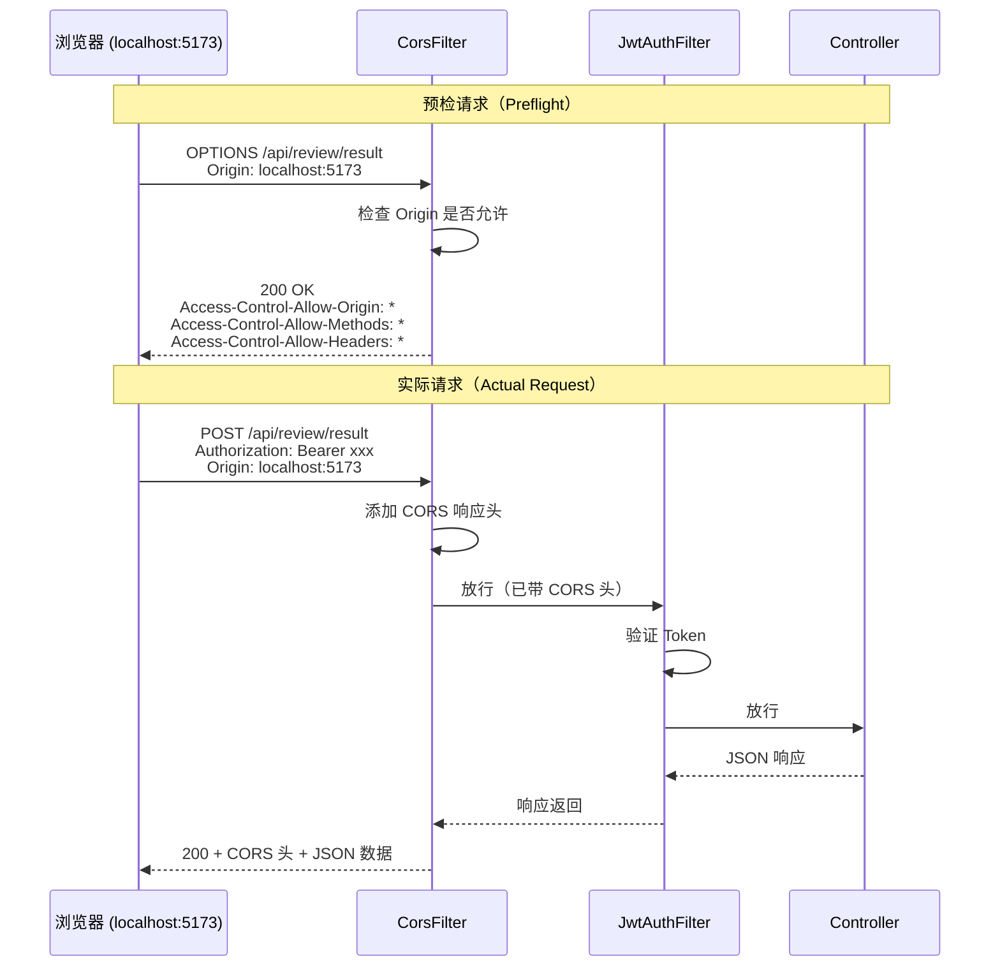
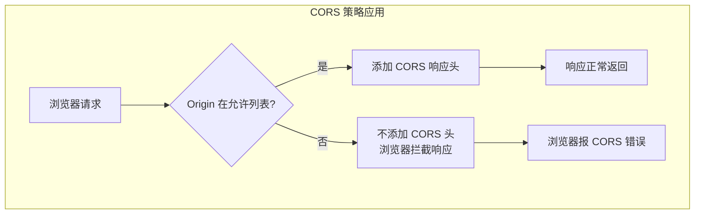
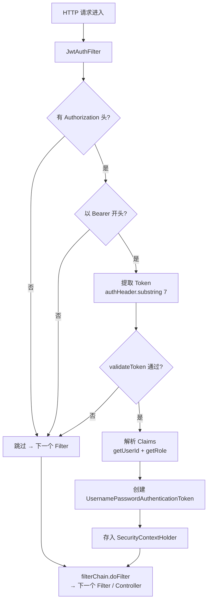
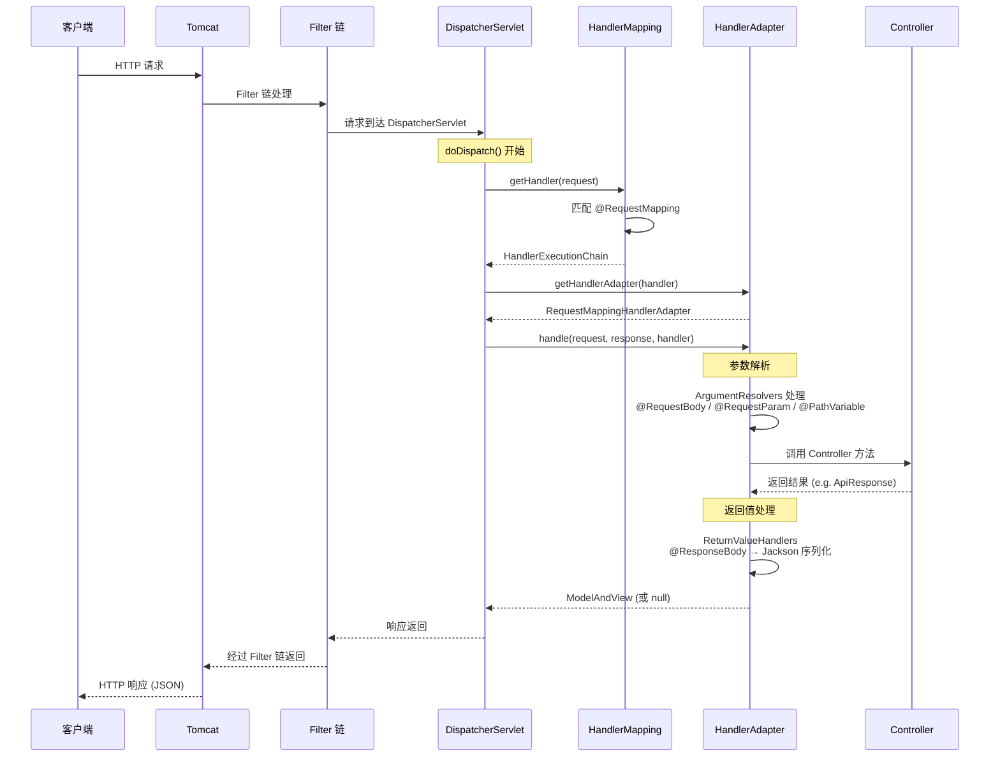
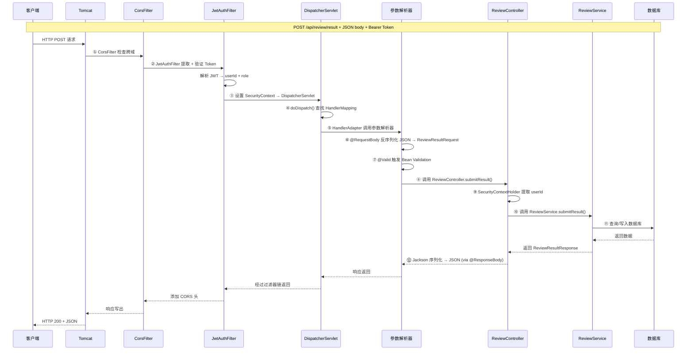
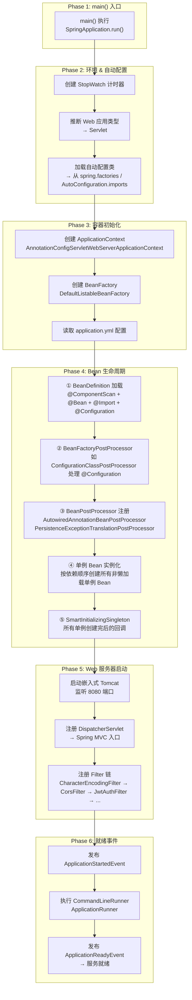
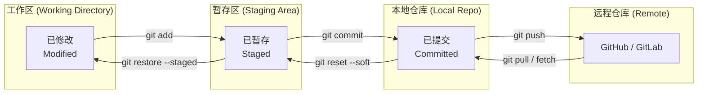
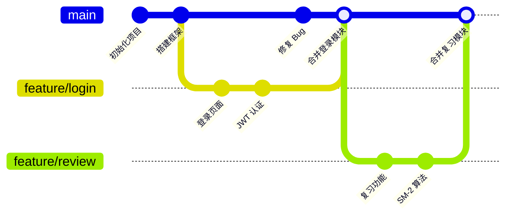
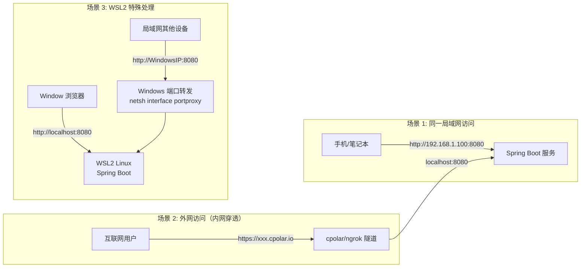

# 英语学习平台 — 后端技术文档

> 版本 1.0.0 | Spring Boot 3.2.4 | Java 17 | MySQL 8.0  
> 总代码量 ~12,000 行 Java | 150 源文件 | 36 数据库表 | 60+ API 端点

---

## 目录

1. [项目概述](#1-项目概述)
2. [技术栈详解](#2-技术栈详解)
3. [项目结构](#3-项目结构)
4. [请求-响应全流程可视化](#4-请求-响应全流程可视化)
5. [代码层逐层解读](#5-代码层逐层解读)
6. [数据库设计](#6-数据库设计)
7. [API 设计](#7-api-设计)
8. [认证与安全](#8-认证与安全)
9. [核心业务逻辑](#9-核心业务逻辑)
10. [配置说明](#10-配置说明)
11. [部署与运行](#11-部署与运行)
12. [附录](#12-附录)

---

## 1. 项目概述

英语学习平台后端服务，单词学习、复习测验、阅读文章、收藏管理、学习计划、错题本、排行榜等完整功能的 RESTful API。

### 功能模块矩阵

| 模块 | 核心价值 | 关键 API | 数据表依赖 |
|---|---|---|---|
| 用户认证 | 身份鉴权 | 3 | users, user_stats |
| Dashboard | 学习总览 | 2 | learning_activities, user_stats, daily_recommendations |
| 词典搜索 | 查词入口 | 5 | words, search_history |
| 单词详情 | 深度学词 | 10 | words + 10 张子表 |
| 学习卡片 | 每日学习 | 3 | user_daily_plan_entries, daily_plan_items |
| 复习测验 | 间隔重复 | 4 | review_log, words (SM-2) |
| 阅读文章 | 阅读学词 | 5 | articles, reading_progress |
| 收藏管理 | 知识沉淀 | 14 | favorite_folders, favorites |
| 错题本 | 薄弱攻克 | 2 | review_log |
| 学习计划 | 系统学习 | 9 | learning_plans, user_plans |
| 单词本 | 词库浏览 | 10 | word_books, word_book_entries |
| 个人中心 | 数据统计 | 10 | users, user_stats, user_settings |
| 排行榜 | 社交激励 | 2 | user_stats, learning_activities |
| 管理后台 | 运营管理 | 9 | users, words, content_ratings |

---

## 2. 技术栈详解

### 2.1 核心框架

本项目基于 **Spring Boot 3.2.4**，整合 Spring Data JPA、Spring Security、Spring Validation 三大模块。下面逐一讲解"为什么选它"、"它做了什么"、"在本项目里怎么用"。

---

#### ① Spring Boot 3.2.4 — 应用的底座

##### 为什么选 Spring Boot，而不是传统 Spring？

| 对比维度 | 传统 Spring | Spring Boot |
|---|---|---|
| 配置方式 | 手写 XML（beans.xml、web.xml……几十行起步） | 零 XML，全注解 + `application.yml` |
| 容器 | 需部署到外部 Tomcat（打 WAR 包） | 内嵌 Tomcat / Jetty，`java -jar` 直接跑 |
| 依赖管理 | 手动管理版本号（经常冲突） | `spring-boot-starter-parent` 统一版本 |
| 自动配置 | 无——自己要配 DataSource、EntityManager、TransactionManager | 有——classpath 有 `spring-boot-starter-web` 就自动配好 |

**一句话**：Spring Boot = Spring（框架功能）+ 自动配置 + 嵌入式服务器 + 生产就绪特性。

##### @SpringBootApplication 到底做了什么？

```java
// 项目入口：WordLearningApplication.java
package com.wordlearning;

import org.springframework.boot.SpringApplication;
import org.springframework.boot.autoconfigure.SpringBootApplication;

@SpringBootApplication  // ★ 这不是一个简单的注解，而是三个注解的组合
public class WordLearningApplication {
    public static void main(String[] args) {
        SpringApplication.run(WordLearningApplication.class, args);
        // 就这一行，启动了：内嵌 Tomcat + 所有 Bean + JPA + Security + ...
    }
}
```

`@SpringBootApplication` 合并了三个注解：

| 注解 | 作用 | 本项目的体现 |
|---|---|---|
| `@Configuration` | 标记当前类为配置类，允许在里面写 `@Bean` | 当前文件虽然没有 `@Bean`，但 Spring 用这个标记知道"这里是配置入口" |
| `@EnableAutoConfiguration` | **自动配置**——根据 classpath 上的 jar 自动推断要配什么 | 发现有 `spring-boot-starter-web` → 自动配置 Tomcat + DispatcherServlet；有 `spring-boot-starter-data-jpa` → 自动配 DataSource + EntityManagerFactory + TransactionManager；有 `spring-boot-starter-security` → 自动配 SecurityFilterChain 等 |
| `@ComponentScan` | 扫描当前包及其子包，找到所有 `@Component`、`@Service`、`@Repository`、`@Controller` 并注册为 Bean | 扫描 `com.wordlearning` 下所有类——自动发现 `AuthService`、`ReviewController`、`UserRepository` 等 |

##### SpringApplication.run() 内部做了什么？（概要，详见 5.8）

```java
SpringApplication.run(WordLearningApplication.class, args)
    │
    ├── ① 创建 SpringApplication 实例
    │     - 推断应用类型: Servlet 环境（因为 classpath 有 Tomcat）
    │     - 读取 META-INF/spring/org.springframework.boot.autoconfigure.AutoConfiguration.imports
    │       （这里列出了所有自动配置类，如 JpaRepositoriesAutoConfiguration）
    │     - 设置 ApplicationContext 类型: AnnotationConfigServletWebServerApplicationContext
    │
    ├── ② 准备环境
    │     - 读取 application.yml
    │     - 设置 8080 端口、数据库连接、JWT 密钥等
    │
    ├── ③ 创建并刷新 ApplicationContext
    │     - 创建 BeanFactory（所有 Bean 的容器）
    │     - 执行 BeanDefinition 加载（@ComponentScan → 发现所有类）
    │     - 执行 BeanFactoryPostProcessor（如 @Configuration 的 @Bean 方法增强）
    │     - 注册 BeanPostProcessor（如 @Autowired 注入处理器、@Transactional AOP 处理器）
    │     - 实例化所有单例 Bean（触发构造器、@PostConstruct）
    │     - 启动嵌入式 Web 服务器（Tomcat 监听 8080）
    │
    └── ④ 发布事件
          - ApplicationStartedEvent
          - ApplicationReadyEvent → 服务就绪
```

---

#### ② Spring Data JPA — 数据访问层

##### 为什么选 JPA 而不是 MyBatis？

这个项目有 **80+ 实体类**和 **40+ 数据访问接口**，如果每个接口都需要写 SQL，工作量巨大。JPA 的方法命名查询可以自动生成 SQL，大幅提升开发效率。

| 对比维度 | JPA (Hibernate) | MyBatis |
|---|---|---|
| 开发效率 | 高——方法名即查询，无需写 SQL | 低——每接口配 XML 或注解 SQL |
| 关联查询 | `@Entity` 映射自动 JOIN | 手写 SQL JOIN |
| 动态查询 | `Specification` / `@Query` | `<if>` 标签或注解拼 SQL |
| 学习成本 | 中（需要理解实体状态、懒加载） | 低（你写 SQL 你掌控） |
| 细粒度 SQL 控制 | 弱（复杂的 SQL 优化困难） | 强（DBA 可以直接改 SQL） |
| 一级缓存 | 有（同一事务内多次查询不重复查库） | 无 |

##### 三种查询方式在本项目中的实际应用

```java
// ────────────────────────────────────────────────
// 方式一：方法命名查询（最常用，零 SQL）
// ────────────────────────────────────────────────
// UserRepository.java
public interface UserRepository extends JpaRepository<User, Long> {
    Optional<User> findByUsername(String username);   // → WHERE username = ?
    Optional<User> findByEmail(String email);          // → WHERE email = ?
    Optional<User> findByUuid(String uuid);             // → WHERE uuid = ?
}

// findByUsername 会自动翻译成：
//   SELECT * FROM users WHERE username = ?
// Spring Data JPA 根据方法名解析："findBy" + "Username" → WHERE username = param

// ────────────────────────────────────────────────
// 方式一的更多示例（项目中实际使用的模式）
// ────────────────────────────────────────────────
// ReviewLogRepository.java
List<ReviewLog> findByUserIdAndWordIdAndIsCorrectFalseOrderByReviewedAtDesc(
    Long userId, Long wordId);
// → WHERE user_id = ? AND word_id = ? AND is_correct = FALSE ORDER BY reviewed_at DESC
// 方法名一共 9 个单词，翻译成 3 个条件 + 1 个排序——零代码实现复杂查询

// ────────────────────────────────────────────────
// 方式二：@Query JPQL（复杂统计查询）
// ────────────────────────────────────────────────
// 同样是 ReviewLogRepository.java
@Query("SELECT rl.wordId, COUNT(rl) AS cnt FROM ReviewLog rl " +
       "WHERE rl.userId = :uid AND rl.isCorrect = false " +
       "GROUP BY rl.wordId ORDER BY cnt DESC")
List<Object[]> countWrongWordsByUser(@Param("uid") Long userId, Pageable p);
// 这里必须用 @Query，因为 GROUP BY + COUNT 无法从方法名推导

// ────────────────────────────────────────────────
// 方式三：默认方法（findById, findAll, save, delete 直接继承自 JpaRepository）
// ────────────────────────────────────────────────
userRepository.findById(1L);      // → SELECT * FROM users WHERE id = 1
userRepository.save(user);        // → INSERT INTO users ...（新实体）或 UPDATE ...（已有 ID）
userRepository.delete(user);      // → DELETE FROM users WHERE id = ?
```

##### JPA 实体映射示例

```java
// User.java — 映射到 users 表
@Entity                          // 告诉 JPA：这个类对应数据库的一张表
@Table(name = "users")           // 指定表名（默认是类名 User → user 表）
@Data                            // Lombok: 生成 getter/setter/toString
@NoArgsConstructor               // JPA 需要无参构造器
@Builder                         // 方便链式创建 User.builder().username(...).build()
public class User {

    @Id                         // 主键
    @GeneratedValue(strategy = GenerationType.IDENTITY)  // 自增主键
    private Long id;

    @Column(nullable = false, unique = true, length = 50)
    private String username;     // VARCHAR(50) NOT NULL UNIQUE

    @Column(name = "password_hash", nullable = false, length = 255)
    private String passwordHash; // 列名是 password_hash（Java 字段是 camelCase，数据库是 snake_case）

    @Enumerated(EnumType.STRING) // 枚举存字符串（"admin" / "editor" / "user"），而非索引数字
    @Column(nullable = false, length = 20)
    private Role role;

    @Column(name = "created_at", nullable = false, updatable = false)
    private LocalDateTime createdAt;

    @PrePersist                    // 保存前自动执行
    protected void onCreate() {
        if (uuid == null) {
            uuid = UUID.randomUUID().toString();
        }
        createdAt = LocalDateTime.now();
        updatedAt = LocalDateTime.now();
    }

    public enum Role {
        admin, editor, user
    }
}
```

**为什么用 `uuid`（字符串）而不是直接用 `id`（长整型）作为对外标识？**
- 安全性：`id=1` 暴露用户数量，且容易被遍历攻击
- 灵活性：UUID 在分布式场景不会冲突
- JWT 中存储的是 UUID 而非 ID

---

#### ③ Spring Security — 认证与授权

##### 三层安全模型

```
┌─────────────────────────────────────────────────────────────┐
│ 第1层: SecurityFilterChain                                  │
│ 作用: 定义哪些 URL 需要什么权限、哪些开放                      │
│ 配置: SecurityConfig.java                                    │
│                                                             │
│  ┌─ /api/auth/**        → 所有人可访问（注册、登录）          │
│  ├─ /api/admin/**       → 仅 ADMIN 角色可访问                │
│  ├─ GET /api/badges     → 所有人可访问                       │
│  └─ 其他路径            → 必须登录（有有效 JWT Token）         │
├─────────────────────────────────────────────────────────────┤
│ 第2层: JwtAuthFilter（自定义过滤器）                          │
│ 作用: 每个请求拦截，从 Header 中提取 JWT Token，验证签名和     │
│        过期时间，解析出用户身份，设置到安全上下文               │
│ 位置: 在 UsernamePasswordAuthenticationFilter 之前执行        │
│                                                             │
│ 流程: Request → JwtAuthFilter.doFilterInternal()             │
│         │                                                    │
│         ├─ 有 Authorization: Bearer xxx?                     │
│         │   ├─ 无 → 放行（后续被第 1 层拦截）                │
│         │   └─ 有 → validateToken()                         │
│         │        ├─ 无效 → 放行（同上）                      │
│         │        └─ 有效 → 解析 userId + role                │
│         │              → 创建 UsernamePasswordAuthenticationToken│
│         │              → 放入 SecurityContextHolder          │
│         └─ 继续执行过滤器链                                   │
├─────────────────────────────────────────────────────────────┤
│ 第3层: SecurityContextHolder                                 │
│ 作用: 线程级缓存，存当前登录用户信息                          │
│ 使用: 在任何地方通过静态方法读取                              │
│                                                             │
│  String userId = (String) SecurityContextHolder               │
│      .getContext()                                           │
│      .getAuthentication()                                    │
│      .getPrincipal();                                        │
│                                                             │
│ 注意: 每个请求一个线程，请求结束自动清理（SecurityContextHolder.│
│       setStrategyName(MODE_INHERITABLETHREADLOCAL)）          │
└─────────────────────────────────────────────────────────────┘
```

##### 完整配置代码（逐行解读）

```java
// SecurityConfig.java
@Configuration
@EnableWebSecurity          // 开启 Spring Security 的 Web 安全支持
@RequiredArgsConstructor    // 注入 JwtAuthFilter
public class SecurityConfig {

    private final JwtAuthFilter jwtAuthFilter;

    @Bean
    public SecurityFilterChain filterChain(HttpSecurity http) throws Exception {
        http
            // ① 关闭 CSRF（跨站请求伪造防护）
            // 为什么？JWT 无状态，Token 存在 Header 里，CSRF 攻击需要利用 Cookie
            // 我们的请求不依赖 Cookie 做认证，所以 CSRF 防护没必要
            .csrf(csrf -> csrf.disable())

            // ② 无状态会话（STATELESS）
            // 为什么？传统 Security 用 HttpSession 存登录状态
            // 但 JWT 方案不需要 Session——每次请求都带 Token
            // 还能水平扩展（负载均衡时不用共享 Session）
            .sessionManagement(sm -> sm.sessionCreationPolicy(STATELESS))

            // ③ 定义 URL 权限矩阵
            .authorizeHttpRequests(auth -> auth
                // 登录/注册路径 → 完全开放（不需要 Token）
                .requestMatchers("/api/auth/**").permitAll()
                // 管理员路径 → 需要 ADMIN 角色
                .requestMatchers("/api/admin/**").hasRole("ADMIN")
                // GET /api/badges → 开放（方便前端展示排行榜）
                .requestMatchers(HttpMethod.GET, "/api/badges").permitAll()
                // 其它所有请求 → 必须认证（有有效 Token）
                .anyRequest().authenticated()
            )

            // ④ 插入自定义过滤器
            // 在 UsernamePasswordAuthenticationFilter 之前执行 JwtAuthFilter
            // 为什么要在这个位置？UsernamePasswordAuthenticationFilter 是 Security 默认的
            // 表单登录过滤器，我们希望在它之前就完成 Token 验证
            .addFilterBefore(jwtAuthFilter, UsernamePasswordAuthenticationFilter.class);

        return http.build();  // 组装成 SecurityFilterChain Bean
    }

    @Bean
    public PasswordEncoder passwordEncoder() {
        // BCrypt 密码编码器
        // 特点：自动加盐，每次加密结果不同
        // encode("password123") → $2a$10$N9qo8uLOickgx2ZMRZoMye...
        // matches("password123", hash) → true/false
        return new BCryptPasswordEncoder();
    }
}
```

##### 业务代码中如何获取当前登录用户？

```java
// AuthService.java
@Service
@RequiredArgsConstructor
@Transactional
public class AuthService {

    // ... 登录注册方法 ...

    // 获取当前登录用户 ID（这是最终被 Controller 调用的方式）
    public String getUserId() {
        // 这个 principal 就是 JwtUtil.generateToken() 传入的 userUuid
        // 它在 JwtAuthFilter 中被设置到 SecurityContextHolder
        return SecurityContextHolder.getContext()
                .getAuthentication()
                .getPrincipal()
                .toString();
    }
}

// 另一种常见用法（在 Controller 中直接获取）
@GetMapping("/profile")
public ApiResponse<UserProfile> getProfile() {
    String userId = (String) SecurityContextHolder.getContext()
            .getAuthentication()
            .getPrincipal();
    return ApiResponse.success(userService.getProfile(userId));
}
// 注意：只有经过 JwtAuthFilter 的请求，getAuthentication() 才不为 null
// 开放路径（/api/auth/**）不经过 JWT 验证，SecurityContextHolder 里没东西
```

---

#### ④ Spring Validation — 参数校验

##### 为什么用它？

```
用户输入 → [ Controller 方法之前 ] → Service → DB

如果没有 Validation：
  手动写 if (username == null || username.length() < 3) { throw ... }

如果有 Validation：
  DTO 加注解 → 自动校验 → 校验失败 → GlobalExceptionHandler 统一处理
  ↓                         ↓
  节省 80% 的校验代码       统一的错误格式（{code: 400, message: "..."}）
```

##### 在本项目中的完整流程

```java
// Step 1: DTO 中声明校验规则
// RegisterRequest.java
public class RegisterRequest {
    @NotBlank(message = "username is required")                    // 不能为 null 或空字符串
    @Size(min = 3, max = 20, message = "username 3-20 characters")
    private String username;

    @NotBlank
    @Size(min = 6, max = 128)
    private String password;

    @Email                                                         // 必须是合法的 email 格式
    @NotBlank
    private String email;

    private String nickname;                                       // 可选字段，不加校验注解
}

// Step 2: Controller 方法入口加 @Valid
// AuthController.java
@RestController
@RequestMapping("/api/auth")
@RequiredArgsConstructor
public class AuthController {

    @PostMapping("/register")
    public ApiResponse<LoginResponse> register(
            @Valid @RequestBody RegisterRequest req) {   // ★ @Valid 触发校验
        return ApiResponse.success(authService.register(req));
    }
}

// Step 3: 校验失败 → 自动抛出 MethodArgumentNotValidException
// Step 4: GlobalExceptionHandler 捕获并返回统一格式
// GlobalExceptionHandler.java
@ExceptionHandler(MethodArgumentNotValidException.class)
public ApiResponse<Void> handleValidation(MethodArgumentNotValidException ex) {
    String message = ex.getBindingResult().getFieldErrors().stream()
        .map(e -> e.getField() + ": " + e.getDefaultMessage())
        .collect(Collectors.joining("; "));
    return ApiResponse.error(400, message);
}
```

##### 完整的校验注解速查表

| 注解 | 作用 | 示例 |
|---|---|---|
| `@NotBlank` | 字符串不为 null 且去掉空格后长度 > 0 | `@NotBlank String username` |
| `@NotEmpty` | 集合/数组不为空 | `@NotEmpty List<String> tags` |
| `@Size(min, max)` | 字符串/集合长度范围 | `@Size(min=6, max=20) String password` |
| `@Min` / `@Max` | 数字范围 | `@Min(1) int page` |
| `@Email` | 邮箱格式 | `@Email String email` |
| `@Pattern(regexp)` | 正则匹配 | `@Pattern(regexp="^1[3-9]\\d{9}$") String phone` |
| `@Valid` | 嵌套校验 | `@Valid @RequestBody OrderReq req`（级联校验 OrderReq 内部的 DTO） |

---

#### ⑤ 四者如何协同工作？（全链路示例）

以"用户注册"为例，展示四个框架如何贯穿一个请求：

```
POST /api/auth/register
Body: {"username": "alice", "password": "123456", "email": "alice@test.com"}

                Spring MVC（来自 spring-boot-starter-web）
                │
                ├── DispatcherServlet 接收请求
                │   → HandlerMapping 匹配到 AuthController.register()
                │   → HandlerAdapter 准备调用方法
                │
                ├── Spring Validation（来自 spring-boot-starter-validation）
                │   → 参数解析器发现 @Valid @RequestBody RegisterRequest
                │   → 自动执行 RegisterRequest 上的校验注解
                │   → 如果失败 → GlobalExceptionHandler → 400 响应
                │   → 如果成功 → 把反序列化后的 RegisterRequest 传给方法
                │
                ├── Spring Security（来自 spring-boot-starter-security）
                │   → SecurityFilterChain 检查 /api/auth/register 是否开放
                │   → √ 此路径 permitAll() → 不需要认证（JwtAuthFilter 没解析 Token）
                │
                ├── Service 层（业务逻辑）
                │   → AuthService.register()
                │   → 调用 UserRepository（Spring Data JPA 自动实现）
                │   → userRepository.save(user) → INSERT INTO users ...
                │
                └── Response
                    → @ResponseBody（@RestController 自带）
                    → Jackson 把 LoginResponse 序列化成 JSON
                    → 返回给前端
```

### 2.2 认证与加密

| 组件 | 用途 | 实现细节 |
|---|---|---|
| **jjwt 0.12.5** | JWT 签发与验证 | HMAC-SHA256，24h 过期 |
| **BCryptPasswordEncoder** | 密码哈希 | 自动加盐，每次哈希结果不同 |

```java
// JwtUtil.java — 对称签名密钥，HMAC-SHA256
public String generateToken(String userUuid, String username, String role) {
    return Jwts.builder()
        .subject(userUuid)                       // 存入 user.uuid 而非 INT id
        .claim("username", username)
        .claim("role", role)
        .issuedAt(new Date())
        .expiration(new Date(System.currentTimeMillis() + expirationMs))
        .signWith(key)                           // SecretKey (256-bit)
        .compact();
}
```

### 2.3 构建与依赖管理

**Maven 依赖树（核心）**：

```
spring-boot-starter-web
  ├── spring-webmvc (DispatcherServlet, @RestController)
  ├── tomcat-embed-core (嵌入式容器)
  └── jackson-databind (JSON 序列化)
  
spring-boot-starter-data-jpa
  ├── spring-orm (Hibernate JPA 实现)
  ├── spring-data-jpa (Repository 抽象)
  └── hikariCP (连接池)

spring-boot-starter-security
  └── spring-security-web + spring-security-config

jjwt-api + jjwt-impl + jjwt-jackson (0.12.5)

mysql-connector-j (8.x)
lombok
```

### 2.4 关键依赖决策

| 依赖 | 替代方案 | 选择理由 |
|---|---|---|
| Lombok | 手写 getter/setter | 减少 60% 样板代码，3 行代替 30 行 |
| jjwt | auth0-java-jwt, nimbus-jose | API 简洁，Spring 社区主流选择 |
| BCrypt | scrypt, argon2 | Spring Security 内置，足够安全 |
| HikariCP | Druid, DBCP2 | Spring Boot 默认，性能最优 |

---

## 3. 项目结构

### 3.1 完整目录树（150 源文件）

```
word-learning-backend/
├── pom.xml                                              # Maven 构建 (Spring Boot 3.2.4)
│
└── src/main/
    ├── java/com/wordlearning/
    │   │
    │   ├── WordLearningApplication.java                 # @SpringBootApplication 启动入口
    │   │
    │   ├── config/                                      # ── 框架配置层 ──
    │   │   ├── CorsConfig.java                          #   跨域 CORS 配置
    │   │   ├── JwtAuthFilter.java                       #   JWT 请求拦截过滤器
    │   │   └── SecurityConfig.java                      #   Spring Security 策略
    │   │
    │   ├── util/                                        # ── 工具层 ──
    │   │   └── JwtUtil.java                             #   JWT 令牌生成/验证
    │   │
    │   ├── exception/                                   # ── 异常层 ──
    │   │   ├── GlobalExceptionHandler.java              #   @RestControllerAdvice
    │   │   ├── ResourceNotFoundException.java           #   404 异常
    │   │   └── BusinessException.java                   #   业务异常 (含状态码)
    │   │
    │   ├── entity/                                      # ── 数据层 (36 个 JPA 实体) ──
    │   │   ├── User.java                                #   用户表
    │   │   ├── Word.java                                #   单词主表 (含 SM-2 字段)
    │   │   ├── Article.java                             #   文章
    │   │   ├── Definition.java                          #   释义
    │   │   ├── Collocation.java                         #   固定搭配
    │   │   ├── PrepPattern.java                         #   介词模式
    │   │   ├── Example.java                             #   例句
    │   │   ├── WordRelation.java                        #   同反义词关系
    │   │   ├── WordTag.java                             #   单词标签
    │   │   ├── WordForm.java                            #   单词变形
    │   │   ├── WordVariant.java                         #   拼写变体
    │   │   ├── UsageNote.java                           #   用法说明
    │   │   ├── UserFrequency.java                       #   用户自定义词频
    │   │   ├── FavoriteFolder.java                      #   收藏夹
    │   │   ├── Favorite.java                            #   收藏条目
    │   │   ├── UserSetting.java                         #   用户设置
    │   │   ├── UserStat.java                            #   用户统计
    │   │   ├── UserTag.java                             #   用户自定义标签
    │   │   ├── UserNote.java                            #   用户笔记
    │   │   ├── UserEntityTag.java                       #   标签-实体关联
    │   │   ├── LearningActivity.java                    #   学习活动日志
    │   │   ├── ReviewLog.java                           #   答题日志
    │   │   ├── SearchHistory.java                       #   搜索历史
    │   │   ├── ContentRating.java                       #   内容评分
    │   │   ├── Badge.java                               #   徽章定义
    │   │   ├── UserBadge.java                           #   用户徽章
    │   │   ├── ReadingProgress.java                     #   阅读进度
    │   │   ├── DailyRecommendation.java                 #   每日推荐
    │   │   ├── LearningPlan.java                        #   学习计划模板
    │   │   ├── UserPlan.java                            #   用户学习计划
    │   │   ├── WordBook.java                            #   单词本
    │   │   ├── WordBookEntry.java                       #   单词本词条
    │   │   ├── StudyStrategy.java                       #   学习策略
    │   │   ├── UserWordBookProgress.java                #   单词本学习进度
    │   │   ├── DailyPlanItem.java                       #   每日计划(系统生成)
    │   │   └── UserDailyPlanEntry.java                  #   每日计划(手动添加)
    │   │
    │   ├── repository/                                  # ── 数据访问层 (36 接口) ──
    │   │   ├── UserRepository.java                      #   findByUsername, findByEmail
    │   │   ├── WordRepository.java                      #   findByWord, findByStageAndNextReview
    │   │   ├── ReviewLogRepository.java                 #   @Query 错题聚合统计
    │   │   └── ...                                      #   每个 entity 对应一个 repository
    │   │
    │   ├── service/                                     # ── 业务逻辑层 (13 服务) ──
    │   │   ├── AuthService.java                         #   注册/登录/JWT
    │   │   ├── DashboardService.java                    #   首页聚合
    │   │   ├── SearchService.java                       #   搜索/联想/历史
    │   │   ├── WordService.java                         #   单词详情/笔记/标签/评分
    │   │   ├── ReviewService.java                       #   复习队列/SM-2/答题
    │   │   ├── ArticleService.java                      #   文章阅读/进度
    │   │   ├── FavoriteService.java                     #   收藏夹/收藏 CRUD
    │   │   ├── WrongWordService.java                    #   错题统计/一键复习
    │   │   ├── PlanService.java                         #   学习计划/每日生成
    │   │   ├── WordBookService.java                     #   单词本/策略
    │   │   ├── UserService.java                         #   资料/设置/徽章
    │   │   ├── LeaderboardService.java                  #   排行榜/徽章列表
    │   │   └── AdminService.java                        #   后台管理/词库导入
    │   │
    │   ├── controller/                                  # ── API 接口层 (17 控制器) ──
    │   │   ├── AuthController.java                      #   POST /api/auth/{register,login,logout}
    │   │   ├── DashboardController.java                 #   GET /api/dashboard
    │   │   ├── SearchController.java                    #   GET /api/search/**
    │   │   ├── WordController.java                      #   GET/PUT /api/words/{id}
    │   │   ├── TagController.java                       #   GET/POST /api/tags
    │   │   ├── ReviewController.java                    #   GET/POST /api/review/**
    │   │   ├── ArticleController.java                   #   GET/PUT /api/articles/**
    │   │   ├── FolderController.java                    #   CRUD /api/folders
    │   │   ├── FavoriteController.java                  #   POST/DEL /api/favorites
    │   │   ├── WrongWordController.java                 #   GET /api/wrong-words
    │   │   ├── PlanController.java                      #   /api/plans/**
    │   │   ├── WordBookController.java                  #   /api/word-books/**
    │   │   ├── StrategyController.java                  #   GET /api/strategies
    │   │   ├── UserController.java                      #   /api/user/**
    │   │   ├── LeaderboardController.java               #   GET /api/leaderboard
    │   │   ├── BadgeController.java                     #   GET /api/badges
    │   │   └── AdminController.java                     #   /api/admin/**
    │   │
    │   └── dto/                                         # ── 数据传输对象 ──
    │       ├── request/                                 #   12 个请求体 DTO
    │       │   ├── LoginRequest.java
    │       │   ├── RegisterRequest.java
    │       │   ├── ReviewResultRequest.java
    │       │   └── ... (12 files)
    │       └── response/                                #   27 个响应体 DTO
    │           ├── ApiResponse.java                     #   统一响应封装 {code,message,data}
    │           ├── PageResponse.java                    #   分页响应封装
    │           ├── DashboardResponse.java               #   首页聚合
    │           ├── WordDetailResponse.java              #   单词详情 (含 11 个内部类)
    │           └── ... (27 files)
    │
    └── resources/
        └── application.yml                             # 数据源/JWT/Server 配置
```

### 3.2 各层命名规范

| 层 | 命名后缀 | 职责 | 举例 |
|---|---|---|---|
| Entity | 名词单数 | DB 表映射 | `Word.java` → `words` 表 |
| Repository | `Repository` | 数据访问 | `WordRepository.java` |
| Service | `Service` | 业务逻辑 | `WordService.java` |
| Controller | `Controller` | HTTP 接口 | `WordController.java` |
| Request | `Request` | 请求参数 | `ReviewResultRequest.java` |
| Response | `Response` | 响应数据 | `DashboardResponse.java` |

### 3.3 依赖方向与注入

```
Controller  ( @RestController )
    │  @RequiredArgsConstructor (构造器注入)
    ▼
Service     ( @Service, @Transactional )
    │  @RequiredArgsConstructor
    ▼
Repository  ( extends JpaRepository )
    │
    ▼
Entity      ( @Entity, @Table )
    │
    ▼
MySQL       ( information_schema )

DTO 流向:
  Request DTO  → Controller ← Service → Response DTO
       (@Valid)     │                       │
                    ▼                       ▼
              参数校验后传给 Service    ApiResponse.success() 包装返回
```

**无循环依赖保证**：Controller 仅依赖 Service，Service 仅依赖 Repository，Repository 仅依赖 Entity。反向绝无引用。

---

### 3.4 其他框架知识体系总览

本文档以 Spring Boot 后端为主体，同时涉及以下配套技术体系：

| 框架 | 说明 | 参考文档 |
|---|---|---|
| Spring Boot (后端) | 本文主体 | — |
| Vue 3 + Vite (前端) | 前端界面框架 | `frontend-knowledge/vue-mastery-guide.md` |
| Git (版本控制) | 代码版本管理 | `git/git-guide.md` |
| 网络 (局域网/外网访问) | 服务部署与访问 | `net/local-network-guide.md` |

各框架的完整知识体系分别在各自的知识库文档中有详细说明，本文不再展开。快速导航见[第 13 章](#13-其他框架知识体系快速导航)。

---

## 4. 请求-响应全流程可视化

### 4.1 一次完整请求的生命周期

以 `POST /api/review/result`（提交答题结果）为例，展示完整的 12 步流程：

```
┌─────────────────────────────────────────────────────────────────────────────────┐
│  Client (浏览器/移动端)                                                         │
│  curl -X POST http://localhost:8080/api/review/result \                        │
│    -H "Authorization: Bearer eyJhbGci..." \                                   │
│    -d '{"wordId":"xxx","quizType":"meaning","isCorrect":true,"responseTimeMs":3200}' │
└─────────────────────┬───────────────────────────────────────────────────────────┘
                      │ HTTP 请求
                      ▼
┌─────────────────────────────────────────────────────────────────────────────────┐
│  STEP 1: Tomcat 接收请求                                                        │
│  HttpServletRequest → HttpServletResponse                                      │
│  默认 8080 端口，最大连接数 200 (tomcat.threads.max)                           │
└─────────────────────┬───────────────────────────────────────────────────────────┘
                      │
                      ▼
┌─────────────────────────────────────────────────────────────────────────────────┐
│  STEP 2: CorsFilter (com.wordlearning.config.CorsConfig)                       │
│  ┌─ 检查 Origin 头部                                                            │
│  ├─ 添加 CORS 响应头:                                                           │
│  │    Access-Control-Allow-Origin: *                                           │
│  │    Access-Control-Allow-Methods: GET,POST,PUT,DELETE,OPTIONS                │
│  │    Access-Control-Allow-Headers: *                                          │
│  │    Access-Control-Allow-Credentials: true                                   │
│  ├─ OPTIONS 预检请求直接返回 200                                                │
│  └─ 非 OPTIONS 放行到下一过滤器                                                  │
└─────────────────────┬───────────────────────────────────────────────────────────┘
                      │
                      ▼
┌─────────────────────────────────────────────────────────────────────────────────┐
│  STEP 3: JwtAuthFilter (com.wordlearning.config.JwtAuthFilter)                 │
│  ┌─ 从 Header 提取: "Bearer eyJhbGci..."                                       │
│  ├─ jwtUtil.validateToken(token):                                              │
│  │    1. Jwts.parser().verifyWith(key).build().parseSignedClaims(token)        │
│  │    2. 检查签名 HMAC-SHA256 是否匹配                                          │
│  │    3. 检查是否过期 (exp < now?)                                             │
│  │    4. 成功 → 获取 Claims {sub, username, role}                              │
│  ├─ 创建 UsernamePasswordAuthenticationToken(userId, null, [ROLE_USER])        │
│  ├─ SecurityContextHolder.getContext().setAuthentication(auth)                 │
│  └─ 放行到 DispatcherServlet                                                    │
└─────────────────────┬───────────────────────────────────────────────────────────┘
                      │
                      ▼
┌─────────────────────────────────────────────────────────────────────────────────┐
│  STEP 4: DispatcherServlet (Spring MVC 前端控制器)                              │
│  ┌─ 根据请求路径 /api/review/result 查找 HandlerMapping                         │
│  ├─ 匹配到 ReviewController.submitResult() 方法                                 │
│  │   @PostMapping("/result")                                                   │
│  │   public ApiResponse<ReviewResultResponse> submitResult(                    │
│  │       @Valid @RequestBody ReviewResultRequest req)                          │
│  ├─ 参数解析:                                                                   │
│  │    @RequestBody → Jackson 反序列化 JSON → ReviewResultRequest 对象            │
│  │    @Valid → 触发 Bean Validation 校验                                        │
│  ├─ 前置拦截: GlobalExceptionHandler 已注册                                     │
│  └─ 调用 Controller 方法                                                        │
└─────────────────────┬───────────────────────────────────────────────────────────┘
                      │
                      ▼
┌─────────────────────────────────────────────────────────────────────────────────┐
│  STEP 5: Controller 层 (ReviewController.java)                                 │
│                                                                                │
│  @RequiredArgsConstructor 注入 ReviewService                                   │
│                                                                                │
│  String userId = (String) SecurityContextHolder                               │
│      .getContext().getAuthentication().getPrincipal();                         │
│  // userId = "a0eebc99-9c0b-4ef8-bb6d-6bb9bd380a12"                         │
│                                                                                │
│  ReviewResultResponse result = reviewService.submitResult(userId, req);       │
│  return ApiResponse.success(result);                                          │
│                                                                                │
│  Controller 职责:                                                              │
│  ├─ 提取认证用户 ID                                                             │
│  ├─ 调用 Service 执行业务逻辑                                                    │
│  └─ 用 ApiResponse.success() 包装返回                                           │
└─────────────────────┬───────────────────────────────────────────────────────────┘
                      │
                      ▼
┌─────────────────────────────────────────────────────────────────────────────────┐
│  STEP 6: Service 层 — 事务开始 (ReviewService.java)                            │
│                                                                                │
│  @Transactional                                                                │
│  public ReviewResultResponse submitResult(String userId, ReviewResultRequest r)│
│                                                                                │
│  1. 查找单词:                                                                   │
│     // 通过 uuid 查找（API 传参为 UUID 字符串）                                 │
│     Word word = wordRepository.findByUuid(r.getWordId())                     │
│                 .orElseThrow(() -> new ResourceNotFoundException("Word"));     │
│     Long wordId = word.getId();              // 获取 INT PK 用于 JOIN          │
│                                                                                │
│  2. 创建答题日志:                                                               │
│     ReviewLog log = ReviewLog.builder()                                       │
│         .uuid(UUID.randomUUID().toString())   // 业务标识                      │
│         .userId(userId)                                                        │
│         .wordId(wordId)                       // 使用 INT FK                  │
│         .quizType(QuizType.valueOf(r.getQuizType()))                           │
│         .isCorrect(r.getIsCorrect())                                           │
│         .responseTimeMs(r.getResponseTimeMs())                                │
│         .wrongAnswer(r.getWrongAnswer())                                      │
│         .reviewedAt(LocalDateTime.now())                                      │
│         .build();                                                              │
│     reviewLogRepository.save(log);                                             │
│                                                                                │
│  3. SM-2 算法:                                                                 │
│     int consecutive = word.getConsecutiveCorrect();                           │
│     if (r.getIsCorrect()) {                                                   │
│         consecutive++;                                                         │
│         if (consecutive == 1) interval = 1;                                   │
│         else if (consecutive == 2) interval = 6;                              │
│         else interval = Math.round(interval * easeFactor);                    │
│         easeFactor = Math.min(3.0, easeFactor + 0.1);                         │
│     } else {                                                                   │
│         consecutive = 0;                                                       │
│         interval = 1;                                                          │
│         easeFactor = Math.max(1.3, easeFactor - 0.2);                         │
│     }                                                                          │
│                                                                                │
│  4. 更新 Word 实体的 SM-2 参数:                                                │
│     word.setConsecutiveCorrect(consecutive);                                  │
│     word.setEaseFactor(BigDecimal.valueOf(easeFactor));                       │
│     word.setIntervalDays(interval);                                            │
│     word.setNextReview(LocalDateTime.now().plusDays(interval));               │
│     word.setReviewCount(word.getReviewCount() + 1);                           │
│     word.setStage(Math.min(consecutive, 7));                                  │
│     wordRepository.save(word);                                                 │
│                                                                                │
│  5. 更新每日活动:                                                               │
│     learningActivityRepository.findByUserIdAndActivityDate(userId, today)     │
│     // 存在则累加，不存在则创建                                                 │
│                                                                                │
│  6. 更新 XP:                                                                   │
│     userStat.setXp(userStat.getXp() + xpGained);                               │
│     userStat.setTotalReviews(userStat.getTotalReviews() + 1);                  │
│     // 检查是否升级                                                             │
│                                                                                │
│  7. 返回结果:                                                                   │
│     return ReviewResultResponse.builder()                                     │
│         .xpGained(xpGained)                                                   │
│         .stage(word.getStage())                                               │
│         .nextReview(word.getNextReview().toString())                           │
│         .build();                                                              │
│                                                                                │
└─────────────────────┬───────────────────────────────────────────────────────────┘
                      │
                      ▼
┌─────────────────────────────────────────────────────────────────────────────────┐
│  STEP 7: Repository 层 (Spring Data JPA)                                       │
│                                                                                │
│  reviewLogRepository.save(log) → EntityManager.persist()                      │
│  wordRepository.save(word)    → EntityManager.merge()                          │
│                                                                                │
│  Spring Data JPA 自动实现:                                                     │
│  ├─ SimpleJpaRepository.save() → 判断是 persist 还是 merge (根据 ID 是否存在)    │
│  ├─ Hibernate 生成 INSERT/UPDATE SQL                                           │
│  └─ HikariCP 从连接池获取 JDBC 连接                                             │
│                                                                                │
│  生成的 SQL 示意:                                                               │
│  INSERT INTO review_log (uuid, user_id, word_id, quiz_type, is_correct,        │
│      response_time_ms, wrong_answer, reviewed_at)                              │
│  VALUES (?, ?, ?, ?, ?, ?, ?, ?);   -- id 自增, uuid 由 Java 生成               │
│                                                                                │
│  UPDATE words SET consecutive_correct = ?, ease_factor = ?, interval_days = ?, │
│      next_review = ?, review_count = ?, stage = ?, last_reviewed_at = NOW()    │
│  WHERE id = ?;                      -- 内部使用 INT PK                        │
│                                                                                │
└─────────────────────┬───────────────────────────────────────────────────────────┘
                      │
                      ▼
┌─────────────────────────────────────────────────────────────────────────────────┐
│  STEP 8: Entity 层 (JPA 生命周期回调)                                          │
│                                                                                │
│  @PrePersist / @PreUpdate 自动触发:                                            │
│  Word.java:                                                                    │
│    @PrePersist                                                                 │
│    protected void onCreate() {                                                 │
│        createdAt = LocalDateTime.now();                                        │
│        updatedAt = LocalDateTime.now();                                        │
│    }                                                                           │
│    @PreUpdate                                                                  │
│    protected void onUpdate() {                                                 │
│        updatedAt = LocalDateTime.now();                                        │
│    }                                                                           │
│                                                                                │
│  ReviewLog.java:                                                               │
│    @PrePersist                                                                 │
│    protected void onCreate() {                                                 │
│        if (reviewedAt == null) reviewedAt = LocalDateTime.now();               │
│    }                                                                           │
│                                                                                │
│  自动填充审计字段，业务代码无需手动管理时间戳。                                   │
│                                                                                │
└─────────────────────┬───────────────────────────────────────────────────────────┘
                      │
                      ▼
┌─────────────────────────────────────────────────────────────────────────────────┐
│  STEP 9: MySQL 执行 SQL                                                        │
│                                                                                │
│  Connection 来自 HikariCP 连接池 (默认 10 个连接)                               │
│                                                                                │
│  AUTOCOMMIT = false (由 @Transactional 管理)                                    │
│  ┌─ INSERT INTO review_log ...                                                │
│  ├─ UPDATE words SET ...                                                       │
│  ├─ INSERT INTO learning_activities ... ON DUPLICATE KEY UPDATE               │
│  ├─ UPDATE user_stats SET ...                                                  │
│  └─ COMMIT (所有操作在同一事务中)                                               │
│                                                                                │
│  事务特性:                                                                     │
│  ├─ 原子性: 任何一个步骤失败 → ROLLBACK                                        │
│  ├─ 一致性: 数据前后一致                                                       │
│  ├─ 隔离性: READ_COMMITTED (MySQL 默认)                                        │
│  └─ 持久性: COMMIT 后数据落盘                                                   │
│                                                                                │
└─────────────────────┬───────────────────────────────────────────────────────────┘
                      │ 结果集
                      ▼
┌─────────────────────────────────────────────────────────────────────────────────┐
│  STEP 10: 响应序列化 (反向路径)                                                 │
│                                                                                │
│  Service 返回 ReviewResultResponse DTO                                         │
│      ↓                                                                        │
│  Controller 包装: ApiResponse.success(result)                                  │
│      ↓                                                                        │
│  Jackson ObjectMapper 序列化为 JSON:                                           │
│  {                                                                             │
│    "code": 200,                                                                │
│    "message": "success",                                                       │
│    "data": {                                                                   │
│      "xpGained": 10,                                                           │
│      "stage": 3,                                                               │
│      "nextReview": "2026-06-01T10:00:00"                                       │
│    }                                                                           │
│  }                                                                             │
│      ↓                                                                        │
│  HttpResponse 写入 OutputStream                                                │
│      ↓                                                                        │
│  Tomcat 发送响应体 + 状态码 200                                                │
│                                                                                │
└─────────────────────┬───────────────────────────────────────────────────────────┘
                      │ HTTP 响应
                      ▼
┌─────────────────────────────────────────────────────────────────────────────────┐
│  STEP 11: 异常路径 (如果出错)                                                   │
│                                                                                │
│  场景 A: 单词不存在                                                             │
│  Service 抛出 ResourceNotFoundException("Word not found with id: xxx")        │
│      ↓                                                                        │
│  GlobalExceptionHandler.handleNotFound():                                      │
│  return ResponseEntity.status(404)                                             │
│      .body(ApiResponse.notFound("Word not found with id: xxx"));              │
│      ↓                                                                        │
│  Response: {"code": 404, "message": "Word not found with id: xxx", "data": null}│
│                                                                                │
│  场景 B: 参数校验失败                                                           │
│  @Valid 触发 MethodArgumentNotValidException                                   │
│      ↓                                                                        │
│  GlobalExceptionHandler.handleValidation():                                    │
│  return ResponseEntity.status(400)                                             │
│      .body(ApiResponse.badRequest("wordId: must not be blank"));              │
│      ↓                                                                        │
│  Response: {"code": 400, "message": "wordId must not be blank", "data": null}  │
│                                                                                │
│  场景 C: 未捕获异常                                                             │
│  Exception → GlobalExceptionHandler.handleGeneric():                           │
│  return ResponseEntity.status(500)                                             │
│      .body(ApiResponse.internalError(e.getMessage()));                        │
│      ↓                                                                        │
│  Response: {"code": 500, "message": "NullPointerException: ...", "data": null}│
│                                                                                │
└─────────────────────────────────────────────────────────────────────────────────┘
```

### 4.2 时序图（简化）

```
Client          Tomcat         CORS        JWT Auth     Dispatcher   Controller   Service     Repository   MySQL
  │               │             │            │             │            │           │            │         │
  │──POST /review─►             │            │             │            │           │            │         │
  │               │──► CorsFilter ──► JwtFilter ──► Dispatch ──► ReviewController  │         │         │
  │               │             │            │             │            │           │            │         │
  │               │             │            │             │            │──submit─► │           │         │
  │               │             │            │             │            │           │──findById─►│         │
  │               │             │            │             │            │           │◄─word──────│         │
  │               │             │            │             │            │           │           │         │
  │               │             │            │             │            │           │──save(log)─►│──INSERT►│
  │               │             │            │             │            │           │            │         │
  │               │             │            │             │            │           │──save(word)─►──UPDATE►│
  │               │             │            │             │            │           │            │         │
  │               │             │            │             │            │           │──upsert(act)─►──INSERT►│
  │               │             │            │             │            │           │──update(xp)─►──UPDATE►│
  │               │             │            │             │            │           │            │         │
  │               │             │            │             │            │◄─result───│            │         │
  │               │             │            │             │◄─JSON──────│           │            │         │
  │◄──200 JSON─────             │            │             │            │           │            │         │
```

---

### 4.3 CorsFilter 工作原理（小白版）

#### 什么是 CORS？

CORS（Cross-Origin Resource Sharing，跨域资源共享）是浏览器的一种安全机制。

**同源策略**：浏览器只允许网页请求与它"同源"的资源。同源的定义是：

- **协议**相同（http / https）
- **域名**相同（localhost / example.com）
- **端口**相同（8080 / 5173）

三者必须完全一致，否则就是"跨域"请求，浏览器会拦截。

**典型跨域场景**：
- 前端运行在 `http://localhost:5173`（Vite 开发服务器）
- 后端运行在 `http://localhost:8080`（Spring Boot）
- 端口不同 → 跨域 → 浏览器拦截

**CORS 本质**：服务器通过 HTTP 响应头告诉浏览器："我允许你这个跨域请求，别拦截。"

#### CorsFilter 什么时候工作？

1. **过滤器链的第一个位置**：CorsFilter 在 JwtAuthFilter 之前执行
2. **处理预检请求**：浏览器先发 `OPTIONS` 请求（Preflight）→ CorsFilter 直接返回 `200` + CORS 头
3. **处理实际请求**：浏览器再发实际请求（GET/POST）→ CorsFilter 添加 CORS 头 → 放行给后续过滤器

```
浏览器                              Spring Boot
  │                                     │
  │  OPTIONS /api/review/result         │
  │  Origin: http://localhost:5173       │
  │─────────────────────────────────────>│
  │                                     │
  │  ┌─ CorsFilter 拦截                 │
  │  │  检查 Origin 是否在允许列表       │
  │  │  是 → 返回 200 + CORS 头         │
  │  └─────────────────────────────     │
  │                                     │
  │  Access-Control-Allow-Origin: *     │
  │  Access-Control-Allow-Methods: *    │
  │  Access-Control-Allow-Headers: *    │
  │<─────────────────────────────────────│
  │                                     │
  │  POST /api/review/result            │
  │  Authorization: Bearer xxx          │
  │  Origin: http://localhost:5173       │
  │─────────────────────────────────────>│
  │                                     │
  │  ┌─ CorsFilter 添加 CORS 头         │
  │  │  放行 → JwtAuthFilter → ...     │
  │  └─────────────────────────────     │
  │                                     │
  │  200 OK (with CORS headers)         │
  │<─────────────────────────────────────│
```

#### CorsConfig 代码逐行解读

```java
@Configuration  // 标记为配置类，Spring 启动时会读取这个类
public class CorsConfig {

    @Bean  // 把 CorsFilter 交给 Spring 容器管理
    public CorsFilter corsFilter() {
        CorsConfiguration config = new CorsConfiguration();
        config.addAllowedOriginPattern("*");  // ❗ 允许任何域名（生产环境应限定具体域名）
        config.addAllowedHeader("*");         // 允许任何请求头（Content-Type, Authorization 等）
        config.addAllowedMethod("*");         // 允许任何 HTTP 方法（GET, POST, PUT, DELETE 等）
        config.setAllowCredentials(true);     // 允许携带 Cookie / Authorization 头
        // 将配置应用到所有路径
        UrlBasedCorsConfigurationSource source = new UrlBasedCorsConfigurationSource();
        source.registerCorsConfiguration("/**", config);
        return new CorsFilter(source);
    }
}
```

| 配置项 | 作用 | 生产建议 |
|---|---|---|
| `addAllowedOriginPattern("*")` | 允许所有域名跨域 | 改为具体域名 `https://yourdomain.com` |
| `addAllowedHeader("*")` | 允许所有请求头 | 无损，保持 `*` |
| `addAllowedMethod("*")` | 允许所有 HTTP 方法 | 无损，保持 `*` |
| `setAllowCredentials(true)` | 允许携带认证信息 | 必需（JWT 在 Authorization 头） |

#### 完整流程可视化





#### 为什么不用其他方案？

| 方案 | 缺点 |
|---|---|
| Nginx 反向代理 | 最推荐的方式，但开发环境不需要多一层代理 |
| JSONP | 只支持 GET 请求，不安全（XSS 风险），已被淘汰 |
| 关闭浏览器安全策略 | 仅用于开发调试，生产不可行 |

---

### 4.4 JwtAuthFilter 工作原理（小白版）

#### JwtAuthFilter 是什么？

- **继承 `OncePerRequestFilter`**：保证每个请求只执行一次（Servlet 默认可能重复执行）
- **Spring Security 过滤器链**中的自定义过滤器
- 在 `UsernamePasswordAuthenticationFilter` **之前**执行

#### 它到底做了什么？5 步走

```
Request → JwtAuthFilter
              │
  ┌───────────┴───────────┐
  │ Step 1: 提取 Token    │  ← 从 Authorization: Bearer xxx 头
  └───────────┬───────────┘
              │
  ┌───────────┴───────────┐
  │ Step 2: 验证 Token    │  ← 签名验证 + 过期验证
  └───────────┬───────────┘
              │
  ┌───────────┴───────────┐
  │ Step 3: 解析身份      │  ← 取出 userId (UUID) + role
  └───────────┬───────────┘
              │
  ┌───────────┴───────────┐
  │ Step 4: 设置认证      │  ← 存入 SecurityContextHolder
  └───────────┬───────────┘
              │
  ┌───────────┴───────────┐
  │ Step 5: 放行          │  ← filterChain.doFilter()
  └───────────┬───────────┘
              │
        下一个 Filter / Controller
```

#### 关键代码逐行解读

```java
// ── Step 1: 从请求头提取 Token ──
String authHeader = request.getHeader("Authorization");
// 没有 Authorization 头，或者不是 Bearer 开头 → 直接放行
if (!StringUtils.hasText(authHeader) || !authHeader.startsWith("Bearer ")) {
    filterChain.doFilter(request, response);
    return;
}

// 去掉 "Bearer " 前缀（7 个字符），得到真正的 JWT
String token = authHeader.substring(7);

// ── Step 2: 验证 Token ──
if (!jwtUtil.validateToken(token)) {  // 调用 JwtUtil 验证签名和过期
    filterChain.doFilter(request, response);  // Token 无效也放行（后续被 Spring Security 拦截返回 401）
    return;
}

// ── Step 3: 解析身份 ──
String userId = jwtUtil.getUserId(token);  // 从 Token 解析出用户 UUID（subject 字段）
var claims = jwtUtil.parseToken(token);
String role = claims.get("role", String.class);  // 解析角色

// ── Step 4: 创建认证对象，存入安全上下文 ──
UsernamePasswordAuthenticationToken auth =
    new UsernamePasswordAuthenticationToken(
        userId,         // principal = 用户 UUID
        null,           // credentials = 不需要密码
        List.of(new SimpleGrantedAuthority("ROLE_" + role.toUpperCase()))
    );
// 存到 SecurityContextHolder → Controller 可以通过 SecurityContextHolder 取出来
SecurityContextHolder.getContext().setAuthentication(auth);

// ── Step 5: 放行 ──
filterChain.doFilter(request, response);
```

#### JwtUtil 验证流程

```
parseToken(token):
  1. Jwts.parser()              ← 创建 JWT 解析器
  2. .verifyWith(key)           ← HMAC-SHA256 对称验证（用同一个密钥加解密）
  3. .build()                   ← 构建解析器
  4. .parseSignedClaims(token)   ← 解析 Token
  5. .getPayload()              ← 获取 Claims 负载

验证点：
├── 签名是否被篡改？  → 密钥不匹配 → JwtException（返回 401）
├── Token 是否过期？   → exp < now → ExpiredJwtException（返回 401）
└── Token 格式是否正确？→ 不完整   → MalformedJwtException（返回 401）
```

#### Mermaid 流程图



---

### 4.5 DispatcherServlet 工作原理（小白版）

#### 什么是 DispatcherServlet？

- **Spring MVC 的核心**：所有 HTTP 请求都经过它
- **前端控制器模式**（Front Controller）：统一入口，统一分发
- 负责三件事：**找谁处理**（HandlerMapping）、**怎么调用**（HandlerAdapter）、**怎么返回**（ReturnValueHandler）

#### 流程总览

```
HTTP 请求
    │
    ▼
Tomcat (接收连接)
    │
    ▼
Filter Chain
  ├── CharacterEncodingFilter (UTF-8 编码)
  ├── CorsFilter (跨域)
  ├── JwtAuthFilter (认证)
  └── ...其他 Filter
    │
    ▼
DispatcherServlet  ←───── 前端控制器
    │
    ├── 1. HandlerMapping ← 找哪个 @RequestMapping 方法能处理这个请求
    │      ↓
    │      RequestMappingHandlerMapping 根据 URL + Method 匹配
    │      → 返回 HandlerExecutionChain（Controller 方法 + 拦截器）
    │
    ├── 2. HandlerAdapter ← 准备调用方法
    │      ↓
    │      RequestMappingHandlerAdapter
    │      → 参数解析（@RequestBody、@RequestParam、@PathVariable...）
    │      → 调用 Controller 方法
    │
    ├── 3. Controller 方法执行
    │      ↓
    │      返回对象（如 ReviewResultResponse）
    │
    └── 4. ReturnValueHandler ← 处理返回值
           ↓
           RequestResponseBodyMethodProcessor
           → Jackson 序列化为 JSON
           → 写入 HTTP 响应体
```

#### Mermaid 时序图



#### 关键组件说明

| 组件 | 作用 | 默认实现 |
|---|---|---|
| `HandlerMapping` | 根据请求找到对应处理方法 | `RequestMappingHandlerMapping` |
| `HandlerAdapter` | 调用处理方法（参数解析、调用、返回值处理） | `RequestMappingHandlerAdapter` |
| `ArgumentResolver` | 解析方法参数（`@RequestBody` → 读请求体并反序列化） | 有 30+ 种内置实现 |
| `ReturnValueHandler` | 处理方法返回值（`@ResponseBody` → Jackson 序列化） | `RequestResponseBodyMethodProcessor` |
| `MessageConverter` | 对象 ↔ JSON/XML 的转换 | `MappingJackson2HttpMessageConverter` |

#### 完整的 HTTP 请求处理链

```
Client
  │
  ▼  HTTP 请求
Tomcat (Connector → Engine → Host → Context → Wrapper)
  │
  ▼  ServletRequest → HttpServletRequest
FilterChain
  1. CharacterEncodingFilter      (设置 UTF-8)
  2. CorsFilter                   (添加跨域头)
  3. JwtAuthFilter                (提取 JWT 设置认证)
  4. SecurityContextHolderFilter  (Spring Security 内置)
  │
  ▼  Filter 链结束
DispatcherServlet
  │  doDispatch()
  ├── 检查是否 Multipart 内容 (文件上传)
  ├── getHandler()      → HandlerMapping
  ├── getHandlerAdapter() → HandlerAdapter
  ├── 执行拦截器 preHandle
  ├── handle()           → Controller 方法执行
  ├── 执行拦截器 postHandle
  ├── processDispatchResult → 视图解析 / 返回值处理
  └── 执行拦截器 afterCompletion
  │
  ▼  HttpResponse
Tomcat → Client
```

---

## 5. 代码层逐层解读

### 5.1 Entity 层 — 数据库映射

每个实体类映射一张数据库表。以 `Word.java` 为例：

```java
@Entity                     // 标记为 JPA 实体
@Table(name = "words")      // 映射 words 表
@Data                       // Lombok: 自动生成 getter/setter/toString/equals/hashCode
@NoArgsConstructor           // JPA 需要无参构造器
@AllArgsConstructor          // Builder 模式需要全参构造器
@Builder                    // 支持链式构造: Word.builder().id(...).word(...).build()
public class Word {

    @Id
    @GeneratedValue(strategy = GenerationType.IDENTITY)
    private Long id;                    // INT AUTO_INCREMENT 主键

    @Column(length = 36, nullable = false, unique = true)
    private String uuid;                // UUID 业务标识（API 暴露）

    @Column(nullable = false, length = 50)
    private String word;                // 单词原文

    @Column(nullable = false, length = 30)
    private String pos;                 // 词性 (vt./n./adj. 等)

    @Column(name = "first_letter", nullable = false, length = 1)
    private String firstLetter;         // 首字母，用于字母筛选

    @Column(name = "phonetic_uk", length = 100)
    private String phoneticUk;          // 英式音标

    @Column(name = "meaning_cn", length = 500)
    private String meaningCn;           // 中文释义

    @Column(nullable = false)
    private int stage;                  // SM-2 学习阶段 0-3

    @Column(nullable = false)
    private int consecutiveCorrect;     // SM-2 连续答对数

    @Column(name = "ease_factor", nullable = false, precision = 4, scale = 2)
    private BigDecimal easeFactor;      // SM-2 难度系数 (1.30-3.00)

    @Column(name = "next_review")
    private LocalDateTime nextReview;   // SM-2 下次复习时间

    @Column(name = "created_at", nullable = false, updatable = false)
    private LocalDateTime createdAt;

    @Column(name = "updated_at", nullable = false)
    private LocalDateTime updatedAt;

    // ── 生命周期回调 ──
    @PrePersist                     // INSERT 前自动执行
    protected void onCreate() {
        if (uuid == null) {
            uuid = UUID.randomUUID().toString();
        }
        createdAt = LocalDateTime.now();
        updatedAt = LocalDateTime.now();
    }

    @PreUpdate                      // UPDATE 前自动执行
    protected void onUpdate() {
        updatedAt = LocalDateTime.now();
    }
}
```

**取消复合主键示例**（`WordBookEntry.java`，改为 INT PK + UNIQUE）：

```java
@Entity
@Table(name = "word_book_entries", uniqueConstraints = {
    @UniqueConstraint(columnNames = {"word_book_id", "word_id"})
})
public class WordBookEntry {
    @Id
    @GeneratedValue(strategy = GenerationType.IDENTITY)
    private Long id;                    // INT AUTO_INCREMENT PK

    @Column(length = 36, nullable = false, unique = true)
    private String uuid;                // UUID 业务标识

    @Column(name = "word_book_id", nullable = false)
    private Long wordBookId;            // INT FK → word_books.id

    @Column(name = "word_id", nullable = false)
    private Long wordId;                // INT FK → words.id

    @Column(name = "sort_order", nullable = false)
    private int sortOrder;
    // ...

    @PrePersist
    protected void onCreate() {
        if (uuid == null) uuid = UUID.randomUUID().toString();
    }
}
// 原 @IdClass(WordBookEntryId.class) 已移除
// 复合唯一由 UNIQUE(word_book_id, word_id) 约束保证
```

**枚举持久化**（`User.java`）：

```java
@Column(nullable = false, length = 20)
@Enumerated(EnumType.STRING)    // 存储字符串值而非 ordinal
private Role role;

public enum Role {
    admin, editor, user
    // 数据库存 "admin" 而非 0
}
```

### 5.2 Repository 层 — 数据访问

Spring Data JPA 根据方法名自动生成查询实现。

```java
public interface WordRepository extends JpaRepository<Word, Long> {

    // ── UUID 查找（API 入口） ──

    // select * from words where uuid = ?
    Optional<Word> findByUuid(String uuid);

    // ── 自动实现 (方法名解析) ──

    // select * from words where word = ?
    Optional<Word> findByWord(String word);

    // select * from words where word like ? order by frequency desc
    List<Word> findByWordStartingWith(String prefix, Pageable p);

    // select * from words where pos = ? and id != ? order by rand() limit ?
    List<Word> findByPosAndIdNot(String pos, Long id, Pageable p);

    // ── 自定义 JPQL 查询 ──

    @Query("SELECT w FROM Word w WHERE " +
           "(w.nextReview IS NULL OR w.nextReview <= :now) " +
           "AND (:source IS NULL OR w.source = :source) " +
           "ORDER BY w.stage ASC, w.nextReview ASC")
    List<Word> findReviewQueue(@Param("now") LocalDateTime now,
                               @Param("source") String source,
                               Pageable p);

    // ── 聚合查询 ──

    @Query("SELECT COUNT(w) FROM Word w WHERE w.id NOT IN " +
           "(SELECT usr.wordId FROM UserSpacedRepetition usr WHERE usr.userId = :uid)")
    long countNewWords(@Param("uid") String userId);
}
```

**`ReviewLogRepository` — 复杂聚合**：

```java
public interface ReviewLogRepository extends JpaRepository<ReviewLog, Long> {

    // 按词统计错题数
    @Query("SELECT rl.wordId AS wordId, w.word AS word, w.meaningCn AS meaningCn, " +
           "COUNT(rl) AS wrongCount, MAX(rl.reviewedAt) AS lastWrong " +
           "FROM ReviewLog rl JOIN Word w ON rl.wordId = w.id " +
           "WHERE rl.userId = :uid AND rl.isCorrect = false " +
           "AND (:days = 0 OR rl.reviewedAt >= :since) " +
           "AND (:quizType IS NULL OR rl.quizType = :quizType) " +
           "GROUP BY rl.wordId, w.word, w.meaningCn " +
           "ORDER BY wrongCount DESC, lastWrong DESC")
    List<Object[]> findWrongWordsGrouped(@Param("uid") String userId,
                                         @Param("days") int days,
                                         @Param("since") LocalDateTime since,
                                         @Param("quizType") String quizType,
                                         Pageable p);

    // 按题型统计错误分布
    @Query("SELECT rl.quizType AS type, COUNT(rl) AS cnt " +
           "FROM ReviewLog rl WHERE rl.userId = :uid " +
           "AND rl.isCorrect = false AND rl.reviewedAt >= :since " +
           "GROUP BY rl.quizType ORDER BY cnt DESC")
    List<Object[]> countByQuizType(@Param("uid") String userId,
                                   @Param("since") LocalDateTime since);
}
```

### 5.3 Service 层 — 业务逻辑

**`ReviewService.submitResult()` — 核心业务方法（完整代码解读）**：

```java
@Service
@RequiredArgsConstructor          // 构造器注入（final 字段）
@Transactional                   // 所有 public 方法在事务中执行
public class ReviewService {

    private final WordRepository wordRepository;
    private final ReviewLogRepository reviewLogRepository;
    private final LearningActivityRepository learningActivityRepository;
    private final UserStatRepository userStatRepository;

    /**
     * 提交答题结果。
     *
     * 事务包括：
     * 1. 记录答题日志
     * 2. 执行 SM-2 间隔重复算法
     * 3. 更新单词的 SM-2 参数
     * 4. 更新每日学习活动（累加或创建）
     * 5. 更新用户 XP 和统计
     * 6. 检查是否升级
     *
     * @param userId 当前用户 UUID（从 JWT 获取，内部按 INT FK 关联）
     * @param req    请求体（wordId UUID, quizType, isCorrect, responseTimeMs, wrongAnswer）
     * @return 返回获得的 XP、新阶段、下次复习时间
     */
    public ReviewResultResponse submitResult(String userId, ReviewResultRequest req) {
        // ──── 1. 查找单词 ────
        // req.getWordId() 是 UUID 字符串，通过 uuid 列查找实体，获得 INT PK
        Word word = wordRepository.findByUuid(req.getWordId())
                .orElseThrow(() -> new ResourceNotFoundException("Word", req.getWordId()));
        Long wordId = word.getId();  // 获取 INT PK 用于后续 JOIN

        boolean wasNewWord = word.getReviewCount() == 0;  // 用于判断是否为新词首学
        boolean isCorrect = req.getIsCorrect();
        int prevConsecutive = word.getConsecutiveCorrect();
        double easeFactor = word.getEaseFactor().doubleValue();
        int interval = word.getIntervalDays();

        // ──── 2. 记录答题日志 ────
        ReviewLog log = ReviewLog.builder()
                .uuid(UUID.randomUUID().toString())  // uuid 由 Java 生成
                .userId(userId)                      // userId 是用户 UUID（外部），内部已通过 service 解析
                .wordId(wordId)                      // INT PK 用于外键
                .quizType(QuizType.valueOf(req.getQuizType()))
                .isCorrect(isCorrect)
                .responseTimeMs(req.getResponseTimeMs())
                .wrongAnswer(req.getWrongAnswer())
                .reviewedAt(LocalDateTime.now())
                .build();
        reviewLogRepository.save(log);

        // ──── 3. SM-2 算法 ────
        if (isCorrect) {
            prevConsecutive++;                     // 连续答对数 +1
            if (prevConsecutive == 1) {
                interval = 1;                       // 首次答对：1 天后复习
            } else if (prevConsecutive == 2) {
                interval = 6;                       // 二次答对：6 天后
            } else {
                interval = (int) Math.round(interval * easeFactor);  // 指数增长
            }
            easeFactor = Math.min(3.0, easeFactor + 0.1);  // 难度系数缓慢增加
        } else {
            prevConsecutive = 0;                    // 答错重置
            interval = 1;                            // 明天重新复习
            easeFactor = Math.max(1.3, easeFactor - 0.2);  // 难度降低
        }

        // ──── 4. 更新单词 SM-2 参数 ────
        word.setConsecutiveCorrect(prevConsecutive);
        word.setEaseFactor(BigDecimal.valueOf(easeFactor));
        word.setIntervalDays(interval);
        word.setNextReview(LocalDateTime.now().plusDays(interval));
        word.setReviewCount(word.getReviewCount() + 1);
        word.setLastReviewedAt(LocalDateTime.now());
        word.setStage(Math.min(prevConsecutive, 7));  // stage 上限 7
        wordRepository.save(word);

        // ──── 5. 计算 XP ────
        int xpGained = isCorrect ? 10 : 2;           // 基本 XP
        if (isCorrect && wasNewWord) xpGained += 15; // 新词奖励
        if (prevConsecutive >= 5) xpGained += 5;     // 连续答对奖励
        if (req.getResponseTimeMs() != null && req.getResponseTimeMs() < 3000)
            xpGained += 3;                            // 速度奖励

        // ──── 6. 更新每日活动 ────
        LocalDate today = LocalDate.now();
        LearningActivity activity = learningActivityRepository
                .findByUserIdAndActivityDate(userId, today)
                .orElse(LearningActivity.builder()
                        .uuid(UUID.randomUUID().toString())  // uuid 业务标识
                        .userId(userId)
                        .activityDate(today)
                        .wordsStudied(0)
                        .reviewsDone(0)
                        .timeSpentSec(0)
                        .correctCount(0)
                        .wrongCount(0)
                        .build());

        activity.setReviewsDone(activity.getReviewsDone() + 1);
        activity.setTimeSpentSec(activity.getTimeSpentSec()
                + (req.getResponseTimeMs() != null ? req.getResponseTimeMs() / 1000 : 0));
        if (isCorrect) activity.setCorrectCount(activity.getCorrectCount() + 1);
        else activity.setWrongCount(activity.getWrongCount() + 1);
        if (isCorrect && wasNewWord)
            activity.setWordsStudied(activity.getWordsStudied() + 1);
        learningActivityRepository.save(activity);

        // ──── 7. 更新用户统计 ────
        // userId 为用户 UUID，user_stat 通过 user.uuid 对应，底层使用 INT FK
        UserStat stat = userStatRepository.findByUserUuid(userId)
                .orElseThrow(() -> new ResourceNotFoundException("UserStat"));
        stat.setXp(stat.getXp() + xpGained);
        stat.setTotalReviews(stat.getTotalReviews() + 1);
        if (isCorrect && wasNewWord)
            stat.setTotalWordsLearned(stat.getTotalWordsLearned() + 1);
        userStatRepository.save(stat);

        // ──── 8. 构建返回 ────
        return ReviewResultResponse.builder()
                .xpGained(xpGained)
                .stage(word.getStage())
                .nextReview(word.getNextReview().toString())
                .build();
    }
}
```

**`PlanService.generateDailyPlan()` — 策略选词**：

```java
public int generateDailyPlan(String userId, GeneratePlanRequest req) {
    String bookId = req.getWordBookId();
    String strategyId = req.getStrategyId();
    LocalDate date = LocalDate.parse(req.getDate());
    int count = req.getCount() != null ? req.getCount() : 10;

    StudyStrategy strategy = studyStrategyRepository.findByUuid(strategyId)
            .orElseThrow(() -> new ResourceNotFoundException("Strategy"));
    List<WordBookEntry> entries;

    // 根据策略类型选择不同排序方式
    switch (strategy.getType()) {
        case random:
            // JPQL: ORDER BY RAND()
            entries = wordBookEntryRepository.findRandom(bookId, count);
            break;
        case sequential:
            entries = wordBookEntryRepository
                    .findByWordBookIdOrderBySortOrder(bookId,
                            PageRequest.of(0, count));
            break;
        case difficulty_asc:
            entries = wordBookEntryRepository
                    .findByWordBookIdOrderByDifficultyAsc(bookId, count);
            break;
        case difficulty_desc:
            entries = wordBookEntryRepository
                    .findByWordBookIdOrderByDifficultyDesc(bookId, count);
            break;
        default:
            entries = wordBookEntryRepository.findRandom(bookId, count);
    }

    // 插入每日计划
    for (int i = 0; i < entries.size(); i++) {
        DailyPlanItem item = DailyPlanItem.builder()
                .uuid(UUID.randomUUID().toString())  // uuid 业务标识
                .userId(userId)
                .wordBookId(bookId)
                .planDate(date)
                .wordId(entries.get(i).getWordId())
                .sortOrder(i)
                .isCompleted(false)
                .build();
        dailyPlanItemRepository.save(item);
    }

    return entries.size();
}
```

### 5.4 Controller 层 — API 接口

```java
@RestController                    // = @Controller + @ResponseBody
@RequestMapping("/api/review")     // 路径前缀
@RequiredArgsConstructor           // 构造器注入 service
public class ReviewController {

    private final ReviewService reviewService;

    // ──── GET /api/review/queue?mode=card&limit=20&source=CET-4 ────
    @GetMapping("/queue")
    public ApiResponse<ReviewQueueResponse> getQueue(
            @RequestParam(defaultValue = "card") String mode,
            @RequestParam(defaultValue = "20") int limit,
            @RequestParam(required = false) String source) {
        String userId = getCurrentUserId();
        ReviewQueueResponse result = reviewService.getQueue(userId, mode, limit, source);
        return ApiResponse.success(result);
    }

    // ──── POST /api/review/result ────
    @PostMapping("/result")
    public ApiResponse<ReviewResultResponse> submitResult(
            @Valid @RequestBody ReviewResultRequest req) {
        String userId = getCurrentUserId();
        ReviewResultResponse result = reviewService.submitResult(userId, req);
        return ApiResponse.success(result);
    }

    // ──── GET /api/review/distractors?wordId=xxx&pos=vt.&count=3 ────
    @GetMapping("/distractors")
    public ApiResponse<?> getDistractors(
            @RequestParam String wordId,
            @RequestParam(required = false) String pos,
            @RequestParam(defaultValue = "3") int count) {
        // 选择题干扰项
        List<String> distractors = reviewService.getDistractors(wordId, pos, count);
        return ApiResponse.success(Map.of("distractors", distractors));
    }

    // ──── GET /api/review/stats ────
    @GetMapping("/stats")
    public ApiResponse<?> getStats() {
        return ApiResponse.success(reviewService.getReviewStats(getCurrentUserId()));
    }

    /**
     * 从 Spring Security 上下文中提取当前用户 ID。
     * SecurityContext 在 JwtAuthFilter 中被设置。
     */
    private String getCurrentUserId() {
        // JWT 中存储的是 user.uuid（业务标识），需在 Service 层 resolve 为 INT PK
        return (String) SecurityContextHolder.getContext()
                .getAuthentication().getPrincipal();
    }
}
```

### 5.5 DTO 层 — 数据传输

**统一响应：**

```java
@Data
@NoArgsConstructor
@AllArgsConstructor
public class ApiResponse<T> {
    private int code;                  // 状态码 (200/400/401/403/404/409/500)
    private String message;            // 描述信息
    private T data;                    // 业务数据

    public static <T> ApiResponse<T> success(T data) {
        return new ApiResponse<>(200, "success", data);
    }

    public static <T> ApiResponse<T> notFound(String message) {
        return new ApiResponse<>(404, message, null);
    }

    public static <T> ApiResponse<T> conflict(String message) {
        return new ApiResponse<>(409, message, null);
    }
    // ... badRequest, unauthorized, forbidden, internalError
}
```

**复杂嵌套 DTO 示例**（`WordDetailResponse.java`，含 11 个内部类）：

```java
@Data
@Builder
public class WordDetailResponse {
    private String id;              // 对外暴露 uuid 值（兼容旧 API）
    private String word;
    private String phoneticUk;
    private String phoneticUs;
    private String pos;
    private String meaningCn;
    // ...
    
    private List<DefinitionDTO> definitions;
    private List<CollocationDTO> collocations;
    private UserDataDTO userData;       // 嵌套用户数据
    
    @Data @Builder
    public static class DefinitionDTO {
        private String id;          // 对外暴露 uuid 值
        private String meaningEn;
        private String meaningCn;
        private int sortOrder;
    }
    
    @Data @Builder
    public static class UserDataDTO {
        private int stage;
        private int confidence;
        private String nextReview;
        private int reviewCount;
        private Integer frequency;
        private List<FavoriteRefDTO> favorites;
        private NoteDTO notes;
        private Integer rating;
    }
    
    @Data @Builder
    public static class FavoriteRefDTO {
        private String folderId;    // 对外暴露 uuid 值
        private String folderName;
    }
    // ... CollocationDTO, PrepPatternDTO, ExampleDTO, RelationDTO, TagDTO ...
}

// Service 层 DTO 转换示例：
// response.setId(word.getUuid());  // DTO 的 id 字段映射 entity.uuid
// response.getDefinitions().forEach(d -> d.setId(def.getUuid()));
```

### 5.6 Config/Exception 层 — 基础设施

**`JwtAuthFilter.java`** — 每个请求必经的认证拦截：

```java
@Component
@RequiredArgsConstructor
public class JwtAuthFilter extends OncePerRequestFilter {

    private final JwtUtil jwtUtil;

    @Override
    protected void doFilterInternal(HttpServletRequest request,
                                    HttpServletResponse response,
                                    FilterChain filterChain)
            throws ServletException, IOException {

        String authHeader = request.getHeader("Authorization");

        // 无 Token → 直接放行（后续 Spring Security 会拦截需要认证的路径）
        if (!StringUtils.hasText(authHeader) || !authHeader.startsWith("Bearer ")) {
            filterChain.doFilter(request, response);
            return;
        }

        String token = authHeader.substring(7);

        // Token 无效 → 放行但不会设置认证（后续被 Spring Security 拦截返回 401）
        if (!jwtUtil.validateToken(token)) {
            filterChain.doFilter(request, response);
            return;
        }

        // Token 有效 → 从 Claims 中提取用户信息
        String userUuid = jwtUtil.getUserUuid(token);  // JWT 存 user.uuid
        var claims = jwtUtil.parseToken(token);
        String role = claims.get("role", String.class);

        // 创建 Spring Security 认证令牌
        UsernamePasswordAuthenticationToken auth =
                new UsernamePasswordAuthenticationToken(
                    userUuid,                          // principal = user.uuid
                    null,                              // credentials = null
                    List.of(new SimpleGrantedAuthority("ROLE_" + role.toUpperCase()))
                );

        // 设置到安全上下文 → Controller 可通过 SecurityContextHolder 获取
        SecurityContextHolder.getContext().setAuthentication(auth);

        filterChain.doFilter(request, response);
    }
}
```

**`GlobalExceptionHandler.java`** — 统一错误处理：

```java
@RestControllerAdvice   // 全局拦截 @Controller 异常
public class GlobalExceptionHandler {

    @ExceptionHandler(ResourceNotFoundException.class)
    public ResponseEntity<ApiResponse<Void>> handleNotFound(ResourceNotFoundException e) {
        return ResponseEntity.status(HttpStatus.NOT_FOUND)
                .body(ApiResponse.notFound(e.getMessage()));
    }

    @ExceptionHandler(BusinessException.class)
    public ResponseEntity<ApiResponse<Void>> handleBusiness(BusinessException e) {
        return ResponseEntity.status(e.getCode())
                .body(new ApiResponse<>(e.getCode(), e.getMessage(), null));
    }

    @ExceptionHandler(MethodArgumentNotValidException.class)
    public ResponseEntity<ApiResponse<Void>> handleValidation(
            MethodArgumentNotValidException e) {
        String msg = e.getBindingResult().getFieldErrors().stream()
                .map(f -> f.getField() + ": " + f.getDefaultMessage())
                .collect(Collectors.joining("; "));
        return ResponseEntity.badRequest()
                .body(ApiResponse.badRequest(msg));
    }

    @ExceptionHandler(Exception.class)
    public ResponseEntity<ApiResponse<Void>> handleGeneric(Exception e) {
        return ResponseEntity.status(HttpStatus.INTERNAL_SERVER_ERROR)
                .body(ApiResponse.internalError(e.getMessage()));
    }
}
```

---

### 5.7 ReviewController 全流程注解解读

以 `ReviewController.java` 为例，逐行解读每个注解的含义和作用。

```java
@RestController                    // ①
@RequestMapping("/api/review")      // ②
@RequiredArgsConstructor           // ③
public class ReviewController {

    private final ReviewService reviewService;  // 通过构造器注入

    @GetMapping("/queue")          // ④
    public ApiResponse<ReviewQueueResponse> getQueue(
            @RequestParam(defaultValue = "card") String mode,    // ⑤
            @RequestParam(defaultValue = "20") int limit,
            @RequestParam(required = false) String source) {
        String userId = getCurrentUserId();   // ⑧
        return ApiResponse.success(result);   // ⑨
    }

    @PostMapping("/result")        // ⑥
    public ApiResponse<ReviewResultResponse> submitResult(
            @Valid @RequestBody ReviewResultRequest req) {   // ⑦
        String userId = getCurrentUserId();
        return ApiResponse.success(reviewService.submitResult(userId, req));
    }

    private String getCurrentUserId() {
        return (String) SecurityContextHolder.getContext()
                .getAuthentication().getPrincipal();  // ⑧
    }
}
```

**① `@RestController`**
- = `@Controller` + `@ResponseBody` 的组合注解
- `@Controller`：标记为 Spring MVC 控制器，Spring 会扫描并注册为 Bean
- `@ResponseBody`：所有方法的返回值自动序列化为 JSON（通过 Jackson），不走视图解析器（不返回 JSP/Thymeleaf 页面）

**② `@RequestMapping("/api/review")`**
- 类级别路径映射，给当前类中所有方法加上 `/api/review` 前缀
- 最终路径 = 类路径 + 方法路径，例如 `@GetMapping("/queue")` → `/api/review/queue`

**③ `@RequiredArgsConstructor`**
- Lombok 注解，编译时生成一个包含所有 `final` 字段的构造器
- `reviewService` 是 `final` 字段 → 自动生成构造器 → Spring 通过构造器注入 `ReviewService` 实例
- 等价于手动写：
  ```java
  public ReviewController(ReviewService reviewService) {
      this.reviewService = reviewService;
  }
  ```

**④ `@GetMapping("/queue")`**
- 专门处理 HTTP GET 请求的快捷注解
- 等价于 `@RequestMapping(method = RequestMethod.GET, path = "/queue")`
- RESTful 语义：GET 表示查询/读取资源

**⑤ `@RequestParam`**
- 从 URL 查询参数中取值：`GET /api/review/queue?mode=card&limit=20&source=CET-4`
- `defaultValue = "card"`：如果请求没带 `mode` 参数，使用默认值 `"card"`
- `required = false`：表示参数可选，不传不会报错
- Spring 会自动做类型转换（String → int），转换失败抛 `TypeMismatchException`

**⑥ `@PostMapping("/result")`**
- 专门处理 HTTP POST 请求
- RESTful 语义：POST 表示创建/提交资源

**⑦ `@Valid @RequestBody`**
- `@RequestBody`：从 HTTP 请求体读取 JSON 字符串 → 反序列化为 `ReviewResultRequest` 对象（Jackson ObjectMapper 自动处理）
- `@Valid`：触发 Bean Validation（JSR-380）校验，检查 `ReviewResultRequest` 字段上的约束注解：
  ```java
  public class ReviewResultRequest {
      @NotBlank(message = "wordId 不能为空")    // 校验失败 → MethodArgumentNotValidException
      private String wordId;
      @NotNull
      private Boolean isCorrect;
      // ...
  }
  ```
- 校验失败时，`GlobalExceptionHandler` 捕获 `MethodArgumentNotValidException` 并返回 400 + 错误信息

**⑧ `SecurityContextHolder.getContext().getAuthentication().getPrincipal()`**
- `SecurityContextHolder`：Spring Security 的线程安全上下文容器，存储当前请求的认证信息
- `getAuthentication()`：获取 `Authentication` 对象（由 `JwtAuthFilter` 在第 4 步设置）
- `getPrincipal()`：获取认证主体，即 `UsernamePasswordAuthenticationToken` 的 `principal`
- JwtAuthFilter 中存的是 `user.uuid`（String）→ 这里拿到的是用户的 UUID 字符串

**⑨ `ApiResponse.success()`**
- 统一响应格式包装器
- 返回结构：`{ "code": 200, "message": "success", "data": { ... } }`
- 所有 Controller 方法统一使用，前端按统一格式解析

#### 完整请求流程 Mermaid



---

### 5.8 Spring Boot 启动完整流程

> 这是[第 2.1 节「核心框架」](#21-核心框架)中提到的 `SpringApplication.run()` 的详细展开。  
> 本节从 `main()` 开始，**逐行追踪代码**，结合本项目的实际类，说明每一步到底发生了什么。

---

#### 5.8.1 总览：16 步启动时序



---

#### 5.8.2 起始点：`main()` 方法（Phase 1）

```java
// 文件: WordLearningApplication.java
package com.wordlearning;

import org.springframework.boot.SpringApplication;
import org.springframework.boot.autoconfigure.SpringBootApplication;

@SpringBootApplication
public class WordLearningApplication {

    public static void main(String[] args) {
        // ★ 这是整个应用的入口。就这一行，启动了：
        //   - 内嵌 Tomcat（监听 8080）
        //   - 自动配置（DataSource, JPA, Security...）
        //   - 所有 Bean 的创建和注入
        //   - 过滤器链（CORS, JWT...）
        SpringApplication.run(WordLearningApplication.class, args);
    }
}
```

`SpringApplication.run()` 内部执行流程（简化版）：

```java
// 这是 Spring Boot 源码的简化示意（非实际代码，帮助理解流程）
public static ConfigurableApplicationContext run(Class<?> primarySource, String... args) {
    // Step 1: 创建 SpringApplication 实例
    SpringApplication app = new SpringApplication(primarySource);
    
    // Step 2: 调用 run 实例方法
    return app.run(args);
}

// ──── new SpringApplication(primarySource) 内部 ────
new SpringApplication(primarySource) {
    // ① 推断 Web 应用类型
    this.webApplicationType = deduceWebApplicationType();
    //   → 检查 classpath 是否有 org.springframework.web.servlet.DispatcherServlet
    //   → √ 有 → WebApplicationType.SERVLET
    
    // ② 加载自动配置类
    this.bootstrapRegistryInitializers = getBootstrapRegistryInitializersFromSpringFactories();
    
    // ③ 从 spring.factories / AutoConfiguration.imports 加载 ApplicationContextInitializer
    setInitializers((Collection) getSpringFactoriesInstances(ApplicationContextInitializer.class));
    
    // ④ 从 spring.factories 加载 ApplicationListener
    setListeners((Collection) getSpringFactoriesInstances(ApplicationListener.class));
    
    // ⑤ 推断主入口类
    this.mainApplicationClass = deduceMainApplicationClass();
    //   → 就是 WordLearningApplication.class
}
```

**关键文件：** `META-INF/spring/org.springframework.boot.autoconfigure.AutoConfiguration.imports`

这个文件在 `spring-boot-autoconfigure` jar 里，列出了所有自动配置类（约 130+ 个）。例如：
```
org.springframework.boot.autoconfigure.web.servlet.DispatcherServletAutoConfiguration
org.springframework.boot.autoconfigure.orm.jpa.HibernateJpaAutoConfiguration
org.springframework.boot.autoconfigure.security.servlet.SecurityAutoConfiguration
org.springframework.boot.autoconfigure.jackson.JacksonAutoConfiguration
...
```

**但请注意：** 这些自动配置类虽然被加载，但很多带有 `@ConditionalOnClass` / `@ConditionalOnMissingBean` 条件——只有满足条件才会生效。

> 💡 **通俗理解：** Spring Boot 像一个大书单，列出了「所有可能用到的配置」。但真正"读哪本书"，取决于你的 `pom.xml` 里加了什么依赖（classpath 上有什么 jar）。

---

#### 5.8.3 具体到本项目的自动配置生效列表

当 `pom.xml` 加了以下依赖，以下自动配置会生效：

| pom.xml 依赖 | 生效的自动配置 | 本项目具体效果 |
|---|---|---|
| `spring-boot-starter-web` | `DispatcherServletAutoConfiguration` | 创建 DispatcherServlet 并注册到 Tomcat |
| | `JacksonAutoConfiguration` | 自动配置 `ObjectMapper`（JSON 序列化） |
| | `HttpEncodingAutoConfiguration` | 配置 `CharacterEncodingFilter`（UTF-8） |
| `spring-boot-starter-data-jpa` | `DataSourceAutoConfiguration` | 从 `application.yml` 读取数据库连接信息，创建 `DataSource` |
| | `HibernateJpaAutoConfiguration` | 创建 `EntityManagerFactory`，扫描 `@Entity` 类 |
| | `JpaRepositoriesAutoConfiguration` | 自动实现所有 `JpaRepository` 接口 |
| | `TransactionAutoConfiguration` | 创建 `PlatformTransactionManager`（支持 `@Transactional`） |
| `spring-boot-starter-security` | `SecurityAutoConfiguration` | 创建默认的 `SecurityFilterChain`（会被我们的 `SecurityConfig` 覆盖） |
| `spring-boot-starter-validation` | `ValidationAutoConfiguration` | 配置 `Validator` 供 `@Valid` 使用 |

**推断过程示意：**
```
@EnableAutoConfiguration
    → 读取 AutoConfiguration.imports 文件
    → 遍历所有 AutoConfiguration 类
    → 对每个类，检查 @ConditionalOnClass 指定的类是否在 classpath 上
    → 如果条件满足，执行该自动配置类的 @Bean 方法
    → 如果条件不满足，跳过

例: HibernateJpaAutoConfiguration
    → @ConditionalOnClass(name = "jakarta.persistence.EntityManagerFactory")
    → √ 在 classpath 上（spring-data-jpa 依赖包含了 JPA API）
    → @ConditionalOnBean(DataSource.class)
    → √ DataSource 已由 DataSourceAutoConfiguration 创建
    → 所以 HibernateJpaAutoConfiguration 生效
    → 创建 EntityManagerFactory + JpaTransactionManager
```

---

#### 5.8.4 Phase 2-3 详细：应用上下文初始化

`SpringApplication.run()` 的 `run()` 方法内部关键逻辑：

```java
// SpringApplication.run() 核心流程（简化逻辑）
public ConfigurableApplicationContext run(String... args) {
    StopWatch stopWatch = new StopWatch();
    stopWatch.start();                    // ← ① 开始计时
    
    // ──── ② 创建并准备应用上下文 ────
    ApplicationContext context = createApplicationContext();
    // 实际类型: AnnotationConfigServletWebServerApplicationContext
    // 为什么是这个类型？
    //   因为 webApplicationType = SERVLET，所以创建这个
    //   它继承自 GenericWebApplicationContext，能处理 Web 场景
    
    // ──── ③ 准备上下文 ────
    prepareContext(context, environment, sources, listeners...);
    // 内部执行:
    //   1. 设置 Environment（application.yml → PropertySource）
    //   2. 执行 ApplicationContextInitializer（调用 initialize()）
    //   3. 加载 BeanDefinition（扫描 @Component, @Bean, @Import 等）
    
    // ──── ④ 刷新上下文（核心！）────
    refreshContext(context);
    // 这是 AbstractApplicationContext.refresh() 方法
    // 内部执行 12 个子步骤（见下方 §5.8.5）
    
    // ──── ⑤ 刷新后处理 ────
    afterRefresh(context, args);
    // 执行 CommandLineRunner / ApplicationRunner
    
    stopWatch.stop();                     // ← 停止计时
    
    // ──── ⑥ 发布就绪事件 ────
    context.publishEvent(new ApplicationReadyEvent(...));
    
    return context;
}
```

**Environment 从哪里来？** 读取 `application.yml` 的关键逻辑：

```java
// application.yml 中的配置被映射为 PropertySource
Environment environment = context.getEnvironment();
// environment.getProperty("server.port")       → "8080"
// environment.getProperty("spring.datasource.url") → "jdbc:mysql://localhost:3306/word_learning?..."
// environment.getProperty("app.jwt.secret")    → "YTJmOWE0ZjJjM2I0NTY3ODkwYWJjZGVm..."
// environment.getProperty("app.jwt.expiration-ms") → "86400000"
```

> 💡 这就是为什么 `application.yml` 里的 `app.jwt.secret` 能被 `JwtUtil` 中的 `@Value("${app.jwt.secret}")` 读取到。

---

#### 5.8.5 Phase 4 详细：`refresh()` 方法的 12 个子步骤

这是 **Spring 容器启动的核心**，`AbstractApplicationContext.refresh()` 内部分 12 步执行：

```java
// AbstractApplicationContext.java（Spring 框架源码）
@Override
public void refresh() throws BeansException, IllegalStateException {
    synchronized (this.startupShutdownMonitor) {
        
        // Step ① 准备刷新
        prepareRefresh();
        // 设置启动时间、激活状态、初始化属性源
        // 本项目: 没有任何特殊属性源
        
        // Step ② 获取 BeanFactory
        ConfigurableListableBeanFactory beanFactory = obtainFreshBeanFactory();
        // 刷新 BeanFactory（如果有旧的，销毁重建）
        // 此时 BeanFactory 还是空的——没有 Bean
        // 但已经创建好了 DefaultListableBeanFactory
        
        // Step ③ 准备 BeanFactory
        prepareBeanFactory(beanFactory);
        // 设置 ClassLoader、添加各种 BeanPostProcessor
        // 注册默认的环境 Bean:
        //   - environment
        //   - systemProperties
        //   - systemEnvironment
        // 注册 ApplicationContextAwareProcessor（让 Bean 能感知容器）
        
        // Step ④ 后置处理 BeanFactory
        postProcessBeanFactory(beanFactory);
        // 子类可以在这里添加自定义 BeanPostProcessor
        // 对于 Web 应用: 注册 ServletContextAwareProcessor
        // 本项目: 没有额外操作
        
        // ★ Step ⑤ 执行 BeanFactoryPostProcessor ★
        invokeBeanFactoryPostProcessors(beanFactory);
        // 这是最关键的一步之一！
        // 执行所有 BeanFactoryPostProcessor，包括:
        //
        // 1. ConfigurationClassPostProcessor（处理 @Configuration 类）
        //    → 解析 @ComponentScan 注解
        //    → 扫描 com.wordlearning 及其子包
        //    → 发现以下类并注册为 BeanDefinition:
        //      - AuthController        @RestController
        //      - ReviewController      @RestController  
        //      - AuthService           @Service
        //      - ReviewService         @Service
        //      - UserRepository        @Repository
        //      - SecurityConfig        @Configuration
        //      - CorsConfig           @Configuration
        //      - JwtAuthFilter         @Component
        //      - JwtUtil              @Component
        //      - GlobalExceptionHandler @RestControllerAdvice
        //      ... 以及所有 Entity 类（虽然 Entity 本身不是 @Component）
        //
        //    → 解析 @Import 注解（@EnableAutoConfiguration 内部就是 @Import）
        //    → 加载所有 AutoConfiguration 类
        //
        // 2. 执行所有 AutoConfiguration 中的 @Bean 方法
        //    → DataSourceAutoConfiguration 创建 DataSource Bean
        //    → HibernateJpaAutoConfiguration 创建 EntityManagerFactory Bean
        //    → DispatcherServletAutoConfiguration 创建 DispatcherServlet Bean
        //    → JacksonAutoConfiguration 创建 ObjectMapper Bean
        //
        // 在这一步结束时，所有 Bean 的"图纸"（BeanDefinition）都已注册到 BeanFactory
        
        // ★ Step ⑥ 注册 BeanPostProcessor ★
        registerBeanPostProcessors(beanFactory);
        // 所有 BeanPostProcessor 在这里注册（但不执行，在实例化时触发）
        // 常见 BeanPostProcessor:
        //
        // 1. AutowiredAnnotationBeanPostProcessor
        //    → 处理 @Autowired 和 @Value 注解
        //    → 在 Bean 创建后自动注入依赖
        //
        // 2. CommonAnnotationBeanPostProcessor
        //    → 处理 @PostConstruct, @PreDestroy, @Resource
        //
        // 3. PersistenceExceptionTranslationAnnotationBeanPostProcessor
        //    → 将 JPA 异常转换为 Spring DataAccessException
        //
        // 4. BeanValidationPostProcessor
        //    → 支持 @Validated 校验
        
        // Step ⑦ 初始化 MessageSource
        initMessageSource();
        // 国际化支持
        // 本项目: 没有自定义 MessageSource → 使用 DelegatingMessageSource（空实现）
        
        // Step ⑧ 初始化事件广播器
        initApplicationEventMulticaller();
        // 创建 ApplicationEventMulticaster
        // 后续 publishEvent() 都通过它广播
        
        // Step ⑨ 留给子类初始化其他 Bean
        onRefresh();
        // 对于 Web 应用:
        //   → 创建 Tomcat 服务器（只是创建，还不启动）
        //   → 注册 DispatcherServlet
        //   → 注册 Filter
        
        // Step ⑩ 注册监听器
        registerListeners();
        // 注册所有 ApplicationListener Bean
        // 本项目: 没有自定义监听器，只注册 Spring 内部监听器
        
        // ★ Step ⑪ 实例化所有非懒加载的单例 Bean ★
        finishBeanFactoryInitialization(beanFactory);
        // 这是最关键的一步！
        // 遍历所有 BeanDefinition
        // 对每个非懒加载、非抽象、单例的 Bean，调用 getBean() 创建实例
        // 创建过程中，BeanPostProcessor 会被调用:
        //
        //   getBean() → 实例化（反射构造器）
        //     → 如果构造器参数是其他 Bean → 递归 getBean() 先创建依赖 Bean
        //     → 例如: AuthController 需要 AuthService
        //       → getBean("authController")
        //         → 发现构造器参数 authService
        //         → getBean("authService")
        //           → AuthService 构造器需要 UserRepository, JwtUtil...
        //           → getBean("userRepository") → JPA 自动创建代理
        //           → getBean("jwtUtil") → 创建 JwtUtil 实例
        //         → 创建 AuthService 实例
        //       → 创建 AuthController 实例
        //
        //     → 依赖注入（AutowiredAnnotationBeanPostProcessor）
        //       → 如果字段有 @Autowired → 自动注入
        //       → 如果构造器是 @RequiredArgsConstructor → 构造器注入
        //
        //     → 执行 BeanPostProcessor.postProcessBeforeInitialization
        //       → @PostConstruct 方法在这里调用
        //
        //     → 执行 InitializingBean.afterPropertiesSet()
        //
        //     → 执行 BeanPostProcessor.postProcessAfterInitialization
        //       → AOP 代理在这里创建（@Transactional → TransactionalProxy）
        //
        //   → 将创建好的 Bean 放入 SingletonObjects 缓存
        //   → 下次 getBean() 直接返回缓存中的实例
        
        // Step ⑫ 完成刷新
        finishRefresh();
        // 启动嵌入式 Web 服务器（Tomcat 开始监听 8080）
        // 发布 ContextRefreshedEvent
        // 初始化 LifecycleProcessor 并调用 start()
    }
}
```

---

#### 5.8.6 本项目 Bean 创建顺序实例

下面是一个实际的 Bean 创建顺序示例（按依赖关系推导）：

```
Step ⑪ 中 Bean 的实际创建顺序：

① JwtUtil（无依赖）
    @Component + @ConfigurationProperties / @Value 读取 app.jwt.secret

② UserRepository（Spring Data JPA 自动生成代理）
    依赖: EntityManagerFactory（由 HibernateJpaAutoConfiguration 创建）

③ ReviewLogRepository（同上）

④ JwtAuthFilter（依赖 JwtUtil）
    构造器参数: JwtUtil → 递归创建 JwtUtil（如果尚未创建）
    → 创建 JwtAuthFilter 实例
    → 注册为 Filter

⑤ AuthService（依赖 UserRepository, JwtUtil, PasswordEncoder, UserStatRepository）
    构造器参数: UserRepository + JwtUtil + (PasswordEncoder 的 Bean) + UserStatRepository
    → 先递归创建 PasswordEncoder（BCryptPasswordEncoder）
    → 再创建 AuthService
    → @Transactional → AOP 代理包装

⑥ SecurityConfig（依赖 JwtAuthFilter）
    构造器参数: JwtAuthFilter
    → 创建 SecurityConfig 实例
    → 执行 @Bean 方法:
      - filterChain(HttpSecurity) → 返回 SecurityFilterChain
      - passwordEncoder() → 返回 BCryptPasswordEncoder

⑦ CorsConfig（无依赖）
    → 执行 @Bean 方法:
      - corsFilter() → 返回 CorsFilter

⑧ AuthController（依赖 AuthService）
    构造器参数: AuthService
    → 创建 AuthController 实例

... 以此类推，直到所有 Bean 都创建完成 ...
```

**依赖关系图（Mermaid）：**

```mermaid
graph TD
    subgraph 基础组件
        A[JwtUtil<br/>@Component]
        B[PasswordEncoder<br/>BCryptPasswordEncoder<br/>@Bean in SecurityConfig]
        C[DataSource<br/>自动配置]
    end
    
    subgraph 数据访问层
        D[UserRepository<br/>JPA 代理]
        E[ReviewLogRepository<br/>JPA 代理]
        F[其他 Repository]
    end
    
    subgraph 过滤器
        G[JwtAuthFilter<br/>@Component<br/>依赖: JwtUtil]
        H[CorsFilter<br/>@Bean in CorsConfig]
    end
    
    subgraph Service 层
        I[AuthService<br/>@Service<br/>依赖: UserRepository, JwtUtil, PasswordEncoder]
        J[ReviewService<br/>@Service<br/>依赖: 多个 Repository]
    end
    
    subgraph Controller 层
        K[AuthController<br/>@RestController<br/>依赖: AuthService]
        L[ReviewController<br/>@RestController<br/>依赖: ReviewService]
    end
    
    subgraph 安全配置
        M[SecurityConfig<br/>@Configuration<br/>依赖: JwtAuthFilter]
        N[SecurityFilterChain<br/>@Bean in SecurityConfig<br/>依赖: HttpSecurity]
    end
    
    D --> C
    G --> A
    I --> D
    I --> A
    I --> B
    M --> G
    N --> M
    K --> I
    L --> J
```

---

#### 5.8.7 Phase 5 详细：嵌入式 Tomcat 启动（`onRefresh()` + `finishRefresh()`）

以下是在 `Step ⑨ onRefresh()` 和 `Step ⑫ finishRefresh()` 中，Tomcat 的具体启动过程：

**Step ⑨ onRefresh()** — 创建 Tomcat 实例（但还没启动）：

```java
// ServletWebServerApplicationContext.onRefresh() 内部
protected void onRefresh() {
    super.onRefresh();
    try {
        createWebServer();  // ← 创建 Tomcat，但不启动
    }
    catch (Throwable ex) {
        throw new ApplicationContextException("Unable to start web server", ex);
    }
}

// createWebServer() 内部逻辑
private void createWebServer() {
    // 这里通过工厂创建 TomcatServletWebServerFactory
    // TomcatServletWebServerFactory.getWebServer() 会：
    //   1. 创建 Tomcat 实例: new Tomcat()
    //   2. 设置端口: Tomcat.setPort(8080)  ← 从 server.port 读取
    //   3. 添加 Connector（HTTP/1.1）
    //   4. 创建 Host（默认 localhost）
    //   5. 注册 DispatcherServlet
    //      → 创建一个新的 Servlet 上下文
    //      → 创建 DispatcherServlet 实例
    //      → 添加到 Tomcat 的 Context 中
    //   6. 注册 Filter
    //      → 从 BeanFactory 获取所有 Filter 类型的 Bean
    //      → 按 @Order 或 FilterRegistrationBean 排序
    //      → 按顺序注册:
    //        ① CharacterEncodingFilter (spring boot 自动注册)
    //        ② CorsFilter (我们的 @Bean)  
    //        ③ JwtAuthFilter (我们的 @Component)
    //        ④ 其他 spring security 内置过滤器
    //   7. 但此时 Tomcat 还没有 start()——只是配置好了
}
```

**Tomcat 创建的 Connector 配置：**
```
Connector (HTTP/1.1)
  ├── port: 8080
  ├── protocol: HTTP/1.1 (org.apache.coyote.http11.Http11NioProtocol)
  ├── connectionTimeout: 20000 (20秒)
  └── 其他默认配置
```

**Step ⑫ finishRefresh()** — 启动 Tomcat：

```java
// finishRefresh() 内部
protected void finishRefresh() {
    super.finishRefresh();
    
    // 启动 Web 服务器
    WebServer webServer = startWebServer();
    // → 调用 Tomcat.start()
    // → Tomcat 开始监听 8080 端口
    // → 可以接收 HTTP 请求了！
    
    // 发布 ContextRefreshedEvent
    publishEvent(new ContextRefreshedEvent(this));
}

// startWebServer() 内部
private WebServer startWebServer() {
    WebServer webServer = this.webServer;
    if (webServer != null && !webServer.isRunning()) {
        webServer.start();
        // Tomcat.start() 内部:
        //   1. StandardServer.start()
        //   2. StandardService.start()
        //   3. Connector.start() ← 这里开始监听 8080 端口
        //   4. Engine.start()
        //   5. Host.start()
        //   6. Context.start() ← Servlet 初始化, Filter 初始化
    }
    return webServer;
}
```

**Filter 注册顺序验证：**

```java
// 本项目 Filter 链的最终顺序（按注册先后）:
//
// ① CharacterEncodingFilter
//    → Spring Boot 自动注册，来自 HttpEncodingAutoConfiguration
//    → 作用: 把请求和响应的编码设为 UTF-8
//    → 对应配置: spring.http.encoding.charset=UTF-8（默认）
//
// ② CorsFilter
//    → 来自 CorsConfig.java @Bean
//    → 作用: 处理跨域请求，添加 CORS 响应头
//    → 见第 4.3 节详细说明
//
// ③ JwtAuthFilter
//    → 来自 SecurityConfig.java 中 .addFilterBefore(jwtAuthFilter, ...)
//    → 作用: 解析 JWT Token，设置 SecurityContextHolder
//    → 见第 4.4 节详细说明
//
// ④ Security 内置过滤器（按顺序，约 15+ 个）:
//    - SecurityContextPersistenceFilter
//    - LogoutFilter
//    - UsernamePasswordAuthenticationFilter ← JWT 插在这个前面
//    - BasicAuthenticationFilter
//    - ExceptionTranslationFilter
//    - FilterSecurityInterceptor
//    - ... 等
```

---

#### 5.8.8 Phase 6 详细：发布就绪事件

```java
// afterRefresh() 执行 CommandLineRunner / ApplicationRunner
private void afterRefresh(ConfigurableApplicationContext context, String... args) {
    // 获取所有 CommandLineRunner 和 ApplicationRunner Bean
    // 按 @Order 排序，依次执行
    
    // 本项目没有自定义 Runner，所以这一步直接跳过
}

// 发布 ApplicationReadyEvent
// 这个事件表示: 应用已经完全就绪，可以提供服务
publishEvent(new ApplicationReadyEvent(this, args, null));

// 控制台输出：
//   Started WordLearningApplication in 3.456 seconds (process running up 3.789)
//   ← 这行输出意味着：所有 Bean 已创建、Tomcat 已启动、Ready 事件已发布
```

---

#### 5.8.9 常见问题与调试

##### Q1: 如果某个 Bean 创建失败会怎样？

```
BeanCreationException → Spring 停止启动
                          ↓
                   控制台输出 ERROR 堆栈
                          ↓
                   应用启动失败，Tomcat 未启动

例如:
- 数据库连接不上 → DataSource Bean 创建失败 → 整个应用启动失败
- JWT 密钥配置错误 → JwtUtil Bean 创建失败 → 应用启动失败

此时检查:
  1. application.yml 配置是否正确
  2. MySQL 是否已启动
  3. 依赖的其它 Bean 是否存在
```

##### Q2: 如何查看启动过程中每个 Bean 的创建时间？

在 `application.yml` 中添加：

```yaml
logging:
  level:
    org.springframework.boot: DEBUG
    # 或更具体：
    org.springframework.beans.factory: TRACE
```

启动时就会输出类似：

```
2026-05-23 10:15:30.123  DEBUG 12345 --- [main] o.s.b.f.s.DefaultListableBeanFactory  : Creating shared instance of singleton bean 'corsConfig'
2026-05-23 10:15:30.124  DEBUG 12345 --- [main] o.s.b.f.s.DefaultListableBeanFactory  : Creating shared instance of singleton bean 'corsFilter'
2026-05-23 10:15:30.145  DEBUG 12345 --- [main] o.s.b.f.s.DefaultListableBeanFactory  : Creating shared instance of singleton bean 'jwtUtil'
2026-05-23 10:15:30.150  DEBUG 12345 --- [main] o.s.b.f.s.DefaultListableBeanFactory  : Creating shared instance of singleton bean 'jwtAuthFilter'
...
```

##### Q3: 启动慢怎么办？

常见原因和对应的排查方向：

| 慢的原因 | 排查方法 | 解决 |
|---|---|---|
| `@ComponentScan` 扫描范围太大 | 检查是否有不必要的 jar 包被扫描 | 用 `@SpringBootApplication(scanBasePackages = "com.wordlearning")` 限定范围 |
| JPA 启动验证慢 | `spring.jpa.hibernate.ddl-auto: validate` 每次启动会检查所有 Entity | 生产建议保持 `validate`；开发可改用 `none` |
| DataSource 连接超时 | MySQL 连接慢或网络问题 | 检查 MySQL 是否同机，加 `spring.datasource.hikari.connection-timeout=3000` |
| 自动配置类太多 | 不需要的自动配置也在尝试 | 用 `@EnableAutoConfiguration(exclude = {...})` 排除不需要的 |

---

## 6. 数据库设计

### 6.1 总览

36 张表，全部采用 **INT AUTO_INCREMENT 主键 + UUID CHAR(36) UNIQUE 双键策略**，统一 `created_at` / `updated_at` 审计字段。

INT PK 用于内部 JOIN 和索引（高性能、省空间），UUID 用于对外 API 暴露（安全、防爬虫、支持分库分表）。

### 6.2 ER 关系图（文本格式）

> 所有表的 PK 均为 INT AUTO_INCREMENT，`uuid CHAR(36) UNIQUE` 用于 API 查找。图中 `id (PK)` 表示 INT PK，FK 列亦为 INT。

```
┌───────────────┐       ┌──────────────────┐       ┌──────────────────┐
│     users     │1──N→  │  user_settings   │       │    user_stats    │
│───────────────│       │──────────────────│       │──────────────────│
│ id (PK)       │       │ user_id (FK)     │       │ user_id (FK, UN) │
│ username (UN) │       │ setting_key (UN) │       │ xp               │
│ password_hash │       │ setting_value    │       │ level            │
│ email (UN)    │       └──────────────────┘       │ streak_days      │
│ role          │                                   └──────────────────┘
│ default_      │       ┌──────────────────┐
│ strategy_id   │1──N→  │  user_plans      │       ┌──────────────────┐
│ is_active     │       │──────────────────│       │  learning_plans  │
└──────┬────────┘       │ user_id (FK)     │       │──────────────────│
       │                │ plan_id (FK) ────│───N→1 │ id               │
       │1──N→           │ started_at       │       │ name             │
       │                │ current_day      │       │ duration_days    │
       │                │ completed_at     │       │ daily_word_count │
       │                └──────────────────┘       └──────────────────┘
       │
       │1──N→  ┌──────────────────┐       ┌──────────────────┐
       │       │favorite_folders  │1──N→  │    favorites     │
       │       │──────────────────│       │──────────────────│
       │       │ user_id (FK)     │       │ folder_id (FK)   │
       │       │ name             │       │ entity_type      │
       │       │ category         │       │ entity_id        │
       │       │ is_default       │       │ note             │
       │       └──────────────────┘       └──────────────────┘
       │
       │1──N→  ┌──────────────────┐       ┌──────────────────┐
       │       │  user_tags       │1──N→  │user_entity_tags  │
       │       │──────────────────│       │──────────────────│
       │       │ user_id (FK)     │       │ user_id (FK)     │
       │       │ tag (UN)         │       │ tag_id (FK)      │
       │       │ color            │       │ entity_type      │
       │       └──────────────────┘       │ entity_id        │
       │                                  └──────────────────┘
       │
       │1──N→  ┌──────────────────┐       ┌──────────────────┐
       │       │   user_notes     │       │  review_log      │
       │       │──────────────────│       │──────────────────│
       │       │ user_id (FK)     │       │ user_id (FK)     │
       │       │ entity_type      │       │ word_id (FK)     │
       │       │ entity_id        │       │ is_correct       │
       │       │ content          │       │ quiz_type        │
       │       │ is_private       │       │ response_time_ms │
       │       └──────────────────┘       │ wrong_answer     │
       │                                  └────────┬─────────┘
       │1──N→  ┌──────────────────┐               │
       │       │learning_activities│               │
       │       │──────────────────│               │
       │       │ user_id (FK)     │               │
       │       │ activity_date    │               │
       │       │ words_studied    │               │
       │       │ reviews_done     │               │
       │       └──────────────────┘               │
       │                                          │
       │1──N→  ┌──────────────────┐    ┌──────────┴──────────┐
       │       │search_history    │    │       words         │
       │       │──────────────────│    │─────────────────────│
       │       │ user_id (FK)     │    │ id (PK)             │
       │       │ query            │    │ word (UN)           │
       │       │ searched_at      │    │ pos                 │
       │       └──────────────────┘    │ meaning_cn          │
       │                               │ stage (SM-2)        │
       │1──N→  ┌──────────────────┐    │ consecutive_correct │
       │       │daily_recommend.  │    │ ease_factor         │
       │       │──────────────────│    │ next_review         │
       │       │ user_id (FK)     │    └─────────┬───────────┘
       │       │ recommend_date   │              │
       │       │ entity_type      │1─────────────┘
       │       │ entity_id        │
       │       │ is_consumed      │     ┌──────────────────┐
       │       └──────────────────┘     │  definitions     │
       │                                │──────────────────│
       │1──N→  ┌──────────────────┐     │ word_id (FK)     │
       │       │user_daily_plan   │     │ meaning_en       │
       │       │_entries          │     │ meaning_cn       │
       │       │──────────────────│     └──────────────────┘
       │       │ user_id (FK)     │
       │       │ plan_date        │     ┌──────────────────┐
       │       │ word_id (FK) ────│──N→1│  collocations    │
       │       │ is_completed     │     │──────────────────│
       │       └──────────────────┘     │ word_id (FK)     │
       │                                │ collocation      │
       │1──N→  ┌──────────────────┐     │ translation      │
       │       │user_word_book    │     └──────────────────┘
       │       │_progress         │
       │       │──────────────────│     ┌──────────────────┐
       │       │ user_id (FK)     │     │  prep_patterns   │
       │       │ word_book_id(FK) │     │──────────────────│
       │       │ strategy_id(FK)  │     │ word_id (FK)     │
       │       │ current_position │     │ pattern          │
       │       │ daily_count      │     │ preposition      │
       │       └──────────────────┘     └──────────────────┘

┌──────────────────┐    ┌──────────────────┐    ┌──────────────────┐
│    word_books    │1──N→ word_book_entries  │    │    examples       │
│──────────────────│    │──────────────────│    │──────────────────│
│ id (PK)          │    │ word_book_id(FK)  │    │ word_id (FK)     │
│ name             │    │ word_id (FK)      │    │ sentence_en      │
│ difficulty_level │    │ sort_order        │    │ sentence_cn      │
│ word_count       │    └────────┬──────────┘    │ source_type      │
│ is_active        │             │               └──────────────────┘
└──────────────────┘             │
                                 │N──→1  ┌──────────────────┐
┌──────────────────┐             │       │  word_relations  │
│study_strategies  │             │       │──────────────────│
│──────────────────│             │       │ word_id (FK)     │
│ id (PK)          │             │       │ related_word_id  │
│ name             │             │       │ relation_type    │
│ type             │             │       └──────────────────┘
│ config (JSON)    │
└──────────────────┘             │       ┌──────────────────┐
                                 │       │  word_forms      │
┌──────────────────┐             │       │──────────────────│
│daily_plan_items  │             │       │ word_id (FK)     │
│──────────────────│             │       │ form_type        │
│ user_id (FK)     │             │       │ form_value       │
│ word_book_id(FK) │             │       └──────────────────┘
│ plan_date        │             │
│ word_id (FK) ────│─────────────┘       ┌──────────────────┐
│ is_completed     │                     │  word_variants   │
└──────────────────┘                     │──────────────────│
                                         │ word_id (FK)     │
                                         │ variant          │
                                         │ region           │
                                         └──────────────────┘
```

### 6.3 核心索引策略

```sql
-- 复习队列复合索引（SM-2 查询的核心）
ALTER TABLE words ADD INDEX idx_stage_review (stage, next_review);

-- 单词本筛选复合索引
ALTER TABLE words ADD INDEX idx_letter_pos (first_letter, pos);

-- 答题日志用户+单词复合索引
CREATE INDEX idx_user_word ON review_log (user_id, word_id);

-- 每日计划用户+日期复合索引
CREATE INDEX idx_user_date ON daily_plan_items (user_id, plan_date);
```

### 6.4 关键设计决策

| 决策 | 说明 | 代码体现 |
|---|---|---|---|
| **INT PK + UUID 双键** | INT PK 高性能 JOIN，UUID 暴露给 API 保证安全，拒绝自增 ID 泄露数据规模 | `Long id`（`@GeneratedValue`）+ `String uuid`（`@PrePersist`） |
| **UUID 查询入口** | 外部 API 通过 UUID 查找，内部 JOIN 用 INT PK | `findByUuid(String)`（Repo）+ `findById(Long)`（内部） |
| **复合主键取消** | 原 @IdClass 复合主键改为 INT PK + UNIQUE 约束，简化 JPA 映射 | `WordBookEntry` 用 `Long id` + `UNIQUE(word_book_id, word_id)` |
| **枚举字符串** | `@Enumerated(STRING)` 而非 ORDINAL，可读+可迁移 | `User.Role`、`StudyStrategy.StrategyType` |
| **JSON 字段** | badges.criteria / strategies.config 存 JSON | `String criteria` JPA 读取，业务层解析 |
| **软删除** | `is_active` 标记而非 DELETE | `WHERE is_active = TRUE` |
| **Lombok @Data** | 自动 getter/setter/equals/hashCode/toString | `@Data @Builder @NoArgsConstructor` |

---

## 7. API 设计

### 7.1 URI 设计规范

```
/api/{资源名}                   集合
/api/{资源名}/{id}             单个资源
/api/{资源名}?page=1&size=20   分页
/api/{资源名}/{id}/{子资源}     子资源
```

### 7.2 HTTP 方法与语义

| 方法 | 语义 | 幂等 | 响应 |
|---|---|---|---|
| GET | 查询 | 是 | 200 + data |
| POST | 创建 | 否 | 200 + data / 201 |
| PUT | 全量更新或 upsert | 是 | 200 |
| DELETE | 删除 | 是 | 200 / 204 |

### 7.3 参数规范

| 参数位置 | 用途 | 示例 |
|---|---|---|
| Path | 资源 ID | `/api/words/{id}` |
| Query | 筛选/分页 | `?page=1&size=20&pos=vt.` |
| Body | 创建/更新数据 | `{"wordId":"xxx","isCorrect":true}` |

### 7.4 分页规范

所有列表接口统一分页参数和响应格式：

**请求**：`?page=1&size=20`（page 从 1 开始）

**响应**：

```json
{
  "code": 200,
  "message": "success",
  "data": {
    "list": [...],
    "pagination": {
      "page": 1,
      "size": 20,
      "total": 156,
      "total_pages": 8
    }
  }
}
```

### 7.5 接口概览

| 模块 | 方法 | 路径 | 说明 |
|---|---|---|---|
| Auth | POST | `/api/auth/register` | 注册 |
| | POST | `/api/auth/login` | 登录 |
| | POST | `/api/auth/logout` | 退出 |
| Dashboard | GET | `/api/dashboard` | 首页概览 |
| | PUT | `/api/dashboard/recommendations/{id}/consume` | 消耗推荐 |
| Search | GET | `/api/search/suggest?q=` | 联想 |
| | GET | `/api/search?q=` | 搜索 |
| | POST | `/api/search/history` | 记录历史 |
| | GET | `/api/search/history` | 获取历史 |
| | DELETE | `/api/search/history` | 清除历史 |
| Word | GET | `/api/words/{id}` | 单词详情 |
| | PUT | `/api/words/{id}/frequency` | 设置词频 |
| | PUT | `/api/words/{id}/note` | 保存笔记 |
| | POST | `/api/words/{id}/tags` | 打标签 |
| | DELETE | `/api/words/{id}/tags/{tagId}` | 移除标签 |
| | PUT | `/api/words/{id}/rating` | 评分 |
| Tag | GET | `/api/tags` | 标签列表 |
| | POST | `/api/tags` | 创建标签 |
| Review | GET | `/api/review/queue` | 复习队列 |
| | POST | `/api/review/result` | 提交答题 |
| | GET | `/api/review/distractors` | 干扰项 |
| | GET | `/api/review/stats` | 复习统计 |
| Article | GET | `/api/articles` | 文章列表 |
| | GET | `/api/articles/{id}` | 文章内容 |
| | PUT | `/api/articles/{id}/progress` | 保存进度 |
| | PUT | `/api/articles/{id}/complete` | 标记读完 |
| | GET | `/api/articles/{id}/lookup?word=` | 文中查词 |
| Folder | GET | `/api/folders` | 收藏夹列表 |
| | POST | `/api/folders` | 创建 |
| | PUT | `/api/folders/{id}` | 编辑 |
| | DELETE | `/api/folders/{id}` | 删除 |
| | PUT | `/api/folders/reorder` | 排序 |
| | GET | `/api/folders/{id}/items` | 收藏内容 |
| Favorite | POST | `/api/favorites` | 添加收藏 |
| | DELETE | `/api/favorites/{id}` | 取消收藏 |
| | POST | `/api/favorites/batch-delete` | 批量删除 |
| | POST | `/api/favorites/batch-tag` | 批量打标签 |
| WrongWord | GET | `/api/wrong-words` | 错题列表 |
| | POST | `/api/wrong-words/review` | 生成错题复习 |
| Plan | GET | `/api/plans/active` | 当前计划 |
| | GET | `/api/plans/templates` | 计划模板 |
| | POST | `/api/plans/join` | 加入计划 |
| | GET | `/api/plans/daily/words` | 每日词表 |
| | GET | `/api/plans/daily/dates` | 有计划的日期 |
| | POST | `/api/plans/daily/entries` | 添加计划词 |
| | DELETE | `/api/plans/daily/entries/{id}` | 移除计划词 |
| | PUT | `/api/plans/daily/entries/{id}/complete` | 标记完成 |
| | POST | `/api/plans/daily/generate` | 策略生成计划 |
| WordBook | GET | `/api/word-books` | 单词本列表 |
| | GET | `/api/word-books/{id}/words` | 单词本词条 |
| | GET | `/api/word-books/pos-categories` | 词性分类 |
| Strategy | GET | `/api/strategies` | 策略列表 |
| User | GET | `/api/user/profile` | 个人信息 |
| | PUT | `/api/user/profile` | 更新资料 |
| | GET | `/api/user/settings` | 获取设置 |
| | PUT | `/api/user/settings` | 保存设置 |
| | GET | `/api/user/activity` | 学习活动 |
| | GET | `/api/user/badges` | 用户徽章 |
| | GET | `/api/user/default-strategy` | 默认策略 |
| | PUT | `/api/user/default-strategy` | 设置默认策略 |
| | PUT | `/api/user/stats/streak` | 更新打卡 |
| Leaderboard | GET | `/api/leaderboard` | 排行榜 |
| Badge | GET | `/api/badges` | 全量徽章 |
| Admin | GET | `/api/admin/overview` | 平台总览 |
| | GET | `/api/admin/users` | 用户管理 |
| | PUT | `/api/admin/users/{id}/status` | 禁用/启用 |
| | GET | `/api/admin/words` | 词库列表 |
| | POST | `/api/admin/words` | 新增单词 |
| | PUT | `/api/admin/words/{id}` | 编辑单词 |
| | DELETE | `/api/admin/words/{id}` | 删除单词 |
| | POST | `/api/admin/words/batch-import` | 批量导入 |
| | GET | `/api/admin/feedback` | 反馈审核 |

### 7.6 单词详情接口数据结构

`GET /api/words/{id}` 返回的 JSON 结构（含注释）：

```json
{
  "id": "b0eebc99-9c0b-4ef8-bb6d-6bb9bd380a01",
  "word": "abandon",
  "pos": "vt.",

  /* ── 发音 ── */
  "phonetic_uk": "/əˈbændən/",
  "phonetic_us": "/əˈbændən/",
  "audio_uk": "https://...",
  "audio_us": "https://...",

  /* ── 释义 ── */
  "meaning_cn": "放弃；遗弃；抛弃",
  "etymology_cn": "源自古法语 abandoner，意为置于控制之下",
  "source": "CET-4",
  "difficulty": 2,
  "frequency": 80,

  /* ── 详细释义（一词多义） ── */
  "definitions": [
    { "id": "uuid", "meaning_en": "to leave completely", "meaning_cn": "放弃", "sort_order": 1 }
  ],

  /* ── 固定搭配 ── */
  "collocations": [
    { "id": "uuid", "collocation": "abandon hope", "translation": "放弃希望", "frequency": 5 }
  ],

  /* ── 介词模式 ── */
  "prep_patterns": [
    { "id": "uuid", "pattern": "abandon sth to sb", "preposition": "to", "frequency": 3 }
  ],

  /* ── 例句（含评分） ── */
  "examples": [
    { "id": "uuid", "sentence_en": "The captain ordered...", "rating": 4.5 }
  ],

  /* ── 同反义词 ── */
  "relations": {
    "synonyms": [{ "word_id": "uuid", "word": "desert" }],
    "antonyms": [{ "word_id": "uuid", "word": "keep" }]
  },

  /* ── 用户个人数据 ── */
  "user_data": {
    "stage": 2,           /* SM-2 阶段 */
    "confidence": 3,      /* 掌握度 1-5 */
    "next_review": "2026-05-27T00:00:00",
    "review_count": 5,
    "consecutive_correct": 3,
    "favorites": [{ "folder_id": "uuid", "folder_name": "稍后复习" }],
    "notes": { "content": "考研常考", "is_private": false },
    "tags": [{ "id": "uuid", "tag": "写作词汇", "color": "#FF5733" }],
    "rating": 4           /* 用户评分 */
  }
}
```

---

## 8. 认证与安全

### 8.1 JWT 完整生命周期

```
┌──────────────────────────────────────────────────────────────────────┐
│                         JWT 生命周期                                   │
│                                                                      │
│  注册/登录 ──→ 服务端验证 ──→ 签发 Token ──→ 返回给客户端              │
│                                                   │                  │
│                                       客户端存储到 localStorage       │
│                                                   │                  │
│                              ┌────────────────────┘                  │
│                              ▼                                       │
│                   后续每个请求携带 Token                               │
│                   Authorization: Bearer eyJhbG...                    │
│                              │                                       │
│                              ▼                                       │
│                   服务端 JwtAuthFilter 拦截                            │
│                              │                                       │
│                    ┌─────────┴──────────┐                           │
│                    ▼                    ▼                           │
│               Token 有效           Token 无效/过期                    │
│                    │                    │                           │
│                    ▼                    ▼                           │
│          设置 SecurityContext     返回 401                            │
│          Controller 正常执行                                         │
│                                                                      │
└──────────────────────────────────────────────────────────────────────┘
```

### 8.2 JWT 结构

```
Header:     { "alg": "HS256", "typ": "JWT" }
Payload:    {
              "sub": "a0eebc99-9c0b-4ef8-bb6d-6bb9bd380a12",  // user.uuid
              "username": "demo",
              "role": "user",
              "iat": 1716000000,    // 签发时间
              "exp": 1716086400     // 过期时间（24h）
            }
Signature:  HMAC-SHA256(base64(Header) + "." + base64(Payload), secret)
```

### 8.3 密码存储

```
用户输入密码 "abc123"
        ↓
BCryptPasswordEncoder.encode()
        ↓
$2a$10$N9qo8uLOickgx2ZMRZoMyeIjZAgcfl7p92ldGxad68LJZdL17lhWy
  ├── $2a    = BCrypt 算法版本
  ├── $10    = 2^10 轮迭代（强度因子）
  ├── salt   = 22 字符随机盐
  └── hash   = 31 字符哈希值
        ↓
每次 encode() 结果不同（不同盐），但 matches() 可验证
```

### 8.4 权限矩阵

| 路径 | 匿名 | USER | ADMIN |
|---|---|---|---|
| `POST /api/auth/register` | ✅ | ✅ | ✅ |
| `POST /api/auth/login` | ✅ | ✅ | ✅ |
| `GET /api/badges` | ✅ | ✅ | ✅ |
| `/api/admin/**` | ❌ | ❌ | ✅ |
| 其余 `/api/**` | ❌ | ✅ | ✅ |

### 8.5 安全最佳实践

```yaml
# 生产环境建议
app:
  jwt:
    secret: <环境变量注入，非明文配置>
    expiration-ms: 3600000  # 生产建议 1h 而非 24h
```

```java
// Controller 中避免参数注入风险
// ❌ 不要这样写：
@RequestMapping("/api/dynamic/{table}")
public void inject(@PathVariable String table) {
    // 表名拼接 SQL 有注入风险
}

// ✅ 正确做法：从 SecurityContext 获取当前用户
        String userUuid = (String) SecurityContextHolder.getContext()
                .getAuthentication().getPrincipal();          // JWT 存用户 UUID

        // ──── POST /api/review/result ────
    @PostMapping("/result")
    public ApiResponse<ReviewResultResponse> submitResult(
            @Valid @RequestBody ReviewResultRequest req) {
        String userUuid = getCurrentUserId();
        ReviewResultResponse result = reviewService.submitResult(userUuid, req);
        return ApiResponse.success(result);
    }

word.setConsecutiveCorrect(consecutive);
word.setEaseFactor(BigDecimal.valueOf(ease));
word.setIntervalDays(interval);
word.setNextReview(LocalDateTime.now().plusDays(interval));
word.setStage(Math.min(consecutive, 7));
```

### 9.2 XP 与等级系统

```
答题
  ├── 答对         +10 XP
  ├── 答错          +2 XP
  ├── 连续 5+ 答对   +5 XP（额外奖励）
  ├── 新词首学      +15 XP
  └── 3s 内答对     +3 XP

阅读
  └── 读完一篇      +30 XP

等级阈值:
  Lv.1     0 XP    → Lv.2   100 XP
  Lv.2   100 XP    → Lv.3   250 XP
  Lv.3   250 XP    → Lv.4   500 XP
  Lv.4   500 XP    → Lv.5   800 XP
  Lv.5   800 XP    → Lv.6  1200 XP
  Lv.6  1200 XP    → Lv.7  1700 XP
  Lv.7  1700 XP    → Lv.8  2300 XP
  Lv.8  2300 XP    → Lv.9  3000 XP
  Lv.9  3000 XP    → Lv.10 4000 XP
```

### 9.3 单词本策略选词

```java
public enum StrategyType {
    random,             // ORDER BY RAND()
    alphabetical,       // ORDER BY w.word
    pos_alphabetical,   // ORDER BY w.pos, w.word
    pos_random,         // ORDER BY w.pos, RAND()
    difficulty_asc,     // ORDER BY w.difficulty
    difficulty_desc     // ORDER BY w.difficulty DESC
}
```

### 9.4 每日计划合并逻辑

```
用户请求某日计划 (GET /api/plans/daily/words?date=2026-05-21)
        │
        ├── 查 user_daily_plan_entries (手动添加)
        │   WHERE user_id=? AND plan_date='2026-05-21'
        │   ORDER BY sort_order
        │
        ├── 查 daily_plan_items (系统生成)
        │   WHERE user_id=? AND plan_date='2026-05-21'
        │   ORDER BY sort_order
        │
        └── 合并两个 List，按 sort_order 排序后返回
```

---

## 10. 配置说明

### 10.1 `application.yml` 完整配置

```yaml
# ── 服务器 ──
server:
  port: 8080
  tomcat:
    threads:
      max: 200            # 最大工作线程数
    max-connections: 8192  # 最大连接数

# ── Spring ──
spring:
  datasource:
    url: jdbc:mysql://localhost:3306/word_learning
      ?useSSL=false
      &serverTimezone=Asia/Shanghai
      &allowPublicKeyRetrieval=true
      &characterEncoding=utf8mb4
    username: root
    password: root
    driver-class-name: com.mysql.cj.jdbc.Driver
    hikari:                         # HikariCP 连接池
      maximum-pool-size: 10
      minimum-idle: 5
      idle-timeout: 300000
      connection-timeout: 20000

  jpa:
    hibernate:
      ddl-auto: validate             # validate | update | create | create-drop
    show-sql: false                  # 开发可改为 true
    properties:
      hibernate:
        format_sql: true
        dialect: org.hibernate.dialect.MySQLDialect

  jackson:
    date-format: yyyy-MM-dd HH:mm:ss
    time-zone: Asia/Shanghai

# ── 应用配置 ──
app:
  jwt:
    secret: "YTJmOWE0ZjJjM2I0NTY3ODkwYWJjZGVmMDEyMzQ1Njc4OTBhYmNkZWYwMTIzNDU2Nzg5MGFiY2RlZjAxMjM0"
    expiration-ms: 86400000          # Token 有效期 24h
```

### 10.2 Spring Boot 配置类别

| 配置前缀 | 作用域 | 关键属性 |
|---|---|---|
| `server.*` | HTTP 服务器 | port, tomcat.threads.max |
| `spring.datasource.*` | 数据源 | url, username, password |
| `spring.jpa.*` | JPA/Hibernate | ddl-auto, show-sql, dialect |
| `spring.jackson.*` | JSON 序列化 | date-format, time-zone |
| `app.jwt.*` | 自定义 JWT | secret, expiration-ms |

### 10.3 多环境配置（建议）

```yaml
# application-dev.yml  (开发)
spring:
  jpa:
    hibernate:
      ddl-auto: update    # 自动建表
    show-sql: true

# application-prod.yml (生产)
spring:
  jpa:
    hibernate:
      ddl-auto: validate  # 仅校验，不改库
    show-sql: false
```

启动时指定：`java -jar app.jar --spring.profiles.active=prod`

---

## 11. 部署与运行

### 11.1 环境要求

```
JDK    >= 17 (推荐 Eclipse Temurin 17 LTS)
MySQL  >= 8.0 (推荐 8.0.32+)
Maven  >= 3.8
内存   >= 512MB (开发) / 2GB (生产)
```

### 11.2 快速启动

```bash
# 1. 创建数据库
mysql -u root -p < ../database/schema.sql

# 2. 修改配置
vim src/main/resources/application.yml
#   修改 spring.datasource.{url, username, password}

# 3. 编译打包
mvn clean package -DskipTests

# 4. 运行
java -jar target/word-learning-backend-1.0.0.jar

# 或用开发模式（自动重启）
mvn spring-boot:run -Dspring-boot.run.profiles=dev
```

### 11.3 验证 API

```bash
# 注册
curl -s -X POST http://localhost:8080/api/auth/register \
  -H "Content-Type: application/json" \
  -d '{"username":"demo","password":"123456","email":"demo@test.com"}'

# 返回: {"code":200,"message":"success","data":{"token":"eyJ...","user":{...}}}

# 登录（获取 Token）
TOKEN=$(curl -s -X POST http://localhost:8080/api/auth/login \
  -H "Content-Type: application/json" \
  -d '{"username":"demo","password":"123456"}' | \
  python3 -c "import sys,json; print(json.load(sys.stdin)['data']['token'])")

echo $TOKEN

# 访问首页
curl http://localhost:8080/api/dashboard \
  -H "Authorization: Bearer $TOKEN"

# 获取复习队列
curl http://localhost:8080/api/review/queue?limit=5 \
  -H "Authorization: Bearer $TOKEN"

# 获取单词详情
curl http://localhost:8080/api/words/b0eebc99-9c0b-4ef8-bb6d-6bb9bd380a01 \
  -H "Authorization: Bearer $TOKEN"

# 查看健康状态
curl http://localhost:8080/actuator/health
```

### 11.4 生产部署 Checklist

- [ ] JWT secret 改为环境变量注入（`${JWT_SECRET}`）
- [ ] `spring.jpa.hibernate.ddl-auto` 设为 `validate`
- [ ] MySQL 用户使用最小权限（仅 CRUD 权限）
- [ ] 开启 HTTPS（Nginx 反向代理或 Spring 配置 SSL）
- [ ] 配置 Actuator 端点安全（`management.endpoints.web.exposure.include=health,info`）
- [ ] JVM 内存调优：`-Xms512m -Xmx1024m`
- [ ] 日志配置（`logging.level.com.wordlearning=INFO`）
- [ ] 数据库连接池调优（`maximum-pool-size`）

---

## 12. 附录

### A. 文件统计

| 类别 | 数量 | 代码行数 |
|---|---|---|
| Entity | 36 | ~2,500 |
| Repository | 36 | ~500 |
| Service | 13 | ~2,800 |
| Controller | 17 | ~1,200 |
| Request DTO | 12 | ~150 |
| Response DTO | 27 | ~1,800 |
| Config | 3 | ~150 |
| Exception | 3 | ~100 |
| Util | 1 | ~80 |
| Application | 1 | ~10 |
| **总计 Java** | **149** | **~9,300** |
| application.yml | 1 | ~40 |
| pom.xml | 1 | ~80 |
| **项目总计** | **151** | **~9,400** |

### B. 扩展指南

#### 新增 API 的标准化流程

```
步骤 1: 数据库 — schema.sql 新增表（或改已有表）
步骤 2: Entity — 创建 JPA 实体类
步骤 3: Repository — 创建 Repository 接口
步骤 4: DTO — 创建 Request/Response DTO
步骤 5: Service — 实现业务逻辑 (@Transactional)
步骤 6: Controller — 暴露 REST 接口
步骤 7: 验证 — curl 测试
步骤 8: 文档 — 更新 api-doc.md 和 TECHNICAL.md
```

#### 数据库迁移（无 Flyway/Liquibase 时）

```sql
-- 方式一：ddl-auto=update（开发用）
-- spring.jpa.hibernate.ddl-auto: update

-- 方式二：手动执行迁移脚本
-- sql/migration/V2__add_column.sql
ALTER TABLE words ADD COLUMN example_count INT DEFAULT 0;
```

#### 常用 Maven 命令

```bash
mvn clean                  # 清理 target
mvn compile                # 编译
mvn test                   # 运行测试
mvn package -DskipTests    # 打包（跳过测试）
mvn spring-boot:run        # 开发运行
mvn dependency:tree        # 查看依赖树
```

---

### C. Troubleshooting

| 问题 | 原因 | 解决 |
|---|---|---|
| `Access denied for user` | MySQL 密码/权限错 | 检查 `application.yml` 数据源配置 |
| `Table 'xxx' doesn't exist` | 未执行 schema.sql | `mysql -u root -p < schema.sql` |
| `Field 'uuid' doesn't have a default value` | uuid 业务标识为空 | 检查 `@PrePersist` 中是否生成 `UUID.randomUUID().toString()` |
| 401 所有接口 | Token 缺失/过期 | 重新登录获取 Token |
| 403 管理接口 | 用户不是 admin | 数据库 `users.role` 设为 `admin` |

---

> **文档版本**: 2.0.0  
> **最后更新**: 2026-05-22  
> **代码行数**: ~9,400 Java + ~120 配置  
> **作者**: opencode

---

## 13. 其他框架知识体系（快速导航）

本文档以 Spring Boot 后端为主体，同时项目涉及前端、版本控制、网络部署三个技术领域。以下快速导航供交叉参考。

| 框架 | 核心文件 | 说明 |
|---|---|---|
| Vue 3 + Vite | `frontend-knowledge/vue-mastery-guide.md` | 前端界面框架 |
| Git | `git/git-guide.md` | 版本控制系统 |
| 网络 | `net/local-network-guide.md` | 局域网与外网访问 |

---

### 13.1 前端框架：Vue 3 + Vite

**详细说明：** 参考 `/mnt/d/opencode/study/frontend-knowledge/vue-mastery-guide.md`

**Vue 3 核心工作流程：**

```
① npm run dev
    │
    ▼
② Vite 启动开发服务器 → localhost:5173
    │
    ▼
③ 浏览器加载 index.html
    │
    ▼
④ main.ts 创建 Vue 应用实例
   createApp(App).mount('#app')
    │
    ▼
⑤ App.vue 根组件渲染
    │
    ├── <script setup> 定义响应式数据
    ├── <template> 编译为虚拟 DOM 渲染函数
    └── <style> 作用域 CSS
    │
    ▼
⑥ 组件树递归渲染（路由 → 页面 → 子组件）
    │
    ▼
⑦ 用户操作触发数据变化
    │
    ▼
⑧ Vue 响应式系统（Proxy）
    │
    ▼
⑨ 虚拟 DOM Diff（Patch 算法）
    │
    ▼
⑩ 更新真实 DOM
```

**Mermaid 可视化：组件渲染与响应式更新**

```mermaid
flowchart LR
    subgraph "启动阶段"
        A[npm run dev] --> B[Vite Dev Server<br/>localhost:5173]
        B --> C[index.html]
        C --> D[main.ts<br/>createApp(App)]
    end
    
    subgraph "渲染阶段"
        D --> E[App.vue 根组件]
        E --> F[路由匹配<br/>Vue Router]
        F --> G[页面组件<br/>如 ReviewView.vue]
        G --> H[子组件<br/>如 WordCard.vue]
    end
    
    subgraph "响应式更新"
        H --> I[用户交互<br/>点击/输入]
        I --> J[响应式数据变化<br/>ref/reactive]
        J --> K[虚拟 DOM Diff]
        K --> L[更新真实 DOM]
    end
```

**关键概念对比表**

| Spring Boot (后端) | Vue 3 (前端) | 类比说明 |
|---|---|---|
| `@Controller` | 单文件组件 (`.vue`) | 都是代码组织单元 |
| `@Service` | Pinia Store | 都承载业务逻辑 / 状态管理 |
| `@Repository` | API 模块 (axios) | 都是数据访问层 |
| `@RequestMapping` | Vue Router | 都是路由映射 |
| `@Transactional` | 响应式数据 `ref`/`reactive` | 保证数据一致性 |
| DTO / Entity | TypeScript 接口 (interface) | 都是类型定义 |
| `@Autowired` | `defineProps` / `inject` | 都是依赖传递 |
| `application.yml` | `vite.config.ts` | 都是配置文件 |

---

### 13.2 Git 版本控制

**详细说明：** 参考 `/mnt/d/opencode/study/git/git-guide.md`

**三个区域与文件状态流转：**



**团队协作流程：**

```
main 分支（稳定版本）
  │
  ├── git checkout -b feature/my-feature
  │   （从 main 创建功能分支）
  │
  ├── 编码 → git add → git commit（多次迭代）
  │   （开发阶段，多次提交）
  │
  ├── git rebase main
  │   （拉取 main 最新代码，变基到当前分支）
  │   （避免合并分叉，保持线性历史）
  │
  ├── git push origin feature/my-feature
  │   （推送到远程）
  │
  ├── 创建 Pull Request → Code Review → Merge
  │   （团队审核后合并到 main）
  │
  └── git branch -d feature/my-feature
      （删除已合并的分支）
```



---

### 13.3 网络：局域网与外网访问

**详细说明：** 参考 `/mnt/d/opencode/study/net/local-network-guide.md`

**访问路径可视化：**



**关键概念对比：**

| 场景 | 访问地址 | 配置要点 |
|---|---|---|
| 本机访问 | `http://localhost:8080` | 无需额外配置 |
| 局域网访问 | `http://192.168.1.100:8080` | Spring Boot 绑定 `0.0.0.0`，关闭防火墙或放行端口 |
| WSL2 本机 | `http://localhost:8080` | Windows 自动映射 localhost 到 WSL2 |
| WSL2 局域网 | `http://WindowsIP:8080` | 需要 `netsh interface portproxy` 端口转发 |
| 外网访问 | `https://xxx.cpolar.io` | 需要 cpolar/ngrok 等内网穿透工具 |

**常见问题：**

| 问题 | 原因 | 解决 |
|---|---|---|
| 局域网无法访问 | Spring Boot 绑定到 127.0.0.1 | 设置 `server.address=0.0.0.0` |
| 端口被占用 | 另一个程序占用了 8080 | `lsof -i:8080` 查看并 kill，或改端口 |
| Windows 防火墙拦截 | 防火墙阻止了 8080 | 添加入站规则放行 8080 端口 |
| WSL2 IP 变化 | 每次重启 IP 会变 | 使用 `localhost`（Windows 自动转发）或用 mDNS |

---

> **文档版本**: 2.0.0  
> **最后更新**: 2026-05-23  
> **代码行数**: ~9,400 Java + ~120 配置  
> **作者**: opencode
