# 前端架构师成长路线图

> 从后端工程师到前端架构师 —— 完整知识体系

---

## 一、完整的前端架构链

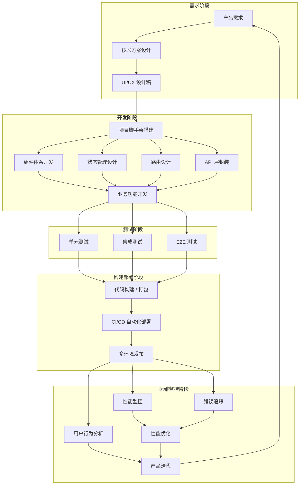

### 架构链各阶段核心职责

| 阶段 | 核心产出 | 关键考量 |
|------|---------|---------|
| 需求阶段 | 技术方案文档、设计稿 | 可行性评估、技术选型 |
| 开发阶段 | 可运行的应用代码 | 代码规范、复用性、可维护性 |
| 测试阶段 | 测试用例、质量报告 | 覆盖率、边界情况 |
| 构建部署 | 构建产物、CI/CD 流水线 | 构建速度、产物体积、发布策略 |
| 运维监控 | 监控面板、优化方案 | 性能指标、用户体验 |

---

## 二、前端架构师技术栈全景图

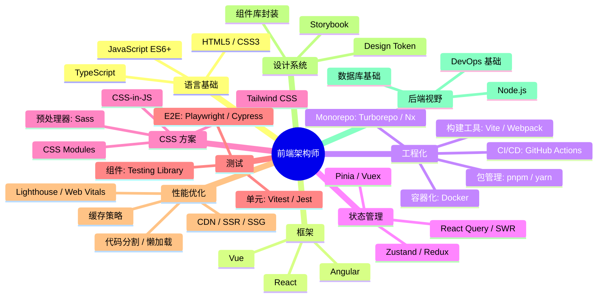

---

## 三、各技术栈核心知识点

### 1. 语言基础

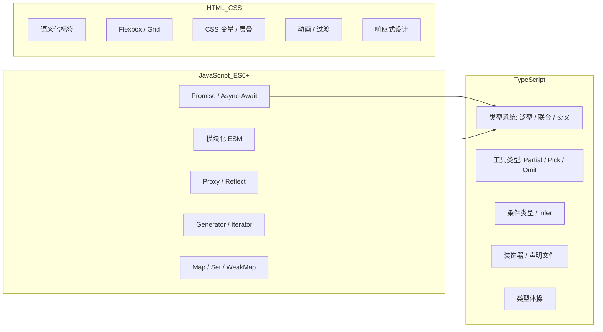

| 技术点 | 掌握要求 | 说明 |
|--------|---------|------|
| **JavaScript** | 精通 | 闭包、原型链、事件循环、异步编程是核心 |
| **TypeScript** | 精通 | 架构师必须用 TS 做类型约束，减少运行时错误 |
| **HTML/CSS** | 熟练 | 重点是布局、响应式、可访问性 |

### 2. 前端框架（至少精通一个）

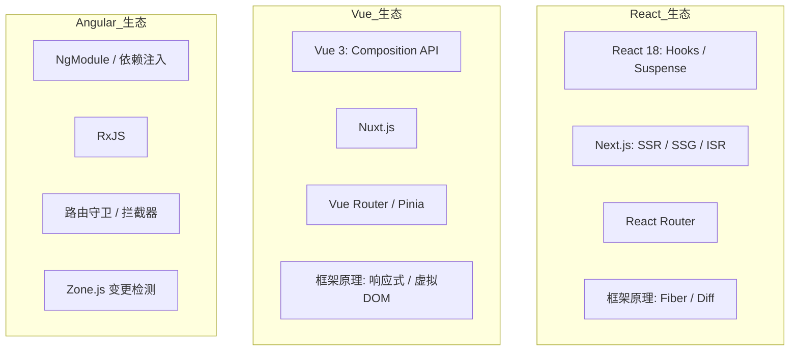

| 技术点 | 掌握要求 |
|--------|---------|
| 框架核心 API | 熟练使用框架的所有核心功能 |
| 框架原理 | 理解虚拟 DOM、Diff 算法、响应式原理 |
| 服务端渲染 | SSR/SSG 原理与性能优化 |
| 元框架 | Next.js/Nuxt.js 全栈能力 |

### 3. 工程化能力

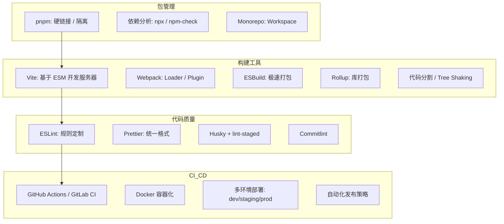

| 技术点 | 掌握要求 |
|--------|---------|
| Vite | 理解 ESM 原理、插件机制、HMR |
| Webpack | 能自定义 Loader/Plugin，理解编译流程 |
| 代码规范 | 制定团队统一的 ESLint + Prettier 规则 |
| CI/CD | 搭建完整流水线，实现自动化测试+部署 |
| Docker | 前端容器化、Nginx 配置、多阶段构建 |

### 4. 状态管理与数据流

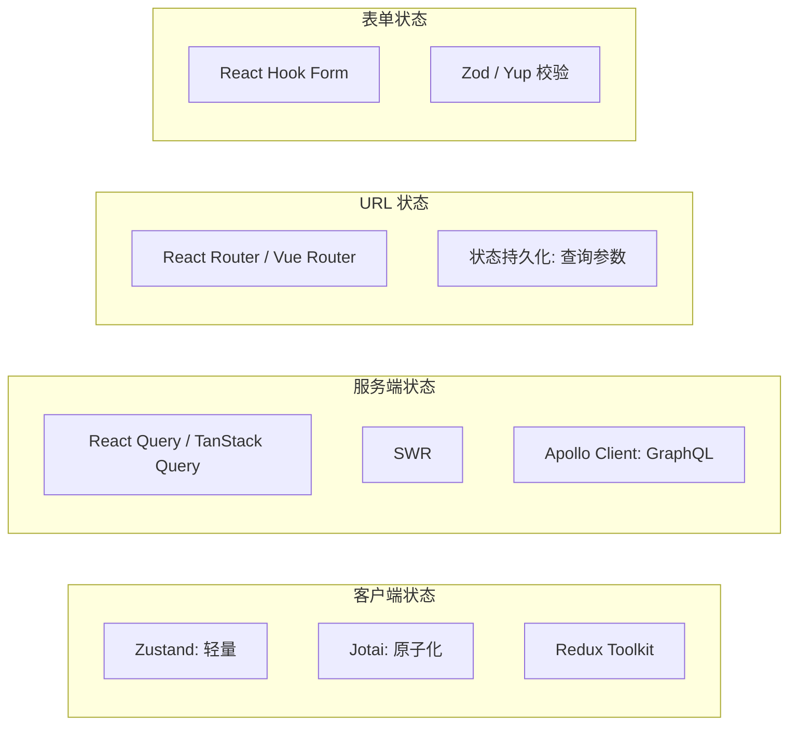

| 技术点 | 掌握要求 |
|--------|---------|
| 客户端状态 | 理解不同状态管理方案优劣，按场景选型 |
| 服务端状态 | 缓存策略、乐观更新、数据预取 |
| 跨组件通信 | Context、EventBus、依赖注入 |
| 数据流向 | 单向数据流 vs 双向绑定 |

### 5. CSS 体系

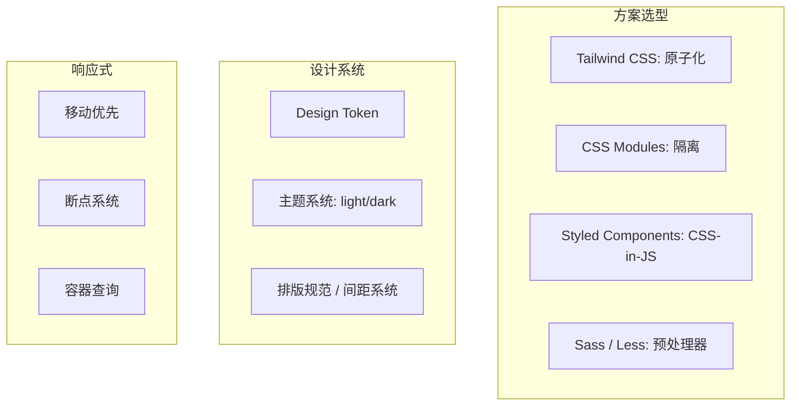

| 技术点 | 掌握要求 |
|--------|---------|
| 原子化 CSS | Tailwind 实践，理解 utility-first |
| 设计系统 | 搭建组件库的样式体系 |
| 响应式 | 一套代码适配多端 |

### 6. 测试体系

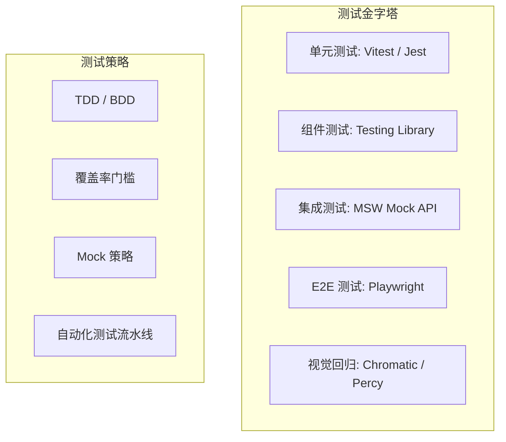

| 技术点 | 掌握要求 |
|--------|---------|
| 单元测试 | 纯函数、工具函数的测试 |
| 组件测试 | 用户行为模拟，而非实现细节 |
| E2E 测试 | 核心用户流程自动化 |
| 测试覆盖率 | 团队质量门禁 |

### 7. 性能优化

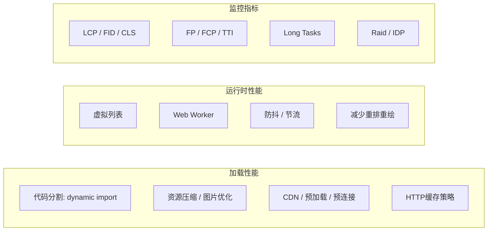

| 技术点 | 掌握要求 |
|--------|---------|
| Core Web Vitals | 理解并优化三大核心指标 |
| 加载优化 | 构建层面压缩、分包、预加载 |
| 渲染优化 | 减少不必要的渲染，虚拟化长列表 |
| 性能监控 | 埋点、RUM、性能面板 |

### 8. 架构设计能力

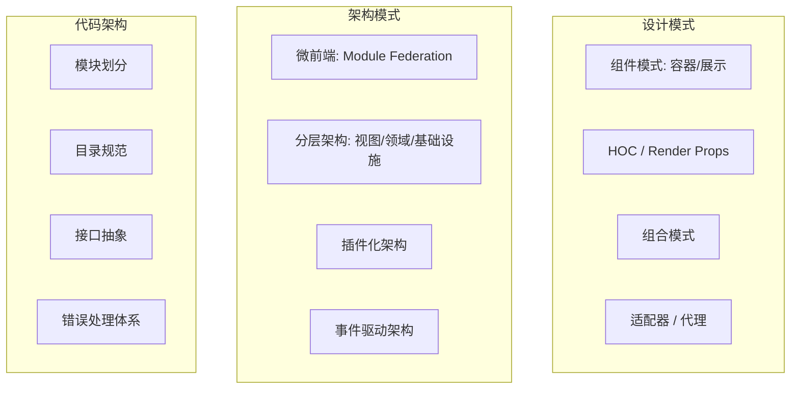

| 技术点 | 掌握要求 |
|--------|---------|
| 组件设计 | 高内聚低耦合、单一职责 |
| 微前端 | 解决大型应用的拆分与协作 |
| 分层架构 | 关注点分离，可测试性 |
| 技术选型 | 根据业务场景做权衡决策 |

### 9. 后端视野

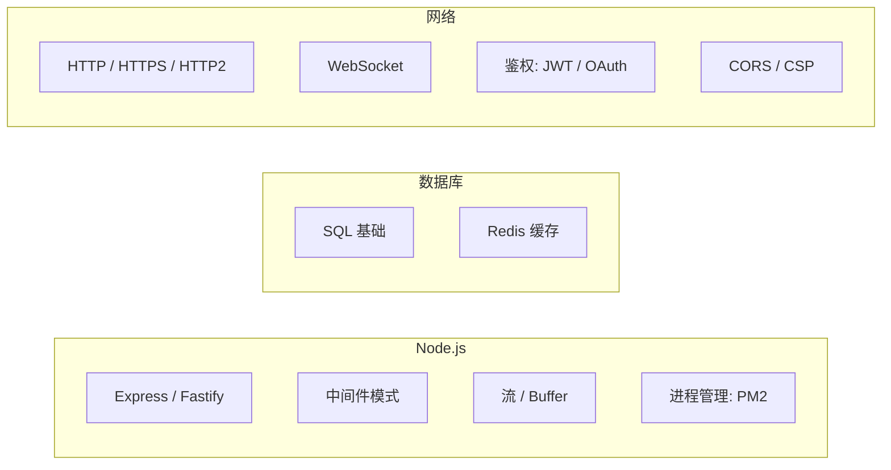

| 技术点 | 掌握要求 |
|--------|---------|
| Node.js | BFF 层、中间层服务 |
| 网络协议 | 理解 HTTP 全链路优化 |
| 安全 | XSS/CSRF/SQL注入防范 |

---

## 四、学习路径建议

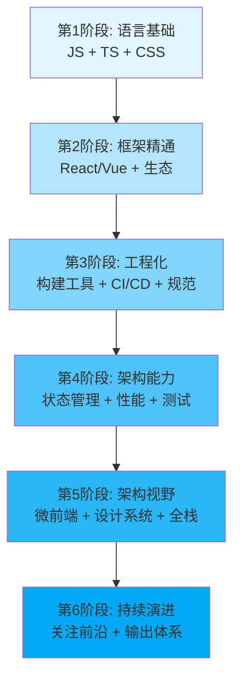

### 给后端转前端架构师的建议

1. **不要贪多** — 先精通一个框架（推荐 React 生态，社区最活跃）
2. **发挥后端优势** — 你的数据库、网络、架构设计经验是前端稀缺能力
3. **补齐前端特有知识** — 浏览器渲染原理、CSS 体系、性能优化
4. **动手实践** — 从零搭建一个完整的中后台项目，覆盖全链路
5. **输出倒逼输入** — 写博客、做分享、建立自己的知识体系

---

> 前端架构师 = 技术广度 × 前端深度 × 架构思维
