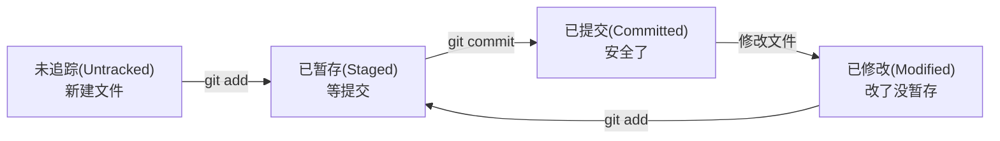

# Git 实战手册 — 从入门到日常协作

> 面向开发者的 Git 速查与原理指南

---

## 一、核心概念

### 1.1 三个区域

```
工作区 (Working Directory)    →   暂存区 (Staging Area)    →   本地仓库 (Local Repo)
     ↓                                                             ↓
  你正在编辑的文件                                             .git 目录
```

| 区域 | 说明 | 命令 |
|------|------|------|
| 工作区 | 你肉眼看到的文件目录 | `git status` |
| 暂存区 | 准备提交的变更列表 | `git add` |
| 本地仓库 | 已提交的历史记录 | `git commit` |

### 1.2 文件状态流转



---

## 二、常用命令速查

### 2.1 配置

```bash
# 首次使用必须设置
git config --global user.name "你的名字"
git config --global user.email "你的邮箱@example.com"

# 查看配置
git config --list

# 查看单条配置
git config user.name
```

### 2.2 创建仓库

```bash
# 方式 A：从零创建
mkdir my-project && cd my-project
git init

# 方式 B：克隆已有
git clone https://github.com/user/repo.git
git clone git@github.com:user/repo.git   # SSH
```

### 2.3 日常操作

```bash
# 查看状态（最常用）
git status

# 查看具体改了什么
git diff                 # 工作区 vs 暂存区
git diff --staged        # 暂存区 vs 上次提交

# 添加文件到暂存区
git add filename         # 添加单个文件
git add .                # 添加当前目录所有变更

# 提交
git commit -m "feat: 提交说明"

# 跳过暂存区，直接提交已追踪的文件
git commit -a -m "fix: 直接提交"
```

### 2.4 查看历史

```bash
git log                          # 完整历史
git log --oneline                # 一行一个提交
git log --oneline --graph        # 带分支图
git log -5                       # 最近 5 条
git log --oneline --since="2024-01-01"

# 查看某次提交的具体变更
git show commit_hash
```

### 2.5 分支操作

```bash
# 查看分支
git branch                       # 本地分支列表
git branch -a                    # 包含远程分支

# 创建与切换
git branch feature-login         # 创建分支
git checkout feature-login       # 切换分支
git switch feature-login         # 新语法，同上
git checkout -b feature-login    # 创建并切换（最常用）

# 合并
git checkout main                # 先切到目标分支
git merge feature-login          # 把 feature 合并过来

# 删除分支
git branch -d feature-login      # 删除本地分支（已合并）
git branch -D feature-login      # 强制删除（未合并也要删）
```

### 2.6 远程仓库

```bash
# 查看远程
git remote -v

# 添加远程
git remote add origin https://github.com/user/repo.git

# 推送
git push -u origin main          # 首次推送（-u 建立追踪关系）
git push                         # 后续只需 git push

# 拉取
git pull                         # 拉取远程最新代码并合并

# 设置/更换远程地址
git remote set-url origin https://github.com/new-user/repo.git
git remote set-url origin git@github.com:new-user/repo.git
```

### 2.7 撤销操作

```bash
# 工作区：放弃对某个文件的修改（未 git add）
git checkout -- filename         # 老语法
git restore filename             # 新语法

# 暂存区：把文件从暂存区撤回（保留工作区修改）
git reset HEAD filename          # 老语法
git restore --staged filename    # 新语法

# 提交：修改最后一次提交信息
git commit --amend -m "新信息"

# 提交：把新变更追加到最后一次提交（不新增 commit）
git add . && git commit --amend --no-edit

# 回退到某个版本（谨慎使用）
git reset --soft HEAD~1          # 撤销 commit，保留暂存区
git reset --mixed HEAD~1         # 撤销 commit 和暂存，保留工作区
git reset --hard HEAD~1          # 全部撤销，工作区也回退（危险！）
```

### 2.8 储藏（临时切换分支）

```bash
# 工作做到一半要切分支，先把修改存起来
git stash                        # 储藏当前修改
git stash pop                    # 恢复最近一次储藏并删除
git stash list                   # 查看所有储藏
git stash apply stash@{0}        # 恢复指定储藏（不删除）
git stash drop stash@{0}         # 删除指定储藏
```

---

## 三、工作流与分支策略

### 3.1 常用分支模型

```
main        → 生产环境代码（受保护，不能直接推）
develop     → 开发主分支
feature/xxx → 功能分支（从 develop 拉，合回 develop）
hotfix/xxx  → 紧急修复（从 main 拉，合回 main 和 develop）
release/x.x → 发布准备分支
```

### 3.2 日常开发流程

```bash
# ① 拉取最新代码
git checkout main && git pull

# ② 创建功能分支
git checkout -b feature/my-feature

# ③ 开发，多次提交
git add . && git commit -m "feat: add xxx"
git add . && git commit -m "fix: yyy"

# ④ 提交前同步主干（避免冲突）
git fetch origin
git rebase origin/main    # 或 git merge origin/main

# ⑤ 推送分支到远程
git push -u origin feature/my-feature

# ⑥ 在 GitHub 上创建 Pull Request
```

---

## 四、HTTPS 认证与多账号

### 4.1 Personal Access Token

```bash
# GitHub → Settings → Developer settings → Personal access tokens → Fine-grained tokens
# 权限: Contents → Write

# 推送时用户名输你的 GitHub 名，密码输 Token
git push -u origin main
```

### 4.2 更换 HTTPS 账号

```bash
# 清除缓存的凭据
git credential reject <<< 'protocol=https
host=github.com
'

# 下次 push 会重新要求输入
```

### 4.3 SSH 配置（推荐）

```bash
# 生成 SSH Key
ssh-keygen -t ed25519 -C "your_email@example.com"
```

| 参数 | 含义 | 说明 |
|------|------|------|
| `-t ed25519` | **type** — 密钥类型 | `ed25519` 是目前最推荐的算法，比传统 RSA 更安全且密钥更短。也可以用 `-t rsa -b 4096` |
| `-C "..."` | **comment** — 注释 | 纯粹为了识别，通常填邮箱。不传也行，但建议加，GitHub 上方便看是哪个 key |

执行后终端会输出：

```
Your identification has been saved in C:\Users\ttzz/.ssh/id_ed25519
Your public key has been saved in C:\Users\ttzz/.ssh/id_ed25519.pub
The key fingerprint is:
SHA256:Jnyp5lhqkff0SH+CYO2t3v9gV70KgHVG2KAw6le1xtM suzizhan23@gmail.com
The key's randomart image is:
+--[ED25519 256]--+
|    ...          |
|   . o..         |
|  . o o..        |
|   . =.*o        |
|    = BES.       |
|   . = @ .       |
|    o = +        |
|     . .         |
|                 |
+----[SHA256]-----+
```

| 输出行 | 含义 |
|--------|------|
| `identification saved` | **私钥**已保存（`id_ed25519`），自己留着，**绝对不能给别人** |
| `public key saved` | **公钥**已保存（`id_ed25519.pub`），把这个文件的内容粘贴到 GitHub |
| `fingerprint` | **密钥指纹**，用于验证你拿到的公钥是不是真的是你的。`SHA256:...` 是哈希值，后面是你传入的 `-C` 注释 |
| `randomart image` | **随机艺术图**，纯视觉辅助。记住这个图案形状就能快速辨认是否是同一个密钥，不用对比一长串哈希 |

```bash
# 查看公钥并添加到 GitHub
cat ~/.ssh/id_ed25519.pub
```

| 文件 | 说明 |
|------|------|
| `~/.ssh/id_ed25519` | **私钥** — 留在本地，永远不要泄露给任何人 |
| `~/.ssh/id_ed25519.pub` | **公钥** — 可以公开，粘贴到 GitHub |

```bash
# 验证连接
ssh -T git@github.com
```

执行后会看到两种情况之一：

```
# ✅ 成功（公钥已加到 GitHub）：
Hi suzizhan23! You've successfully authenticated, but GitHub does not provide shell access.

# ❌ 失败（公钥没加或配错了）：
git@github.com: Permission denied (publickey).
```

| 看到什么 | 什么意思 | 怎么办 |
|---------|---------|--------|
| `Hi 用户名! You've successfully authenticated` | **连接成功** ✅ | 可以 push 了 |
| `Permission denied` | **认证失败** ❌ | 检查：① 公钥是否已贴到 GitHub？② 用的是不是正确的私钥？ |

**`-T` 参数不用记，它只是让输出更干净。** 不加也能用，但会多一堆乱七八糟的 shell 信息。

**`git@github.com` 中的 `git` 是 GitHub 固定的 SSH 用户名**，不是你 GitHub 的昵称。所有 GitHub 用户共用这一个用户名 `git`，GitHub 通过你的私钥来判断你是谁。

### 4.4 SSH 多账号

```bash
# 为新账号生成单独的 Key
ssh-keygen -t ed25519 -C "new@example.com" -f ~/.ssh/id_ed25519_new
```

| 参数 | 含义 | 说明 |
|------|------|------|
| `-f ~/.ssh/id_ed25519_new` | **file** — 输出文件名 | 不指定 `-f` 默认生成 `id_ed25519`。多账号必须指定不同文件名，否则会覆盖 |

```bash
# 配置 ~/.ssh/config
Host github-new               # 别名，自定义。之后用这个别名代替 github.com
  HostName github.com         # 真实服务器地址
  User git                    # 登录用户名（GitHub 固定用 git）
  IdentityFile ~/.ssh/id_ed25519_new  # 使用哪个私钥文件
```

| 配置项 | 含义 | 说明 |
|--------|------|------|
| `Host` | **别名** | 你自己起的名字，之后 `git@github-new:user/repo.git` 就用这个 |
| `HostName` | **真实地址** | 实际连接的服务器 |
| `User` | **用户名** | GitHub 固定是 `git` |
| `IdentityFile` | **私钥路径** | 告诉 SSH 用哪个私钥来认证，不写则用默认的 `id_ed25519` |

```bash
# 仓库 remote 用别名
git remote set-url origin git@github-new:user/repo.git
# 原来的 git@github.com:xxx 变成了 git@github-new:xxx
# SSH 读取 config，发现 Host 是 github-new → 用 id_ed25519_new 连接
```

---

## 五、常见问题

| 问题 | 解决 |
|------|------|
| 提交信息写错了 | `git commit --amend -m "新信息"` |
| 漏了文件想补到上次提交 | `git add 漏掉的文件 && git commit --amend --no-edit` |
| 想放弃所有本地修改 | `git restore .` 或 `git checkout -- .` |
| 想回到某个历史版本 | `git log` 找到 hash → `git reset --hard hash`（慎用） |
| 合并冲突了 | 手动编辑冲突文件 → `git add .` → `git commit` |
| 刚 push 了想撤回 | `git reset --hard HEAD~1` → `git push --force-with-lease`（⚠️ 危险） |
| 不小心把大文件 commit 了 | `git rm --cached 大文件` → 加到 `.gitignore` |
| 想放弃某个文件的修改 | `git restore filename` |

---

## 六、提交信息规范（Conventional Commits）

```bash
<type>: <简短描述>

# type 列表
feat      # 新功能
fix       # 修补 bug
docs      # 文档
style     # 格式（不影响代码运行）
refactor  # 重构
test      # 测试
chore     # 构建/工具变动
perf      # 性能优化

# 示例
feat: add user login page
fix: correct pagination logic when page is 0
docs: update README with setup instructions
refactor: extract validation logic into composable
```

---

## 七、.gitignore 模板

```gitignore
# 依赖
node_modules/
vendor/
.pnp
.pnp.js

# 构建输出
dist/
build/
*.tsbuildinfo

# 环境变量
.env
.env.local
.env.*.local

# IDE
.vscode/
.idea/
*.swp
*.swo

# OS
.DS_Store
Thumbs.db

# 日志
*.log
npm-debug.log*
```

---

> 底线：`git status` 随时看状态，`git diff` 确认改了什么再提交。不确定时不要用 `--hard` 和 `--force`。
