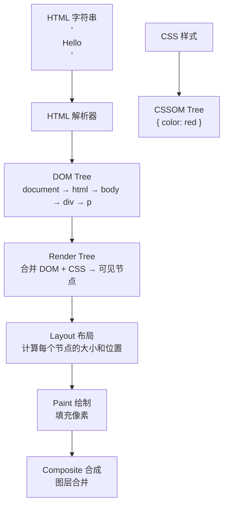
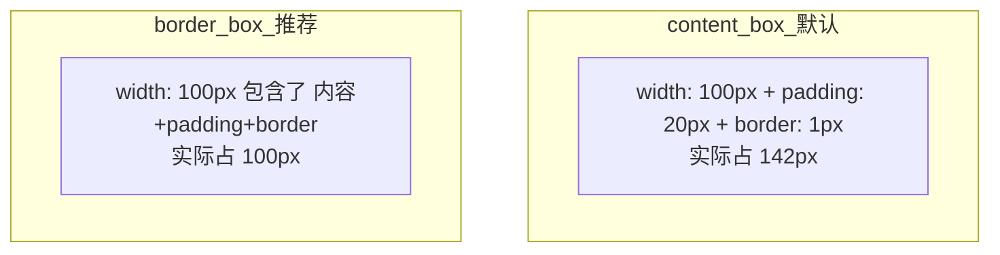

## 四、HTML 核心

### 4.1 语义化——用正确的标签表达内容的意义

```html
<!-- ❌ 全用 div 也能显示，但语义不明 -->
<div class="header">
  <div class="nav"><div class="nav-item">首页</div></div>
</div>

<!-- ✅ 语义化标签，一看就懂结构 -->
<header>
  <nav><a href="/">首页</a></nav>
</header>
```

| 标签 | 含义 | 对应后端概念 |
|------|------|-------------|
| `<header>` | 页头 | 文档的"前言"部分 |
| `<nav>` | 导航 | 类似 REST API 的根路径列表 |
| `<main>` | 主要内容 | 一个页面只有一个 |
| `<section>` | 区域 | 类似 API 的一个资源分组 |
| `<article>` | 独立文章 | 可独立复用的内容块 |
| `<aside>` | 侧边栏 | 补充信息 |
| `<footer>` | 页脚 | 版权/作者信息 |

> 语义化对**搜索引擎（SEO）**和**无障碍访问（ARIA）**至关重要，也让团队的人一眼看懂页面结构。

### 4.2 DOM 树——浏览器怎么把 HTML 变成页面



### 4.3 Shadow DOM——样式隔离的"沙盒"

```html
<!-- Shadow DOM 内部的样式不影响外部 -->
<div id="host"></div>
<script>
  const host = document.getElementById('host');
  const shadow = host.attachShadow({ mode: 'open' });
  shadow.innerHTML = `<p style="color: blue">我不受外面影响</p>`;
</script>
```

Vue 的 `<style scoped>` 和 React 的 CSS-in-JS 底层思路和 Shadow DOM 一样——把样式限制在组件内部。

### 4.4 浏览器核心知识——前端架构师必备

**关键渲染路径：** HTML → DOM Tree + CSS → CSSOM → Render Tree → Layout → Paint → Composite
优化核心：减少关键资源数量、缩短关键路径长度。

**浏览器存储：** Cookie（4KB，自动随请求发）、localStorage（5-10MB，永久）、sessionStorage（标签页关闭消失）、IndexedDB（无上限，异步）。

**安全：** XSS（脚本注入→CSP头）、CSRF（跨站请求→SameSite Cookie）、点击劫持（`X-Frame-Options: DENY`）。

**跨域 CORS：** 浏览器同源策略限制跨域请求，后端通过 `Access-Control-Allow-Origin` 响应头声明允许跨域。

**性能指标（Core Web Vitals）：** LCP（加载性能，<2.5s）、FID（交互延迟，<100ms）、CLS（布局偏移，<0.1）。

---


## 五、CSS 核心


### 5.1 盒模型——每个元素都是一个"盒子"


```css
/* 全局设置：让 width = 内容+padding+border，不额外撑大 */
*, *::before, *::after { box-sizing: border-box; }
```





**BFC（块级格式化上下文）** = 一个独立的"布局小世界"，里面的元素不影响外面。

- 触发：`overflow: hidden` / `display: flow-root` / `float` / `position: absolute`

- 作用：清除浮动、防止 margin 折叠、隔离布局


### 5.2 Flexbox——一维布局（一行或一列）


```css
.container {
  display: flex;           /* 开启 flex 布局 */
  justify-content: center; /* 主轴居中 */
  align-items: center;     /* 交叉轴居中 */
  gap: 16px;               /* 项目间距 */
}
```


核心概念：**主轴**（flex-direction 决定方向） + **交叉轴**（垂直方向）


| 容器属性 | 作用 | 常用值 |
|---------|------|--------|
| `display: flex` | 开启 flex | — |
| `flex-direction` | 主轴方向 | `row`(默认) / `column` |
| `justify-content` | 主轴对齐 | `center` / `space-between` / `flex-start` |
| `align-items` | 交叉轴对齐 | `center` / `stretch`(默认) |
| `flex-wrap` | 是否换行 | `nowrap`(默认) / `wrap` |
| `gap` | 项目间距 | `16px` |
| 项目属性 | 作用 |
|---------|------|
| `flex: 1` | 等分剩余空间（最常用） |
| `align-self` | 单独覆盖交叉轴对齐 |
### 5.3 Grid——二维布局（行 + 列）


```css
.container {
  display: grid;
  grid-template-columns: 1fr 2fr 1fr;  /* 三列，中间列是旁边的 2 倍 */
  grid-template-rows: auto 200px;       /* 两行 */
  gap: 16px;
}
```


| Grid vs Flexbox | Grid | Flexbox |
|----------------|------|---------|
| 维度 | 二维（行+列） | 一维（行或列） |
| 适合 | 页面整体骨架 | 组件内排列 |
| 核心 | 划分区域 | 分配空间 |
### 5.4 层叠上下文——谁盖在谁上面


```css
/* 默认层叠顺序（从下到上）：
   背景 → 负 z-index → 块级 → 浮动 → 行内 → 正 z-index */
/* 创建新的层叠上下文 */
.selector {
  position: relative;
  z-index: 1;        /* 创建上下文 */
  opacity: 0.9;      /* opacity < 1 也会创建 */
  transform: scale(1); /* transform 也会 */
}
/* z-index 只在同一个层叠上下文内比较 */
```


### 5.5 CSS 变量——可复用的"设计令牌"


```css
:root {
  --color-primary: #1890ff;
  --spacing-md: 16px;
  --font-size-base: 14px;
}
.button {
  background: var(--color-primary);
  padding: var(--spacing-md);
  font-size: var(--font-size-base);
}
/* 暗色主题只需覆盖变量值 */
[data-theme='dark'] { --color-primary: #40a9ff; }
```


### 5.6 动画——只用 transform 和 opacity


```css
/* ✅ 性能好：只触发 composite */
.element {
  transition: transform 0.3s, opacity 0.3s;
}
.element:hover {
  transform: scale(1.1);  /* composite */
  opacity: 0.8;           /* composite */
}
/* ❌ 性能差：触发 layout + paint */
.element {
  transition: width 0.3s, height 0.3s, top 0.3s;
}
```


### 5.7 响应式——一套代码适配手机和电脑


```css
/* 移动优先：先写手机版样式，再用 @media 逐步增强 */
.container {
  display: flex;
  flex-direction: column;        /* 手机：竖排 */
}
@media (min-width: 768px) {
  .container {
    flex-direction: row;          /* 平板以上：横排 */
  }
}
```


---
