# 前端架构师语言基础


> 语言是架构的基石 —— 深入理解才能做出正确决策


---


## 语言基础全景


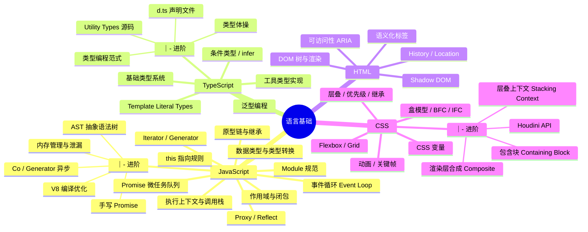


---


## 一、JavaScript 核心


### 1.1 JS 运行时原理


先把这三个最关键的概念理顺，后面所有细节都围绕它们展开：


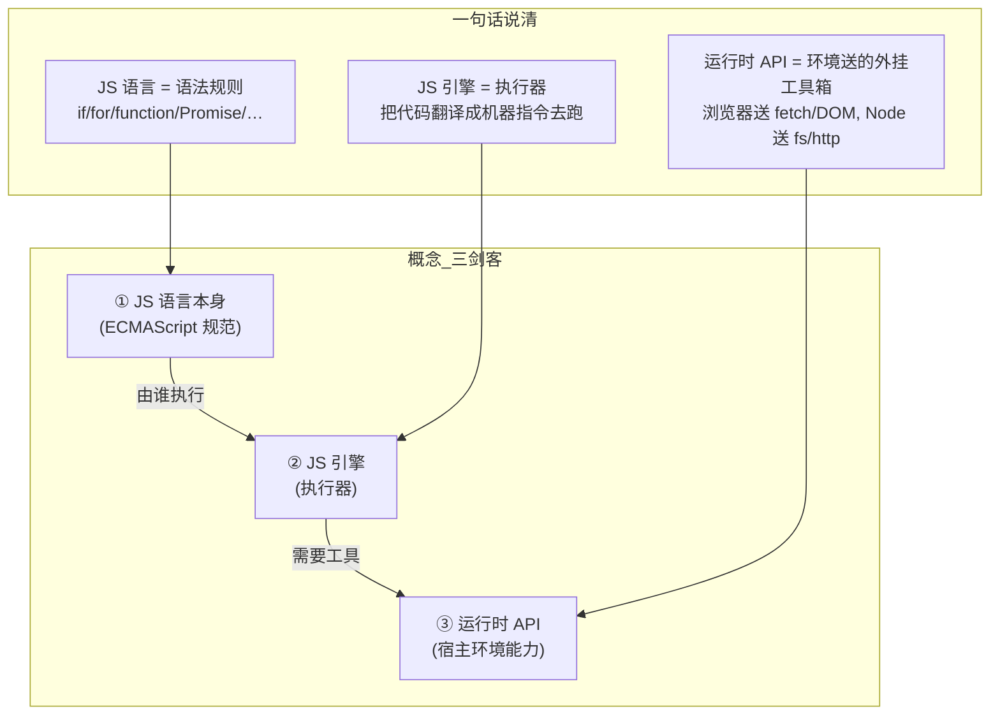


---


#### 1.1.1 先搞懂三者的关系 —— JS 语言 ≠ JS 引擎 ≠ 运行时 API


很多初学者把这三者混为一谈，但它们是**三个完全不同的东西**：


| 层次 | 是什么 | 类比（Java 后端） | 包含什么 |
|------|--------|------------------|---------|
| **JS 语言**（ECMAScript） | 语法规范 | 就像 Java 语言规范 | `if/for/function/class/=>` `/Promise/Map/Set` |
| **JS 引擎** | 执行器 | 就像 JVM（Java 虚拟机） | V8 / SpiderMonkey / JavaScriptCore |
| **运行时 API** | 环境给的工具箱 | 就像 JDK 的 `java.io` `java.net` | 浏览器给 Web API，Node 给系统 API |
**最关键的一句话：JS 语言本身只定义了语法，没有任何 I/O 能力。** 不能读写文件、不能发网络请求、不能操作 DOM——这些全是运行时 API 提供的。


---


#### 1.1.2 JS 引擎是什么 —— 它只做一件事：执行代码


引擎 = 一个把 JS 代码变成机器指令并执行的黑盒。


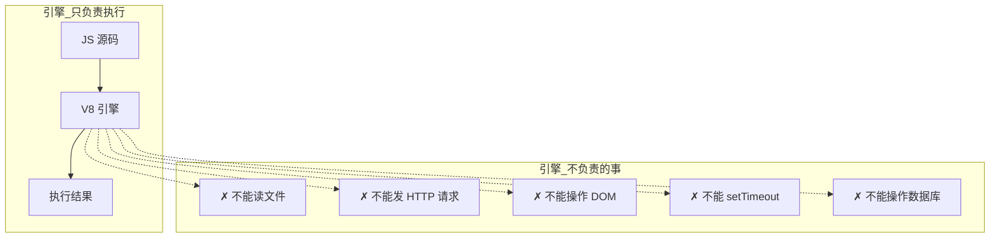


**引擎内部的工作流程：**


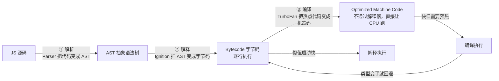


| 阶段 | 组件 | 做了什么事 | 一句话 |
|------|------|-----------|--------|
| ① 解析 | Parser | 源码 → AST | 把代码"读"成计算机能理解的树状结构 |
| ② 解释 | Ignition | AST → 字节码，逐条执行 | 不管优化，先跑起来再说 |
| ③ 编译 | TurboFan | 热点代码 → 优化机器码 | 发现某段代码反复执行，编译成最快的形式 |
| ④ 去优化 | — | 类型假设失败 → 退回字节码 | 猜错了就重来 |
**架构师启示：**

- 保持函数参数类型**稳定**（不要一会儿 string 一会儿 number）

- 保持对象结构**一致**（始终用相同的属性初始化顺序）

- **避免** `delete` 操作破坏隐藏类

- 热点代码才会被 JIT 优化，冷启动时性能取决于解析+解释速度


---


#### 1.1.3 运行时 API 是什么 —— 环境送的"外挂工具箱"


引擎只能执行代码，不能跟外部世界打交道。**运行时 API = 环境塞给 JS 的一个工具箱，让 JS 能操作外部世界。**


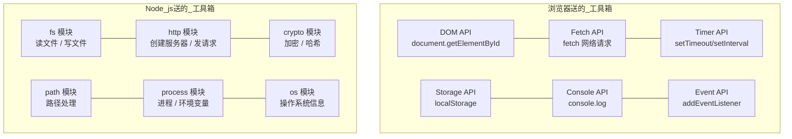


**这就是"运行时 API 来源"的意思：**

- **浏览器环境** → 送的是 **Web API**（W3C 标准定义的）

- **Node.js 环境** → 送的是 **系统 API**（通过 Libuv + C++ 绑定实现的）

- **Deno 环境** → 送的是 **Rust Tokio API**

- 不同环境送的"工具箱"不一样，所以同样的 JS 代码在浏览器和 Node 里能做的事不同


| 环境 | 引擎 | 运行时送的"工具箱" |
|------|------|------------------|
| 浏览器 | V8 / SpiderMonkey / JavaScriptCore | Web APIs（DOM / Fetch / setTimeout / Storage） |
| Node.js | V8 | Libuv + C++ 绑定（fs / http / crypto / path） |
| Deno | V8 | Rust Tokio（文件 / 网络 / 安全沙箱） |
| Bun | JavaScriptCore | Zig 原生绑定（文件 / 网络 / SQLite 内置） |
---


#### 1.1.4 整条链路串起来 —— 从代码到执行，一个请求的生命周期


用一段实际代码走完全程：


```javascript
// 你的 JS 代码
console.log('开始请求');
fetch('https://api.example.com/data')
  .then(res => res.json())
  .then(data => console.log(data));
console.log('请求已发出');
```


**它在运行时中是怎么流通的？**


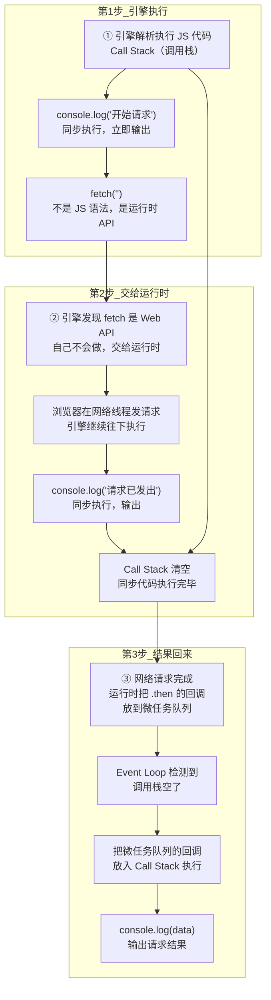


**关键理解：**


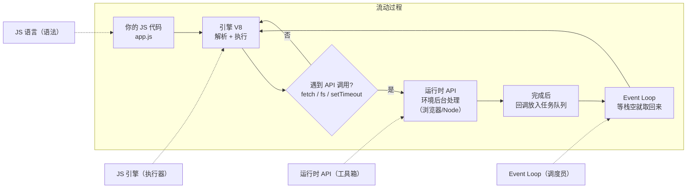


**用一句话把整个过程说清楚：**


> JS 引擎（V8）像一台只认识 JS 语法的**CPU**，负责执行代码。当代码调用 `fetch`/`fs`/`setTimeout` 等**运行时 API** 时，引擎就把这个任务交给宿主环境（浏览器/Node）在**后台线程**处理，自己继续往下跑。等后台处理完了，结果通过 **Event Loop** 排队送回引擎继续执行。


**类比后端：**


```
Java:    JVM 执行字节码  +  JDK 的 java.io/java.net 类库
JS:      V8 引擎执行代码  +  运行时 API（浏览器/Node 送的）
Java 的 JVM = JS 的 V8
Java 的 JDK 类库 = JS 的运行时 API
```


---


#### 1.1.5 执行上下文（EC）是什么 —— 每次函数调用的"工作记录"


每次调用一个函数，JS 引擎都会创建一张"工作记录"——**执行上下文（Execution Context，简称 EC）**。它记录了这次调用所需的所有信息。


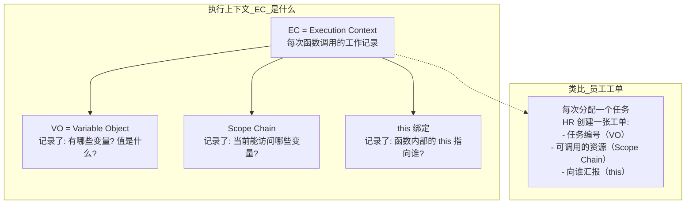


**三种执行上下文：**


| 类型 | 创建时机 | 数量 | 说明 |
|------|---------|------|------|
| **全局 EC** | 脚本加载时 | 且仅 1 个 | 整个脚本的"根"环境，存全局变量 |
| **函数 EC** | 每次调用函数 | 多个（调用几次创建几个） | 每次调用都是独立的，互不干扰 |
| **Eval EC** | 调用 `eval()` | 少用 | 不推荐，有安全风险 |
**EC 的创建分三步（发生在函数执行之前）：**


```
① 创建 Variable Object（变量对象）
   - 扫描函数内的所有声明
   - 函数声明 → 直接指向函数体（函数提升的原因）
   - var 声明 → 初始化为 undefined（变量提升的原因）
   - let/const → 不初始化（所以有"暂存死区"）
② 创建 Scope Chain（作用域链）
   - 当前 VO + 父级 VO + 祖父级 VO...
   - 这就是为什么内层函数能访问外层变量
③ 绑定 this
   - 根据"函数怎么被调用的"决定
   - obj.fn() → this = obj
   - fn() → this = undefined（严格模式）/ window（非严格）
   - new fn() → this = 新创建的空对象
```


#### 1.1.6 Call Stack 调用栈 —— 记录函数调用顺序的"栈"


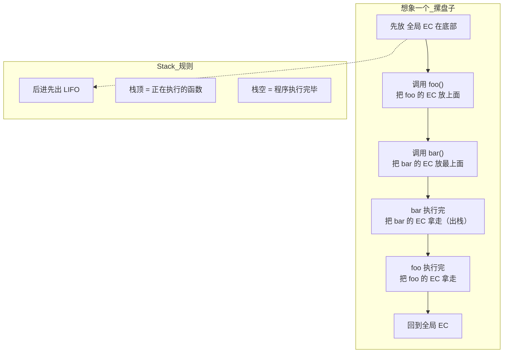


Call Stack（调用栈）= **当前正在执行的函数调用链**。它是一个遵循"后进先出"的栈结构。


```javascript
function bar() {console.log('bar');}   // 第三步: bar 入栈（栈顶）
function foo() {bar();}                // 第二步: foo 入栈
foo();                                  // 第一步: foo 入栈
                                        // 第四步: bar 出栈
                                        // 第五步: foo 出栈
```


**栈的直观理解：**

```
调用栈状态（从底到顶）：
第①步: [全局EC]
第②步: [全局EC, foo的EC]
第③步: [全局EC, foo的EC, bar的EC]  ← 正在执行 bar
第④步: [全局EC, foo的EC]            ← bar 完事了
第⑤步: [全局EC]                     ← foo 完事了
第⑥步: []                            ← 全部执行完毕
```


---


#### 1.1.7 宏任务 vs 微任务 —— 用"餐厅后厨"理解 Event Loop


先搞清楚这两个"任务队列"是做什么的，再看 Event Loop 就简单了。


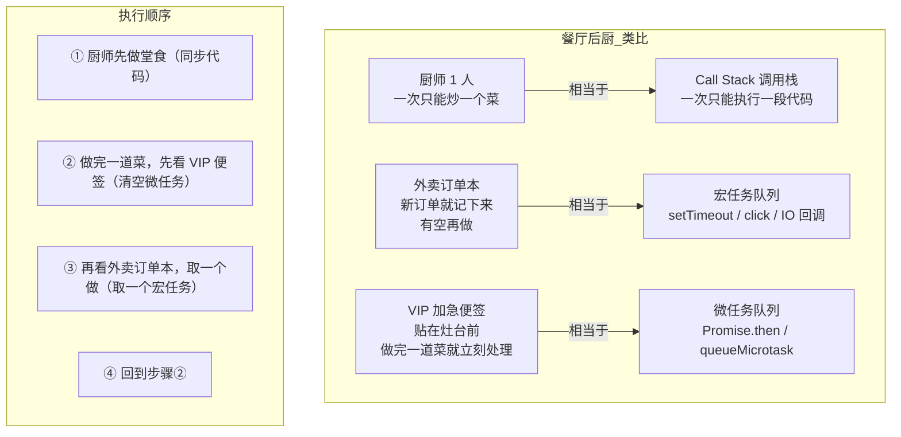


**微任务（Microtask）**：做完一件事后**立即**要处理的"加急"任务。

- `Promise.then` 的回调

- `queueMicrotask()` 注册的任务

- `MutationObserver` 的回调


**宏任务（Macrotask）**：排到队列里，等当前所有事处理完了**才轮到的**普通任务。

- `setTimeout` / `setInterval` 的回调

- 事件回调（click / load / input）

- I/O 回调（fetch / 文件读取）


**`setTimeout` 不是 `return`，也不是 `sleep`：**


```javascript
console.log('① 开始');
const timerId = setTimeout(() => {
  console.log('③ 1 秒后执行（宏任务）');
}, 1000);
console.log('② setTimeout 已返回，继续执行后面代码');
// 输出: ① → ② → （1 秒后）③
// setTimeout 只是"定个闹钟到点执行"→ 立马返回 timerId
// 后面的代码不会等，立即执行
// 对比 return：
function testReturn() {
  console.log('①');
  return;           // ← 函数在这里就结束了
  console.log('②'); // ← 永远不会执行（dead code）
}
```


| `setTimeout` | `return` |
|-------------|----------|
| 调度一个函数**将来**执行 | 函数**立刻**结束 |
| 后面的代码**继续执行** | 后面的代码**被跳过** |
| 返回 timerId（可用于取消） | 返回指定的值或 undefined |
| 不影响函数流程 | **终止**函数流程 |
所以这段代码里的 `setTimeout`：


```javascript
await new Promise(resolve => {
  setTimeout(() => resolve('数据'), 1000);
  // ← 这里可以写代码，会立刻执行
  console.log('setTimeout 后面还能执行');
});
// ← 这里被 await 暂停，等 resolve 后才执行
```


**核心区别一句话：**

```
微任务 → VIP 加急：当前代码执行完就处理，不等待，全部清空
宏任务 → 普通订单：排到队尾，一次只取一个，其他人还要排队
```


---


#### 1.1.8 Event Loop 详解 —— 事件循环怎么"循环"


现在你已经知道微任务和宏任务是什么了。Event Loop 就是那个在中间协调的**调度员**，决定"先执行哪个任务"。


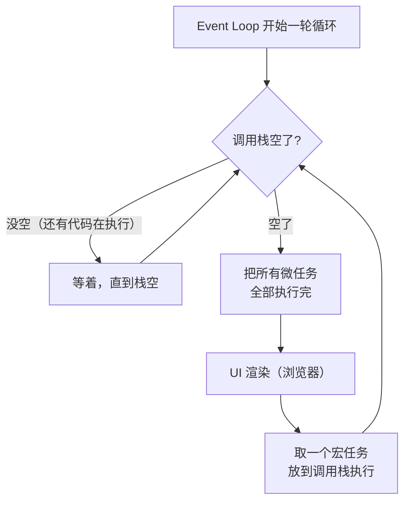


**用文字描述一遍：**

```
① 先看看调用栈空了吗？没空就等着
② 空了 → 把所有微任务队列里的回调全部执行完（一个不留）
③ 有必要的话渲染一下 UI
④ 从宏任务队列里取一个任务执行
⑤ 回到第①步，又开始新一轮
```


**对比餐厅后厨就懂了：**

```
① 厨师做完一道菜（同步代码执行完）
② 看灶台前的 VIP 便签（微任务）→ 全部处理掉
③ 收拾一下台面（UI 渲染）
④ 看外卖订单本（宏任务）→ 取一张做
⑤ 做完又看 VIP 便签 → 循环...
```


**经典面试题——每行代码执行时，两个队列里有什么？**


```javascript
console.log(1);
setTimeout(() => console.log(2), 0);
Promise.resolve().then(() => { 
  console.log(3);
  setTimeout(() => console.log(4), 0);
});
Promise.resolve().then(() => console.log(5));
console.log(6);
```


**逐行走着瞧，看两个队列的变化：**


```
┌──────────────────────────────────────────────────────────────────┐
│ 第 1 行: console.log(1)                                          │
│   调用栈: [console.log(1)] → 输出 1 → 出栈                        │
│   微任务: []                                                      │
│   宏任务: []                                                      │
├──────────────────────────────────────────────────────────────────┤
│ 第 2 行: setTimeout(() => console.log(2), 0)                     │
│   调用栈: [setTimeout] → 调度一个"0 秒后"的宏任务 → 出栈          │
│   微任务: []                                                      │
│   宏任务: [console.log(2)]   ← setTimeout 的回放进来了             │
├──────────────────────────────────────────────────────────────────┤
│ 第 3 行: Promise.resolve().then(() => { console.log(3); ... })   │
│   调用栈: [Promise.resolve → .then()] → 注册一个微任务 → 出栈     │
│   微任务: [() => { console.log(3); setTimeout(console.log(4)) }] │
│   宏任务: [console.log(2)]                                        │
├──────────────────────────────────────────────────────────────────┤
│ 第 4 行: Promise.resolve().then(() => console.log(5))            │
│   调用栈: [Promise.resolve → .then()] → 注册一个微任务 → 出栈     │
│   微任务: [ (3 的回调),  (5 的回调) ]   ← 两个微任务排队了       │
│   宏任务: [console.log(2)]                                        │
├──────────────────────────────────────────────────────────────────┤
│ 第 5 行: console.log(6)                                          │
│   调用栈: [console.log(6)] → 输出 6 → 出栈                        │
│   微任务: [ (3 的回调),  (5 的回调) ]                              │
│   宏任务: [console.log(2)]                                        │
├──────────────────────────────────────────────────────────────────┤
│ → 调用栈空了 → Event Loop 开始工作                                 │
│   第①步: 清空微任务队列!                                          │
│      执行 (3 的回调): 输出 3, 又注册了一个 setTimeout             │
│        微任务: [ (5 的回调) ]                                     │
│        宏任务: [console.log(2), console.log(4)]  ← 又加了一个    │
│      执行 (5 的回调): 输出 5                                     │
│        微任务: []  ← 清空了                                      │
│                                                                  │
│   第②步: UI 渲染（略）                                            │
│                                                                  │
│   第③步: 取一个宏任务执行                                          │
│      执行 console.log(2): 输出 2                                  │
│        微任务: []                                                 │
│        宏任务: [console.log(4)]                                   │
│                                                                  │
│   回到第①步: 清空微任务（空的）                                     │
│   第②步: UI 渲染                                                  │
│   第③步: 取一个宏任务 → 执行 console.log(4): 输出 4               │
│        宏任务: []  ← 全部清空                                     │
└──────────────────────────────────────────────────────────────────┘
结果: 1 → 6 → 3 → 5 → 2 → 4
```


#### 1.1.9 牢记一条铁律：`new Promise(executor)` 的 `executor` 永远同步执行


不管外面套了多少层 `await`，`new Promise(fn)` 调用时，`fn` 都是**立即同步执行**的：


```javascript
// 没有 await
const p = new Promise(r => { console.log('① 同步'); r(); });
console.log('②');                          // ① → ②
// 有 await
await new Promise(r => { console.log('① 同步'); r(); });
console.log('②');                          // ① → ② 还是先①后②！
// 嵌套 await 也一样
async function test() {
  const data = await new Promise(r => {
    console.log('① executor 同步执行');
    r('done');
  });
  console.log('③ 这里才是微任务');
}
test();
console.log('②');                          // ① → ② → ③
// executor(①) 不管 await，直接同步执行
// await 只把③推迟
```


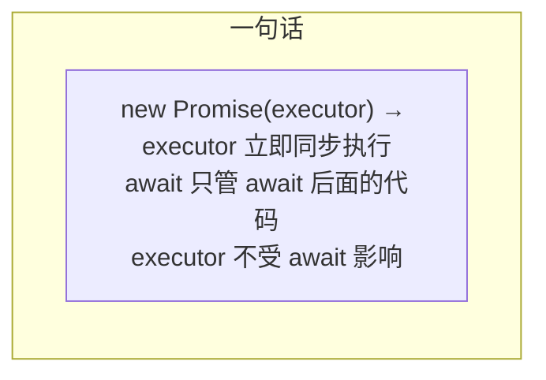


**加入 async/await——带两个队列看执行过程：**


```javascript
async function fetchData() {
  console.log('② fetchData 开始');
  const data = await new Promise(resolve => {
    console.log('③ executor 同步执行');
    setTimeout(() => {
      console.log('⑤ 1 秒后（宏任务）');
      resolve('用户数据');
    }, 1000);
  });
  console.log('⑥ 拿到数据:', data);
  return data;
}
async function main() {
  console.log('① main 开始');
  const result = await fetchData();
  console.log('⑦ main 拿到:', result);
}
main();
console.log('④ main 调用完，继续');
```


```
┌────────────────────────────────────────────────────────────────────┐
│ 调用 main()                                                       │
│   调用栈: [main]                                                   │
│   ① console.log('① main 开始') → 输出                             │
│                                                                   │
│   main 遇到 await fetchData()                                      │
│     执行 fetchData()（同步！）                                     │
│       调用栈: [main, fetchData]                                    │
│       ② console.log('② fetchData 开始') → 输出                    │
│                                                                   │
│       fetchData 遇到 await new Promise(...)                        │
│         执行 new Promise 的 executor（同步！）                     │
│           ③ console.log('③ executor 同步执行') → 输出             │
│           调度 setTimeout（1000ms 后进宏任务队列）                 │
│             宏任务: [ (将来: setTimeout 回调) ]                    │
│           executor 执行完，new Promise 返回 Promise<pending>       │
│                                                                   │
│       await 把 fetchData 剩余代码包成 .then() 回调                  │
│         注册到 Promise 上，等 resolve 后才进微任务队列              │
│         微任务: []   ← 还没进去！                                  │
│       fetchData 暂停，出栈                                         │
│       调用栈: [main]                                               │
│                                                                   │
│   fetchData 返回 Promise<pending>                                  │
│   main 的 await 也把剩余代码包成 .then() 回调                      │
│     注册到 fetchData 返回的 Promise 上                              │
│     微任务: []   ← 两个回调都注册了，但都没进队列                   │
│   main 暂停，出栈                                                  │
│   调用栈: []  ← 空了                                               │
│                                                                   │
│   ④ console.log('④ main 调用完，继续') → 输出                     │
│   调用栈空了                                                       │
│                                                                    │
│ ─── 1 秒后 ───                                                     │
│ setTimeout 回调 → 进入宏任务队列                                    │
│   宏任务: [setTimeout 回调]                                         │
│                                                                    │
│ → Event Loop: 调用栈空                                             │
│   ① 清空微任务: []   ← 空的，因为 Promise 还没 resolve             │
│   ② 取一个宏任务: 执行 setTimeout 回调                              │
│      ⑤ console.log('⑤ 1 秒后') → 输出                              │
│      resolve('用户数据')                                            │
│      → resolve 把之前注册的 .then() 回调放进微任务队列              │
│        微任务: [ (⑥), (⑦) ]  ← 现在才真正进队列！                 │
│                                                                   │
│   ① 清空微任务:                                                   │
│      执行 ⑥: console.log('⑥ 拿到数据: 用户数据') → 输出           │
│      执行 ⑦: console.log('⑦ main 拿到: 用户数据') → 输出          │
│      微任务: []                                                    │
│   ② 取一个宏任务（没有）                                          │
└────────────────────────────────────────────────────────────────────┘
结果: ① → ② → ③ → ④ → (1 秒后) ⑤ → ⑥ → ⑦
```


**await 不加 await——用同一段代码切换一个关键字，看输出差异：**


```javascript
// 同一个 async 函数
async function getData() {
  console.log('  [getData] 开始');
  const r = await new Promise(resolve => {
    console.log('  [getData] executor 同步');
    setTimeout(() => resolve('数据'), 1000);
  });
  console.log('  [getData] 拿到:', r);
  return r;
}
```


```javascript
// ───── 不加 await ─────                                       // 输出顺序:
async function testNoAwait() {
  console.log('① 准备调用');
  const promise = getData();          // getData 同步执行到 await 暂停
  console.log('② getData 返回了 Promise');                     // ① → ② → (1秒后) [getData]
  console.log('③ 不等结果，继续执行');
  const result = await promise;       // 手动等结果
  console.log('④ 拿到结果:', result);                          // ④
}
testNoAwait();
console.log('⑤ 调用结束');
// 输出：
// ① 准备调用
//   [getData] 开始
//   [getData] executor 同步
// ② getData 返回了 Promise
// ③ 不等结果，继续执行
// ⑤ 调用结束
//   [getData] 拿到: 数据    ← 1 秒后
// ④ 拿到结果: 数据
```


```javascript
// ───── 加 await ─────                                         // 输出顺序:
async function testAwait() {
  console.log('① 准备调用');
  const result = await getData();      // getData 同步执行到 await 暂停
  console.log('② 拿到结果:', result);                          // ① → [getData] → (1秒后) [getData]拿到 → ②
  console.log('③ 继续执行');
}
testAwait();
console.log('④ 调用结束');
// 输出：
// ① 准备调用
//   [getData] 开始
//   [getData] executor 同步
// ④ 调用结束   ← 注意！④ 在 ② 之前！因为 testAwait 被 await 暂停了
//               然后 ④ 才输出（调用栈空了）
//   [getData] 拿到: 数据    ← 1 秒后
// ② 拿到结果: 数据
// ③ 继续执行
```


**唯一区别就是 `②` 的出现时间：**


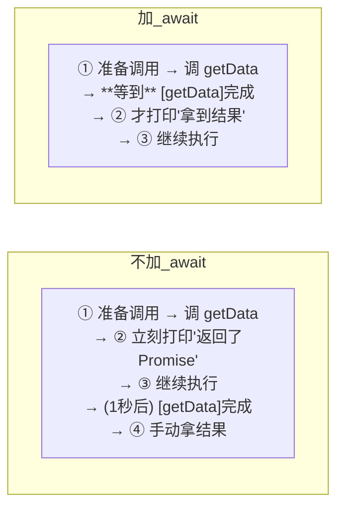


| | 不加 await | 加 await |
|--|-----------|---------|
| getData 内部怎么跑？ | **一样**。同步执行到 await 暂停，1 秒后恢复 | **一样**。同步执行到 await 暂停，1 秒后恢复 |
| ② 什么时候打印？ | **立刻**（不等 getData） | 1 秒后（等 getData 完成） |
| 调用者能不能继续？ | ✅ 能（③ 立刻输出） | ❌ 暂停了（③ 等 1 秒） |
| 什么时候拿结果？ | 自己 `await promise` | `await getData()` 直接拿到 |
**三句话：**


```
getData()     → getData 开始跑 → 你接着干别的事 → 回头再拿结果
await getData() → getData 开始跑 → 你等着 → 拿到结果 → 再干别的事
```


**不同场景怎么选：**


| 场景 | 做法 | 理由 |
|------|------|------|
| 需要结果才能继续 | **加 await** | 代码像同步一样写，可读性好 |
| 触发后不关心结果 | **不加 await** | 不阻塞，后续代码继续执行 |
| 同时发多个请求 | **不加 await 先都触发，然后用 Promise.all** | 请求并行，不等一个完成再发下一个 |
| 事件回调里调用 async 函数 | **不加 await + 加 catch** | 事件不处理 Promise 的 reject |
---


#### 1.1.10 运行时全景串联 —— 从代码到执行完整走一遍


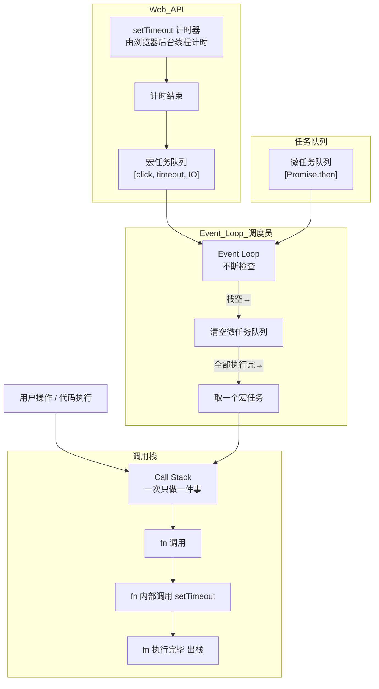


---


#### 1.1.11 最终总结：JS 运行时完整关系图


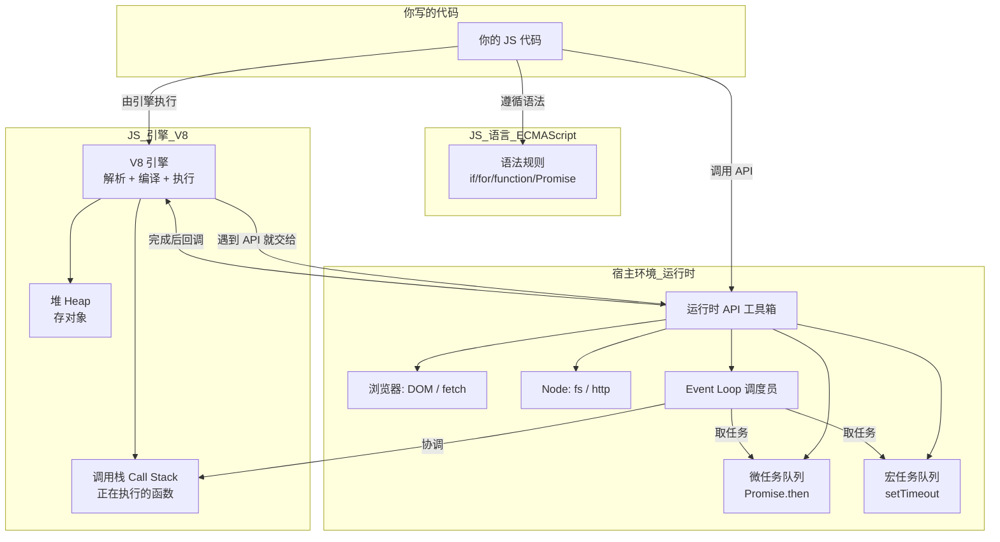


> **全文总结：** 你写的是 **JS 代码** → **V8 引擎**负责解析和执行 → 遇到 `fetch`/`fs`/`setTimeout` 等**运行时 API**，引擎交给宿主环境后台处理 → 完成后回调放入**任务队列** → **Event Loop** 等调用栈空了就把回调取回来执行。引擎只管执行代码，剩下的全是运行时提供的能力。


#### 1.1.12 同步代码阻塞时，主线程、V8、CPU 分别在干什么

```javascript
// 这是一段"阻塞"的同步代码
function longTask() {
  const start = Date.now();
  while (Date.now() - start < 5000) {
    // 什么也不做，就一直循环 5 秒
  }
  console.log('5 秒后终于执行完了');
}

console.log('开始');
longTask();   // ← 同步阻塞 5 秒
console.log('结束');  // ← 必须等 longTask 执行完才到这一行
```

**执行 `longTask()` 时，三个层面的状态：**

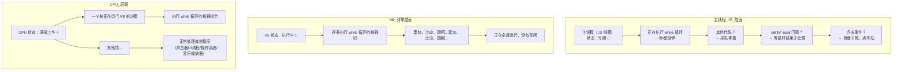

**每个层面的详细解释：**

```
① 主线程（JS 线程）：
   - 状态：忙，在调用栈上执行 while 循环
   - 这 5 秒内不能做任何其他事——不能渲染页面、不能处理点击、不能执行 setTimeout 回调
   - 因为 JS 是单线程的，一个时刻只能做一件事
   - 这就是"阻塞"：longTask 占着调用栈不放，后面的代码全部排队等着

② V8 引擎：
   - 状态：正在逐条执行 while 循环编译后的机器码
   - 它不知道"这需要 5 秒"，它只知道自己正在执行一段需要很多次迭代的循环
   - 一直在执行：获取 Date.now() → 比较差值 → 小于 5000？→ 跳回循环开头...
   - V8 不会主动"停下来看看有没有别的任务"——它只管执行当前调用栈上的代码

③ CPU：
   - 状态：一个逻辑核满载运行 V8 进程
   - 在 while 循环的 5 秒里，这个 CPU 核一直在执行指令，没有空闲
   - 其他 CPU 核不受影响，可以处理其他程序（但 JS 线程本身只用一个核）
   - 所以 while(true) 会让一个 CPU 核跑到 100%，但不会让整个 CPU 满载
```

**反直觉的点：阻塞不是"暂停"，而是"全速做无用功"**

```javascript
// 很多人以为阻塞是"停下了"，其实是"在疯狂做无用计算"
while (Date.now() - start < 5000) {}
// 这 5 秒内 CPU 一秒都没停，在反复执行：
//   1. 获取当前时间
//   2. 减去 start
//   3. 比较是否小于 5000
//   4. 小于 → 跳回第 1 步（继续跑）
//   5. 大于等于 → 退出循环
```

| | 同步阻塞 | 异步（await / setTimeout） |
|--|---------|--------------------------|
| 调用栈 | 被占用，不释放 | 函数出栈，释放给其他代码用 |
| 主线程 | 忙（执行循环） | 空闲（可以处理其他任务） |
| CPU | 满负荷执行无用指令 | 空闲或做其他有用的事 |
| 页面 | 卡死，不能点击 | 流畅，能正常交互 |
| 比喻 | 厨师一直在擦同一口锅，不炒别的菜 | 厨师把菜交给炖锅，转身去切别的菜 |

**所以为什么说"不要用 while(true) 阻塞"——因为它在浪费 CPU 做无用功，而且让主线程干不了任何正事。**


### 1.2 JS 脚本从编写到运行

#### 1.2.1 编写脚本 → 运行的完整链路


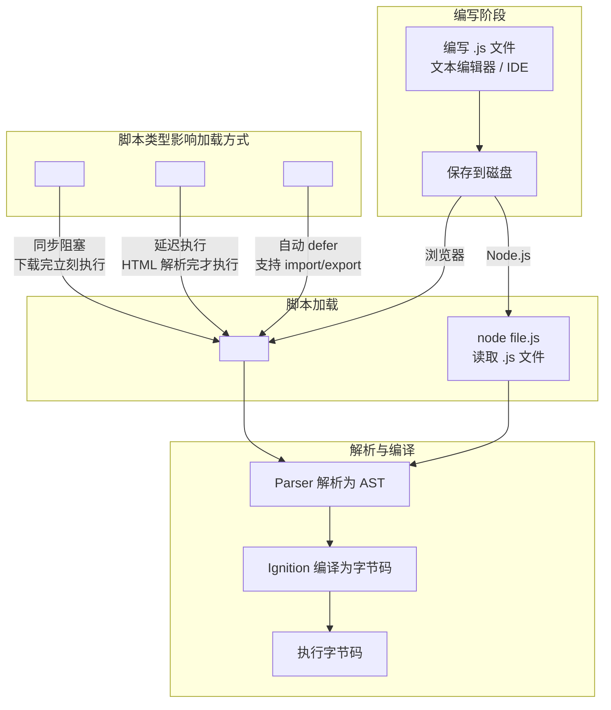


#### 1.2.2 浏览器中脚本加载的三种方式


| 方式 | 加载 | 执行时机 | 顺序保证 | 适用场景 |
|------|------|---------|---------|---------|
| **普通 `<script>`** | 同步阻塞 | 下载完立即执行 | 按出现顺序 | 少量同步代码 |
| **`<script defer>`** | 并行下载 | HTML 解析完后 | 按出现顺序 | 操作 DOM 的脚本 |
| **`<script async>`** | 并行下载 | 下载完立即执行 | 不保证顺序 | 独立分析脚本 |
| **`<script type="module">`** | 并行下载 | HTML 解析完后 | 按依赖关系 | 现代 ESM 应用 |
#### 1.2.3 Node.js 中脚本的运行方式


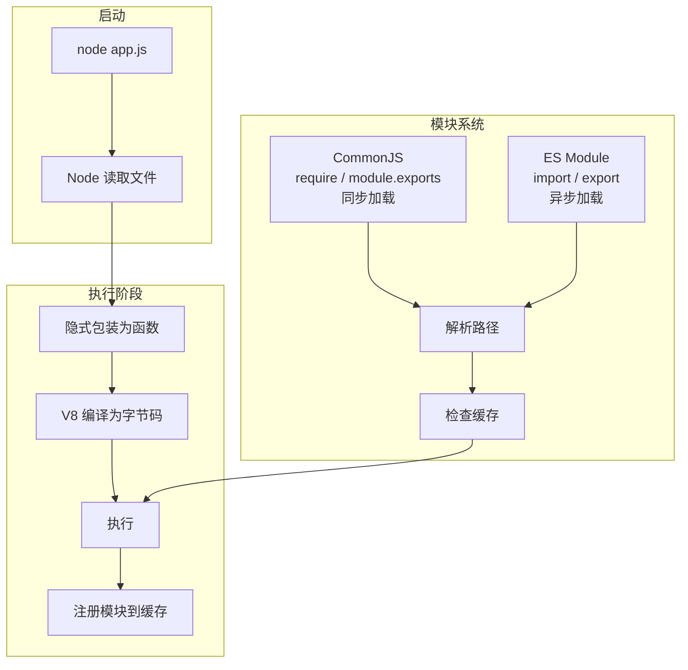


| 概念 | CommonJS (CJS) | ES Module (ESM) |
|------|---------------|-----------------|
| 语法 | `require('./a')` | `import './a'` |
| 加载方式 | 同步 | 异步 |
| 运行时解析 | 是（动态） | 否（静态分析） |
| Tree Shaking | 不支持 | 支持 |
| Node 识别 | `.js` 默认 | `package.json` 中 `"type": "module"` 或 `.mjs` |
#### 1.2.4 从源码到运行的全流程（最简模型）


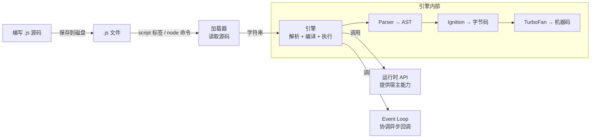


> **一句话：** `.js` 文件只是文本 → 加载器把文本读进来 → 引擎把文本变成字节码/机器码 → 运行时提供额外能力 → Event Loop 让异步不阻塞。


---


### 1.3 数据类型体系


#### 1.3.1 最核心的区别：存值 vs 存地址


JS 的数据类型只分两大类，理解这个就懂了 80%：


```mermaid
graph TB
    subgraph 原始类型_Primitive_存值
        DIR1["变量直接存值在栈内存<br/>let a = 5<br/>a 的盒子里直接放着 5"]
    end
    subgraph 引用类型_Reference_存地址
        DIR2["变量存的是内存地址<br/>let obj = {name:'Tom'}<br/>obj 的盒子里放着'对象在堆上的地址'"]
    end
```


**用后端语言类比：**


| | JS | Java | C# |
|--|----|------|-----|
| 原始类型 | `number`, `string`, `boolean`, `null`, `undefined`, `symbol`, `bigint` | `int`, `double`, `boolean`, `char` | `int`, `double`, `bool`, `char` |
| 引用类型 | `Object`, `Array`, `Function`, `Date`, `Map`, `Set` | 所有 `class` 和 `interface` | 所有 `class` 和 `interface` |
| 赋值行为 | 原始类型=复制值；引用类型=复制地址 | 同 JS | 同 JS |
| 对比方式 | 原始类型用 `===` 比值；引用类型比的是地址 | `==` 比值，`.equals()` 比内容 | `==` 比值（有重载），`Equals()` 比内容 |
**实际代码看看区别：**


```javascript
// 原始类型：let b = a 是"复制值"，互不影响
let a = 5;
let b = a;
b = 10;
console.log(a); // 5  ← a 没变
// 引用类型：let b = a 是"复制地址"，指向同一个对象
let obj1 = { name: 'Tom' };
let obj2 = obj1;
obj2.name = 'Jerry';
console.log(obj1.name); // 'Jerry'  ← obj1 也变了，因为指向同一个对象
```


#### 1.3.2 7 种原始类型


```mermaid
graph LR
    subgraph 原始类型总览
        U["undefined<br/>未定义"] --> N["null<br/>主动置空"]
        N --> B["boolean<br/>true / false"]
        B --> NUM["number<br/>IEEE 754 双精度"]
        NUM --> S["string<br/>UTF-16"]
        S --> SYM["symbol<br/>唯一键"]
        SYM --> BI["bigint<br/>超大整数"]
    end
    subgraph 关键区分
        D1["undefined vs null<br/>undefined = 还没给值<br/>null = 主动设空"]
        D2["number vs bigint<br/>number = 小数 + 整数<br/>bigint = 任意大整数"]
        D3["symbol 唯一性<br/>Symbol('a') !== Symbol('a')<br/>每次调用都创建新值"]
    end
```


| 类型 | 存什么 | 特殊之处 |
|------|-------|---------|
| **undefined** | 未定义 | 声明了没赋值就是它；函数没 return 也是它 |
| **null** | 主动置空 | `typeof null === 'object'` — 这是 JS 的 Bug，别记错 |
| **boolean** | `true` / `false` | 很多值可以转 boolean：`!!0 === false`, `!!'str' === true` |
| **number** | IEEE 754 双精度浮点数 | `0.1 + 0.2 !== 0.3`；最大值 `Number.MAX_VALUE` |
| **string** | UTF-16 编码的字符序列 | 不可变！`str[0] = 'x'` 改不了，必须重新赋值 |
| **symbol** | 唯一的、不可变的值 | 每次 `Symbol()` 都不同；适合做对象属性键，防止命名冲突 |
| **bigint** | 任意精度的整数 | `n` 后缀：`9007199254740993n`；不能和 number 混算 |

**Symbol 到底是干什么的？——一个绝对不会重复的"钥匙"**

```javascript
// Symbol 每次调用都创建一个全新的、独一无二的值
const s1 = Symbol();
const s2 = Symbol();
console.log(s1 === s2);  // false ← 每次都是不同的

// 可以加个描述（只是为了调试时看得懂，不影响唯一性）
const s3 = Symbol('user_id');
const s4 = Symbol('user_id');
console.log(s3 === s4);  // false ← 描述相同，但值不同
```

**Symbol 唯一的实际用途：做对象的属性键，防止命名冲突。**

```javascript
// 问题场景：两个不同的库都想在同一个对象上存数据
// 如果都用字符串键，可能冲突：

const user = { name: 'Tom' };

// 插件 A 在 user 上存一个标记
user.id = 'A-123';

// 插件 B 也在 user 上存一个标记（同名，冲突了！）
user.id = 'B-456';
console.log(user.id);  // 'B-456'  ← A 的数据被覆盖了

// Symbol 解决：用 Symbol 做键，永远不会冲突
const pluginA_id = Symbol('pluginA');
const pluginB_id = Symbol('pluginB');

user[pluginA_id] = 'A-123';
user[pluginB_id] = 'B-456';

console.log(user[pluginA_id]);  // 'A-123' ← 没被覆盖！
console.log(user[pluginB_id]);  // 'B-456'

// Symbol 键不会被普通遍历看到
for (let key in user) console.log(key);  // 'name' ← Symbol 键不出现
Object.keys(user);          // ['name']
Object.getOwnPropertySymbols(user);  // [Symbol(pluginA), Symbol(pluginB)]
```

**Symbol 的另一个作用：实现JS 内置的"标记"接口**

```javascript
// JS 内部用了一些内置的 Symbol 来实现语言特性
// 比如让一个对象支持 for...of 遍历：

const myCollection = {
  items: [1, 2, 3],
  [Symbol.iterator]() {   // Symbol.iterator 是 JS 内置的 Symbol
    let i = 0;
    return {
      next: () => ({ value: this.items[i++], done: i > this.items.length })
    };
  }
};

for (const item of myCollection) {
  console.log(item);  // 1, 2, 3
}
```

**日常开发用不到 Symbol，但理解它就行：**
- Symbol = 一个**绝不会重复**的值
- 主要用途：**做对象属性键，防止不同模块/库之间的命名冲突**
- 内置 Symbol（`Symbol.iterator` 等）是 JS 语言底层用的，理解概念即可


引用类型就是 **Object 以及所有继承自 Object 的类型**。它们的值存在堆内存中，变量只存个地址。


```mermaid
graph TB
    subgraph 引用类型家族树
        O[Object] --> A["Array<br/>有序列表"]
        O --> F["Function<br/>可调用"]
        O --> D["Date<br/>日期时间"]
        O --> R["RegExp<br/>正则表达式"]
        O --> M["Map / Set<br/>ES6 集合"]
        O --> WM["WeakMap / WeakSet<br/>弱引用集合"]
    end
    subgraph 关键概念
        C1["变量存的不是对象本身<br/>是对象的'门牌号'（内存地址）"]
        C2["let a = {}<br/>let b = a<br/>a === b 为 true<br/>因为指向同一个门牌号"]
        C3["{} === {} 为 false<br/>因为两个对象的门牌号不同"]
    end
```


#### 1.3.4 引用类型使用示例


##### Object——最常用的"字典"


```javascript
// 创建
const user = {
  name: 'Tom',
  age: 25,
  'full-name': 'Tom Smith',    // 键名含特殊字符要加引号
};
// 读写
user.name;              // 'Tom'          点号访问
user['full-name'];      // 'Tom Smith'    方括号访问
user.age = 26;          // 修改
user.email = 't@m.com'; // 新增属性
// 删除
delete user.age;        // 删除 age 属性
// 遍历
Object.keys(user);      // ['name', 'full-name', 'email']
Object.values(user);    // ['Tom', 'Tom Smith', 't@m.com']
Object.entries(user);   // [['name','Tom'], ['full-name','Tom Smith'], ...]
// 合并
const a = { x: 1, y: 2 };
const b = { y: 3, z: 4 };
const merged = { ...a, ...b };   // { x: 1, y: 3, z: 4 }  后者覆盖前者
Object.assign({}, a, b);         // 同上
```


| 操作 | 语法 | 说明 |
|------|------|------|
| 可选链 | `user?.address?.city` | 中间任何一层是 null/undefined 就返回 undefined，不报错 |
| 空值合并 | `user.name ?? '默认名'` | 仅在左边是 null/undefined 时才取右边 |
| 解构 | `const { name, age } = user` | 从对象中提取属性为变量 |
| 重命名 | `const { name: userName } = user` | 解构时改名 |
| 默认值 | `const { age = 18 } = user` | 解构时给默认值 |
##### Array——"增强版"列表


```javascript
// 创建
const arr = [1, 2, 3, 4, 5];
const arr2 = new Array(5);        // 长度为 5 的空数组
const arr3 = Array.from('hello'); // ['h','e','l','l','o']
// 增删改
arr.push(6);         // 尾部添加 → [1,2,3,4,5,6]
arr.pop();           // 尾部删除 → [1,2,3,4,5]
arr.unshift(0);      // 头部添加 → [0,1,2,3,4,5]
arr.shift();         // 头部删除 → [1,2,3,4,5]
arr.splice(2, 1);    // 从索引 2 开始删 1 个 → [1,2,4,5]
arr.splice(2, 0, 3); // 在索引 2 插入 3 → [1,2,3,4,5]
// 查找
arr.indexOf(3);      // 2  找到返回索引，找不到返回 -1
arr.includes(3);     // true
arr.find(x => x > 3);  // 4  返回第一个满足条件的元素
arr.findIndex(x => x > 3); // 3  返回索引
// 遍历（重点！）
arr.forEach(x => console.log(x));     // 遍历，无返回值
const doubled = arr.map(x => x * 2);  // [2,4,6,8,10]  映射成新数组
const evens = arr.filter(x => x % 2 === 0);  // [2,4]  过滤
const sum = arr.reduce((a, b) => a + b, 0);  // 15  累加
const found = arr.some(x => x > 4);  // true  有一个满足就返回 true
const all = arr.every(x => x > 0);   // true  全部满足才返回 true
// 排序（注意！排序会修改原数组）
const sorted = [...arr].sort();       // 先复制再排序，不改原数组
arr.sort((a, b) => a - b);           // 数字升序
arr.sort((a, b) => b - a);           // 数字降序
```


| 方法 | 是否改原数组 | 返回值 | 什么时候用 |
|------|-------------|--------|-----------|
| `push / pop` | ✅ 改 | 新长度 / 删掉的元素 | 栈操作（后进先出） |
| `shift / unshift` | ✅ 改 | 删掉的元素 / 新长度 | 队列操作（先进先出） |
| `splice` | ✅ 改 | 删掉的元素 | 任意位置增删 |
| `map / filter` | ❌ 不改 | 新数组 | **最常用**，数据转换 |
| `reduce` | ❌ 不改 | 任意类型 | 聚合计算（求和、分组） |
| `sort` | ✅ 改 | 原数组引用 | **先复制再排序** |
| `slice` | ❌ 不改 | 新数组 | 截取子数组 |
##### Function——JS 中的"一等公民"


```javascript
// 四种定义方式
function add(a, b) { return a + b; }         // 函数声明（有提升）
const sub = function(a, b) { return a - b; } // 函数表达式（无提升）
const mul = (a, b) => a * b;                 // 箭头函数
const div = new Function('a', 'b', 'return a / b'); // 不推荐
// 函数也是对象——可以挂属性
function greet(name) { return `Hello ${name}`; }
greet.version = '1.0';       // 函数上挂属性（不常见但合法）
greet.toString();            // 返回函数源码字符串
// arguments（箭头函数没有）
function sumAll() {
  // arguments 是所有传入参数的类数组对象
  return Array.from(arguments).reduce((a, b) => a + b, 0);
}
sumAll(1, 2, 3);  // 6
// 高阶函数——函数作为参数或返回值
function makeCounter() {
  let count = 0;
  return function() {    // 返回另一个函数（闭包）
    return ++count;
  };
}
const counter = makeCounter();
counter();  // 1
counter();  // 2
```


##### Map / Set——ES6 的"升级版"集合


```javascript
// Map：键可以是任意类型（Object 的键只能是 string/symbol）
const map = new Map();
map.set('name', 'Tom');
map.set(42, 'answer');          // number 作为键
map.set({id:1}, 'object');      // 对象作为键
map.get('name');                // 'Tom'
map.has(42);                    // true
map.delete(42);
map.size;                       // 2
map.clear();                    // 全清空
// Set：值唯一，不会重复
const set = new Set([1, 2, 2, 3, 3, 3]);  // Set { 1, 2, 3 }
set.add(4);
set.has(2);                     // true
set.delete(1);
set.size;                       // 3
// 实际应用：数组去重
const unique = [...new Set([1, 2, 2, 3, 3, 3])];  // [1, 2, 3]
```


| 场景 | 用 Object | 用 Map |
|------|----------|-------|
| 键是字符串 | ✅ | 也行 |
| 键不是字符串（number/object） | ❌ 会转成 string | ✅ |
| 需要遍历顺序 | ❌ 不保证 | ✅ 按插入顺序 |
| 频繁增删键值对 | 一般 | ✅ 性能更好 |
| JSON 序列化 | ✅ 原生支持 | ❌ 需手动转换 |
##### Date——日期时间


```javascript
// 创建
const now = new Date();                    // 当前时间
const d1 = new Date('2024-01-15');         // 字符串解析
const d2 = new Date(2024, 0, 15);          // 月从 0 开始！0=1月
const d3 = new Date(1705305600000);        // 时间戳（毫秒）
// 读写
d1.getFullYear();       // 2024
d1.getMonth();          // 0（0=1月, 11=12月）
d1.getDate();           // 15
d1.getDay();            // 1（0=周日, 1=周一）
d1.getHours();
d1.getTime();           // 时间戳
// 常用工具函数
function formatDate(date) {
  const y = date.getFullYear();
  const m = String(date.getMonth() + 1).padStart(2, '0');
  const d = String(date.getDate()).padStart(2, '0');
  return `${y}-${m}-${d}`;                // '2024-01-15'
}
function daysBetween(a, b) {
  const ms = Math.abs(a.getTime() - b.getTime());
  return Math.floor(ms / (1000 * 60 * 60 * 24));
}
```


> 生产环境日期处理推荐用 **dayjs** 或 **date-fns** 库。原生 Date API 设计糟糕，月从 0 开始、时区处理麻烦、不可变性问题多。


##### 引用类型赋值陷阱——面试常考


```javascript
// 陷阱 1：复制对象只是复制了地址
const a = { name: 'Tom' };
const b = a;          // b 拿到的是 a 的"门牌号"
b.name = 'Jerry';
console.log(a.name);  // 'Jerry'  ← 因为 a 和 b 指向同一个对象
// 正确复制（浅拷贝）
const b1 = { ...a };          // 展开运算符
const b2 = Object.assign({}, a);
// 陷阱 2：浅拷贝只拷贝第一层
const obj = { name: 'Tom', address: { city: 'Beijing' } };
const copy = { ...obj };
copy.address.city = 'Shanghai';
console.log(obj.address.city);  // 'Shanghai'  ← 内层对象还是同一个！
// 深拷贝（三种方式）
const deep1 = JSON.parse(JSON.stringify(obj));   // 简单但会丢失 undefined / function / symbol
const deep2 = structuredClone(obj);             // 现代浏览器内置 API
// 第三方: import { cloneDeep } from 'lodash';
// 陷阱 3：函数参数传引用
function setName(obj) {
  obj.name = 'Jerry';
}
const user = { name: 'Tom' };
setName(user);
console.log(user.name);  // 'Jerry'  ← 函数内部改了外部对象
```


#### 1.3.5 类型检测——怎么判断一个值是什么类型


##### typeof —— 返回一个表示类型的**字符串**


是，`typeof` 返回的就是一个**简单字符串**，且只有 8 种可能的值：


```javascript
typeof 1;             // "number"
typeof 'a';           // "string"
typeof true;          // "boolean"
typeof undefined;     // "undefined"
typeof 123n;          // "bigint"
typeof Symbol();      // "symbol"
typeof function(){};  // "function"
typeof {};            // "object"
typeof [];            // "object"
typeof null;          // "object"   ← 这是 JS 的 Bug！
typeof NaN;           // "number"   ← NaN 的类型是 number
// 那"类型本身"是什么呢？—— typeof 类型名（构造函数）
typeof Number;        // "function"  ← Number 本身是构造函数，不是 "number"
typeof String;        // "function"
typeof Boolean;       // "function"
typeof Object;        // "function"
typeof Array;         // "function"
typeof Function;      // "function"
typeof Symbol;        // "function"
typeof BigInt;        // "function"
// 注意：typeof 类型名（构造函数）始终返回 "function"
// 跟 typeof 该类型的值（typeof 123 → "number"）完全不同
```

**只看这一张表就够了：**


```mermaid
graph TB
    subgraph typeof_返回值清单_全是小写字符串
        R1["typeof 值 → 返回字符串"]
        R2["数字 / NaN → 'number'"]
        R3["字符串 → 'string'"]
        R4["布尔值 → 'boolean'"]
        R5["undefined → 'undefined'"]
        R6["BigInt → 'bigint'"]
        R7["Symbol → 'symbol'"]
        R8["函数 → 'function'"]
        R9["对象 / 数组 / null → 'object'  ← 陷阱"]
    end
```


**两个必记陷阱：**

```javascript
typeof null === 'object'   // true  → 判断 null 必须用 x === null
typeof NaN  === 'number'   // true  → 判断 NaN 必须用 Number.isNaN(x)
```


##### 其他检测方式


```mermaid
graph TB
    subgraph 4种方式怎么选
        T1["typeof<br/>判断原始类型<br/>除了 null 以外都准"]
        T2["instanceof<br/>判断引用类型的具体种类<br/>[] instanceof Array → true"]
        T3["Object.prototype.toString.call()<br/>最精准，所有类型通杀<br/>返回 '[object Array]' / '[object Date]'"]
        T4["Array.isArray()<br/>判断数组的唯一可靠方式"]
    end
    subgraph 速查表
        S1["typeof 1 → 'number'"]
        S2["typeof 'a' → 'string'"]
        S3["typeof true → 'boolean'"]
        S4["typeof undefined → 'undefined'"]
        S5["typeof null → 'object'  ← 别用 typeof 判断 null"]
        S6["typeof [] → 'object'"]
        S7["Array.isArray([]) → true"]
        S8["[] instanceof Array → true"]
        S9["Object.prototype.toString.call([]) → '[object Array]'"]
    end
```


#### 1.3.6 类型转换——JS 最坑的地方


```mermaid
graph TB
    subgraph 黄金法则
        GOLD["始终用 严格等于<br/>不要用 双等号"]
        subgraph 隐式转换_自动发生
            I1["if('str') → true<br/>'' → false"]
            I2["1 + '2' → '12'<br/>number 转 string"]
            I3["'5' - 3 → 2<br/>string 转 number"]
            I4["+'123' → 123<br/>一元 + 转 number"]
        end
        subgraph 显式转换_手动
            E1["String(123) → '123'"]
            E2["Number('123') → 123"]
            E3["Boolean(1) → true"]
            E4["parseInt('123px') → 123"]
        end
    end
    GOLD --> I1
    GOLD --> E1
```


| 场景 | 正确写法 | 错误写法 | 为什么 |
|------|---------|---------|-------|
| 判断值相等 | `a === b` | `a == b` | `==` 会做类型转换，`'5' == 5` 为 true |
| 判断存在 | `if (x !== null && x !== undefined)` | `if (x)` | `if (0)` 和 `if ('')` 都是 false |
| 数字转字符串 | `String(n)` 或 `'' + n` | — | 两种都行，团队统一 |
| 字符串转数字 | `Number(s)` 或 `+s` | `parseInt` | `parseInt` 只取整数部分 |
#### 1.3.7 架构师避坑指南


| 问题 | 原因 | 解决方案 |
|------|------|---------|
| `0.1 + 0.2 !== 0.3` | IEEE 754 精度问题 | 金融计算用 `decimal.js` 或 `big.js` |
| `NaN !== NaN` | NaN 是唯一不自反的值 | `Number.isNaN(x)` |
| `typeof null === 'object'` | JS 语言的遗留 Bug | 用 `x === null` 判断 |
| `'5' - 3 === 2` 但 `'5' + 3 === '53'` | `-` 触发数字转换，`+` 触发字符串拼接 | 时刻留意运算符行为 |
| `[] + [] === ''` | 数组转 string 时空数组变 `''` | 别写这种代码 |
| `{}}` 在控制台可能被解析为代码块 | `{}` 在语句上下文是代码块 | 表达式上下文加括号：`({})` |
### 1.4 作用域与闭包


#### 1.4.1 作用域 = "这段代码能访问哪些变量的规则"


```javascript
// 作用域就是一套规则：当前位置能看到哪些变量
const globalVar = '全局';   // 全局作用域——到处都能访问
function fn() {
  const fnVar = '函数内';   // 函数作用域——只在 fn() 内部能访问
  if (true) {
    let blockVar = '块内';   // 块级作用域——只在 if 块内能访问
    var notBlock = '不 block'; // var 没有块级作用域！
    console.log(globalVar); // ✅ '全局'
    console.log(fnVar);     // ✅ '函数内'
  }
  console.log(blockVar);   // ❌ ReferenceError（let 只在块内）
  console.log(notBlock);   // ✅ '不 block'（var 无视块）
}
console.log(fnVar);        // ❌ ReferenceError（函数外访问不到）
```


**三种作用域：**


```mermaid
graph TB
    subgraph 全局作用域
        G["script 最外层<br/>const g = 1<br/>哪里都能用"]
    end
    subgraph 函数作用域
        F["function foo() 内部<br/>const f = 2<br/>只有 foo 内部能用"]
    end
    subgraph 块级作用域_ES6
        B["if / for / while {} 内部<br/>let / const 声明的<br/>只在 {} 内能用"]
    end
    G --> F
    F --> B
```


| 作用域 | 关键字 | 从哪到哪 | 后端类比 |
|--------|--------|---------|---------|
| 全局 | 任何 | 整个文件任何位置 | Java 的 `public static` 字段 |
| 函数 | `var` / `function` | 整个函数体内部 | Java 方法内的局部变量 |
| 块级 | `let` / `const` | 包裹它的 `{}` 之内 | Java 的 `if {}` 内变量 |
| 词法(嵌套) | 自动 | 内层可以访问外层 | Java 内部类访问外部类 |
#### 1.4.2 作用域链——"内层能看外层，外层不能看内层"


```javascript
// 作用域链 = 变量查找的"路线图"
// 当前作用域找不到，就去外层找，直到全局
const globalVal = '全局';
function outer() {
  const outerVal = '外部';
  function inner() {
    const innerVal = '内部';
    console.log(innerVal);  // 当前作用域找到 → '内部'
    console.log(outerVal);  // 当前没有，去外层找 → '外部'
    console.log(globalVal); // 外层也没有，再去外层 → '全局'
  }
  console.log(innerVal);    // ❌ 外层不能看内层！
}
```


```mermaid
graph TB
    subgraph 查找过程_inner_函数
        LOOKUP["console.log(outerVal)<br/>找变量 outerVal"]
        LOOKUP --> STEP1["① 在 inner 内部找<br/>没找到"]
        STEP1 --> STEP2["② 去 outer 内部找<br/>→ 找到了! 值 = '外部'"]
        STEP2 --> STEP3["③ 如果还找不到<br/>就去全局找"]
        STEP3 --> STEP4["④ 全局也没有<br/>→ ReferenceError"]
    end
```


> 作用域链是**定义时**确定的（叫"词法作用域"），不是调用时确定的。函数写在哪儿，它的外层作用域就是哪儿。


#### 1.4.3 闭包——"函数 + 它出生时能访问的变量"


闭包是 JS 最常考的概念，但理解起来其实很简单：


```javascript
// 闭包 = 一个函数 + 它被创建时能访问到的外层变量
function createCounter() {
  let count = 0;              // count 是 createCounter 的局部变量
  return function() {         // 返回一个"内部函数"
    count++;                  // 它能访问外层变量 count
    return count;
  };
}
const counter = createCounter();  // createCounter 执行完了
// 但 counter 还"记得" count 这个变量！
console.log(counter());  // 1
console.log(counter());  // 2
console.log(counter());  // 3
```


**闭包在干什么？**


```mermaid
graph TB
    subgraph 正常情况_函数执行完变量就消失
        N1["function foo() { let x = 1; }"] --> N2["foo() 执行完"]
        N2 --> N3["x 被垃圾回收<br/>不存在了"]
    end
    subgraph 闭包_变量被保留了
        C1["function bar() { let y = 1; return () => y++; }"] --> C2["bar() 执行完"]
        C2 --> C3["返回的函数还引用着 y"]
        C3 --> C4["y 不被回收<br/>一直存在"]
    end
```


**闭包的实际用途（你每天都在用）：**


```javascript
// 用途 1：数据私有化（像 Java 的 private 字段）
function createPerson(name) {
  let age = 0;  // 外部不能直接修改 age
  return {
    getName: () => name,
    getAge: () => age,
    birthday: () => { age++; },
  };
}
const p = createPerson('Tom');
p.age;        // ❌ undefined（不能直接访问）
p.birthday(); // ✅ 只能通过暴露的方法修改
p.getAge();   // ✅ 1
// 用途 2：事件回调（前端最常见）
function setupButton(buttonId) {
  let clicks = 0;
  document.getElementById(buttonId).onclick = function() {
    clicks++;
    console.log(`按钮被点了 ${clicks} 次`);
    // 这个回调函数"记住"了 clicks 变量
  };
}
// 用途 3：setTimeout 的回调
function delayedGreet(name, delay) {
  setTimeout(function() {
    console.log(`Hello, ${name}!`);  // 记住了 name
  }, delay);
}
```


**闭包的内存风险：**


```javascript
// 闭包会阻止变量被回收——用完了记得清理
// ❌ 问题：事件监听器没移除，闭包一直存在
function addHandler() {
  const bigData = new Array(1000000).fill('data');
  document.getElementById('btn').onclick = function() {
    console.log(bigData.length);  // bigData 永远不会被回收！
  };
}
// ✅ 修复：不用了就要清理
function addHandlerFixed() {
  const bigData = new Array(1000000).fill('data');
  function handler() {
    console.log(bigData.length);
  }
  document.getElementById('btn').addEventListener('click', handler);
  // 移除时：document.getElementById('btn').removeEventListener('click', handler);
  // handler 不再被引用 → bigData 可以被回收
}
```


#### 1.4.4 var 的陷阱和 let/const 的改进


```javascript
// var 的问题 1：没有块级作用域
if (true) {
  var a = 1;
  let b = 2;
}
console.log(a);  // 1  ← var 穿过了 if 块
console.log(b);  // ❌ ReferenceError
// var 的问题 2：变量提升（hoisting）
console.log(c);  // undefined ← 不报错，因为 var c 被提升到顶部
var c = 3;
// 等价于：
// var c;
// console.log(c);  // undefined
// c = 3;
// let 的正确行为：暂存死区
console.log(d);  // ❌ ReferenceError（不能在声明前使用）
let d = 4;
// let 也会提升，但存在"暂存死区"——声明前访问就报错
// 实际影响：for 循环
for (var i = 0; i < 3; i++) {
  setTimeout(() => console.log(i), 100);  // 输出 3, 3, 3
  // 因为 var i 是全局的，循环结束时 i = 3
}
for (let j = 0; j < 3; j++) {
  setTimeout(() => console.log(j), 100);  // 输出 0, 1, 2
  // 因为 let j 每次迭代都是一个新的变量
}
```


```mermaid
graph TB
    subgraph var
        V1["声明提升到顶部<br/>初始值 = undefined<br/>可以在声明前使用"]
        V2["没有块级作用域<br/>if/for 挡不住"]
        V3["函数作用域"]
    end
    subgraph let_const
        L1["声明提升<br/>但暂存死区<br/>声明前使用 → 报错"]
        L2["有块级作用域<br/>{} 能挡住"]
        L3["const 不能重新赋值<br/>let 可以"]
    end
    V1 --> L1
    V2 --> L2
```


> **架构师建议：永远用 `const`，只有确定要重新赋值时才用 `let`，永远不用 `var`。**


### 1.5 原型链与继承

#### 1.5.1 先搞清楚两个最基础的概念

**概念一：prototype（原型）是什么？**

prototype 就是一个**普通的 JavaScript 对象**。它不是类型，不是类，就是一个存着属性和方法的对象。

```javascript
// prototype 就是一个对象，跟你写 {} 没区别
const myObj = { a: 1, b: 2 };
const proto = { speak() { return 'hello'; } };
console.log(typeof proto);  // 'object' ← prototype 的类型就是 object
```

**概念二：constructor（构造函数）是什么？**

构造函数就是一个**普通的函数**，唯一的区别是它被设计用来配合 `new` 关键字创建对象。

```javascript
// 普通函数——直接调用
function add(a, b) { return a + b; }
add(1, 2);  // 直接调
// 构造函数——用 new 调用（约定首字母大写）
function Animal(name) {
  this.name = name;  // this 指向新创建的对象
}
const dog = new Animal('旺财');
// new 干了四件事：
// ① 创建一个空对象 {}
// ② 把这个空对象的 __proto__ 指向 Animal.prototype
// ③ 把 this 绑定到这个空对象上，执行函数体
// ④ 返回这个对象
```

**普通函数和构造函数可以互换调用吗？——可以，但效果不同**

```javascript
// 任何函数都能用 new 调用，任何函数也都能直接调用
// 效果取决于怎么调，不取决于函数本身
function fn() {
  console.log('this:', this);
  this.x = 1;
}
// 直接调用——普通函数
fn();             // this: undefined（严格模式）或 window（非严格）
console.log(x);   // ❌ 严格模式报错，非严格模式挂到全局
// new 调用——构造函数
const obj = new fn();  // this: {}（新创建的对象）
console.log(obj.x);    // 1
// class 特殊：必须用 new 调，不能直接调
class Animal { constructor() { this.x = 1; } }
Animal();     // ❌ TypeError: Class constructor Animal cannot be invoked without 'new'
new Animal(); // ✅
```

```mermaid
graph TB
    CALL["调用方式"] --> NEW{"用 new?"}
    NEW -->|"是"| RESULT1["创建新对象<br/>this 指向新对象<br/>返回新对象"]
    NEW -->|"否"| CLASS{"是 class 吗?"}
    CLASS -->|"是"| ERROR["❌ 报错"]
    CLASS -->|"否（普通 function）"| RESULT2["this = undefined(严格)<br/>或者 window(非严格)<br/>看 return 返回值"]
```

**总结：**

| | 普通函数 `function fn()` | `class` 定义的类 |
|--|------------------------|-----------------|
| 用 `new` 调 | ✅ 变成构造函数，返回新对象 | ✅ 正常创建实例 |
| 直接调 | ✅ 普通函数执行 | ❌ 报错 |
| 用 `new` 时的 this | 新创建的空对象 | 新创建的空对象 |
| 直接调时的 this | 取决于调用方式（window / undefined） | 不适用（报错） |

#### 1.5.2 prototype、constructor、__proto__ 三者的关系

```javascript
// 当你写 class Animal 时，JS 底层自动创建了两个东西：
class Animal {
  constructor(name) { this.name = name; }
  speak() { return '...'; }
}
// ① Animal 本身是一个函数（也是构造函数）
// ② Animal.prototype 是一个对象，存着 speak 方法
console.log(typeof Animal);              // 'function'
console.log(typeof Animal.prototype);    // 'object'
console.log(Animal.prototype.speak);     // ƒ speak() { ... }
```

**三者的关系用一张图说清：**

```mermaid
graph TB
    CONS["构造函数 Animal<br/>（一个函数）"]
    CONS -->|"Animal.prototype"| PROT["prototype 对象<br/>{ speak: fn, constructor: Animal }"]
    PROT -->|"prototype.constructor"| CONS
    INST["实例 dog<br/>new Animal() 创建的对象"]
    INST -->|"dog.__proto__"| PROT
```

```javascript
// 用代码验证上面的图：
class Animal {
  constructor(name) { this.name = name; }
  speak() { return '...'; }
}
const dog = new Animal('旺财');
// Animal 是构造函数（一个函数）
typeof Animal;                  // 'function'
// Animal.prototype 是一个对象
typeof Animal.prototype;        // 'object'
// Animal.prototype 上有个 constructor 属性，指回 Animal
Animal.prototype.constructor === Animal;  // true
// 实例 dog 的 __proto__ 指向 Animal.prototype
dog.__proto__ === Animal.prototype;       // true
```

**prototype 到底是干什么用的？**

```javascript
// 当你访问 dog.speak() 时：
// ① 先在 dog 自己身上找 → 没有 speak
// ② 去 dog.__proto__ 上找 → 也就是 Animal.prototype → 找到了 speak！
// ③ 调用它
// 所以：prototype 上的方法，所有实例共享
const d1 = new Animal('旺财');
const d2 = new Animal('来福');
d1.speak === d2.speak;  // true（同一个函数，不是各有一份）
// 对比：constructor 里定义的属性，每个实例各有一份
d1.name;  // '旺财'
d2.name;  // '来福'
```

#### 1.5.3 原型链——查找属性的"寻路图"

```mermaid
graph TB
    DOG["dog 对象<br/>{ name: '旺财' }"]
    DOG -->|"没有 speak? 找 __proto__"| DOG_PROTO["Dog.prototype<br/>{ speak, fetch }"]
    DOG_PROTO -->|"也没有 toString? 再找 __proto__"| ANIMAL_PROTO["Animal.prototype<br/>{ speak }"]
    ANIMAL_PROTO -->|"还没有? 再找 __proto__"| OBJECT_PROTO["Object.prototype<br/>{ toString }"]
    OBJECT_PROTO -->|"再没有? __proto__ 是 null"| NULL["null → 返回 undefined"]
```

```javascript
// 原型链的查找过程用代码验证：
class Animal { speak() { return '...'; } }
class Dog extends Animal { bark() { return '汪汪'; } }
const dog = new Dog('旺财');
// 查找 dog.speak：
dog.speak;  // ① dog 自身 → 没有
            // ② dog.__proto__ (Dog.prototype) → 没有
            // ③ dog.__proto__.__proto__ (Animal.prototype) → 找到了！返回
// 查找 dog.toString：
dog.toString; // 一直找到 Object.prototype 才找到
// 原型链的终点：
dog.__proto__.__proto__.__proto__.__proto__;  // null
```

#### 1.5.4 写代码时直接用 class，不用管原型链

```javascript
// ✅ 现代写法：class。底层仍然是原型链，但语法清晰
class Animal {
  constructor(name) { this.name = name; }
  speak() { return `${this.name} 叫`; }
  static create(name) { return new Animal(name); }  // 静态方法
}
const dog = new Animal('旺财');
dog.speak();  // 旺财叫
// ❌ 别这么写——老式写法，手动操作 prototype，可读性差
function OldAnimal(name) { this.name = name; }
OldAnimal.prototype.speak = function() { return this.name + ' 叫'; };
```

> **架构师建议：** 理解原型链是为了调试和读源码。写代码时用 `class` 就够了，就像你在 Java 里不需要手动操作虚方法表一样。


### 1.6 this 指向


#### 1.6.1 核心认知：this 和 Java 完全不同


```javascript
// Java 的 this：永远指向"当前对象"
class Foo {
  private int x = 1;
  void bar() { System.out.println(this.x); }  // this 永远是 foo 实例
}
Foo foo = new Foo();
foo.bar();  // 1
// JS 的 this：指向谁取决于"函数怎么被调用的"
const obj = {
  x: 1,
  bar() { console.log(this.x); }
};
obj.bar();     // 1   ✅ obj.bar() → this = obj
const fn = obj.bar;
fn();          // undefined ❌ fn() 没有调用者 → this = undefined（严格模式）
```


> **关键区别：** Java 的 `this` 在编译时就确定了，JS 的 `this` 在**调用时**才确定。`this` 指向的不是"函数属于谁"，而是"谁调了它"。


#### 1.6.2 只有 5 条规则，每条一个代码示例


##### 规则 1：默认绑定——直接调用函数


```javascript
function showThis() {
  console.log(this);
}
showThis();
// 非严格模式: window（浏览器）/ global（Node）
// 严格模式: undefined
```


##### 规则 2：隐式绑定——通过对象调用（obj.fn()）


```javascript
const user = {
  name: 'Tom',
  greet() {
    console.log(`Hello, ${this.name}`);
  }
};
user.greet();             // Hello, Tom  ← this = user
// 等价于：user.greet.call(user)
// ⚠️ 陷阱：把方法取出来单独调用，隐式绑定就丢了
const greetFn = user.greet;
greetFn();                // Hello, undefined ← this 丢了
// 因为 greetFn() 是"直接调用"，走了规则 1（默认绑定）
```


##### 规则 3：显式绑定——手动指定 this（call / apply / bind）


```javascript
function introduce(greeting) {
  console.log(`${greeting}, I'm ${this.name}`);
}
const user1 = { name: 'Tom' };
const user2 = { name: 'Jerry' };
introduce.call(user1, 'Hi');    // Hi, I'm Tom    ← this = user1
introduce.apply(user2, ['Hi']); // Hi, I'm Jerry  ← this = user2
const boundIntroduce = introduce.bind(user1);
boundIntroduce('Hello');        // Hello, I'm Tom  ← 永久绑定到 user1
```


| 方法 | 立刻执行? | 参数传法 | 返回 | 用途 |
|------|----------|---------|------|------|
| `fn.call(obj, a, b)` | ✅ 立刻 | 逗号分隔 | fn 的返回值 | 临时指定 this |
| `fn.apply(obj, [a, b])` | ✅ 立刻 | 数组 | fn 的返回值 | 参数已经是数组时 |
| `fn.bind(obj)` | ❌ 不执行 | 预传部分参数 | 新函数 | 永久绑定 this |
##### 规则 4：new 绑定——构造函数


```javascript
function Person(name) {
  this.name = name;  // this = 新创建的空对象
}
const p = new Person('Tom');
console.log(p.name);  // Tom
// new 干了四件事：
// ① 创建一个全新的空对象 {}
// ② 把这个对象的 __proto__ 指向 Person.prototype
// ③ 把 this 绑定到这个新对象上
// ④ 如果构造函数没返回对象，就返回这个新对象
```


##### 规则 5：箭头函数——没有自己的 this，用的是"外面的"

**箭头函数没有自己的 `this`。** 它里面的 `this` 是定义箭头函数时**外层作用域**的 `this`。并且一旦确定，`call/apply/bind` 也无法改变。

**先看最简单的区别——不用 `function` 写而是用 `=>` 写：**

```javascript
// 普通函数：this 是谁调的，就是谁
function normalFn() {
  console.log(this);
}
normalFn();           // undefined（严格模式）
// 箭头函数：没有自己的 this，用的是外面的 this
const arrowFn = () => {
  console.log(this);
};
arrowFn();            // 外面的 this（一般是 window 或 undefined）
```

**箭头函数的 this 在定义时就已经确定了，跟怎么调用无关：**

```javascript
const obj = {
  name: 'Tom',
  // 方法是用 function 写的 → this 看调用方式
  greetNormal() {
    console.log(this.name);
  },
  // 方法是用箭头函数写的 → this 看定义位置，不是看调用方式
  greetArrow: () => {
    console.log(this.name);
  }
};
obj.greetNormal();  // 'Tom'     ← this = obj（谁调用就是谁）
obj.greetArrow();   // undefined ← this 不是 obj！箭头函数没有自己的 this
                    //           用的是定义时的外层 this（全局）
```

**箭头函数真正有用的地方——回调里保留外层的 this：**

```javascript
const timer = {
  name: 'Timer',
  start() {
    // 这里的 this = timer（因为 start 是 obj.start() 调用的）
    // ❌ 普通函数：回调里的 this 会变成全局
    setTimeout(function() {
      console.log(this.name);  // undefined
      // 这里的 this 不是 timer 了，是全局对象
    }, 100);
    // ✅ 箭头函数：回调里的 this 是定义时外层的 this
    setTimeout(() => {
      console.log(this.name);  // 'Timer'
      // 箭头函数的 this = 定义时外层 start 的 this = timer
    }, 100);
  }
};
timer.start();
```

**箭头函数 vs 普通函数对比：**

| | 普通函数 | 箭头函数 |
|--|---------|---------|
| this | 看怎么调（谁调就是谁） | 看在哪定义（外层 this 是啥它就是啥） |
| 能不能 call/apply/bind 改 this | ✅ 可以 | ❌ 不行（没有自己的 this） |
| arguments | ✅ 有 | ❌ 没有 |
| 适合场景 | 对象方法、构造函数 | 回调、setTimeout、Promise.then |

**一句话记：箭头函数自己不决定 this，它用"外面"的 this。**


#### 1.6.3 一张图记住全部规则


```mermaid
graph TB
    subgraph 调用方式_决定_this
        Q["调用方式"] --> NEW{"new fn()?"}
        NEW -->|"是"| NEW_RESULT["→ this = 新创建的空对象<br/>优先级最高"]
        NEW -->|"否"| CALL{"call / apply / bind?"}
        CALL -->|"是"| CALL_RESULT["→ this = 你指定的对象<br/>优先级第二"]
        CALL -->|"否"| OBJ{"obj.fn()?"}
        OBJ -->|"是"| OBJ_RESULT["→ this = obj<br/>优先级第三"]
        OBJ -->|"否"| DEFAULT["→ 直接调用 fn()<br/>this = undefined（严格） / window（非严格）<br/>优先级最低"]
    end
    subgraph 箭头函数例外
        ARROW["箭头函数不适用以上任何规则<br/>this = 定义时外层作用域的 this<br/>call/apply/bind 也无法改变"]
    end
```


#### 1.6.4 优先级总结


```
new 绑定      → fn = new Fn()         → this = 新对象        ← 最高
显式绑定     → fn.call(obj)          → this = obj           ← 第二
隐式绑定     → obj.fn()              → this = obj           ← 第三
默认绑定     → fn()                  → this = window / undefined  ← 最低
箭头函数     → () => {}              → this = 定义位置的 this  ← 独立规则
```


#### 1.6.5 面试常考题


```javascript
const name = 'Global';
const obj = {
  name: 'Obj',
  greet() {
    console.log(this.name);
  },
  greetArrow: () => {
    console.log(this.name);
  },
  greetInner() {
    function inner() {
      console.log(this.name);
    }
    inner();  // 直接调用 → 默认绑定
  }
};
obj.greet();         // 'Obj'    → 隐式绑定
obj.greetArrow();    // 'Global' → 箭头函数，this = 全局
obj.greetInner();    // 'Global' → inner() 是直接调用
const fn = obj.greet;
fn();                // 'Global' → 引用丢失，变成默认绑定
obj.greet.call({ name: 'Custom' });  // 'Custom' → 显式绑定覆盖了隐式绑定
```


### 1.7 异步编程 — Event Loop & Promise


#### 1.7.1 异步的两种任务


```mermaid
graph TB
    subgraph 两种任务
        M1["微任务 Microtask<br/>Promise.then / queueMicrotask<br/>异步结束后立即处理"]
        M2["宏任务 Macrotask<br/>setTimeout / click 事件 / I/O<br/>排到队尾等待处理"]
    end
    subgraph Event_Loop_调度规则
        EL["① 执行完当前同步代码<br/>② 清空全部微任务<br/>③ 可能 UI 渲染<br/>④ 取一个宏任务执行<br/>⑤ 回到步骤 ②"]
    end
```


#### 1.7.2 Promise——异步结果的容器


```javascript
// Promise 就是一个"装异步结果的盒子"
// pending → fulfilled（成功） 或 rejected（失败）
// 状态一旦改变就不可逆
const promise = new Promise((resolve, reject) => {
  // 这里执行异步操作
  setTimeout(() => {
    resolve('成功');   // 把盒子从 pending 变成 fulfilled
    // reject('失败'); // 或者变成 rejected
  }, 1000);
});
promise.then(
  result => console.log(result),  // 成功时调用
  error => console.log(error)     // 失败时调用
);
```


```mermaid
graph LR
    subgraph Promise_状态机
        PENDING["pending<br/>等待中"]
        PENDING -->|resolve| FULFILLED["fulfilled<br/>成功了"]
        PENDING -->|reject| REJECTED["rejected<br/>失败了"]
        FULFILLED --> THEN[".then() 里的回调<br/>进微任务队列"]
        REJECTED --> CATCH[".catch() 里的回调<br/>进微任务队列"]
    end
```


#### 1.7.3 五种静态方法——控制多个 Promise 的并行策略

```javascript
// 先准备三个 Promise
const p1 = Promise.resolve('用户数据');      // 立即成功
const p2 = new Promise(r => setTimeout(() => r('文章数据'), 100));  // 稍后成功
const p3 = Promise.reject('网络错误');        // 立即失败
```

**`Promise.all`——全部成功才 resolve，一个失败就 reject：**

```javascript
try {
  const result = await Promise.all([p1, p2, p3]);  // ❌ p3 reject
} catch (err) {
  console.log(err);  // '网络错误'（第一个 reject 的值）
}
// ⚠️ 已成功的 p1 和 p2 不会回滚

// 成功时的结果：
const [users, posts] = await Promise.all([p1, p2]);
// users = '用户数据', posts = '文章数据'
// 返回数组，顺序跟传入的 Promise 数组一致
```

**`Promise.allSettled`——不管成功失败，等所有完成：**

```javascript
const result = await Promise.allSettled([p1, p2, p3]);
console.log(result);
// [
//   { status: 'fulfilled', value: '用户数据' },
//   { status: 'fulfilled', value: '文章数据' },
//   { status: 'rejected', reason: '网络错误' }
// ]
// 每个结果都有 status，成功有 value，失败有 reason
```

**`Promise.race`——谁先完成就取谁（不管成功还是失败）：**

```javascript
const slow = new Promise(r => setTimeout(() => r('慢的'), 1000));
const fast = new Promise(r => setTimeout(() => r('快的'), 100));

const result = await Promise.race([slow, fast]);
console.log(result);  // '快的'（100ms 后就返回了）
// slow 虽然还在跑，但结果已经被丢弃

// 常用场景：超时控制
const data = await Promise.race([
  fetch('/api/data'),                          // 真实请求
  new Promise((_, reject) => setTimeout(() => reject('超时'), 5000)),  // 5 秒超时
]);
// 如果 5 秒内 fetch 没回来，就 reject '超时'
```

**`Promise.any`——谁先成功就取谁（失败的不算）：**

```javascript
const p1 = Promise.reject('服务器1 挂了');
const p2 = new Promise(r => setTimeout(() => r('服务器2 数据'), 200));
const p3 = new Promise(r => setTimeout(() => r('服务器3 数据'), 100));

const result = await Promise.any([p1, p2, p3]);
console.log(result);  // '服务器3 数据'（最快的成功结果）
// p1 reject 被忽略，p2 虽然比 p3 慢，但拿到成功就行

// 全部失败才 reject：
const allFail = await Promise.any([
  Promise.reject('全挂了'),
  Promise.reject('都挂了'),
]);  // ❌ AggregateError: All promises were rejected
```

**重点：`Promise.all` 一个失败后，其他已成功的任务不会回滚**

```javascript
// 这是一个非常常见的误解，用代码说清楚：
const results = await Promise.all([
  writeToDB('user', { name: 'Tom' }),   // ① 先完成：写入成功
  writeToDB('post', { title: 'Hello' }), // ② 后完成：写入成功
  writeToDB('log', invalidData),          // ③ reject！
]);
// Promise.all 会在 ③ reject 时立即 reject
// 但 ① 和 ② 的数据库写入已经发生了！
// Promise.all 不会回滚 ① 和 ② 的数据
// 如果想回滚，必须自己实现：
async function safeWriteAll(operations) {
  const results = [];
  try {
    for (const op of operations) {
      results.push(await op);
    }
    return results;
  } catch (err) {
    // 手动回滚已成功的操作
    for (const result of results) {
      await rollback(result);
    }
    throw err;
  }
}
```

```mermaid
graph TB
    subgraph Promise_all_的真相
        A["发起 3 个请求"] --> B1["请求 1 成功 ✅"]
        A --> B2["请求 2 成功 ✅"]
        A --> B3["请求 3 失败 ❌"]
        B3 --> REJECT["Promise.all 立即 reject"]
        B1 --> DONE1["请求 1 已写入数据库 → 不会回滚"]
        B2 --> DONE2["请求 2 已写入数据库 → 不会回滚"]
        REJECT --> CATCH["catch 捕获错误"]
    end
```

**和 SQL 事务的本质区别：**

```sql
-- SQL 事务：原子性，要么全成功，要么全回滚
BEGIN TRANSACTION;
  INSERT INTO users VALUES ('Tom');   -- 如果下面失败，这条会回滚
  INSERT INTO posts VALUES ('Hello'); -- 失败，全部回滚
COMMIT;
```

```javascript
// Promise.all：没有原子性！已经成功的不会自动回滚
await Promise.all([
  insertUser('Tom'),       // ✅ 成功 → 数据库里已经写了
  insertPost('Hello'),     // ❌ 失败 → Promise.all reject
]);
// 此时 insertUser 的数据还在数据库里！
```

| 方法 | 行为 | 失败策略 | 会不会取消其他任务 | 类比 |
|------|------|---------|------------------|------|
| `Promise.all` | 全部成功才 resolve | 一个失败立即 reject | ❌ 不会取消，已成功的不会回滚 | 并发请求，缺一不可 |
| `Promise.allSettled` | 全部完成才 resolve | 不 reject，返回每个结果 | ❌ 不会取消 | 批量发货，独立 tracking |
| `Promise.race` | 第一个完成就 resolve/reject | 谁先失败就 reject | ❌ 不会取消，其他继续跑 | CDN 抢答 |
| `Promise.any` | 第一个成功就 resolve | 全部失败才 reject | ❌ 不会取消 | 备用服务器，哪个能用用哪个 |
#### 1.7.4 执行顺序总结


```
同步代码 → 清空所有微任务（Promise.then） → UI 渲染 → 取一个宏任务（setTimeout）
```


| 类别 | 举例 | 什么时候执行 |
|------|------|-------------|
| 同步 | `console.log` / `for` 循环 | 立刻，当前调用栈 |
| 微任务 | `Promise.then` / `queueMicrotask` | 当前同步代码执行完后，全部清空 |
| 宏任务 | `setTimeout` / click 事件 / I/O | 微任务清空后，一次取一个 |
| 渲染 | UI 绘制 | 宏任务之前（浏览器） |
### 1.8 Proxy / Reflect —— 给对象加一层"拦截中间件"


#### 1.8.1 Proxy = 对象的"代理层"


```javascript
// 没有 Proxy：读写对象直接操作
const obj = { name: 'Tom' };
obj.name;         // 直接读
obj.name = 'Jerry';  // 直接写
// 有 Proxy：读写操作会被拦截
const handler = {
  get(target, key) {
    console.log(`读取了 ${key}`);
    return target[key];
  },
  set(target, key, value) {
    console.log(`设置了 ${key} = ${value}`);
    target[key] = value;
    return true;
  }
};
const proxy = new Proxy(obj, handler);
proxy.name;          // 读取了 name
proxy.name = 'Jerry'; // 设置了 name = Jerry
```


**Proxy 就像一个"中间人"——所有对对象的操作都先经过它。**


```mermaid
graph LR
    subgraph 没有_Proxy
        CODE1["你的代码"] -->|直接读写| OBJ1["原对象"]
    end
    subgraph 有_Proxy
        CODE2["你的代码"] -->|读写| PROXY["Proxy 代理层"]
        PROXY -->|get/set 等 13 种操作<br/>都可以在这里拦截| HANDLER["handler 处理器"]
        HANDLER -->|转发给原对象| OBJ2["原对象"]
    end
```


#### 1.8.2 `get` 和 `set`——最常用的两个拦截，参数分别是什么

```javascript
const proxy = new Proxy(target, {
  // ─── get：拦截读取操作 ───
  // 触发时机：proxy.xxx 或 proxy[xxx]
  // 参数：
  //   target    → 被代理的原对象
  //   key       → 读取的属性名（string 或 symbol）
  //   receiver  → 谁发起的读取（通常是 proxy 本身，继承时有用）
  get(target, key, receiver) {
    console.log(`读取 ${String(key)}`);
    return Reflect.get(target, key, receiver);  // 转发默认行为
  },

  // ─── set：拦截写入操作 ───
  // 触发时机：proxy.xxx = value
  // 参数：
  //   target    → 被代理的原对象
  //   key       → 写入的属性名
  //   value     → 要写入的值
  //   receiver  → 谁发起的写入
  // 返回值：必须返回 boolean，true 表示写入成功
  set(target, key, value, receiver) {
    console.log(`设置 ${String(key)} = ${value}`);
    return Reflect.set(target, key, value, receiver);
  }
});
```

**其他 13 种拦截操作（知道存在就行，用时再查）：**

```javascript
const proxy = new Proxy(target, {
  get(target, key, receiver) {},              // 读取：proxy.xxx
  set(target, key, value, receiver) {},        // 写入：proxy.xxx = val
  has(target, key) {},                         // in 操作符：'key' in proxy
  deleteProperty(target, key) {},              // delete：delete proxy.xxx
  ownKeys(target) {},                          // 遍历：Object.keys(proxy)
  getOwnPropertyDescriptor(target, key) {},    // Object.getOwnPropertyDescriptor
  defineProperty(target, key, desc) {},        // Object.defineProperty
  preventExtensions(target) {},                // Object.preventExtensions
  getPrototypeOf(target) {},                   // Object.getPrototypeOf
  setPrototypeOf(target, proto) {},            // Object.setPrototypeOf
  isExtensible(target) {},                     // Object.isExtensible
  apply(target, thisArg, args) {},             // 函数调用：proxy(...)
  construct(target, args, newTarget) {},       // new：new proxy(...)
});
```

**实际项目中最常用的三个：**

```javascript
const user = { name: 'Tom', age: 25 };
const proxy = new Proxy(user, {
  // get——拦截读取，可以加工返回值
  get(target, key) {
    if (key === 'age') return target.age + '岁';
    return target[key];
  },

  // set——拦截写入，可以做校验
  set(target, key, value) {
    if (key === 'age' && (typeof value !== 'number' || value < 0)) {
      throw new Error('年龄必须是正数');
    }
    target[key] = value;
    return true;
  },

  // has——拦截 in 操作符，可以隐藏属性
  has(target, key) {
    if (key === '_secret') return false;
    return key in target;
  }
});

proxy.age;          // '25岁'
proxy.age = -1;     // Error: 年龄必须是正数
'_secret' in proxy; // false
```


#### 1.8.3 Reflect API——除了 Proxy 配合，还能独立使用

`Reflect` 是一个内置对象（不是构造函数），提供了和对象操作对应的方法。它和 Proxy 的 13 个陷阱一一对应。

**Reflect 所有方法一览：**

```javascript
// Reflect 的方法和对应的传统写法
Reflect.get(obj, key)             // obj[key]
Reflect.set(obj, key, value)      // obj[key] = value
Reflect.has(obj, key)             // key in obj
Reflect.deleteProperty(obj, key)  // delete obj[key]
Reflect.ownKeys(obj)              // Object.keys(obj) 的完整版
Reflect.getPrototypeOf(obj)       // Object.getPrototypeOf(obj)
Reflect.setPrototypeOf(obj, proto)// Object.setPrototypeOf(obj, proto)
Reflect.defineProperty(obj, key, desc) // Object.defineProperty
Reflect.getOwnPropertyDescriptor(obj, key) // Object.getOwnPropertyDescriptor
Reflect.isExtensible(obj)         // Object.isExtensible
Reflect.preventExtensions(obj)    // Object.preventExtensions
Reflect.apply(fn, thisArg, args)  // fn.apply(thisArg, args)
Reflect.construct(Class, args)    // new Class(...args)
```

**Reflect 的 3 个优势：**

```javascript
// ① 返回值更合理
// 传统操作在失败时可能抛出异常或返回 undefined
// Reflect 统一返回 boolean

const obj = {};
Object.defineProperty(obj, 'name', { value: 'Tom', writable: false });

obj.name = 'Jerry';              // 静默失败（严格模式才报错）
Reflect.set(obj, 'name', 'Jerry'); // false ← 明确告诉你失败了

delete obj.xxx;                   // true（就算属性不存在也返回 true）
Reflect.deleteProperty(obj, 'xxx'); // true（一致的行为）

// ② 函数式调用，避免操作符
// key in obj → Reflect.has(obj, key)
// delete obj[key] → Reflect.deleteProperty(obj, key)

console.log('name' in obj);               // true
console.log(Reflect.has(obj, 'name'));     // true

delete obj.name;
Reflect.deleteProperty(obj, 'name');

// ③ 和 Proxy 的 13 个陷阱一一对应
// 每个 Proxy 陷阱都有一个同名的 Reflect 方法
// 所以 Proxy 里最安全的方式是：Reflect.xxx 转发到原对象

const proxy = new Proxy(obj, {
  get(target, key, receiver) {
    return Reflect.get(target, key, receiver);
    // 确保 getter 的 this 正确指向 receiver
  },
  set(target, key, value, receiver) {
    return Reflect.set(target, key, value, receiver);
  },
  has(target, key) {
    return Reflect.has(target, key);
  },
  deleteProperty(target, key) {
    return Reflect.deleteProperty(target, key);
  },
  ownKeys(target) {
    return Reflect.ownKeys(target);
  },
  apply(target, thisArg, args) {
    return Reflect.apply(target, thisArg, args);
  },
  construct(target, args, newTarget) {
    return Reflect.construct(target, args, newTarget);
  }
});
```

**为什么在 Proxy 里不能用 `target[key]` 替代 `Reflect.get`？**

`target[key]` 和 `Reflect.get` 在大多数情况下效果一样，但在有 getter 和继承时会出问题——`target[key]` 会把 getter 的 `this` 固定为 `target`，而 `Reflect.get` 能把 `this` 正确指向实际触发读取的对象（`receiver`）。

```javascript
const parent = { _secret: 42, get secret() { return this._secret; } };

// ❌ 不用 Reflect：代理 parent，子对象继承后 this 丢失
const badProxy = new Proxy(parent, {
  get(target, key) { return target[key]; }
});
const badChild = Object.create(badProxy);
badChild._secret = 100;
badChild.secret;   // 42  ← ❌ this = parent（应该是 child）

// ✅ 用 Reflect
const goodProxy = new Proxy(parent, {
  get(target, key, receiver) { return Reflect.get(target, key, receiver); }
});
const goodChild = Object.create(goodProxy);
goodChild._secret = 100;
goodChild.secret;  // 100 ← ✅ this = goodChild
```


#### 1.8.4 实际场景 1：数据校验


```javascript
function createValidatedUser(data) {
  return new Proxy(data, {
    set(target, key, value) {
      if (key === 'email' && !value.includes('@')) {
        throw new Error('邮箱格式不对');
      }
      if (key === 'age' && (typeof value !== 'number' || value < 0 || value > 150)) {
        throw new Error('年龄不合法');
      }
      return Reflect.set(target, key, value);
    }
  });
}
const user = createValidatedUser({ email: 'test@m.com', age: 25 });
user.age = -1;      // Error: 年龄不合法
user.email = 'bad'; // Error: 邮箱格式不对
```


#### 1.8.5 实际场景 2：自动日志（调试用）


```javascript
function withLogging(obj) {
  return new Proxy(obj, {
    get(target, key) {
      const value = Reflect.get(target, key);
      console.log(`[日志] 读取 ${key} = ${value}`);
      return value;
    },
    set(target, key, value) {
      console.log(`[日志] 修改 ${key}: ${target[key]} → ${value}`);
      return Reflect.set(target, key, value);
    }
  });
}
const user = withLogging({ name: 'Tom', age: 25 });
user.name;        // [日志] 读取 name = Tom
user.age = 26;    // [日志] 修改 age: 25 → 26
```


#### 1.8.6 实际场景 3：Vue 3 响应式原理（简化版）


```javascript
// Vue 3 的 reactive 就是 Proxy 做的
function reactive(obj) {
  const deps = new Map();  // 存储依赖
  return new Proxy(obj, {
    get(target, key) {
      // 读取时：记录依赖（当前正在执行的函数）
      track(deps, key);
      return Reflect.get(target, key);
    },
    set(target, key, value) {
      Reflect.set(target, key, value);
      // 写入时：触发更新（重新执行依赖的函数）
      trigger(deps, key);
      return true;
    }
  });
}
const state = reactive({ count: 0 });
state.count;       // 读取 → 记录依赖
state.count = 1;   // 写入 → 触发更新
```


### 1.9 Iterator / Generator


#### 1.9.1 Iterator——一步一步取数据


```javascript
// 没有 Iterator：你得自己管"取到哪了"
const arr = ['a', 'b', 'c'];
console.log(arr[0]);  // a
console.log(arr[1]);  // b
console.log(arr[2]);  // c
// 换个数据结构（Set/Map）下标就不通了
// 有 Iterator：统一获取方式，不用关心底层结构
const it = arr[Symbol.iterator]();
it.next();  // { value: 'a', done: false }
it.next();  // { value: 'b', done: false }
it.next();  // { value: 'c', done: false }
it.next();  // { value: undefined, done: true }  ← 取完了
```


```mermaid
graph TB
    subgraph Iterator_协议
        I1["Iterator = 一个对象<br/>有 next() 方法"]
        I2["next() 返回 { value, done }<br/>value = 当前值<br/>done = 是否取完"]
        I3["done: false → 还有<br/>done: true  → 没了"]
    end
    subgraph 谁有_Iterator
        ARR["Array → arr[Symbol.iterator]()"]
        STR["String → 'abc'[Symbol.iterator]()"]
        MAP["Map → map.entries()"]
        SET["Set → set.values()"]
        ARGS["arguments → 函数参数"]
    end
```


#### 1.9.2 for...of——自动调 Iterator 的语法糖


```javascript
// for...of = 帮你拿到 iterator，然后反复调用 next() 直到 done:true
const arr = ['a', 'b', 'c'];
for (const item of arr) {
  console.log(item);  // a, b, c
}
// 等价于：
const it2 = arr[Symbol.iterator]();
let result = it2.next();
while (!result.done) {
  console.log(result.value);
  result = it2.next();
}
```


| | `for...in` | `for...of` |
|--|-----------|-----------|
| 遍历什么 | **键名**（key） | **键值**（value） |
| 适用 | 对象 `{a:1, b:2}` | 数组、Set、Map、String |
| 结果 | `'a'`, `'b'` | `'a'`, `'b'` |
| 能不能自定义 | ❌ 不能 | ✅ 通过 `[Symbol.iterator]` |
#### 1.9.3 自定义迭代器——让自己的对象支持 for...of


```javascript
const range = {
  start: 1,
  end: 5,
  // 实现这个，就能用 for...of 了
  [Symbol.iterator]() {
    let current = this.start;
    return {
      next: () => {
        if (current <= this.end) {
          return { value: current++, done: false };
        }
        return { value: undefined, done: true };
      }
    };
  }
};
for (const n of range) {
  console.log(n);  // 1, 2, 3, 4, 5
}
// ...运算符也用 Iterator
console.log([...range]);  // [1, 2, 3, 4, 5]
```


#### 1.9.4 Generator——用 function* 代替手写 Iterator


```javascript
// 每次你写 [Symbol.iterator]() 都挺麻烦
// Generator 就是帮你自动生成 Iterator 的语法糖
// 上面 range 的例子，用 Generator 写：
const range2 = {
  start: 1,
  end: 5,
  *[Symbol.iterator]() {        // * 就是 Generator
    for (let i = this.start; i <= this.end; i++) {
      yield i;                  // yield = 暂停并返回一个值
    }
    // return 相当于最后返回 { done: true }
  }
};
for (const n of range2) {
  console.log(n);  // 1, 2, 3, 4, 5
}
```


```mermaid
graph TB
    subgraph Generator_执行过程
        G1["function* gen() {<br/>  yield 1;<br/>  yield 2;<br/>  yield 3;<br/>}"]
        G1 --> G2["调用 gen()<br/>→ 返回 Iterator，函数体还没跑"]
        G2 --> G3[".next() 第 1 次<br/>→ 跑到第一个 yield<br/>→ 返回 1，暂停"]
        G3 --> G4[".next() 第 2 次<br/>→ 从断点继续<br/>→ 跑到 yield 2，暂停"]
        G4 --> G5[".next() 第 3 次<br/>→ 跑到 yield 3，暂停"]
        G5 --> G6[".next() 第 4 次<br/>→ 函数跑完<br/>→ { done: true }"]
    end
```


**Generator 的两种用途：**


```javascript
// 用途 1：生成无限序列（惰性求值）
function* fibonacci() {
  let a = 0, b = 1;
  while (true) {
    yield a;          // 不会死循环！每次 yield 就暂停了
    [a, b] = [b, a + b];
  }
}
const fib = fibonacci();
fib.next();  // { value: 0, done: false }
fib.next();  // { value: 1, done: false }
fib.next();  // { value: 1, done: false }
fib.next();  // { value: 2, done: false }
// 想取多少取多少，不会爆内存
// 用途 2：控制异步流程（async/await 的前身）
// async/await 出现之前，用 Generator + Promise 实现"同步写法"
// 这就是 co 库的原理
function* fetchUser(id) {
  const user = yield fetch(`/api/users/${id}`);  // yield 一个 Promise
  const posts = yield fetch(`/api/posts?uid=${user.id}`);
  return { user, posts };
}
// co(fetchUser) → 自动依次执行，像 async/await 一样
```


### 1.10 模块化——把代码拆成独立文件

#### 1.10.0 浏览器和 Node 都有模块，但用法不同

```mermaid
graph TB
    subgraph 浏览器_ESM_only
        B1["<script type='module'>"]
        B2["import { add } from './math.js'"]
        B3["只能用 ESM 语法<br/>不支持 CommonJS"]
        B4["通过构建工具（Vite/Webpack）<br/>把模块打包成一个 .js"]
    end
    subgraph Node_js_两种都支持
        N1["CommonJS（默认）<br/>require / module.exports"]
        N2["ES Module（配置开启）<br/>import / export"]
        N3["根据文件后缀和 package.json<br/>自动判断用哪种"]
    end
```

```javascript
// ─── 浏览器中的模块 ───
// 直接用 <script type="module"> 加载
// math.js
export function add(a, b) { return a + b; }

// index.html
<script type="module">
  import { add } from './math.js';
  console.log(add(1, 2));  // 3
</script>

// 注意：浏览器只支持 ESM（import/export），不支持 CommonJS（require）
// 所以现代项目都用 Vite/Webpack 打包，把模块合并成一个 .js 文件
// 然后通过普通 <script src="bundle.js"> 引入

// ─── Node.js 中的模块 ───
// Node 两种都支持，默认 CommonJS
// math.js（CommonJS）
exports.add = (a, b) => a + b;

// app.js
const math = require('./math.js');
console.log(math.add(1, 2));  // 3
```

| | 浏览器 | Node.js |
|--|--------|---------|
| **支持 ESM？** | ✅ `<script type="module">` | ✅ 配置后支持 |
| **支持 CJS？** | ❌ 不支持 `require` | ✅ 默认支持 |
| **实际怎么用？** | 构建工具打包成 `.js`，`<script>` 引入 | 直接用 `node` 运行 |
| **模块文件在哪？** | 服务器上单独的文件，浏览器按需下载 | 本地磁盘 `node_modules` |

#### 1.10.1 现实只有两种模块系统


```javascript
// ───── CommonJS（Node.js 默认） ─────
// math.js
const add = (a, b) => a + b;
module.exports = { add };            // 导出
// app.js
const math = require('./math');      // 导入
console.log(math.add(1, 2));         // 3
// ───── ES Module（浏览器 + Node.js 新标准） ─────
// math.js
export const add = (a, b) => a + b;  // 导出
export default (a, b) => a + b;      // 默认导出
// app.js
import { add } from './math.js';     // 导入
import addDefault from './math.js';  // 导入默认
console.log(add(1, 2));              // 3
```


#### 1.10.2 核心区别一览


| | CommonJS (CJS) | ES Module (ESM) |
|--|---------------|----------------|
| 语法 | `require()` / `module.exports` | `import` / `export` |
| 加载时机 | **运行时**：代码执行到 require 才加载 | **编译时**：代码执行前就解析好依赖 |
| 加载方式 | **同步**：require 等文件读完才返回 | **异步**：可以并行加载 |
| 文件扩展名 | `.js` 默认 | `.mjs` 或 `package.json` 配 `"type": "module"` |
| Tree Shaking | ❌ 不支持（运行时才知道导出了什么） | ✅ 支持（编译时知道哪些 export 没用） |
| 循环依赖 | 危险（拿到的是未完成的 exports） | 相对安全（引用是活的） |
| this 指向 | `module.exports` | `undefined` |

**Tree Shaking 是什么——去掉没用到的代码**

"摇树"：像摇一棵树把枯叶摇掉一样，构建工具在打包时自动去掉你没有用到的 export。

```javascript
// 假设这个工具库导出了 10 个函数：
export function add(a, b) { return a + b; }
export function subtract(a, b) { return a - b; }
export function multiply(a, b) { return a * b; }
// ... 还有 7 个

// 你只用到了 add：
import { add } from './math';

// 打包时，build 工具（Vite / Webpack）会"摇掉"没用的 9 个函数
// 最终打包的 JS 文件里只有 add 的代码
// → 文件更小，加载更快

// 这个优化只对 ESM 有效，因为 import/export 是静态的
// 编译时就能知道哪些被用了、哪些没被用
// CommonJS 的 require 是动态的，运行时才能知道，所以没法 Tree Shaking
```

```mermaid
graph TB
    subgraph ESM_可以_Tree_Shaking
        ESM_IN["import { add } from './math'"]
        ESM_IN --> ESM_PARSE["编译时静态分析<br/>知道只用了 add"]
        ESM_PARSE --> ESM_BUNDLE["打包结果里只包含 add<br/>其他函数被删除"]
        ESM_BUNDLE --> ESM_OUTPUT["最终 bundle 小 🚀"]
    end
    subgraph CommonJS_不可以_Tree_Shaking
        CJS_IN["const math = require('./math')"]
        CJS_IN --> CJS_RUN["运行时才加载<br/>不知道你用了哪些"]
        CJS_RUN --> CJS_BUNDLE["打包结果包含全部函数"]
        CJS_BUNDLE --> CJS_OUTPUT["最终 bundle 大 🐌"]
    end
```

| 哪个构建工具做了 Tree Shaking？ | 怎么开启？ |
|-------------------------------|-----------|
| **Vite**（基于 Rollup） | ✅ 默认开启，零配置 |
| **Webpack** | 生产模式 `mode: 'production'` 默认开启 |
| **esbuild** | 默认开启 |
| **Rollup** | 默认开启 |

**一句话：Tree Shaking = 构建工具自动删掉你没用到的代码，前提是你用 `import/export`（ESM）而不是 `require`（CJS）。**

```mermaid
graph TB
    subgraph CommonJS_运行时加载
        CJS["const fs = require('fs')<br/>执行到这行才去读文件"]
        CJS --> CJS2["读完整个文件<br/>执行所有代码<br/>返回 module.exports"]
    end
    subgraph ESM_编译时加载
        ESM["import { readFile } from 'fs'<br/>代码还没执行就已经知道了"]
        ESM --> ESM2["编译阶段确定依赖关系<br/>只提取用到的导出<br/>可以 Tree Shaking"]
    end
```


#### 1.10.3 export 的两种形式


```javascript
// ───── 命名导出（Named Export） ─────
// 一个文件可以有多个
export const name = 'Tom';
export function greet() { return 'Hi'; }
export class User { }
import { name, greet, User } from './file.js';
// 必须用花括号，名字必须和导出的一致
import { name as userName } from './file.js';  // 可以改名
// ───── 默认导出（Default Export） ─────
// 一个文件只能有一个
export default 'Tom';
export default function() { return 'Hi'; }
import anything from './file.js';  // 名字可以随便起
```


#### 1.10.4 动态导入——运行时才决定加载什么

静态 `import` 必须在文件顶部，编译时就确定了。动态 `import()` 是一个**函数调用**，跟 `fetch()` 一样，返回一个 Promise。

**动态导入是并行还是等待？——跟 `await` 的关系和 `fetch` 完全一样：**

```javascript
// import() 本身只负责"发起加载"，不等待
// await 才负责"等待加载完成"

// ─── 场景 1：串行加载（等一个完了再加载下一个）───
const a = await import('./a.js');  // 开始加载 a，等待完成
const b = await import('./b.js');  // a 加载完了，才开始加载 b
// 总耗时 = a 的时间 + b 的时间

// ─── 场景 2：并行加载（同时发起，一起等）───
const [a, b] = await Promise.all([
  import('./a.js'),       // 开始加载 a（不等待）
  import('./b.js'),       // 同时开始加载 b（不等待）
]);
// 总耗时 = max(a 的时间, b 的时间)

// ─── 场景 3：不加 await ───
const promise = import('./a.js');  // 开始加载，不等待
console.log('继续执行');             // 立刻执行
const a = await promise;           // 后面某个时候等结果
```

**跟 `fetch` 完全一致：**

```javascript
// fetch 发请求 → 不等待
const promise = fetch('/api/data');  // 请求发出去了
console.log('继续');                  // 立刻执行
const data = await promise;          // 等请求回来

// import() 加载模块 → 不等待
const promise2 = import('./helper.js');  // 开始加载模块
console.log('继续');                      // 立刻执行
const helper = await promise2;           // 等模块加载完
```

**实际场景：路由懒加载**

```javascript
// Vue/React 路由配置
const routes = [
  {
    path: '/home',
    component: () => import('./Home.vue')
    // 用户访问 /home 时，才发请求加载 Home.vue 的代码
    // 第一次加载后会缓存，再次访问不会重复加载
  },
  {
    path: '/admin',
    component: () => import('./Admin.vue')
    // /admin 的代码跟 /home 分开打包，互不影响
  },
];

// 效果：
// 用户打开首页 → 只下载首页的代码（小，快）
// 用户点击"管理" → 才下载管理页的代码（按需加载）
// 不会一开始就把所有页面的代码全下载下来
```


#### 1.10.5 Node.js 怎么判断用 CJS 还是 ESM


```
文件扩展名规则：
  .mjs  → 强制 ESM
  .cjs  → 强制 CJS
  .js   → 看 package.json
package.json 配置：
  { "type": "module" }  → .js 文件按 ESM 处理
  { "type": "commonjs" } → .js 文件按 CJS 处理（默认）
```


| 你的文件 | package.json | 模块系统 |
|---------|-------------|---------|
| `app.js` | 没有 `"type"` | CommonJS |
| `app.mjs` | 不关 package.json 的事 | ES Module |
| `app.js` | `"type": "module"` | ES Module |
| `app.cjs` | 不关 package.json 的事 | CommonJS |
### 1.11 内存管理


#### 1.11.1 JS 内存模型——栈存值，堆存对象


```mermaid
graph TB
    subgraph 栈_Stack
        S1["原始类型直接存值<br/>let a = 5  → 栈里是 5"]
        S2["引用类型存地址<br/>let obj = {} → 栈里是门牌号"]
        S3["函数调用上下文<br/>执行一次函数就压一层"]
        S4["栈空间小但快<br/>函数结束自动释放"]
    end
    subgraph 堆_Heap
        H1["对象 / 数组 / 函数<br/>存在堆里"]
        H2["栈里的门牌号指向这里"]
        H3["空间大但需要 GC 回收"]
        H4["没人引用时被回收"]
    end
```


```javascript
// 栈和堆的分工：
function greet(name) {
  const msg = 'Hello ' + name;  // msg 在栈上
  return msg;
}
// greet 执行完 → msg 自动出栈释放
// 对象永远在堆上
const user = { name: 'Tom' };   // user（栈）→ {name:'Tom'}（堆）
user.name = 'Jerry';             // 改的是堆里的对象
// 栈自动清理，堆需要 GC（垃圾回收）
```


#### 1.11.2 V8 的垃圾回收——什么时候触发、怎么回收

V8 的 GC 是分代回收——**对象存活时间越短，回收频率越高**。和 Java 的 JVM 思路完全一致。

##### GC 什么时候触发

```javascript
// GC 不是定时执行的，而是"内存不够了"才触发
// 触发条件分几种：

// ① 新生代空间满了（最常见）
// 当你不断创建新对象时，新生代（约 1-8 MB）很快被填满
// V8 会自动执行一次 Scavenge（新生代 GC）

// ② 老代空间达到阈值
// 老代 GC 触发条件：
//   - 新生代晋升到老代后，老代空间不够
//   - 老代对象占用了超过一定程度的内存

// ③ V8 主动触发（极少）
// 可以用 node --expose-gc 暴露 global.gc() 手动触发
// 但生产环境绝不要手动调 GC
```

```mermaid
graph TB
    subgraph GC_触发条件
        ALLOC["分配新对象"] --> CHECK{"新生代空间够吗?"}
        CHECK -->|"够"| ALLOC_OK["直接分配<br/>不触发 GC"]
        CHECK -->|"不够"| SCAV["触发新生代 GC - Scavenge"]
        SCAV --> SURVIVE{"对象活过一轮 GC?"}
        SURVIVE -->|"没活过"| DEAD["回收"]
        SURVIVE -->|"活过了"| PROMOTE["晋升到老代"]
        PROMOTE --> CHECK_OLD{"老代空间够吗?"}
        CHECK_OLD -->|"不够"| OLD_GC["触发老代 GC<br/>Mark-Sweep / Mark-Compact"]
    end
```

##### 新生代 GC——Scavenge（复制算法）

```mermaid
graph TB
    subgraph Scavenge_新生代回收
        FROM["From 空间<br/>新对象都分配在这里"]
        TO["To 空间<br/>空闲"]
        GC_START["GC 触发"] --> SCAN["从根对象出发<br/>标记 From 中存活的对象"]
        SCAN --> COPY["把存活的对象<br/>复制到 To 空间"]
        COPY --> SWAP["清空 From 空间<br/>交换 From 和 To 的角色"]
        SWAP --> PROMOTE2["活过多次的对象<br/>晋升到老代"]
    end
```

```javascript
// Scavenge 算法的核心思路：
// 新生代分为两个等大的空间：From 和 To
// 新对象总是分配在 From 空间
// GC 时：把 From 中"活着的"复制到 To，剩下的全部清空
// 然后 From 和 To 角色互换

// 为什么快？因为大部分新对象活不到 GC（函数执行完就死了）
// 复制的内容很少，效率很高

function temp() {
  const obj = { a: 1 };  // 新对象 → From 空间
  return obj.a;
}
temp();                    // temp 执行完，obj 没有被外部引用 → 下一轮 GC 直接回收
```

| 特点 | 说明 |
|------|------|
| 空间大小 | 约 1-8 MB（小，所以回收快） |
| 回收频率 | 很高（每次空间满就触发） |
| 算法 | Scavenge（复制存活对象，清空剩下的） |
| 晋升条件 | 活过 1-2 次 GC，或 To 空间已使用超过 50% |

##### 老代 GC——Mark-Sweep（标记-清除） + Mark-Compact（整理）

```mermaid
graph TB
    subgraph Mark_Sweep_标记_清除
        MS1["从根对象出发<br/>（全局变量 / 调用栈 / 闭包）"]
        MS1 --> MS2["标记所有能访问到的对象"]
        MS2 --> MS3["未被标记的 → 垃圾 → 清除"]
    end
    subgraph Mark_Compact_标记_整理
        MC1["Mark-Sweep 后内存碎片化"]
        MC1 --> MC2["把存活对象<br/>移动到连续内存"]
        MC2 --> MC3["释放碎块之间的空隙"]
    end
```

```javascript
// Mark-Sweep 的"标记"阶段：
// 从"根"出发（全局对象、当前调用栈上的变量、闭包中的变量）
// 能访问到的 → 标记为"存活"
// 访问不到的 → "垃圾"
// 
// 清除阶段：把标记为垃圾的内存释放

// 但 Mark-Sweep 的问题是：内存碎片化
// 对象被清除后，留下一个个小空隙
// 可能导致"空闲内存够，但没有一块连续内存能放下新对象"

// Mark-Compact 解决碎片化：
// 把存活对象移动到一起，释放出连续的大块内存
// 但比较慢，V8 只有在需要的时候才做
```

| 老代 GC 步骤 | 做什么 | 是否阻塞主线程 |
|-------------|--------|--------------|
| ① 标记（Mark） | 从根出发，标记所有存活对象 | ✅ 会阻塞（"全停顿"） |
| ② 清除（Sweep） | 释放未被标记的内存 | 部分不阻塞 |
| ③ 整理（Compact） | 移动存活对象，合并碎片空间 | ✅ 会阻塞 |

##### V8 的优化——增量标记和并行 GC

```mermaid
graph TB
    subgraph 全停顿_Stop_The_World
        OLD1["JS 执行"] --> OLD2["GC 开始 → JS 暂停"]
        OLD2 --> OLD3["GC 结束 → JS 恢复"]
        OLD3 --> OLD4["JS 执行"]
    end
    subgraph 增量标记
        NEW1["JS 执行一段"] --> NEW2["GC 标记一点"]
        NEW2 --> NEW3["JS 再执行一段"]
        NEW3 --> NEW4["GC 再标记一点"]
        NEW4 --> NEW5["...直到标记完成"]
    end
```

早期 V8 做 GC 时，JS 线程会完全暂停（Stop The World）。如果老代 GC 耗时几百毫秒，用户能感觉到页面卡顿。

现代 V8 的优化：
- **增量标记**：把标记阶段拆成多个小步，每步只做一点，每一步之间 JS 可以继续执行
- **并行标记**：开启多个辅助线程同时做标记，减少主线程的 GC 时间
- **并发清除**：清除阶段在后台线程进行，不阻塞主线程

##### 总结

| | 新生代 (Young) | 老代 (Old) |
|--|---------------|-----------|
| 大小 | 1-8 MB | 几百 MB |
| 回收频率 | 频繁 | 低频 |
| 算法 | Scavenge（复制） | Mark-Sweep + Mark-Compact |
| 触发条件 | 新生代空间满 | 晋升后老代空间不足 |
| 对主线程影响 | 极短（< 1ms） | 较长（增量标记优化） |
| 优化方向 | 减少晋升到老代的对象 | 减少全停顿时间 |

**架构师启示：GC 你不需要手动控制，但写代码时的习惯会影响 GC 效率：**

```javascript
// ✅ 好：临时变量用完即弃，新生代快速回收
function process(items) {
  const temp = items.map(x => x * 2);  // temp 在函数结束后就不可达了
  return temp.reduce((a, b) => a + b);
}

// ❌ 差：把临时对象挂在全局上，晋升到老代，增加老代 GC 压力
const cache = {};
function badProcess(items) {
  cache.temp = items.map(x => x * 2);  // cache 是全局的，temp 不会被回收
  return cache.temp.reduce((a, b) => a + b);
}
```
#### 1.11.3 四种最常见的泄漏（带代码）


```javascript
// ─── 泄漏 1：意外的全局变量 ───
function leak1() {
  leaked = '没写 let/const，变成全局变量了';  // 挂到 window 上
  // 页面不关，它一直在
}
// ✅ 修复：'use strict' 防止意外全局变量
// ─── 泄漏 2：定时器没清除 ───
function leak2() {
  const bigData = new Array(100000).fill('x');
  setInterval(() => {
    console.log(bigData.length);  // bigData 被定时器回调引用着
  }, 1000);
  // clearInterval 之前，bigData 永远不会被回收
}
// ✅ 修复：组件销毁时 clearInterval
// ─── 泄漏 3：闭包持有了大对象 ───
function leak3() {
  const bigData = new Array(100000).fill('x');
  function inner() {
    console.log(bigData.length);   // bigData 被闭包引用
  }
  inner();
  // bigData 还在，因为 inner 可能还被引用
}
// ✅ 修复：用完置 null，或只引用需要的部分
// ─── 泄漏 4：事件监听没移除 ───
function leak4() {
  const element = document.getElementById('btn');
  element.addEventListener('click', () => {
    console.log('clicked');
  });
  // element 被移除后，监听器还在，阻止 element 回收
}
// ✅ 修复：removeEventListener
```


#### 1.11.4 弱引用——WeakMap / WeakSet


```javascript
// 普通 Map：键被引用着，永远不会被 GC 回收
const map = new Map();
let obj = { id: 1 };
map.set(obj, 'data');
obj = null;          // 把 obj 置空了
console.log(map);    // Map(1) → 那个 {id:1} 还在内存里！
// WeakMap：键是弱引用，不影响 GC
const wmap = new WeakMap();
let obj2 = { id: 2 };
wmap.set(obj2, 'data');
obj2 = null;          // 把 obj2 置空了
console.log(wmap);    // WeakMap(0) → 自动被 GC 回收了
```


| | `Map` | `WeakMap` |
|--|-------|----------|
| 键的类型 | 任意 | **只能是对象** |
| 引用方式 | 强引用（阻止 GC） | 弱引用（不阻止 GC） |
| 能否遍历 | ✅ 可以（`.keys()` / `.size`） | ❌ 不能 |
| 场景 | 一般缓存 | **DOM 关联数据**、对象私有数据 |
#### 1.11.5 排查内存泄漏——Chrome DevTools


```mermaid
graph TB
    subgraph 排查流程
        STEP1["打开 Performance 面板<br/>录制一段时间"]
        STEP2["观察 JS Heap 曲线<br/>是否持续上升不下降"]
        STEP3["打开 Memory 面板<br/>拍 Heap Snapshot"]
        STEP4["按 Retained Size 排序<br/>找最大的对象"]
        STEP5["对比两次 Snapshot<br/>看哪些对象没被释放"]
    end
```


```javascript
// 快速验证泄漏：
// 在 Chrome DevTools → Memory 拍快照
// 操作你的 UI 几次（增删组件）
// 再拍一次快照，选 Comparison 对比
// 看 Delta 为正的对象——那些就是泄漏的
```


---


## 二、TypeScript 核心


### 2.1 TypeScript 运行原理与脚本运行

#### 2.1.1 tsc 是什么——TypeScript 的"编译器"

`tsc`（TypeScript Compiler）是把 `.ts` 文件变成 `.js` 文件的程序。类比：`javac` 之于 Java。

```bash
npm install -D typescript   # 安装（tsc 就在里面）
npx tsc app.ts              # 编译一个文件 → 输出 app.js
npx tsc                     # 编译整个项目（读取 tsconfig.json）
```

```mermaid
graph TB
    INPUT[app.ts] --> TSC["tsc 编译器"]
    TSC --> PARSE["① 解析成 AST"]
    PARSE --> CHECK["② 类型检查"]
    CHECK -->|有错| ERROR["编译报错 ❌<br/>不生成 .js"]
    CHECK -->|通过| ERASE["③ 擦除类型"]
    ERASE --> OUTPUT["④ 输出 app.js"]
    OUTPUT --> RUN["⑤ node app.js 运行"]
```

**关键规则：类型检查不通过，`tsc` 就不生成 `.js` 文件。**

```typescript
function greet(name: string) { return 'Hello ' + name; }
greet(123);  // ❌ tsc 发现类型不匹配，编译失败，不生成 .js
greet('Tom');  // ✅ 编译通过
```

tsc 一次编译会产生三种产物：

- **`.js`** 去掉类型后的可执行代码，node 或浏览器直接运行
- **`.d.ts`** 类型声明，别人引用你的模块时 TS 能获得类型提示
- **`.js.map`** sourcemap，调试时 DevTools 能映射回 `.ts` 源码

#### 2.1.2 tsconfig.json——告诉 tsc 怎么编译

`tsconfig.json` 是 TypeScript 编译器的**配置文件**。`tsc` 会**自动**在项目根目录找这个文件，按里面的配置编译你的代码。

```jsonc
{
  "compilerOptions": {
    "target": "ES2020",
    "module": "ESNext",
    "strict": true,
    "outDir": "./dist",
    "rootDir": "./src",
    "declaration": true,
    "sourceMap": true,
    "esModuleInterop": true,
    "skipLibCheck": true,
  },
  "include": ["src/**/*.ts"],
  "exclude": ["node_modules"]
}
```

**逐一解释每个配置项：**

##### `target`——编译到哪个 JS 版本

| 值 | 效果 | 举例 |
|----|------|------|
| `ES5` | 编译成 IE 也能跑的代码 | `()=>{}` → `function(){}`，`const` → `var` |
| `ES2020` | 保留 `async/await`、`?.`、`??` | 现代浏览器都能跑 |
| `ESNext` | 用最新的 JS 语法 | 需要 Node 或浏览器版本够新 |

```javascript
// 源码                           // target: "ES5"          // target: "ES2020"
const fn = (a, b) => a + b;       var fn = function(a,b){   const fn = (a,b)=>a+b;
                                    return a+b; };
```

**架构师建议：** 浏览器项目用 `ES2020`（覆盖 95%+ 用户），Node 项目用 `ES2022`。

##### `module`——模块输出格式

| 值 | 输出语法 | 谁用 |
|----|---------|------|
| `CommonJS` | `require()` / `module.exports` | Node.js 默认 |
| `ESNext` | `import` / `export` | 浏览器 / Vite 构建 |
| `NodeNext` | 根据 package.json 自动选 CJS 或 ESM | Node 16+ 双模式项目 |
| `UMD` | 兼容浏览器和 Node | 发布 npm 库时 |

##### `strict`——严格程度

| 值 | 效果 |
|----|------|
| `true` | 开启所有严格检查（`noImplicitAny` + `strictNullChecks` + ... 共 8 项） |
| `false` | 宽松模式，变量可以不写类型 |

```typescript
// strict: true 时
function fn(a) { }         // ❌ 报错：参数 a 隐式 any
const x = null;
x.toString();              // ❌ 报错：x 可能是 null

// strict: false 时
function fn(a) { }         // ✅ 不报错
const x = null;
x.toString();              // ✅ 不报错（但运行时崩溃）
```

**架构师建议：永远 `true`。**

##### `outDir` + `rootDir`——输入输出目录

```
项目结构                        tsc 编译后
src/                            dist/
├── index.ts         →          ├── index.js
├── user.ts          →          ├── user.js
└── utils/
    └── helper.ts    →          └── utils/
                                    └── helper.js

rootDir: "./src"     控制目录结构从哪开始
outDir: "./dist"     .js 输出到哪里
```

##### `declaration`——是否生成 `.d.ts`

| 值 | 效果 |
|----|------|
| `true` | 每个 `.ts` 文件同时生成一个 `.d.ts`（给别人用） |
| `false` | 不生成（默认） |

应用项目用 `false`，**库项目**（发布到 npm 的）必须 `true`。

##### `sourceMap`——是否生成 `.js.map`

| 值 | 效果 |
|----|------|
| `true` | 生成 `.js.map`，浏览器 DevTools 里能直接看 `.ts` 源码 |
| `false` | 不生成 |

开发用 `true`，生产按需。

##### `esModuleInterop`——兼容 CJS 和 ESM

```typescript
// false 时
import React from 'react';   // ❌ 报错，React 是 CJS 模块
import * as React from 'react';  // ✅ 必须这样

// true 时
import React from 'react';   // ✅ 直接 import 就行
```

##### `skipLibCheck`——跳过 `node_modules` 的类型检查

| 值 | 效果 |
|----|------|
| `true` | 不检查 `node_modules` 里 `.d.ts` 的类型（编译快很多） |
| `false` | 全部检查（编译慢） |

**必须 `true`，否则每个依赖包的类型都会被检查，编译慢 10 倍。**

##### `include` + `exclude`——编译哪些文件

```jsonc
{
  "include": ["src/**/*.ts"],    // 编译 src 下所有 .ts 文件
  "exclude": ["node_modules"]    // 排除 node_modules（默认已排除）
}
```

```bash
tsc --init   # 快速生成一个带注释的 tsconfig.json
```

#### 2.1.3 TS 脚本运行的四种方式——怎么选，为什么

**方式一：tsc + node（生产标准流程）**

```bash
# 先编译成 .js，再运行 .js
tsc                     # 编译所有 .ts → .js（会做类型检查）
node dist/app.js        # 运行编译后的 .js
# 或者一步：
tsc && node dist/app.js
```

**是什么：** 最正统的方式。先用 `tsc` 把 `.ts` 编译成 `.js`，再用 `node` 运行 `.js`。编译和运行是两步。
**为什么这样用：** 生产环境需要稳定、可控制的部署。`.js` 文件可以直接部署到服务器，不需要服务器上装 TypeScript。类型检查在编译阶段完成，运行时只有纯 JS，速度快。
**什么时候用：** 正式上线、CI/CD 流水线、Docker 镜像构建。

```bash
# 开发时搭配文件监听
tsc --watch              # tsc 监听文件变化自动重新编译
# 另一个终端窗口运行
node --watch dist/app.js # node 监听文件变化自动重启
```

**方式二：tsx（开发调试最快）**

```bash
# 安装
npm install -D typescript tsx
# 直接运行 .ts，不需要先 tsc
npx tsx app.ts
# 监听模式（改代码自动重启）
npx tsx watch app.ts
```

**是什么：** `tsx` 是一个工具（基于 `esbuild`），它在**内存中**把 `.ts` 编译成 `.js`，然后立刻交给 `node` 执行。整个过程不产生 `.js` 文件。
**为什么这样用：** 开发时你只想尽快看到结果，不想每次手动 `tsc`。`tsx` 把"编译 + 运行"合并成一步，极大提升开发效率。
**注意：** `tsx` 不做类型检查（只编译），所以 CI/CD 中还是需要 `tsc --noEmit` 做一次类型检查来确保类型安全。

```bash
# 推荐搭配（开发 + 检查）
npx tsx watch app.ts     # 开发时用 tsx 快速运行
tsc --noEmit              # 提交前/CI 中用 tsc 检查类型
```

**方式三：Bun / Deno（新项目原生 TS 支持）**

```bash
# Bun
bun app.ts               # 直接运行，不需要 tsconfig.json
# Deno
deno run app.ts          # 直接运行，自带 TS 支持
```

**是什么：** Bun 和 Deno 是 Node.js 的替代品。它们在引擎层面就内置了 TS 支持（Bun 用 JavaScriptCore，Deno 用 V8），不需要 `tsc` 或 `tsx`。
**为什么这样用：** 零配置——不需要 `tsconfig.json`，不需要安装 `typescript` 包，`bun app.ts` 就直接跑了。适合新项目、CLI 工具。
**注意：** 生态不如 Node.js 成熟。如果你依赖的 npm 包只在 Node 上测试过，可能会有兼容问题。

**方式四：构建工具（浏览器环境）**

```bash
# Vite
npx vite build           # 把 .ts 编译打包成 .js bundle
# Webpack
npx webpack              # 配置 ts-loader 编译 .ts
```

**是什么：** 浏览器不认识 `.ts` 文件（也不认识 `tsc` 编译出来的多文件 `.js`）。构建工具把 `.ts` 编译 + 打包成一个 `.js` 文件，然后通过 `<script>` 标签引入。
**为什么这样用：** 浏览器只能通过 `<script>` 加载 JS 文件。构建工具不仅编译 TS，还做代码合并、压缩、兼容性处理。Vite 默认支持 TS，开发时用 esbuild 极速编译，生产用 Rollup 打包优化。

**选型决策：**

```bash
# 后端/CLI 工具 → tsx（开发）+ tsc（生产）
npm install -D typescript tsx
npx tsx watch app.ts      # 开发
tsc && node dist/app.js   # 生产
# 新项目/不依赖 npm 生态 → Bun
bun app.ts                # 全部用 bun
# 浏览器应用 → Vite
npm create vite@latest    # 默认支持 TS
npx vite dev              # 开发
npx vite build            # 生产
```

#### 2.1.4 一个真实的 TS 项目长什么样

```bash
my-ts-project/
├── src/                          # 源码目录
│   ├── index.ts                  # 入口文件
│   ├── user.ts                   # 业务模块
│   ├── utils/
│   │   ├── helpers.ts
│   │   └── constants.ts
│   └── types/
│       └── index.ts              # 类型定义
├── dist/                         # tsc 编译输出（自动生成）
│   ├── index.js
│   ├── user.js
│   ├── index.d.ts
│   └── index.js.map
├── node_modules/                 # 依赖（自动生成）
├── package.json
├── tsconfig.json                 # TS 编译配置
└── .gitignore
```

**三种环境的项目结构对比：**

```bash
# ① 后端项目（Node.js）
src/
├── index.ts           # 入口
├── routes/user.ts
├── services/
├── models/
└── types/             # 共享类型定义

# ② 前端项目（Vite + 浏览器）
src/
├── main.ts            # 入口
├── App.vue / App.tsx
├── components/
└── types/

# ③ Monorepo（前后端共享类型）
packages/
├── frontend/          # Vite + TS
├── backend/           # Node + TS
└── shared/            # 共享类型定义
```

**新手最迷惑的 `.ts` 和 `.d.ts` 的区别：**

```bash
# .ts 文件：你写的代码，包含"类型 + 实现"
#   tsc 编译它 → 去掉类型 → 输出 .js
#   运行时只认 .js，.ts 文件不需要了

# .d.ts 文件：只有"类型"，没有实现
#   不会被 tsc 编译成 .js
#   只是给 TS 编译器做类型检查时用的
#   一般由 tsc 自动生成（declaration: true）

src/
├── user.ts           # 你写的：类型 + 实现
├── user.js           # tsc 产物：只有实现（类型已删除）
├── user.d.ts         # tsc 产物：只有类型（供其他模块引用）
```

---

### 2.2 类型系统全景——TS 的所有类型写法

#### 2.2.1 基础类型——声明变量时标注类型

```typescript
// TS 在变量后面加 : 类型 来标注
let name: string = 'Tom';           // 字符串
let age: number = 25;               // 数字
let isActive: boolean = true;       // 布尔
let data: null = null;              // null
let nothing: undefined = undefined; // undefined

// 大多数时候 TS 能自动推断，不用写类型
let name = 'Tom';       // 自动推断为 string
let age = 25;           // 自动推断为 number
```

#### 2.2.2 数组和元组

```typescript
// 数组：元素类型相同
let list: number[] = [1, 2, 3];       // 方式 1
let list2: Array<number> = [1, 2, 3]; // 方式 2（等价）

// 元组：固定长度，每个位置类型不同
let pair: [string, number] = ['Tom', 25];
// pair[0] 是 string，pair[1] 是 number
```

#### 2.2.3 对象类型——用 interface 或 type 定义

```typescript
// interface——定义"对象长什么样"
interface User {
  name: string;
  age: number;
  email?: string;        // ? 表示可选
}

const user: User = { name: 'Tom', age: 25 };

// type——也能定义对象，但更灵活
type Point = { x: number; y: number };
type ID = string | number;        // interface 不能做联合
type Status = 'active' | 'inactive'; // 字面量联合
type Admin = User & { role: string }; // 交叉类型
```

**interface 可以合并，type 不可以：**

```typescript
interface User { name: string; }
interface User { age: number; }  // ✅ 同名自动合并
// 结果：User 有 name 和 age

type ID = string;
// type ID = number;  // ❌ 同名 type 会报错
```

#### 2.2.4 联合类型和交叉类型

```typescript
// 联合类型 | —— 可以是几种类型之一
let id: string | number;
id = 'abc';   // ✅
id = 123;     // ✅
// id = true; // ❌ boolean 不在联合里

// 交叉类型 & —— 同时满足多种类型
type Name = { name: string };
type Age = { age: number };
type Person = Name & Age;
// Person = { name: string; age: number; }
```

#### 2.2.5 字面量类型——只能取特定的值

```typescript
type Direction = 'left' | 'right' | 'up' | 'down';

function move(dir: Direction) { /* ... */ }
move('left');   // ✅
move('right');  // ✅
// move('back'); // ❌ 不在 Direction 中
```

#### 2.2.6 三个特殊类型——any / unknown / never

```typescript
// any——关闭类型检查（相当于回到 JS）
let x: any = 1;
x = 'hello';           // 不报错
x.toUpperCase();       // 不报错（但运行时可能崩溃）
// 架构师建议：永远不用 any

// unknown——安全的 any，用之前必须判断类型
let y: unknown = 'hello';
y.toUpperCase();        // ❌ 编译报错：unknown 不能直接调方法
if (typeof y === 'string') {
  y.toUpperCase();      // ✅ 判断类型之后才能用
}

// never——"不可能"的值，用于完整性检查
type Shape = 'circle' | 'square';
function area(s: Shape): number {
  if (s === 'circle') return 3.14;
  if (s === 'square') return 1;
  // 如果以后 Shape 加了新类型，这里的 never 会报错
  const _exhaustive: never = s;
}
```

### 2.3 泛型——让函数支持任意类型的同时不丢失类型检查

#### 2.3.1 为什么需要泛型

```typescript
// 没有泛型：要么写死类型，要么用 any 丢失类型信息
function identityNumber(x: number): number { return x; }  // 只能处理 number
function identityAny(x: any): any { return x; }            // 能处理任意类型，但丢了类型

const r = identityAny('hello');
r.toFixed();    // TS 不报错！但运行时崩溃（string 没有 toFixed）
```

#### 2.3.2 泛型的基本用法

```typescript
// 泛型：用 <T> 声明一个"类型参数"，调用时指定
function identity<T>(x: T): T { return x; }

// 调用时指定 T 是什么类型
const r1 = identity<number>(1);      // r1 的类型是 number
const r2 = identity<string>('hello'); // r2 的类型是 string
r2.toUpperCase();                     // ✅ TS 知道 r2 是 string

// TS 也能自动推断（多数时候不用写 <类型>）
const r3 = identity('hello');  // 自动推断 T = string
```

**`T` 只是一个名字，可以换成任何大写字母：**

```typescript
function identity<T>(x: T): T { return x; }    // T = Type
function identity<U>(x: U): U { return x; }    // U 也行
function pair<K, V>(key: K, value: V): [K, V] { return [key, value]; }
// K = Key, V = Value
```

#### 2.3.3 泛型约束——限制 T 的范围

```typescript
// 不加约束：T 可以是任何类型，不知道有没有 .length
function logLength<T>(x: T) { console.log(x.length); } // ❌ 报错

// 加约束：T 必须有 length 属性
function logLength<T extends { length: number }>(x: T) {
  console.log(x.length);  // ✅
}
logLength('hello');  // 5（string 有 length）
logLength([1, 2]);   // 2（array 有 length）
// logLength(123);    // ❌ number 没有 length
```

#### 2.3.4 keyof——获取对象的所有键

`keyof T` 返回 T 的所有属性名组成的**联合类型**（即所有键的字符串字面量联合）。

```typescript
interface User { name: string; age: number; }
type K = keyof User;  // 'name' | 'age'（string 字面量联合类型）

// 所以 K 可以是 'name' 或 'age'，不能是别的值
let k: K = 'name';  // ✅
k = 'age';          // ✅
// k = 'email';     // ❌

// 实战：类型安全的 getProp——确保传入的 key 是 T 的属性
function getProp<T, K extends keyof T>(obj: T, key: K): T[K] {
  return obj[key];
}

const user = { name: 'Tom', age: 25 };
getProp(user, 'name');  // 返回值类型是 string（T['name'] = string）
getProp(user, 'age');   // 返回值类型是 number（T['age'] = number）
// getProp(user, 'email'); // ❌ 编译报错：'email' 不在 keyof User 中
```

#### 2.3.5 实战：泛型 API 客户端

```typescript
// 不用泛型：每个 API 写一个函数
async function getUser(id: number): Promise<User> { ... }
async function getPost(id: number): Promise<Post> { ... }

// 用泛型：一个函数通吃
async function get<T>(url: string): Promise<T> {
  const res = await fetch(url);
  return res.json();
}

// 调用时指定返回类型
const user = await get<User>('/api/user/1');    // user 类型 = User
const post = await get<Post>('/api/post/1');    // post 类型 = Post
```

### 2.4 内置工具类型——TS 自带的"类型函数"

TS 提供了一些内置的类型工具，可以帮你快速转换类型，不用手写。

```typescript
interface User { name: string; age: number; email?: string; }
```

#### 2.4.1 Partial——全部变可选

```typescript
type PartialUser = Partial<User>;
// 结果: { name?: string; age?: number; email?: string; }

// 用途：更新接口时只传需要改的字段
function updateUser(id: number, changes: Partial<User>) { /* ... */ }
updateUser(1, { name: 'Tom' });  // ✅ 只传要改的字段，不用传所有字段
```

#### 2.4.2 Required——全部变必填

```typescript
type RequiredUser = Required<User>;
// 结果: { name: string; age: number; email: string; }
// email 从可选变成了必填
```

#### 2.4.3 Pick——挑出几个属性

```typescript
type UserName = Pick<User, 'name' | 'age'>;
// 结果: { name: string; age: number; }

// 用途：从一个复杂类型中只取你需要的部分
type UserPublicInfo = Pick<User, 'name'>;  // 只暴露 name，隐藏其他字段
```

#### 2.4.4 Omit——排除几个属性

```typescript
type UserWithoutEmail = Omit<User, 'email'>;
// 结果: { name: string; age: number; }

// 用途：创建一个不包含敏感字段的类型
type UserResponse = Omit<User, 'email' | 'password'>;
// 返回给前端时不包含 email 和 password
```

#### 2.4.5 ReturnType——获取函数返回的类型

```typescript
function fetchUser() {
  return { id: 1, name: 'Tom', createdAt: new Date() };
}

type T = ReturnType<typeof fetchUser>;
// 结果: { id: number; name: string; createdAt: Date; }

// 用途：当你有一个函数，想用它的返回类型时
// 不需要手动再写一遍接口
```

#### 2.4.6 实战：组合使用工具类型

```typescript
interface User { name: string; age: number; email?: string; password: string; }

// 场景 1：更新用户——只需要部分字段，且排除敏感字段
type UpdateUserInput = Partial<Omit<User, 'password'>>;
// 结果: { name?: string; age?: number; email?: string; }

// 场景 2：返回给前端——只暴露公开信息，且必填
type UserResponse = Required<Pick<User, 'name' | 'age'>>;
// 结果: { name: string; age: number; }

// 场景 3：从函数返回类型中提取，再挑一部分
async function fetchUser() { return { id: 1, name: 'Tom', role: 'admin' }; }
type FetchUserResult = ReturnType<typeof fetchUser>;  // Promise<{ id: number; name: string; role: string }>
// 但返回的是 Promise，需要再处理：
type AwaitedUser = Awaited<ReturnType<typeof fetchUser>>;
// 结果: { id: number; name: string; role: string; }

// Awaited 是另一个内置工具类型：解开 Promise 包装
type T1 = Awaited<Promise<string>>;  // string
type T2 = Awaited<Promise<Promise<number>>>;  // number（递归解开）
```

### 2.5 声明文件——给 JS 代码"补上类型说明书"

#### 2.5.1 文件是怎么生成的——分"消费"和"生产"两个方向

`.d.ts` 文件有两个来源，取决于你是**用别人的库**还是**写自己的库**：

```mermaid
graph TB
    subgraph 生产_你写库_tsc生成_d_ts
        YOUR_TS["你写 .ts 源码<br/>export function add(a: number, b: number): number"]
        YOUR_TS --> TSC["tsc 编译"]
        TSC --> YOUR_JS["生成 .js（去掉类型）"]
        TSC --> YOUR_DTS["生成 .d.ts（只有类型）"]
        YOUR_DTS --> USERS["别人安装你的包后<br/>TS 自动读 .d.ts → 有类型提示"]
    end

    subgraph 消费_你用库_三种来源
        WAY1["① 库自带 .d.ts<br/>React / Vue / lodash"]
        WAY2["② @types/xxx<br/>@types/jquery / @types/express"]
        WAY3["③ 自己写 .d.ts<br/>老旧无类型的库"]
    end
```

**生产方向（你写库）：** `tsconfig.json` 里开启 `declaration: true`，`tsc` 编译时会自动生成 `.d.ts`。

```bash
# 项目结构
my-lib/
├── src/
│   └── index.ts         # 你写的源码（含类型）
├── tsconfig.json        # declaration: true
├── dist/                # tsc 编译产物
│   ├── index.js         # 去掉类型的 JS（别人 node 运行用）
│   ├── index.d.ts       # 自动生成的类型声明（别人 TS 检查用）
│   └── index.js.map     # sourcemap（别人调试用）
```

```jsonc
// tsconfig.json
{
  "compilerOptions": {
    "declaration": true,    // 告诉 tsc：编译时额外生成 .d.ts
    "outDir": "./dist",
    "rootDir": "./src"
  }
}
```

```typescript
// 你写的 src/index.ts（有类型）
export function add(a: number, b: number): number {
  return a + b;
}

// tsc 编译后 dist/index.js（类型已去掉）
function add(a, b) { return a + b; }

// tsc 自动生成的 dist/index.d.ts（只有类型）
export declare function add(a: number, b: number): number;
```

#### 2.5.2 谁在使用 .d.ts——tsc 编译器

```mermaid
graph LR
    subgraph tsc_编译时
        TSC_READ["tsc 读你的 .ts 代码"] --> TSC_CHECK["tsc 检查类型"]
        TSC_READ2["tsc 读 .d.ts（来自 node_modules）"] --> TSC_CHECK
        TSC_CHECK -->|你写的类型和 .d.ts 都匹配| TSC_PASS["编译通过 ✅"]
        TSC_CHECK -->|不匹配| TSC_FAIL["编译报错 ❌"]
    end
```

**`tsc` 在编译时读取 `.d.ts`，运行时根本不存在。**

```typescript
// 你的代码
import $ from 'jquery';
$('#btn').html('Hello');
// ↑ tsc 检查时，去 node_modules/jquery/ 找 index.d.ts
// ↑ 找到 JQuery 接口，确认 html 方法存在，参数类型匹配 → 通过

// 编译后的 JS（.d.ts 已被扔掉）
const $ = require('jquery');
$('#btn').html('Hello');
// node 运行这段 JS，根本不知道 .d.ts 的存在
```

#### 2.5.3 三种获取方式——什么时候用哪种

**方式 ①：库自带 .d.ts（开箱即用）**

```bash
# 安装 React，.d.ts 就在包里
npm install react
# node_modules/react/index.d.ts  ← React 官方已经写好了
# 你直接 import 就能用，不需要额外操作

# 判断一个库有没有自带 .d.ts：
# 看它的 package.json 里有没有 "types" 字段
# node_modules/react/package.json → "types": "index.d.ts"
```

```typescript
import React from 'react';   // ✅ 直接就有类型提示
```

**方式 ②：@types/xxx（社区维护的类型）**

```bash
# 有些库是 JS 写的，没有自带 .d.ts
npm install jquery           # jquery 本身是 JS 写的
# node_modules/jquery/index.js  ← 只有 JS 实现，没有类型

# 社区在 DefinitelyTyped 仓库维护了它的类型
npm install -D @types/jquery  # 安装类型包
# node_modules/@types/jquery/index.d.ts  ← 补上类型

# 装完后，tsc 会自动关联 @types/jquery 和 jquery
import $ from 'jquery';       # ✅ 现在有类型提示了
```

**方式 ③：自己写 .d.ts（老旧库实在没有类型时）**

```bash
# 极少数老旧库既没有自带类型，也没有 @types/xxx
# 你必须在项目里自己写一个 .d.ts 文件
```

```typescript
// 在项目根目录创建 my-old-lib.d.ts
declare module 'my-old-lib' {
  export function doSomething(config: object): void;
  // 你只需要写你实际用到的 API
}

// 然后在代码里就能用了
import { doSomething } from 'my-old-lib';  // ✅ 不再报错
```

#### 2.5.4 总结

| | 谁生成 | 谁在用 | 什么时候用 |
|--|--------|--------|-----------|
| **库自带 .d.ts** | 库作者（提前写好） | 你（库的使用者） | 安装库时自动附带 |
| **@types/xxx** | 社区贡献者（DefinitelyTyped） | 你（库的使用者） | `npm install -D @types/xxx` 后 |
| **自己写的 .d.ts** | 你（项目开发者） | 你（项目开发者） | 老旧库没有类型时 |
| **tsc 自动生成** | tsc（`declaration: true`） | 你的库的使用者 | 你发布 npm 包时 |

### 2.6 类型编程——用"类型"写逻辑（进阶）

TS 的类型系统本身也是一门"编程语言"——可以用类型做条件判断、字符串拼接、提取子类型。

#### 2.6.1 条件类型——`T extends U ? X : Y`

就像 JS 里的三元表达式，不过操作的是**类型**而不是值。

```typescript
// 语法：如果 T 是 U 的子类型，结果就是 X，否则是 Y
type IsString<T> = T extends string ? '是字符串' : '不是字符串';

type A = IsString<'hello'>;  // A 的类型是 '是字符串'（字面量类型）
type B = IsString<123>;      // B 的类型是 '不是字符串'（字面量类型）
```

**`A` 是具体的值吗？和普通的字符串 `'是字符串'` 有什么区别？**

这里最容易混淆：`'是字符串'` 是**类型**，不是**值**。`A` 的类型是 `'是字符串'`（字符串字面量类型），但 `A` 在**运行时根本不存在**——类型在编译时就被擦除了。

```typescript
// A 是一个类型，不是变量
console.log(A);  // ❌ 编译报错：找不到名称 A，类型在运行时不存在

// 对比普通 TS 值：
const str = 'hello';
console.log(str);  // ✅ 'hello'（运行时存在）

// 条件类型只在类型检查时起作用，不会生成任何 JS 代码
// 编译后的 JS 里，所有 type 都不存在了
```

**那条件类型有什么用？** 它用来**根据入参类型推导出另一个类型**，让 TS 能自动计算出正确的类型，不用手动写死。

```typescript
// 实战：根据入参是否有 id，自动推导返回值类型
type ApiResponse<T> = T extends { id: number }
  ? { status: 'ok'; data: T }       // T 有 id → 返回成功类型
  : { status: 'error'; message: string };  // 无 id → 返回失败类型

// 使用：传入不同的 T，得到不同的类型
type R1 = ApiResponse<{ id: 1; name: 'Tom' }>;
// 结果: { status: 'ok'; data: { id: 1; name: 'Tom' } }

type R2 = ApiResponse<string>;
// 结果: { status: 'error'; message: string }
// 这个类型推导是在编译期完成的，运行时不产生任何代码
```

#### 2.6.2 模板字面量类型——类型级别的字符串拼接

```typescript
// 像 JS 的模板字符串一样拼接类型
type EventName = 'click' | 'hover' | 'focus';
type Handler = `on${Capitalize<EventName>}`;
// 结果: 'onClick' | 'onHover' | 'onFocus'

// 实战：类型安全的路由
type Route = `/users/${number}` | `/posts/${string}`;

function navigate(path: Route) { /* ... */ }
navigate('/users/123');     // ✅
navigate('/posts/hello');   // ✅
// navigate('/users/abc');  // ❌ number 处传了 string
// navigate('/comments');   // ❌ 不存在的路由
```

#### 2.6.3 infer——从类型中"提取"一部分

`infer` 让你在条件类型中**抓住**某个部分的类型，相当于类型层面的解构赋值。

**没有 `infer` 会怎样？——你没法在条件类型里"取"出子类型。**

```typescript
// 场景：想从 Promise<T> 中提取 T
// 没有 infer：你没法引用"Promise 里面那个类型"
// 因为 T 已经在外面被定义了，你想取的是"里面"那个

// 假设你想这样写：
type UnwrapPromise<T> = T extends Promise<这里的东西> ? 这里的东西 : T;
// 条件类型判断 T 是不是 Promise，但如果是，里面的类型叫什么？
// 你没法给它一个名字——infer 就是用来给它起名字的

// 有了 infer：
type UnwrapPromise<T> = T extends Promise<infer R> ? R : T;
//                                  ↑ infer R 说："不管里面是什么类型，我叫它 R"

type A = UnwrapPromise<Promise<string>>;  // string（R = string）
type B = UnwrapPromise<number>;           // number（不是 Promise，走 else）
```

**`infer` 的本质：在条件类型的 `extends` 子句中声明一个"临时类型变量"，用来捕获匹配到的部分。**

```typescript
// 例 1：从数组中提取元素类型
type ArrayItem<T> = T extends (infer U)[] ? U : never;

type C = ArrayItem<number[]>;   // number（U = number）
type D = ArrayItem<string[]>;   // string（U = string）
type E = ArrayItem<number>;     // never（number 不是数组）

// 例 2：从函数参数中提取第一个参数的类型
type FirstParam<T> = T extends (arg: infer P, ...rest: any[]) => any ? P : never;

type F = FirstParam<(name: string, age: number) => void>;  // string
type G = FirstParam<() => void>;                             // never（没有参数）

// 例 3：多个 infer 可以同时用
type FnParams<T> = T extends (a: infer A, b: infer B) => any ? [A, B] : never;

type H = FnParams<(x: string, y: number) => void>;  // [string, number]

// 实战：从 async 函数返回值中提取类型
async function fetchUser() { return { id: 1, name: 'Tom' }; }

// ReturnType 提取函数返回值（用 infer 实现的）
type FuncReturn = ReturnType<typeof fetchUser>;  // Promise<{ id: number; name: string; }>

// Awaited 解开 Promise 包装（也是用 infer 实现的）
type DataType = Awaited<FuncReturn>;  // { id: number; name: string; }

// 一步到位：
type Result = Awaited<ReturnType<typeof fetchUser>>;
// = { id: number; name: string; }
// ReturnType 和 Awaited 都是 TS 内置的，底层就是用 infer 实现的
```

### 2.7 装饰器——TS 的"注解"

#### 2.7.1 装饰器是什么

装饰器是一个**函数**，附加到**类/方法/属性/参数**上，在类定义时执行。类似 Java 的注解（`@Override`），但装饰器是**运行时执行的函数**，不是编译期标记。

装饰器函数**接收什么参数，取决于它装饰的是什么**：

| 装饰器类型 | 参数 1 | 参数 2 | 参数 3 |
|-----------|--------|--------|--------|
| **类装饰器** | `target: Function`（类的构造函数本身） | — | — |
| **方法装饰器** | `target: any`（所在类的 prototype） | `key: string`（方法名） | `descriptor: PropertyDescriptor`（属性描述符） |
| **属性装饰器** | `target: any`（所在类的 prototype） | `key: string`（属性名） | — |
| **参数装饰器** | `target: any`（所在类的 prototype） | `key: string`（方法名） | `index: number`（参数索引） |

```typescript
// 四种装饰器的参数演示：
function ClassDecorator(target: Function) {
  // target = class 的构造函数
  console.log('类装饰器，构造函数:', target.name);
}

function MethodDecorator(target: any, key: string, descriptor: PropertyDescriptor) {
  // target = 类的 prototype
  // key = 方法名
  // descriptor = Object.getOwnPropertyDescriptor(proto, key)
  console.log('方法装饰器，方法名:', key);
}

function PropDecorator(target: any, key: string) {
  // target = 类的 prototype
  // key = 属性名
  console.log('属性装饰器，属性名:', key);
}

function ParamDecorator(target: any, key: string, index: number) {
  // target = 类的 prototype
  // key = 方法名
  // index = 参数位置（第几个参数）
  console.log('参数装饰器，方法:', key, '第', index, '个参数');
}

@ClassDecorator
class MyClass {
  @PropDecorator
  name: string = 'Tom';

  @MethodDecorator
  greet(@ParamDecorator prefix: string) {
    return prefix + this.name;
  }
}
// 类定义时自动输出：
// 属性装饰器，属性名: name
// 参数装饰器，方法: greet 第 0 个参数
// 方法装饰器，方法名: greet
// 类装饰器，构造函数: MyClass
```

#### 2.7.2 方法装饰器详解——三个参数分别是什么

方法装饰器接收三个参数：`(target, key, descriptor)`。

**参数 1：`target`——类的 prototype**

```typescript
function MethodDec(target: any, key: string, descriptor: PropertyDescriptor) {
  // target = 类的 prototype（不是类的实例，也不是构造函数）
  // 等价于 ClassName.prototype
}

class MyClass {
  @MethodDec
  greet() { return 'hello'; }
}

// MyClass.prototype 上有 greet 方法
// target === MyClass.prototype  → true
```

**参数 2：`key`——方法名（字符串）**

```typescript
function MethodDec(target: any, key: string, descriptor: PropertyDescriptor) {
  console.log(key);  // 'greet'（方法名字符串）
}

class MyClass {
  @MethodDec
  greet() {}
}
```

**参数 3：`descriptor`——属性描述符（最关键）**

`descriptor` 和 `Object.getOwnPropertyDescriptor()` 返回的是同一个东西。它描述了方法的特性：

```typescript
function MethodDec(target: any, key: string, descriptor: PropertyDescriptor) {
  // descriptor 的结构：
  // {
  //   value: 方法本身（函数）,
  //   writable: true,      // 能不能重新赋值
  //   enumerable: false,   // 能不能被 for...in 遍历
  //   configurable: true   // 能不能删除或修改描述符
  // }
  
  console.log(descriptor.value);      // greet 函数本身
  console.log(descriptor.writable);   // true
}
```

**方法装饰器的核心用法——通过替换 `descriptor.value` 来修改方法行为：**

```typescript
function Log(target: any, key: string, descriptor: PropertyDescriptor) {
  // ① 保存原方法
  const originalMethod = descriptor.value;

  // ② 用新函数替换原方法
  descriptor.value = function(...args: any[]) {
    console.log(`[开始] ${key} 被调用了，参数:`, args);

    // ③ 在原方法的上下文中调用它（this 不变）
    const result = originalMethod.apply(this, args);

    console.log(`[结束] ${key} 返回:`, result);
    return result;
  };

  // ④ 返回修改后的 descriptor
  return descriptor;
}

class Calculator {
  @Log
  add(a: number, b: number) {
    console.log('  → 正在执行 add 内部逻辑');
    return a + b;
  }
}

const calc = new Calculator();
const result = calc.add(2, 3);
// 输出：
// [开始] add 被调用了，参数: [2, 3]
//   → 正在执行 add 内部逻辑
// [结束] add 返回: 5

console.log(result);  // 5（返回值没有被修改）
```

**多个装饰器的执行顺序：**

```typescript
function First(target: any, key: string, descriptor: PropertyDescriptor) {
  console.log('装饰器 1 执行');
}
function Second(target: any, key: string, descriptor: PropertyDescriptor) {
  console.log('装饰器 2 执行');
}

class MyClass {
  @First
  @Second       // 离方法近的先执行
  method() {}
}
// 输出：
// 装饰器 2 执行
// 装饰器 1 执行
// 注意：从下往上执行（离方法越近越先执行）
```

#### 2.7.3 装饰器在框架中的实际应用

装饰器最常见的用途是在 NestJS 这类框架中，类似 Java Spring 的注解。

**例 1：NestJS 控制器——装饰器定义路由**

```typescript
import { Controller, Get, Post, Param, Body } from '@nestjs/common';

// @Controller('/users') 是一个类装饰器
// 它接收路径前缀作为参数，把类标记为"控制器"
// NestJS 在启动时扫描所有带 @Controller 的类，注册路由
@Controller('/users')
class UserController {

  // @Get(':id') 是一个方法装饰器
  // 它把 getUser 方法注册到 GET /users/:id 路由上
  // 当用户访问 GET /users/123 时，NestJS 自动调用这个方法
  @Get(':id')
  getUser(@Param('id') id: string) {
    // @Param('id') 是一个参数装饰器
    // 它从请求路径中提取 :id 参数，赋值给 id 变量
    return { id, name: 'Tom' };
  }

  @Post()
  @Validate()
  createUser(@Body() data: CreateUserDto) {
    // @Body() 提取请求体
    // @Validate() 验证请求数据
    return { success: true };
  }
}
```

**这些装饰器在底层做了什么？**

```typescript
// 简化理解：装饰器本质上是在"注册元数据"

// @Controller('/users') 做的事：
function Controller(path: string) {
  return function(target: Function) {
    // 在类的构造函数上记录路径
    Reflect.defineMetadata('path', path, target);
    // NestJS 启动时读取这个元数据，就知道这个控制器处理 /users 路径
  };
}

// @Get(':id') 做的事：
function Get(path: string) {
  return function(target: any, key: string, descriptor: PropertyDescriptor) {
    // 在方法上记录路由信息
    Reflect.defineMetadata('method', 'GET', descriptor.value);
    Reflect.defineMetadata('path', path, descriptor.value);
    // NestJS 启动时读取这些元数据，注册路由
  };
}

// 所以整个流程是：
// ① 应用启动时，NestJS 扫描所有类
// ② 读取 @Controller 记录的路径前缀
// ③ 读取 @Get/@Post 记录的 HTTP 方法和路径
// ④ 自动注册路由：GET /users/:id → UserController.getUser
// ⑤ 请求进来时，NestJS 调用对应方法，传入参数
```

**例 2：TypeORM——装饰器定义数据库模型**

```typescript
import { Entity, Column, PrimaryGeneratedColumn } from 'typeorm';

@Entity('users')    // 声明这个类对应数据库的 users 表
class User {
  
  @PrimaryGeneratedColumn()  // 主键，自动生成
  id: number;

  @Column({ length: 100 })   // 数据库字段，varchar(100)
  name: string;

  @Column({ default: 0 })    // 数据库字段，默认值 0
  age: number;

  @Column({ select: false }) // 数据库字段，查询时默认不返回
  password: string;
}
```

**例 3：装饰器工厂——带参数的装饰器**

```typescript
// 前面看到的 @Get(':id')、@Column({ default: 0 }) 都是"带参数的装饰器"
// 实现方式叫做"装饰器工厂"——一个返回装饰器函数的函数

function Log(prefix: string) {           // 外层函数接收参数
  return function(                       // 返回真正的装饰器函数
    target: any, key: string, descriptor: PropertyDescriptor
  ) {
    const original = descriptor.value;
    descriptor.value = function(...args: any[]) {
      console.log(`[${prefix}] 调用 ${key}`);
      return original.apply(this, args);
    };
  };
}

class MyClass {
  @Log('API')      // 传入参数 'API'
  fetchData() {}

  @Log('CACHE')    // 传入参数 'CACHE'
  getCache() {}
}

const c = new MyClass();
c.fetchData();  // 输出: [API] 调用 fetchData
c.getCache();   // 输出: [CACHE] 调用 getCache
```

#### 2.7.4 如何启用装饰器

```jsonc
// tsconfig.json 中必须开启
{
  "compilerOptions": {
    "experimentalDecorators": true,    // 开启装饰器支持
    "emitDecoratorMetadata": true      // 生成类型元数据（NestJS 需要）
  }
}
```

**注意：** 装饰器在 TS 中仍是**实验性特性**（stage 2），标准化的装饰器提案与 TS 当前实现有差异。写框架或库时用，普通项目中不是必须的。

### 2.8 JS/TS 其他重要特性

```typescript
// 非空断言！
function getEl(id: string) { return document.getElementById(id)!; }
// const 断言
const status = 'active' as const;  // 类型是 'active'，不是 string
// satisfies
const palette = { red: [255,0,0] } satisfies Record<string, number[]>;
```

---

## 三、Node.js——前端架构师的"服务器工具箱"

前端架构师不需要精通 Node.js 后端开发，但**必须理解 Node.js 的运作机制**，因为你每天用的构建工具（Vite/Webpack）、开发服务器、CLI 工具、脚手架，全都跑在 Node.js 上。

### 3.1 Node.js 安装与使用

#### 3.1.1 安装 Node.js

```bash
# 方式 1：官网下载安装包（推荐新手）
# 打开 https://nodejs.org
# 下载 LTS（长期支持）版本 → 双击安装 → 一路下一步

# 验证安装成功
node -v      # 输出 v18.x.x 或 v20.x.x  ← Node.js 版本
npm -v       # 输出 9.x.x 或 10.x.x     ← npm 版本

# 方式 2：nvm（Node Version Manager）——管理多个 Node 版本（推荐）
# macOS / Linux
curl -o- https://raw.githubusercontent.com/nvm-sh/nvm/v0.39.0/install.sh | bash
nvm install 20           # 安装 Node 20
nvm use 20               # 切换到 Node 20
nvm ls                   # 查看已安装的版本
nvm alias default 20     # 设置默认版本

# 方式 3：Windows 用 nvm-windows
# 下载 https://github.com/coreybutler/nvm-windows/releases
# nvm install 20
# nvm use 20
```

```mermaid
graph TB
    subgraph 安装方式
        OFFICIAL["官网下载<br/>nodejs.org"] --> OK["✅ 能用"]
        NVM["nvm（推荐）<br/>可切换版本"] --> OK
        PKG_MGR["包管理器<br/>brew / apt / winget"] --> OK
    end
```

**为什么推荐 nvm：** 不同项目可能需要不同 Node 版本（老项目用 16，新项目用 20）。nvm 可以随时切换，不需要反复卸载安装。

#### 3.1.2 第一个 Node.js 程序

```javascript
// 创建一个文件 hello.js
console.log('Hello Node.js!');
console.log('当前 Node 版本:', process.version);
console.log('当前目录:', process.cwd());
```

```bash
# 运行
node hello.js

# 输出：
# Hello Node.js!
# 当前 Node 版本: v20.11.0
# 当前目录: /Users/me/project
```

**三种运行方式：**

```bash
# ① 直接运行文件（最常用）
node app.js

# ② REPL 交互模式（测试用）
node
> 1 + 2
3
> console.log('hi')
hi

# ③ 运行字符串代码（极少用）
node -e "console.log('hello')"
```

#### 3.1.3 Node.js 是什么——用一段代码把 V8 变成服务端程序

**Node.js ≈ V8（JS 引擎）+ Libuv（I/O 处理库）+ 内置模块（fs/http/path）。**

把 Node.js 理解成一个"改造过的 V8"：

```mermaid
graph TB
    subgraph 浏览器_JS
        B_CODE["你的 JS 代码<br/>alert / document.getElementById / fetch"]
        B_V8["V8 引擎<br/>执行 JS 代码"]
        B_API["浏览器提供 Web API<br/>DOM / BOM / setTimeout / Storage"]
        B_CODE -->|"V8 执行"| B_V8
        B_CODE -->|"调用"| B_API
    end
    subgraph Node_js_JS
        N_CODE["你的 JS 代码<br/>fs.readFile / http.createServer / path.join"]
        N_V8["V8 引擎<br/>执行 JS 代码"]
        N_LIBUV["Libuv<br/>处理操作系统 I/O<br/>读文件、发网络请求、定时器"]
        N_MODULES["Node.js 内置模块<br/>fs / http / path / process"]
        N_CODE -->|"V8 执行"| N_V8
        N_CODE -->|"调用"| N_MODULES
        N_MODULES -->|"底层实现靠"| N_LIBUV
    end
```

**核心区别：**

```
浏览器：V8 + Web API（DOM / fetch / Storage）→ 操作网页
Node.js：V8 + Libuv（fs / http / path）       → 操作操作系统
```

**Node.js 不是你熟悉的那个"浏览器里的 JS"，而是换了一个环境：**

```javascript
// 浏览器里你写：
document.getElementById('app');  // 操作 DOM
fetch('/api/data');              // 发 HTTP 请求（浏览器提供的 API）
// Node.js 里你写：
fs.readFile('file.txt');         // 读文件（没有 DOM，但有 fs）
http.createServer();             // 创建 HTTP 服务器（没有 fetch，但有 http）
path.join('src', 'app.ts');      // 拼接路径
```

> 所以 Node.js = 把 V8 从"浏览器的 JS 引擎"变成了"操作系统的 JS 引擎"，让你能用 JS 写服务端程序。

### 3.2 Node.js 底层是怎么运行的——一个读文件的例子带你走完全程

```javascript
// app.js
const fs = require('fs');
console.log('① 开始读文件');
fs.readFile('data.txt', 'utf-8', (err, data) => {
  console.log('③ 文件读完:', data);
});
console.log('② 继续执行，不等文件读完');
```

**当你运行 `node app.js` 时，底层实际发生了这些事：**

```mermaid
graph TB
    subgraph 第1步_启动
        S1["node app.js 启动"] --> S2["Node 启动 V8 引擎"]
        S2 --> S3["V8 加载并解析 app.js"]
    end
    subgraph 第2步_执行
        S3 --> L1["执行第一行<br/>const fs = require('fs')<br/>→ 加载 fs 模块"]
        L1 --> L2["执行 console.log<br/>→ 输出 '① 开始读文件'"]
        L2 --> L3["执行 fs.readFile<br/>→ 调用 Node.js API"]
        L3 --> L4["Node 把读文件任务<br/>交给 Libuv"]
    end
    subgraph 第3步_Libuv_处理_I_O
        L4 --> L5["Libuv 把读文件请求<br/>交给操作系统内核<br/>（操作系统负责读磁盘）"]
        L5 --> L6["V8 继续执行后面的代码<br/>输出 '② 继续执行'"]
        L6 --> L7["V8 执行完所有同步代码<br/>入空闲状态"]
    end
    subgraph 第4步_回调回来
        L7 --> L8["操作系统读完文件<br/>通知 Libuv"]
        L8 --> L9["Libuv 把回调放入<br/>事件队列"]
        L9 --> L10["Event Loop 检测到队列有任务<br/>取出回调交给 V8 执行"]
        L10 --> L11["V8 执行回调<br/>输出 '③ 文件读完: xxx'"]
    end
```

**一步步对应到代码：**

```javascript
const fs = require('fs');
console.log('① 开始读文件');                  // ← 第 2 步：V8 直接执行，输出
fs.readFile('data.txt', 'utf-8', (err, data) => {  // ← 第 3 步：交给 Libuv
  console.log('③ 文件读完:', data);               // ← 第 4 步：Libuv 读完文件后回调
});
console.log('② 继续执行，不等文件读完');         // ← 第 3 步：V8 继续执行，输出
```

**输出的顺序：**
```
① 开始读文件
② 继续执行，不等文件读完
③ 文件读完: xxx   （可能几毫秒后，取决于文件大小）
```

**关键理解：`fs.readFile` 不会阻塞后面的代码。** V8 把读文件的任务丢给 Libuv 后，立刻继续往下执行。Libuv 在后台等操作系统读完文件，然后把回调放回队列。等 V8 把当前所有同步代码执行完了，Event Loop 再取出回调执行。

### 3.3 和浏览器 Event Loop 的对比——完全一样的机制

```javascript
// 浏览器里你写过这样的代码：
console.log('① 开始');
setTimeout(() => { console.log('③ 定时器到'); }, 1000);
console.log('② 继续');
// Node.js 里读文件也是同样的机制：
console.log('① 开始');
fs.readFile('data.txt', (err, data) => { console.log('③ 读完'); });
console.log('② 继续');
```

```mermaid
graph LR
    subgraph 浏览器
        B["setTimeout(fn, 1000)<br/>→ 交给浏览器定时器线程<br/>→ 1 秒后回调进宏任务队列<br/>→ Event Loop 执行"]
    end
    subgraph Node_js
        N["fs.readFile(fn)<br/>→ 交给 Libuv<br/>→ 读完文件回调进宏任务队列<br/>→ Event Loop 执行"]
    end
```

**所以 Node.js 的 Event Loop 和你之前学的浏览器 Event Loop 是一回事**：同步代码直接执行，异步操作交给后台，完成后回调进队列，Event Loop 调度执行。

### 3.4 Node.js 模块原理——require 到底怎么找到模块的

#### 3.4.1 require 的模块搜索规则

当你写下 `require('express')` 或 `require('./utils')` 时，Node 按照一套固定的规则查找文件：

```mermaid
graph TB
    REQ["require('express')"] --> CHECK_CORE{"是内置模块?<br/>fs / path / http"}
    CHECK_CORE -->|是| LOAD_CORE["直接加载，不搜索文件"]
    CHECK_CORE -->|不是| CHECK_PATH{"路径以 ./ 或 / 开头?"}
    CHECK_PATH -->|是| RELATIVE["相对路径/绝对路径<br/>./utils → 当前目录找"]
    CHECK_PATH -->|不是| NODE_MODULES["去 node_modules 找"]
    NODE_MODULES --> LOOKUP["逐级向上查找 node_modules<br/>./node_modules → ../node_modules → ../../node_modules → ...<br/>直到根目录"]
    LOOKUP --> FIND["找到后读取 package.json 的 main 字段<br/>或 index.js"]
    FIND --> NOT_FOUND["找不到 → Error: Cannot find module"]
```

**三种 `require` 写法对应三种查找方式：**

```javascript
// 1. 内置模块——直接加载，不搜索文件系统
const fs = require('fs');          // Node 自带的，直接命中
const path = require('path');
// 2. 相对路径——以 ./ 或 ../ 开头，相对于当前文件
const utils = require('./utils');  // 查找 ./utils.js → ./utils.json → ./utils/index.js
const config = require('../config');
// 3. 第三方模块——去 node_modules 找
const express = require('express'); // 逐级向上找 node_modules/express
const lodash = require('lodash');
```

**`require('./utils')` 的完整查找顺序：**

```javascript
// 假设你在 /project/src/app.js 里写了 require('./utils')
// Node 会依次尝试：
// ① 精确文件名
/project/src/utils.js
/project/src/utils.json
/project/src/utils.node
// ② 目录 + index 文件
/project/src/utils/index.js
/project/src/utils/index.json
/project/src/utils/index.node
// ③ 都没找到 → Error: Cannot find module './utils'
```

**`require('express')` 的逐级查找：**

```javascript
// 假设你的项目在 /home/user/my-project/app.js
// 从当前项目的 node_modules 开始，逐级向上找
/home/user/my-project/node_modules/express     // ① 当前项目
/home/user/node_modules/express                 // ② 上级目录
/home/node_modules/express                       // ③ 再上级
/node_modules/express                            // ④ 根目录
// 全都没找到 → Error: Cannot find module 'express'
```

#### 3.4.2 Node.js 如何加载一个模块（require 内部原理）

```javascript
// 当你写 const fs = require('fs') 时，Node 内部做了这些事：
// ① 解析路径 → 找到文件的绝对路径
// ② 检查缓存 → 如果这个模块已经加载过，直接返回缓存，不重复执行
// ③ 读取文件 → 读入文件内容
// ④ 包装函数 → 把代码包在一个函数里
//    (function(exports, require, module, __filename, __dirname) {
//       你的代码写在这里
//    });
// ⑤ 执行这个函数 → module.exports 就是模块导出的内容
// ⑥ 返回 module.exports
```

```javascript
// 用代码演示 require 的缓存机制：
// a.js
console.log('模块 A 执行了');
module.exports = { name: 'A' };
// b.js
const a1 = require('./a');  // 第一次 require → 执行 a.js → 输出"模块 A 执行了"
const a2 = require('./a');  // 第二次 require → 直接返回缓存，不执行
console.log(a1 === a2);     // true（同一个对象，不是副本）
```

#### 3.4.3 怎么搜索和安装模块

```bash
# ① 搜索模块——去 npm 官网或命令行
# 浏览器打开 https://www.npmjs.com/search?q=express
npm search express          # 命令行搜索（不太常用）
npm info express            # 查看包的信息（版本、依赖、描述）
# ② 安装模块
npm install express          # 安装到 dependencies（运行时需要）
npm install -D typescript    # 安装到 devDependencies（开发时需要）
npm install -g nodemon       # 全局安装（作为命令行工具）
# ③ 安装后发生了什么
# 创建 node_modules/ 目录（如果不存在）
# 把包的代码下载到 node_modules/<package-name>/
# 生成/更新 package-lock.json（锁定版本）
```

**`npm install` 底层做的事情：**

```mermaid
graph TB
    INSTALL["npm install axios"] --> RESOLVE["① 解析版本<br/>查看 package.json 的版本范围<br/>查询 npm  registry 的最新版本"]
    RESOLVE --> DOWNLOAD["② 下载<br/>从 registry.npmjs.org 下载 .tgz 包"]
    DOWNLOAD --> EXTRACT["③ 解压到 node_modules/axios"]
    EXTRACT --> DEP["④ 安装依赖的依赖<br/>递归安装 axios 的 dependencies"]
    DEP --> LOCK["⑤ 生成/更新 package-lock.json<br/>锁定所有包的精确版本号"]
    LOCK --> CACHE["⑥ 缓存到 ~/.npm<br/>下次安装相同版本直接从缓存取"]
```

#### 3.4.4 npm（Node Package Manager）——最核心的工具

```bash
# npm 随 Node.js 一起安装，不需要额外装
npm -v                     # 查看版本
# ─── 常用命令 ───
npm init -y                # 创建 package.json
npm install <pkg>          # 安装到 dependencies
npm install -D <pkg>       # 安装到 devDependencies  
npm uninstall <pkg>        # 卸载
npm update                 # 更新所有包到符合 package.json 范围的最新版
npm ci                     # 根据 package-lock.json 精确安装（CI/CD 用）
npm run <script>           # 运行 package.json 里的 scripts
npx <command>              # 执行 node_modules/.bin 里的命令
npm cache clean --force    # 清理缓存
```

| 工具 | 干什么的 | 和 npm 的关系 |
|------|---------|-------------|
| **npm** | Node 官方包管理器 | 默认的，随 Node 安装 |
| **yarn** | Facebook 出的替代品 | 比 npm 快（早期），功能类似 |
| **pnpm** | 节省磁盘空间的替代品 | 用硬链接共享包，不重复下载 |
| **npx** | 执行 node_modules 里的命令 | 随 npm 一起安装 |
**`npx` 是什么——它帮你执行命令，不用手动找路径**

当你安装了一个带命令行工具的包时（比如 `typescript` 提供了 `tsc` 命令），这个命令的可执行文件放在 `node_modules/.bin/` 目录下。你可以直接运行它，但路径很麻烦：

```bash
# 装了一个带命令的包
npm install -D typescript
# 直接输 tsc 不行——系统不知道它在哪
tsc                       # ❌ command not found
# 你得写完整路径才能运行
./node_modules/.bin/tsc   # ✅ 可以，但太长了
# npx 就是帮你做这件事的
npx tsc                   # ✅ npx 自动去 node_modules/.bin/ 找 tsc 命令
                          # 找到就执行，找不到就临时下载再执行
```

**`npx` 的两大用途：**

```bash
# 用途 1：运行本地安装的命令（最常用）
npm install -D typescript
npx tsc                    # 相当于 ./node_modules/.bin/tsc
npx vite                   # 运行 vite 命令
npx eslint src             # 运行 eslint
# 用途 2：临时运行一个包，不用安装（用完即弃）
# 比如你只是想用一下 create-react-app 创建项目，不想全局安装它
npx create-react-app my-app   # npx 临时下载 create-react-app，执行完毕后删除
# 对比：如果不用 npx
npm install -g create-react-app   # 先全局安装（污染全局）
create-react-app my-app            # 再用
npm uninstall -g create-react-app  # 用完还要卸载
# 用 npx 一步搞定，不污染全局
npx create-react-app my-app   # 下载 → 执行 → 自动删除临时文件
```

**一句话总结 `npx`：**

```
npx = 帮你从 node_modules/.bin/ 里找到命令并执行
      如果本地没有，自动下载、执行、用完清理
```

```bash
# pnpm 的核心优势——节省磁盘
# npm 每个项目都有一份 node_modules（重复占用空间）
# pnpm 所有包存在全局 store，项目里用硬链接指向同一个文件
# 对比安装同一个包：
npm install express   # → 每个项目都下载一份到 node_modules
pnpm install express  # → 只下载一次到 ~/.pnpm-store，所有项目共享
# 日常用 npm 就行，团队统一就好
```

#### 3.4.5 怎么自己发布一个模块

```bash
# ① 创建你的包
mkdir my-helper
cd my-helper
npm init -y             # 生成 package.json
# 编辑 package.json：
# {
#   "name": "my-helper",       # 包名（在 npm 上必须唯一）
#   "version": "1.0.0",        # 版本号（遵循 semver）
#   "main": "index.js",        # 入口文件
#   "private": false,          # false 才能发布
# }
# ② 写代码
# index.js
function add(a, b) { return a + b; }
function subtract(a, b) { return a - b; }
module.exports = { add, subtract };
# ③ 登录 npm
npm login                 # 输入用户名、密码（先在 npmjs.com 注册账号）
npm whoami                # 确认登录成功
# ④ 发布
npm publish               # 发布到 npm 仓库
# ⑤ 更新版本
npm version patch         # 1.0.0 → 1.0.1（小改动）
npm version minor         # 1.0.0 → 1.1.0（新增功能）
npm version major         # 1.0.0 → 2.0.0（不兼容改动）
npm publish               # 重新发布
```

```javascript
// 发布后，全世界都能安装你的包：
// npm install my-helper
// 然后使用：
const { add } = require('my-helper');
console.log(add(1, 2));  // 3
```

**发布的包目录结构：**

```
my-helper/
├── index.js         # 入口文件（package.json 的 main 字段指定）
├── package.json     # 必须
├── README.md        # 建议（会显示在 npm 页面）
├── LICENSE          # 建议（开源许可证）
└── .gitignore       # 排除 node_modules 等
```

#### 3.4.6 CJS 和 ESM——两种模块语法

```javascript
// ─── CommonJS（默认，.js 文件，package.json 无 "type": "module"） ───
const path = require('path');           // 导入
const fs = require('fs');
module.exports = { myFunc };            // 导出
exports.myFunc = myFunc;                // 另一种导出方式
// ─── ES Module（.mjs 文件，或 package.json 中 "type": "module"） ───
import path from 'path';                // 导入
import { readFile } from 'fs/promises';
export const myFunc = () => {};         // 导出
export default myFunc;
```

| | CommonJS (CJS) | ES Module (ESM) |
|--|---------------|-----------------|
| 语法 | `require()` / `module.exports` | `import` / `export` |
| 加载时机 | 运行时（执行到 require 才加载） | 编译时（静态分析） |
| 加载方式 | 同步 | 异步 |
| Node 识别条件 | `.js` 文件，`package.json` 无 `"type"` 字段 | `.mjs` 文件，或 `"type": "module"` |
| this 指向 | `module.exports` | `undefined` |
### 3.5 package.json——项目的第一份文件

`package.json` 是每个 Node.js 项目的**入口配置文件**。几乎所有操作都围绕它进行。

#### 3.5.1 package.json 是什么，为什么有它

```mermaid
graph TB
    subgraph 为什么需要_package_json
        Q1["你的项目需要 100 个依赖包"]
        Q2["每个依赖包又有自己的依赖"]
        Q3["每个包有版本号、入口文件、名称"]
        Q4["手动管理 → 不可能"]
        Q5["需要一个文件记录所有信息 → package.json"]
    end
    Q1 --> Q2
    Q2 --> Q3
    Q3 --> Q4
    Q4 --> Q5
```

`package.json` 的作用：

```
① 记录项目用到了哪些包（依赖管理）
② 记录每个包的版本号（版本锁定）
③ 定义项目的脚本命令（npm run dev）
④ 告诉 Node / 构建工具这是 CommonJS 还是 ESM
⑤ 发布到 npm 时告诉别人你的包叫什么、入口是哪
```

**类比后端：**

```
Java：pom.xml（Maven） / build.gradle（Gradle）
Python：requirements.txt / pyproject.toml
Node：package.json + package-lock.json
```

#### 3.5.2 谁负责解析 package.json——npm / yarn / pnpm

`package.json` 本身只是一个 JSON 文件，**npm（Node Package Manager）** 负责读取和解析它。

```mermaid
graph TB
    subgraph 解析流程
        CMD["npm install"] --> READ["npm 读取 package.json"]
        READ --> PARSE["解析 JSON"]
        PARSE --> DEP["读取 dependencies 字段"]
        DEP --> RESOLVE["解析版本号<br/>^18.0.0 → 兼容 18.x.x"]
        RESOLVE --> CHECK["查 npm registry<br/>看最新兼容版本是多少"]
        CHECK --> DOWNLOAD["下载包到 node_modules"]
        DOWNLOAD --> LOCK["生成 package-lock.json<br/>锁定精确版本"]
    end
```

**具体解析行为：**

```jsonc
{
  "name": "my-app",
  "version": "1.0.0",
  "scripts": {
    "dev": "vite"            // npm run dev → 执行 vite 命令
  },
  "dependencies": {
    "react": "^18.2.0"       // npm install → 安装 react（版本 ≥18.2.0 且 <19.0.0）
  },
  "devDependencies": {
    "typescript": "^5.0.0"   // npm install -D → 安装 typescript
  }
}
```

```bash
# npm 解析 version 字段的方式：
# ^18.2.0 → 兼容 18.x.x（不锁定次版本）
# ~18.2.0 → 兼容 18.2.x（锁定大版本和次版本）
# 18.2.0  → 精确版本
# *       → 任意版本（别用）

# 但最常用的是：npm install 时不写版本，让 npm 自己决定
npm install react      # 安装最新版，写入 ^当前最新大版本
npm install react@18  # 安装 18.x 最新版
npm install react@18.2.0 # 安装精确版本
```

#### 3.5.3 解析 package.json 时用到的关键字段

```jsonc
{
  "name": "my-app",        // 项目/包名，发布到 npm 时唯一标识
  "version": "1.0.0",       // 当前版本（遵循 semver 语义化版本）
  "main": "dist/index.js",  // 入口文件（别人 require('my-app') 时加载这个文件）
  "type": "module",         // "module"=ESM / "commonjs"=CJS / 不写=默认CJS
  "private": true,          // true=不发布到 npm
  "scripts": {
    "dev": "vite",          // npm run dev
    "build": "vite build"   // npm run build
  },
  "dependencies": { ... },     // 运行时依赖
  "devDependencies": { ... }   // 开发时依赖
}
```

**`dependencies` vs `devDependencies`——装到哪里有什么区别？**

`npm install <包名>` 会把包下载到 `node_modules/` 目录，同时在 `package.json` 里记录一条信息。关键区别在于**记到哪个字段里**：

```bash
# ─── npm install 包名（不加 -D）→ 记到 dependencies ───
npm install react
# package.json 里多了： "dependencies": { "react": "^18.0.0" }
# 含义：这个包是项目运行时必须的
# 谁用：最终用户访问网站时需要
# 例如：React / Vue / lodash / axios
# ─── npm install -D 包名（加了 -D）→ 记到 devDependencies ───
npm install -D typescript
# package.json 里多了： "devDependencies": { "typescript": "^5.0.0" }
# 含义：这个包只在开发时需要，生产环境不需要
# 谁用：只有开发者需要
# 例如：TypeScript / Vite / ESLint / Prettier / Jest
```

**生产环境部署时只装 `dependencies`，不装 `devDependencies`：**

```bash
# 开发环境：装所有包（dependencies + devDependencies）
npm install
# 生产环境：只装运行必要的包（只装 dependencies）
npm ci --production
# 或者设置环境变量 NODE_ENV=production
NODE_ENV=production npm ci
# → TypeScript / Vite / ESLint 不会被安装，省磁盘、省时间
```

**区分错了会怎样？**

```bash
# ❌ 把 TypeScript 装到 dependencies（忘了加 -D）
npm install typescript
# → 生产环境也会装 TypeScript
# → 浪费带宽、磁盘，还多了一份无用代码
# ✅ 正确做法
npm install -D typescript
# → 只有开发环境装，生产环境不装
```

**一句话判断：**

```
这个包在用户访问网站时需不需要？
  需要  → npm install <包>      （dependencies）
  不需要 → npm install -D <包>   （devDependencies）
React → 用户访问时需要 → dependencies
Vite  → 开发者构建时需要 → devDependencies
```

### 3.6 常用内置模块——不用装包就能用

Node.js 自带了一些模块，安装 Node 后直接用 `require('模块名')` 就能用，不需要 `npm install`。

#### 3.6.1 path——路径处理（最常用）

```javascript
const path = require('path');

// 拼接路径（自动处理 / 和 \ 的区别）
path.join('src', 'app.ts');       // 'src/app.ts'
path.join('/user', 'docs', 'a.txt'); // '/user/docs/a.txt'

// 转为绝对路径
path.resolve('src', 'app.ts');    // '/current/working/dir/src/app.ts'

// 提取文件信息
path.basename('/a/b/app.ts');     // 'app.ts'（文件名）
path.extname('/a/b/app.ts');      // '.ts'（扩展名）
path.dirname('/a/b/app.ts');      // '/a/b'（目录名）
```

**为什么不用字符串拼接？** Windows 用 `\`，Mac/Linux 用 `/`。`path.join` 自动适配当前系统。

#### 3.6.2 fs——文件操作

```javascript
const fs = require('fs');
// 推荐用 fs.promises（Promise 版本，配合 await）
const fsPromises = require('fs/promises');

// ─── 读文件 ───
// 同步（简单，但会阻塞主线程）
const data = fs.readFileSync('config.json', 'utf-8');

// 异步（推荐）
const data = await fsPromises.readFile('config.json', 'utf-8');

// ─── 写文件 ───
await fsPromises.writeFile('output.txt', 'Hello', 'utf-8');

// ─── 检查文件是否存在 ───
await fsPromises.access('file.txt', fs.constants.F_OK); // 不存在会抛异常

// ─── 创建目录 ───
await fsPromises.mkdir('dist/assets', { recursive: true }); // 自动创建父目录

// ─── 读取目录下所有文件 ───
const files = await fsPromises.readdir('./src');
// ['index.ts', 'utils.ts']
```

#### 3.6.3 process——当前进程信息

```javascript
// process 是全局对象，不需要 require

// 环境变量
process.env.NODE_ENV;           // 'development' / 'production'
process.env.PORT;               // 端口号

// 工作目录
process.cwd();                  // 当前运行目录（node 命令在哪里运行的）
process.chdir('/tmp');          // 切换工作目录

// 命令行参数
// node app.js --port 3000
process.argv;                   // ['node', '/path/app.js', '--port', '3000']

// 进程控制
process.exit(0);                // 正常退出（0=成功，非0=失败）
process.exit(1);                // 异常退出
process.pid;                    // 当前进程 ID
process.platform;               // 'darwin' / 'win32' / 'linux'
```

#### 3.6.4 os——操作系统信息

```javascript
const os = require('os');

os.cpus().length;               // CPU 核心数（决定 worker 数量）
os.platform();                  // 'darwin' / 'win32' / 'linux'
os.homedir();                   // 用户主目录（~）
os.tmpdir();                    // 系统临时目录（/tmp）
os.freemem();                   // 剩余内存（字节）
os.totalmem();                  // 总内存（字节）
```

#### 3.6.5 http——创建 HTTP 服务器

```javascript
const http = require('http');

// 创建一个简单的服务器
const server = http.createServer((req, res) => {
  res.writeHead(200, { 'Content-Type': 'text/plain' });
  res.end('Hello World\n');
});

server.listen(3000, () => {
  console.log('服务器运行在 http://localhost:3000');
});
// 浏览器打开 http://localhost:3000 就能看到 Hello World
// 这是前端开发服务器的底层原理（Vite/Webpack dev server 都是基于它）
```

### 3.7 架构师必须会的 Node.js 操作与实际场景

#### 3.7.1 版本号规则

```bash
# 项目依赖的版本号写法：
# ^1.2.3  → 兼容 1.x.x，不锁定次版本（最常用）
# ~1.2.3  → 兼容 1.2.x，锁定大版本和次版本
# 1.2.3   → 精确版本，锁定到具体版本
# *       → 最新版本（别用，不可控）
```

#### 3.7.2 读取配置文件

`require` 不仅可以加载 JS 模块，还能直接加载 JSON 文件——Node 会自动解析 JSON 并返回一个 JavaScript 对象。

```javascript
// config.json
// {
//   "port": 3000,
//   "database": {
//     "host": "localhost",
//     "port": 5432
//   }
// }

// app.js
const config = require('./config.json');
// require 把 config.json 解析成 JS 对象，返回给 config
// 等价于：
// const config = JSON.parse(fs.readFileSync('./config.json', 'utf-8'));

console.log(config.port);            // 3000
console.log(config.database.host);   // 'localhost'
```

```mermaid
graph LR
    REQ["require('./config.json')"] --> NODE["Node 检查文件后缀 .json"]
    NODE --> READ["读取文件内容（字符串）"]
    READ --> PARSE["JSON.parse() 解析"]
    PARSE --> OBJ["返回 JavaScript 对象"]
    OBJ --> USE["config.port 直接使用"]
```

**`require` 加载不同文件类型的行为：**

| 文件类型 | Node 怎么处理 | 返回什么 |
|---------|-------------|---------|
| `.js` | 执行代码，返回 `module.exports` | JS 导出内容 |
| `.json` | `JSON.parse()` 解析内容 | JavaScript 对象 |
| `.node` | 加载编译好的原生插件 | 插件导出的内容 |

```javascript
// 所以你可以 require 三种文件，Node 自动识别：
const module = require('./utils.js');   // JS 模块
const config = require('./config.json'); // JSON 配置（直接得到对象）
const native = require('./addon.node'); // 原生插件

// 如果读非 JSON 配置文件（如 YAML），需要用 fs 手动读：
const fs = require('fs');
const yaml = require('js-yaml');        // 需要 npm install js-yaml
const config = yaml.load(fs.readFileSync('./config.yaml', 'utf-8'));
```

#### 3.7.3 环境变量切换

```javascript
// 在 vite.config.ts 或 webpack.config.js 中：
const isDev = process.env.NODE_ENV === 'development';
const apiURL = isDev ? 'http://localhost:3000' : 'https://api.example.com';
```

#### 3.7.4 批量创建文件（脚手架）

```javascript
const fs = require('fs');
const path = require('path');

function createComponent(name) {
  const dir = path.join('src/components', name);
  fs.mkdirSync(dir, { recursive: true });
  fs.writeFileSync(
    path.join(dir, 'index.tsx'),
    `export const ${name} = () => <div>${name}</div>;`
  );
}
createComponent('Button');
// 自动创建：src/components/Button/index.tsx
```

#### 3.7.5 跨平台路径处理

```javascript
// ❌ 别这样（Windows 上会错）
const p = 'src\\app.ts';

// ✅ 要这样（自动适配 Windows/Linux/Mac）
const p = path.join('src', 'app.ts');
```

#### 3.7.6 简单 HTTP 请求

```javascript
// Node 18+ 内置 fetch，不需要装 axios
const res = await fetch('https://api.example.com/data');
const data = await res.json();

// 旧版本 Node 用 http 模块
const http = require('http');
http.get('http://api.example.com/data', (res) => {
  let data = '';
  res.on('data', chunk => data += chunk);
  res.on('end', () => console.log(JSON.parse(data)));
});
```

### 3.9 总结：架构师需要掌握的 Node.js 知识

#### 3.9.1 本章覆盖了什么

```
Node.js 章节内容一览：

3.1 安装与使用         → 安装 Node、第一个程序、三种运行方式
3.2 Node.js 是什么      → V8 + Libuv + 内置模块，读文件示例走通全流程
3.3 和浏览器对比        → Event Loop 一样的机制，只是 API 不同
3.4 模块原理            → require 搜索规则、内部原理、npm 包结构
3.5 package.json        → 项目身份证，dependencies vs devDependencies
3.6 常用内置模块        → path / fs / process / os / http
3.7 实战场景            → 配置文件、环境变量、脚手架、路径处理、HTTP 请求
3.8 前端架构师的角色     → 理解运行原理 + npm + 内置模块就够了
3.10 npm 详解           → 安装、配置、发布、registry、.npmrc
```

#### 3.9.2 架构师不需要学会的

```bash
# ❌ 不需要精通 Node.js 后端开发
# - 不需要会 Express / Koa 框架
# - 不需要会数据库操作
# - 不需要会部署 Node 服务

# ✅ 但必须理解
# - Node.js 运行原理（V8 + Libuv + Event Loop）
# - npm 包管理（安装、配置、发布）
# - 常用内置模块（path / fs / process）
# - package.json 各项配置的含义
# - 构建工具（Vite/Webpack）跑在 Node 上，出问题能排查
```

#### 3.9.3 核心知识点速查表

| 知识点 | 一句话 | 在哪学的 |
|--------|--------|---------|
| Node.js 是什么 | V8 + Libuv，让 JS 能操作文件系统和网络 | 3.2 |
| require 怎么找模块 | 内置 → 相对路径 → node_modules 逐级向上 | 3.4.1 |
| package.json 的 type 字段 | 控制 .js 文件按 CJS 还是 ESM 解析 | 3.5 |
| dependencies vs devDependencies | 用户需要 vs 开发者需要 | 3.5 |
| path.join | 跨平台拼接路径 | 3.6.1 |
| fs.promises | 异步读写文件，用 await | 3.6.2 |
| process.env.NODE_ENV | 区分开发/生产环境 | 3.6.3 |
| npm ci | 根据 lock 文件精确安装，CI/CD 用 | 3.10.8 |
| npx | 运行 node_modules/.bin/ 里的命令 | 3.4.4 |
| registry | 包下载源，可配置为镜像 | 3.10.7 |


### 3.10 npm 详解——Node 包管理器的完整原理

#### 3.10.1 npm 是什么

npm（Node Package Manager）是 Node.js 官方的**包管理工具**，随 Node.js 一起安装。它的作用：

- **下载**别人写的包到你项目里
- **管理**不同包的版本
- **发布**你自己写的包给别人用

```bash
npm -v    # 查看版本
node -v   # 需要 Node 8+（现代项目建议 18+）
```

**核心概念：npm registry——包的"仓库"**

```mermaid
graph TB
    subgraph npm_registry_包的中央仓库
        REG["https://registry.npmjs.org<br/>npm 官方仓库"]
        REG --> PKG1["几个百万个包<br/>lodash / react / express ..."]
        REG --> PKG2["每个包有所有历史版本"]
        REG --> PKG3["每周几十亿次下载"]
    end

    subgraph 你的项目
        PROJ["npm install express"] --> LOCAL["从 registry 下载到<br/>node_modules/express/"]
        LOCAL --> CACHE["同时缓存到<br/>~/.npm/"]
    end
```

#### 3.10.2 下载下来的包长什么样——node_modules 目录结构

```bash
npm install express
# 安装完后，打开 node_modules/express/ 看看里面有什么：

node_modules/express/
├── index.js                  # 入口文件
├── package.json              # 包自己的元信息
├── README.md                 # 说明文档
├── LICENSE                   # 开源许可证
├── lib/                      # 源码目录
└── node_modules/             # 它自己的依赖
```

##### 3.10.2.1 目录中的每个文件是干什么的

**每个部分的作用：**

| 文件/目录 | 作用 | 说明 |
|-----------|------|------|
| `package.json` | 包自己的元信息 | 包名、版本、依赖、入口文件路径（`main` 字段） |
| `index.js` | 入口文件 | `require('express')` 时加载的就是它 |
| `lib/` | 源码目录 | 实际业务逻辑代码 |
| `README.md` | 文档 | 怎么安装、怎么用 |
| `LICENSE` | 许可证 | MIT / Apache / GPL 等 |
| `node_modules/` | 依赖的依赖 | express 依赖的包也放在这里 |

##### 3.10.2.2 入口文件 index.js 长什么样

```javascript
// 简化版的 express 入口文件（node_modules/express/index.js）
'use strict';

// 导入内部模块
const bodyParser = require('body-parser');
const Router = require('./lib/router');
const middleware = require('./lib/middleware');

// 定义主函数
function createApplication() {
  const app = function(req, res, next) {
    // 请求处理逻辑...
  };

  // 挂载方法到 app 上
  app.get = function(path, handler) { /* ... */ };
  app.post = function(path, handler) { /* ... */ };
  app.use = function(handler) { /* ... */ };

  // app 本身是一个函数，但也有方法
  return app;
}

// 导出一个工厂函数
module.exports = createApplication;

// 使用方式：
// const express = require('express');
// const app = express();    ← 调用导出的工厂函数
```

**入口文件的核心模式——几乎所有 npm 包都这样：**

```javascript
// 模式 1：导出一个函数（工厂函数）
// 用：const pkg = require('pkg'); pkg();
module.exports = function(options) {
  return { /* 创建并返回实例 */ };
};

// 模式 2：导出一个对象（命名导出）
// 用：const { fn } = require('pkg');
module.exports = {
  fn: function() { /* ... */ },
  version: '1.0.0'
};

// 模式 3：导出一个类
// 用：const Pkg = require('pkg'); new Pkg();
class Pkg { /* ... */ }
module.exports = Pkg;

// 模式 4：导出一个已创建好的实例
// 用：const pkg = require('pkg'); pkg.do();
const instance = { do: function() { /* ... */ } };
module.exports = instance;
```

##### 3.10.2.3 package.json 的 main 字段告诉 Node 入口是哪个文件

```jsonc
// express/package.json
{
  "name": "express",
  "version": "4.18.2",
  "main": "index.js",          // ← require('express') 加载 index.js
  "dependencies": {
    "body-parser": "^1.20.0",
    "accepts": "^1.3.8"
  }
}
```

所以 `require('express')` 的全过程：
```
require('express')
  → Node 去 node_modules/express/
  → 读取 package.json 的 "main": "index.js"
  → 加载 node_modules/express/index.js
  → 执行 index.js 中的代码
  → 返回 module.exports 的值（createApplication 函数）
```

**为什么 node_modules 里又有 node_modules？**

```bash
# 旧版 npm：嵌套结构（每个包有自己的 node_modules）
node_modules/
├── express/
│   ├── index.js
│   ├── package.json        # express 依赖 body-parser: ^1.20.0
│   └── node_modules/        # express 自己的依赖
│       ├── body-parser/
│       │   ├── index.js
│       │   └── package.json # body-parser 依赖 bytes: ^3.1.0
│       │   └── node_modules/
│       │       └── bytes/
│       └── accepts/
│           └── ...

# 新版 npm：扁平化（能提到顶层就提到顶层）
node_modules/
├── express/
├── body-parser/              # 提到顶层了
├── accepts/
├── bytes/                    # body-parser 的依赖也提到顶层了
├── ...（所有包尽量平铺）
```

**版本冲突时的解决：**

```bash
# 如果项目依赖的包 A 需要 body-parser 1.x
# 另一个包 B 需要 body-parser 2.x
# 两个版本不能共存 → npm 只能用嵌套：

node_modules/
├── body-parser/              # 1.x（顶层放一个版本）
├── express/
│   └── node_modules/
│       └── body-parser/      # 2.x（版本冲突的放嵌套）
```

#### 3.10.3 npm install 底层做了什么

```bash
npm install express
```

运行这行命令时，npm 底层做了这些事：

```mermaid
graph TB
    STEP1["① 读取 package.json<br/>看是否有 express 的版本要求"]
    STEP2["② 查询版本<br/>去 registry.npmjs.org 查 express 的最新版本"]
    STEP3["③ 解析依赖树<br/>express 依赖哪些包？那些包又依赖什么？"]
    STEP4["④ 下载所有包<br/>从 registry 下载所有需要的 .tgz 文件"]
    STEP5["⑤ 解压到 node_modules<br/>把 .tgz 解压到 node_modules/express/"]
    STEP6["⑥ 递归安装依赖<br/>express 的依赖也解压到各自的 node_modules/"]
    STEP7["⑦ 生成 package-lock.json<br/>记录所有包的精确版本号"]

    STEP1 --> STEP2 --> STEP3 --> STEP4 --> STEP5 --> STEP6 --> STEP7
```

**具体每一步在做什么：**

```
① 读取 package.json
   看 dependencies 里 express 的版本要求
   如果没有指定版本，默认安装最新版

② 查询版本
   向 registry.npmjs.org 发 HTTP 请求
   GET /express → 返回 express 的 package.json
   包含所有版本号列表、依赖信息

③ 解析依赖树
   express 依赖: body-parser, accepts, type-is ...
   body-parser 又依赖: bytes, http-errors ...
   content-type 又依赖: mime-types ...
   npm 需要算出"所有依赖的依赖的依赖"的完整树

④ 下载
   把所有需要下载的包列出来
   并行下载（减少总时间）

⑤ 解压
   每个包是一个 .tgz 压缩文件
   解压到 node_modules/<包名>/

⑥ 递归安装
   旧版 npm：node_modules/express/node_modules/body-parser/...
   这种嵌套结构会导致非常长的路径（Windows 上会超过文件路径限制）

   新版 npm：扁平化（hoist）
   node_modules/body-parser/  ← 尽量提到顶层
   node_modules/express/
   如果版本冲突（express 需要 body-parser 1.x，别的包需要 2.x）
   才会嵌套：node_modules/express/node_modules/body-parser/

⑦ 生成 package-lock.json
   锁定所有包的精确版本号
   确保团队成员安装的版本完全一致
```

**npm 的缓存机制：**

```bash
# 第一次下载后，npm 把包缓存到本地
~/.npm/_cacache/     # npm 缓存目录

# 第二次装同一个版本，直接从缓存取，不下载
npm install express   # 先查缓存 → 有就直接复制，没有才下载

# 查看缓存
npm cache ls

# 清理缓存（只有出奇怪问题时才需要）
npm cache clean --force
```

#### 3.10.4 npm 底层是怎么实现的

```mermaid
graph TB
    subgraph npm_的技术栈
        NPM["npm CLI"] --> ARGV["解析命令行参数<br/>npm install express -D"]
        ARGV --> REG_QUERY["HTTP 请求 registry<br/>node-fetch / node:http"]
        REG_QUERY --> RESOLVE["解析依赖树<br/>npm arborist 算法"]
        RESOLVE --> DOWNLOAD2["并行下载 .tgz<br/>node:stream"]
        DOWNLOAD2 --> EXTRACT2["解压到 node_modules<br/>tar 包"]
        EXTRACT2 --> WRITE_LOCK["写入 package-lock.json<br/>JSON 序列化"]
    end
```

npm 本身是用 **JavaScript** 写的（Node.js 程序），源码在 GitHub 上：`https://github.com/npm/cli`。

核心包（@npm 团队维护的）：
| npm 内部的包 | 作用 |
|-------------|------|
| `@npmcli/arborist` | 解析依赖树，决定装什么版本 |
| `npm-registry-fetch` | 跟 registry 通信，下载包 |
| `make-fetch-happen` | HTTP 请求 + 缓存 |
| `pacote` | 下载、解压、安装包 |
| `@npmcli/config` | 解析 npmrc 配置 |
| `libnpmpack` | 打包 .tgz（发布时用） |
| `libnpmpublish` | 发布包到 registry |

```javascript
// 简化版：npm install 的核心逻辑
async function npmInstall(packageName) {
  // ① 查 registry
  const pkgData = await fetch(`https://registry.npmjs.org/${packageName}`);
  const latestVersion = pkgData['dist-tags'].latest;

  // ② 下载
  const tarballUrl = pkgData.versions[latestVersion].dist.tarball;
  const tarball = await fetch(tarballUrl);

  // ③ 解压到 node_modules
  const targetDir = `node_modules/${packageName}`;
  await extractTar(tarball, targetDir);

  // ④ 递归处理依赖
  const deps = pkgData.versions[latestVersion].dependencies || {};
  for (const [depName, depVersion] of Object.entries(deps)) {
    await npmInstall(depName);  // 递归安装依赖
  }
}
```

#### 3.10.5 怎么扩展 npm——npx 和自定义命令

```bash
# 方式 1：npx——运行 node_modules 里的命令
# npx 让你可以直接运行项目里安装的命令行工具

npm install -D typescript
# 要运行 tsc 通常需要写完整路径：
./node_modules/.bin/tsc

# npx 帮你找到这个命令：
npx tsc              # 等价于 ./node_modules/.bin/tsc

# 更高级：临时下载运行，用完就删
npx create-react-app my-app  # 临时下载 CRA 创建项目，然后删除

# 方式 2：在 package.json 里自定义 scripts
{
  "scripts": {
    "dev": "vite",                        // npm run dev
    "build": "tsc && vite build",         // npm run build
    "deploy": "npm run build && rsync -avz dist/ server:/var/www",
    "lint": "eslint src --fix",
    "typecheck": "tsc --noEmit"
  }
}

# 方式 3：发布自己的命令行工具到 npm
# 在 package.json 里配置 bin 字段
{
  "name": "my-cli",
  "bin": {
    "my-cli": "./bin/my-cli.js"    // 安装后，npx my-cli 就能运行这个文件
  }
}
```

```javascript
// bin/my-cli.js——命令行工具入口
#!/usr/bin/env node
console.log('Hello from my CLI!');
```

#### 3.10.6 npm vs yarn vs pnpm

| | npm | yarn | pnpm |
|--|-----|------|------|
| 出现时间 | 2010（最老） | 2016 | 2017 |
| 安装方式 | 随 Node 自带 | 额外安装 | 额外安装 |
| node_modules 结构 | 扁平化 | 扁平化 | **硬链接共享** |
| 安装速度 | 中 | 快（早期比 npm 快） | 快 |
| 磁盘占用 | 每个项目一份 | 每个项目一份 | **全局一份，项目间共享** |
| lock 文件 | package-lock.json | yarn.lock | pnpm-lock.yaml |

```bash
# pnpm 为什么省磁盘
# npm/yarn 每个项目都有独立的 node_modules
# 100 个项目都用 react → 磁盘上有 100 份 react

# pnpm 用硬链接
# 所有包存在 ~/.pnpm-store 目录
# 项目的 node_modules 里只是硬链接指向这个目录
# 100 个项目都用 react → 磁盘上只有 1 份 react
```

**架构师选型建议：团队统一就行，不需要纠结。npm 是默认选择，够用。**

#### 3.10.7 Yarn——Facebook 推出的 npm 替代品

Yarn 是 Facebook 在 2016 年推出的包管理器，目的是解决早期 npm 的一些问题（慢、不稳定）。

**Yarn 和 npm 的核心命令对比：**

| 操作 | npm | yarn |
|------|-----|------|
| 安装依赖 | `npm install` | `yarn` 或 `yarn install` |
| 添加包 | `npm install react` | `yarn add react` |
| 添加开发依赖 | `npm install -D typescript` | `yarn add -D typescript` |
| 移除包 | `npm uninstall react` | `yarn remove react` |
| 运行命令 | `npm run dev` | `yarn dev`（不需要 run） |
| 全局安装 | `npm install -g nodemon` | `yarn global add nodemon` |
| 精确安装（CI） | `npm ci` | `yarn install --frozen-lockfile` |

**Yarn 的特点：**

```bash
# ① 速度快（早期比 npm 快很多）
# 并行下载 + 缓存机制
npm install react     # 串行下载
yarn add react        # 并行下载（多个包同时下载）

# ② yarn.lock 自动生成（npm 后来也加了 package-lock.json）
# 锁定所有依赖的精确版本，保证团队安装一致

# ③ 离线安装
# 只要装过一次，第二次不联网也能装（从缓存取）

# ④ 语义化命令
yarn add react        # 容易记：add = 添加
yarn remove react     # remove = 移除
yarn upgrade react    # upgrade = 升级
```

**什么时候用 Yarn？**

```bash
# ① 项目已经有 yarn.lock → 用 yarn，不要混用 npm
# ② 新项目：npm 够用，不用特意换 yarn
# ③ 现在 npm 和 yarn 差距不大，选什么看团队习惯

# 混用 npm 和 yarn 的后果：
# npm install 会生成 package-lock.json
# yarn 会生成 yarn.lock
# 两个 lock 文件内容不一致 → 团队成员装到不同版本 → 出奇怪的 bug

# 所以：一个项目只用一种包管理器
```

**安装 Yarn：**

```bash
# 方式 1：npm 安装
npm install -g yarn

# 方式 2：官网下载
# https://yarnpkg.com/getting-started/install

# 验证安装
yarn --version
```

#### 3.10.8 npm 配置——registry、.npmrc、其他配置

##### registry——包的下载源

```bash
# npm 默认从 https://registry.npmjs.org 下载包
# 但这个地址在国内可能很慢，可以改成镜像

# 查看当前 registry
npm config get registry

# 改成淘宝镜像（国内常用）
npm config set registry https://registry.npmmirror.com

# 只对单个包使用不同 registry（私有仓库场景）
npm install my-private-pkg --registry=https://private-registry.company.com

# 还原默认
npm config set registry https://registry.npmjs.org
```

##### .npmrc——npm 的配置文件

`.npmrc` 是 npm 的配置文件，可以配置 registry、代理、缓存、认证等。npm 在四个级别读取配置，**项目级 > 用户级 > 全局级 > 内置默认**：

```bash
# 配置文件位置和优先级（从高到低）：

# ① 项目级：只对当前项目生效（最优先）
# 文件：/my-project/.npmrc
# 用途：配置私有仓库、项目特定的 registry
# 推荐放 .gitignore 中排除（如果包含 token）

# ② 用户级：对当前用户所有项目生效
# 文件：~/.npmrc（Mac/Linux）或 %USERPROFILE%\.npmrc（Windows）
# 用途：配置个人偏好（默认 registry、代理）
# 通过 npm config set xxx 修改的就是这个文件

# ③ 全局级：对所有用户所有项目生效
# 文件：$PREFIX/etc/npmrc
# 很少用

# ④ npm 内置默认
```

**Windows 更新 Node 的三种方式：**

```bash
# ─── 方式 1：用 nvm-windows（推荐，可管理多个版本） ───
# 下载：https://github.com/coreybutler/nvm-windows/releases
# 下载 nvm-setup.exe → 双击安装 → 管理员身份运行命令行

nvm install 20              # 安装 Node 20
nvm use 20                  # 切换到 Node 20
nvm list                    # 查看已安装版本
nvm uninstall 18            # 卸载旧版本

# ─── 方式 2：官网下载覆盖安装（只能用一个版本） ───
# 打开 https://nodejs.org
# 下载 LTS 版的 .msi 文件
# 双击安装 → 自动覆盖旧版本 → 验证 node -v

# ─── 方式 3：winget（Windows 内置包管理器） ───
winget install OpenJS.NodeJS.LTS   # 安装 LTS 版
winget upgrade OpenJS.NodeJS.LTS   # 升级到最新 LTS
```

**.npmrc 可配置的常用项：**

```ini
# ─── 下载源 ───
registry=https://registry.npmmirror.com          # 包下载源

# ─── 版本控制 ───
save-exact=true                                  # 安装时存精确版本（不加 ^）
save-prefix=~                                    # 安装时存 ~ 版本（锁定次版本）

# ─── 代理 ───
proxy=http://proxy.company.com:8080               # HTTP 代理
https-proxy=http://proxy.company.com:8080          # HTTPS 代理
no-proxy=localhost,127.0.0.1                      # 不走代理的地址

# ─── 认证 ───
//registry.npmjs.org/:_authToken=${NPM_TOKEN}     # 从环境变量读取 token
//private-registry.company.com:8080/:_auth=base64用户名:密码  # 或直接编码（不安全）

# ─── SSL ───
strict-ssl=false                                  # 关闭 SSL 验证（公司内网用）

# ─── 缓存 ───
cache=/custom/path/cache                          # 自定义缓存路径

# ─── 其他 ───
engine-strict=true                                # 禁止安装不兼容 Node 版本的包
```

**查看和修改配置的命令：**

```bash
# 查看所有配置（包括默认值）
npm config list

# 查看特定配置
npm config get registry
npm config get proxy
npm config get cache

# 修改配置（写入 ~/.npmrc）
npm config set registry https://registry.npmmirror.com
npm config set save-exact true
npm config set proxy http://proxy.company.com:8080

# 删除配置（恢复默认）
npm config delete proxy

# 直接编辑配置文件
npm config edit        # 用编辑器打开 ~/.npmrc
```

**常见的 `.npmrc` 模板：**

```ini
# ─── 国内开发环境 ───
registry=https://registry.npmmirror.com
save-exact=true

# ─── 公司内网（有代理） ───
registry=https://registry.npmmirror.com
proxy=http://proxy.company.com:8080
https-proxy=http://proxy.company.com:8080
strict-ssl=false

# ─── 项目私有仓库 ───
@my-company:registry=https://npm.mycompany.com
//npm.mycompany.com/:_authToken=${NPM_TOKEN}
```

##### 私有仓库的场景

```bash
# 公司内部的包不能发到公共 npm，需要搭建私有仓库
# 常用的私有仓库方案：

# ① Verdaccio（自建）
# npm install -g verdaccio && verdaccio
# 默认在 http://localhost:4873 运行

# ② npm 私有包（官方收费）

# ③ GitHub Packages

# 配置私有仓库：
npm config set @my-company:registry https://registry.mycompany.com
# 这样 npm install @my-company/pkg-name 会从私有仓库下载
```

#### 3.10.9 npm 常用命令大全

```bash
# ─── 项目初始化 ───
npm init                    # 交互式创建 package.json
npm init -y                 # 快速创建（全部默认值）

# ─── 安装包 ───
npm install <pkg>           # 安装到 dependencies
npm install -D <pkg>        # 安装到 devDependencies
npm install -g <pkg>        # 全局安装（作为命令行工具）
npm install                 # 安装 package.json 中所有依赖
npm ci                      # 根据 package-lock.json 精确安装（CI/CD 用）

# ─── 卸载包 ───
npm uninstall <pkg>         # 从 node_modules 删除并更新 package.json
npm uninstall -D <pkg>      # 从 devDependencies 删除
npm uninstall -g <pkg>      # 全局卸载

# ─── 更新包 ───
npm update                  # 更新所有包到符合 package.json 范围的最新版
npm update <pkg>            # 更新指定包
npm outdated                # 查看哪些包有新版本

# ─── 查看信息 ───
npm list                    # 列出已安装的包（树形结构）
npm list --depth=0          # 只列出顶层包
npm ls                      # list 的简写
npm view <pkg>              # 查看包的远程信息（版本、依赖等）
npm search <keyword>        # 搜索包

# ─── 运行脚本 ───
npm run <script>            # 运行 package.json 里的 scripts
npm run dev                 # npm run dev
npm start                   # 相当于 npm run start
npm test                    # 相当于 npm run test

# ─── 发布包 ───
npm login                   # 登录 npm 账号
npm whoami                  # 查看当前登录用户
npm publish                 # 发布包
npm version patch           # 版本号 +0.0.1
npm version minor           # 版本号 +0.1.0
npm version major           # 版本号 +1.0.0
npm unpublish <pkg>         # 撤销发布（72 小时内可操作）

# ─── 缓存和诊断 ───
npm cache ls                # 查看缓存
npm cache clean --force     # 清理缓存
npm doctor                  # 检查 npm 环境是否正常
npm audit                   # 检查依赖的安全漏洞
npm audit fix               # 自动修复安全漏洞

# ─── 别名（简写） ───
npm i <pkg>                 # install
npm i -D <pkg>              # install --save-dev
npm rm <pkg>                # uninstall
npm up <pkg>                # update
npm rb                      # rebuild（重新编译原生模块）
```

#### 3.10.10 nvm——管理多个 Node 版本

**为什么需要 nvm？** 不同项目可能需要不同 Node 版本。A 项目用 Node 16，B 项目用 Node 20。如果没有 nvm，你需要反复卸载重装 Node。

**安装 nvm：**

```bash
# macOS / Linux
curl -o- https://raw.githubusercontent.com/nvm-sh/nvm/v0.39.5/install.sh | bash

# 重启终端后验证
nvm --version

# Windows 用户：用 nvm-windows
# 下载 https://github.com/coreybutler/nvm-windows/releases
# 安装后以管理员身份运行命令行
```

**nvm 常用命令：**

```bash
# ─── 安装 Node ───
nvm install 20              # 安装 Node 20（最新版）
nvm install 18              # 安装 Node 18
nvm install 16              # 安装 Node 16

# ─── 切换版本 ───
nvm use 20                  # 当前终端使用 Node 20
nvm use 18                  # 切换到 Node 18

# ─── 查看版本 ───
nvm ls                      # 列出所有已安装版本
nvm ls-remote               # 列出所有可安装版本（远程）
nvm current                 # 当前正在用哪个版本
node -v                     # 验证当前版本

# ─── 设置默认版本 ───
nvm alias default 20        # 新终端默认用 Node 20

# ─── 卸载 ───
nvm uninstall 16            # 卸载 Node 16
```

**配合 `.nvmrc` 自动切换版本：**

```bash
# 在项目根目录创建一个 .nvmrc 文件
echo "20" > .nvmrc
# 内容：20 或 v20.11.0（支持精确版本）

# 进入项目目录时自动切换：
nvm use
# 输出：Now using node v20.11.0 (npm v10.2.4)

# 配合 shell 实现 cd 时自动切换（可选）：
# 在 ~/.zshrc 或 ~/.bashrc 中添加：
# cd() { builtin cd "$@" && [[ -f .nvmrc ]] && nvm use; }
```

**nvm 的原理：**

```bash
# nvm 没有"安装多个 Node 可执行文件并切换"
# 它把你的多个 Node 版本放在 ~/.nvm/versions/node/ 下
~/.nvm/versions/node/
├── v16.20.0/
├── v18.19.0/
└── v20.11.0/

# nvm use 20 做的事：把 PATH 指向 v20.11.0/bin
# 所以 which node 指向的是 ~/.nvm/versions/node/v20.11.0/bin/node
```

### 3.11 Node/TS 项目常见配置文件详解

#### 3.11.1 `package.json`——项目元信息

```jsonc
{
  "name": "my-app",           // 项目名
  "version": "1.0.0",         // 版本号
  "private": true,            // true=不发布到 npm
  "scripts": {                // npm run 可执行的命令
    "dev": "vite",
    "build": "tsc && vite build"
  },
  "dependencies": {           // 运行时依赖
    "react": "^18.0.0"
  },
  "devDependencies": {        // 开发时依赖
    "typescript": "^5.0.0",
    "vite": "^5.0.0"
  }
}
```

**谁解析：** npm / yarn / pnpm、node（`require()` 找入口时也会读）。

**内容：** 项目名、版本、依赖、脚本、模块类型（`type` 字段控制 CJS/ESM）。

**原理：** 所有包管理器都围绕 `package.json` 工作——安装依赖时写入它，运行脚本时读取它，发布时它作为包的"身份证"。

#### 3.11.2 `package-lock.json`——锁定版本

```jsonc
{
  "name": "my-app",
  "lockfileVersion": 3,
  "packages": {
    "node_modules/react": {
      "version": "18.2.0",
      "resolved": "https://registry.npmjs.org/react/-/react-18.2.0.tgz"
    }
  }
}
```

**谁解析：** npm（`npm install` 时生成和读取）。yarn 对应 `yarn.lock`，pnpm 对应 `pnpm-lock.yaml`。

**内容：** 所有包的精确版本号、下载地址、依赖关系树。

**原理：** `package.json` 里写的是版本范围（`^18.0.0`），`lock` 文件锁定精确版本（`18.2.0`）。保证团队成员和 CI 服务器装到的版本完全一致。

**必须提交到 git。** 如果不提交，每次 `npm install` 可能装到不同版本。`npm ci` 命令就是专门根据 `lock` 文件安装的。

#### 3.11.3 `tsconfig.json`——TypeScript 编译配置

```jsonc
{
  "compilerOptions": {
    "target": "ES2020",
    "module": "ESNext",
    "strict": true,
    "outDir": "./dist",
    "rootDir": "./src"
  },
  "include": ["src/**/*.ts"]
}
```

**谁解析：** tsc（TypeScript 编译器）。也会被 tsx、Vite 等工具读取。

**内容：** 编译目标版本、模块格式、严格程度、输入输出目录。

**原理：** `tsc` 会自动在项目根目录找这个文件，按配置编译 TS。如果没有它，`tsc` 使用默认配置（`target: ES3`、`strict: false`）。

#### 3.11.4 `.npmrc`——npm 运行配置

```ini
registry=https://registry.npmmirror.com
save-exact=true
proxy=http://proxy.company.com:8080
//private-registry.company.com/:_authToken=${NPM_TOKEN}
```

**谁解析：** npm（安装包时读取）。

**内容：** 下载源地址、代理、缓存路径、认证信息、SSL 设置。

**原理：** npm 在每个操作（`install`、`publish`、`login`）前读取这个文件，按配置执行。优先级：**项目级 > 用户级 > 全局级 > 内置**。

#### 3.11.5 `.nvmrc`——Node 版本管理

```
v18.17.0
```

**谁解析：** nvm（`nvm use` 命令读取）。

**内容：** 一行 Node 版本号。

**原理：** 项目根目录放一个 `.nvmrc` 文件，开发者执行 `nvm use` 时自动切换到指定版本。确保所有开发者用同一 Node 版本。

#### 3.11.6 `.env`——环境变量

```
PORT=3000
DATABASE_URL=postgres://localhost:5432/myapp
API_KEY=sk-xxx
```

**谁解析：** 项目代码（通过 `process.env` 读取），或 `dotenv` 库在启动时自动加载。

**内容：** 密钥、端口、数据库连接地址等跟环境相关的配置。

**原理：** 不同环境（开发/测试/生产）需要不同的配置。`.env` 文件让这些配置不写死在代码里。**绝对不能提交到 git**（在 `.gitignore` 中排除）。创建一个 `.env.example` 作为模板提交到 git，告诉其他开发者需要配置哪些变量。

#### 3.11.7 `.gitignore`——Git 排除规则

```
node_modules/
dist/
.env
*.log
```

**谁解析：** git（`git add` / `git status` 时读取）。

**内容：** 不需要提交到 git 的文件和目录。

**原理：** git 根据 `.gitignore` 中的规则自动忽略匹配的文件。`node_modules/`（太大）、`dist/`（构建产物）、`.env`（含密钥）都应该被忽略。

#### 3.11.8 `.editorconfig`——编辑器统一风格

```ini
root = true

[*]
indent_style = space
indent_size = 2
charset = utf-8
end_of_line = lf
trim_trailing_whitespace = true
```

**谁解析：** VS Code、WebStorm、Vim 等编辑器（安装对应插件后）。

**内容：** 缩进风格、编码、换行符等。

**原理：** 不同开发者用不同编辑器，`.editorconfig` 确保大家写出格式一致的代码，不受编辑器默认设置影响。

#### 3.11.9 `vite.config.ts`——构建工具配置

```typescript
import { defineConfig } from 'vite';
import react from '@vitejs/plugin-react';

export default defineConfig({
  plugins: [react()],
  server: { port: 3000 },
  build: { outDir: 'dist' },
});
```

**谁解析：** Vite（`vite dev` / `vite build` 时读取）。

**内容：** 开发服务器配置、插件、构建选项。

**原理：** Vite 启动时读取配置文件，按配置启动开发服务器、处理插件、打包代码。

#### 3.11.10 `Dockerfile`——容器化部署

```dockerfile
FROM node:20-alpine
WORKDIR /app
COPY package.json .
RUN npm install
COPY . .
RUN npm run build
EXPOSE 3000
CMD ["node", "dist/index.js"]
```

**谁解析：** Docker（`docker build` 时读取）。

**内容：** 基础镜像、依赖安装、构建命令、启动命令。

**原理：** Docker 按 `Dockerfile` 中的指令一步步构建镜像。每一行指令产生一个层，层可以缓存（只有变化时才重新执行）。

#### 3.11.11 文件分类速查

```bash
# 必须存在（手动创建）：
#   package.json         项目元信息
#   .gitignore           Git 排除规则

# TS 项目必须：
#   tsconfig.json        TS 编译配置

# 自动生成，提交到 git：
#   package-lock.json    npm 锁定版本
#   yarn.lock            yarn 锁定版本

# 建议有：
#   .env.example         环境变量模板
#   .nvmrc               Node 版本指定
#   .editorconfig        编辑器统一风格

# 绝对不能提交到 git：
#   .env                 密钥和敏感配置
#   node_modules/        依赖太大了
```

---

## 四、开源项目实践——怎么安装和运行一个开源项目

### 4.1 从 GitHub 拉取一个项目到在浏览器里看到效果

#### 4.1.1 标准流程（5 步）

```bash
# 以 React 官方教程项目为例
# 项目地址：https://github.com/reactjs/reactjs.org

# 第 1 步：克隆项目到本地
git clone https://github.com/reactjs/reactjs.org.git
cd reactjs.org

# 第 2 步：看 README.md——这是最重要的文档
# 用 cat 或编辑器打开
cat README.md
# 重点关注：
#   - Prerequisites: 需要什么版本 Node
#   - Getting Started / Installation: 怎么安装
#   - Available Scripts / npm run: 有哪些命令可以用
#   - 项目结构说明

# 第 3 步：安装依赖
npm install
# 或者 yarn / pnpm install（看项目用什么）
# 这会创建 node_modules 目录，下载所有需要的包

# 第 4 步：看有哪些命令可用
npm run
# 输出示例：
#   dev      → 启动开发服务器
#   build    → 构建生产版本
#   test     → 运行测试
#   lint     → 代码检查

# 第 5 步：启动开发服务器
npm run dev
# 终端会输出地址：http://localhost:3000 或 http://localhost:5173
# 浏览器打开就能看到效果了
```

```mermaid
graph TB
    GITHUB["GitHub 项目页"] --> CLONE["git clone url\n下载源码到本地"]
    CLONE --> README["读 README.md\n看安装说明和前置条件"]
    README --> CHECK_NODE{"检查 .nvmrc\n或 engines"}
    CHECK_NODE -->|"当前 Node 版本不匹配"| NVM["nvm install 指定版本"]
    CHECK_NODE -->|"匹配"| INSTALL["npm install\n安装依赖"]
    NVM --> INSTALL
    INSTALL -->|"失败"| FIX["看错误信息\n常见：网络/权限问题"]
    INSTALL -->|"成功"| SCRIPTS["npm run\n查看可用命令"]
    SCRIPTS --> DEV["npm run dev\n启动开发服务器"]
    DEV --> BROWSER["浏览器打开 localhost 看效果"]
```

#### 4.1.2 常见问题及解决方法

```bash
# 问题 1：Node 版本不匹配
# 症状：npm install 报错，或启动后各种奇怪问题
# 排查：
node -v                    # 查看当前版本
cat .nvmrc                 # 项目要求的版本（如果有）
grep '"node"' package.json # 或者看 engines 字段

# 解决：
nvm install               # 安装 .nvmrc 里指定的版本
nvm use                   # 切换到指定版本

# 问题 2：npm install 失败
# 症状：网络超时、权限错误、版本冲突
# 解决：
rm -rf node_modules package-lock.json  # 清理
npm install                            # 重试

# 如果还是失败，看错误信息中的具体包名，Google 搜索
# 常见原因：公司内网需要配置 proxy

# 问题 3：端口被占用
# 症状：启动报错 "port 3000 already in use"
# 解决：
lsof -i :3000              # 看哪个进程占了 3000 端口（Mac/Linux）
kill -9 <PID>              # 杀掉那个进程

# 或者修改端口（在项目里搜 .env 或 vite.config.ts）

# 问题 4：环境变量缺失
# 症状：启动后页面空白或报 API 错误
# 解决：
cp .env.example .env       # 复制环境变量模板
# 编辑 .env 填入真实的值
```

#### 4.1.3 不同包管理器对应的命令

```bash
# 一个项目可能用不同的包管理器，看项目根目录的 lock 文件判断：
# 有 package-lock.json → npm
# 有 yarn.lock        → yarn
# 有 pnpm-lock.yaml   → pnpm

# npm
npm install        # 安装
npm install <pkg>  # 添加包
npm run dev        # 运行命令

# yarn
yarn               # 安装
yarn add <pkg>     # 添加包
yarn dev           # 运行命令（不需要 run）

# pnpm
pnpm install       # 安装
pnpm add <pkg>     # 添加包
pnpm run dev       # 运行命令
```

#### 4.1.4 拿到一个陌生项目后先看这几个文件

```bash
# 用 ls 列出项目根目录，快速判断项目类型和用什么工具：
ls

# 核心文件速查：
# README.md          → 必读！安装和使用说明
# package.json       → 项目配置、依赖、脚本命令
# tsconfig.json      → TypeScript 配置
# vite.config.ts     → Vite 配置（前端项目）
# next.config.js     → Next.js 配置
# webpack.config.js  → Webpack 配置（老项目）
# .env.example       → 环境变量模板
# Dockerfile         → Docker 部署配置
# .nvmrc             → 要求的 Node 版本
# .gitignore          → Git 忽略规则

# 用 npm run 列出所有可用命令
npm run
# 最常见的命令：
#   dev / start  → 启动开发服务器
#   build        → 构建生产版本
#   test         → 运行测试
#   lint         → 代码检查
```

### 4.2 知名开源 TS 项目——每个项目是干什么的，解决什么问题

#### 4.2.1 前端框架——用来写网页界面的

**React**（230k+ Stars）
- 是什么：Facebook 开发的 UI 库。用"组件"拼装页面，每个组件是一个函数，返回 HTML 一样的 JSX 语法。
- 解决什么问题：让页面按数据变化自动更新，不用手动操作 DOM。
- 核心概念：组件（`function App() { return <div>Hello</div> }`）、State（`useState`）、Props（传参）。
- 怎么学：先学 JS 基础 → 看 React 官方教程（Tic-Tac-Toe 游戏）→ 做个小项目。

**Vue**（210k+ Stars）
- 是什么：尤雨溪开发的渐进式框架。在 HTML 模板里写指令（`v-for`、`v-if`）来控制页面。
- 解决什么问题：跟 React 一样是 UI 框架，但上手更简单，模板像 HTML，不用学 JSX。
- 核心概念：单文件组件（`.vue` 文件）、响应式数据（`ref`、`reactive`）、指令（`v-bind`、`v-model`）。
- 和 React 的区别：Vue = 模板语法，React = JSX（HTML 写在 JS 里）。Vue 初学者更友好。

**Angular**（100k+ Stars）
- 是什么：Google 开发的完整前端框架，不止是 UI 库，还包括路由、HTTP 请求、依赖注入等。
- 解决什么问题：大企业项目需要工程化的完整解决方案，不需要自己组合各种库。
- 核心概念：模块（NgModule）、组件、服务（Service）、依赖注入（DI）、RxJS。
- 适合场景：大型企业应用、团队有 Java 背景（风格像 Spring）。

**Svelte**（80k+ Stars）
- 是什么：编译时框架。React/Vue 在浏览器里运行框架代码，Svelte 在构建时直接把组件编译成原生 JS。
- 解决什么问题：去掉框架运行时的体积和性能开销，打包出来的文件更小。
- 适合场景：对首屏性能有严格要求的小型应用。

#### 4.2.2 构建工具——把开发代码转换成浏览器能跑的代码

**Vite**（70k+ Stars）
- 是什么：新一代前端构建工具，开发时直接用浏览器 ESM 加载模块，不需要打包。生产构建用 Rollup。
- 解决什么问题：Webpack 开发时修改代码要等几秒才刷新，Vite 几乎是毫秒级热更新。
- 核心原理：浏览器原生支持 `import`，Vite 只需把 `.ts`/`.vue` 文件转成浏览器能识别的 JS，不用先打包。
- 怎么用：`npm create vite@latest` 创建项目，`npm run dev` 启动开发。

**Webpack**（65k+ Stars）
- 是什么：老牌打包工具。把所有 JS/CSS/图片打包成几个文件。
- 解决什么问题：浏览器不支持 `require` 和模块化，Webpack 把所有模块打包成一个文件。
- 现状：新项目用 Vite，但很多现有大型项目还在用 Webpack，架构师需要能看懂配置。

**esbuild**（38k+ Stars）
- 是什么：用 Go 语言写的打包器，编译速度比 JS 工具快 10-100 倍。
- 解决什么问题：大型项目用 Webpack 打包要几分钟，esbuild 几秒完成。
- 注意：esbuild 直接用在生产构建较少，更多是作为 Vite/tsx 的底层引擎被间接使用。

**Turborepo**（26k+ Stars）
- 是什么：Vercel 出品的 Monorepo 构建编排工具。一个仓库包含多个包（前端 + 后端 + 共享类型）。
- 解决什么问题：多个包共享代码时需要一套工具来管理它们的构建、测试、发布。

#### 4.2.3 Node.js 框架——用 TS 写服务端程序

**NestJS**（70k+ Stars）
- 是什么：Node.js 的服务端框架，架构上模仿 Java Spring。用装饰器（`@Controller`、`@Get`）声明路由。
- 解决什么问题：Node.js 的 Express 框架太灵活，大项目需要结构化的架构。
- 核心概念：控制器（处理请求）、服务（业务逻辑）、模块（组织代码）、依赖注入。
- 适合谁：有 Java Spring 背景的团队、需要严格架构的大项目。

**Fastify**（32k+ Stars）
- 是什么：高性能 Node.js 框架，比 Express 快 2-3 倍。
- 适合场景：API 性能敏感的网关服务。

**Prisma**（40k+ Stars）
- 是什么：TypeScript 的 ORM（对象关系映射），用 Schema 文件定义数据库模型，自动生成类型安全的查询 API。
- 解决什么问题：不用写 SQL，用 JS 对象操作数据库，类型错误编译期间就能发现。
- 怎么用：`prisma.schema` 定义模型 → `prisma generate` 生成客户端 → `prisma.user.findMany()` 查询。
- 对比 TypeORM：Prisma 的 Schema 更简洁，类型支持更好，是新项目首选。

**TypeORM**（35k+ Stars）
- 是什么：传统 ORM，用装饰器定义模型（`@Entity`、`@Column`），风格像 Java 的 JPA。
- 适合场景：需要从已有数据库迁移、团队熟悉 JPA 风格。

#### 4.2.4 工具库

**RxJS**（31k+ Stars）
- 是什么：响应式编程库。核心是 `Observable`（可观察对象），可以想象成"能 push 多个值的 Promise"。
- Promise：一次异步操作，返回一个值。Observable：多次异步操作，返回一串值。
- 适合场景：Angular 项目（内置）、复杂的事件处理、WebSocket 数据流。

**Zod**（35k+ Stars）
- 是什么：运行时数据校验库。定义 Schema，直接推导出 TypeScript 类型。
- 解决什么问题：API 接口返回的数据在运行时可能是错的，Zod 在代码里做校验并自动推导类型。
- 怎么用：`const UserSchema = z.object({ name: z.string() })` → `UserSchema.parse(data)`。

**tRPC**（36k+ Stars）
- 是什么：全栈 TypeScript 框架。前后端共享类型，前端调用后端 API 像调用本地函数。
- 解决什么问题：不用写 REST API 文档、不用手动定义前后端接口类型。后端改了类型，前端编译就报错。
- 怎么用：后端定义 `getUser` 函数，前端直接 `await trpc.getUser.query(1)`，类型自动推导。

**Playwright**（70k+ Stars）
- 是什么：微软开发的浏览器自动化测试工具。支持 Chromium/Firefox/WebKit。
- 解决什么问题：模拟用户在浏览器里的操作（点击、输入、导航），自动检查页面是否正常。
- E2E 测试最常用的工具之一，和 Cypress 类似但更快。

**Storybook**（85k+ Stars）
- 是什么：组件开发环境。每个组件独立展示，可以配置不同状态（加载中、空数据、错误）。
- 解决什么问题：在完整页面中调试一个组件很麻烦，Storybook 让每个组件独立开发和测试。
- 适合场景：组件库开发、设计系统、UI 测试。

### 4.3 知名开源 Node 项目

#### 4.3.1 全栈框架——前后端一体的解决方案

**Next.js**（130k+ Stars）
- 是什么：Vercel 开发的 React 全栈框架。既写前端页面，也写后端 API，一个项目全搞定。
- 解决什么问题：React 本身只是 UI 库，路由、服务端渲染、API 都要自己配。Next.js 把这些都内置了。
- 核心概念：页面路由（`pages/` 或 `app/` 目录）、服务端渲染（SSR）、静态生成（SSG）、API 路由（`api/` 目录）。
- 谁在用：Vercel 官网、TikTok 部分页面、Notion。

**Nuxt**（55k+ Stars）
- 是什么：Vue 的全栈框架，相当于 Vue 生态里的 Next.js。内置路由、SSR、API。
- 和 Next.js 的区别：Nuxt = Vue + 全栈能力，Next.js = React + 全栈能力。看你选哪个 UI 框架。

**Remix**（30k+ Stars）
- 是什么：React 全栈框架，和 Next.js 竞争的。核心思路是利用浏览器原生表单提交，不用写前端 API 调用。
- 特点：更靠近 Web 标准（表单、`<form>` 提交），不用 `useEffect` 和 `fetch` 也能提交数据。

#### 4.3.2 工具库——每个项目都会用到的

**lodash**（60k+ Stars）
- 是什么：JS 工具函数集，提供 `_.get()`、`_.cloneDeep()`、`_.debounce()` 等常用函数。
- 解决什么问题：JS 标准库的功能不够用，lodash 补上（深拷贝、防抖、对象路径取值等）。
- 现在还用吗：ES6+ 提供了很多 lodash 的功能（`Object.assign`、`Array.flat`），但 lodash 的深拷贝和防抖还是常用。

**dayjs**（47k+ Stars）
- 是什么：轻量级日期处理库，API 和 Moment.js 兼容，但体积只有 Moment 的 2%。
- 解决什么问题：JS 原生 `Date` API 很难用（月从 0 开始、没有格式化函数）。dayjs 提供 `dayjs().format('YYYY-MM-DD')`。
- 为什么不用 Moment：Moment 体积大（200KB+），已经停止维护。

**axios**（105k+ Stars）
- 是什么：HTTP 请求库。浏览器和 Node 都能用，比 `fetch` 更方便。
- 和 fetch 的区别：自动解析 JSON、请求/响应拦截器、取消请求、上传进度。
- 什么时候用：需要拦截器统一处理 token/错误时（大部分项目都会用）。

**sharp**（30k+ Stars）
- 是什么：高性能图片处理库，用 C++ 写的底层库。
- 解决什么问题：Node.js 原生不能处理图片。sharp 可以调整大小、格式转换、压缩、旋转。
- 场景：用户上传头像时需要裁剪成固定尺寸、文章封面图需要缩略图。

**puppeteer**（90k+ Stars）
- 是什么：Google 开发的浏览器自动化库。在 Node 里启动一个无界面浏览器（Headless Chrome），控制它打开网页、截图、生成 PDF。
- 解决什么问题：生成网页截图、PDF 导出、爬虫抓取 SPA 页面、自动化测试。
- 场景：服务端生成分享卡片截图、定时爬取对手网站数据。

#### 4.3.3 数据库工具——操作数据库的

**Sequelize**（30k+ Stars）
- 是什么：Node.js 的传统 ORM，支持 MySQL/PostgreSQL/SQLite。
- 核心概念：模型（Model）定义表结构、迁移（Migration）管理表变化。
- 特点：JavaScript 写的，类型支持不如 TypeORM/Prisma。

**Mongoose**（27k+ Stars）
- 是什么：MongoDB 的 ODM（对象文档映射），在 Node 里操作 MongoDB。
- 核心概念：Schema（定义文档结构）、Model（查询接口）、Populate（关联查询）。
- 场景：用 MongoDB 的项目几乎都在用。

**Prisma**（已在 4.2.3 介绍，TS 项目但同时服务于 Node 生态）

#### 4.3.4 测试工具

**Jest**（44k+ Stars）
- 是什么：Facebook 开发的测试框架。零配置、自带断言、覆盖率报告。
- 解决什么问题：写测试需要配置断言库、模拟库、覆盖率工具，Jest 全内置了。
- 场景：React 项目、Node 项目、任何 JS/TS 项目的单元测试。

**Vitest**（13k+ Stars）
- 是什么：基于 Vite 的测试框架。兼容 Jest API，但更快（底层用 esbuild）。
- 和 Jest 的区别：Vite 项目的测试不用额外配置，原生支持 TypeScript。
- 新项目推荐用 Vitest，老项目用 Jest。

**Cypress**（47k+ Stars）
- 是什么：前端 E2E 测试工具。在真实浏览器里运行测试。
- 特点：自带录制回放、时间旅行调试、自动等待。
- 对比 Playwright：两者都是 E2E 测试工具。Cypress 调试体验更好，Playwright 更跨浏览器。

#### 4.3.5 Monorepo 管理工具

**Nx**（25k+ Stars）
- 是什么：Google 风格的 Monorepo 管理工具。一个仓库包含前端 + 后端 + 共享库。
- 解决什么问题：代码共享（类型定义在 shared 包里，前端和后端共用）、增量构建（只构建改动过的包）。
- 场景：大型团队维护一个包含多个应用和库的仓库。

**Turborepo**（26k+ Stars）
- 是什么：Vercel 出的 Monorepo 构建工具，比 Nx 轻量。
- 和 Nx 的区别：Turborepo 专注构建缓存和编排，配置简单。Nx 更重，功能全面。

**Lerna**（36k+ Stars）
- 是什么：最早的 Monorepo 工具，现在已经不太活跃。新项目用 Turborepo 或 Nx。

### 4.4 如何评估开源项目

看 Stars、最近更新时间、Issue 响应速度、文档质量、被哪些项目依赖。

### 4.5 贡献流程

Fork → Clone → 创建分支 → 修改 → Commit → Push → Pull Request

---

## 五、架构师级理解—底层原理

### 5.1 V8 如何优化你的代码


```javascript
// V8 对类型稳定的代码更友好
function add(a, b) { return a + b; }
add(1, 2);     // 第一次：解释执行
add(3, 4);     // 第二次：V8 注意到参数都是 number
add(5, 6);     // 第三次：JIT 编译优化，生成机器码
add('a', 'b'); // 第四次：类型变了！去优化，退回解释执行
```


| 建议 | 原因 |
|------|------|
| 函数参数类型保持一致 | 避免去优化（Deoptimization） |
| 对象属性顺序一致 | 保持隐藏类（Hidden Class）不变 |
| 避免 `delete` 操作 | 破坏隐藏类 |
| 数组元素类型一致 | 保证内联缓存（Inline Cache）生效 |
### 72 AST——代码的"骨架"


**AST（抽象语法树）** 就是把源码变成计算机能理解的树状结构。你的 IDE 智能提示、ESLint 检查、Babel 编译，都在操作 AST。


```javascript
// 你的代码: const sum = 1 + 2;
// 变成 AST（简化）：
// {
//   type: 'VariableDeclaration',
//   declarations: [{
//     type: 'VariableDeclarator',
//     id: { name: 'sum' },
//     init: {
//       type: 'BinaryExpression',
//       operator: '+',
//       left: { value: 1 },
//       right: { value: 2 }
//     }
//   }]
// }
```


### 73 Houdini——CSS 的未来（了解即可）


Houdini 让开发者能用 JS 直接操作 CSS 的渲染流程。目前浏览器支持有限，知道概念即可。实际项目中还是用传统 CSS 方案。


---


## 六、学习检查清单


```mermaid
graph TB
    subgraph JavaScript_精通清单
        J1["✓ 数据类型与类型转换"]
        J2["✓ 作用域与闭包"]
        J3["✓ 原型链与继承"]
        J4["✓ this 指向"]
        J5["✓ Event Loop"]
        J6["✓ Promise 原理"]
        J7["✓ Proxy / Reflect"]
        J8["✓ Iterator / Generator"]
        J9["✓ 模块化 ESM"]
        J10["✓ 内存管理"]
    end
    subgraph TypeScript_精通清单
        T1["✓ 类型系统基础"]
        T2["✓ 泛型编程"]
        T3["✓ 工具类型实现"]
        T4["✓ 条件类型 / infer"]
        T5["✓ 声明文件"]
        T6["✓ 类型安全实践"]
    end
    subgraph HTML_CSS_精通清单
        H1["✓ 语义化 / 可访问性"]
        H2["✓ DOM 渲染原理"]
        H3["✓ 盒模型 / BFC / IFC"]
        H4["✓ Flexbox / Grid"]
        H5["✓ 层叠上下文"]
        H6["✓ CSS 变量 / 主题"]
        H7["✓ 动画性能"]
        H8["✓ 响应式设计"]
    end
    J1 -.-> T1
    T1 -.-> H1
```


---


> 语言基础是前端架构师的根基。理解原理，而不只是 API —— 这样才能在架构层面做出经得起推敲的技术决策。
