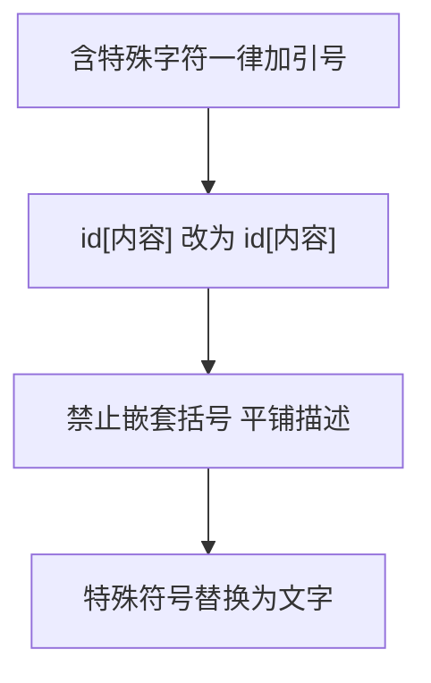

# Mermaid 渲染故障诊断手册

> 本对话中遇到的所有 Mermaid 渲染失败问题、原因分析与修复方案

---

## 问题总览

| 文件 | Mermaid 块数 | 修复问题数 | 涉及章节 |
|------|-------------|-----------|---------|
| `frontend-architecture-guide.md` | 21 | 6 | 学习路径图 |
| `frontend-language-foundation.md` | 35 | 48+ | 全篇 0-6 章节 |

---

## 故障类型与根因

### 类型 1：嵌套中括号 `[[]]`

**症状：** Mermaid 图表完全空白或报解析错误

**根因：** Mermaid 用 `[]` 界定节点标签。当标签内又出现 `[]` 时，解析器无法正确匹配括号层级，提前截断标签文本。

**示例（错误）：**
```
graph LR
    A[外部文本 [内部文本]]
```
解析器会把 `A[外部文本 [` 当作标签，`内部文本]]` 变为乱码。

**修复前代码：**
```
MACRO_QUEUE[宏任务队列<br/>[click, timeout, IO]]
```
解析器匹配到第一个 `]`（`IO]` 处的 `]`）就认为标签结束，多余内容导致语法错误。

**修复方式：** 用双引号包裹整个标签内容，`[]` 变为普通字符：

```
MACRO_QUEUE["宏任务队列<br/>[click, timeout, IO]"]
```

---

### 类型 2：双中括号 `[[Prototype]]`

**症状：** 渲染空白，语法错误

**根因：** Mermaid 解析 `[[Prototype]]` 时，`[[` 被当作嵌套结构，`]]` 导致闭合混乱。

**修复前代码：**
```
P1[__proto__ / [[Prototype]]]
```
解析器眼中：`[__proto__ / [` 是标签，`Prototype]]` 是乱码。

**修复方式：** 用文字替换双括号：
```
P1[__proto__ / 内部原型对象]
```

---

### 类型 3：尖括号 `<>` 被误解析为 HTML

**症状：** 某些渲染器显示空白或标签内容被截断

**根因：** Mermaid 在某些配置下启用 HTML 模式，`<T>`、`<string>` 等被当作 HTML 标签解析。

**修复前代码：**
```
C1[数组: T[] / Array<T>]
G1[类型参数 <T>]
```

**修复方式：** 去掉 `<>` 或双引号包裹：
```
C1[数组: 泛型 T 数组]
G1[类型参数 T]
```

或者使用双引号：
```
M1["Partial<T>"]
```

---

### 类型 4：圆括号 `()` 在标签中

**症状：** 标签内容被截断

**根因：** `()` 在某些 Mermaid 解析器的标签上下文中有特殊含义，导致标签提前闭合。

**修复前代码：**
```
E3[异步加载: import()]
I1[obj.fn() → obj]
```

**修复方式：** 替换为无括号描述：
```
E3[异步加载: 动态导入]
I1[obj.fn 指向 obj]
```

---

### 类型 5：特殊字符 `→` `@` 等

**症状：** 渲染失败或显示乱码

**根因：** Mermaid 对 Unicode 箭头 `→`、`@` 等符号在某些解析器中支持不完善。

**修复前代码：**
```
I1[obj.fn() → obj]
A2[CSS Animation + @keyframes]
D1[HTML 解析 → DOM Tree]
```

**修复方式：** 替换为文字描述：
```
I1[obj.fn 指向 obj]
A2[CSS Animation 关键帧]
D1[HTML 解析 生成 DOM Tree]
```

---

### 类型 6：文本在尖括号外（`id[✓] 文本`）

**症状：** 图表完全空白，语法错误

**根因：** Mermaid 节点语法为 `id[label]`，所有标签文本必须在 `[]` 内。`J1[✓] 文本` 中 `文本` 在 `]` 外被视为额外语法。

**修复前代码：**
```
J1[✓] 数据类型与类型转换
J2[✓] 作用域与闭包
```
Mermaid 眼中：`J1` 节点标签为 `✓`，后面的 `数据类型与类型转换` 是非法语法。

**修复方式：** 全部文本放入引号包裹的 `[]`：
```
J1["✓ 数据类型与类型转换"]
J2["✓ 作用域与闭包"]
```

---

### 类型 7：裸 `<br/>` 未用引号包裹

**症状：** `<br/>` 作为文字显示（不换行），或 Mermaid 10+ 中报错

**根因：** Mermaid 10+ 默认关闭 `htmlLabels`，裸 `<br/>` 被当作纯文本。部分早期版本解析 `<` 为 HTML 标签会出错。

**修复前代码：**
```
B1[DOM API<br/>document.getElementById]
```

**修复方式：** 双引号包裹标签：
```
B1["DOM API<br/>document.getElementById"]
```

---

## 修复原则总结



### 黄金规则

```
节点语法（安全）：  id["任意文本 [] () <> @ ✓"]
边缘语法（安全）：  -->|"任意文本"|
子图语法（安全）：  subgraph 纯文本_无特殊字符
```

**不需要引号的情况：**
- 纯字母数字：`A[hello world]`
- 常见标点：`A[type / value]`
- 子图名：`subgraph 我的子图`

**必须用引号的情况：**
- 包含 `[]` `()` `<>` `@` `→` `✓` `br/`
- 包含 CJK 标点如 `《》`
- 包含 `"` 本身（需转义：`""`）

---

## 批量修复脚本

```python
import re

def fix_mermaid_label(text):
    """修复 Mermaid 节点标签中的特殊字符问题"""
    # 模式 1：为含 <br/> 的裸标签加引号
    text = re.sub(
        r'(\b[A-Za-z0-9_]+)\[([^"\]]*<br\/>[^"\]]*)\]',
        lambda m: f'{m.group(1)}["{m.group(2)}"]',
        text
    )
    # 模式 2：为含嵌套 [] 的裸标签加引号
    text = re.sub(
        r'(\b[A-Za-z0-9_]+)\[([^"]*\[[^"]*\][^"]*)\]',
        lambda m: f'{m.group(1)}["{m.group(2)}"]',
        text
    )
    return text
```

---

## 附录：VS Code 快速验证方法

1. 安装 **Markdown Preview Mermaid Support** 插件
2. 安装 **Markdown Preview Enhanced** 插件
3. 在 `settings.json` 中启用 Mermaid：
```json
{
  "markdown-preview-enhanced.enableScriptExecution": true,
  "markdown-preview-enhanced.mermaidTheme": "default"
}
```
4. 按 `Ctrl+K V` 打开侧边预览
5. 若有错误，VSCode 输出面板（`Ctrl+Shift+U`）会显示具体解析错误

---

> 原则很简单：**标签内容一旦出现特殊字符，无论是否需要换行，一律用双引号包起来。**
