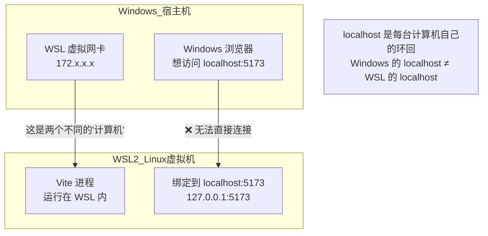
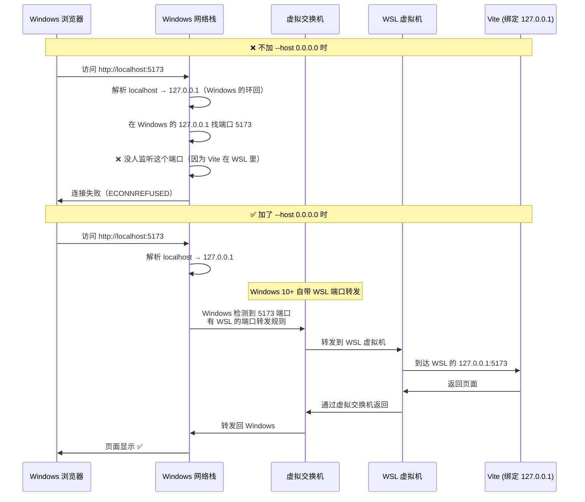
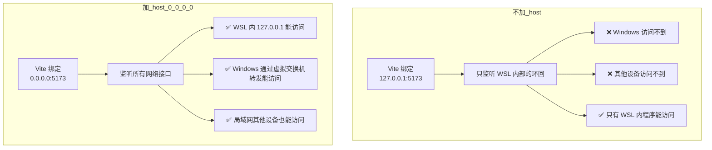
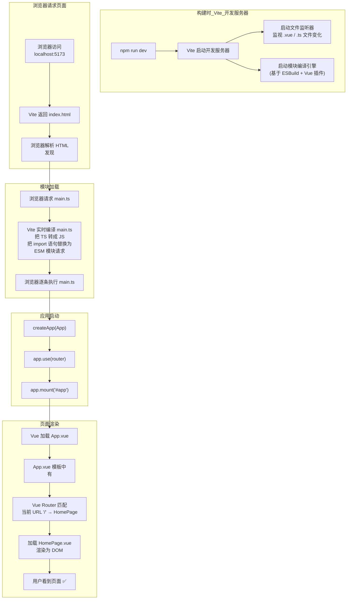

# Vue 精通指南 — 从独立开发到架构大型项目

> 目标：掌握 Vue 3 核心原理、大型项目架构模式、独立使用/贡献开源 Vue 项目的能力

---

## 一、从零实战：搭建并运行你的第一个 Vue 3 页面

> 先动手跑起来，再理解原理。这一章让你 10 分钟内从 0 到看到一个页面。

### 1.1 环境准备

```bash
# ① 检查 Node.js（需要 >= 18）
node -v    # 看到 v18.x.x 或更高

# ② 确认已有包管理器
npm -v     # npm 自带
# 或者
yarn -v    # 如果安装了 yarn

# 如果已有 Node.js 但版本低：
# Windows: 去 nodejs.org 下载 LTS 版本重装
# macOS:   brew upgrade node
# Linux:   用 nvm 切换版本
```

### 1.2 用 Vite 创建项目

**选你有的包管理器，三选一：**

```bash
# ── 用 npm ──
npm create vite@latest my-vue-app -- --template vue-ts

# ── 用 yarn ──
yarn create vite my-vue-app --template vue-ts

# ── 用 pnpm（如果有） ──
pnpm create vite my-vue-app --template vue-ts
```

看到提示后选 `Vue` + `TypeScript`，然后：

```bash
cd my-vue-app

# npm
npm install

# 或者 yarn
yarn

# 或者 pnpm
pnpm install
```

**项目目录长这样：**

```
my-vue-app/
├── index.html          # 入口 HTML
├── package.json        # 依赖配置
├── tsconfig.json       # TypeScript 配置
├── vite.config.ts      # Vite 构建配置
├── public/             # 静态资源
└── src/                # 源码
    ├── main.ts         # 应用入口
    ├── App.vue         # 根组件
    ├── style.css       # 全局样式
    └── components/     # 组件目录
        └── HelloWorld.vue
```

### 1.3 启动开发服务器

```bash
# npm
npm run dev

# 或者 yarn
yarn dev

# 或者 pnpm
pnpm dev
```

终端会显示：
```
VITE v6.x.x  ready in 200ms
  ➜  Local:   http://localhost:5173/
```

浏览器打开 `http://localhost:5173/`，已经能看到一个 Vue 页面了。

### 1.4 创建你的第一个页面

**① 新建页面组件 `src/pages/HomePage.vue`**：

```vue
<script setup lang="ts">
import { ref } from 'vue'

const title = ref('我的第一个 Vue 页面')
const count = ref(0)
const items = ref(['Vue 3', 'TypeScript', 'Vite', 'Pinia'])
</script>

<template>
  <div class="home">
    <h1>{{ title }}</h1>
    <p>计数: {{ count }}</p>
    <button @click="count++">+1</button>
    <ul>
      <li v-for="(item, index) in items" :key="index">{{ item }}</li>
    </ul>
  </div>
</template>

<style scoped>
.home { max-width: 600px; margin: 40px auto; text-align: center; }
button { padding: 8px 24px; font-size: 16px; cursor: pointer; }
ul { list-style: none; padding: 0; }
li { padding: 8px; margin: 4px; background: #f0f0f0; border-radius: 4px; }
</style>
```

**② 配置路由 `src/router/index.ts`**：

```typescript
import { createRouter, createWebHistory } from 'vue-router'
import HomePage from '@/pages/HomePage.vue'

const routes = [
  { path: '/', name: 'home', component: HomePage },
]

export default createRouter({
  history: createWebHistory(),
  routes,
})
```

**③ 在 `src/main.ts` 注册路由**：

```typescript
import { createApp } from 'vue'
import App from './App.vue'
import router from './router'
import './style.css'

const app = createApp(App)
app.use(router)
app.mount('#app')
```

**④ 修改 `src/App.vue`**：

```vue
<script setup lang="ts">
</script>

<template>
  <router-view />
</template>
```

**⑤ 配置路径别名 `vite.config.ts`**：

```typescript
import { defineConfig } from 'vite'
import vue from '@vitejs/plugin-vue'
import { resolve } from 'path'

export default defineConfig({
  plugins: [vue()],
  resolve: {
    alias: {
      '@': resolve(__dirname, 'src'),
    },
  },
})
```

**⑥ 安装路由依赖**：

```bash
npm install vue-router@4
# 或者
yarn add vue-router@4
# 或者
pnpm add vue-router@4
```

浏览器会自动刷新，看到你写的页面。点击按钮数字会 +1——响应式已经在工作了。

### 1.5 添加第二个页面 + 导航

**创建 `src/pages/AboutPage.vue`**：

```vue
<script setup lang="ts">
const team = ['Alice', 'Bob', 'Charlie']
</script>

<template>
  <div class="about">
    <h1>关于我们</h1>
    <p v-for="name in team" :key="name">{{ name }}</p>
  </div>
</template>
```

**在路由表中添加**：

```typescript
const routes = [
  { path: '/', name: 'home', component: HomePage },
  { path: '/about', name: 'about', component: () => import('@/pages/AboutPage.vue') },
  // ↑ 用动态 import 实现懒加载，只有访问 /about 时才加载此组件
]
```

**在 HomePage 加导航链接**：

```vue
<template>
  <div class="home">
    <nav>
      <router-link to="/">首页</router-link> |
      <router-link to="/about">关于</router-link>
    </nav>
    <!-- ... 原有内容 -->
  </div>
</template>
```

### 1.6 常见问题速查

| 问题 | 解决 |
|------|------|
| Vite 启动成功但浏览器访问失败 | **最常见原因：运行在 WSL/虚拟机/远程服务器中**。Vite 默认只绑定 `localhost`（容器内），外部浏览器无法访问。解决方案见下方第 8 节。 |
| 端口被占用 | `npm run dev -- --port 3000` / `yarn dev --port 3000` |
| `@/` 路径报错 | 检查 `vite.config.ts` 的 alias 配置 |
| 页面空白控制台报路由错误 | `npm install vue-router@4` 或 `yarn add vue-router@4` |
| `tsconfig` 报路径别名错 | 在 `tsconfig.json` 加 `"baseUrl": ".", "paths": { "@/*": ["src/*"] }` |

### 1.7 项目开发常见操作

```bash
#              npm                 yarn               pnpm
# ─────────────────────────────────────────────────────────────
 dev          npm run dev          yarn dev           pnpm dev
 build        npm run build        yarn build         pnpm build
 preview      npm run preview      yarn preview       pnpm preview
 安装依赖     npm install xxx      yarn add xxx       pnpm add xxx
 开发依赖     npm install -D xxx   yarn add -D xxx    pnpm add -D xxx
 删除依赖     npm uninstall xxx    yarn remove xxx    pnpm remove xxx
```

### 1.8 深度解析：为什么 Vite 启动后 Windows 浏览器访问不了？

#### 8.1 先搞清两个根本概念

**概念一：`localhost` 不是你的物理网卡**

```
你的电脑的"网络"不是一块，是三块：

┌─────────────────────────────────────────────────────┐
│  你的物理机                                            │
│                                                       │
│  ┌──────────┐  ┌──────────────┐  ┌────────────────┐  │
│  │ 127.0.0.1 │  │ 192.168.1.5  │  │ 172.x.x.x      │  │
│  │ localhost  │  │ 物理网卡 IP  │  │ Docker/WSL 虚拟  │  │
│  │ 虚拟环回    │  │ (WiFi/网线)  │  │ 网卡            │  │
│  └──────────┘  └──────────────┘  └────────────────┘  │
└─────────────────────────────────────────────────────┘
```

- `127.0.0.1`（localhost）是一个**虚拟的环回地址**，只有**本机内部**能访问
- 把 `127.0.0.1` 想象成你家的"内部电话"——只能打到你自己家，邻居打不进来
- `0.0.0.0` 意思不是"某个 IP"，而是**"所有网络接口"**——让服务可以通过任意网卡访问

**概念二：WSL2 是一个真正的独立虚拟机**



WSL2 ≠ 普通的程序，它是一个**完整的 Linux 内核**跑在 Hyper-V 虚拟机里：
- WSL2 有自己的独立网络栈、独立内核、独立 IP
- Windows 和 WSL2 之间通过一个**虚拟交换机**通信
- WSL2 内部的 `127.0.0.1` 是 WSL 虚拟机的环回，Windows 进程访问不到

#### 8.2 一步步看数据包的"旅程"



#### 8.3 为什么 `--host 0.0.0.0` 能解决问题？



**关键原因有两个层叠效应：**

**第一层：`0.0.0.0` 让 Vite 监听所有网卡**

不加 `--host` 时，Vite 默认用 `127.0.0.1`（仅环回），等价于：
```
Vite 说："我只听 WSL 自己内部的电话"
```
加了 `--host 0.0.0.0` 后：
```
Vite 说："我监听所有网卡，包括虚拟网卡"
```

**第二层：Windows 10+ 有 WSL 端口转发机制**

Windows 10 build 19041+ 和 Windows 11 会自动为 WSL2 暴露的端口创建转发规则。当 WSL 里的某个程序绑定了 `0.0.0.0` 时，Windows 会通过 `netsh interface portproxy` 在背后自动添加一条端口转发规则，把对 `localhost:5173` 的访问转发到 WSL 虚拟机里。

```
Windows 收到 localhost:5173 请求 →
检查到 WSL 的 5173 端口有转发 →
通过虚拟交换机转发到 WSL →
Vite（绑了 0.0.0.0）接收 →
返回响应
```

#### 8.4 一个实验验证理解

在 WSL 里执行以下命令，看输出差异：

```bash
# 实验 1：监听 127.0.0.1（只有 WSL 内部）
python3 -m http.server 8888 --bind 127.0.0.1 &
# Windows 浏览器访问 http://localhost:8888 → ❌ 失败

# 实验 2：监听 0.0.0.0
python3 -m http.server 8889 --bind 0.0.0.0 &
# Windows 浏览器访问 http://localhost:8889 → ✅ 成功

# 清理
kill %1 %2
```

**查看 Windows 自动创建的转发规则（在 Windows PowerShell 里执行）：**
```powershell
netsh interface portproxy show all
# 你会看到类似：
# 监听 0.0.0.0:5173 → 连接到 172.x.x.x:5173
```

#### 8.5 其他常见原因

**原因 2：终端显示的 URL 不是 `localhost`**

仔细看终端输出，Vite 可能会显示：
```
➜  Local:   http://127.0.0.1:5173/    ← 试试这个
➜  Network: http://192.168.1.5:5173/   ← 局域网其他设备用这个
```

如果 `localhost` 不行，直接复制终端里显示的 URL 到浏览器。

**原因 3：防火墙拦截**

Linux 防火墙可能拦截 5173 端口：
```bash
sudo ufw status
sudo ufw allow 5173
```

#### 8.6 快速诊断命令

```bash
# ① 确认 Vite 进程在运行
ps aux | grep vite

# ② 查看 Vite 到底绑在哪个地址上
ss -tlnp | grep 5173
# 127.0.0.1:5173  → 只监听环回（问题所在）
# 0.0.0.0:5173    → 监听所有接口（正常）

# ③ 从 WSL 内部测试连通性
curl http://localhost:5173/
# 返回 HTML → Vite 本身没问题

# ④ 从 Windows PowerShell 测试（如果 WSL 绑了 0.0.0.0）
curl http://localhost:5173/
# 也返回 HTML → 通了

# ⑤ 查看 Windows 侧的端口转发规则（Windows PowerShell）
netsh interface portproxy show all
```

#### 8.7 一句话总结

```
不加 --host:  Vite 只监听 WSL 内部的 127.0.0.1 → Windows 浏览器过不去
加 --host:    Vite 监听所有网卡包括虚拟网卡 → Windows 自动做端口转发 → 浏览器能访问
```

### 1.9 串起来：从 `npm run dev` 到页面显示，完整链路

> 这一节回答一个根本问题：你敲了 `npm run dev`，浏览器打开页面，**中间到底发生了什么？**



#### 1.9.1 第一步：`npm run dev` → Vite 启动

当你敲下 `npm run dev`：

```
① package.json 里的 "scripts": { "dev": "vite" } 被找到
② 终端执行 node_modules/.bin/vite
③ Vite 做三件事：
   a. 启动一个 HTTP 开发服务器（默认 5173 端口）
   b. 启动文件监听器（检测 .vue/.ts 文件变化，做 HMR 热更新）
   c. 准备好编译引擎（ESBuild 负责编译 TS → JS，Vue 插件负责编译 .vue）
```

**关键理解：Vite 不做打包。** 不像 Webpack 把所有模块打包成一个 bundle.js 再发给浏览器。Vite 让浏览器直接通过 ESM（`import` / `export`）按需加载模块，Vite 只在浏览器请求时"实时编译"单个文件。

#### 1.9.2 第二步：浏览器请求 index.html → 发现入口

```
① 浏览器请求 http://localhost:5173/
② Vite 返回 index.html（原始内容，Vite 几乎不做修改）
```

```html
<!-- index.html 中的关键行 -->
<script type="module" src="/src/main.ts"></script>
```

`type="module"` 告诉浏览器："这是一个 ES Module 脚本，遇到 import 语句就去网络加载对应模块。"

#### 1.9.3 第三步：加载并执行 main.ts

```
① 浏览器请求 /src/main.ts
② Vite 的 Vue 插件实时编译 main.ts：
   把 TypeScript → JavaScript（去掉类型注解）
   把 node_modules 的路径 → 浏览器可用的 URL 路径
③ 浏览器接收编译后的 JS 并执行
```

**main.ts 的三个动作逐个拆解：**

```typescript
// ① createApp(App) — 创建 Vue 应用实例
const app = createApp(App)
// App 是根组件（一个 .vue 文件），createApp 做：
//   - 创建 Vue 应用对象
//   - 把 App.vue 注册为根组件
//   - 初始化响应式系统
//   此时应用还是"离线"的，没挂到 DOM 上

// ② app.use(router) — 注册路由插件
app.use(router)
// Vue Router 插件做：
//   - 监听浏览器 URL 变化（popstate 事件）
//   - 初始化路由匹配器（把 /users/:id 这类规则编译为高效的正则）
//   - 给所有组件注入 $route 和 $router
//   此时路由已就绪，但还没开始匹配

// ③ app.mount('#app') — 挂载到 DOM
app.mount('#app')
// 这是"点火"的一步：
//   - 找到 index.html 中的 <div id="app"></div>
//   - 渲染 App.vue（执行其 template/render 函数）
//   - 把渲染结果插入到 <div id="app"> 中
//   从这一刻起，用户能看到内容了
```

#### 1.9.4 第四步：App.vue 渲染 → 遇到 `<router-view>`

```vue
<!-- App.vue -->
<template>
  <!-- 这里写什么，页面就显示什么 -->
  <router-view />
</template>
```

Vue 在渲染 App.vue 时发现 `<router-view />`：
```
① Vue Router 查看当前浏览器 URL：http://localhost:5173/
② 去掉域名，得到路径：/
③ 在路由表中查找匹配：
   const routes = [
     { path: '/', name: 'home', component: HomePage },
     { path: '/about', name: 'about', component: () => import('@/pages/AboutPage.vue') },
   ]
④ 找到匹配：path: '/' → component: HomePage
⑤ 加载 HomePage 组件（如果路由配置是动态 import，此时才请求文件）
⑥ Vue 渲染 HomePage.vue，把结果插入到 <router-view> 的位置
```

**所以页面结构最终变成：**

```html
<div id="app">                          <!-- app.mount('#app') 挂载到这里 -->
  <div class="home">                    <!-- router-view 被替换为 HomePage -->
    <nav>...</nav>
    <h1>我的第一个 Vue 页面</h1>
    <p>计数: 0</p>
    <button>+1</button>
    ...
  </div>
</div>
```

#### 1.9.5 完整流程图（文字版）

```
终端:
  npm run dev
    ↓
  Vite 启动开发服务器 (localhost:5173)
    ↓
  Vite 监视 src/ 下所有文件变化

浏览器:
  访问 http://localhost:5173/
    ↓
  请求 index.html
    ↓
  发现 <script type="module" src="/src/main.ts">
    ↓
  请求 /src/main.ts → Vite 编译 TS → JS → 返回
    ↓
  执行 main.ts:
    createApp(App)          → 创建 Vue 实例
    app.use(router)         → 注册路由
    app.mount('#app')       → 渲染到 DOM
    ↓
  Vue 渲染 App.vue
    ↓
  遇到 <router-view />
    ↓
  Vue Router 匹配 URL: / → HomePage
    ↓
  Vue 渲染 HomePage.vue
    ↓
  用户看到页面 ✅
```

#### 1.9.6 三个核心文件各司其职

| 文件 | 角色 | 一句话 |
|------|------|--------|
| `index.html` | **入口** | 浏览器第一个加载的 HTML 文件，包含 `<script type="module">` 指向 main.ts |
| `main.ts` | **启动器** | 创建 Vue 实例、注册插件、挂载到 DOM——负责"点火" |
| `App.vue` | **根组件** | 页面的最外层骨架，通常包含 `<router-view />` 和全局布局（Header/Sidebar） |
| `router/index.ts` | **导航员** | 定义 URL 路径和组件的对应关系，告诉 Vue "当前 URL 该显示哪个组件" |
| `*.vue` 文件 | **页面组件** | 每个文件就是一个页面或组件，包含 template（HTML）+ script（JS）+ style（CSS） |

**它们之间的关系：**

```
index.html (浏览器入口)
    ↓ 引用
main.ts (应用启动器)
    ↓ createApp
App.vue (根骨架)
    ↓ <router-view>
router/index.ts (导航员) → 匹配 URL → 加载对应的 .vue 页面
    ↓
HomePage.vue / AboutPage.vue (具体页面)
```

---

## 二、Vue 语法速成 — 看完就能写页面

> 以下全部是 Vue 3 Composition API（`<script setup>`）写法，这是 2026 年唯一推荐写法。

### 2.1 模板语法

Vue 模板是**声明式 HTML**——你在 `<template>` 里写"这个 DOM 应该长什么样"，Vue 在背后把它编译成高效的渲染函数。模板里可以使用所有 `<script setup>` 中定义的绑定（ref、computed、函数等）。

#### 2.1.1 文本插值 `{{ }}`

双花括号是最基础的形式，内部写**任意 JavaScript 表达式**：

```vue
<script setup lang="ts">
const msg = 'Hello'
const count = ref(42)
const price = 19.99
const user = { name: 'Alice', age: 30 }

function formatDate(d: Date) {
  return `${d.getFullYear()}-${d.getMonth() + 1}-${d.getDate()}`
}
</script>

<template>
  <p>{{ msg + ' Vue' }}</p>
  <p>{{ count + 1 }}</p>
  <p>{{ price.toFixed(2) }}</p>
  <p>{{ user.name.toUpperCase() }}</p>
  <p>{{ formatDate(new Date()) }}</p>
  <p>{{ count > 10 ? '多' : '少' }}</p>
  <p>{{ [1, 2, 3].map(n => n * 2).join(', ') }}</p>
</template>
```

**✅ 可以写：**
- 算术运算 `{{ count + 1 }}`
- 三元表达式 `{{ isOK ? 'yes' : 'no' }}`
- 方法调用 `{{ msg.toUpperCase() }}`
- 过滤器链 `{{ arr.filter(x => x > 2).map(...) }}`
- 字符串模板 `{{ `${greeting}, ${name}` }}`

**❌ 不可以写：**
- 语句（赋值、声明、if/for 块）—— `{{ if (ok) return msg }}` 会编译失败
- 访问 window/document 等全局对象——模板中不可用
- 箭头函数用作回调——`{{ () => 'hi' }}` 不会报错但无意义

#### 2.1.2 `v-text` — 纯文本指令

等价于 `{{ }}`，适合动态拼接文本的场景：

```vue
<span v-text="msg"></span>
<!-- 等价于 -->
<span>{{ msg }}</span>
```

#### 2.1.3 `v-html` — 原始 HTML（⚠️ 高危）

输出真正的 HTML 而非转义文本。**绝对不要用于用户输入的内容**（XSS 攻击）：

```vue
<script setup lang="ts">
const html = '<strong>加粗</strong><script>alert("xss")</script>'
</script>

<template>
  <p v-html="html"></p>
  <!-- 页面显示: 加粗（但 script 不会执行——Vue 会过滤 script 标签） -->
  <!-- 危险的是: onclick / onerror / href="javascript:..." 等属性 -->
</template>
```

**安全规则：** 只有你 100% 信任的 HTML（如服务端富文本编辑器输出的、已消毒的内容）才用 `v-html`。

#### 2.1.4 `v-bind` / `:` — 属性绑定

绑定 HTML 属性到动态值。这是 Vue 模板里**最常用**的指令：

```vue
<script setup lang="ts">
const url = 'https://vuejs.org'
const isDisabled = ref(true)
const id = 'main-title'
const attrName = 'href'
const attrValue = '/about'
const dynamicKey = 'data-id'
const dynamicValue = '123'
</script>

<template>
  <!-- 标准绑定 -->
  <a :href="url">链接</a>

  <!-- 布尔属性：存在与否取决于值的真假 -->
  <button :disabled="isDisabled">提交</button>
  <!-- isDisabled 为 true → <button disabled> -->
  <!-- isDisabled 为 false → <button>（属性被移除） -->

  <!-- 同名简写（Vue 3.4+） -->
  <div :id></div>
  <!-- 等价于 :id="id" -->

  <!-- 动态属性名 -->
  <div :[dynamicKey]="dynamicValue"></div>
  <!-- 当 dynamicKey = 'data-id' 时，渲染为 <div data-id="123"> -->

  <!-- 绑定对象（一次性展开多个属性） -->
  <a v-bind="{ href: url, target: '_blank', rel: 'noopener' }">
  <!-- 注意这里必须用 v-bind 而非简写 :，因为简写只接受单个属性 -->
</template>
```

**`v-bind` 的特殊处理：**

| 属性类型 | 行为 |
|---------|------|
| `string` / `number` | 直接设置为属性值 |
| `boolean` | `true` → 添加属性；`false` → 移除属性 |
| `null` / `undefined` | 移除该属性 |
| `class` / `style` | **特殊处理**（见下方详解） |

**`class` 绑定的三种形式：**

```vue
<script setup lang="ts">
const isActive = ref(true)
const hasError = ref(false)
const theme = ref('dark')
const activeClass = 'highlight'
const errorClass = 'text-danger'
</script>

<template>
  <!-- ① 对象语法：键是类名，值是布尔条件 -->
  <div :class="{ active: isActive, 'text-danger': hasError }"></div>

  <!-- ② 数组语法：元素是类名字符串或对象 -->
  <div :class="[activeClass, theme === 'dark' ? 'dark-theme' : 'light-theme']"></div>
  <div :class="[isActive ? 'active' : '', 'base']"></div>

  <!-- ③ 数组内嵌套对象 -->
  <div :class="[{ active: isActive }, errorClass]"></div>
</template>
```

`class` 绑定的关键行为：Vue **不会覆盖**元素上已有的静态 `class`，而是**合并**：

```vue
<div class="base" :class="{ active: true }">
<!-- 最终渲染：<div class="base active"> -->
```

**`style` 绑定的两种形式：**

```vue
<script setup lang="ts">
const color = ref('red')
const fontSize = ref(16)
const baseStyle = { backgroundColor: '#f0f0f0', padding: '10px' }
const activeStyle = { color: 'green', fontWeight: 'bold' }
</script>

<template>
  <!-- ① 对象语法：CSS 属性名用 camelCase 或 kebab-case（加引号） -->
  <div :style="{ color, fontSize: fontSize + 'px' }"></div>
  <div :style="{ 'font-size': '14px', 'background-color': '#fff' }"></div>

  <!-- ② 数组语法：合并多个样式对象 -->
  <div :style="[baseStyle, activeStyle]"></div>

  <!-- ③ 自动加前缀：Vue 会自动检测并添加浏览器前缀（-webkit- 等） -->
</template>
```

#### 2.1.5 一次性渲染 `v-once`

只渲染一次，后续数据变化**不再更新**。适合静态内容优化：

```vue
<template>
  <div v-once>
    <h1>标题</h1>
    <p>这段内容不会随数据变化而更新</p>
    {{ staticMessage }}
  </div>
</template>
```

#### 2.1.6 跳过编译 `v-pre`

直接输出原始内容，不进行 Vue 编译。适合显示源码或提升性能：

```vue
<template>
  <p v-pre>{{ 这里不会解析，会原样显示 }}</p>
  <!-- 渲染结果：{{ 这里不会解析，会原样显示 }} -->
</template>
```

#### 2.1.7 编译前隐藏 `v-cloak`

配合 CSS 使用，防止未编译模板一闪而过：

```css
/* 全局样式 */
[v-cloak] { display: none; }
```

```vue
<template>
  <div v-cloak>
    <!-- 在 Vue 编译完成前隐藏，防止用户看到原始 {{ }} 标签 -->
    {{ message }}
  </div>
</template>
```

---

**模板语法速查表：**

| 语法 | 作用 | 简写 | 说明 |
|------|------|------|------|
| `{{ expr }}` | 文本插值 | — | 输出表达式结果，HTML 会被转义 |
| `v-text="expr"` | 文本绑定 | — | 等价于 `{{ }}`，覆盖整个元素内容 |
| `v-html="raw"` | 原始 HTML | — | ⚠️ 不转义，防 XSS |
| `v-bind:attr="val"` | HTML 属性绑定 | `:attr="val"` | 动态绑定任意属性 |
| `v-bind="obj"` | 对象展开绑定 | — | 一次绑定多个属性 |
| `:[dynamic]="val"` | 动态属性名 | — | 属性名本身也是动态的 |
| `v-once` | 只渲染一次 | — | 静态内容优化 |
| `v-pre` | 跳过编译 | — | 显示原始 `{{ }}` 标签 |
| `v-cloak` | 隐藏未编译模板 | — | 配合 `[v-cloak] { display: none }` 使用 |

### 2.2 条件渲染

Vue 提供两个条件渲染指令：`v-if`（真正的条件渲染）和 `v-show`（CSS 切换）。

#### 2.2.1 `v-if` / `v-else-if` / `v-else` — 真正的条件渲染

条件为 `false` 时，元素**不会出现在 DOM 中**（不渲染/销毁）：

```vue
<script setup lang="ts">
const isLoggedIn = ref(false)
const role = ref('admin')
const loadingState = ref<'loading' | 'success' | 'error'>('loading')
const items = ref<string[]>([])
</script>

<template>
  <!-- 单个条件 -->
  <p v-if="isLoggedIn">欢迎回来</p>
  <p v-else>请登录</p>

  <!-- 多分支：v-if → v-else-if → v-else（必须连续，中间不能打断） -->
  <div v-if="role === 'admin'">管理员面板</div>
  <div v-else-if="role === 'editor'">编辑面板</div>
  <div v-else>访客视图</div>

  <!-- 真实场景：三态切换 -->
  <div v-if="loadingState === 'loading'">加载中...</div>
  <div v-else-if="loadingState === 'error'">加载失败，请重试</div>
  <div v-else>加载成功，共 {{ items.length }} 条数据</div>
</template>
```

**`<template>` 上的 `v-if`：** 当需要条件控制多个相邻元素（不额外包一层 DOM）时，用 `<template>`：

```vue
<template>
  <!-- ✅ 用 template 包裹多个元素，不会产生额外 DOM -->
  <template v-if="isLoggedIn">
    <h2>欢迎回来</h2>
    <p>您有 {{ unread }} 条未读消息</p>
    <button @click="logout">退出</button>
  </template>
  <template v-else>
    <h2>请登录</h2>
    <p>登录后查看更多内容</p>
    <button @click="showLogin">登录</button>
  </template>
</template>
```

#### 2.2.2 `v-show` — CSS 切换

元素**始终渲染**在 DOM 中，只是通过 `display: none` 控制显示/隐藏：

```vue
<template>
  <!-- v-show 只是切换 display，元素一直在 DOM 里 -->
  <div v-show="loadingState === 'loading'">加载中...</div>

  <!-- 无法使用 v-else，v-show 没有配套的 else -->
  <!-- 如果需要对侧，需要自己写两个 v-show： -->
  <div v-show="isLoggedIn">已登录</div>
  <div v-show="!isLoggedIn">未登录</div>
</template>
```

#### 2.2.3 `v-if` vs `v-show` 对比

| | `v-if` | `v-show` |
|--|--------|---------|
| **渲染方式** | 条件为 false 时 DOM **不存在** | 始终渲染，仅切换 `display` |
| **切换成本** | 高（销毁 + 重建 DOM，组件会重新走生命周期） | 低（只改 CSS） |
| **初始渲染成本** | 条件为 false 时**不渲染**（省初始开销） | 始终渲染（初始就有 DOM 开销） |
| **适用场景** | 冷启动条件、不频繁切换（权限判断、空状态） | 频繁切换（选项卡、折叠面板、菜单） |
| **`v-else`** | ✅ 支持 | ❌ 不支持 |
| **`<template>`** | ✅ 可用 `v-if` | ❌ 无效（v-show 需要真实 DOM 元素） |

**选型口诀：** 频繁切换用 `v-show`，冷启动条件用 `v-if`。如果初始条件为 `false` 且大概率不变，`v-if` 省初始渲染。

#### 2.2.4 常见实战模式

```vue
<script setup lang="ts">
// 模式 1：加载 → 成功 → 错误 三态
const state = ref<'loading' | 'success' | 'error'>('loading')

// 模式 2：权限分段
const userPermissions = ref<string[]>(['read'])
const hasPermission = (p: string) => userPermissions.value.includes(p)

// 模式 3：空状态检测
const list = ref<Item[]>([])
</script>

<template>
  <!-- 模式 1：三态条件渲染 -->
  <div v-if="state === 'loading'"><Spinner /></div>
  <div v-else-if="state === 'error'"><ErrorPanel @retry="fetchData" /></div>
  <div v-else><DataTable :data="data" /></div>

  <!-- 模式 2：权限分段 -->
  <button v-if="hasPermission('delete')">删除</button>
  <button v-if="hasPermission('edit')">编辑</button>

  <!-- 模式 3：空状态检测 -->
  <ul v-if="list.length">
    <li v-for="item in list" :key="item.id">{{ item.name }}</li>
  </ul>
  <p v-else>暂无数据</p>
</template>
```

#### 2.2.5 `v-if` 与 `v-for` 不要放在同一元素

`v-if` 优先级高于 `v-for`，导致 `v-if` 无法访问 `v-for` 的变量。详见 2.3.4 节。

```vue
<!-- ❌ 错误 -->
<li v-for="item in items" v-if="item.visible">

<!-- ✅ 正确：<template> 包裹 或 计算属性预过滤 -->
<template v-for="item in items" :key="item.id">
  <li v-if="item.visible">{{ item.name }}</li>
</template>
```

### 2.3 列表渲染 — `v-for`

#### 2.3.1 四种遍历源

`v-for` 可以遍历数组、对象、数字范围、甚至字符串（字符串被视为字符数组）：

```vue
<script setup lang="ts">
const users = ref([
  { id: 1, name: 'Alice', active: true },
  { id: 2, name: 'Bob', active: false },
  { id: 3, name: 'Charlie', active: true },
])
const dict = ref({ a: 1, b: 2, c: 3 })
const str = 'Vue'
</script>

<template>
  <!-- ① 数组：item, index -->
  <ul>
    <li v-for="(user, index) in users" :key="user.id">
      {{ index + 1 }}. {{ user.name }}
      <span v-if="user.active">在线</span>
    </li>
  </ul>

  <!-- ② 对象：value, key, index -->
  <div v-for="(value, key, index) in dict" :key="key">
    {{ index }}: {{ key }} = {{ value }}
  </div>

  <!-- ③ 数字范围：n in 5 → 1,2,3,4,5 -->
  <span v-for="n in 5" :key="n">{{ n }}</span>

  <!-- ④ 字符串（很少用但可以）：每个字符 -->
  <span v-for="(ch, i) in str" :key="i">{{ ch }}</span>
</template>
```

#### 2.3.2 解构语法

`v-for` 支持解构，对复杂对象非常实用：

```vue
<template>
  <!-- 数组元素解构 -->
  <li v-for="{ id, name, active } in users" :key="id">
    {{ name }} <span v-if="active">在线</span>
  </li>

  <!-- index 也可以在解构时单独接收 -->
  <li v-for="({ name, active }, index) in users" :key="index">
    {{ index }}. {{ name }}
  </li>

  <!-- 对象键值解构 -->
  <div v-for="({ label, count }, key) in groupedData" :key="key">
    {{ label }}: {{ count }}
  </div>
</template>
```

#### 2.3.3 `key` — 为什么是必填的

Vue 的 Diff 算法靠 `key` 来**识别每个节点的身份**。没有 `key` 时，Vue 采用"就地复用"策略——按位置匹配，这会导致：

| 场景 | 无 `key`（就地复用） | 有 `key` |
|------|-------------------|---------|
| 列表头部插入一项 | 每个位置的 DOM 节点保留，但内容错位 | 新项插入到正确位置，后续节点复用 |
| 列表重新排序 | DOM 节点不动，内容互换 | DOM 节点跟着数据移动 |
| 列表项有本地状态（输入框、展开状态） | 状态错位到错误的项 | 状态正确跟随对应项 |

```vue
<template>
  <!-- ✅ 正确：用唯一且稳定的 id -->
  <li v-for="user in users" :key="user.id">{{ user.name }}</li>

  <!-- ❌ 危险：用 index 作为 key（见下方说明） -->
  <li v-for="(user, index) in users" :key="index">{{ user.name }}</li>
</template>
```

**何时可以用 `index` 作为 `key`？** 只有满足**全部**三个条件时：
1. 列表是**静态**的（不会增删改排）
2. 列表项**没有本地状态**（没有输入框、复选框等表单组件）
3. 列表是纯展示，且简单到重建无感知

**最佳实践：** 优先用数据中的唯一 ID（`user.id`、`orderNo`）。如果数据没有 ID，用 `Symbol()` 或 `nanoid` 生成一次性的稳定 key。

#### 2.3.4 `v-for` + `v-if` 的优先级陷阱

`v-for` 和 `v-if` 在**同一个元素上会冲突**——`v-if` 优先级更高，因此无法访问 `v-for` 的变量：

```vue
<!-- ❌ 错误：v-if 无法访问 item，因为 v-if 先执行 -->
<li v-for="item in items" v-if="item.visible" :key="item.id">

<!-- ✅ 正确：在 <template> 上使用 v-for，内部元素用 v-if -->
<template v-for="item in items" :key="item.id">
  <li v-if="item.visible">{{ item.name }}</li>
</template>

<!-- ✅ 更优：用计算属性预过滤（推荐） -->
<script setup lang="ts">
const visibleItems = computed(() => items.value.filter(i => i.visible))
</script>
<template>
  <li v-for="item in visibleItems" :key="item.id">{{ item.name }}</li>
</template>
```

#### 2.3.5 数组变化的注意事项

Vue 能检测到数组的**变更方法**，但**不能**检测到直接索引赋值：

```vue
<script setup lang="ts">
const list = ref([1, 2, 3])

// ✅ 这些变更方法能触发更新：
function mutateOk() {
  list.value.push(4)        // 末尾添加
  list.value.pop()          // 末尾删除
  list.value.shift()        // 头部删除
  list.value.unshift(0)     // 头部添加
  list.value.splice(1, 1)   // 删除中间
  list.value.sort()         // 排序
  list.value.reverse()      // 反转
}

// ❌ 直接索引赋值不会触发更新：
function mutateBad() {
  list.value[0] = 10        // 不会更新视图！
}

// ✅ 应该用 splice 或替换整个数组：
function mutateGood() {
  list.value.splice(0, 1, 10)        // 方案 A：splice 替换
  list.value = [10, ...list.value.slice(1)]  // 方案 B：替换引用
}
</script>
```

#### 2.3.6 `<template>` 上的 `v-for`

当需要在一个循环中渲染多个相邻元素（不额外包裹一层 DOM）时，用 `<template>`：

```vue
<template>
  <ul>
    <template v-for="user in users" :key="user.id">
      <li>{{ user.name }}</li>
      <li class="separator" v-if="!user.active">（离线）</li>
    </template>
  </ul>
</template>
```

#### 2.3.7 组件上的 `v-for`

遍历渲染组件时，props 和事件传递用法不变：

```vue
<template>
  <UserCard
    v-for="user in users"
    :key="user.id"
    :user="user"
    @click="handleClick(user)"
  />
</template>
```

注意：props 是**逐项传递**，`v-for` 不会自动把数据注入组件内部。

---

**`v-for` 速查表：**

| 遍历源 | 语法 | `:key` 建议 |
|--------|------|------------|
| `Array` | `v-for="(item, index) in items"` | `item.id`（唯一稳定字段） |
| `Object` | `v-for="(value, key, index) in obj"` | `key` |
| `Number` | `v-for="n in 10"` | `n` |
| `String` | `v-for="(char, index) in str"` | `index`（或不用 key） |

### 2.4 事件处理 — `v-on` / `@`

#### 2.4.1 基本用法

`v-on`（简写 `@`）用于监听 DOM 事件，值可以是内联表达式、方法名或箭头函数：

```vue
<script setup lang="ts">
const count = ref(0)
const searchQuery = ref('')

function handleClick(event: MouseEvent) {
  console.log('点击坐标:', event.clientX, event.clientY)
}

function handleInput(event: Event) {
  const target = event.target as HTMLInputElement
  console.log('输入:', target.value)
}

function sayHello(name: string) {
  alert(`你好, ${name}!`)
}
</script>

<template>
  <!-- ① 内联表达式：适合简单操作 -->
  <button @click="count++">+1</button>

  <!-- ② 方法引用：自动传入原生事件对象 -->
  <button @click="handleClick">点我</button>

  <!-- ③ 内联传参 + $event 显式传入事件对象 -->
  <button @click="sayHello('Vue')">打招呼</button>
  <button @click="handleClick($event, 'extra')">传参+事件</button>

  <!-- ④ 内联箭头函数 -->
  <button @click="(e) => sayHello(e.target.value)">内联箭头</button>

  <!-- ⑤ 动态事件名：Vue 3.4+ -->
  <div @[eventName]="handler"></div>
</template>
```

**事件处理函数的三种形式对比：**

| 形式 | 示例 | 能否接收额外参数 | 事件对象如何获取 |
|------|------|-----------------|----------------|
| 内联表达式 | `@click="count++"` | — | 不需要 |
| 方法引用 | `@click="handleClick"` | ❌ 不传参（但接收原生 event） | 第一个参数 |
| 内联调用 | `@click="handle($event, arg)"` | ✅ | 用 `$event` 关键字 |

#### 2.4.2 事件修饰符

修饰符可以**链式使用**，顺序决定执行顺序：

```vue
<template>
  <!-- .stop：阻止冒泡 -->
  <div @click="parentClick">
    <button @click.stop="childClick">点我（不冒泡）</button>
  </div>

  <!-- .prevent：阻止默认行为 -->
  <form @submit.prevent="onSubmit">提交</form>
  <a href="/delete" @click.prevent="onDelete">删除（不跳转）</a>

  <!-- .self：只当 event.target 是元素本身才触发（不处理子元素冒泡） -->
  <div @click.self="onClickSelf">只有点空白区域才触发</div>

  <!-- .once：事件只触发一次，然后自动移除监听 -->
  <button @click.once="doOnce">只执行一次</button>

  <!-- .capture：在捕获阶段触发（而非默认的冒泡阶段） -->
  <div @click.capture="onCapture">捕获阶段触发</div>

  <!-- .passive：不调用 preventDefault，提升滚动性能 -->
  <div @scroll.passive="onScroll">滚动优化</div>

  <!-- 链式：.prevent + .stop 一起用 -->
  <a href="/" @click.prevent.stop="handleClick">阻止默认 + 阻止冒泡</a>

  <!-- 注意顺序：@click.prevent.stop vs @click.stop.prevent 效果相同 -->
</template>
```

| 修饰符 | 对应 | 适用场景 |
|--------|------|---------|
| `.stop` | `e.stopPropagation()` | 防止父元素监听器被触发 |
| `.prevent` | `e.preventDefault()` | 阻止表单提交、链接跳转 |
| `.self` | `e.target === e.currentTarget` | 只处理元素自身的事件 |
| `.once` | `{ once: true }` | 一次性操作（首次点击引导） |
| `.capture` | 捕获阶段监听 | 需要在子元素之前拦截事件 |
| `.passive` | `{ passive: true }` | 滚动/触摸事件性能优化 |

#### 2.4.3 按键修饰符

```vue
<template>
  <!-- 特定按键触发 -->
  <input @keyup.enter="onSubmit" placeholder="按回车提交">
  <input @keyup.esc="onCancel" placeholder="按 ESC 取消">
  <input @keyup.tab="onNext" placeholder="按 Tab 跳到下一项">

  <!-- 按键别名列表 -->
  <!-- .enter .tab .delete .esc .space .up .down .left .right -->

  <!-- 系统修饰键：必须同时按下 -->
  <input @keyup.ctrl.enter="onSubmit">         <!-- Ctrl + Enter -->
  <div @click.ctrl="onCtrlClick">              <!-- Ctrl + 点击 -->
  <div @click.ctrl.exact="onExactCtrlClick">   <!-- 仅 Ctrl，不含其他修饰键 -->

  <!-- .exact：要求精确组合，不多不少 -->
  <button @click.exact="onPlainClick">         <!-- 无任何修饰键 -->
  <button @click.ctrl.exact="onCtrlOnly">      <!-- 仅 Ctrl，不含 Shift/Alt -->
</template>
```

| 修饰符 | 含义 |
|--------|------|
| `.enter` `.tab` `.esc` `.space` | 按键别名 |
| `.up` `.down` `.left` `.right` | 方向键 |
| `.ctrl` `.alt` `.shift` `.meta` | 系统修饰键 |
| `.exact` | 精确匹配，不允许其他修饰键同时按下 |

#### 2.4.4 鼠标修饰符

```vue
<template>
  <button @click.left="onLeft">左键</button>
  <button @click.middle="onMiddle">中键</button>
  <button @click.right="onRight">右键</button>
</template>
```

#### 2.4.5 自定义事件参数传递

```vue
<script setup lang="ts">
function removeItem(id: number, index: number) {
  items.value.splice(index, 1)
}

// 从子组件 emit 接收参数
function onUserClick(userId: string, source: string) {
  console.log(`用户 ${userId} 来自 ${source}`)
}
</script>

<template>
  <!-- 方法直接接收 -->
  <button @click="removeItem(item.id, index)">删除</button>

  <!-- 子组件事件：接收 emit 传来的第一个参数 -->
  <UserCard @click="onUserClick" />

  <!-- 子组件事件：接收多个参数 + 额外传参 -->
  <UserCard @click="(id, source) => onUserClick(id, source + '(列表页)')" />

  <!-- 子组件事件：和内联 $event 混用 -->
  <UserCard @click="onUserClick($event, '列表页')" />
</template>
```

#### 2.4.6 `$event` 关键字的真相

`$event` 是 Vue 在模板中注入的**特殊变量**，代表原生 DOM 事件对象：

```vue
<template>
  <!-- 直接传递原生事件对象 -->
  <button @click="handle($event)">

  <!-- 和额外参数混用 -->
  <button @click="handle($event, 'extra')">

  <!-- 在自定义组件中，$event 是 emit 的第一个参数 -->
  <Child @custom-event="handle($event)" />
  <!-- 等价于 -->
  <Child @custom-event="handle" />
</template>
```

#### 2.4.7 事件绑定的完整语法

```vue
<template>
  <!-- 全写 -->
  <button v-on:click="handler">全写</button>

  <!-- 简写 -->
  <button @click="handler">简写</button>

  <!-- 动态事件名 -->
  <button @[eventName]="handler">动态事件</button>

  <!-- 对象语法：一次绑定多个事件（Vue 3 支持） -->
  <button v-on="{ mouseenter: onEnter, mouseleave: onLeave }">
    悬停事件
  </button>
</template>
```

---

**事件处理速查表：**

| 语法 | 作用 | 备注 |
|------|------|------|
| `@click="handler"` | 监听点击事件 | 方法引用，自动传 event |
| `@click="count++"` | 内联表达式 | 适合简单操作 |
| `@click="handle($event, arg)"` | 传参 + 事件对象 | `$event` 是保留变量 |
| `@click.stop` | 阻止冒泡 | 可链式组合 |
| `@submit.prevent` | 阻止默认行为 | 表单必用 |
| `@keyup.enter` | 按键别名 | 支持 `.ctrl.enter` 组合 |
| `@click.exact` | 精确修饰键组合 | 不多不少 |
| `@[event]="handler"` | 动态事件名 | Vue 3.4+ |

### 2.5 双向绑定 — `v-model`

`v-model` 是 Vue 双向绑定的核心指令——数据变视图更新，用户输入数据也变。本质是 `:value` + `@input` 的语法糖。

#### 2.5.1 各种表单控件的用法

```vue
<script setup lang="ts">
const name = ref('')
const gender = ref('')
const agree = ref(false)
const city = ref('')
const skills = ref<string[]>([])
const intro = ref('')
const fontSize = ref(16)
const birthday = ref('')
const color = ref('#42b883')
const volume = ref(50)
</script>

<template>
  <!-- 文本输入框 -->
  <input v-model="name" placeholder="姓名">

  <!-- 多行文本域（注意：textareas 不要用 innerHTML，只能用 v-model） -->
  <textarea v-model="intro" placeholder="简介" rows="3"></textarea>

  <!-- 单选框：同一 gender 变量，不同 value -->
  <label><input type="radio" v-model="gender" value="male"> 男</label>
  <label><input type="radio" v-model="gender" value="female"> 女</label>

  <!-- 复选框：单个 → boolean -->
  <label><input type="checkbox" v-model="agree"> 同意协议</label>

  <!-- 复选框：多个同组 → string[]（值由 value 属性决定） -->
  <label><input type="checkbox" v-model="skills" value="vue"> Vue</label>
  <label><input type="checkbox" v-model="skills" value="ts"> TypeScript</label>
  <label><input type="checkbox" v-model="skills" value="pinia"> Pinia</label>

  <!-- 单选下拉 -->
  <select v-model="city">
    <option value="">请选择</option>
    <option value="beijing">北京</option>
    <option value="shanghai">上海</option>
  </select>

  <!-- 多选下拉（按住 Ctrl 多选） -->
  <select v-model="skills" multiple>
    <option value="vue">Vue</option>
    <option value="ts">TypeScript</option>
    <option value="pinia">Pinia</option>
  </select>

  <!-- 日期/时间 -->
  <input type="date" v-model="birthday">
  <input type="datetime-local" v-model="birthday">
  <input type="time" v-model="birthday">

  <!-- 颜色选择器 -->
  <input type="color" v-model="color">

  <!-- 滑块 -->
  <input type="range" v-model="volume" min="0" max="100">
  <span>{{ volume }}</span>
</template>
```

#### 2.5.2 值绑定对照表

| 输入类型 | `v-model` 绑定的类型 | 说明 |
|---------|-------------------|------|
| `<input type="text">` / `<textarea>` | `string` | 最常用 |
| `<input type="checkbox">` 单个 | `boolean` | 选中/未选中 |
| `<input type="checkbox">` 同组多个 | `string[]` | 每个 value 在数组里 |
| `<input type="radio">` 同组 | `string` | 选中的那个 value |
| `<select>` 单选 | `string` | 选中的 option 的 value |
| `<select multiple>` | `string[]` | 所有选中 value 的数组 |
| `<input type="number">` | `string` | ⚠️ 默认是 string，见下方修饰符 |
| `<input type="date">` | `string` | 格式 `YYYY-MM-DD` |
| `<input type="color">` | `string` | 格式 `#rrggbb` |
| `<input type="range">` | `string` | 需要用 `.number` 转数字 |

#### 2.5.3 `v-model` 修饰符

```vue
<template>
  <!-- .trim：自动去掉首尾空格 -->
  <input v-model.trim="username">

  <!-- .number：自动转数字（输入非数字会被丢弃） -->
  <input v-model.number="age" type="number">
  <!-- 注意：即使 type="number"，原始 v-model 给的也是 string -->

  <!-- .lazy：改为在 change 事件时同步（失焦后，而非每次输入） -->
  <input v-model.lazy="searchQuery">
  <!-- 默认是 input 事件 → 每次按键都更新；.lazy → 失焦才更新 -->
</template>
```

| 修饰符 | 作用 | 适用场景 |
|--------|------|---------|
| `.trim` | 自动 `str.trim()` | 表单提交前的用户输入 |
| `.number` | 自动 `parseFloat(val)` | 年龄、金额等数字输入 |
| `.lazy` | `@change` 而非 `@input` | 搜索框（避免频繁搜索） |

#### 2.5.4 非表单元素的双向绑定

对于自定义值展示、第三方非表单组件，可以用 `v-model` 的底层机制：

```vue
<script setup lang="ts">
// contenteditable 示例（没有原生 v-model 支持的元素）
const html = ref('<p>编辑我</p>')
function onInput(e: Event) {
  html.value = (e.target as HTMLElement).innerHTML
}
</script>

<template>
  <!-- 手动实现双向绑定：:text + @input 是 v-model 的本质 -->
  <div
    contenteditable
    :text-content="html"
    @input="onInput"
  ></div>
</template>
```

#### 2.5.5 组件上的 `v-model`

`v-model` 在组件上是 `:modelValue` + `@update:modelValue` 的语法糖：

```vue
<!-- 父组件使用 -->
<MyInput v-model="name" />
<!-- 等价于 -->
<MyInput :modelValue="name" @update:modelValue="name = $event" />

<!-- 多个 v-model（Vue 3.3+） -->
<MyForm
  v-model:name="name"
  v-model:email="email"
  v-model:agree="agree"
/>
<!-- 等价于 -->
<MyForm
  :name="name" @update:name="name = $event"
  :email="email" @update:email="email = $event"
  :agree="agree" @update:agree="agree = $event"
/>

<!-- v-model 修饰符也是可传递的 -->
<MyInput v-model.trim="name" />
```

**子组件实现：**

```vue
<!-- MyInput.vue -->
<script setup lang="ts">
const props = defineProps<{ modelValue: string; modelModifiers?: { trim?: boolean } }>()
const emit = defineEmits<{ 'update:modelValue': [value: string] }>()

function onInput(e: Event) {
  const target = e.target as HTMLInputElement
  let val: string = target.value
  if (props.modelModifiers?.trim) val = val.trim()
  emit('update:modelValue', val)
}
</script>

<template>
  <input :value="modelValue" @input="onInput">
</template>

<!-- 多个 v-model 的子组件实现 -->
<!-- MyForm.vue -->
<script setup lang="ts">
defineProps<{ name: string; email: string; agree: boolean }>()
const emit = defineEmits<{
  'update:name': [v: string]
  'update:email': [v: string]
  'update:agree': [v: boolean]
}>()
</script>

<template>
  <input :value="name" @input="emit('update:name', $event.target.value)">
  <input :value="email" @input="emit('update:email', $event.target.value)">
  <input type="checkbox" :checked="agree" @change="emit('update:agree', $event.target.checked)">
</template>
```

### 2.6 计算属性 vs 方法 vs 侦听器

#### 2.6.1 `computed` — 有缓存的派生数据

`computed` 基于其他响应式数据计算新值，**只有依赖变化时才重新计算**，多次读取走缓存：

```vue
<script setup lang="ts">
const firstName = ref('张')
const lastName = ref('三')
const items = ref([1, 2, 3, 4, 5, 6])
const query = ref('')
const todos = ref([
  { text: '学习 Vue', done: true },
  { text: '重写教程', done: false },
])
</script>

<template>
  <p>{{ firstName }} {{ lastName }}</p>

  <!-- 计算属性像普通变量一样用，不加 () -->
  <p>{{ fullName }}</p>

  <!-- 带过滤 + 排序 -->
  <li v-for="item in filteredItems" :key="item">{{ item }}</li>
</template>
```

```vue
<script setup lang="ts">
// 只读计算属性：默认形式
const fullName = computed(() => `${firstName.value}${lastName.value}`)

// 可写计算属性：同时定义 getter 和 setter
const fullNameWritable = computed({
  get: () => `${firstName.value}${lastName.value}`,
  set: (val) => {
    [firstName.value, lastName.value] = [val[0], val.slice(1)]
  },
})

// 过滤 + 排序：链式操作
const filteredItems = computed(() =>
  items.value.filter(i => i > 2).sort((a, b) => b - a)
)

// 统计类计算
const doneCount = computed(() => todos.value.filter(t => t.done).length)
const progress = computed(() =>
  todos.value.length ? Math.round(doneCount.value / todos.value.length * 100) : 0
)

// 多层派生：计算属性可以依赖另一个计算属性
const doneRatio = computed(() => `${doneCount.value} / ${todos.value.length}`)
const summary = computed(() =>
  todos.value.length === 0 ? '暂无待办' :
  `共 ${todos.value.length} 项，已完成 ${doneCount.value}（${progress.value}%）`
)
</script>
```

#### 2.6.2 方法 — 无缓存，每次渲染都执行

方法在模板中每次渲染都会重新执行，适合**事件处理**或入参不固定的场景：

```vue
<script setup lang="ts">
// ✅ 适合：事件处理
function handleSubmit() { /* ... */ }

// ✅ 适合：需要额外参数
function getStatus(user: User) {
  return user.active ? '在线' : '离线'
}

// ❌ 不适合：纯展示用派生数据（模板里每次渲染都会调用）
function getFilteredItems() {
  return items.value.filter(i => i > 2)
}
</script>

<template>
  <!-- 方法调用必须加 () -->
  <span>{{ getStatus(user) }}</span>

  <!-- 对比：computed 直接当变量用，方法每次渲染都执行 -->
  <p>computed: {{ fullName }}</p>           <!-- ✅ 缓存 -->
  <p>method: {{ getFullName() }}</p>        <!-- ❌ 每次渲染都算一遍 -->
</template>
```

#### 2.6.3 `computed` vs 方法的本质区别

| | `computed` | 方法 |
|--|-----------|------|
| 缓存 | ✅ 依赖不变不重算 | ❌ 每次渲染都执行 |
| 调用方式 | `{{ fullName }}`（无括号） | `{{ getFullName() }}`（必须有括号） |
| 适用场景 | 派生数据展示 | 事件处理 / 需要传参的逻辑 |
| 响应式依赖 | 自动追踪 | 无（每次都重新算） |
| 性能影响 | 低（缓存命中则 O(1)） | 高（模板中多处调用多次执行） |

**选型口诀：** 模板里展示派生数据用 `computed`；需要传参或做事件操作用方法。

#### 2.6.4 `watch` — 响应式副作用

`watch` 监听数据变化，执行**副作用**（API 请求、日志、DOM 操作等），不产生新的数据：

```vue
<script setup lang="ts">
const query = ref('')
const userId = ref(1)
const user = ref<User | null>(null)
const formData = ref({ name: '', email: '' })

// 基本用法：newVal, oldVal
watch(query, (newVal, oldVal) => {
  console.log(`搜索词从 "${oldVal}" 变为 "${newVal}"`)
  // 发送搜索 API
  searchApi(newVal)
})

// immediate：立即执行一次（适合初始化加载）
watch(userId, async (id) => {
  user.value = await fetchUser(id)
}, { immediate: true })

// deep：深度侦听对象内部变化
watch(formData, (val) => {
  console.log('表单变化:', val)
}, { deep: true })
// ⚠️ deep 会影响性能，大对象考虑用具体路径

// 侦听多个来源（数组形式）
watch([firstName, lastName], ([newFirst, newLast]) => {
  console.log('姓名变了', newFirst, newLast)
})

// 侦听 computed 表达式（第一个参数传 getter 函数）
watch(() => user.value?.profile?.age, (newAge) => {
  console.log('年龄变了:', newAge)
})
// ✅ 精确追踪，不需要 deep

// 停止侦听
const unwatch = watch(query, () => { /* ... */ })
unwatch() // 手动停止
// ⚠️ 在 <script setup> 中，watch 会在组件卸载时自动停止
</script>
```

#### 2.6.5 `watch` vs `watchEffect`

| | `watch` | `watchEffect` |
|--|---------|---------------|
| 声明源 | 显式指定监听的源 | 自动追踪回调里用到的所有响应式数据 |
| 获取旧值 | ✅ `(newVal, oldVal)` | ❌ 无法获取旧值 |
| 懒执行 | 默认懒（`immediate: true` 可选） | 立即执行一次，然后追踪变化 |
| 适用场景 | 需要旧值 / 精确指定源 | 日志、同步到 localStorage 等简单副作用 |

```vue
<script setup lang="ts">
// watchEffect：自动追踪，适合简单副作用
watchEffect(() => {
  localStorage.setItem('draft', JSON.stringify(formData.value))
  // formData 变化时自动执行，无需声明源
})

// 等价于 watch（但更啰嗦）
watch(formData, (val) => {
  localStorage.setItem('draft', JSON.stringify(val))
}, { deep: true })

// watchEffect 的清理函数（onCleanup，防竞态）
watchEffect((onCleanup) => {
  const controller = new AbortController()
  onCleanup(() => controller.abort()) // 下次执行前取消上一个请求

  fetch(`/api/search?q=${query.value}`, { signal: controller.signal })
    .then(r => r.json())
    .then(data => results.value = data)
})
</script>
```

#### 2.6.6 选型决策树

```
你想做什么？
├── 展示派生数据（过滤、统计、格式化）
│   └── 需要缓存吗？
│       ├── 是 → computed ✅
│       └── 否（需要传参）
│           └── 方法 ✅
├── 监听数据变化执行副作用
│   └── 需要旧值或精确指定源？
│       ├── 是 → watch ✅
│       └── 否 → watchEffect ✅
└── 事件处理（点击、提交）
    └── 方法 ✅
```

---

**`computed` 与 `watch` 的典型误用：**

```vue
<script setup lang="ts">
const items = ref([])
const page = ref(1)

// ❌ 误用 watch：数据已经存在，应该用 computed
watch(items, (val) => {
  visibleItems.value = val.filter(i => i.visible)
})

// ✅ 应该用 computed
const visibleItems = computed(() => items.value.filter(i => i.visible))

// ❌ 误用 watch：把数据"拷贝"了一份
watch(firstName, (val) => { displayName.value = `${val} ${lastName.value}` })
watch(lastName, (val) => { displayName.value = `${firstName.value} ${val}` })

// ✅ 应该用 computed
const displayName = computed(() => `${firstName.value} ${lastName.value}`)

// ✅ watch 的正确场景：发 API 请求
watch(page, async (newPage) => {
  items.value = await fetchPage(newPage)
})
</script>
```

### 2.7 组件基础

组件是 Vue 的核心抽象——把 UI 拆成独立、可复用的块，每个块封装自己的 HTML、逻辑和样式。

#### 2.7.1 组件定义（子组件）

每个 `.vue` 文件就是一个组件，由三部分构成：`<script setup>`、`<template>`、`<style>`：

```vue
<!-- ✅ 一个好的组件 = 清晰的 Props 契约 + 明确的事件 + 灵活的插槽 -->
<!-- UserCard.vue -->
<script setup lang="ts">
interface User {
  id: number
  name: string
  email?: string
  avatar?: string
}

// ── 1. Props 定义（父 → 子）──
const props = defineProps<{
  user: User
  showEmail?: boolean
  variant?: 'compact' | 'full'
}>()

// 带默认值的写法（解构时给默认值）
const props2 = withDefaults(defineProps<{
  title?: string
  count?: number
}>(), {
  title: '默认标题',
  count: 0,
})

// ── 2. Emits 定义（子 → 父）──
const emit = defineEmits<{
  click: [id: number]
  delete: [id: number]
  'update:avatar': [url: string]
}>()

function handleClick() {
  emit('click', props.user.id)
}

// ── 3. 暴露给父组件的方法（通过 ref 访问）──
function resetFocus() { /* ... */ }
function validate() { /* ... */ }
defineExpose({ resetFocus, validate })
</script>

<template>
  <div class="user-card" :class="variant" @click="handleClick">
    
    <h3>{{ user.name }}</h3>
    <p v-if="showEmail">{{ user.email }}</p>
    <button @click.stop="emit('delete', user.id)">删除</button>

    <!-- ── 4. 插槽（父组件传入内容）── -->
    <!-- 默认插槽 -->
    <slot />
    <!-- 具名插槽 + 作用域插槽（向下传递数据给父组件的插槽模板） -->
    <slot name="footer" :user="user" />
  </div>
</template>

<style scoped>
.user-card { border: 1px solid #ddd; padding: 16px; border-radius: 8px; }
.user-card.compact { padding: 8px; font-size: 12px; }
</style>
```

#### 2.7.2 父组件使用

```vue
<script setup lang="ts">
import UserCard from './UserCard.vue'
import { ref } from 'vue'

const userCardRef = ref<InstanceType<typeof UserCard> | null>(null)

function onDeleteUser(id: number) {
  console.log('删除用户:', id)
}

// 通过 ref 调用子组件暴露的方法
function handleReset() {
  userCardRef.value?.resetFocus()
}
</script>

<template>
  <!-- 基本用法 -->
  <UserCard
    v-for="user in users"
    :key="user.id"
    :user="user"
    :show-email="true"
    variant="compact"
    @click="onClickUser"
    @delete="onDeleteUser"
  >
    <!-- 默认插槽内容 -->
    <p>额外描述信息</p>

    <!-- 具名插槽 #footer -->
    <template #footer="{ user }">
      <span>最后登录: {{ user.lastLogin }}</span>
    </template>
  </UserCard>

  <!-- 通过 ref 获取子组件实例 -->
  <UserCard ref="userCardRef" :user="someUser" />
</template>
```

#### 2.7.3 Props 核心规则

**单向数据流：** 父组件更新 props 会流向子组件，**子组件绝不能修改 props**：

```vue
<script setup lang="ts">
const props = defineProps<{ count: number }>()

// ❌ 禁止：修改 props
props.count++

// ✅ 正确：基于 props 派生本地值
const localCount = ref(props.count)

// ✅ 正确：用 computed 派生
const doubleCount = computed(() => props.count * 2)

// ✅ 正确：通过 emit 通知父组件修改
const emit = defineEmits<{ 'update:count': [v: number] }>()
function increment() { emit('update:count', props.count + 1) }
</script>
```

**Props 命名：** 在模板中用 kebab-case，在子组件中用 camelCase：

```vue
<!-- 父组件传递 -->
<UserCard :user-name="name" :show-email="true" />

<!-- 子组件接收 -->
<script setup lang="ts">
defineProps<{ userName: string; showEmail: boolean }>()
</script>
```

#### 2.7.4 Slot 三种形式

| 形式 | 语法 | 用途 |
|------|------|------|
| 默认插槽 | `<slot />` | 插入任意内容 |
| 具名插槽 | `<slot name="footer" />` | 多个插入位置 |
| 作用域插槽 | `<slot name="item" :data="item" />` | 子传数据给父的插槽模板 |

```vue
<!-- 子组件 DataTable.vue：三种插槽同时使用 -->
<template>
  <table>
    <thead>
      <slot name="header" :columns="columns" />
    </thead>
    <tbody>
      <tr v-for="row in rows" :key="row.id">
        <slot name="row" :row="row" :index="rowIndex" />
      </tr>
    </tbody>
    <tfoot>
      <slot name="footer" :total="rows.length" />
    </tfoot>
  </table>
</template>

<!-- 父组件使用 -->
<DataTable :rows="data">
  <template #header="{ columns }">
    <th v-for="col in columns" :key="col.key">{{ col.label }}</th>
  </template>

  <template #row="{ row, index }">
    <td>{{ index + 1 }}</td>
    <td>{{ row.name }}</td>
  </template>

  <template #footer="{ total }">
    <td colspan="2">共 {{ total }} 条</td>
  </template>
</DataTable>
```

#### 2.7.5 动态组件 `<component :is>`

在多个组件间动态切换，不需要 v-if/else 手动控制：

```vue
<script setup lang="ts">
import TabA from './TabA.vue'
import TabB from './TabB.vue'
import TabC from './TabC.vue'

const currentTab = ref('TabA')

// Vue 组件对象 或 已注册的组件名
const tabMap: Record<string, any> = { TabA, TabB, TabC }
</script>

<template>
  <button v-for="tab in ['TabA', 'TabB', 'TabC']" :key="tab"
    @click="currentTab = tab"
    :class="{ active: currentTab === tab }"
  >{{ tab }}</button>

  <!-- component :is 自动渲染对应组件 -->
  <component :is="tabMap[currentTab]" />

  <!-- 也可以直接传导入的组件对象 -->
  <component :is="currentTab === 'A' ? TabA : TabB" />
</template>
```

#### 2.7.6 KeepAlive — 缓存组件状态

动态切换时默认会销毁/重建组件，用 `<KeepAlive>` 保持组件状态：

```vue
<template>
  <KeepAlive>
    <component :is="currentTab" />
  </KeepAlive>
  <!-- 切换到 TabB 再切回 TabA，TabA 的滚动位置/输入内容不变 -->

  <!-- 选择性缓存 -->
  <KeepAlive :include="['TabA', 'TabC']">
    <component :is="currentTab" />
  </KeepAlive>

  <!-- 最大缓存数量 -->
  <KeepAlive :max="5">
    <component :is="currentTab" />
  </KeepAlive>
</template>
```

KeepAlive 的钩子：

```vue
<script setup lang="ts">
import { onActivated, onDeactivated } from 'vue'

// 组件被 KeepAlive 缓存后重新激活时触发
onActivated(() => {
  console.log('组件被激活（从缓存中恢复）')
})

// 组件被缓存时触发（不是销毁）
onDeactivated(() => {
  console.log('组件被缓存（进入 KeepAlive）')
})
</script>
```

---

**组件基础速查表：**

| 概念 | 父 → 子 | 子 → 父 | 子 → 父组件（ref） |
|------|---------|---------|-------------------|
| 数据 | `props` | `emit` | `defineExpose` |
| 类型定义 | `defineProps<{...}>()` | `defineEmits<{...}>()` | 返回值类型声明 |
| 默认值 | `withDefaults(defineProps{...}, {...})` | — | — |
| 传递方式 | `:prop-name="value"` | `@event-name="handler"` | `ref="compRef"` |

### 2.8 CSS 绑定与样式处理

#### 2.8.1 动态 CSS 绑定

Vue 的 `:class` 和 `:style` 提供了比原生更灵活的方式控制样式。

**class 绑定的三种形式：**

```vue
<script setup lang="ts">
const isActive = ref(true)
const hasError = ref(false)
const theme = ref('dark')

// 对象 → 计算属性（适合复杂条件）
const classObject = computed(() => ({
  active: isActive.value,
  'theme-dark': theme.value === 'dark',
  disabled: !isActive.value,
}))
</script>

<template>
  <!-- ① 对象语法：键是类名，值是布尔条件 -->
  <div :class="{ active: isActive, 'text-danger': hasError }"></div>

  <!-- ② 数组语法：元素是类名字符串或条件对象 -->
  <div :class="['base', theme === 'dark' ? 'dark' : 'light']"></div>
  <div :class="[isActive ? 'active' : '', 'static-class']"></div>

  <!-- ③ 计算属性（数组内嵌对象） -->
  <div :class="classObject"></div>
</template>
```

**关键行为：** `:class` **不会覆盖**元素的静态 `class`，而是合并：

```vue
<div class="base" :class="{ active: true, disabled: false }">
<!-- 渲染结果：<div class="base active"> -->
```

**style 绑定的两种形式 + CSS 变量：**

```vue
<script setup lang="ts">
const themeColor = ref('#42b883')
const boxStyle = ref({
  width: '100px',
  height: '100px',
  backgroundColor: 'red',
})
const baseStyle = { padding: '10px', fontSize: '14px' }
const activeStyle = { color: 'green', fontWeight: 'bold' }
</script>

<template>
  <!-- ① 对象语法：camelCase 或 kebab-case（加引号） -->
  <div :style="{ color: 'red', fontSize: '14px' }"></div>
  <div :style="{ 'background-color': '#f0f0f0' }"></div>

  <!-- ② 从 ref/响应式对象来 -->
  <div :style="boxStyle"></div>

  <!-- ③ 数组语法：合并多个样式对象 -->
  <div :style="[baseStyle, activeStyle]"></div>
  <!-- 后面对象的相同属性会覆盖前面的 -->

  <!-- ④ CSS 变量绑定：动态主题色 -->
  <div :style="{ '--theme-color': themeColor, '--spacing': '16px' }">
    <span class="use-var">颜色由父组件控制</span>
  </div>
</template>
```

#### 2.8.2 `scoped` CSS — 组件样式隔离

Vue 的 `<style scoped>` 通过给每个元素添加 `data-v-xxxxx` 属性实现样式隔离：

```vue
<template>
  <div class="card">
    <h3>标题</h3>
    <p>内容</p>
  </div>
</template>

<style scoped>
/* 编译后变成：.card[data-v-abc123] { ... } */
.card { border: 1px solid #ddd; }
/*
  只影响当前组件的 .card，不影响子组件同名类
  子组件的根元素会被父组件的 scoped 样式影响（Vue 特意留下的缝隙）
*/
</style>
```

#### 2.8.3 穿透选择器 `:deep()`

scoped 样式默认不穿透到子组件。`:deep()` 允许你影响子组件内部元素：

```vue
<style scoped>
/* 当前组件的 .wrapper 内部的子组件的 .child-class */
.wrapper :deep(.child-class) {
  font-weight: bold;
}

/* 也可以给子组件库（如 Element Plus）覆盖样式 */
:deep(.el-input__inner) {
  border-color: red;
}
</style>
```

#### 2.8.4 插槽选择器 `:slotted()`

影响通过 slot 传入的内容（来自父组件，但渲染在子组件中）：

```vue
<!-- 子组件 -->
<template>
  <div class="card">
    <slot />
  </div>
</template>

<style scoped>
/* 只影响父组件传入的 slot 内容中的 .slot-class */
:slotted(.slot-class) {
  margin: 0;
}
</style>
```

#### 2.8.5 全局选择器 `:global()`

在 scoped 样式块中"逃逸"出隔离，定义真正的全局样式：

```vue
<style scoped>
/* 任何组件中的 .my-global 都会匹配 */
:global(.my-global-class) {
  margin: 0;
}

/* 混合使用：局部 + 全局 */
.local { color: blue; }
:global(.global) { color: red; }
</style>
```

#### 2.8.6 预处理器（SCSS / Less）

通过 `lang` 属性启用，变量、嵌套、mixin 等语法直接可用：

```vue
<style scoped lang="scss">
$primary: #42b883;
$spacing: 16px;

.card {
  padding: $spacing;
  border: 1px solid $primary;

  .title {
    font-size: 18px;
    color: $primary;

    &:hover { opacity: 0.8; }
  }
}
</style>
```

需安装对应依赖：

```bash
npm install -D sass
# less: npm install -D less
# stylus: npm install -D stylus
```

#### 2.8.7 CSS Modules（另一种隔离方案）

`:module` 让类名自动哈希，需要在模板中通过 `$style` 访问：

```vue
<template>
  <div :class="$style.card">
    <h3 :class="$style.title">标题</h3>
  </div>
</template>

<style module>
.card { padding: 16px; }
.title { font-size: 18px; }
/* 编译后类名变成 .Card_card_abc123 等哈希值，完全隔离 */
</style>

<!-- 自定义模块名 -->
<style module="theme">
.card { background: var(--bg); }
</style>
<!-- 模板中用 theme.card 访问 -->
```

#### 2.8.8 条件样式模式总结

| 模式 | 语法 | 适用场景 |
|------|------|---------|
| 简单条件 | `:class="{ active: isActive }"` | 一个/两个条件 |
| 多条件 | `:class="classObject"`（计算属性） | 三个以上条件 |
| 多选一 | `:class="[type === 'a' ? 'a' : 'b']"` | 互斥样式类 |
| 动态内联 | `:style="{ color: dynamicColor }"` | 运行时计算的样式值 |
| CSS 变量 | `:style="{ '--var': value }"` | 主题切换、跨组件样式传递 |

---

**CSS 功能速查：**

| 功能 | 语法 | 作用域 |
|------|------|--------|
| 隔离 | `scoped` | 仅当前组件 |
| 穿透 | `:deep()` | 穿透到子组件 |
| 插槽 | `:slotted()` | 父级传入的 slot 内容 |
| 全局 | `:global()` | 逃逸到全局 |
| 模块 | `module` | CSS Modules（哈希隔离） |
| 预处理器 | `lang="scss"` | SCSS/Less/Stylus 语法 |

### 2.9 生命周期

#### 2.9.1 完整生命周期图

```
① setup()              ← Composition API 入口，初始化响应式数据
     ↓
② onBeforeMount       ← 模板编译完成，DOM 还未生成
     ↓
③ onMounted           ← ✅ DOM 已可用，发 API 请求、初始化第三方库
     ↓
   [数据变化]
     ↓
④ onBeforeUpdate      ← 数据变了，DOM 还没更新
     ↓
⑤ onUpdated           ← DOM 已更新（少用，优先用 watch）
     ↓
   [组件卸载]
     ↓
⑥ onBeforeUnmount     ← ✅ 清理定时器、取消 WebSocket、保存草稿
     ↓
⑦ onUnmounted         ← DOM 已移除，组件销毁
```

#### 2.9.2 所有生命周期钩子

```vue
<script setup lang="ts">
import {
  onBeforeMount, onMounted,
  onBeforeUpdate, onUpdated,
  onBeforeUnmount, onUnmounted,
  onErrorCaptured,
  onActivated, onDeactivated,
} from 'vue'

// ── 挂载阶段 ──

onBeforeMount(() => {
  console.log('① beforeMount：组件模板编译完成，但还未插入 DOM')
  // 此时无法操作 DOM 元素
})

onMounted(() => {
  console.log('② mounted：组件已插入 DOM')
  // ✅ 可以操作 DOM、发 API 请求、初始化第三方库（地图、图表）
  // ✅ 可以访问 ref 模板引用
  // ✅ 可以获取元素尺寸、位置
})

// ── 更新阶段 ──

onBeforeUpdate(() => {
  console.log('③ beforeUpdate：响应式数据变了，DOM 还没更新')
  // 可以在 DOM 更新前读取现有 DOM 状态（如滚动位置）
})

onUpdated(() => {
  console.log('④ updated：DOM 已更新完毕')
  // ❌ 不要在这里修改响应式数据（会导致无限循环）
  // ⚠️ 优先用 watch 替代，大部分场景不需要 onUpdated
})

// ── 卸载阶段 ──

onBeforeUnmount(() => {
  console.log('⑤ beforeUnmount：组件即将卸载，但实例还可用')
  // ✅ 清理：clearInterval、removeEventListener、取消 WebSocket
  // ✅ 保存草稿状态到 localStorage
})

onUnmounted(() => {
  console.log('⑥ unmounted：组件已卸载，DOM 已移除')
  // 最后的清理，组件不会再用了
})

// ── 错误处理 ──

onErrorCaptured((err, instance, info) => {
  console.error(`组件错误: ${err}`)
  console.log('来源组件:', instance)
  console.log('错误类型:', info) // 'render' | 'setup' | 'event handler' ...
  // 返回 false 阻止错误继续向上传播
  return false
})

// ── KeepAlive 专属 ──

onActivated(() => {
  console.log('组件被激活（从 KeepAlive 缓存中恢复）')
  // 适合：刷新数据、恢复定时器
})

onDeactivated(() => {
  console.log('组件被缓存（进入 KeepAlive，不是卸载）')
  // 适合：暂停定时器、保存滚动位置
})
</script>
```

#### 2.9.3 常见场景速查

| 时机 | 做什么 | 注意事项 |
|------|--------|---------|
| `onMounted` | 发 API 请求、注册事件监听、初始化 ECharts/地图 | DOM 才可用，**最常用的钩子** |
| `onBeforeUnmount` | `clearInterval`、`removeEventListener`、关 WebSocket | **必须清理**，否则内存泄漏 |
| `onUpdated` | 数据变化后操作 DOM（极少用） | 优先用 `watch`，此处修改数据会死循环 |
| `onBeforeUpdate` | 保存更新前的滚动位置 | 配合 updated 恢复位置 |
| `onErrorCaptured` | 全局组件错误监控 | 可中断错误传播 |
| `onActivated` | KeepAlive 恢复时刷新列表 | 替代 onMounted（缓存场景） |
| `onDeactivated` | KeepAlive 缓存时暂停定时器 | 替代 onBeforeUnmount（缓存场景） |

#### 2.9.4 异步操作的最佳实践

```vue
<script setup lang="ts">
const data = ref(null)
const loading = ref(true)
const error = ref<Error | null>(null)

// ✅ 推荐：onMounted 里发请求，清理控制器
onMounted(() => {
  const controller = new AbortController()

  fetch('/api/data', { signal: controller.signal })
    .then(res => res.json())
    .then(json => { data.value = json })
    .catch(e => {
      if (e.name !== 'AbortError') error.value = e
    })
    .finally(() => { loading.value = false })

  // 组件卸载时取消请求
  onBeforeUnmount(() => controller.abort())
})

// ❌ 不推荐：直接在顶层 await（组件未挂载）
// const data = await fetch('/api/data')  ← 阻塞 setup，无加载状态
</script>
```

#### 2.9.5 Vue 2 vs Vue 3 生命周期映射

| Vue 2 | Vue 3 | 备注 |
|-------|-------|------|
| `beforeCreate` | `setup()` | Vue 3 去掉了，setup 即为初始化 |
| `created` | `setup()` | 同上 |
| `beforeMount` | `onBeforeMount` | 不变 |
| `mounted` | `onMounted` | 不变 |
| `beforeUpdate` | `onBeforeUpdate` | 不变 |
| `updated` | `onUpdated` | 不变 |
| `beforeDestroy` | `onBeforeUnmount` | **改名** |
| `destroyed` | `onUnmounted` | **改名** |
| `errorCaptured` | `onErrorCaptured` | 不变 |
| — | `onActivated` / `onDeactivated` | KeepAlive 相关，Vue 2 也有 |

### 2.10 完整页面示例

将以上所有语法融汇到一个页面：

```vue
<script setup lang="ts">
import { ref, computed, onMounted } from 'vue'

// 数据
const todos = ref<{ id: number; text: string; done: boolean }[]>([])
const newTodo = ref('')
const filter = ref<'all' | 'active' | 'done'>('all')

// 计算属性：过滤列表
const filteredTodos = computed(() => {
  if (filter.value === 'active') return todos.value.filter(t => !t.done)
  if (filter.value === 'done') return todos.value.filter(t => t.done)
  return todos.value
})

const activeCount = computed(() => todos.value.filter(t => !t.done).length)

// 方法
function addTodo() {
  if (!newTodo.value.trim()) return
  todos.value.push({
    id: Date.now(),
    text: newTodo.value.trim(),
    done: false,
  })
  newTodo.value = ''
}

function removeTodo(id: number) {
  todos.value = todos.value.filter(t => t.id !== id)
}

// 挂载时加载
onMounted(() => {
  const saved = localStorage.getItem('todos')
  if (saved) todos.value = JSON.parse(saved)
})

// 变化时保存
watch(todos, (val) => {
  localStorage.setItem('todos', JSON.stringify(val))
}, { deep: true })
</script>

<template>
  <div class="todo-app">
    <h1>待办事项 ({{ activeCount }}/{{ todos.length }})</h1>

    <form @submit.prevent="addTodo">
      <input v-model="newTodo" placeholder="添加新待办..." />
      <button :disabled="!newTodo.trim()">添加</button>
    </form>

    <div class="filters">
      <button
        v-for="f in (['all', 'active', 'done'] as const)"
        :key="f"
        @click="filter = f"
        :class="{ active: filter === f }"
      >{{ f }}</button>
    </div>

    <ul>
      <li v-for="todo in filteredTodos" :key="todo.id" :class="{ done: todo.done }">
        <input type="checkbox" v-model="todo.done" />
        <span>{{ todo.text }}</span>
        <button @click="removeTodo(todo.id)">✕</button>
      </li>
    </ul>

    <p v-if="!filteredTodos.length" class="empty">暂无待办</p>
  </div>
</template>

<style scoped>
.todo-app { max-width: 500px; margin: 40px auto; font-family: sans-serif; }
.filters { display: flex; gap: 8px; margin: 16px 0; }
.filters button { padding: 4px 12px; border: 1px solid #ccc; background: white; cursor: pointer; }
.filters .active { background: #42b883; color: white; border-color: #42b883; }
li { display: flex; align-items: center; gap: 8px; padding: 8px; border-bottom: 1px solid #eee; }
li.done span { text-decoration: line-through; color: #999; }
.empty { text-align: center; color: #999; margin-top: 20px; }
</style>
```

你能直接把这个组件放到你的项目中——它演示了本章所有核心语法：`ref`、`computed`、`watch`、`v-model`、`v-for`、`v-if`、`@submit.prevent`、`:class`、`onMounted`、`scoped` 样式。

---

## 三、Vue 3 核心原理 — 必须理解底层才能做架构决策

### 3.1 响应式系统：从 Proxy 到 effect

Vue 3 的响应式基于 **Proxy**，不再是 Vue 2 的 `Object.defineProperty`。

```typescript
// 极简版响应式原理
const depsMap = new WeakMap()  // target → Map<key, Set<effect>>

function reactive(target) {
  return new Proxy(target, {
    get(target, key, receiver) {
      track(target, key)         // 收集依赖
      return Reflect.get(target, key, receiver)
    },
    set(target, key, value, receiver) {
      const result = Reflect.set(target, key, value, receiver)
      trigger(target, key)       // 触发更新
      return result
    }
  })
}

function track(target, key) {
  if (!activeEffect) return
  let deps = depsMap.get(target)
  if (!deps) depsMap.set(target, deps = new Map())
  let dep = deps.get(key)
  if (!dep) deps.set(key, dep = new Set())
  dep.add(activeEffect)
}

function trigger(target, key) {
  const deps = depsMap.get(target)
  if (!deps) return
  const dep = deps.get(key)
  if (dep) dep.forEach(effect => effect())
}
```

| 概念 | 解释 | 架构意义 |
|------|------|---------|
| `reactive` | 深层次代理对象 | 适合全局状态、复杂嵌套数据 |
| `ref` | 值类型的响应式包装（`.value`） | 适合单个值、表单字段 |
| `computed` | 惰性求值 + 缓存 | 避免不必要的重复计算 |
| `watchEffect` | 自动追踪依赖 | 副作用自动化 |
| `shallowRef` | 只代理 `.value` 层 | 大数据列表性能优化 |

**架构原则：**
- `ref` 用于原始值/简单类型，`reactive` 用于深层对象
- 避免直接解构 `reactive` 对象（丢失响应式），用 `toRefs` / `toRef`
- `shallowRef` + `triggerRef` 适合大数组——手动控制更新时机

### 3.2 虚拟 DOM 与渲染器

```typescript
// 极简 VNode
interface VNode {
  type: string | Component
  props: Record<string, any> | null
  children: VNode[] | string | null
}

// Mount 过程
function mount(vnode: VNode, container: HTMLElement) {
  const el = document.createElement(vnode.type as string)
  // 处理 props
  for (const key in vnode.props) {
    el.setAttribute(key, vnode.props[key])
  }
  // 处理 children
  if (typeof vnode.children === 'string') {
    el.textContent = vnode.children
  } else if (Array.isArray(vnode.children)) {
    vnode.children.forEach(child => mount(child, el))
  }
  container.appendChild(el)
}
```

**架构师视角的 Diff 核心逻辑：**

| 层级 | 策略 | 为什么 |
|------|------|--------|
| 跨层级 | 不比较，直接删除重建 | DOM 操作跨层级极少，不值得优化 |
| 同层级同类型 | patch（递归 diff props + children） | 大部分更新是同一组件的数据变化 |
| 同层级不同类型 | 卸载旧的，挂载新的 | 类型变了就是完全不同的 UI |
| Children | **双端比较** + key 优化 | 用 key 识别可复用的节点 |

**Key 的真正作用：** 不是"提高性能"，而是**标识节点身份**，让 Diff 算法知道"这个节点可以复用，只是挪了个位置"。

### 3.3 组件挂载完整流程

```
beforeCreate (Vue2 only)
  ↓
setup() — Composition API 入口
  ↓
  reactive state 初始化
  watchEffect 注册
  computed 注册
  ↓
beforeMount
  ↓
  render() 执行 → 生成 VNode Tree
  ↓
  mount 到 DOM
  ↓
mounted
```

### 3.4 更新触发机制

```
响应式数据变化
  ↓
trigger() → 执行 effect
  ↓
更新 VNode Tree
  ↓
Diff 对比新旧 VNode
  ↓
Patch 最小化 DOM 操作
```

---

## 四、Composition API 高阶模式

### 4.1 组合函数设计模式

```typescript
// ✅ 好的组合函数：职责单一、可组合
export function useUserList() {
  const { data, error, isLoading, execute } = useFetch('/api/users')

  const searchQuery = ref('')
  const filteredUsers = computed(() =>
    data.value?.filter(u => u.name.includes(searchQuery.value))
  )

  return { users: filteredUsers, isLoading, error, searchQuery, refresh: execute }
}

export function usePagination(total: Ref<number>, pageSize = 20) {
  const currentPage = ref(1)
  const totalPages = computed(() => Math.ceil(total.value / pageSize))

  function goToPage(page: number) {
    currentPage.value = Math.max(1, Math.min(page, totalPages.value))
  }

  return { currentPage, totalPages, pageSize, goToPage }
}

// 使用：组合而非继承
const { users, isLoading, searchQuery } = useUserList()
const { currentPage, totalPages, goToPage } = usePagination(computed(() => users.value?.length ?? 0))
```

**设计原则：**

| 原则 | 说明 |
|------|------|
| **输入 = 参数，输出 = 返回值** | 不依赖外部作用域，纯函数式 |
| **参数用 `Ref` 保持响应式连接** | `watch(() => props.id, ...)` 或 `toRef(props, 'id')` |
| **副作用在 `onUnmounted` 清理** | `watch` 自动清理，`setInterval` 等要手动 |
| **一个文件一个组合函数** | 命名 `useXxx.ts`，便于 tree-shaking |

### 4.2 Provide / Inject 的类型安全模式

```typescript
// types/injection-keys.ts
import type { InjectionKey, Ref } from 'vue'

export interface AuthContext {
  user: Ref<User | null>
  isLoggedIn: ComputedRef<boolean>
  login: (token: string) => void
  logout: () => void
}

export const AUTH_KEY: InjectionKey<AuthContext> = Symbol('auth')

// 父组件提供
const auth = useAuth()
provide(AUTH_KEY, auth)

// 子组件注入
const auth = inject(AUTH_KEY) // 类型自动推导
if (!auth) throw new Error('useAuth must be used within AuthProvider')
```

### 4.3 自定义指令

```typescript
// 权限指令
export const vPermission = {
  mounted(el: HTMLElement, binding: DirectiveBinding<string[]>) {
    const userPermissions = useUserPermissions()
    if (!binding.value.some(p => userPermissions.includes(p))) {
      el.parentNode?.removeChild(el)
    }
  }
}

// 防抖点击
export const vDebounce = {
  mounted(el: HTMLElement, binding: DirectiveBinding<() => void>) {
    let timer: number | null = null
    el.addEventListener('click', () => {
      if (timer) clearTimeout(timer)
      timer = window.setTimeout(() => binding.value(), 300)
    })
  }
}
```

---

## 五、组件设计体系

### 5.1 组件分类架构

```
src/components/
├── base/           # 基础 UI 组件（按钮、输入框、弹窗）
│   ├── BButton.vue
│   ├── BInput.vue
│   └── BModal.vue
├── business/       # 业务组件（用户卡片、订单列表项）
│   ├── UserCard.vue
│   └── OrderItem.vue
├── layout/         # 布局组件（Sidebar、Header、Main）
│   ├── AppSidebar.vue
│   └── AppHeader.vue
└── page/           # 页面级组件（每个路由一个）
    ├── UserListPage.vue
    └── OrderDetailPage.vue
```

### 5.2 组件设计原则

```typescript
// ✅ 好的 Props 设计：明确、类型安全
interface UserCardProps {
  user: User
  showAvatar?: boolean     // 可选，有默认值
  variant?: 'compact' | 'full'  // 有限枚举
  onDelete?: (id: string) => void
}

// ❌ 坏的 Props 设计：语义不明
interface BadProps {
  data: any               // 任何类型都可能
  config: Record<string, any>  // 无类型约束
  type: string            // "1", "2" 还是 "small", "big"？
}
```

**核心原则：**

| 原则 | 含义 |
|------|------|
| **Single Responsibility** | 一个组件只做一件事 |
| **Props Down, Events Up** | 数据通过 props 传入，变化通过 emit 通知父组件 |
| **避免 Prop Drilling** | 超过 3 层传递考虑 provide/inject 或状态管理 |
| **Stateless vs Stateful** | 纯展示组件不应持有状态 |
| **组合优于继承** | 用 slot 和 composable 组合能力 |

### 5.3 Slot 高级用法

```vue
<template>
  <div class="data-table">
    <slot name="header" :columns="columns" />
    <slot name="body" :rows="filteredRows" :selectedRows="selectedRows" />
    <template v-for="(_, name) in $slots" :key="name">
      <!-- 动态 slot 转发 -->
      <slot :name="name" v-bind="slotProps" />
    </template>
  </div>
</template>
```

---

## 六、状态管理 — Pinia 深入

### 6.1 Pinia 架构 vs Vuex

| | Pinia | Vuex |
|--|-------|------|
| TypeScript | 一等支持 | 需要大量类型体操 |
| 模块声明 | 独立的 `defineStore` | 嵌套 `modules` |
| DevTools | 支持 | 支持 |
| 体积 | ~1KB | ~9KB |
| 语法 | Composition API 风格 | Options API |
| 不需要 `mutations` | ✅ 直接修改 state | ❌ 必须通过 mutations |

### 6.2 Store 设计模式

```typescript
// stores/user.ts
export const useUserStore = defineStore('user', () => {
  // state
  const currentUser = ref<User | null>(null)
  const permissions = ref<string[]>([])

  // getters (computed)
  const isAdmin = computed(() => permissions.value.includes('admin'))
  const isLoggedIn = computed(() => currentUser.value !== null)

  // actions (functions)
  async function login(username: string, password: string) {
    const user = await api.login(username, password)
    currentUser.value = user
    permissions.value = user.permissions
  }

  function logout() {
    currentUser.value = null
    permissions.value = []
    router.push('/login')
  }

  return { currentUser, permissions, isAdmin, isLoggedIn, login, logout }
})
```

### 6.3 跨 Store 调用

```typescript
// stores/order.ts
export const useOrderStore = defineStore('order', () => {
  const userStore = useUserStore() // 直接引入其他 store

  const orders = ref<Order[]>([])
  const myOrders = computed(() =>
    orders.value.filter(o => o.userId === userStore.currentUser?.id)
  )

  async function fetchOrders() {
    if (!userStore.isLoggedIn) return
    orders.value = await api.getOrders(userStore.currentUser!.id)
  }

  return { orders, myOrders, fetchOrders }
})
```

### 6.4 Store 拆分策略（大型项目）

```
stores/
├── modules/
│   ├── user.store.ts
│   ├── order.store.ts
│   ├── product.store.ts
│   └── notification.store.ts
├── composables/
│   ├── useStoreBootstrap.ts   # 初始化 store
│   └── useStoreReset.ts       # 重置所有 store
└── index.ts                   # 统一导出
```

**拆分原则：**
- 一个领域模型一个 store（User、Order、Product）
- 跨 store 共享逻辑用 composable
- store 内只放领域相关状态，UI 状态（loading、modal visible）留在组件内

---

## 七、Vue Router 实战

### 7.1 路由架构设计

```typescript
// router/index.ts
const routes: RouteRecordRaw[] = [
  {
    path: '/',
    component: AppLayout,
    children: [
      { path: '', name: 'dashboard', component: () => import('@/pages/Dashboard.vue') },
      {
        path: 'users',
        name: 'users',
        component: () => import('@/pages/user/UserList.vue'),
        meta: { requiresAuth: true, permissions: ['user:read'] }
      },
    ]
  },
  {
    path: '/login',
    name: 'login',
    component: () => import('@/pages/Login.vue'),
    meta: { guest: true }
  }
]
```

### 7.2 路由守卫体系

```typescript
// 全局前置守卫：认证 + 权限
router.beforeEach(async (to, from, next) => {
  const userStore = useUserStore()

  // 需要登录且未登录 → 跳登录页
  if (to.meta.requiresAuth && !userStore.isLoggedIn) {
    return next({ name: 'login', query: { redirect: to.fullPath } })
  }

  // 已登录用户访问登录页 → 跳首页
  if (to.meta.guest && userStore.isLoggedIn) {
    return next({ name: 'dashboard' })
  }

  // 权限校验
  const requiredPermissions = to.meta.permissions as string[] | undefined
  if (requiredPermissions?.length) {
    const hasPermission = requiredPermissions.every(p => userStore.permissions.includes(p))
    if (!hasPermission) return next({ name: 'forbidden' })
  }

  next()
})
```

### 7.3 路由性能优化

```typescript
// 路由级代码分割（默认）
const UserList = () => import('@/pages/user/UserList.vue')

// 组件级代码分割（路由内精细控制）
const HeavyChart = defineAsyncComponent(() => import('@/components/HeavyChart.vue'))

// 预加载（hover 时预加载，点击时已经缓存）
const UserDetail = defineAsyncComponent({
  loader: () => import('@/pages/user/UserDetail.vue'),
  loadingComponent: Spinner,
  delay: 200,
  onError(error, retry, fail) {
    if (retryCount++ < 3) retry()
  }
})
```

---

## 八、大型项目工程化架构

### 8.1 目录结构规范（中型 ~50 页）

```
project-root/
├── src/
│   ├── api/              # API 层（axios 实例 + 接口函数）
│   │   ├── request.ts    # axios 封装（拦截器、重试、取消）
│   │   ├── user.ts       # 用户相关 API
│   │   └── order.ts      # 订单相关 API
│   ├── assets/           # 静态资源（图片、字体）
│   ├── components/       # 全局组件
│   │   ├── base/         # 基础组件
│   │   └── business/     # 业务组件
│   ├── composables/      # 组合函数
│   │   ├── useAuth.ts
│   │   └── usePagination.ts
│   ├── config/           # 项目配置（环境变量、常量）
│   │   └── constants.ts
│   ├── layouts/          # 布局组件
│   ├── pages/            # 页面组件（每个路由对应一个）
│   │   └── user/
│   │       ├── UserList.vue
│   │       └── UserDetail.vue
│   ├── router/           # 路由配置
│   │   ├── index.ts
│   │   ├── guards.ts     # 路由守卫
│   │   └── routes.ts     # 路由表
│   ├── stores/           # 状态管理
│   │   ├── user.store.ts
│   │   └── order.store.ts
│   ├── types/            # TypeScript 类型定义
│   │   ├── api.d.ts
│   │   └── model.d.ts
│   ├── utils/            # 工具函数
│   │   ├── format.ts
│   │   └── validate.ts
│   ├── styles/           # 全局样式
│   │   ├── variables.scss
│   │   └── global.scss
│   ├── App.vue
│   └── main.ts
├── public/
├── .env.development
├── .env.production
├── vite.config.ts
└── tsconfig.json
```

### 8.2 Monorepo 架构（大型项目 ~200+ 页 / 多团队协作）

```
project-root/
├── packages/
│   ├── shared/           # 共享逻辑（类型、工具函数、API 层）
│   │   ├── src/
│   │   │   ├── types/
│   │   │   ├── utils/
│   │   │   └── api/
│   │   └── package.json
│   ├── ui-kit/           # 组件库（内部发布）
│   │   ├── src/
│   │   │   ├── Button/
│   │   │   └── Table/
│   │   └── package.json
│   ├── admin/            # 管理后台
│   │   └── package.json
│   └── client/           # 客户端应用
│       └── package.json
├── pnpm-workspace.yaml
└── package.json
```

**Monorepo 选型建议：**
- 多项目共享组件/类型 → Turborepo / Nx
- 微前端 → Module Federation
- 包管理器 → pnpm workspace（硬链接，节省磁盘）

### 8.3 API 层封装

```typescript
// api/request.ts
import axios, { AxiosError, type AxiosInstance, type AxiosRequestConfig } from 'axios'
import { useUserStore } from '@/stores/user.store'

const http: AxiosInstance = axios.create({
  baseURL: import.meta.env.VITE_API_BASE_URL,
  timeout: 15000,
})

// 请求拦截器：自动附带 token
http.interceptors.request.use((config) => {
  const token = useUserStore().token
  if (token) config.headers.Authorization = `Bearer ${token}`
  return config
})

// 响应拦截器：统一错误处理
http.interceptors.response.use(
  (response) => response.data,
  (error: AxiosError) => {
    if (error.response?.status === 401) {
      useUserStore().logout()
      router.push('/login')
    }
    return Promise.reject(error)
  }
)

// 自动取消请求（防重复提交）
class RequestManager {
  private pendingMap = new Map<string, AbortController>()

  generateKey(config: AxiosRequestConfig): string {
    return `${config.method}:${config.url}:${JSON.stringify(config.params)}`
  }

  addPending(config: AxiosRequestConfig): void {
    const key = this.generateKey(config)
    if (this.pendingMap.has(key)) {
      this.pendingMap.get(key)!.abort()
    }
    const controller = new AbortController()
    config.signal = controller.signal
    this.pendingMap.set(key, controller)
  }

  removePending(config: AxiosRequestConfig): void {
    const key = this.generateKey(config)
    this.pendingMap.delete(key)
  }
}

export const requestManager = new RequestManager()
```

---

## 九、测试体系

### 9.1 组件测试（Vitest + Testing Library）

```typescript
// __tests__/UserList.spec.ts
import { describe, it, expect, vi } from 'vitest'
import { mount } from '@vue/test-utils'
import UserList from '@/pages/user/UserList.vue'

// Mock API
vi.mock('@/api/user', () => ({
  fetchUsers: vi.fn().mockResolvedValue([
    { id: 1, name: 'Alice' },
    { id: 2, name: 'Bob' },
  ])
}))

describe('UserList.vue', () => {
  it('渲染用户列表', async () => {
    const wrapper = mount(UserList)
    await vi.dynamicImportSettled() // 等待异步数据

    expect(wrapper.findAll('[data-test="user-item"]')).toHaveLength(2)
    expect(wrapper.text()).toContain('Alice')
  })

  it('搜索过滤', async () => {
    const wrapper = mount(UserList)
    await vi.dynamicImportSettled()

    await wrapper.find('[data-test="search"]').setValue('Alice')

    expect(wrapper.findAll('[data-test="user-item"]')).toHaveLength(1)
  })
})
```

### 9.2 E2E 测试（Playwright）

```typescript
// e2e/login.spec.ts
import { test, expect } from '@playwright/test'

test('用户登录流程', async ({ page }) => {
  await page.goto('/login')
  await page.fill('[data-test="username"]', 'admin')
  await page.fill('[data-test="password"]', 'password')
  await page.click('[data-test="login-btn"]')

  await expect(page).toHaveURL('/dashboard')
  await expect(page.locator('[data-test="user-name"]')).toContainText('Admin')
})
```

---

## 十、性能优化实战

### 10.1 渲染优化

| 技术 | 代码 | 适用场景 |
|------|------|---------|
| `v-memo` | `<div v-memo="[item.id, item.active]">` | 大列表，只有部分字段变化 |
| `shallowRef` | `const list = shallowRef([...bigArray])` | 大数据列表，只整体替换 |
| `v-once` | `<div v-once>{{ expensive }}</div>` | 静态内容，只渲染一次 |
| `defineAsyncComponent` | 路由级/组件级懒加载 | 首屏优化 |
| 虚拟滚动 | `vue-virtual-scroller` | 1000+ 条列表 |

### 10.2 包体积优化

```typescript
// vite.config.ts
export default defineConfig({
  build: {
    rollupOptions: {
      output: {
        manualChunks: {
          'vendor-vue': ['vue', 'vue-router', 'pinia'],
          'vendor-chart': ['echarts', 'echarts-wordcloud'],
          'vendor-pdf': ['jspdf', 'html2canvas'],
        }
      }
    },
    chunkSizeWarningLimit: 500,
  }
})
```

### 10.3 首屏加载优化链路

```
① 路由懒加载（代码分割）
  ↓
② 关键 CSS 内联（critical CSS）
  ↓
③ 预加载（<link rel="preload">）字体/Logo
  ↓
④ 预连接（<link rel="preconnect">）API 域名
  ↓
⑤ 延迟非关键 JS（defer / async）
  ↓
⑥ 图片懒加载（v-lazy）
```

---

## 十一、如何阅读和使用开源 Vue 项目

### 11.1 评估开源项目的维度

```
star > 5k ?          → 社区活跃，踩坑多，文档全 ✅
最近更新 < 1年 ?      → 不再维护，有技术债风险 ❌
TypeScript ?          → 类型安全，IDE 友好 ✅
有测试 ?              → 质量可靠 ✅
有 Breaking Changes ? → 升级成本高，看 changelog ⚠️
```

### 11.2 阅读开源项目代码的方法

**第一遍：跑起来**
```bash
git clone <repo>
pnpm install
pnpm dev
# 先当用户用一遍，理解功能
```

**第二遍：看入口**
```
寻找：main.ts / src/index.ts / packages/xxx/src/index.ts
理解模块导出什么、全局注册什么
```

**第三遍：看核心逻辑**
```
寻找：包名/src/core/ 或 composables/ 或 hooks/
找到核心功能对应的文件，单步调试
```

**第四遍：看测试**
```
寻找：__tests__ / *.spec.ts / *.test.ts
测试是最好的文档——告诉你每个函数"应该怎么用"
```

**第五遍：看 PR 和 Issue**
```
GitHub Issues → label:good-first-issue → 你想贡献的功能
GitHub Pulls → merged PR → 学习大佬的代码风格和架构思路
```

### 11.3 在项目中引入开源组件库的最佳实践

```typescript
// ✅ 按需引入（推荐）
import { ElButton, ElTable } from 'element-plus'
app.component(ElButton.name, ElButton)
app.component(ElTable.name, ElTable)

// ✅ 封装适配层（防止库升级影响全局）
// src/components/table/CustomTable.vue
<template>
  <ElTable v-bind="$attrs">
    <slot />
  </ElTable>
</template>
```

**为什么要封装适配层：**
```
你的代码 → CustomTable → Element Plus
                  ↓
如果换库 → 只改 CustomTable 内部，调用方不变
```

### 11.4 从开源项目学到的架构模式

| 项目 | 学什么 |
|------|--------|
| **Vitest** | 插件架构、如何设计可扩展的测试框架 |
| **Vite** | 插件机制、HMR 原理、ESBuild/Rollup 集成 |
| **Pinia** | 如何用 Composition API 设计状态管理 |
| **VueUse** | 200+ composable 的最佳实践 |
| **Element Plus** | 大型组件库的目录结构、主题系统、按需加载 |
| **Nuxt** | 约定式路由、服务端渲染、模块系统 |

---

## 十二、从零搭建大型项目的检查清单

### 12.1 技术选型

```
□ 构建工具: Vite
□ 语言: TypeScript (strict mode)
□ 组件库: Element Plus / Naive UI / Ant Design Vue
□ 状态管理: Pinia
□ 路由: Vue Router 4
□ HTTP: Axios + 拦截器
□ CSS: Tailwind CSS / UnoCSS
□ 测试: Vitest + Testing Library + Playwright
□ Monorepo: pnpm workspace + Turborepo（多项目）
□ CI/CD: GitHub Actions
```

### 12.2 开发前准备

```
□ ESLint + Prettier 配置
□ Husky + lint-staged 提交前检查
□ Commitlint（Conventional Commits）
□ TypeScript 路径别名配置（@/ → src/）
□ 环境变量（.env.development / .env.production）
□ 全局错误处理（Error Boundary + 全局 catch）
□ 请求封装（统一错误处理、自动取消、重试）
```

### 12.3 架构决策记录

```
当团队项目需要做技术选型时，在 /docs/decisions/ 下记录：

例：ADR-001 使用 Pinia 而非 Vuex
  状态: ✅ 采纳
  背景: Vuex 在 TypeScript 支持下体验差
  方案: Pinia 原生 TS 支持，更轻量
  权衡: 社区生态 vs 开发体验 → 选开发体验
```

---

## 十三、Vue 项目打包与 Spring Boot 部署

### 13.1 构建 Vue 项目

```bash
npm run build
# 或
yarn build
# 或
pnpm build
```

执行后 Vite 做三件事：
1. **编译** `.vue` 文件 → 纯 JS 渲染函数
2. **代码分割** — 按路由拆成独立 chunk，按需加载
3. **构建优化** — 压缩 JS/CSS、哈希文件名（指纹缓存）、去除无用代码（Tree Shaking）

### 13.2 构建产物结构

```bash
dist/
├── index.html              # 入口 HTML（自动注入 JS/CSS 链接）
├── favicon.ico
├── assets/
│   ├── index-B7h5PmM4.js   # 主 JS bundle（路由 + 公共组件）
│   ├── About-Cx3sW2Vk.js   # About 页面的懒加载 chunk
│   ├── vendor-Df9kLmN1.js  # 第三方依赖（vue, vue-router, pinia 等）
│   ├── style-Cm7sRfV3.css  # 所有组件的 scoped 样式 + 全局样式
│   └── logo-DG5fK2nS.svg   # 静态资源（带内容哈希）
└── public/                  # public/ 下的文件原样复制
    └── robots.txt
```

**文件名中的哈希**（如 `index-B7h5PmM4.js`）是文件内容的 MD5 指纹——文件内容变了哈希才变，浏览器可以**永久缓存**不变的文件。

### 13.3 `dist/` 的本质

`dist/` 是一个**纯静态网站**，不依赖 Node.js 运行时、不需要 npm install、不依赖任何服务端语言。它由三部分组成：

| 组成部分 | 文件 | 说明 |
|---------|------|------|
| **入口 HTML** | `index.html` | 浏览器访问时加载的第一个文件，内部通过 `<script>` 和 `<link>` 引用 JS/CSS |
| **JS 文件** | `assets/*.js` | Vue 组件编译后的渲染函数、路由逻辑、第三方库，按路由拆分成多个 chunk |
| **CSS 文件** | `assets/*.css` | 所有组件的 scoped 样式 + 全局样式，合并压缩为一个文件 |
| **静态资源** | `assets/*.svg` / `.png` 等 | 项目中 import 的图片/字体，文件名带内容哈希 |
| **public 文件** | 根目录原样复制 | `public/` 下的文件（如 `robots.txt`、`favicon.ico`）原封不动出现在 `dist/` 根目录 |

#### 13.3.1 `index.html` 在构建前后的变化

**构建前（开发用）：**

```html
<!DOCTYPE html>
<html lang="zh-CN">
<head>
  <script type="module" src="/src/main.ts"></script>
</head>
<body>
  <div id="app"></div>
</body>
</html>
```

**构建后（生产用）：**

```html
<!DOCTYPE html>
<html lang="zh-CN">
<head>
  <link rel="stylesheet" href="/assets/style-Cm7sRfV3.css">
  <script type="module" crossorigin src="/assets/index-B7h5PmM4.js"></script>
</head>
<body>
  <div id="app"></div>
</body>
</html>
```

关键变化：
- `<script type="module" src="/src/main.ts">` → `<script src="/assets/index-B7h5PmM4.js">`（编译产物）
- 新增 `<link>` 引用 CSS 文件
- `.ts` → `.js`，所有文件都加了内容哈希
- `type="module"` 属性保留（ES Module 模式）

#### 13.3.2 JS 文件为什么有多个

```bash
assets/
├── index-B7h5PmM4.js       # 主入口：包含 App.vue、路由初始化、全局组件
├── About-Cx3sW2Vk.js       # 懒加载 chunk：/about 页面的代码
├── UserDetail-Df9kLmN1.js  # 懒加载 chunk：/users/:id 页面的代码
└── vendor-Df9kLmN1.js      # vendor chunk：vue、vue-router、pinia 等第三方库
```

Vite 默认按路由做**代码分割**（code splitting）：
- 访问首页只下载 `index.js` 和 `vendor.js`
- 跳转到 `/about` 时才额外下载 `About.js`
- 第三方库单独打包为 `vendor.js`——这些库几乎不变，浏览器长期缓存

如果想更精细地控制分割：

```typescript
// vite.config.ts
export default defineConfig({
  build: {
    rollupOptions: {
      output: {
        manualChunks: {
          // 把 vue 相关库单独拆出来
          'vue-vendor': ['vue', 'vue-router', 'pinia', 'vueuse'],
          // 把图表库单独拆出来
          'chart-vendor': ['echarts', 'wangEditor'],
        }
      }
    }
  }
})
```

#### 13.3.3 哈希指纹的缓存策略

文件名中的哈希（如 `index-B7h5PmM4.js`）是文件内容的 **MD5 指纹**：

```
文件没变 → 哈希不变 → 浏览器从缓存读取（200 from disk cache）
文件变了 → 哈希改变 → 浏览器下载新文件（200，旧的缓存文件自动失效）
```

这让你可以放心设置**强缓存**：

```nginx
# nginx 配置
location /assets/ {
  expires 1y;           # 缓存一年
  add_header Cache-Control "public, immutable";
}

location / {
  try_files $uri $uri/ /index.html;
  # index.html 不能缓存（永远从服务器获取最新版本）
  add_header Cache-Control "no-cache";
}
```

`index.html` 不设缓存——它包含 JS/CSS 文件名引用，哈希变了引用地址就变了，浏览器自然会去下载新文件。

#### 13.3.4 构建配置优化

```typescript
// vite.config.ts
export default defineConfig({
  build: {
    outDir: 'dist',              // 输出目录（默认 dist）
    assetsDir: 'assets',         // 静态资源子目录
    sourcemap: false,            // 生产环境关掉 sourcemap
    minify: 'esbuild',           // 压缩方式（esbuild 快，terser 更小）
    cssCodeSplit: false,         // CSS 是否按 chunk 拆分（false 合并为一个）
    chunkSizeWarningLimit: 500,  // 单个 chunk 超过 500KB 告警
    rollupOptions: {
      output: {
        // 手动分割大 chunk
        manualChunks(id) {
          if (id.includes('node_modules')) {
            if (id.includes('echarts')) return 'echarts'
            if (id.includes('lodash')) return 'lodash'
            return 'vendor'
          }
        }
      }
    }
  }
})
```

#### 13.3.5 `dist/` 可以部署到哪里

`dist/` 是纯静态文件，几乎可以部署到任何地方：

| 方式 | 命令/配置 |
|------|----------|
| **Nginx** | `root /var/www/vue-app/dist;` |
| **Spring Boot** | 复制到 `src/main/resources/static/` |
| **OSS/CDN** | 直接上传到阿里云 OSS / AWS S3 + CDN |
| **Docker** | `FROM nginx:alpine` + `COPY dist /usr/share/nginx/html` |
| **GitHub Pages** | `npm run build` → `gh-pages` 分支 |
| **Vercel / Netlify** | 连 Git 仓库，自动识别 Vite 项目并部署 |
| **任何静态服务器** | `serve dist`、`http-server dist`、`python3 -m http.server` |

#### 13.3.6 静态页面只有 `index.html`，那页面怎么跳转？

这是初学者最容易困惑的问题，核心就一句话：

> `dist/` 只有一个 HTML 文件，但 Vue 是 **单页应用（SPA）**——页面切换**不在服务端**，而是在浏览器里用 JavaScript 动态完成的。

##### 先看传统网站怎么做

假设你有三个页面：首页、关于、用户详情。

**传统多页网站（MPA）：**

```
dist/
├── index.html        ← 首页
├── about.html        ← 关于页（独立的文件）
└── user.html         ← 用户页（独立的文件）
```

点击"关于"链接 → 浏览器发请求到服务器要 `about.html` → 服务器返回完整的 HTML → 浏览器**整个页面刷新**，地址栏变成 `/about.html`。

这是"多页应用"（MPA）——每个页面一个 HTML 文件，页面切换 = 浏览器重新加载。

**Vue 单页应用（SPA）：**

```
dist/
└── index.html        ← 唯一的 HTML 文件
```

没有 `about.html`，没有 `user.html`，只有一个 `index.html`。那点击"关于"后发生了什么？

##### SPA 的原理：一切都是假的

```
dist/index.html 里：
  <div id="app"></div>
  <script src="assets/index.js"></script>
```

`index.js` 里包含整个 Vue 应用（所有组件、路由逻辑）。页面切换流程：

```
① 用户点击"关于"链接（<router-link to="/about">）
    ↓
② Vue Router 拦截这次点击（调用 e.preventDefault()，阻止浏览器真的去请求服务器）
    ↓
③ 调用 history.pushState(null, '', '/about')
    → 浏览器**地址栏变成 /about**（但没向服务器发请求）
    ↓
④ Vue Router 查找路由表 → 匹配到 { path: '/about', component: AboutPage }
    ↓
⑤ Vue 把 AboutPage 组件渲染到页面上（替换掉之前的内容）
    ↓
⑥ 用户看到"关于"页面——没有刷新，没有闪烁
```

**核心：** URL 变了，但浏览器没有请求服务器，是 Vue 自己在内存里换了个组件显示。地址栏的 `/about` 是 **假路径** ——它不是服务器的文件路径，只是 Vue Router 模拟出来的。

##### 刷新页面为什么就 404 了？

这是最关键的场景：

```
用户站在 /about 页面，按 F5 刷新
  ↓
浏览器想："好，我去问服务器要 /about 这个文件"
  ↓
服务器在 dist/ 里找 → 只有 index.html → /about 不存在
  ↓
服务器返回 404
```

因为 `/about` 只是 Vue 模拟出来的"假路径"，服务器上根本没有 `about.html` 这个文件。

##### Fallback 解决刷新 404

解决方案：告诉服务器"如果请求的文件不存在，别返回 404，返回 `index.html` 就行了"。

这叫 **fallback**（回退）：

```
浏览器请求 /about
  ↓
服务器查找 /about → 不存在
  ↓
服务器返回 index.html（而不是 404）
  ↓
Vue 的 JS 代码启动 → Vue Router 读到地址 /about
  ↓
路由匹配 → 找到 AboutPage → 渲染到页面
  ↓
用户看到"关于"页面 ✅
```

**Nginx 配置的 `try_files $uri $uri/ /index.html;` 就是这个意思：**
- `$uri`：尝试找这个路径的文件
- `$uri/`：尝试找这个路径的目录
- `/index.html`：上面都没找到？那就返回 `index.html`

##### 服务器到底怎么知道该返回什么文件？

这个问题很关键。服务器的逻辑极其简单——**它根本不知道 Vue 路由的存在**。它只做一件事：**把 URL 路径翻译成磁盘上的文件路径**。

```
服务器配置了 root /var/www/vue-app/dist

当浏览器请求 /about：
  服务器拼接路径：/var/www/vue-app/dist + /about
                   = /var/www/vue-app/dist/about
  检查这个文件是否存在 → 不存在
  按规则可以不返回 404，而是返回 /var/www/vue-app/dist/index.html

当浏览器请求 /assets/index.js：
  服务器拼接路径：/var/www/vue-app/dist + /assets/index.js
                   = /var/www/vue-app/dist/assets/index.js
  检查这个文件是否存在 → 存在 ✅
  直接返回这个文件

当浏览器请求 /：
  服务器拼接路径：/var/www/vue-app/dist + /
                   = /var/www/vue-app/dist/
  默认找 index.html → 存在 ✅
  返回 index.html
```

**服务器对 `/about` 的内容一无所知。** 它只是运行了一条规则：

> "如果请求的路径对应不上任何文件，就返回 `index.html`"

Vue Router 负责剩下的事——浏览器拿到 `index.html` 后执行 JS，JS 读出当前地址是 `/about`，找到路由表中对应的组件，渲染到页面。

没有 Vue 在浏览器里运行，服务端返回的 `index.html` 就只是一个空壳（`<div id="app"></div>`），什么也看不到。

##### 所以 Nginx 和 Spring Boot 的配置本质是一样的

| 服务器 | 配置 | 含义 |
|--------|------|------|
| Nginx | `try_files $uri $uri/ /index.html;` | 文件不存在时返回 `index.html` |
| Spring Boot | `registry.addViewController("/{path:[^\\.]*}").setViewName("forward:/index.html")` | 路径不包含 `.` 时转发到 `index.html` |
| Tomcat（默认） | 无 | 文件不存在 → 404（需要手动配置） |

本质上都是在说同一句话：**找不到文件？没关系，给 `index.html` 吧。**

##### Spring Boot 静态文件服务的内部机制

下面拆解 Spring Boot 收到请求后，**一步步怎么决定返回什么**：

```
Spring Boot 收到请求 /about
  ↓
① DispatcherServlet 接收请求 → 问"谁处理这个路径？"
  ↓
② 先问 @Controller / @RequestMapping → 没有匹配的处理器
  ↓
③ 再问 ResourceHttpRequestHandler（静态资源处理器）
    → 在 classpath:/static/ 里找 /about → 没有这个文件
    → 在 classpath:/public/ 里找 /about → 没有
    → 返回 null（找不到）
  ↓
④ 都找不到 → 返回 404
```

**没有 fallback 配置时，`/about` 走到第④步就结束了——404。**

Spring Boot 的静态资源查找路径按优先级排列：

| 优先级 | 路径 | 说明 |
|--------|------|------|
| 1 | `classpath:/META-INF/resources/` | jar 包内的资源 |
| 2 | `classpath:/resources/` | `src/main/resources/` |
| 3 | `classpath:/static/` | ✅ **放 Vue 构建产物** |
| 4 | `classpath:/public/` | 优先级最低 |

请求 `/assets/index-B7h5PmM4.js` 的查找过程：

```
① 在 classpath:/META-INF/resources/assets/index-B7h5PmM4.js → 没有
② 在 classpath:/resources/assets/index-B7h5PmM4.js → 没有
③ 在 classpath:/static/assets/index-B7h5PmM4.js → 找到 ✅ 返回文件
```

**为什么需要 `addViewController`？**

因为第②步——静态资源处理器找不到 `/about`，但 `/about` 是 Vue 路由，应该交给前端处理。`addViewController` 的作用是在第②步之前**插一条规则**：

```
① DispatcherServlet 接收请求 /about
  ↓
② 问 @Controller → addViewController 注册了 "/{path:[^\\.]*}" → 命中 ✅
    → 转发到 /index.html（请求变成 /index.html）
    → 再次进入 DispatcherServlet
    ↓
③ 问 @Controller → "/index.html" 没有匹配
  ↓
④ 问 ResourceHttpRequestHandler → 找 classpath:/static/index.html → 找到 ✅
  ↓
返回 index.html 给浏览器
```

**正则 `[^\\.]*` 的含义：** 匹配任何不包含 `.` 的路径。目的是让 `/assets/index.js` 这样的**真实文件请求**正常返回文件（路径包含 `.`，不命中 fallback），而 `/about`、`/users/1` 这样的**虚拟路由**命中 fallback。

```
/about          → 不包含 . → 命中 → 转发到 index.html
/users/123      → 不包含 . → 命中 → 转发到 index.html
/assets/main.js → 包含 . → 不命中 → 正常走静态资源处理器 → 返回 JS 文件
/api/users      → 包含 `api` 前缀 → 走 @RequestMapping → 返回 JSON（如果有对应的控制器）
```

##### 实验一下，验证理解

```bash
# 构建项目
npm run build

# 看看 dist/ 里有什么
ls dist/
# 输出：index.html  assets/  favicon.ico
# 确实没有 about.html，也没有 users/ 目录

# 启动一个最简单的静态服务器（没有 fallback）
npx serve dist

# 试试：
# http://localhost:3000/        → ✅ 正常（有 index.html）
# http://localhost:3000/about   → ❌ 404（没有 about.html，serve 没有 fallback）
# http://localhost:3000/#/about → ✅ 正常（hash 模式不请求服务器）

# 换成带 fallback 的服务器
npm i -g http-server
http-server dist -P http://localhost:8080?  # --proxy 会把 404 的请求转发
```

##### 一句话总结

```
dist/ 只有一个 index.html
页面切换 = Vue 在浏览器里用 JS 换内容，不请求服务器
刷新页面 = 浏览器真的去请求服务器 → 服务器没有这个路径的文件 → 404
解决方法 = 服务器对所有未知路径返回 index.html，让 Vue 自己处理路由
```

### 13.4 与 Spring Boot 集成方案

#### 方案 A：构建产物放入 Spring Boot（单体 jar 部署）

**原理：** 把 Vue 的 `dist/` 放进 Spring Boot 的 `src/main/resources/static/`，打包成一个 jar 同时提供前端页面 + API 接口。浏览器同域访问，**没有跨域问题**。

**适用场景：** 小型项目、内部管理系统、微服务中的某一个前端界面。

##### 目录结构

```
project-root/
├── frontend/                        # Vue 项目
│   ├── src/
│   ├── vite.config.ts
│   ├── package.json
│   └── dist/                        # npm run build 产物
│       ├── index.html
│       └── assets/
└── backend/                         # Spring Boot 项目
    ├── src/main/resources/
    │   ├── static/                  ← Vue 构建产物放这里
    │   │   ├── index.html
    │   │   ├── assets/
    │   │   │   ├── index-B7h5PmM4.js
    │   │   │   └── style-Cm7sRfV3.css
    │   │   └── favicon.ico
    │   └── application.yml
    └── pom.xml
```

##### 手动集成

```bash
# 每次前端改了都要执行
cd frontend
npm run build
cp -r dist/* ../backend/src/main/resources/static/
```

##### Maven 自动化集成

使用 `frontend-maven-plugin` + `maven-resources-plugin`，`mvn package` 自动完成前端构建和复制：

```xml
<!-- pom.xml -->
<build>
  <plugins>
    <!-- ① 自动安装 Node.js、执行 npm install && npm run build -->
    <plugin>
      <groupId>com.github.eirslett</groupId>
      <artifactId>frontend-maven-plugin</artifactId>
      <version>1.15.0</version>
      <executions>
        <!-- 安装 Node.js 和 npm（CI 环境不需要手动装） -->
        <execution>
          <id>install node and npm</id>
          <goals><goal>install-node-and-npm</goal></goals>
          <phase>generate-resources</phase>
          <configuration>
            <nodeVersion>v20.11.0</nodeVersion>
            <npmVersion>10.2.4</npmVersion>
          </configuration>
        </execution>
        <!-- npm install -->
        <execution>
          <id>npm install</id>
          <goals><goal>npm</goal></goals>
          <phase>generate-resources</phase>
          <configuration><arguments>install</arguments></configuration>
        </execution>
        <!-- npm run build -->
        <execution>
          <id>npm run build</id>
          <goals><goal>npm</goal></goals>
          <phase>generate-resources</phase>
          <configuration><arguments>run build</arguments></configuration>
        </execution>
      </executions>
      <configuration>
        <workingDirectory>${project.basedir}/../frontend</workingDirectory>
        <!-- 缓存 Node.js 安装包，避免 CI 重复下载 -->
        <nodeDownloadRoot>https://npmmirror.com/mirrors/node</nodeDownloadRoot>
        <npmDownloadRoot>https://npmmirror.com/mirrors/npm</npmDownloadRoot>
      </configuration>
    </plugin>

    <!-- ② 将 frontend/dist/* 复制到 static 目录 -->
    <plugin>
      <artifactId>maven-resources-plugin</artifactId>
      <executions>
        <execution>
          <id>copy-frontend</id>
          <phase>prepare-package</phase>
          <goals><goal>copy-resources</goal></goals>
          <configuration>
            <outputDirectory>${project.build.outputDirectory}/static</outputDirectory>
            <resources>
              <resource>
                <directory>${project.basedir}/../frontend/dist</directory>
              </resource>
            </resources>
          </configuration>
        </execution>
      </executions>
    </plugin>
  </plugins>
</build>
```

##### Gradle 自动化集成

```groovy
// build.gradle
plugins {
    id 'org.siouan.frontend-jdk11' version '8.0.0'
}

frontend {
    nodeVersion = '20.11.0'
    assembleScript = 'run build'
    workingDirectory = file('../frontend')
}

// 构建完成后复制到 static
task copyFrontend(type: Copy) {
    dependsOn 'assembleFrontend'
    from '../frontend/dist'
    into 'build/resources/main/static'
}

processResources.dependsOn copyFrontend
```

##### Spring Boot 后端配置

```yaml
# application.yml
spring:
  web:
    resources:
      static-locations: classpath:/static/
      # 启用静态资源缓存
      cache:
        period: 31536000  # 缓存 1 年（配合哈希文件名）
```

```java
// 解决 Vue Router history 模式刷新 404：所有非 API、非静态文件的请求都返回 index.html
@Configuration
public class WebConfig implements WebMvcConfigurer {
    @Override
    public void addViewControllers(ViewControllerRegistry registry) {
        registry.addViewController("/").setViewName("forward:/index.html");
        registry.addViewController("/{path:[^\\.]*}").setViewName("forward:/index.html");
    }
}
```

##### Spring Security 注意事项

如果后端使用了 Spring Security，需要放行静态资源和所有前端路由：

```java
@Bean
public SecurityFilterChain filterChain(HttpSecurity http) throws Exception {
    http.authorizeHttpRequests(auth -> auth
        // 放行静态资源
        .requestMatchers("/assets/**", "/favicon.ico").permitAll()
        // 放行 index.html（注意：所有前端路由必须放行，否则刷新就 401）
        .requestMatchers("/", "/login", "/about", "/dashboard/**").permitAll()
        // API 需要认证
        .requestMatchers("/api/**").authenticated()
        // 其余全部放行给 Vue Router 处理
        .anyRequest().permitAll()
    );
    return http.build();
}
```

##### 构建与运行

```bash
# 一条命令：构建前端 → 复制 → 编译 Java → 打包 jar
mvn clean package -DskipTests

# 运行
java -jar target/app.jar

# 访问 http://localhost:8080/ 直接看到完整应用
```

**方案 A 的优势：** 部署简单，一个 jar 搞定，无跨域。**劣势：** 前端代码和后端耦合，更新前端需要重新打包整个后端，无法独立部署前端。

---

#### 方案 B：前后端分离部署（Nginx + Spring Boot）

**原理：** Nginx 托管 Vue 静态文件，反向代理 `/api/` 到 Spring Boot 进程。前后端独立部署、独立扩缩容。

**适用场景：** 中大型项目、前端团队独立、需要 CDN 加速、多环境部署。

##### 完整 Nginx 配置

```nginx
# /etc/nginx/sites-available/vue-app
upstream spring-boot {
    server 127.0.0.1:8080 max_fails=3 fail_timeout=30s;
    # 如果有多个后端实例
    # server 10.0.0.2:8080 weight=5;
    # server 10.0.0.3:8080 backup;
}

server {
    listen 80;
    listen 443 ssl http2;
    server_name example.com;

    # SSL 配置
    ssl_certificate /etc/nginx/ssl/example.com.pem;
    ssl_certificate_key /etc/nginx/ssl/example.com.key;
    ssl_protocols TLSv1.2 TLSv1.3;

    # Gzip 压缩
    gzip on;
    gzip_types application/javascript text/css application/json image/svg+xml;
    gzip_min_length 1024;
    gzip_vary on;

    # Vue 静态文件根目录
    root /var/www/vue-app/dist;
    index index.html;

    # ── 静态资源强缓存 ──
    location /assets/ {
        expires 1y;
        add_header Cache-Control "public, immutable";
        access_log off;      # 静态资源不记日志
    }

    # ── API 转发到 Spring Boot ──
    location /api/ {
        proxy_pass http://spring-boot/;
        proxy_set_header Host $host;
        proxy_set_header X-Real-IP $remote_addr;
        proxy_set_header X-Forwarded-For $proxy_add_x_forwarded_for;
        proxy_set_header X-Forwarded-Proto $scheme;

        # WebSocket 支持（如通知推送）
        proxy_http_version 1.1;
        proxy_set_header Upgrade $http_upgrade;
        proxy_set_header Connection "upgrade";

        # 超时配置
        proxy_connect_timeout 60s;
        proxy_read_timeout 60s;

        # 请求体大小限制（文件上传）
        client_max_body_size 20m;
    }

    # ── Vue Router history 模式 fallback ──
    location / {
        try_files $uri $uri/ /index.html;

        # index.html 不缓存，保证用户总是拿到最新版本
        add_header Cache-Control "no-cache, must-revalidate";
    }

    # ── 安全头 ──
    add_header X-Frame-Options "SAMEORIGIN" always;
    add_header X-Content-Type-Options "nosniff" always;
    add_header Referrer-Policy "strict-origin-when-cross-origin" always;
}
```

##### Docker Compose 一键部署

```yaml
# docker-compose.yml
version: '3.8'
services:
  frontend:
    image: nginx:alpine
    ports:
      - "80:80"
      - "443:443"
    volumes:
      - ./nginx.conf:/etc/nginx/conf.d/default.conf:ro
      - ./dist:/usr/share/nginx/html:ro
      - ./ssl:/etc/nginx/ssl:ro
    depends_on:
      - backend
    networks:
      - app-network

  backend:
    build: ./backend
    ports:
      - "8080:8080"
    environment:
      - SPRING_PROFILES_ACTIVE=prod
      - DB_URL=jdbc:postgresql://db:5432/app
    depends_on:
      - db
    networks:
      - app-network

  db:
    image: postgres:16-alpine
    environment:
      POSTGRES_DB: app
      POSTGRES_PASSWORD: ${DB_PASSWORD}
    volumes:
      - pgdata:/var/lib/postgresql/data
    networks:
      - app-network

volumes:
  pgdata:

networks:
  app-network:
    driver: bridge
```

##### Spring Boot CORS 配置（前后端分离时必须）

分离部署时前后端域名不同，浏览器会拦截跨域请求。两种处理方式：

**方式一：Spring Boot 配置 CORS**

```java
@Configuration
public class CorsConfig implements WebMvcConfigurer {
    @Override
    public void addCorsMappings(CorsRegistry registry) {
        registry.addMapping("/api/**")
                .allowedOriginPatterns("*")     // 生产环境应替换为具体域名
                .allowedMethods("GET", "POST", "PUT", "DELETE", "OPTIONS")
                .allowedHeaders("*")
                .allowCredentials(true)          // 允许携带 cookie
                .maxAge(3600);                   // 预检请求缓存 1 小时
    }
}
```

**方式二：Nginx 处理 CORS（推荐，后端不用改代码）**

```nginx
# 在 Nginx 的 location /api/ 中添加
location /api/ {
    # 已有的 proxy_pass 配置...

    # CORS 头
    if ($request_method = 'OPTIONS') {
        add_header Access-Control-Allow-Origin $http_origin;
        add_header Access-Control-Allow-Methods "GET, POST, PUT, DELETE, OPTIONS";
        add_header Access-Control-Allow-Headers "Content-Type, Authorization";
        add_header Access-Control-Allow-Credentials true;
        add_header Content-Length 0;
        add_header Content-Type text/plain;
        return 204;
    }

    add_header Access-Control-Allow-Origin $http_origin always;
    add_header Access-Control-Allow-Credentials true always;
}
```

##### Vue 前端配置

```yaml
# frontend/.env.production
VITE_API_BASE_URL=/api
```

```typescript
// frontend/src/api/request.ts
import axios from 'axios'

const http = axios.create({
  baseURL: import.meta.env.VITE_API_BASE_URL,
  withCredentials: true,          // 跨域携带 cookie
  timeout: 15000,
})

http.interceptors.response.use(
  (res) => res.data,
  (error) => {
    if (error.response?.status === 401) {
      window.location.href = '/login'
    }
    return Promise.reject(error)
  }
)
```

**方案 B 的优势：** 前后端独立部署、独立发布、可独立扩缩容、前端可上 CDN。**劣势：** 需维护 Nginx、需处理 CORS、部署复杂度高。

---

#### 方案 C：开发阶段代理（Vite proxy）

**原理：** 开发时前端在 `localhost:5173`，后端在 `localhost:8080`。Vite 开发服务器代理 `/api` 请求到后端，浏览器无跨域问题，且支持热更新。

##### Vite 完整代理配置

```typescript
// vite.config.ts
import { defineConfig } from 'vite'
import vue from '@vitejs/plugin-vue'

export default defineConfig({
  plugins: [vue()],
  server: {
    port: 5173,
    open: true,            // 自动打开浏览器
    proxy: {
      // 基础 API 代理
      '/api': {
        target: 'http://localhost:8080',
        changeOrigin: true,  // 修改请求 Host 头为目标地址
      },

      // WebSocket 代理（消息推送）
      '/ws': {
        target: 'ws://localhost:8080',
        ws: true,            // 支持 WebSocket
      },

      // 文件上传代理（路径不同）
      '/upload': {
        target: 'http://localhost:8080',
        changeOrigin: true,
      },

      // 多后端代理（按需转发到不同服务）
      '/auth': {
        target: 'http://localhost:8081',  // 认证服务
        changeOrigin: true,
      },
    },
  },
})
```

##### 环境变量策略

```yaml
# .env.development（开发环境）
VITE_API_BASE_URL=/api
VITE_ENV=development

# .env.production（生产环境）
VITE_API_BASE_URL=/api
VITE_ENV=production
```

```typescript
// 统一 API 请求配置
import axios from 'axios'

const http = axios.create({
  // 开发时走 Vite 代理 → Spring Boot
  // 生产时同域（方案 A）或 /api 前缀（方案 B）
  baseURL: import.meta.env.VITE_API_BASE_URL,
  timeout: 15000,
})
```

##### 开发到生产的切换流程

```
开发时（npm run dev）：
  浏览器 → localhost:5173 → Vite 代理 → localhost:8080（Spring Boot）
                              ↓
                            热更新，所见即所得

构建后（npm run build）：
  方案 A：dist/ 放进 Spring Boot → 同域，无跨域
  方案 B：dist/ 部署到 Nginx → Nginx 反向代理 → Spring Boot

⚠️ 关键：API 路径前缀保持一致
  开发时：/api/users
  生产时：/api/users（方案 A 或 B 都保证这个路径可用）
```

##### 常见开发问题

| 问题 | 原因 | 解决 |
|------|------|------|
| API 返回 404 | Vite proxy target 路径不对 | 检查 `target` 是否带 `http://`，端口是否正确 |
| WebSocket 连不上 | proxy 未配置 `ws: true` | 添加 `ws: true` |
| 登录接口跨域 | 后端未处理 OPTIONS 预检请求 | 后端加 CORS 配置或 proxy 里加 `bypass` |
| 代理不生效 | 请求路径和 proxy 的 key 不匹配 | 确保请求路径以 `/api` 开头 |

### 13.5 CORS 配置（前后端分离部署时）

如果前端部署在 `http://localhost:5173`、后端在 `http://localhost:8080`，浏览器会拦截跨域请求。Spring Boot 需要开启 CORS：

```java
// 方案一：全局 CORS 配置（推荐）
@Configuration
public class CorsConfig implements WebMvcConfigurer {
    @Override
    public void addCorsMappings(CorsRegistry registry) {
        registry.addMapping("/api/**")
                .allowedOriginPatterns("*")
                .allowedMethods("GET", "POST", "PUT", "DELETE", "OPTIONS")
                .allowedHeaders("*")
                .allowCredentials(true)
                .maxAge(3600);
    }
}

// 方案二：在网关层或 Nginx 处理 CORS（推荐生产用）
// nginx 配置：
// add_header Access-Control-Allow-Origin $http_origin;
// add_header Access-Control-Allow-Methods "GET, POST, PUT, DELETE, OPTIONS";
// add_header Access-Control-Allow-Credentials true;
```

### 13.6 三种方案对比

| | 方案 A（单体 jar） | 方案 B（分离部署） | 方案 C（开发代理） |
|--|------------------|------------------|------------------|
| **部署复杂度** | 低（一个 jar） | 高（Nginx + jar + Docker 可选） | 仅开发环境 |
| **前后端耦合** | 耦合（前端更新需重打包后端） | 独立部署、独立发布 | 不涉及 |
| **横向扩展** | 前端跟随后端扩容 | 前端可独立 CDN，后端独立集群 | — |
| **CORS** | ❌ 不需要（同域） | ✅ 需要配置（Nginx 或 Spring） | Vite proxy 自动处理 |
| **开发效率** | 每次改前端需 `mvn package` | 前端独立开发，mock 或联调 | ✅ 热更新即时生效 |
| **SSL 配置** | Spring Boot 统一配置 | Nginx 统一配置 | 开发一般不用 |
| **静态资源缓存** | Spring Boot 配置 | ✅ Nginx 配置更灵活 | — |
| **适用场景** | 小型项目、内部系统、单体应用 | 中大型项目、独立前端团队、多环境 | 所有项目的开发阶段 |
| **发布流程** | `mvn package` → `java -jar` | 前端 `npm run build` → 上传 OSS/Nginx，后端独立部署 | — |

### 13.7 常见问题

| 问题 | 原因 | 解决 |
|------|------|------|
| 部署后页面空白，控制台 404 | Vue Router history 模式未配置 fallback | 在 Nginx 加 `try_files $uri /index.html` 或后端加 `ViewController` |
| 刷新页面 404 | 同上 | 同上 |
| API 跨域报错 | 前后端端口不同 | 开发用 Vite proxy，生产用 Nginx 反向代理或后端 CORS |
| 打包后图片/字体 404 | 静态资源路径错误 | `vite.config.ts` 设 `base: '/'` 或使用绝对路径 |
| 构建产物太大 | 未做代码分割或 chunk 过大 | `vite.config.ts` 手动分割 `manualChunks` |

---

## 十四、前后端分离的 Spring Boot 项目应该长什么样

### 14.1 整体架构

一个前后端分离项目分两部分：**前端（Vue）** 和 **后端（Spring Boot）**。它们在开发时是独立进程，生产上通过 Nginx 反向代理或单体 jar 整合。

```
用户浏览器
    ↓
Nginx（可选：托管前端 + 反向代理 API）
    ├── / → 返回 Vue 的 index.html + 静态资源
    └── /api/* → 转发到 Spring Boot
                    ↓
              Spring Boot
              ├── Controller（接收 HTTP 请求）
              ├── Service（业务逻辑）
              ├── Repository（数据库访问）
              └── Model / DTO（数据模型）
```

### 14.2 推荐的项目目录结构

```
project-root/
│
├── frontend/                     # Vue 3 前端项目
│   ├── src/
│   │   ├── api/                  # API 接口层
│   │   ├── assets/               # 静态资源
│   │   ├── components/           # 公共组件
│   │   ├── composables/          # 组合函数
│   │   ├── layouts/              # 布局组件
│   │   ├── pages/                # 页面组件
│   │   ├── router/               # 路由配置
│   │   ├── stores/               # Pinia 状态管理
│   │   ├── types/                # TypeScript 类型
│   │   └── utils/                # 工具函数
│   ├── public/
│   ├── index.html
│   ├── vite.config.ts
│   ├── tsconfig.json
│   └── package.json
│
├── backend/                      # Spring Boot 后端项目
│   ├── src/main/java/com/example/
│   │   ├── config/               # 配置类（CORS、Security、Jackson）
│   │   ├── controller/           # API 控制器
│   │   ├── service/              # 业务逻辑层
│   │   ├── repository/           # 数据库访问层
│   │   ├── model/entity/         # 数据表映射实体
│   │   ├── model/dto/            # 数据传输对象
│   │   ├── model/vo/             # 视图对象（返回给前端）
│   │   ├── exception/            # 全局异常处理
│   │   ├── interceptor/          # 拦截器（认证、日志）
│   │   └── common/               # 通用工具、常量、枚举
│   ├── src/main/resources/
│   │   ├── static/               # Vue 构建产物（方案 A）
│   │   ├── application.yml       # 主配置
│   │   ├── application-dev.yml   # 开发环境配置
│   │   └── application-prod.yml  # 生产环境配置
│   └── pom.xml
│
├── docker/                       # Docker 部署配置
│   ├── docker-compose.yml
│   ├── nginx/
│   │   └── default.conf
│   └── backend/
│       └── Dockerfile
│
└── README.md
```

### 14.3 后端（Spring Boot）分层详解

```
backend/src/main/java/com/example/
│
├── config/                       # 项目配置类
│   ├── CorsConfig.java           # 跨域配置
│   ├── WebConfig.java            # Spring MVC 配置（静态资源、View Controller）
│   ├── SecurityConfig.java       # Spring Security 配置
│   └── JacksonConfig.java        # JSON 序列化配置（日期格式、null 处理）
│
├── controller/                   # API 控制器（接收 HTTP 请求）
│   ├── UserController.java       # /api/users/* 相关接口
│   ├── AuthController.java       # /api/auth/* 登录注册
│   └── OrderController.java      # /api/orders/* 订单
│
├── service/                      # 业务逻辑层
│   ├── UserService.java          # 接口
│   └── impl/
│       └── UserServiceImpl.java  # 实现类
│
├── repository/                   # 数据访问层（操作数据库）
│   ├── UserRepository.java       # JPA 或 MyBatis 的 DAO
│   └── OrderRepository.java
│
├── model/
│   ├── entity/                   # 数据表实体（和数据库字段一一对应）
│   │   ├── User.java
│   │   └── Order.java
│   ├── dto/                      # 数据传输对象（前端←→后端）
│   │   ├── LoginRequest.java     # 登录请求参数
│   │   ├── UserCreateRequest.java
│   │   └── UserResponse.java     # 返回给前端的数据
│   └── vo/                       # 视图对象（封装返回格式）
│       ├── Result.java           # 统一响应体 { code, message, data }
│       └── PageResult.java       # 分页响应体
│
├── exception/                    # 全局异常处理
│   ├── GlobalExceptionHandler.java  # @RestControllerAdvice
│   ├── BusinessException.java       # 业务异常
│   └── ErrorCode.java               # 错误码枚举
│
├── interceptor/                  # 拦截器
│   ├── AuthInterceptor.java      # Token 校验拦截器
│   └── LogInterceptor.java       # 请求日志拦截器
│
└── common/                       # 通用工具
    ├── Result.java               # 统一响应封装（如果你不想放 model/vo 里）
    ├── PageParam.java            # 分页参数
    └── BaseEntity.java           # 实体基类（id, createTime, updateTime）
```

### 14.4 每个层的职责和代码示例

#### config/ — CORS 配置

```java
@Configuration
public class CorsConfig implements WebMvcConfigurer {
    @Override
    public void addCorsMappings(CorsRegistry registry) {
        registry.addMapping("/api/**")
                .allowedOriginPatterns("*")
                .allowedMethods("GET", "POST", "PUT", "DELETE", "OPTIONS")
                .allowedHeaders("*")
                .allowCredentials(true)
                .maxAge(3600);
    }
}
```

#### controller/ — API 控制器

```java
@RestController
@RequestMapping("/api/users")
public class UserController {
    private final UserService userService;

    public UserController(UserService userService) {
        this.userService = userService;
    }

    @GetMapping
    public Result<PageResult<UserVO>> list(@Valid PageParam page) {
        return Result.success(userService.list(page));
    }

    @GetMapping("/{id}")
    public Result<UserVO> getById(@PathVariable Long id) {
        return Result.success(userService.getById(id));
    }

    @PostMapping
    public Result<UserVO> create(@Valid @RequestBody UserCreateRequest request) {
        return Result.success(userService.create(request));
    }
}
```

#### model/dto/ — 请求/响应对象

```java
// 统一响应体
@Data
public class Result<T> {
    private int code;
    private String message;
    private T data;

    public static <T> Result<T> success(T data) {
        Result<T> r = new Result<>();
        r.code = 200;
        r.message = "success";
        r.data = data;
        return r;
    }

    public static <T> Result<T> error(int code, String message) {
        Result<T> r = new Result<>();
        r.code = code;
        r.message = message;
        return r;
    }
}

// 登录请求
@Data
public class LoginRequest {
    @NotBlank(message = "用户名不能为空")
    private String username;

    @NotBlank(message = "密码不能为空")
    private String password;
}

// 用户响应（只返回前端需要的数据，不暴露密码等敏感字段）
@Data
public class UserVO {
    private Long id;
    private String username;
    private String nickname;
    private String avatar;
    private LocalDateTime createTime;
}
```

#### service/ — 业务逻辑

```java
public interface UserService {
    PageResult<UserVO> list(PageParam page);
    UserVO getById(Long id);
    UserVO create(UserCreateRequest request);
}

@Service
public class UserServiceImpl implements UserService {
    private final UserRepository userRepository;

    public UserServiceImpl(UserRepository userRepository) {
        this.userRepository = userRepository;
    }

    @Override
    public PageResult<UserVO> list(PageParam page) {
        Page<User> userPage = userRepository.findAll(
            PageRequest.of(page.getPageNum(), page.getPageSize())
        );
        // Entity → VO 转换
        List<UserVO> list = userPage.getContent().stream()
            .map(this::toVO)
            .collect(Collectors.toList());
        return PageResult.of(list, userPage.getTotalElements());
    }

    private UserVO toVO(User user) {
        UserVO vo = new UserVO();
        BeanUtils.copyProperties(user, vo);
        return vo;
    }
}
```

#### exception/ — 全局异常处理

```java
@RestControllerAdvice
public class GlobalExceptionHandler {
    // 参数校验失败
    @ExceptionHandler(MethodArgumentNotValidException.class)
    public Result<Void> handleValidation(MethodArgumentNotValidException e) {
        String msg = e.getBindingResult().getAllErrors().stream()
            .map(DefaultMessageSourceResolvable::getDefaultMessage)
            .collect(Collectors.joining("; "));
        return Result.error(400, msg);
    }

    // 业务异常
    @ExceptionHandler(BusinessException.class)
    public Result<Void> handleBusiness(BusinessException e) {
        return Result.error(e.getCode(), e.getMessage());
    }

    // 未捕获的异常
    @ExceptionHandler(Exception.class)
    public Result<Void> handleUnknown(Exception e) {
        log.error("未知异常", e);
        return Result.error(500, "服务器内部错误");
    }
}
```

#### application.yml — 环境配置

```yaml
# application.yml（公共配置）
spring:
  profiles:
    active: dev

---
# application-dev.yml
spring:
  datasource:
    url: jdbc:mysql://localhost:3306/app?useSSL=false
    username: root
    password: root
  jpa:
    show-sql: true
    hibernate:
      ddl-auto: update

server:
  port: 8080

---
# application-prod.yml
spring:
  datasource:
    url: jdbc:mysql://prod-db:3306/app?useSSL=true
    username: ${DB_USER}
    password: ${DB_PASSWORD}
  jpa:
    hibernate:
      ddl-auto: validate

server:
  port: 8080
```

### 14.5 前后端数据流动过程

```
用户在前端点击"查询用户"按钮
  ↓
Vue 调用 api/userApi.ts 里的 listUsers()
  ↓
axios.get('/api/users?pageNum=1&pageSize=10')
  ↓
Vite 代理（开发）或 Nginx（生产）→ Spring Boot
  ↓
UserController.list(PageParam page)
  ↓
UserService.list(PageParam) → UserRepository.findAll(PageRequest)
  ↓
JPA 执行 SELECT * FROM users LIMIT 10 OFFSET 0
  ↓
返回 User 实体列表 → 转换为 UserVO 列表 → 封装为 PageResult
  ↓
序列化为 JSON → HTTP 响应返回前端
  ↓
axios 收到响应 → 前端拿到数据 → 渲染表格
```

### 14.6 关键原则

| 原则 | 说明 |
|------|------|
| **Entity 不返回前端** | 数据库实体包含敏感字段（密码）、关联关系、审计字段。返回前端前要转成 DTO/VO |
| **Controller 不做业务逻辑** | Controller 只负责接收参数、调用 Service、返回结果。业务逻辑在 Service 层 |
| **Service 不直接依赖 HTTP** | Service 层不应该出现 `HttpServletRequest`、`@RequestParam` 等 Web 相关对象 |
| **统一响应格式** | 所有 API 返回统一的 `Result<T>` 结构，前端根据 `code` 判断成功/失败 |
| **参数校验在 DTO 上做** | 使用 `@Valid` + `@NotBlank`、`@NotNull` 等注解，不要手动写 if 判断 |
| **异常不要抛到前端** | 所有异常在 `GlobalExceptionHandler` 统一处理，前端永远收到规范化的 JSON |
| **API 路径加 /api 前缀** | 所有接口以 `/api` 开头，方便 Nginx 按路径转发，也便于区分前后端路由 |
| **不要返回密码等敏感字段** | Entity 转 VO 时主动排除密码、token 等字段 |

### 14.7 开发工作流

```
终端 1：启动后端
cd backend
./mvnw spring-boot:run -Dspring-boot.run.profiles=dev
# Spring Boot 启动在 localhost:8080

终端 2：启动前端
cd frontend
npm run dev
# Vite 启动在 localhost:5173，自动代理 /api → localhost:8080

浏览器访问 http://localhost:5173
  → Vite 开发服务器
  → 热更新
  → API 请求经 Vite 代理到 Spring Boot
```

**不需要反复重启后端：** 前端改了 Vite 热更新；后端改了用 `spring-boot-devtools` 自动重启。

### 14.8 小项目可以省略什么

如果你只是写一个小项目、毕设或 Demo，上述结构可以精简：

```
backend/
├── controller/       # 所有控制器
├── service/          # 业务逻辑（不分接口和实现，直接写实现类）
├── model/
│   ├── entity/       # 实体类
│   └── Result.java   # 统一响应（放一个文件里）
├── repository/       # JPA Repository
├── config/           # CORS 配置
└── application.yml
```

可以省略：`dto/`、`vo/`、`exception/`（直接用字符串返回错误）、`interceptor/`、`mapper/`（如果用了 MyBatis）、多环境配置文件。但 **统一响应格式** 和 **Controller 不写业务逻辑** 这两个原则建议即使小项目也遵守。

---

## 附录：推荐的开源 Vue 项目

| 项目 | 说明 | 学习价值 |
| [VueUse](https://github.com/vueuse/vueuse) | 200+ composable 工具集 | 学习 Composition API 最佳实践 |
| [Element Plus](https://github.com/element-plus/element-plus) | 企业级组件库 | 大型组件库架构 |
| [Naive UI](https://github.com/tusen-ai/naive-ui) | 组件库（TypeScript 极致） | 类型系统、主题系统 |
| [Hoppscotch](https://github.com/hoppscotch/hoppscotch) | API 调试工具 | 完整的大型 Vite + Vue 3 项目 |
| [Slidev](https://github.com/slidevjs/slidev) | 演示文稿工具 | Vue 3 + Vite 实战 |
| [NocoDB](https://github.com/nocodb/nocodb) | 开源 Airtable | Vue 3 + 后端全栈 |
| [Logto](https://github.com/logto-io/logto) | 身份认证平台 | Vue 3 大型企业级应用 |
| [Vue.js 官方 Playground](https://github.com/vuejs/playground) | Vue SFC Playground | Vite + Vue 3 最佳实践 |
