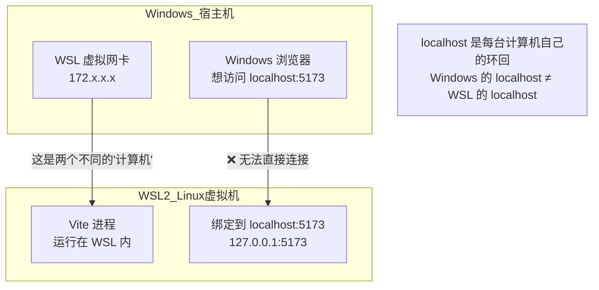
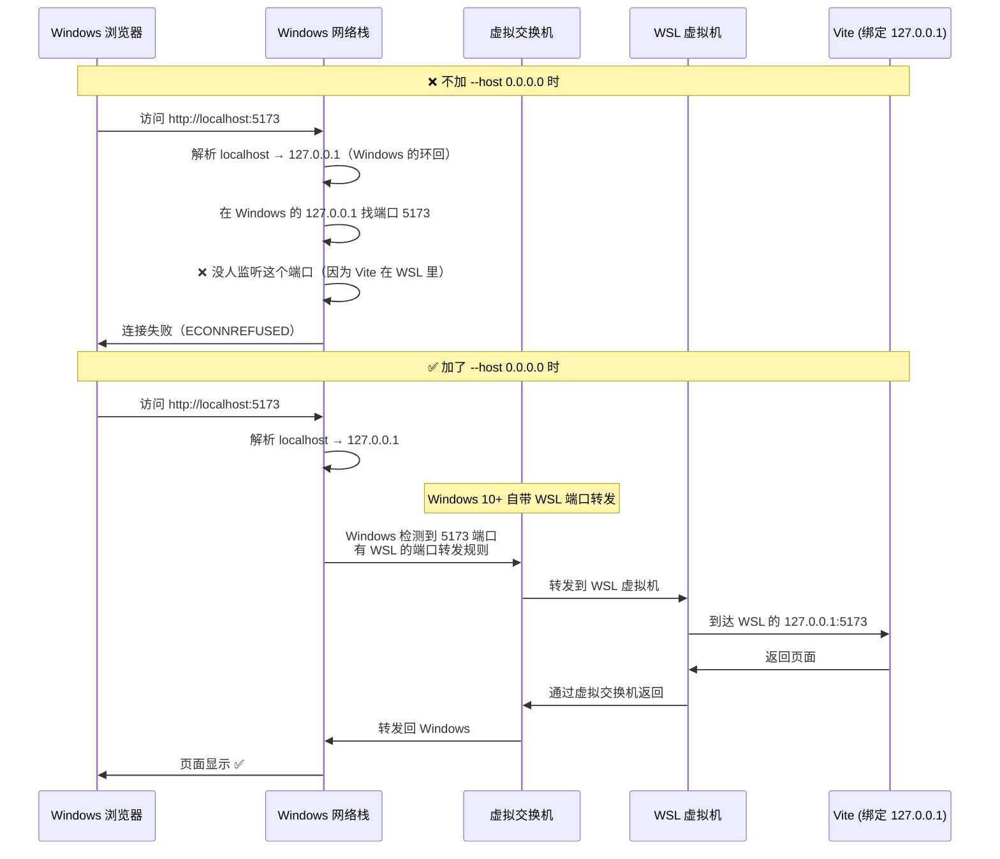
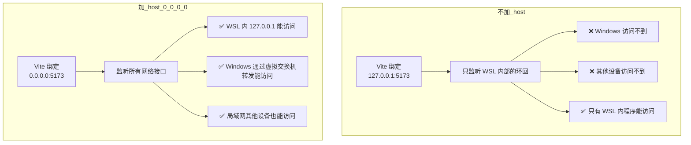
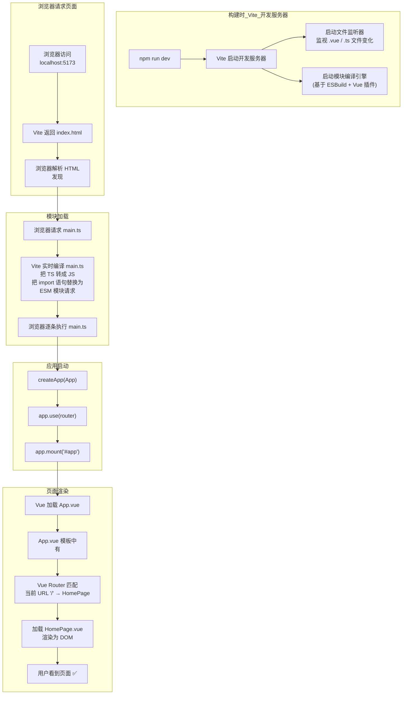

# Vue 精通指南 — 从独立开发到架构大型项目

> 目标：掌握 Vue 3 核心原理、大型项目架构模式、独立使用/贡献开源 Vue 项目的能力

---

## 一、从零实战：搭建并运行你的第一个 Vue 3 页面

> 先动手跑起来，再理解原理。这一章让你 10 分钟内从 0 到看到一个页面。

### 1.1 环境准备

```bash
# ① 检查 Node.js（需要 >= 18）
node -v    # 看到 v18.x.x 或更高

# ② 确认已有包管理器
npm -v     # npm 自带
# 或者
yarn -v    # 如果安装了 yarn

# 如果已有 Node.js 但版本低：
# Windows: 去 nodejs.org 下载 LTS 版本重装
# macOS:   brew upgrade node
# Linux:   用 nvm 切换版本
```

### 1.2 用 Vite 创建项目

**选你有的包管理器，三选一：**

```bash
# ── 用 npm ──
npm create vite@latest my-vue-app -- --template vue-ts

# ── 用 yarn ──
yarn create vite my-vue-app --template vue-ts

# ── 用 pnpm（如果有） ──
pnpm create vite my-vue-app --template vue-ts
```

看到提示后选 `Vue` + `TypeScript`，然后：

```bash
cd my-vue-app

# npm
npm install

# 或者 yarn
yarn

# 或者 pnpm
pnpm install
```

**项目目录长这样：**

```
my-vue-app/
├── index.html          # 入口 HTML
├── package.json        # 依赖配置
├── tsconfig.json       # TypeScript 配置
├── vite.config.ts      # Vite 构建配置
├── public/             # 静态资源
└── src/                # 源码
    ├── main.ts         # 应用入口
    ├── App.vue         # 根组件
    ├── style.css       # 全局样式
    └── components/     # 组件目录
        └── HelloWorld.vue
```

### 1.3 启动开发服务器

```bash
# npm
npm run dev

# 或者 yarn
yarn dev

# 或者 pnpm
pnpm dev
```

终端会显示：
```
VITE v6.x.x  ready in 200ms
  ➜  Local:   http://localhost:5173/
```

浏览器打开 `http://localhost:5173/`，已经能看到一个 Vue 页面了。

### 1.4 创建你的第一个页面

**① 新建页面组件 `src/pages/HomePage.vue`**：

```vue
<script setup lang="ts">
import { ref } from 'vue'

const title = ref('我的第一个 Vue 页面')
const count = ref(0)
const items = ref(['Vue 3', 'TypeScript', 'Vite', 'Pinia'])
</script>

<template>
  <div class="home">
    <h1>{{ title }}</h1>
    <p>计数: {{ count }}</p>
    <button @click="count++">+1</button>
    <ul>
      <li v-for="(item, index) in items" :key="index">{{ item }}</li>
    </ul>
  </div>
</template>

<style scoped>
.home { max-width: 600px; margin: 40px auto; text-align: center; }
button { padding: 8px 24px; font-size: 16px; cursor: pointer; }
ul { list-style: none; padding: 0; }
li { padding: 8px; margin: 4px; background: #f0f0f0; border-radius: 4px; }
</style>
```

**② 配置路由 `src/router/index.ts`**：

```typescript
import { createRouter, createWebHistory } from 'vue-router'
import HomePage from '@/pages/HomePage.vue'

const routes = [
  { path: '/', name: 'home', component: HomePage },
]

export default createRouter({
  history: createWebHistory(),
  routes,
})
```

**③ 在 `src/main.ts` 注册路由**：

```typescript
import { createApp } from 'vue'
import App from './App.vue'
import router from './router'
import './style.css'

const app = createApp(App)
app.use(router)
app.mount('#app')
```

**④ 修改 `src/App.vue`**：

```vue
<script setup lang="ts">
</script>

<template>
  <router-view />
</template>
```

**⑤ 配置路径别名 `vite.config.ts`**：

```typescript
import { defineConfig } from 'vite'
import vue from '@vitejs/plugin-vue'
import { resolve } from 'path'

export default defineConfig({
  plugins: [vue()],
  resolve: {
    alias: {
      '@': resolve(__dirname, 'src'),
    },
  },
})
```

**⑥ 安装路由依赖**：

```bash
npm install vue-router@4
# 或者
yarn add vue-router@4
# 或者
pnpm add vue-router@4
```

浏览器会自动刷新，看到你写的页面。点击按钮数字会 +1——响应式已经在工作了。

### 1.5 添加第二个页面 + 导航

**创建 `src/pages/AboutPage.vue`**：

```vue
<script setup lang="ts">
const team = ['Alice', 'Bob', 'Charlie']
</script>

<template>
  <div class="about">
    <h1>关于我们</h1>
    <p v-for="name in team" :key="name">{{ name }}</p>
  </div>
</template>
```

**在路由表中添加**：

```typescript
const routes = [
  { path: '/', name: 'home', component: HomePage },
  { path: '/about', name: 'about', component: () => import('@/pages/AboutPage.vue') },
  // ↑ 用动态 import 实现懒加载，只有访问 /about 时才加载此组件
]
```

**在 HomePage 加导航链接**：

```vue
<template>
  <div class="home">
    <nav>
      <router-link to="/">首页</router-link> |
      <router-link to="/about">关于</router-link>
    </nav>
    <!-- ... 原有内容 -->
  </div>
</template>
```

### 1.6 常见问题速查

| 问题 | 解决 |
|------|------|
| Vite 启动成功但浏览器访问失败 | **最常见原因：运行在 WSL/虚拟机/远程服务器中**。Vite 默认只绑定 `localhost`（容器内），外部浏览器无法访问。解决方案见下方第 8 节。 |
| 端口被占用 | `npm run dev -- --port 3000` / `yarn dev --port 3000` |
| `@/` 路径报错 | 检查 `vite.config.ts` 的 alias 配置 |
| 页面空白控制台报路由错误 | `npm install vue-router@4` 或 `yarn add vue-router@4` |
| `tsconfig` 报路径别名错 | 在 `tsconfig.json` 加 `"baseUrl": ".", "paths": { "@/*": ["src/*"] }` |

### 1.7 项目开发常见操作

```bash
#              npm                 yarn               pnpm
# ─────────────────────────────────────────────────────────────
 dev          npm run dev          yarn dev           pnpm dev
 build        npm run build        yarn build         pnpm build
 preview      npm run preview      yarn preview       pnpm preview
 安装依赖     npm install xxx      yarn add xxx       pnpm add xxx
 开发依赖     npm install -D xxx   yarn add -D xxx    pnpm add -D xxx
 删除依赖     npm uninstall xxx    yarn remove xxx    pnpm remove xxx
```

### 1.8 深度解析：为什么 Vite 启动后 Windows 浏览器访问不了？

#### 8.1 先搞清两个根本概念

**概念一：`localhost` 不是你的物理网卡**

```
你的电脑的"网络"不是一块，是三块：

┌─────────────────────────────────────────────────────┐
│  你的物理机                                            │
│                                                       │
│  ┌──────────┐  ┌──────────────┐  ┌────────────────┐  │
│  │ 127.0.0.1 │  │ 192.168.1.5  │  │ 172.x.x.x      │  │
│  │ localhost  │  │ 物理网卡 IP  │  │ Docker/WSL 虚拟  │  │
│  │ 虚拟环回    │  │ (WiFi/网线)  │  │ 网卡            │  │
│  └──────────┘  └──────────────┘  └────────────────┘  │
└─────────────────────────────────────────────────────┘
```

- `127.0.0.1`（localhost）是一个**虚拟的环回地址**，只有**本机内部**能访问
- 把 `127.0.0.1` 想象成你家的"内部电话"——只能打到你自己家，邻居打不进来
- `0.0.0.0` 意思不是"某个 IP"，而是**"所有网络接口"**——让服务可以通过任意网卡访问

**概念二：WSL2 是一个真正的独立虚拟机**



WSL2 ≠ 普通的程序，它是一个**完整的 Linux 内核**跑在 Hyper-V 虚拟机里：
- WSL2 有自己的独立网络栈、独立内核、独立 IP
- Windows 和 WSL2 之间通过一个**虚拟交换机**通信
- WSL2 内部的 `127.0.0.1` 是 WSL 虚拟机的环回，Windows 进程访问不到

#### 8.2 一步步看数据包的"旅程"



#### 8.3 为什么 `--host 0.0.0.0` 能解决问题？



**关键原因有两个层叠效应：**

**第一层：`0.0.0.0` 让 Vite 监听所有网卡**

不加 `--host` 时，Vite 默认用 `127.0.0.1`（仅环回），等价于：
```
Vite 说："我只听 WSL 自己内部的电话"
```
加了 `--host 0.0.0.0` 后：
```
Vite 说："我监听所有网卡，包括虚拟网卡"
```

**第二层：Windows 10+ 有 WSL 端口转发机制**

Windows 10 build 19041+ 和 Windows 11 会自动为 WSL2 暴露的端口创建转发规则。当 WSL 里的某个程序绑定了 `0.0.0.0` 时，Windows 会通过 `netsh interface portproxy` 在背后自动添加一条端口转发规则，把对 `localhost:5173` 的访问转发到 WSL 虚拟机里。

```
Windows 收到 localhost:5173 请求 →
检查到 WSL 的 5173 端口有转发 →
通过虚拟交换机转发到 WSL →
Vite（绑了 0.0.0.0）接收 →
返回响应
```

#### 8.4 一个实验验证理解

在 WSL 里执行以下命令，看输出差异：

```bash
# 实验 1：监听 127.0.0.1（只有 WSL 内部）
python3 -m http.server 8888 --bind 127.0.0.1 &
# Windows 浏览器访问 http://localhost:8888 → ❌ 失败

# 实验 2：监听 0.0.0.0
python3 -m http.server 8889 --bind 0.0.0.0 &
# Windows 浏览器访问 http://localhost:8889 → ✅ 成功

# 清理
kill %1 %2
```

**查看 Windows 自动创建的转发规则（在 Windows PowerShell 里执行）：**
```powershell
netsh interface portproxy show all
# 你会看到类似：
# 监听 0.0.0.0:5173 → 连接到 172.x.x.x:5173
```

#### 8.5 其他常见原因

**原因 2：终端显示的 URL 不是 `localhost`**

仔细看终端输出，Vite 可能会显示：
```
➜  Local:   http://127.0.0.1:5173/    ← 试试这个
➜  Network: http://192.168.1.5:5173/   ← 局域网其他设备用这个
```

如果 `localhost` 不行，直接复制终端里显示的 URL 到浏览器。

**原因 3：防火墙拦截**

Linux 防火墙可能拦截 5173 端口：
```bash
sudo ufw status
sudo ufw allow 5173
```

#### 8.6 快速诊断命令

```bash
# ① 确认 Vite 进程在运行
ps aux | grep vite

# ② 查看 Vite 到底绑在哪个地址上
ss -tlnp | grep 5173
# 127.0.0.1:5173  → 只监听环回（问题所在）
# 0.0.0.0:5173    → 监听所有接口（正常）

# ③ 从 WSL 内部测试连通性
curl http://localhost:5173/
# 返回 HTML → Vite 本身没问题

# ④ 从 Windows PowerShell 测试（如果 WSL 绑了 0.0.0.0）
curl http://localhost:5173/
# 也返回 HTML → 通了

# ⑤ 查看 Windows 侧的端口转发规则（Windows PowerShell）
netsh interface portproxy show all
```

#### 8.7 一句话总结

```
不加 --host:  Vite 只监听 WSL 内部的 127.0.0.1 → Windows 浏览器过不去
加 --host:    Vite 监听所有网卡包括虚拟网卡 → Windows 自动做端口转发 → 浏览器能访问
```

### 1.9 串起来：从 `npm run dev` 到页面显示，完整链路

> 这一节回答一个根本问题：你敲了 `npm run dev`，浏览器打开页面，**中间到底发生了什么？**



#### 1.9.1 第一步：`npm run dev` → Vite 启动

当你敲下 `npm run dev`：

```
① package.json 里的 "scripts": { "dev": "vite" } 被找到
② 终端执行 node_modules/.bin/vite
③ Vite 做三件事：
   a. 启动一个 HTTP 开发服务器（默认 5173 端口）
   b. 启动文件监听器（检测 .vue/.ts 文件变化，做 HMR 热更新）
   c. 准备好编译引擎（ESBuild 负责编译 TS → JS，Vue 插件负责编译 .vue）
```

**关键理解：Vite 不做打包。** 不像 Webpack 把所有模块打包成一个 bundle.js 再发给浏览器。Vite 让浏览器直接通过 ESM（`import` / `export`）按需加载模块，Vite 只在浏览器请求时"实时编译"单个文件。

#### 1.9.2 第二步：浏览器请求 index.html → 发现入口

```
① 浏览器请求 http://localhost:5173/
② Vite 返回 index.html（原始内容，Vite 几乎不做修改）
```

```html
<!-- index.html 中的关键行 -->
<script type="module" src="/src/main.ts"></script>
```

`type="module"` 告诉浏览器："这是一个 ES Module 脚本，遇到 import 语句就去网络加载对应模块。"

#### 1.9.3 第三步：加载并执行 main.ts

```
① 浏览器请求 /src/main.ts
② Vite 的 Vue 插件实时编译 main.ts：
   把 TypeScript → JavaScript（去掉类型注解）
   把 node_modules 的路径 → 浏览器可用的 URL 路径
③ 浏览器接收编译后的 JS 并执行
```

**main.ts 的三个动作逐个拆解：**

```typescript
// ① createApp(App) — 创建 Vue 应用实例
const app = createApp(App)
// App 是根组件（一个 .vue 文件），createApp 做：
//   - 创建 Vue 应用对象
//   - 把 App.vue 注册为根组件
//   - 初始化响应式系统
//   此时应用还是"离线"的，没挂到 DOM 上

// ② app.use(router) — 注册路由插件
app.use(router)
// Vue Router 插件做：
//   - 监听浏览器 URL 变化（popstate 事件）
//   - 初始化路由匹配器（把 /users/:id 这类规则编译为高效的正则）
//   - 给所有组件注入 $route 和 $router
//   此时路由已就绪，但还没开始匹配

// ③ app.mount('#app') — 挂载到 DOM
app.mount('#app')
// 这是"点火"的一步：
//   - 找到 index.html 中的 <div id="app"></div>
//   - 渲染 App.vue（执行其 template/render 函数）
//   - 把渲染结果插入到 <div id="app"> 中
//   从这一刻起，用户能看到内容了
```

#### 1.9.4 第四步：App.vue 渲染 → 遇到 `<router-view>`

```vue
<!-- App.vue -->
<template>
  <!-- 这里写什么，页面就显示什么 -->
  <router-view />
</template>
```

Vue 在渲染 App.vue 时发现 `<router-view />`：
```
① Vue Router 查看当前浏览器 URL：http://localhost:5173/
② 去掉域名，得到路径：/
③ 在路由表中查找匹配：
   const routes = [
     { path: '/', name: 'home', component: HomePage },
     { path: '/about', name: 'about', component: () => import('@/pages/AboutPage.vue') },
   ]
④ 找到匹配：path: '/' → component: HomePage
⑤ 加载 HomePage 组件（如果路由配置是动态 import，此时才请求文件）
⑥ Vue 渲染 HomePage.vue，把结果插入到 <router-view> 的位置
```

**所以页面结构最终变成：**

```html
<div id="app">                          <!-- app.mount('#app') 挂载到这里 -->
  <div class="home">                    <!-- router-view 被替换为 HomePage -->
    <nav>...</nav>
    <h1>我的第一个 Vue 页面</h1>
    <p>计数: 0</p>
    <button>+1</button>
    ...
  </div>
</div>
```

#### 1.9.5 完整流程图（文字版）

```
终端:
  npm run dev
    ↓
  Vite 启动开发服务器 (localhost:5173)
    ↓
  Vite 监视 src/ 下所有文件变化

浏览器:
  访问 http://localhost:5173/
    ↓
  请求 index.html
    ↓
  发现 <script type="module" src="/src/main.ts">
    ↓
  请求 /src/main.ts → Vite 编译 TS → JS → 返回
    ↓
  执行 main.ts:
    createApp(App)          → 创建 Vue 实例
    app.use(router)         → 注册路由
    app.mount('#app')       → 渲染到 DOM
    ↓
  Vue 渲染 App.vue
    ↓
  遇到 <router-view />
    ↓
  Vue Router 匹配 URL: / → HomePage
    ↓
  Vue 渲染 HomePage.vue
    ↓
  用户看到页面 ✅
```

#### 1.9.6 三个核心文件各司其职

| 文件 | 角色 | 一句话 |
|------|------|--------|
| `index.html` | **入口** | 浏览器第一个加载的 HTML 文件，包含 `<script type="module">` 指向 main.ts |
| `main.ts` | **启动器** | 创建 Vue 实例、注册插件、挂载到 DOM——负责"点火" |
| `App.vue` | **根组件** | 页面的最外层骨架，通常包含 `<router-view />` 和全局布局（Header/Sidebar） |
| `router/index.ts` | **导航员** | 定义 URL 路径和组件的对应关系，告诉 Vue "当前 URL 该显示哪个组件" |
| `*.vue` 文件 | **页面组件** | 每个文件就是一个页面或组件，包含 template（HTML）+ script（JS）+ style（CSS） |

**它们之间的关系：**

```
index.html (浏览器入口)
    ↓ 引用
main.ts (应用启动器)
    ↓ createApp
App.vue (根骨架)
    ↓ <router-view>
router/index.ts (导航员) → 匹配 URL → 加载对应的 .vue 页面
    ↓
HomePage.vue / AboutPage.vue (具体页面)
```

---

## 二、Vue 语法速成 — 看完就能写页面

> 以下全部是 Vue 3 Composition API（`<script setup>`）写法，这是 2026 年唯一推荐写法。

### 2.1 模板语法

```vue
<script setup lang="ts">
// 变量可以直接在模板中使用
const message = 'Hello Vue'
const htmlContent = '<strong>富文本</strong>'
const imageUrl = 'https://vuejs.org/logo.svg'
</script>

<template>
  <!-- 文本插值 -->
  <p>{{ message }}</p>

  <!-- 原始 HTML（慎用，防 XSS） -->
  <p v-html="htmlContent"></p>

  <!-- 属性绑定 -->
  

  <!-- 动态属性名 -->
  <div :[dynamicAttr]="value"></div>
</template>
```

| 语法 | 作用 | 简写 |
|------|------|------|
| `{{ expr }}` | 文本插值，显示表达式结果 | — |
| `v-bind:attr="val"` | 绑定 HTML 属性 | `:attr="val"` |
| `v-html="raw"` | 输出原始 HTML | — |
| `v-once` | 只渲染一次，后续不更新 | — |
| `v-pre` | 跳过编译，直接显示 `{{ }}` | — |

### 2.2 条件渲染

```vue
<script setup lang="ts">
const isLoggedIn = ref(false)
const role = ref('admin')
const loadingState = ref<'loading' | 'success' | 'error'>('loading')
</script>

<template>
  <!-- 单个条件 -->
  <p v-if="isLoggedIn">欢迎回来</p>
  <p v-else>请登录</p>

  <!-- 多分支 -->
  <div v-if="role === 'admin'">管理员面板</div>
  <div v-else-if="role === 'editor'">编辑面板</div>
  <div v-else>访客视图</div>

  <!-- v-show：只是 display:none，频繁切换用 -->
  <div v-show="loadingState === 'loading'">加载中...</div>
</template>
```

| 指令 | 行为 | 适用场景 |
|------|------|---------|
| `v-if` | 条件为 false 时 DOM 不渲染/销毁 | 冷启动条件，不频繁切换 |
| `v-show` | 始终渲染，只是 CSS `display:none` | 频繁切换显示/隐藏 |

### 2.3 列表渲染

```vue
<script setup lang="ts">
const users = ref([
  { id: 1, name: 'Alice', active: true },
  { id: 2, name: 'Bob', active: false },
  { id: 3, name: 'Charlie', active: true },
])
const objectData = ref({ a: 1, b: 2, c: 3 })
</script>

<template>
  <!-- 数组列表 -->
  <ul>
    <li v-for="(user, index) in users" :key="user.id">
      {{ index + 1 }}. {{ user.name }}
      <span v-if="user.active">🟢</span>
    </li>
  </ul>

  <!-- 对象遍历 -->
  <div v-for="(value, key, index) in objectData" :key="key">
    {{ index }}: {{ key }} = {{ value }}
  </div>

  <!-- 数字范围 -->
  <span v-for="n in 5" :key="n">{{ n }}</span>
</template>
```

**`key` 为什么必须加？** — Vue 靠 `key` 识别每个节点身份。列表数据变化时，有 `key` 才能精确复用/移动 DOM 节点，而不是全部销毁重建。

### 2.4 事件处理

```vue
<script setup lang="ts">
const count = ref(0)

function handleClick(event: MouseEvent) {
  console.log('点击坐标:', event.clientX, event.clientY)
}

function handleInput(event: Event) {
  const target = event.target as HTMLInputElement
  console.log('输入:', target.value)
}

function sayHello(name: string) {
  alert(`你好, ${name}!`)
}

function handleKeydown(e: KeyboardEvent) {
  if (e.key === 'Enter') console.log('按了回车')
}
</script>

<template>
  <!-- 基本用法 -->
  <button @click="count++">+1</button>
  <button @click="handleClick">点我</button>

  <!-- 传参 + 事件对象 -->
  <button @click="sayHello('Vue')">打招呼</button>
  <button @click="(e) => sayHello(e.target)">内联箭头函数</button>

  <!-- 事件修饰符 -->
  <form @submit.prevent="onSubmit">    <!-- 阻止默认行为 -->
    <input @keyup.enter="onSearch">    <!-- 仅回车触发 -->
    <button @click.stop="onClick">     <!-- 阻止冒泡 -->
    <div @click.once="doOnce">         <!-- 只执行一次 -->
    <a @click.prevent.stop="go">       <!-- 可以连用 -->
  </form>
</template>
```

| 修饰符 | 含义 |
|--------|------|
| `.stop` | `event.stopPropagation()` |
| `.prevent` | `event.preventDefault()` |
| `.once` | 事件只触发一次 |
| `.enter` `.tab` `.esc` | 按键别名 |
| `.ctrl` `.alt` `.shift` `.meta` | 组合键 |

### 2.5 双向绑定（表单）

```vue
<script setup lang="ts">
const name = ref('')
const gender = ref('')
const agree = ref(false)
const city = ref('')
const skills = ref<string[]>([])
const intro = ref('')
</script>

<template>
  <!-- 文本输入 -->
  <input v-model="name" placeholder="姓名">

  <!-- 多行文本 -->
  <textarea v-model="intro" placeholder="简介"></textarea>

  <!-- 单选框 -->
  <label><input type="radio" v-model="gender" value="male"> 男</label>
  <label><input type="radio" v-model="gender" value="female"> 女</label>

  <!-- 复选框（单个：boolean） -->
  <label><input type="checkbox" v-model="agree"> 同意协议</label>

  <!-- 复选框（多个：数组） -->
  <label><input type="checkbox" v-model="skills" value="vue"> Vue</label>
  <label><input type="checkbox" v-model="skills" value="ts"> TypeScript</label>

  <!-- 下拉选择 -->
  <select v-model="city">
    <option value="">请选择</option>
    <option value="beijing">北京</option>
    <option value="shanghai">上海</option>
  </select>

  <!-- 显示当前值 -->
  <pre>{{ { name, gender, agree, city, skills, intro } }}</pre>
</template>
```

| 输入类型 | `v-model` 绑定的值 |
|---------|-------------------|
| `<input type="text">` | `string` |
| `<input type="checkbox">` 单个 | `boolean` |
| `<input type="checkbox">` 多个 | `string[]` |
| `<input type="radio">` | `string` |
| `<select>` 单选 | `string` |
| `<select>` 多选 | `string[]` |

### 2.6 计算属性 vs 方法 vs 侦听器

```vue
<script setup lang="ts">
const firstName = ref('张')
const lastName = ref('三')
const items = ref([1, 2, 3, 4, 5, 6])
const query = ref('')

// 计算属性：有缓存，只有依赖变化时才重新计算
const fullName = computed(() => `${firstName.value}${lastName.value}`)

// 可写计算属性
const fullNameWritable = computed({
  get: () => `${firstName.value}${lastName.value}`,
  set: (val) => {
    [firstName.value, lastName.value] = [val[0], val.slice(1)]
  },
})

// 计算属性：过滤 + 排序
const filteredItems = computed(() =>
  items.value.filter(i => i > 2).sort((a, b) => b - a)
)

// 方法：每次渲染都执行，无缓存
function getFilteredItems() {
  return items.value.filter(i => i > 2)
}

// 侦听器：当数据变化时执行副作用
watch(query, (newVal, oldVal) => {
  console.log(`搜索词从 "${oldVal}" 变为 "${newVal}"`)
  // 这里可以发 API 请求
})

// 立即执行 + 深度侦听
watch(query, () => {
  /* ... */
}, { immediate: true, deep: true })

// 侦听多个来源
watch([firstName, lastName], ([newFirst, newLast]) => {
  console.log('姓名变了', newFirst, newLast)
})
</script>

<template>
  <p>{{ fullName }}</p>
  <input v-model="query" placeholder="搜索">
  <ul>
    <li v-for="item in filteredItems" :key="item">{{ item }}</li>
  </ul>
</template>
```

| | `computed` | `watch` | 方法 |
|--|-----------|---------|------|
| 缓存 | ✅ 有缓存 | — | ❌ 每次都执行 |
| 执行时机 | 依赖变化时 | 监听值变化时 | 每次渲染 |
| 用途 | 派生数据（展示用） | 副作用（API 请求、日志） | 事件处理 |
| 返回值 | 有（只读/可写） | 无（执行操作） | 可有可无 |

### 2.7 组件基础

```vue
<!-- 子组件 UserCard.vue -->
<script setup lang="ts">
// Props 定义
interface User {
  id: number
  name: string
  avatar?: string
}

const props = defineProps<{
  user: User
  showEmail?: boolean
  variant?: 'compact' | 'full'
}>()

// 带默认值的写法
const props2 = withDefaults(defineProps<{
  title?: string
  count?: number
}>(), {
  title: '默认标题',
  count: 0,
})

// Emits 定义
const emit = defineEmits<{
  click: [id: number]
  delete: [id: number]
  update: [value: string]
}>()

function handleClick() {
  emit('click', props.user.id)
}

// 暴露给父组件的方法
defineExpose({ resetFocus, validate })
</script>

<template>
  <div class="user-card" :class="variant" @click="handleClick">
    
    <h3>{{ user.name }}</h3>
    <p v-if="showEmail">{{ user.email }}</p>
    <button @click.stop="emit('delete', user.id)">删除</button>
    <!-- 默认插槽 -->
    <slot />
    <!-- 具名插槽 -->
    <slot name="footer" :user="user" />
  </div>
</template>
```

```vue
<!-- 父组件使用 -->
<script setup lang="ts">
import UserCard from './UserCard.vue'

function onDeleteUser(id: number) {
  console.log('删除用户:', id)
}
</script>

<template>
  <UserCard
    v-for="user in users"
    :key="user.id"
    :user="user"
    :show-email="true"
    @click="onClickUser"
    @delete="onDeleteUser"
  >
    <!-- 默认插槽内容 -->
    <p>额外描述信息</p>

    <!-- 具名插槽 + 作用域插槽 -->
    <template #footer="{ user }">
      <span>最后登录: {{ user.lastLogin }}</span>
    </template>
  </UserCard>
</template>
```

| 概念 | 父 → 子 | 子 → 父 |
|------|---------|---------|
| 数据 | `props` | `emit` |
| 类型定义 | `defineProps<{...}>()` | `defineEmits<{...}>()` |
| 传递方式 | `:prop-name="value"` | `@event-name="handler"` |
| 默认值 | `withDefaults(defineProps{...}, {...})` | — |

### 2.8 CSS 绑定与样式处理

```vue
<script setup lang="ts">
const theme = ref('dark')
const isActive = ref(true)
const boxStyle = ref({
  width: '100px',
  height: '100px',
  backgroundColor: 'red',
})
const color = ref('blue')
const classObject = computed(() => ({
  active: isActive.value,
  'theme-dark': theme.value === 'dark',
  disabled: !isActive.value,
}))
</script>

<template>
  <!-- :class：对象语法 -->
  <div :class="{ active: isActive, 'text-danger': hasError }"></div>

  <!-- :class：数组语法 -->
  <div :class="['base', theme === 'dark' ? 'dark' : 'light']"></div>

  <!-- :class：计算属性 -->
  <div :class="classObject"></div>

  <!-- :style：对象语法 -->
  <div :style="{ color: 'red', fontSize: '14px' }"></div>

  <!-- :style：从变量来 -->
  <div :style="boxStyle"></div>

  <!-- :style：数组（合并多个样式对象） -->
  <div :style="[baseStyle, activeStyle]"></div>

  <!-- CSS 变量绑定 -->
  <div :style="{ '--theme-color': color }">
    <span class="use-var">颜色由父组件控制</span>
  </div>
</template>

<style scoped>
/* scoped：样式仅作用于当前组件，不影响全局 */
.use-var {
  color: var(--theme-color); /* 接收父组件的 CSS 变量 */
}

/* 深度选择器：穿透 scoped 影响子组件 */
:deep(.child-class) { font-weight: bold; }

/* 插槽选择器：影响通过 slot 传入的内容 */
:slotted(.slot-class) { margin: 0; }

/* 全局选择器：在当前组件中定义全局样式 */
:global(.my-global-class) { margin: 0; }
</style>
```

### 2.9 生命周期

```vue
<script setup lang="ts">
import { onMounted, onUnmounted, onUpdated, onBeforeUnmount } from 'vue'

// 组件挂载完成（DOM 可用）
onMounted(() => {
  console.log('组件已挂载，可以操作 DOM')
})

// 组件更新完成
onUpdated(() => {
  console.log('组件已更新')
})

// 组件卸载前（清理副作用）
onBeforeUnmount(() => {
  console.log('组件即将卸载')
})

// 组件卸载后
onUnmounted(() => {
  console.log('组件已卸载')
})
</script>
```

**开发页面最常用的生命周期场景：**

| 时机 | 做什么 |
|------|--------|
| `onMounted` | 发 API 请求获取列表、注册事件监听、初始化第三方库 |
| `onBeforeUnmount` | 清理定时器、取消 WebSocket 连接、移除事件监听 |
| `onUnmounted` | 最后的清理（组件不会再用了） |
| `onUpdated` | 响应数据变化后操作 DOM（少用，优先用 `watch`） |

### 2.10 完整页面示例

将以上所有语法融汇到一个页面：

```vue
<script setup lang="ts">
import { ref, computed, onMounted } from 'vue'

// 数据
const todos = ref<{ id: number; text: string; done: boolean }[]>([])
const newTodo = ref('')
const filter = ref<'all' | 'active' | 'done'>('all')

// 计算属性：过滤列表
const filteredTodos = computed(() => {
  if (filter.value === 'active') return todos.value.filter(t => !t.done)
  if (filter.value === 'done') return todos.value.filter(t => t.done)
  return todos.value
})

const activeCount = computed(() => todos.value.filter(t => !t.done).length)

// 方法
function addTodo() {
  if (!newTodo.value.trim()) return
  todos.value.push({
    id: Date.now(),
    text: newTodo.value.trim(),
    done: false,
  })
  newTodo.value = ''
}

function removeTodo(id: number) {
  todos.value = todos.value.filter(t => t.id !== id)
}

// 挂载时加载
onMounted(() => {
  const saved = localStorage.getItem('todos')
  if (saved) todos.value = JSON.parse(saved)
})

// 变化时保存
watch(todos, (val) => {
  localStorage.setItem('todos', JSON.stringify(val))
}, { deep: true })
</script>

<template>
  <div class="todo-app">
    <h1>待办事项 ({{ activeCount }}/{{ todos.length }})</h1>

    <form @submit.prevent="addTodo">
      <input v-model="newTodo" placeholder="添加新待办..." />
      <button :disabled="!newTodo.trim()">添加</button>
    </form>

    <div class="filters">
      <button
        v-for="f in (['all', 'active', 'done'] as const)"
        :key="f"
        @click="filter = f"
        :class="{ active: filter === f }"
      >{{ f }}</button>
    </div>

    <ul>
      <li v-for="todo in filteredTodos" :key="todo.id" :class="{ done: todo.done }">
        <input type="checkbox" v-model="todo.done" />
        <span>{{ todo.text }}</span>
        <button @click="removeTodo(todo.id)">✕</button>
      </li>
    </ul>

    <p v-if="!filteredTodos.length" class="empty">暂无待办</p>
  </div>
</template>

<style scoped>
.todo-app { max-width: 500px; margin: 40px auto; font-family: sans-serif; }
.filters { display: flex; gap: 8px; margin: 16px 0; }
.filters button { padding: 4px 12px; border: 1px solid #ccc; background: white; cursor: pointer; }
.filters .active { background: #42b883; color: white; border-color: #42b883; }
li { display: flex; align-items: center; gap: 8px; padding: 8px; border-bottom: 1px solid #eee; }
li.done span { text-decoration: line-through; color: #999; }
.empty { text-align: center; color: #999; margin-top: 20px; }
</style>
```

你能直接把这个组件放到你的项目中——它演示了本章所有核心语法：`ref`、`computed`、`watch`、`v-model`、`v-for`、`v-if`、`@submit.prevent`、`:class`、`onMounted`、`scoped` 样式。

---

## 三、Vue 3 核心原理 — 必须理解底层才能做架构决策

### 3.1 响应式系统：从 Proxy 到 effect

Vue 3 的响应式基于 **Proxy**，不再是 Vue 2 的 `Object.defineProperty`。

```typescript
// 极简版响应式原理
const depsMap = new WeakMap()  // target → Map<key, Set<effect>>

function reactive(target) {
  return new Proxy(target, {
    get(target, key, receiver) {
      track(target, key)         // 收集依赖
      return Reflect.get(target, key, receiver)
    },
    set(target, key, value, receiver) {
      const result = Reflect.set(target, key, value, receiver)
      trigger(target, key)       // 触发更新
      return result
    }
  })
}

function track(target, key) {
  if (!activeEffect) return
  let deps = depsMap.get(target)
  if (!deps) depsMap.set(target, deps = new Map())
  let dep = deps.get(key)
  if (!dep) deps.set(key, dep = new Set())
  dep.add(activeEffect)
}

function trigger(target, key) {
  const deps = depsMap.get(target)
  if (!deps) return
  const dep = deps.get(key)
  if (dep) dep.forEach(effect => effect())
}
```

| 概念 | 解释 | 架构意义 |
|------|------|---------|
| `reactive` | 深层次代理对象 | 适合全局状态、复杂嵌套数据 |
| `ref` | 值类型的响应式包装（`.value`） | 适合单个值、表单字段 |
| `computed` | 惰性求值 + 缓存 | 避免不必要的重复计算 |
| `watchEffect` | 自动追踪依赖 | 副作用自动化 |
| `shallowRef` | 只代理 `.value` 层 | 大数据列表性能优化 |

**架构原则：**
- `ref` 用于原始值/简单类型，`reactive` 用于深层对象
- 避免直接解构 `reactive` 对象（丢失响应式），用 `toRefs` / `toRef`
- `shallowRef` + `triggerRef` 适合大数组——手动控制更新时机

### 3.2 虚拟 DOM 与渲染器

```typescript
// 极简 VNode
interface VNode {
  type: string | Component
  props: Record<string, any> | null
  children: VNode[] | string | null
}

// Mount 过程
function mount(vnode: VNode, container: HTMLElement) {
  const el = document.createElement(vnode.type as string)
  // 处理 props
  for (const key in vnode.props) {
    el.setAttribute(key, vnode.props[key])
  }
  // 处理 children
  if (typeof vnode.children === 'string') {
    el.textContent = vnode.children
  } else if (Array.isArray(vnode.children)) {
    vnode.children.forEach(child => mount(child, el))
  }
  container.appendChild(el)
}
```

**架构师视角的 Diff 核心逻辑：**

| 层级 | 策略 | 为什么 |
|------|------|--------|
| 跨层级 | 不比较，直接删除重建 | DOM 操作跨层级极少，不值得优化 |
| 同层级同类型 | patch（递归 diff props + children） | 大部分更新是同一组件的数据变化 |
| 同层级不同类型 | 卸载旧的，挂载新的 | 类型变了就是完全不同的 UI |
| Children | **双端比较** + key 优化 | 用 key 识别可复用的节点 |

**Key 的真正作用：** 不是"提高性能"，而是**标识节点身份**，让 Diff 算法知道"这个节点可以复用，只是挪了个位置"。

### 3.3 组件挂载完整流程

```
beforeCreate (Vue2 only)
  ↓
setup() — Composition API 入口
  ↓
  reactive state 初始化
  watchEffect 注册
  computed 注册
  ↓
beforeMount
  ↓
  render() 执行 → 生成 VNode Tree
  ↓
  mount 到 DOM
  ↓
mounted
```

### 3.4 更新触发机制

```
响应式数据变化
  ↓
trigger() → 执行 effect
  ↓
更新 VNode Tree
  ↓
Diff 对比新旧 VNode
  ↓
Patch 最小化 DOM 操作
```

---

## 四、Composition API 高阶模式

### 4.1 组合函数设计模式

```typescript
// ✅ 好的组合函数：职责单一、可组合
export function useUserList() {
  const { data, error, isLoading, execute } = useFetch('/api/users')

  const searchQuery = ref('')
  const filteredUsers = computed(() =>
    data.value?.filter(u => u.name.includes(searchQuery.value))
  )

  return { users: filteredUsers, isLoading, error, searchQuery, refresh: execute }
}

export function usePagination(total: Ref<number>, pageSize = 20) {
  const currentPage = ref(1)
  const totalPages = computed(() => Math.ceil(total.value / pageSize))

  function goToPage(page: number) {
    currentPage.value = Math.max(1, Math.min(page, totalPages.value))
  }

  return { currentPage, totalPages, pageSize, goToPage }
}

// 使用：组合而非继承
const { users, isLoading, searchQuery } = useUserList()
const { currentPage, totalPages, goToPage } = usePagination(computed(() => users.value?.length ?? 0))
```

**设计原则：**

| 原则 | 说明 |
|------|------|
| **输入 = 参数，输出 = 返回值** | 不依赖外部作用域，纯函数式 |
| **参数用 `Ref` 保持响应式连接** | `watch(() => props.id, ...)` 或 `toRef(props, 'id')` |
| **副作用在 `onUnmounted` 清理** | `watch` 自动清理，`setInterval` 等要手动 |
| **一个文件一个组合函数** | 命名 `useXxx.ts`，便于 tree-shaking |

### 4.2 Provide / Inject 的类型安全模式

```typescript
// types/injection-keys.ts
import type { InjectionKey, Ref } from 'vue'

export interface AuthContext {
  user: Ref<User | null>
  isLoggedIn: ComputedRef<boolean>
  login: (token: string) => void
  logout: () => void
}

export const AUTH_KEY: InjectionKey<AuthContext> = Symbol('auth')

// 父组件提供
const auth = useAuth()
provide(AUTH_KEY, auth)

// 子组件注入
const auth = inject(AUTH_KEY) // 类型自动推导
if (!auth) throw new Error('useAuth must be used within AuthProvider')
```

### 4.3 自定义指令

```typescript
// 权限指令
export const vPermission = {
  mounted(el: HTMLElement, binding: DirectiveBinding<string[]>) {
    const userPermissions = useUserPermissions()
    if (!binding.value.some(p => userPermissions.includes(p))) {
      el.parentNode?.removeChild(el)
    }
  }
}

// 防抖点击
export const vDebounce = {
  mounted(el: HTMLElement, binding: DirectiveBinding<() => void>) {
    let timer: number | null = null
    el.addEventListener('click', () => {
      if (timer) clearTimeout(timer)
      timer = window.setTimeout(() => binding.value(), 300)
    })
  }
}
```

---

## 五、组件设计体系

### 5.1 组件分类架构

```
src/components/
├── base/           # 基础 UI 组件（按钮、输入框、弹窗）
│   ├── BButton.vue
│   ├── BInput.vue
│   └── BModal.vue
├── business/       # 业务组件（用户卡片、订单列表项）
│   ├── UserCard.vue
│   └── OrderItem.vue
├── layout/         # 布局组件（Sidebar、Header、Main）
│   ├── AppSidebar.vue
│   └── AppHeader.vue
└── page/           # 页面级组件（每个路由一个）
    ├── UserListPage.vue
    └── OrderDetailPage.vue
```

### 5.2 组件设计原则

```typescript
// ✅ 好的 Props 设计：明确、类型安全
interface UserCardProps {
  user: User
  showAvatar?: boolean     // 可选，有默认值
  variant?: 'compact' | 'full'  // 有限枚举
  onDelete?: (id: string) => void
}

// ❌ 坏的 Props 设计：语义不明
interface BadProps {
  data: any               // 任何类型都可能
  config: Record<string, any>  // 无类型约束
  type: string            // "1", "2" 还是 "small", "big"？
}
```

**核心原则：**

| 原则 | 含义 |
|------|------|
| **Single Responsibility** | 一个组件只做一件事 |
| **Props Down, Events Up** | 数据通过 props 传入，变化通过 emit 通知父组件 |
| **避免 Prop Drilling** | 超过 3 层传递考虑 provide/inject 或状态管理 |
| **Stateless vs Stateful** | 纯展示组件不应持有状态 |
| **组合优于继承** | 用 slot 和 composable 组合能力 |

### 5.3 Slot 高级用法

```vue
<template>
  <div class="data-table">
    <slot name="header" :columns="columns" />
    <slot name="body" :rows="filteredRows" :selectedRows="selectedRows" />
    <template v-for="(_, name) in $slots" :key="name">
      <!-- 动态 slot 转发 -->
      <slot :name="name" v-bind="slotProps" />
    </template>
  </div>
</template>
```

---

## 六、状态管理 — Pinia 深入

### 6.1 Pinia 架构 vs Vuex

| | Pinia | Vuex |
|--|-------|------|
| TypeScript | 一等支持 | 需要大量类型体操 |
| 模块声明 | 独立的 `defineStore` | 嵌套 `modules` |
| DevTools | 支持 | 支持 |
| 体积 | ~1KB | ~9KB |
| 语法 | Composition API 风格 | Options API |
| 不需要 `mutations` | ✅ 直接修改 state | ❌ 必须通过 mutations |

### 6.2 Store 设计模式

```typescript
// stores/user.ts
export const useUserStore = defineStore('user', () => {
  // state
  const currentUser = ref<User | null>(null)
  const permissions = ref<string[]>([])

  // getters (computed)
  const isAdmin = computed(() => permissions.value.includes('admin'))
  const isLoggedIn = computed(() => currentUser.value !== null)

  // actions (functions)
  async function login(username: string, password: string) {
    const user = await api.login(username, password)
    currentUser.value = user
    permissions.value = user.permissions
  }

  function logout() {
    currentUser.value = null
    permissions.value = []
    router.push('/login')
  }

  return { currentUser, permissions, isAdmin, isLoggedIn, login, logout }
})
```

### 6.3 跨 Store 调用

```typescript
// stores/order.ts
export const useOrderStore = defineStore('order', () => {
  const userStore = useUserStore() // 直接引入其他 store

  const orders = ref<Order[]>([])
  const myOrders = computed(() =>
    orders.value.filter(o => o.userId === userStore.currentUser?.id)
  )

  async function fetchOrders() {
    if (!userStore.isLoggedIn) return
    orders.value = await api.getOrders(userStore.currentUser!.id)
  }

  return { orders, myOrders, fetchOrders }
})
```

### 6.4 Store 拆分策略（大型项目）

```
stores/
├── modules/
│   ├── user.store.ts
│   ├── order.store.ts
│   ├── product.store.ts
│   └── notification.store.ts
├── composables/
│   ├── useStoreBootstrap.ts   # 初始化 store
│   └── useStoreReset.ts       # 重置所有 store
└── index.ts                   # 统一导出
```

**拆分原则：**
- 一个领域模型一个 store（User、Order、Product）
- 跨 store 共享逻辑用 composable
- store 内只放领域相关状态，UI 状态（loading、modal visible）留在组件内

---

## 七、Vue Router 实战

### 7.1 路由架构设计

```typescript
// router/index.ts
const routes: RouteRecordRaw[] = [
  {
    path: '/',
    component: AppLayout,
    children: [
      { path: '', name: 'dashboard', component: () => import('@/pages/Dashboard.vue') },
      {
        path: 'users',
        name: 'users',
        component: () => import('@/pages/user/UserList.vue'),
        meta: { requiresAuth: true, permissions: ['user:read'] }
      },
    ]
  },
  {
    path: '/login',
    name: 'login',
    component: () => import('@/pages/Login.vue'),
    meta: { guest: true }
  }
]
```

### 7.2 路由守卫体系

```typescript
// 全局前置守卫：认证 + 权限
router.beforeEach(async (to, from, next) => {
  const userStore = useUserStore()

  // 需要登录且未登录 → 跳登录页
  if (to.meta.requiresAuth && !userStore.isLoggedIn) {
    return next({ name: 'login', query: { redirect: to.fullPath } })
  }

  // 已登录用户访问登录页 → 跳首页
  if (to.meta.guest && userStore.isLoggedIn) {
    return next({ name: 'dashboard' })
  }

  // 权限校验
  const requiredPermissions = to.meta.permissions as string[] | undefined
  if (requiredPermissions?.length) {
    const hasPermission = requiredPermissions.every(p => userStore.permissions.includes(p))
    if (!hasPermission) return next({ name: 'forbidden' })
  }

  next()
})
```

### 7.3 路由性能优化

```typescript
// 路由级代码分割（默认）
const UserList = () => import('@/pages/user/UserList.vue')

// 组件级代码分割（路由内精细控制）
const HeavyChart = defineAsyncComponent(() => import('@/components/HeavyChart.vue'))

// 预加载（hover 时预加载，点击时已经缓存）
const UserDetail = defineAsyncComponent({
  loader: () => import('@/pages/user/UserDetail.vue'),
  loadingComponent: Spinner,
  delay: 200,
  onError(error, retry, fail) {
    if (retryCount++ < 3) retry()
  }
})
```

---

## 八、大型项目工程化架构

### 8.1 目录结构规范（中型 ~50 页）

```
project-root/
├── src/
│   ├── api/              # API 层（axios 实例 + 接口函数）
│   │   ├── request.ts    # axios 封装（拦截器、重试、取消）
│   │   ├── user.ts       # 用户相关 API
│   │   └── order.ts      # 订单相关 API
│   ├── assets/           # 静态资源（图片、字体）
│   ├── components/       # 全局组件
│   │   ├── base/         # 基础组件
│   │   └── business/     # 业务组件
│   ├── composables/      # 组合函数
│   │   ├── useAuth.ts
│   │   └── usePagination.ts
│   ├── config/           # 项目配置（环境变量、常量）
│   │   └── constants.ts
│   ├── layouts/          # 布局组件
│   ├── pages/            # 页面组件（每个路由对应一个）
│   │   └── user/
│   │       ├── UserList.vue
│   │       └── UserDetail.vue
│   ├── router/           # 路由配置
│   │   ├── index.ts
│   │   ├── guards.ts     # 路由守卫
│   │   └── routes.ts     # 路由表
│   ├── stores/           # 状态管理
│   │   ├── user.store.ts
│   │   └── order.store.ts
│   ├── types/            # TypeScript 类型定义
│   │   ├── api.d.ts
│   │   └── model.d.ts
│   ├── utils/            # 工具函数
│   │   ├── format.ts
│   │   └── validate.ts
│   ├── styles/           # 全局样式
│   │   ├── variables.scss
│   │   └── global.scss
│   ├── App.vue
│   └── main.ts
├── public/
├── .env.development
├── .env.production
├── vite.config.ts
└── tsconfig.json
```

### 8.2 Monorepo 架构（大型项目 ~200+ 页 / 多团队协作）

```
project-root/
├── packages/
│   ├── shared/           # 共享逻辑（类型、工具函数、API 层）
│   │   ├── src/
│   │   │   ├── types/
│   │   │   ├── utils/
│   │   │   └── api/
│   │   └── package.json
│   ├── ui-kit/           # 组件库（内部发布）
│   │   ├── src/
│   │   │   ├── Button/
│   │   │   └── Table/
│   │   └── package.json
│   ├── admin/            # 管理后台
│   │   └── package.json
│   └── client/           # 客户端应用
│       └── package.json
├── pnpm-workspace.yaml
└── package.json
```

**Monorepo 选型建议：**
- 多项目共享组件/类型 → Turborepo / Nx
- 微前端 → Module Federation
- 包管理器 → pnpm workspace（硬链接，节省磁盘）

### 8.3 API 层封装

```typescript
// api/request.ts
import axios, { AxiosError, type AxiosInstance, type AxiosRequestConfig } from 'axios'
import { useUserStore } from '@/stores/user.store'

const http: AxiosInstance = axios.create({
  baseURL: import.meta.env.VITE_API_BASE_URL,
  timeout: 15000,
})

// 请求拦截器：自动附带 token
http.interceptors.request.use((config) => {
  const token = useUserStore().token
  if (token) config.headers.Authorization = `Bearer ${token}`
  return config
})

// 响应拦截器：统一错误处理
http.interceptors.response.use(
  (response) => response.data,
  (error: AxiosError) => {
    if (error.response?.status === 401) {
      useUserStore().logout()
      router.push('/login')
    }
    return Promise.reject(error)
  }
)

// 自动取消请求（防重复提交）
class RequestManager {
  private pendingMap = new Map<string, AbortController>()

  generateKey(config: AxiosRequestConfig): string {
    return `${config.method}:${config.url}:${JSON.stringify(config.params)}`
  }

  addPending(config: AxiosRequestConfig): void {
    const key = this.generateKey(config)
    if (this.pendingMap.has(key)) {
      this.pendingMap.get(key)!.abort()
    }
    const controller = new AbortController()
    config.signal = controller.signal
    this.pendingMap.set(key, controller)
  }

  removePending(config: AxiosRequestConfig): void {
    const key = this.generateKey(config)
    this.pendingMap.delete(key)
  }
}

export const requestManager = new RequestManager()
```

---

## 九、测试体系

### 9.1 组件测试（Vitest + Testing Library）

```typescript
// __tests__/UserList.spec.ts
import { describe, it, expect, vi } from 'vitest'
import { mount } from '@vue/test-utils'
import UserList from '@/pages/user/UserList.vue'

// Mock API
vi.mock('@/api/user', () => ({
  fetchUsers: vi.fn().mockResolvedValue([
    { id: 1, name: 'Alice' },
    { id: 2, name: 'Bob' },
  ])
}))

describe('UserList.vue', () => {
  it('渲染用户列表', async () => {
    const wrapper = mount(UserList)
    await vi.dynamicImportSettled() // 等待异步数据

    expect(wrapper.findAll('[data-test="user-item"]')).toHaveLength(2)
    expect(wrapper.text()).toContain('Alice')
  })

  it('搜索过滤', async () => {
    const wrapper = mount(UserList)
    await vi.dynamicImportSettled()

    await wrapper.find('[data-test="search"]').setValue('Alice')

    expect(wrapper.findAll('[data-test="user-item"]')).toHaveLength(1)
  })
})
```

### 9.2 E2E 测试（Playwright）

```typescript
// e2e/login.spec.ts
import { test, expect } from '@playwright/test'

test('用户登录流程', async ({ page }) => {
  await page.goto('/login')
  await page.fill('[data-test="username"]', 'admin')
  await page.fill('[data-test="password"]', 'password')
  await page.click('[data-test="login-btn"]')

  await expect(page).toHaveURL('/dashboard')
  await expect(page.locator('[data-test="user-name"]')).toContainText('Admin')
})
```

---

## 十、性能优化实战

### 10.1 渲染优化

| 技术 | 代码 | 适用场景 |
|------|------|---------|
| `v-memo` | `<div v-memo="[item.id, item.active]">` | 大列表，只有部分字段变化 |
| `shallowRef` | `const list = shallowRef([...bigArray])` | 大数据列表，只整体替换 |
| `v-once` | `<div v-once>{{ expensive }}</div>` | 静态内容，只渲染一次 |
| `defineAsyncComponent` | 路由级/组件级懒加载 | 首屏优化 |
| 虚拟滚动 | `vue-virtual-scroller` | 1000+ 条列表 |

### 10.2 包体积优化

```typescript
// vite.config.ts
export default defineConfig({
  build: {
    rollupOptions: {
      output: {
        manualChunks: {
          'vendor-vue': ['vue', 'vue-router', 'pinia'],
          'vendor-chart': ['echarts', 'echarts-wordcloud'],
          'vendor-pdf': ['jspdf', 'html2canvas'],
        }
      }
    },
    chunkSizeWarningLimit: 500,
  }
})
```

### 10.3 首屏加载优化链路

```
① 路由懒加载（代码分割）
  ↓
② 关键 CSS 内联（critical CSS）
  ↓
③ 预加载（<link rel="preload">）字体/Logo
  ↓
④ 预连接（<link rel="preconnect">）API 域名
  ↓
⑤ 延迟非关键 JS（defer / async）
  ↓
⑥ 图片懒加载（v-lazy）
```

---

## 十一、如何阅读和使用开源 Vue 项目

### 11.1 评估开源项目的维度

```
star > 5k ?          → 社区活跃，踩坑多，文档全 ✅
最近更新 < 1年 ?      → 不再维护，有技术债风险 ❌
TypeScript ?          → 类型安全，IDE 友好 ✅
有测试 ?              → 质量可靠 ✅
有 Breaking Changes ? → 升级成本高，看 changelog ⚠️
```

### 11.2 阅读开源项目代码的方法

**第一遍：跑起来**
```bash
git clone <repo>
pnpm install
pnpm dev
# 先当用户用一遍，理解功能
```

**第二遍：看入口**
```
寻找：main.ts / src/index.ts / packages/xxx/src/index.ts
理解模块导出什么、全局注册什么
```

**第三遍：看核心逻辑**
```
寻找：包名/src/core/ 或 composables/ 或 hooks/
找到核心功能对应的文件，单步调试
```

**第四遍：看测试**
```
寻找：__tests__ / *.spec.ts / *.test.ts
测试是最好的文档——告诉你每个函数"应该怎么用"
```

**第五遍：看 PR 和 Issue**
```
GitHub Issues → label:good-first-issue → 你想贡献的功能
GitHub Pulls → merged PR → 学习大佬的代码风格和架构思路
```

### 11.3 在项目中引入开源组件库的最佳实践

```typescript
// ✅ 按需引入（推荐）
import { ElButton, ElTable } from 'element-plus'
app.component(ElButton.name, ElButton)
app.component(ElTable.name, ElTable)

// ✅ 封装适配层（防止库升级影响全局）
// src/components/table/CustomTable.vue
<template>
  <ElTable v-bind="$attrs">
    <slot />
  </ElTable>
</template>
```

**为什么要封装适配层：**
```
你的代码 → CustomTable → Element Plus
                  ↓
如果换库 → 只改 CustomTable 内部，调用方不变
```

### 11.4 从开源项目学到的架构模式

| 项目 | 学什么 |
|------|--------|
| **Vitest** | 插件架构、如何设计可扩展的测试框架 |
| **Vite** | 插件机制、HMR 原理、ESBuild/Rollup 集成 |
| **Pinia** | 如何用 Composition API 设计状态管理 |
| **VueUse** | 200+ composable 的最佳实践 |
| **Element Plus** | 大型组件库的目录结构、主题系统、按需加载 |
| **Nuxt** | 约定式路由、服务端渲染、模块系统 |

---

## 十二、从零搭建大型项目的检查清单

### 12.1 技术选型

```
□ 构建工具: Vite
□ 语言: TypeScript (strict mode)
□ 组件库: Element Plus / Naive UI / Ant Design Vue
□ 状态管理: Pinia
□ 路由: Vue Router 4
□ HTTP: Axios + 拦截器
□ CSS: Tailwind CSS / UnoCSS
□ 测试: Vitest + Testing Library + Playwright
□ Monorepo: pnpm workspace + Turborepo（多项目）
□ CI/CD: GitHub Actions
```

### 12.2 开发前准备

```
□ ESLint + Prettier 配置
□ Husky + lint-staged 提交前检查
□ Commitlint（Conventional Commits）
□ TypeScript 路径别名配置（@/ → src/）
□ 环境变量（.env.development / .env.production）
□ 全局错误处理（Error Boundary + 全局 catch）
□ 请求封装（统一错误处理、自动取消、重试）
```

### 12.3 架构决策记录

```
当团队项目需要做技术选型时，在 /docs/decisions/ 下记录：

例：ADR-001 使用 Pinia 而非 Vuex
  状态: ✅ 采纳
  背景: Vuex 在 TypeScript 支持下体验差
  方案: Pinia 原生 TS 支持，更轻量
  权衡: 社区生态 vs 开发体验 → 选开发体验
```

---

## 附录：推荐的开源 Vue 项目

| 项目 | 说明 | 学习价值 |
|------|------|---------|
| [VueUse](https://github.com/vueuse/vueuse) | 200+ composable 工具集 | 学习 Composition API 最佳实践 |
| [Element Plus](https://github.com/element-plus/element-plus) | 企业级组件库 | 大型组件库架构 |
| [Naive UI](https://github.com/tusen-ai/naive-ui) | 组件库（TypeScript 极致） | 类型系统、主题系统 |
| [Hoppscotch](https://github.com/hoppscotch/hoppscotch) | API 调试工具 | 完整的大型 Vite + Vue 3 项目 |
| [Slidev](https://github.com/slidevjs/slidev) | 演示文稿工具 | Vue 3 + Vite 实战 |
| [NocoDB](https://github.com/nocodb/nocodb) | 开源 Airtable | Vue 3 + 后端全栈 |
| [Logto](https://github.com/logto-io/logto) | 身份认证平台 | Vue 3 大型企业级应用 |
| [Vue.js 官方 Playground](https://github.com/vuejs/playground) | Vue SFC Playground | Vite + Vue 3 最佳实践 |
