# 前端架构师语言基础


> 语言是架构的基石 —— 深入理解才能做出正确决策


---


## 语言基础全景


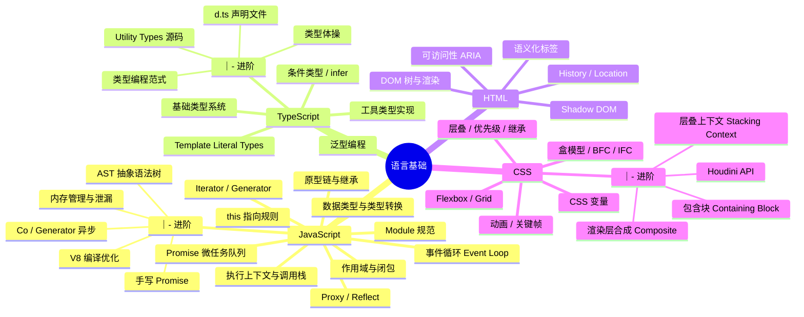


---


## 一、JavaScript 核心


### 1.1 JS 运行时原理


先把这三个最关键的概念理顺，后面所有细节都围绕它们展开：


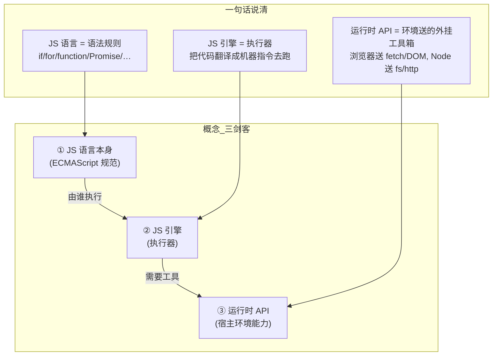


---


#### 1.1.1 先搞懂三者的关系 —— JS 语言 ≠ JS 引擎 ≠ 运行时 API


很多初学者把这三者混为一谈，但它们是**三个完全不同的东西**：


| 层次 | 是什么 | 类比（Java 后端） | 包含什么 |
|------|--------|------------------|---------|
| **JS 语言**（ECMAScript） | 语法规范 | 就像 Java 语言规范 | `if/for/function/class/=>` `/Promise/Map/Set` |
| **JS 引擎** | 执行器 | 就像 JVM（Java 虚拟机） | V8 / SpiderMonkey / JavaScriptCore |
| **运行时 API** | 环境给的工具箱 | 就像 JDK 的 `java.io` `java.net` | 浏览器给 Web API，Node 给系统 API |
**最关键的一句话：JS 语言本身只定义了语法，没有任何 I/O 能力。** 不能读写文件、不能发网络请求、不能操作 DOM——这些全是运行时 API 提供的。


---


#### 1.1.2 JS 引擎是什么 —— 它只做一件事：执行代码


引擎 = 一个把 JS 代码变成机器指令并执行的黑盒。


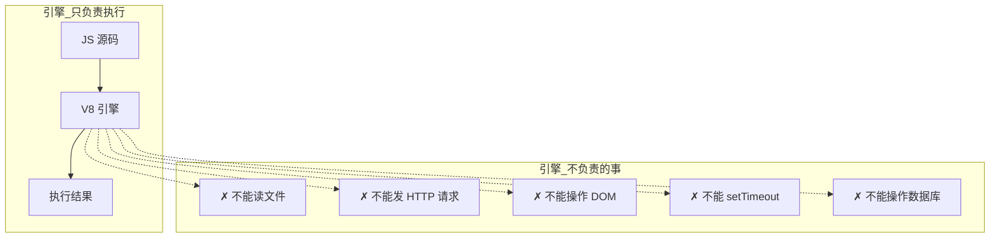


**引擎内部的工作流程：**


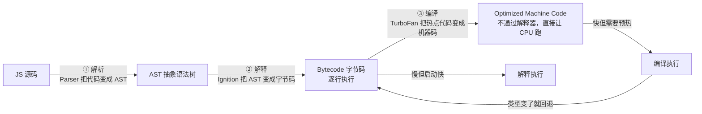


| 阶段 | 组件 | 做了什么事 | 一句话 |
|------|------|-----------|--------|
| ① 解析 | Parser | 源码 → AST | 把代码"读"成计算机能理解的树状结构 |
| ② 解释 | Ignition | AST → 字节码，逐条执行 | 不管优化，先跑起来再说 |
| ③ 编译 | TurboFan | 热点代码 → 优化机器码 | 发现某段代码反复执行，编译成最快的形式 |
| ④ 去优化 | — | 类型假设失败 → 退回字节码 | 猜错了就重来 |
**架构师启示：**

- 保持函数参数类型**稳定**（不要一会儿 string 一会儿 number）

- 保持对象结构**一致**（始终用相同的属性初始化顺序）

- **避免** `delete` 操作破坏隐藏类

- 热点代码才会被 JIT 优化，冷启动时性能取决于解析+解释速度


---


#### 1.1.3 运行时 API 是什么 —— 环境送的"外挂工具箱"


引擎只能执行代码，不能跟外部世界打交道。**运行时 API = 环境塞给 JS 的一个工具箱，让 JS 能操作外部世界。**


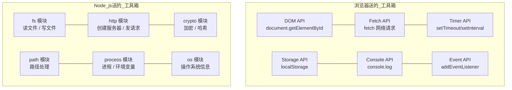


**这就是"运行时 API 来源"的意思：**

- **浏览器环境** → 送的是 **Web API**（W3C 标准定义的）

- **Node.js 环境** → 送的是 **系统 API**（通过 Libuv + C++ 绑定实现的）

- **Deno 环境** → 送的是 **Rust Tokio API**

- 不同环境送的"工具箱"不一样，所以同样的 JS 代码在浏览器和 Node 里能做的事不同


| 环境 | 引擎 | 运行时送的"工具箱" |
|------|------|------------------|
| 浏览器 | V8 / SpiderMonkey / JavaScriptCore | Web APIs（DOM / Fetch / setTimeout / Storage） |
| Node.js | V8 | Libuv + C++ 绑定（fs / http / crypto / path） |
| Deno | V8 | Rust Tokio（文件 / 网络 / 安全沙箱） |
| Bun | JavaScriptCore | Zig 原生绑定（文件 / 网络 / SQLite 内置） |
---


#### 1.1.4 整条链路串起来 —— 从代码到执行，一个请求的生命周期


用一段实际代码走完全程：


```javascript
// 你的 JS 代码
console.log('开始请求');
fetch('https://api.example.com/data')
  .then(res => res.json())
  .then(data => console.log(data));
console.log('请求已发出');
```


**它在运行时中是怎么流通的？**


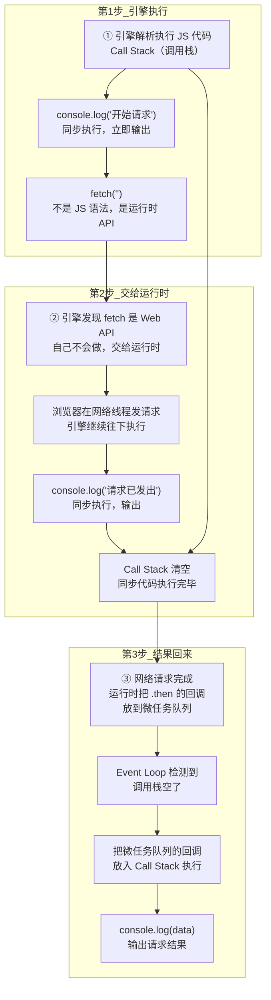


**关键理解：**


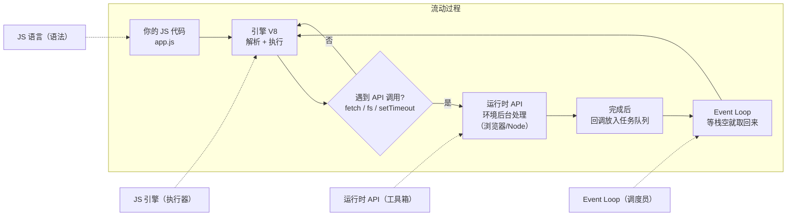


**用一句话把整个过程说清楚：**


> JS 引擎（V8）像一台只认识 JS 语法的**CPU**，负责执行代码。当代码调用 `fetch`/`fs`/`setTimeout` 等**运行时 API** 时，引擎就把这个任务交给宿主环境（浏览器/Node）在**后台线程**处理，自己继续往下跑。等后台处理完了，结果通过 **Event Loop** 排队送回引擎继续执行。


**类比后端：**


```
Java:    JVM 执行字节码  +  JDK 的 java.io/java.net 类库
JS:      V8 引擎执行代码  +  运行时 API（浏览器/Node 送的）
Java 的 JVM = JS 的 V8
Java 的 JDK 类库 = JS 的运行时 API
```


---


#### 1.1.5 执行上下文（EC）是什么 —— 每次函数调用的"工作记录"


每次调用一个函数，JS 引擎都会创建一张"工作记录"——**执行上下文（Execution Context，简称 EC）**。它记录了这次调用所需的所有信息。


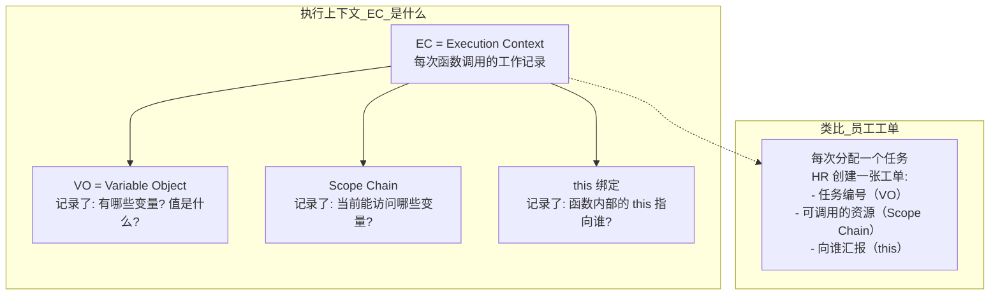


**三种执行上下文：**


| 类型 | 创建时机 | 数量 | 说明 |
|------|---------|------|------|
| **全局 EC** | 脚本加载时 | 且仅 1 个 | 整个脚本的"根"环境，存全局变量 |
| **函数 EC** | 每次调用函数 | 多个（调用几次创建几个） | 每次调用都是独立的，互不干扰 |
| **Eval EC** | 调用 `eval()` | 少用 | 不推荐，有安全风险 |
**EC 的创建分三步（发生在函数执行之前）：**


```
① 创建 Variable Object（变量对象）
   - 扫描函数内的所有声明
   - 函数声明 → 直接指向函数体（函数提升的原因）
   - var 声明 → 初始化为 undefined（变量提升的原因）
   - let/const → 不初始化（所以有"暂存死区"）
② 创建 Scope Chain（作用域链）
   - 当前 VO + 父级 VO + 祖父级 VO...
   - 这就是为什么内层函数能访问外层变量
③ 绑定 this
   - 根据"函数怎么被调用的"决定
   - obj.fn() → this = obj
   - fn() → this = undefined（严格模式）/ window（非严格）
   - new fn() → this = 新创建的空对象
```


#### 1.1.6 Call Stack 调用栈 —— 记录函数调用顺序的"栈"


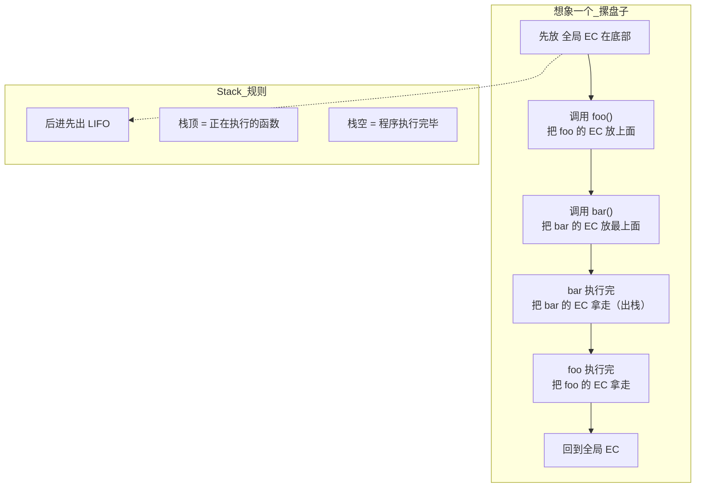


Call Stack（调用栈）= **当前正在执行的函数调用链**。它是一个遵循"后进先出"的栈结构。


```javascript
function bar() {console.log('bar');}   // 第三步: bar 入栈（栈顶）
function foo() {bar();}                // 第二步: foo 入栈
foo();                                  // 第一步: foo 入栈
                                        // 第四步: bar 出栈
                                        // 第五步: foo 出栈
```


**栈的直观理解：**

```
调用栈状态（从底到顶）：
第①步: [全局EC]
第②步: [全局EC, foo的EC]
第③步: [全局EC, foo的EC, bar的EC]  ← 正在执行 bar
第④步: [全局EC, foo的EC]            ← bar 完事了
第⑤步: [全局EC]                     ← foo 完事了
第⑥步: []                            ← 全部执行完毕
```


---


#### 1.1.7 宏任务 vs 微任务 —— 用"餐厅后厨"理解 Event Loop


先搞清楚这两个"任务队列"是做什么的，再看 Event Loop 就简单了。


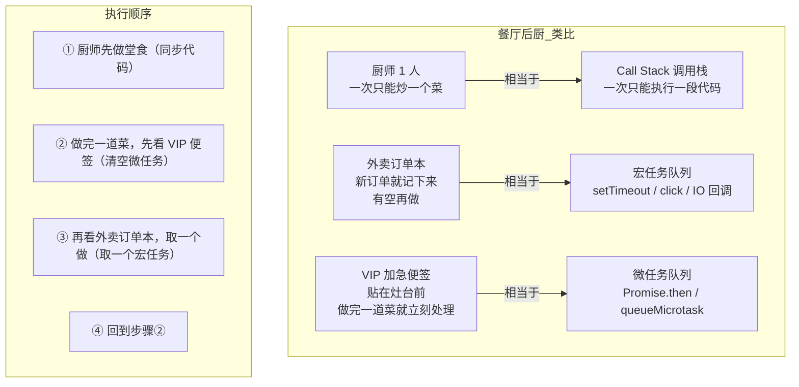


**微任务（Microtask）**：做完一件事后**立即**要处理的"加急"任务。

- `Promise.then` 的回调

- `queueMicrotask()` 注册的任务

- `MutationObserver` 的回调


**宏任务（Macrotask）**：排到队列里，等当前所有事处理完了**才轮到的**普通任务。

- `setTimeout` / `setInterval` 的回调

- 事件回调（click / load / input）

- I/O 回调（fetch / 文件读取）


**`setTimeout` 不是 `return`，也不是 `sleep`：**


```javascript
console.log('① 开始');
const timerId = setTimeout(() => {
  console.log('③ 1 秒后执行（宏任务）');
}, 1000);
console.log('② setTimeout 已返回，继续执行后面代码');
// 输出: ① → ② → （1 秒后）③
// setTimeout 只是"定个闹钟到点执行"→ 立马返回 timerId
// 后面的代码不会等，立即执行
// 对比 return：
function testReturn() {
  console.log('①');
  return;           // ← 函数在这里就结束了
  console.log('②'); // ← 永远不会执行（dead code）
}
```


| `setTimeout` | `return` |
|-------------|----------|
| 调度一个函数**将来**执行 | 函数**立刻**结束 |
| 后面的代码**继续执行** | 后面的代码**被跳过** |
| 返回 timerId（可用于取消） | 返回指定的值或 undefined |
| 不影响函数流程 | **终止**函数流程 |
所以这段代码里的 `setTimeout`：


```javascript
await new Promise(resolve => {
  setTimeout(() => resolve('数据'), 1000);
  // ← 这里可以写代码，会立刻执行
  console.log('setTimeout 后面还能执行');
});
// ← 这里被 await 暂停，等 resolve 后才执行
```


**核心区别一句话：**

```
微任务 → VIP 加急：当前代码执行完就处理，不等待，全部清空
宏任务 → 普通订单：排到队尾，一次只取一个，其他人还要排队
```


---


#### 1.1.8 Event Loop 详解 —— 事件循环怎么"循环"


现在你已经知道微任务和宏任务是什么了。Event Loop 就是那个在中间协调的**调度员**，决定"先执行哪个任务"。


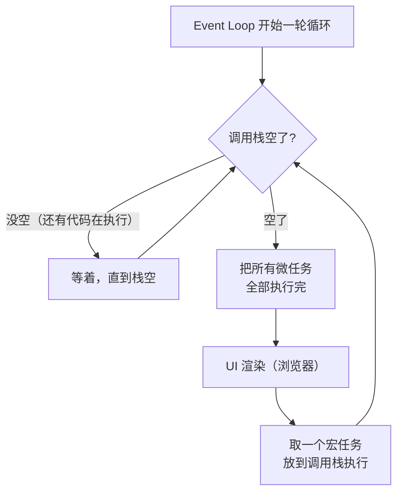


**用文字描述一遍：**

```
① 先看看调用栈空了吗？没空就等着
② 空了 → 把所有微任务队列里的回调全部执行完（一个不留）
③ 有必要的话渲染一下 UI
④ 从宏任务队列里取一个任务执行
⑤ 回到第①步，又开始新一轮
```


**对比餐厅后厨就懂了：**

```
① 厨师做完一道菜（同步代码执行完）
② 看灶台前的 VIP 便签（微任务）→ 全部处理掉
③ 收拾一下台面（UI 渲染）
④ 看外卖订单本（宏任务）→ 取一张做
⑤ 做完又看 VIP 便签 → 循环...
```


**经典面试题——每行代码执行时，两个队列里有什么？**


```javascript
console.log(1);
setTimeout(() => console.log(2), 0);
Promise.resolve().then(() => { 
  console.log(3);
  setTimeout(() => console.log(4), 0);
});
Promise.resolve().then(() => console.log(5));
console.log(6);
```


**逐行走着瞧，看两个队列的变化：**


```
┌──────────────────────────────────────────────────────────────────┐
│ 第 1 行: console.log(1)                                          │
│   调用栈: [console.log(1)] → 输出 1 → 出栈                        │
│   微任务: []                                                      │
│   宏任务: []                                                      │
├──────────────────────────────────────────────────────────────────┤
│ 第 2 行: setTimeout(() => console.log(2), 0)                     │
│   调用栈: [setTimeout] → 调度一个"0 秒后"的宏任务 → 出栈          │
│   微任务: []                                                      │
│   宏任务: [console.log(2)]   ← setTimeout 的回放进来了             │
├──────────────────────────────────────────────────────────────────┤
│ 第 3 行: Promise.resolve().then(() => { console.log(3); ... })   │
│   调用栈: [Promise.resolve → .then()] → 注册一个微任务 → 出栈     │
│   微任务: [() => { console.log(3); setTimeout(console.log(4)) }] │
│   宏任务: [console.log(2)]                                        │
├──────────────────────────────────────────────────────────────────┤
│ 第 4 行: Promise.resolve().then(() => console.log(5))            │
│   调用栈: [Promise.resolve → .then()] → 注册一个微任务 → 出栈     │
│   微任务: [ (3 的回调),  (5 的回调) ]   ← 两个微任务排队了       │
│   宏任务: [console.log(2)]                                        │
├──────────────────────────────────────────────────────────────────┤
│ 第 5 行: console.log(6)                                          │
│   调用栈: [console.log(6)] → 输出 6 → 出栈                        │
│   微任务: [ (3 的回调),  (5 的回调) ]                              │
│   宏任务: [console.log(2)]                                        │
├──────────────────────────────────────────────────────────────────┤
│ → 调用栈空了 → Event Loop 开始工作                                 │
│   第①步: 清空微任务队列!                                          │
│      执行 (3 的回调): 输出 3, 又注册了一个 setTimeout             │
│        微任务: [ (5 的回调) ]                                     │
│        宏任务: [console.log(2), console.log(4)]  ← 又加了一个    │
│      执行 (5 的回调): 输出 5                                     │
│        微任务: []  ← 清空了                                      │
│                                                                  │
│   第②步: UI 渲染（略）                                            │
│                                                                  │
│   第③步: 取一个宏任务执行                                          │
│      执行 console.log(2): 输出 2                                  │
│        微任务: []                                                 │
│        宏任务: [console.log(4)]                                   │
│                                                                  │
│   回到第①步: 清空微任务（空的）                                     │
│   第②步: UI 渲染                                                  │
│   第③步: 取一个宏任务 → 执行 console.log(4): 输出 4               │
│        宏任务: []  ← 全部清空                                     │
└──────────────────────────────────────────────────────────────────┘
结果: 1 → 6 → 3 → 5 → 2 → 4
```


#### 1.1.9 牢记一条铁律：`new Promise(executor)` 的 `executor` 永远同步执行


不管外面套了多少层 `await`，`new Promise(fn)` 调用时，`fn` 都是**立即同步执行**的：


```javascript
// 没有 await
const p = new Promise(r => { console.log('① 同步'); r(); });
console.log('②');                          // ① → ②
// 有 await
await new Promise(r => { console.log('① 同步'); r(); });
console.log('②');                          // ① → ② 还是先①后②！
// 嵌套 await 也一样
async function test() {
  const data = await new Promise(r => {
    console.log('① executor 同步执行');
    r('done');
  });
  console.log('③ 这里才是微任务');
}
test();
console.log('②');                          // ① → ② → ③
// executor(①) 不管 await，直接同步执行
// await 只把③推迟
```


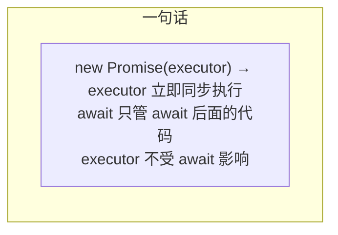


**加入 async/await——带两个队列看执行过程：**


```javascript
async function fetchData() {
  console.log('② fetchData 开始');
  const data = await new Promise(resolve => {
    console.log('③ executor 同步执行');
    setTimeout(() => {
      console.log('⑤ 1 秒后（宏任务）');
      resolve('用户数据');
    }, 1000);
  });
  console.log('⑥ 拿到数据:', data);
  return data;
}
async function main() {
  console.log('① main 开始');
  const result = await fetchData();
  console.log('⑦ main 拿到:', result);
}
main();
console.log('④ main 调用完，继续');
```


```
┌────────────────────────────────────────────────────────────────────┐
│ 调用 main()                                                       │
│   调用栈: [main]                                                   │
│   ① console.log('① main 开始') → 输出                             │
│                                                                   │
│   main 遇到 await fetchData()                                      │
│     执行 fetchData()（同步！）                                     │
│       调用栈: [main, fetchData]                                    │
│       ② console.log('② fetchData 开始') → 输出                    │
│                                                                   │
│       fetchData 遇到 await new Promise(...)                        │
│         执行 new Promise 的 executor（同步！）                     │
│           ③ console.log('③ executor 同步执行') → 输出             │
│           调度 setTimeout（1000ms 后进宏任务队列）                 │
│             宏任务: [ (将来: setTimeout 回调) ]                    │
│           executor 执行完，new Promise 返回 Promise<pending>       │
│                                                                   │
│       await 把 fetchData 剩余代码包成 .then() 回调                  │
│         注册到 Promise 上，等 resolve 后才进微任务队列              │
│         微任务: []   ← 还没进去！                                  │
│       fetchData 暂停，出栈                                         │
│       调用栈: [main]                                               │
│                                                                   │
│   fetchData 返回 Promise<pending>                                  │
│   main 的 await 也把剩余代码包成 .then() 回调                      │
│     注册到 fetchData 返回的 Promise 上                              │
│     微任务: []   ← 两个回调都注册了，但都没进队列                   │
│   main 暂停，出栈                                                  │
│   调用栈: []  ← 空了                                               │
│                                                                   │
│   ④ console.log('④ main 调用完，继续') → 输出                     │
│   调用栈空了                                                       │
│                                                                    │
│ ─── 1 秒后 ───                                                     │
│ setTimeout 回调 → 进入宏任务队列                                    │
│   宏任务: [setTimeout 回调]                                         │
│                                                                    │
│ → Event Loop: 调用栈空                                             │
│   ① 清空微任务: []   ← 空的，因为 Promise 还没 resolve             │
│   ② 取一个宏任务: 执行 setTimeout 回调                              │
│      ⑤ console.log('⑤ 1 秒后') → 输出                              │
│      resolve('用户数据')                                            │
│      → resolve 把之前注册的 .then() 回调放进微任务队列              │
│        微任务: [ (⑥), (⑦) ]  ← 现在才真正进队列！                 │
│                                                                   │
│   ① 清空微任务:                                                   │
│      执行 ⑥: console.log('⑥ 拿到数据: 用户数据') → 输出           │
│      执行 ⑦: console.log('⑦ main 拿到: 用户数据') → 输出          │
│      微任务: []                                                    │
│   ② 取一个宏任务（没有）                                          │
└────────────────────────────────────────────────────────────────────┘
结果: ① → ② → ③ → ④ → (1 秒后) ⑤ → ⑥ → ⑦
```


**await 不加 await——用同一段代码切换一个关键字，看输出差异：**


```javascript
// 同一个 async 函数
async function getData() {
  console.log('  [getData] 开始');
  const r = await new Promise(resolve => {
    console.log('  [getData] executor 同步');
    setTimeout(() => resolve('数据'), 1000);
  });
  console.log('  [getData] 拿到:', r);
  return r;
}
```


```javascript
// ───── 不加 await ─────                                       // 输出顺序:
async function testNoAwait() {
  console.log('① 准备调用');
  const promise = getData();          // getData 同步执行到 await 暂停
  console.log('② getData 返回了 Promise');                     // ① → ② → (1秒后) [getData]
  console.log('③ 不等结果，继续执行');
  const result = await promise;       // 手动等结果
  console.log('④ 拿到结果:', result);                          // ④
}
testNoAwait();
console.log('⑤ 调用结束');
// 输出：
// ① 准备调用
//   [getData] 开始
//   [getData] executor 同步
// ② getData 返回了 Promise
// ③ 不等结果，继续执行
// ⑤ 调用结束
//   [getData] 拿到: 数据    ← 1 秒后
// ④ 拿到结果: 数据
```


```javascript
// ───── 加 await ─────                                         // 输出顺序:
async function testAwait() {
  console.log('① 准备调用');
  const result = await getData();      // getData 同步执行到 await 暂停
  console.log('② 拿到结果:', result);                          // ① → [getData] → (1秒后) [getData]拿到 → ②
  console.log('③ 继续执行');
}
testAwait();
console.log('④ 调用结束');
// 输出：
// ① 准备调用
//   [getData] 开始
//   [getData] executor 同步
// ④ 调用结束   ← 注意！④ 在 ② 之前！因为 testAwait 被 await 暂停了
//               然后 ④ 才输出（调用栈空了）
//   [getData] 拿到: 数据    ← 1 秒后
// ② 拿到结果: 数据
// ③ 继续执行
```


**唯一区别就是 `②` 的出现时间：**


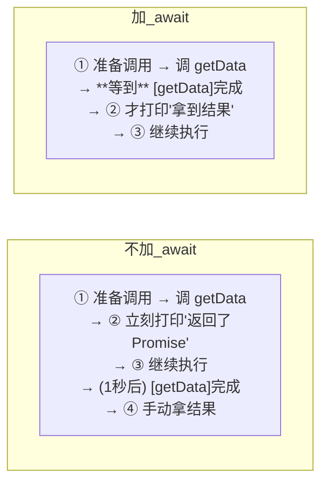


| | 不加 await | 加 await |
|--|-----------|---------|
| getData 内部怎么跑？ | **一样**。同步执行到 await 暂停，1 秒后恢复 | **一样**。同步执行到 await 暂停，1 秒后恢复 |
| ② 什么时候打印？ | **立刻**（不等 getData） | 1 秒后（等 getData 完成） |
| 调用者能不能继续？ | ✅ 能（③ 立刻输出） | ❌ 暂停了（③ 等 1 秒） |
| 什么时候拿结果？ | 自己 `await promise` | `await getData()` 直接拿到 |
**三句话：**


```
getData()     → getData 开始跑 → 你接着干别的事 → 回头再拿结果
await getData() → getData 开始跑 → 你等着 → 拿到结果 → 再干别的事
```


**不同场景怎么选：**


| 场景 | 做法 | 理由 |
|------|------|------|
| 需要结果才能继续 | **加 await** | 代码像同步一样写，可读性好 |
| 触发后不关心结果 | **不加 await** | 不阻塞，后续代码继续执行 |
| 同时发多个请求 | **不加 await 先都触发，然后用 Promise.all** | 请求并行，不等一个完成再发下一个 |
| 事件回调里调用 async 函数 | **不加 await + 加 catch** | 事件不处理 Promise 的 reject |
---


#### 1.1.10 运行时全景串联 —— 从代码到执行完整走一遍


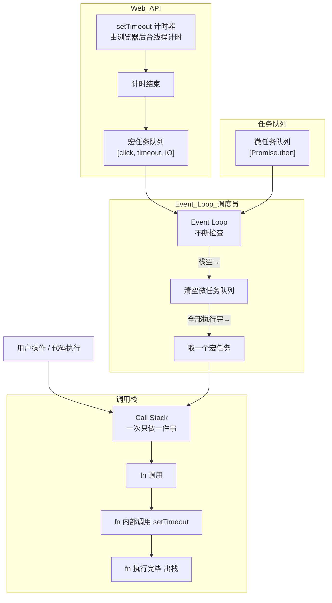


---


#### 1.1.11 最终总结：JS 运行时完整关系图


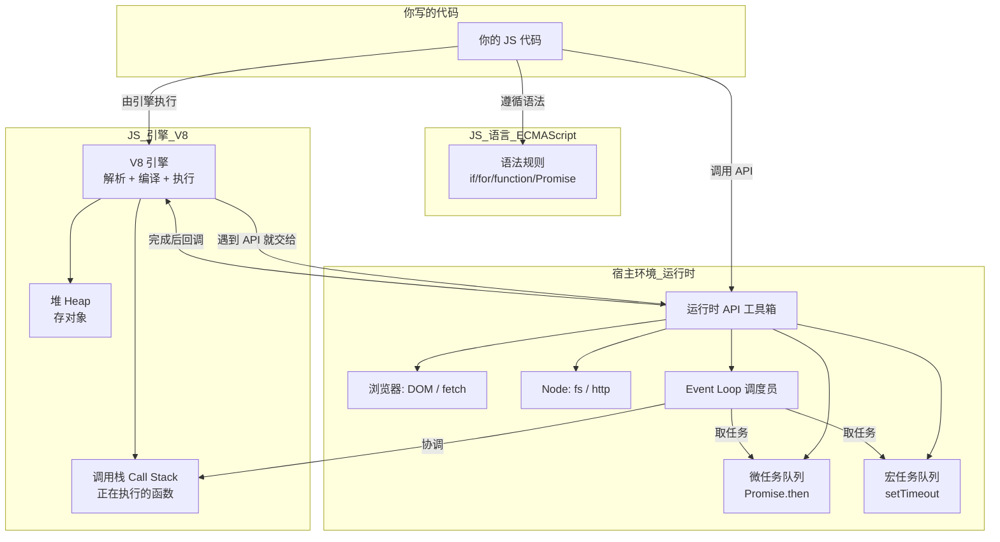


> **全文总结：** 你写的是 **JS 代码** → **V8 引擎**负责解析和执行 → 遇到 `fetch`/`fs`/`setTimeout` 等**运行时 API**，引擎交给宿主环境后台处理 → 完成后回调放入**任务队列** → **Event Loop** 等调用栈空了就把回调取回来执行。引擎只管执行代码，剩下的全是运行时提供的能力。


---


### 1.2 JS 脚本从编写到运行


#### 1.2.1 编写脚本 → 运行的完整链路


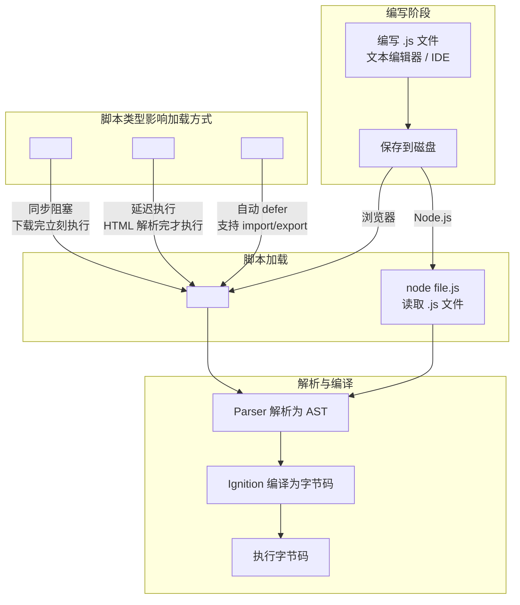


#### 1.2.2 浏览器中脚本加载的三种方式


```mermaid
graph TB
    subgraph 普通脚本
        N1["<script src='a.js'>"]
        N1 --> N2[HTML 解析暂停]
        N2 --> N3[下载 a.js]
        N3 --> N4[执行 a.js]
        N4 --> N5[HTML 继续解析]
    end
    subgraph defer 脚本
        D1["<script defer src='a.js'>"]
        D1 --> D2[HTML 解析继续]
        D2 --> D3[并行下载 a.js]
        D3 --> D4[HTML 解析完毕]
        D4 --> D5[执行 a.js]
    end
    subgraph module 脚本
        M1["<script type='module' src='a.js'>"]
        M1 --> M2[HTML 解析继续]
        M2 --> M3[并行下载 a.js]
        M3 --> M4[下载依赖模块]
        M4 --> M5[HTML 解析完毕]
        M5 --> M6[执行 a.js + 依赖]
    end
```


| 方式 | 加载 | 执行时机 | 顺序保证 | 适用场景 |
|------|------|---------|---------|---------|
| **普通 `<script>`** | 同步阻塞 | 下载完立即执行 | 按出现顺序 | 少量同步代码 |
| **`<script defer>`** | 并行下载 | HTML 解析完后 | 按出现顺序 | 操作 DOM 的脚本 |
| **`<script async>`** | 并行下载 | 下载完立即执行 | 不保证顺序 | 独立分析脚本 |
| **`<script type="module">`** | 并行下载 | HTML 解析完后 | 按依赖关系 | 现代 ESM 应用 |
#### 1.2.3 Node.js 中脚本的运行方式


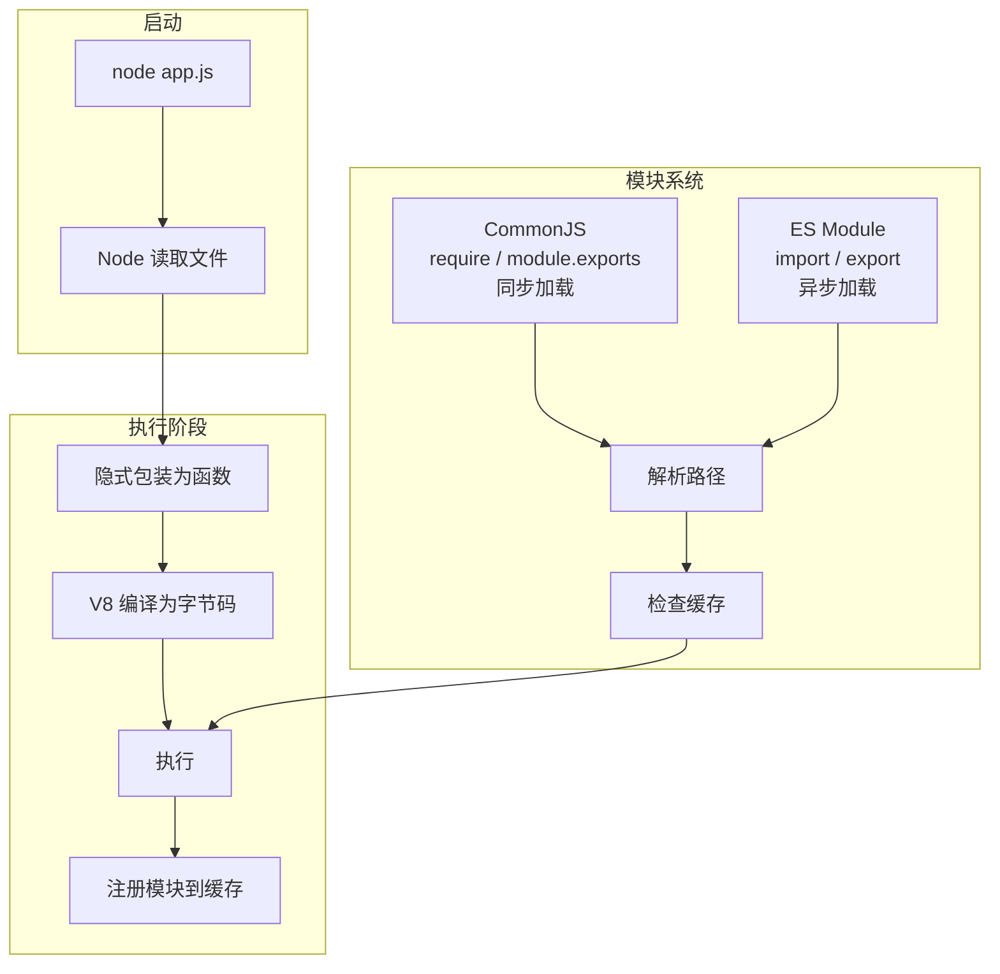


| 概念 | CommonJS (CJS) | ES Module (ESM) |
|------|---------------|-----------------|
| 语法 | `require('./a')` | `import './a'` |
| 加载方式 | 同步 | 异步 |
| 运行时解析 | 是（动态） | 否（静态分析） |
| Tree Shaking | 不支持 | 支持 |
| Node 识别 | `.js` 默认 | `package.json` 中 `"type": "module"` 或 `.mjs` |
#### 1.2.4 从源码到运行的全流程（最简模型）


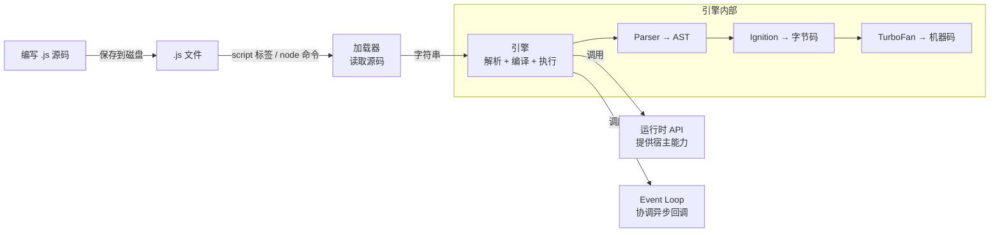


> **一句话：** `.js` 文件只是文本 → 加载器把文本读进来 → 引擎把文本变成字节码/机器码 → 运行时提供额外能力 → Event Loop 让异步不阻塞。


---


### 1.3 数据类型体系


#### 1.3.1 最核心的区别：存值 vs 存地址


JS 的数据类型只分两大类，理解这个就懂了 80%：


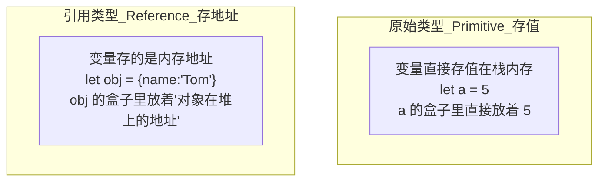


**用后端语言类比：**


| | JS | Java | C# |
|--|----|------|-----|
| 原始类型 | `number`, `string`, `boolean`, `null`, `undefined`, `symbol`, `bigint` | `int`, `double`, `boolean`, `char` | `int`, `double`, `bool`, `char` |
| 引用类型 | `Object`, `Array`, `Function`, `Date`, `Map`, `Set` | 所有 `class` 和 `interface` | 所有 `class` 和 `interface` |
| 赋值行为 | 原始类型=复制值；引用类型=复制地址 | 同 JS | 同 JS |
| 对比方式 | 原始类型用 `===` 比值；引用类型比的是地址 | `==` 比值，`.equals()` 比内容 | `==` 比值（有重载），`Equals()` 比内容 |
**实际代码看看区别：**


```javascript
// 原始类型：let b = a 是"复制值"，互不影响
let a = 5;
let b = a;
b = 10;
console.log(a); // 5  ← a 没变
// 引用类型：let b = a 是"复制地址"，指向同一个对象
let obj1 = { name: 'Tom' };
let obj2 = obj1;
obj2.name = 'Jerry';
console.log(obj1.name); // 'Jerry'  ← obj1 也变了，因为指向同一个对象
```


#### 1.3.2 7 种原始类型


```mermaid
graph LR
    subgraph 原始类型总览
        U["undefined<br/>未定义"] --> N["null<br/>主动置空"]
        N --> B["boolean<br/>true / false"]
        B --> NUM["number<br/>IEEE 754 双精度"]
        NUM --> S["string<br/>UTF-16"]
        S --> SYM["symbol<br/>唯一键"]
        SYM --> BI["bigint<br/>超大整数"]
    end
    subgraph 关键区分
        D1["undefined vs null<br/>undefined = 还没给值<br/>null = 主动设空"]
        D2["number vs bigint<br/>number = 小数 + 整数<br/>bigint = 任意大整数"]
        D3["symbol 唯一性<br/>Symbol('a') !== Symbol('a')<br/>每次调用都创建新值"]
    end
```


| 类型 | 存什么 | 特殊之处 |
|------|-------|---------|
| **undefined** | 未定义 | 声明了没赋值就是它；函数没 return 也是它 |
| **null** | 主动置空 | `typeof null === 'object'` — 这是 JS 的 Bug，别记错 |
| **boolean** | `true` / `false` | 很多值可以转 boolean：`!!0 === false`, `!!'str' === true` |
| **number** | IEEE 754 双精度浮点数 | `0.1 + 0.2 !== 0.3`；最大值 `Number.MAX_VALUE` |
| **string** | UTF-16 编码的字符序列 | 不可变！`str[0] = 'x'` 改不了，必须重新赋值 |
| **symbol** | 唯一的、不可变的值 | 每次 `Symbol()` 都不同；适合做对象属性键，防止命名冲突 |
| **bigint** | 任意精度的整数 | `n` 后缀：`9007199254740993n`；不能和 number 混算 |

**Symbol 到底是干什么的？——一个绝对不会重复的"钥匙"**

```javascript
// Symbol 每次调用都创建一个全新的、独一无二的值
const s1 = Symbol();
const s2 = Symbol();
console.log(s1 === s2);  // false ← 每次都是不同的

// 可以加个描述（只是为了调试时看得懂，不影响唯一性）
const s3 = Symbol('user_id');
const s4 = Symbol('user_id');
console.log(s3 === s4);  // false ← 描述相同，但值不同
```

**Symbol 唯一的实际用途：做对象的属性键，防止命名冲突。**

```javascript
// 问题场景：两个不同的库都想在同一个对象上存数据
// 如果都用字符串键，可能冲突：

const user = { name: 'Tom' };

// 插件 A 在 user 上存一个标记
user.id = 'A-123';

// 插件 B 也在 user 上存一个标记（同名，冲突了！）
user.id = 'B-456';
console.log(user.id);  // 'B-456'  ← A 的数据被覆盖了

// Symbol 解决：用 Symbol 做键，永远不会冲突
const pluginA_id = Symbol('pluginA');
const pluginB_id = Symbol('pluginB');

user[pluginA_id] = 'A-123';
user[pluginB_id] = 'B-456';

console.log(user[pluginA_id]);  // 'A-123' ← 没被覆盖！
console.log(user[pluginB_id]);  // 'B-456'

// Symbol 键不会被普通遍历看到
for (let key in user) console.log(key);  // 'name' ← Symbol 键不出现
Object.keys(user);          // ['name']
Object.getOwnPropertySymbols(user);  // [Symbol(pluginA), Symbol(pluginB)]
```

**Symbol 的另一个作用：实现JS 内置的"标记"接口**

```javascript
// JS 内部用了一些内置的 Symbol 来实现语言特性
// 比如让一个对象支持 for...of 遍历：

const myCollection = {
  items: [1, 2, 3],
  [Symbol.iterator]() {   // Symbol.iterator 是 JS 内置的 Symbol
    let i = 0;
    return {
      next: () => ({ value: this.items[i++], done: i > this.items.length })
    };
  }
};

for (const item of myCollection) {
  console.log(item);  // 1, 2, 3
}
```

**日常开发用不到 Symbol，但理解它就行：**
- Symbol = 一个**绝不会重复**的值
- 主要用途：**做对象属性键，防止不同模块/库之间的命名冲突**
- 内置 Symbol（`Symbol.iterator` 等）是 JS 语言底层用的，理解概念即可


引用类型就是 **Object 以及所有继承自 Object 的类型**。它们的值存在堆内存中，变量只存个地址。


```mermaid
graph TB
    subgraph 引用类型家族树
        O[Object] --> A["Array<br/>有序列表"]
        O --> F["Function<br/>可调用"]
        O --> D["Date<br/>日期时间"]
        O --> R["RegExp<br/>正则表达式"]
        O --> M["Map / Set<br/>ES6 集合"]
        O --> WM["WeakMap / WeakSet<br/>弱引用集合"]
    end
    subgraph 关键概念
        C1["变量存的不是对象本身<br/>是对象的'门牌号'（内存地址）"]
        C2["let a = {}<br/>let b = a<br/>a === b 为 true<br/>因为指向同一个门牌号"]
        C3["{} === {} 为 false<br/>因为两个对象的门牌号不同"]
    end
```


#### 1.3.4 引用类型使用示例


##### Object——最常用的"字典"


```javascript
// 创建
const user = {
  name: 'Tom',
  age: 25,
  'full-name': 'Tom Smith',    // 键名含特殊字符要加引号
};
// 读写
user.name;              // 'Tom'          点号访问
user['full-name'];      // 'Tom Smith'    方括号访问
user.age = 26;          // 修改
user.email = 't@m.com'; // 新增属性
// 删除
delete user.age;        // 删除 age 属性
// 遍历
Object.keys(user);      // ['name', 'full-name', 'email']
Object.values(user);    // ['Tom', 'Tom Smith', 't@m.com']
Object.entries(user);   // [['name','Tom'], ['full-name','Tom Smith'], ...]
// 合并
const a = { x: 1, y: 2 };
const b = { y: 3, z: 4 };
const merged = { ...a, ...b };   // { x: 1, y: 3, z: 4 }  后者覆盖前者
Object.assign({}, a, b);         // 同上
```


| 操作 | 语法 | 说明 |
|------|------|------|
| 可选链 | `user?.address?.city` | 中间任何一层是 null/undefined 就返回 undefined，不报错 |
| 空值合并 | `user.name ?? '默认名'` | 仅在左边是 null/undefined 时才取右边 |
| 解构 | `const { name, age } = user` | 从对象中提取属性为变量 |
| 重命名 | `const { name: userName } = user` | 解构时改名 |
| 默认值 | `const { age = 18 } = user` | 解构时给默认值 |
##### Array——"增强版"列表


```javascript
// 创建
const arr = [1, 2, 3, 4, 5];
const arr2 = new Array(5);        // 长度为 5 的空数组
const arr3 = Array.from('hello'); // ['h','e','l','l','o']
// 增删改
arr.push(6);         // 尾部添加 → [1,2,3,4,5,6]
arr.pop();           // 尾部删除 → [1,2,3,4,5]
arr.unshift(0);      // 头部添加 → [0,1,2,3,4,5]
arr.shift();         // 头部删除 → [1,2,3,4,5]
arr.splice(2, 1);    // 从索引 2 开始删 1 个 → [1,2,4,5]
arr.splice(2, 0, 3); // 在索引 2 插入 3 → [1,2,3,4,5]
// 查找
arr.indexOf(3);      // 2  找到返回索引，找不到返回 -1
arr.includes(3);     // true
arr.find(x => x > 3);  // 4  返回第一个满足条件的元素
arr.findIndex(x => x > 3); // 3  返回索引
// 遍历（重点！）
arr.forEach(x => console.log(x));     // 遍历，无返回值
const doubled = arr.map(x => x * 2);  // [2,4,6,8,10]  映射成新数组
const evens = arr.filter(x => x % 2 === 0);  // [2,4]  过滤
const sum = arr.reduce((a, b) => a + b, 0);  // 15  累加
const found = arr.some(x => x > 4);  // true  有一个满足就返回 true
const all = arr.every(x => x > 0);   // true  全部满足才返回 true
// 排序（注意！排序会修改原数组）
const sorted = [...arr].sort();       // 先复制再排序，不改原数组
arr.sort((a, b) => a - b);           // 数字升序
arr.sort((a, b) => b - a);           // 数字降序
```


| 方法 | 是否改原数组 | 返回值 | 什么时候用 |
|------|-------------|--------|-----------|
| `push / pop` | ✅ 改 | 新长度 / 删掉的元素 | 栈操作（后进先出） |
| `shift / unshift` | ✅ 改 | 删掉的元素 / 新长度 | 队列操作（先进先出） |
| `splice` | ✅ 改 | 删掉的元素 | 任意位置增删 |
| `map / filter` | ❌ 不改 | 新数组 | **最常用**，数据转换 |
| `reduce` | ❌ 不改 | 任意类型 | 聚合计算（求和、分组） |
| `sort` | ✅ 改 | 原数组引用 | **先复制再排序** |
| `slice` | ❌ 不改 | 新数组 | 截取子数组 |
##### Function——JS 中的"一等公民"


```javascript
// 四种定义方式
function add(a, b) { return a + b; }         // 函数声明（有提升）
const sub = function(a, b) { return a - b; } // 函数表达式（无提升）
const mul = (a, b) => a * b;                 // 箭头函数
const div = new Function('a', 'b', 'return a / b'); // 不推荐
// 函数也是对象——可以挂属性
function greet(name) { return `Hello ${name}`; }
greet.version = '1.0';       // 函数上挂属性（不常见但合法）
greet.toString();            // 返回函数源码字符串
// arguments（箭头函数没有）
function sumAll() {
  // arguments 是所有传入参数的类数组对象
  return Array.from(arguments).reduce((a, b) => a + b, 0);
}
sumAll(1, 2, 3);  // 6
// 高阶函数——函数作为参数或返回值
function makeCounter() {
  let count = 0;
  return function() {    // 返回另一个函数（闭包）
    return ++count;
  };
}
const counter = makeCounter();
counter();  // 1
counter();  // 2
```


##### Map / Set——ES6 的"升级版"集合


```javascript
// Map：键可以是任意类型（Object 的键只能是 string/symbol）
const map = new Map();
map.set('name', 'Tom');
map.set(42, 'answer');          // number 作为键
map.set({id:1}, 'object');      // 对象作为键
map.get('name');                // 'Tom'
map.has(42);                    // true
map.delete(42);
map.size;                       // 2
map.clear();                    // 全清空
// Set：值唯一，不会重复
const set = new Set([1, 2, 2, 3, 3, 3]);  // Set { 1, 2, 3 }
set.add(4);
set.has(2);                     // true
set.delete(1);
set.size;                       // 3
// 实际应用：数组去重
const unique = [...new Set([1, 2, 2, 3, 3, 3])];  // [1, 2, 3]
```


| 场景 | 用 Object | 用 Map |
|------|----------|-------|
| 键是字符串 | ✅ | 也行 |
| 键不是字符串（number/object） | ❌ 会转成 string | ✅ |
| 需要遍历顺序 | ❌ 不保证 | ✅ 按插入顺序 |
| 频繁增删键值对 | 一般 | ✅ 性能更好 |
| JSON 序列化 | ✅ 原生支持 | ❌ 需手动转换 |
##### Date——日期时间


```javascript
// 创建
const now = new Date();                    // 当前时间
const d1 = new Date('2024-01-15');         // 字符串解析
const d2 = new Date(2024, 0, 15);          // 月从 0 开始！0=1月
const d3 = new Date(1705305600000);        // 时间戳（毫秒）
// 读写
d1.getFullYear();       // 2024
d1.getMonth();          // 0（0=1月, 11=12月）
d1.getDate();           // 15
d1.getDay();            // 1（0=周日, 1=周一）
d1.getHours();
d1.getTime();           // 时间戳
// 常用工具函数
function formatDate(date) {
  const y = date.getFullYear();
  const m = String(date.getMonth() + 1).padStart(2, '0');
  const d = String(date.getDate()).padStart(2, '0');
  return `${y}-${m}-${d}`;                // '2024-01-15'
}
function daysBetween(a, b) {
  const ms = Math.abs(a.getTime() - b.getTime());
  return Math.floor(ms / (1000 * 60 * 60 * 24));
}
```


> 生产环境日期处理推荐用 **dayjs** 或 **date-fns** 库。原生 Date API 设计糟糕，月从 0 开始、时区处理麻烦、不可变性问题多。


##### 引用类型赋值陷阱——面试常考


```javascript
// 陷阱 1：复制对象只是复制了地址
const a = { name: 'Tom' };
const b = a;          // b 拿到的是 a 的"门牌号"
b.name = 'Jerry';
console.log(a.name);  // 'Jerry'  ← 因为 a 和 b 指向同一个对象
// 正确复制（浅拷贝）
const b1 = { ...a };          // 展开运算符
const b2 = Object.assign({}, a);
// 陷阱 2：浅拷贝只拷贝第一层
const obj = { name: 'Tom', address: { city: 'Beijing' } };
const copy = { ...obj };
copy.address.city = 'Shanghai';
console.log(obj.address.city);  // 'Shanghai'  ← 内层对象还是同一个！
// 深拷贝（三种方式）
const deep1 = JSON.parse(JSON.stringify(obj));   // 简单但会丢失 undefined / function / symbol
const deep2 = structuredClone(obj);             // 现代浏览器内置 API
// 第三方: import { cloneDeep } from 'lodash';
// 陷阱 3：函数参数传引用
function setName(obj) {
  obj.name = 'Jerry';
}
const user = { name: 'Tom' };
setName(user);
console.log(user.name);  // 'Jerry'  ← 函数内部改了外部对象
```


#### 1.3.5 类型检测——怎么判断一个值是什么类型


##### typeof —— 返回一个表示类型的**字符串**


是，`typeof` 返回的就是一个**简单字符串**，且只有 8 种可能的值：


```javascript
typeof 1;             // "number"
typeof 'a';           // "string"
typeof true;          // "boolean"
typeof undefined;     // "undefined"
typeof 123n;          // "bigint"
typeof Symbol();      // "symbol"
typeof function(){};  // "function"
typeof {};            // "object"
typeof [];            // "object"
typeof null;          // "object"   ← 这是 JS 的 Bug！
typeof NaN;           // "number"   ← NaN 的类型是 number
// 那"类型本身"是什么呢？—— typeof 类型名（构造函数）
typeof Number;        // "function"  ← Number 本身是构造函数，不是 "number"
typeof String;        // "function"
typeof Boolean;       // "function"
typeof Object;        // "function"
typeof Array;         // "function"
typeof Function;      // "function"
typeof Symbol;        // "function"
typeof BigInt;        // "function"
// 注意：typeof 类型名（构造函数）始终返回 "function"
// 跟 typeof 该类型的值（typeof 123 → "number"）完全不同
```

**只看这一张表就够了：**


```mermaid
graph TB
    subgraph typeof_返回值清单_全是小写字符串
        R1["typeof 值 → 返回字符串"]
        R2["数字 / NaN → 'number'"]
        R3["字符串 → 'string'"]
        R4["布尔值 → 'boolean'"]
        R5["undefined → 'undefined'"]
        R6["BigInt → 'bigint'"]
        R7["Symbol → 'symbol'"]
        R8["函数 → 'function'"]
        R9["对象 / 数组 / null → 'object'  ← 陷阱"]
    end
```


**两个必记陷阱：**

```javascript
typeof null === 'object'   // true  → 判断 null 必须用 x === null
typeof NaN  === 'number'   // true  → 判断 NaN 必须用 Number.isNaN(x)
```


##### 其他检测方式


```mermaid
graph TB
    subgraph 4种方式怎么选
        T1["typeof<br/>判断原始类型<br/>除了 null 以外都准"]
        T2["instanceof<br/>判断引用类型的具体种类<br/>[] instanceof Array → true"]
        T3["Object.prototype.toString.call()<br/>最精准，所有类型通杀<br/>返回 '[object Array]' / '[object Date]'"]
        T4["Array.isArray()<br/>判断数组的唯一可靠方式"]
    end
    subgraph 速查表
        S1["typeof 1 → 'number'"]
        S2["typeof 'a' → 'string'"]
        S3["typeof true → 'boolean'"]
        S4["typeof undefined → 'undefined'"]
        S5["typeof null → 'object'  ← 别用 typeof 判断 null"]
        S6["typeof [] → 'object'"]
        S7["Array.isArray([]) → true"]
        S8["[] instanceof Array → true"]
        S9["Object.prototype.toString.call([]) → '[object Array]'"]
    end
```


#### 1.3.6 类型转换——JS 最坑的地方


```mermaid
graph TB
    subgraph 黄金法则
        GOLD["始终用 严格等于<br/>不要用 双等号"]
        subgraph 隐式转换_自动发生
            I1["if('str') → true<br/>'' → false"]
            I2["1 + '2' → '12'<br/>number 转 string"]
            I3["'5' - 3 → 2<br/>string 转 number"]
            I4["+'123' → 123<br/>一元 + 转 number"]
        end
        subgraph 显式转换_手动
            E1["String(123) → '123'"]
            E2["Number('123') → 123"]
            E3["Boolean(1) → true"]
            E4["parseInt('123px') → 123"]
        end
    end
    GOLD --> I1
    GOLD --> E1
```


| 场景 | 正确写法 | 错误写法 | 为什么 |
|------|---------|---------|-------|
| 判断值相等 | `a === b` | `a == b` | `==` 会做类型转换，`'5' == 5` 为 true |
| 判断存在 | `if (x !== null && x !== undefined)` | `if (x)` | `if (0)` 和 `if ('')` 都是 false |
| 数字转字符串 | `String(n)` 或 `'' + n` | — | 两种都行，团队统一 |
| 字符串转数字 | `Number(s)` 或 `+s` | `parseInt` | `parseInt` 只取整数部分 |
#### 1.3.7 架构师避坑指南


| 问题 | 原因 | 解决方案 |
|------|------|---------|
| `0.1 + 0.2 !== 0.3` | IEEE 754 精度问题 | 金融计算用 `decimal.js` 或 `big.js` |
| `NaN !== NaN` | NaN 是唯一不自反的值 | `Number.isNaN(x)` |
| `typeof null === 'object'` | JS 语言的遗留 Bug | 用 `x === null` 判断 |
| `'5' - 3 === 2` 但 `'5' + 3 === '53'` | `-` 触发数字转换，`+` 触发字符串拼接 | 时刻留意运算符行为 |
| `[] + [] === ''` | 数组转 string 时空数组变 `''` | 别写这种代码 |
| `{}}` 在控制台可能被解析为代码块 | `{}` 在语句上下文是代码块 | 表达式上下文加括号：`({})` |
### 1.4 作用域与闭包


#### 1.4.1 作用域 = "这段代码能访问哪些变量的规则"


```javascript
// 作用域就是一套规则：当前位置能看到哪些变量
const globalVar = '全局';   // 全局作用域——到处都能访问
function fn() {
  const fnVar = '函数内';   // 函数作用域——只在 fn() 内部能访问
  if (true) {
    let blockVar = '块内';   // 块级作用域——只在 if 块内能访问
    var notBlock = '不 block'; // var 没有块级作用域！
    console.log(globalVar); // ✅ '全局'
    console.log(fnVar);     // ✅ '函数内'
  }
  console.log(blockVar);   // ❌ ReferenceError（let 只在块内）
  console.log(notBlock);   // ✅ '不 block'（var 无视块）
}
console.log(fnVar);        // ❌ ReferenceError（函数外访问不到）
```


**三种作用域：**


```mermaid
graph TB
    subgraph 全局作用域
        G["script 最外层<br/>const g = 1<br/>哪里都能用"]
    end
    subgraph 函数作用域
        F["function foo() 内部<br/>const f = 2<br/>只有 foo 内部能用"]
    end
    subgraph 块级作用域_ES6
        B["if / for / while {} 内部<br/>let / const 声明的<br/>只在 {} 内能用"]
    end
    G --> F
    F --> B
```


| 作用域 | 关键字 | 从哪到哪 | 后端类比 |
|--------|--------|---------|---------|
| 全局 | 任何 | 整个文件任何位置 | Java 的 `public static` 字段 |
| 函数 | `var` / `function` | 整个函数体内部 | Java 方法内的局部变量 |
| 块级 | `let` / `const` | 包裹它的 `{}` 之内 | Java 的 `if {}` 内变量 |
| 词法(嵌套) | 自动 | 内层可以访问外层 | Java 内部类访问外部类 |
#### 1.4.2 作用域链——"内层能看外层，外层不能看内层"


```javascript
// 作用域链 = 变量查找的"路线图"
// 当前作用域找不到，就去外层找，直到全局
const globalVal = '全局';
function outer() {
  const outerVal = '外部';
  function inner() {
    const innerVal = '内部';
    console.log(innerVal);  // 当前作用域找到 → '内部'
    console.log(outerVal);  // 当前没有，去外层找 → '外部'
    console.log(globalVal); // 外层也没有，再去外层 → '全局'
  }
  console.log(innerVal);    // ❌ 外层不能看内层！
}
```


```mermaid
graph TB
    subgraph 查找过程_inner_函数
        LOOKUP["console.log(outerVal)<br/>找变量 outerVal"]
        LOOKUP --> STEP1["① 在 inner 内部找<br/>没找到"]
        STEP1 --> STEP2["② 去 outer 内部找<br/>→ 找到了! 值 = '外部'"]
        STEP2 --> STEP3["③ 如果还找不到<br/>就去全局找"]
        STEP3 --> STEP4["④ 全局也没有<br/>→ ReferenceError"]
    end
```


> 作用域链是**定义时**确定的（叫"词法作用域"），不是调用时确定的。函数写在哪儿，它的外层作用域就是哪儿。


#### 1.4.3 闭包——"函数 + 它出生时能访问的变量"


闭包是 JS 最常考的概念，但理解起来其实很简单：


```javascript
// 闭包 = 一个函数 + 它被创建时能访问到的外层变量
function createCounter() {
  let count = 0;              // count 是 createCounter 的局部变量
  return function() {         // 返回一个"内部函数"
    count++;                  // 它能访问外层变量 count
    return count;
  };
}
const counter = createCounter();  // createCounter 执行完了
// 但 counter 还"记得" count 这个变量！
console.log(counter());  // 1
console.log(counter());  // 2
console.log(counter());  // 3
```


**闭包在干什么？**


```mermaid
graph TB
    subgraph 正常情况_函数执行完变量就消失
        N1["function foo() { let x = 1; }"] --> N2["foo() 执行完"]
        N2 --> N3["x 被垃圾回收<br/>不存在了"]
    end
    subgraph 闭包_变量被保留了
        C1["function bar() { let y = 1; return () => y++; }"] --> C2["bar() 执行完"]
        C2 --> C3["返回的函数还引用着 y"]
        C3 --> C4["y 不被回收<br/>一直存在"]
    end
```


**闭包的实际用途（你每天都在用）：**


```javascript
// 用途 1：数据私有化（像 Java 的 private 字段）
function createPerson(name) {
  let age = 0;  // 外部不能直接修改 age
  return {
    getName: () => name,
    getAge: () => age,
    birthday: () => { age++; },
  };
}
const p = createPerson('Tom');
p.age;        // ❌ undefined（不能直接访问）
p.birthday(); // ✅ 只能通过暴露的方法修改
p.getAge();   // ✅ 1
// 用途 2：事件回调（前端最常见）
function setupButton(buttonId) {
  let clicks = 0;
  document.getElementById(buttonId).onclick = function() {
    clicks++;
    console.log(`按钮被点了 ${clicks} 次`);
    // 这个回调函数"记住"了 clicks 变量
  };
}
// 用途 3：setTimeout 的回调
function delayedGreet(name, delay) {
  setTimeout(function() {
    console.log(`Hello, ${name}!`);  // 记住了 name
  }, delay);
}
```


**闭包的内存风险：**


```javascript
// 闭包会阻止变量被回收——用完了记得清理
// ❌ 问题：事件监听器没移除，闭包一直存在
function addHandler() {
  const bigData = new Array(1000000).fill('data');
  document.getElementById('btn').onclick = function() {
    console.log(bigData.length);  // bigData 永远不会被回收！
  };
}
// ✅ 修复：不用了就要清理
function addHandlerFixed() {
  const bigData = new Array(1000000).fill('data');
  function handler() {
    console.log(bigData.length);
  }
  document.getElementById('btn').addEventListener('click', handler);
  // 移除时：document.getElementById('btn').removeEventListener('click', handler);
  // handler 不再被引用 → bigData 可以被回收
}
```


#### 1.4.4 var 的陷阱和 let/const 的改进


```javascript
// var 的问题 1：没有块级作用域
if (true) {
  var a = 1;
  let b = 2;
}
console.log(a);  // 1  ← var 穿过了 if 块
console.log(b);  // ❌ ReferenceError
// var 的问题 2：变量提升（hoisting）
console.log(c);  // undefined ← 不报错，因为 var c 被提升到顶部
var c = 3;
// 等价于：
// var c;
// console.log(c);  // undefined
// c = 3;
// let 的正确行为：暂存死区
console.log(d);  // ❌ ReferenceError（不能在声明前使用）
let d = 4;
// let 也会提升，但存在"暂存死区"——声明前访问就报错
// 实际影响：for 循环
for (var i = 0; i < 3; i++) {
  setTimeout(() => console.log(i), 100);  // 输出 3, 3, 3
  // 因为 var i 是全局的，循环结束时 i = 3
}
for (let j = 0; j < 3; j++) {
  setTimeout(() => console.log(j), 100);  // 输出 0, 1, 2
  // 因为 let j 每次迭代都是一个新的变量
}
```


```mermaid
graph TB
    subgraph var
        V1["声明提升到顶部<br/>初始值 = undefined<br/>可以在声明前使用"]
        V2["没有块级作用域<br/>if/for 挡不住"]
        V3["函数作用域"]
    end
    subgraph let_const
        L1["声明提升<br/>但暂存死区<br/>声明前使用 → 报错"]
        L2["有块级作用域<br/>{} 能挡住"]
        L3["const 不能重新赋值<br/>let 可以"]
    end
    V1 --> L1
    V2 --> L2
```


> **架构师建议：永远用 `const`，只有确定要重新赋值时才用 `let`，永远不用 `var`。**


### 1.5 原型链与继承

#### 1.5.1 先搞清楚两个最基础的概念

**概念一：prototype（原型）是什么？**

prototype 就是一个**普通的 JavaScript 对象**。它不是类型，不是类，就是一个存着属性和方法的对象。

```javascript
// prototype 就是一个对象，跟你写 {} 没区别
const myObj = { a: 1, b: 2 };
const proto = { speak() { return 'hello'; } };
console.log(typeof proto);  // 'object' ← prototype 的类型就是 object
```

**概念二：constructor（构造函数）是什么？**

构造函数就是一个**普通的函数**，唯一的区别是它被设计用来配合 `new` 关键字创建对象。

```javascript
// 普通函数——直接调用
function add(a, b) { return a + b; }
add(1, 2);  // 直接调
// 构造函数——用 new 调用（约定首字母大写）
function Animal(name) {
  this.name = name;  // this 指向新创建的对象
}
const dog = new Animal('旺财');
// new 干了四件事：
// ① 创建一个空对象 {}
// ② 把这个空对象的 __proto__ 指向 Animal.prototype
// ③ 把 this 绑定到这个空对象上，执行函数体
// ④ 返回这个对象
```

**普通函数和构造函数可以互换调用吗？——可以，但效果不同**

```javascript
// 任何函数都能用 new 调用，任何函数也都能直接调用
// 效果取决于怎么调，不取决于函数本身
function fn() {
  console.log('this:', this);
  this.x = 1;
}
// 直接调用——普通函数
fn();             // this: undefined（严格模式）或 window（非严格）
console.log(x);   // ❌ 严格模式报错，非严格模式挂到全局
// new 调用——构造函数
const obj = new fn();  // this: {}（新创建的对象）
console.log(obj.x);    // 1
// class 特殊：必须用 new 调，不能直接调
class Animal { constructor() { this.x = 1; } }
Animal();     // ❌ TypeError: Class constructor Animal cannot be invoked without 'new'
new Animal(); // ✅
```

```mermaid
graph TB
    CALL["调用方式"] --> NEW{"用 new?"}
    NEW -->|"是"| RESULT1["创建新对象<br/>this 指向新对象<br/>返回新对象"]
    NEW -->|"否"| CLASS{"是 class 吗?"}
    CLASS -->|"是"| ERROR["❌ 报错"]
    CLASS -->|"否（普通 function）"| RESULT2["this = undefined(严格)<br/>或者 window(非严格)<br/>看 return 返回值"]
```

**总结：**

| | 普通函数 `function fn()` | `class` 定义的类 |
|--|------------------------|-----------------|
| 用 `new` 调 | ✅ 变成构造函数，返回新对象 | ✅ 正常创建实例 |
| 直接调 | ✅ 普通函数执行 | ❌ 报错 |
| 用 `new` 时的 this | 新创建的空对象 | 新创建的空对象 |
| 直接调时的 this | 取决于调用方式（window / undefined） | 不适用（报错） |

#### 1.5.2 prototype、constructor、__proto__ 三者的关系

```javascript
// 当你写 class Animal 时，JS 底层自动创建了两个东西：
class Animal {
  constructor(name) { this.name = name; }
  speak() { return '...'; }
}
// ① Animal 本身是一个函数（也是构造函数）
// ② Animal.prototype 是一个对象，存着 speak 方法
console.log(typeof Animal);              // 'function'
console.log(typeof Animal.prototype);    // 'object'
console.log(Animal.prototype.speak);     // ƒ speak() { ... }
```

**三者的关系用一张图说清：**

```mermaid
graph TB
    CONS["构造函数 Animal<br/>（一个函数）"]
    CONS -->|"Animal.prototype"| PROT["prototype 对象<br/>{ speak: fn, constructor: Animal }"]
    PROT -->|"prototype.constructor"| CONS
    INST["实例 dog<br/>new Animal() 创建的对象"]
    INST -->|"dog.__proto__"| PROT
```

```javascript
// 用代码验证上面的图：
class Animal {
  constructor(name) { this.name = name; }
  speak() { return '...'; }
}
const dog = new Animal('旺财');
// Animal 是构造函数（一个函数）
typeof Animal;                  // 'function'
// Animal.prototype 是一个对象
typeof Animal.prototype;        // 'object'
// Animal.prototype 上有个 constructor 属性，指回 Animal
Animal.prototype.constructor === Animal;  // true
// 实例 dog 的 __proto__ 指向 Animal.prototype
dog.__proto__ === Animal.prototype;       // true
```

**prototype 到底是干什么用的？**

```javascript
// 当你访问 dog.speak() 时：
// ① 先在 dog 自己身上找 → 没有 speak
// ② 去 dog.__proto__ 上找 → 也就是 Animal.prototype → 找到了 speak！
// ③ 调用它
// 所以：prototype 上的方法，所有实例共享
const d1 = new Animal('旺财');
const d2 = new Animal('来福');
d1.speak === d2.speak;  // true（同一个函数，不是各有一份）
// 对比：constructor 里定义的属性，每个实例各有一份
d1.name;  // '旺财'
d2.name;  // '来福'
```

#### 1.5.3 原型链——查找属性的"寻路图"

```mermaid
graph TB
    DOG["dog 对象<br/>{ name: '旺财' }"]
    DOG -->|"没有 speak? 找 __proto__"| DOG_PROTO["Dog.prototype<br/>{ speak, fetch }"]
    DOG_PROTO -->|"也没有 toString? 再找 __proto__"| ANIMAL_PROTO["Animal.prototype<br/>{ speak }"]
    ANIMAL_PROTO -->|"还没有? 再找 __proto__"| OBJECT_PROTO["Object.prototype<br/>{ toString }"]
    OBJECT_PROTO -->|"再没有? __proto__ 是 null"| NULL["null → 返回 undefined"]
```

```javascript
// 原型链的查找过程用代码验证：
class Animal { speak() { return '...'; } }
class Dog extends Animal { bark() { return '汪汪'; } }
const dog = new Dog('旺财');
// 查找 dog.speak：
dog.speak;  // ① dog 自身 → 没有
            // ② dog.__proto__ (Dog.prototype) → 没有
            // ③ dog.__proto__.__proto__ (Animal.prototype) → 找到了！返回
// 查找 dog.toString：
dog.toString; // 一直找到 Object.prototype 才找到
// 原型链的终点：
dog.__proto__.__proto__.__proto__.__proto__;  // null
```

#### 1.5.4 写代码时直接用 class，不用管原型链

```javascript
// ✅ 现代写法：class。底层仍然是原型链，但语法清晰
class Animal {
  constructor(name) { this.name = name; }
  speak() { return `${this.name} 叫`; }
  static create(name) { return new Animal(name); }  // 静态方法
}
const dog = new Animal('旺财');
dog.speak();  // 旺财叫
// ❌ 别这么写——老式写法，手动操作 prototype，可读性差
function OldAnimal(name) { this.name = name; }
OldAnimal.prototype.speak = function() { return this.name + ' 叫'; };
```

> **架构师建议：** 理解原型链是为了调试和读源码。写代码时用 `class` 就够了，就像你在 Java 里不需要手动操作虚方法表一样。


### 1.6 this 指向


#### 1.6.1 核心认知：this 和 Java 完全不同


```javascript
// Java 的 this：永远指向"当前对象"
class Foo {
  private int x = 1;
  void bar() { System.out.println(this.x); }  // this 永远是 foo 实例
}
Foo foo = new Foo();
foo.bar();  // 1
// JS 的 this：指向谁取决于"函数怎么被调用的"
const obj = {
  x: 1,
  bar() { console.log(this.x); }
};
obj.bar();     // 1   ✅ obj.bar() → this = obj
const fn = obj.bar;
fn();          // undefined ❌ fn() 没有调用者 → this = undefined（严格模式）
```


> **关键区别：** Java 的 `this` 在编译时就确定了，JS 的 `this` 在**调用时**才确定。`this` 指向的不是"函数属于谁"，而是"谁调了它"。


#### 1.6.2 只有 5 条规则，每条一个代码示例


##### 规则 1：默认绑定——直接调用函数


```javascript
function showThis() {
  console.log(this);
}
showThis();
// 非严格模式: window（浏览器）/ global（Node）
// 严格模式: undefined
```


##### 规则 2：隐式绑定——通过对象调用（obj.fn()）


```javascript
const user = {
  name: 'Tom',
  greet() {
    console.log(`Hello, ${this.name}`);
  }
};
user.greet();             // Hello, Tom  ← this = user
// 等价于：user.greet.call(user)
// ⚠️ 陷阱：把方法取出来单独调用，隐式绑定就丢了
const greetFn = user.greet;
greetFn();                // Hello, undefined ← this 丢了
// 因为 greetFn() 是"直接调用"，走了规则 1（默认绑定）
```


##### 规则 3：显式绑定——手动指定 this（call / apply / bind）


```javascript
function introduce(greeting) {
  console.log(`${greeting}, I'm ${this.name}`);
}
const user1 = { name: 'Tom' };
const user2 = { name: 'Jerry' };
introduce.call(user1, 'Hi');    // Hi, I'm Tom    ← this = user1
introduce.apply(user2, ['Hi']); // Hi, I'm Jerry  ← this = user2
const boundIntroduce = introduce.bind(user1);
boundIntroduce('Hello');        // Hello, I'm Tom  ← 永久绑定到 user1
```


| 方法 | 立刻执行? | 参数传法 | 返回 | 用途 |
|------|----------|---------|------|------|
| `fn.call(obj, a, b)` | ✅ 立刻 | 逗号分隔 | fn 的返回值 | 临时指定 this |
| `fn.apply(obj, [a, b])` | ✅ 立刻 | 数组 | fn 的返回值 | 参数已经是数组时 |
| `fn.bind(obj)` | ❌ 不执行 | 预传部分参数 | 新函数 | 永久绑定 this |
##### 规则 4：new 绑定——构造函数


```javascript
function Person(name) {
  this.name = name;  // this = 新创建的空对象
}
const p = new Person('Tom');
console.log(p.name);  // Tom
// new 干了四件事：
// ① 创建一个全新的空对象 {}
// ② 把这个对象的 __proto__ 指向 Person.prototype
// ③ 把 this 绑定到这个新对象上
// ④ 如果构造函数没返回对象，就返回这个新对象
```


##### 规则 5：箭头函数——没有自己的 this，用的是"外面的"

**箭头函数没有自己的 `this`。** 它里面的 `this` 是定义箭头函数时**外层作用域**的 `this`。并且一旦确定，`call/apply/bind` 也无法改变。

**先看最简单的区别——不用 `function` 写而是用 `=>` 写：**

```javascript
// 普通函数：this 是谁调的，就是谁
function normalFn() {
  console.log(this);
}
normalFn();           // undefined（严格模式）
// 箭头函数：没有自己的 this，用的是外面的 this
const arrowFn = () => {
  console.log(this);
};
arrowFn();            // 外面的 this（一般是 window 或 undefined）
```

**箭头函数的 this 在定义时就已经确定了，跟怎么调用无关：**

```javascript
const obj = {
  name: 'Tom',
  // 方法是用 function 写的 → this 看调用方式
  greetNormal() {
    console.log(this.name);
  },
  // 方法是用箭头函数写的 → this 看定义位置，不是看调用方式
  greetArrow: () => {
    console.log(this.name);
  }
};
obj.greetNormal();  // 'Tom'     ← this = obj（谁调用就是谁）
obj.greetArrow();   // undefined ← this 不是 obj！箭头函数没有自己的 this
                    //           用的是定义时的外层 this（全局）
```

**箭头函数真正有用的地方——回调里保留外层的 this：**

```javascript
const timer = {
  name: 'Timer',
  start() {
    // 这里的 this = timer（因为 start 是 obj.start() 调用的）
    // ❌ 普通函数：回调里的 this 会变成全局
    setTimeout(function() {
      console.log(this.name);  // undefined
      // 这里的 this 不是 timer 了，是全局对象
    }, 100);
    // ✅ 箭头函数：回调里的 this 是定义时外层的 this
    setTimeout(() => {
      console.log(this.name);  // 'Timer'
      // 箭头函数的 this = 定义时外层 start 的 this = timer
    }, 100);
  }
};
timer.start();
```

**箭头函数 vs 普通函数对比：**

| | 普通函数 | 箭头函数 |
|--|---------|---------|
| this | 看怎么调（谁调就是谁） | 看在哪定义（外层 this 是啥它就是啥） |
| 能不能 call/apply/bind 改 this | ✅ 可以 | ❌ 不行（没有自己的 this） |
| arguments | ✅ 有 | ❌ 没有 |
| 适合场景 | 对象方法、构造函数 | 回调、setTimeout、Promise.then |

**一句话记：箭头函数自己不决定 this，它用"外面"的 this。**


#### 1.6.3 一张图记住全部规则


```mermaid
graph TB
    subgraph 调用方式_决定_this
        Q["调用方式"] --> NEW{"new fn()?"}
        NEW -->|"是"| NEW_RESULT["→ this = 新创建的空对象<br/>优先级最高"]
        NEW -->|"否"| CALL{"call / apply / bind?"}
        CALL -->|"是"| CALL_RESULT["→ this = 你指定的对象<br/>优先级第二"]
        CALL -->|"否"| OBJ{"obj.fn()?"}
        OBJ -->|"是"| OBJ_RESULT["→ this = obj<br/>优先级第三"]
        OBJ -->|"否"| DEFAULT["→ 直接调用 fn()<br/>this = undefined（严格） / window（非严格）<br/>优先级最低"]
    end
    subgraph 箭头函数例外
        ARROW["箭头函数不适用以上任何规则<br/>this = 定义时外层作用域的 this<br/>call/apply/bind 也无法改变"]
    end
```


#### 1.6.4 优先级总结


```
new 绑定      → fn = new Fn()         → this = 新对象        ← 最高
显式绑定     → fn.call(obj)          → this = obj           ← 第二
隐式绑定     → obj.fn()              → this = obj           ← 第三
默认绑定     → fn()                  → this = window / undefined  ← 最低
箭头函数     → () => {}              → this = 定义位置的 this  ← 独立规则
```


#### 1.6.5 面试常考题


```javascript
const name = 'Global';
const obj = {
  name: 'Obj',
  greet() {
    console.log(this.name);
  },
  greetArrow: () => {
    console.log(this.name);
  },
  greetInner() {
    function inner() {
      console.log(this.name);
    }
    inner();  // 直接调用 → 默认绑定
  }
};
obj.greet();         // 'Obj'    → 隐式绑定
obj.greetArrow();    // 'Global' → 箭头函数，this = 全局
obj.greetInner();    // 'Global' → inner() 是直接调用
const fn = obj.greet;
fn();                // 'Global' → 引用丢失，变成默认绑定
obj.greet.call({ name: 'Custom' });  // 'Custom' → 显式绑定覆盖了隐式绑定
```


### 1.7 异步编程 — Event Loop & Promise


#### 1.7.1 异步的两种任务


```mermaid
graph TB
    subgraph 两种任务
        M1["微任务 Microtask<br/>Promise.then / queueMicrotask<br/>异步结束后立即处理"]
        M2["宏任务 Macrotask<br/>setTimeout / click 事件 / I/O<br/>排到队尾等待处理"]
    end
    subgraph Event_Loop_调度规则
        EL["① 执行完当前同步代码<br/>② 清空全部微任务<br/>③ 可能 UI 渲染<br/>④ 取一个宏任务执行<br/>⑤ 回到步骤 ②"]
    end
```


#### 1.7.2 Promise——异步结果的容器


```javascript
// Promise 就是一个"装异步结果的盒子"
// pending → fulfilled（成功） 或 rejected（失败）
// 状态一旦改变就不可逆
const promise = new Promise((resolve, reject) => {
  // 这里执行异步操作
  setTimeout(() => {
    resolve('成功');   // 把盒子从 pending 变成 fulfilled
    // reject('失败'); // 或者变成 rejected
  }, 1000);
});
promise.then(
  result => console.log(result),  // 成功时调用
  error => console.log(error)     // 失败时调用
);
```


```mermaid
graph LR
    subgraph Promise_状态机
        PENDING["pending<br/>等待中"]
        PENDING -->|resolve| FULFILLED["fulfilled<br/>成功了"]
        PENDING -->|reject| REJECTED["rejected<br/>失败了"]
        FULFILLED --> THEN[".then() 里的回调<br/>进微任务队列"]
        REJECTED --> CATCH[".catch() 里的回调<br/>进微任务队列"]
    end
```


#### 1.7.3 五种静态方法——控制多个 Promise 的并行策略

```javascript
const p1 = fetch('/api/users');
const p2 = fetch('/api/posts');
const p3 = fetch('/api/comments');
// Promise.all——全部成功才行，一个失败就 reject
try {
  const all = await Promise.all([p1, p2, p3]);
} catch (err) {
  // 只要有一个 reject，Promise.all 立即 reject
  // ⚠️ 但是！已经成功的请求不会取消，数据库写入不会回滚
}
// Promise.allSettled——不管成功失败，等所有完成
const settled = await Promise.allSettled([p1, p2, p3]);
// Promise.race——谁先完成就取谁
const raced = await Promise.race([p1, p2, p3]);
// Promise.any——谁先成功就取谁（失败的不算）
const anySucceeded = await Promise.any([p1, p2, p3]);
```

**重点：`Promise.all` 一个失败后，其他已成功的任务不会回滚**

```javascript
// 这是一个非常常见的误解，用代码说清楚：
const results = await Promise.all([
  writeToDB('user', { name: 'Tom' }),   // ① 先完成：写入成功
  writeToDB('post', { title: 'Hello' }), // ② 后完成：写入成功
  writeToDB('log', invalidData),          // ③ reject！
]);
// Promise.all 会在 ③ reject 时立即 reject
// 但 ① 和 ② 的数据库写入已经发生了！
// Promise.all 不会回滚 ① 和 ② 的数据
// 如果想回滚，必须自己实现：
async function safeWriteAll(operations) {
  const results = [];
  try {
    for (const op of operations) {
      results.push(await op);
    }
    return results;
  } catch (err) {
    // 手动回滚已成功的操作
    for (const result of results) {
      await rollback(result);
    }
    throw err;
  }
}
```

```mermaid
graph TB
    subgraph Promise_all_的真相
        A["发起 3 个请求"] --> B1["请求 1 成功 ✅"]
        A --> B2["请求 2 成功 ✅"]
        A --> B3["请求 3 失败 ❌"]
        B3 --> REJECT["Promise.all 立即 reject"]
        B1 --> DONE1["请求 1 已写入数据库 → 不会回滚"]
        B2 --> DONE2["请求 2 已写入数据库 → 不会回滚"]
        REJECT --> CATCH["catch 捕获错误"]
    end
```

**和 SQL 事务的本质区别：**

```sql
-- SQL 事务：原子性，要么全成功，要么全回滚
BEGIN TRANSACTION;
  INSERT INTO users VALUES ('Tom');   -- 如果下面失败，这条会回滚
  INSERT INTO posts VALUES ('Hello'); -- 失败，全部回滚
COMMIT;
```

```javascript
// Promise.all：没有原子性！已经成功的不会自动回滚
await Promise.all([
  insertUser('Tom'),       // ✅ 成功 → 数据库里已经写了
  insertPost('Hello'),     // ❌ 失败 → Promise.all reject
]);
// 此时 insertUser 的数据还在数据库里！
```

| 方法 | 行为 | 失败策略 | 会不会取消其他任务 | 类比 |
|------|------|---------|------------------|------|
| `Promise.all` | 全部成功才 resolve | 一个失败立即 reject | ❌ 不会取消，已成功的不会回滚 | 并发请求，缺一不可 |
| `Promise.allSettled` | 全部完成才 resolve | 不 reject，返回每个结果 | ❌ 不会取消 | 批量发货，独立 tracking |
| `Promise.race` | 第一个完成就 resolve/reject | 谁先失败就 reject | ❌ 不会取消，其他继续跑 | CDN 抢答 |
| `Promise.any` | 第一个成功就 resolve | 全部失败才 reject | ❌ 不会取消 | 备用服务器，哪个能用用哪个 |
#### 1.7.4 执行顺序总结


```
同步代码 → 清空所有微任务（Promise.then） → UI 渲染 → 取一个宏任务（setTimeout）
```


| 类别 | 举例 | 什么时候执行 |
|------|------|-------------|
| 同步 | `console.log` / `for` 循环 | 立刻，当前调用栈 |
| 微任务 | `Promise.then` / `queueMicrotask` | 当前同步代码执行完后，全部清空 |
| 宏任务 | `setTimeout` / click 事件 / I/O | 微任务清空后，一次取一个 |
| 渲染 | UI 绘制 | 宏任务之前（浏览器） |
### 1.8 Proxy / Reflect —— 给对象加一层"拦截中间件"


#### 1.8.1 Proxy = 对象的"代理层"


```javascript
// 没有 Proxy：读写对象直接操作
const obj = { name: 'Tom' };
obj.name;         // 直接读
obj.name = 'Jerry';  // 直接写
// 有 Proxy：读写操作会被拦截
const handler = {
  get(target, key) {
    console.log(`读取了 ${key}`);
    return target[key];
  },
  set(target, key, value) {
    console.log(`设置了 ${key} = ${value}`);
    target[key] = value;
    return true;
  }
};
const proxy = new Proxy(obj, handler);
proxy.name;          // 读取了 name
proxy.name = 'Jerry'; // 设置了 name = Jerry
```


**Proxy 就像一个"中间人"——所有对对象的操作都先经过它。**


```mermaid
graph LR
    subgraph 没有_Proxy
        CODE1["你的代码"] -->|直接读写| OBJ1["原对象"]
    end
    subgraph 有_Proxy
        CODE2["你的代码"] -->|读写| PROXY["Proxy 代理层"]
        PROXY -->|get/set 等 13 种操作<br/>都可以在这里拦截| HANDLER["handler 处理器"]
        HANDLER -->|转发给原对象| OBJ2["原对象"]
    end
```


#### 1.8.2 `get` 和 `set`——最常用的两个拦截，参数分别是什么

```javascript
const proxy = new Proxy(target, {
  // ─── get：拦截读取操作 ───
  // 触发时机：proxy.xxx 或 proxy[xxx]
  // 参数：
  //   target    → 被代理的原对象
  //   key       → 读取的属性名（string 或 symbol）
  //   receiver  → 谁发起的读取（通常是 proxy 本身，继承时有用）
  get(target, key, receiver) {
    console.log(`读取 ${String(key)}`);
    return Reflect.get(target, key, receiver);  // 转发默认行为
  },

  // ─── set：拦截写入操作 ───
  // 触发时机：proxy.xxx = value
  // 参数：
  //   target    → 被代理的原对象
  //   key       → 写入的属性名
  //   value     → 要写入的值
  //   receiver  → 谁发起的写入
  // 返回值：必须返回 boolean，true 表示写入成功
  set(target, key, value, receiver) {
    console.log(`设置 ${String(key)} = ${value}`);
    return Reflect.set(target, key, value, receiver);
  }
});
```

**其他 13 种拦截操作（知道存在就行，用时再查）：**

```javascript
const proxy = new Proxy(target, {
  get(target, key, receiver) {},              // 读取：proxy.xxx
  set(target, key, value, receiver) {},        // 写入：proxy.xxx = val
  has(target, key) {},                         // in 操作符：'key' in proxy
  deleteProperty(target, key) {},              // delete：delete proxy.xxx
  ownKeys(target) {},                          // 遍历：Object.keys(proxy)
  getOwnPropertyDescriptor(target, key) {},    // Object.getOwnPropertyDescriptor
  defineProperty(target, key, desc) {},        // Object.defineProperty
  preventExtensions(target) {},                // Object.preventExtensions
  getPrototypeOf(target) {},                   // Object.getPrototypeOf
  setPrototypeOf(target, proto) {},            // Object.setPrototypeOf
  isExtensible(target) {},                     // Object.isExtensible
  apply(target, thisArg, args) {},             // 函数调用：proxy(...)
  construct(target, args, newTarget) {},       // new：new proxy(...)
});
```

**实际项目中最常用的三个：**

```javascript
const user = { name: 'Tom', age: 25 };
const proxy = new Proxy(user, {
  // get——拦截读取，可以加工返回值
  get(target, key) {
    if (key === 'age') return target.age + '岁';
    return target[key];
  },

  // set——拦截写入，可以做校验
  set(target, key, value) {
    if (key === 'age' && (typeof value !== 'number' || value < 0)) {
      throw new Error('年龄必须是正数');
    }
    target[key] = value;
    return true;
  },

  // has——拦截 in 操作符，可以隐藏属性
  has(target, key) {
    if (key === '_secret') return false;
    return key in target;
  }
});

proxy.age;          // '25岁'
proxy.age = -1;     // Error: 年龄必须是正数
'_secret' in proxy; // false
```


#### 1.8.3 Reflect——为什么不能用 `target[key]` 替代

**一句话：当对象有 getter/setter，或者使用了继承时，`target[key]` 会丢失 `this`，`Reflect.get/set` 不会。**

看一个具体的例子就明白了：

```javascript
// 有一个带 getter 的对象
const parent = {
  _secret: 42,
  get secret() {
    // 这个 getter 里的 this 应该是谁？
    return this._secret;
  }
};

// 创建一个子对象，通过 Proxy 代理
const child = Object.create(parent);  // child 继承自 parent
child._secret = 100;                  // child 自己的 _secret

// ❌ 不用 Reflect：直接 target[key]
const badProxy = new Proxy(child, {
  get(target, key) {
    return target[key];  // getter 里的 this = target = child
    // 但 getter 是定义在 parent 上的！
    // 实际上：target.secret 触发 getter，getter 里的 this 是谁？
  }
});

// ✅ 用 Reflect：能正确传 receiver
const goodProxy = new Proxy(child, {
  get(target, key, receiver) {
    return Reflect.get(target, key, receiver);
    // Reflect.get 会把 receiver 传给 getter 作为 this
    // receiver = proxy 对象本身
  }
});

// 看结果：
badProxy.secret;   // 42  ← 从 parent 上取的 _secret（不该来的！）
goodProxy.secret;  // 100 ← 从 child 上取的 _secret（正确的！）

// 为什么？
// target[key] 触发 getter 时，this = target（原对象 child）
// 但 getter secret 定义在 parent 上，this._secret 去 parent 上找了

// Reflect.get(target, key, receiver) 触发 getter 时，this = receiver（proxy）
// 沿着原型链查找时，this 始终是 proxy，所以能找到 child 的 _secret
```

```mermaid
graph TB
    subgraph target_key_会丢this
        T1["badProxy.secret"] --> T2["触发 getter secret"]
        T2 --> T3["getter 里的 this = child（原对象）"]
        T3 --> T4["this._secret → 沿着原型链<br/>找到 parent 的 _secret = 42"]
        T4 --> WRONG["返回 42 ❌"]
    end

    subgraph Reflect_get_不会丢
        R1["goodProxy.secret"] --> R2["触发 getter secret"]
        R2 --> R3["getter 里的 this = proxy"]
        R3 --> R4["this._secret → proxy 本身<br/>→ 没有 _secret → child 的 _secret"]
        R4 --> RIGHT["返回 100 ✅"]
    end
```

**所以规则很简单：在 Proxy 的 `get` 和 `set` 里，永远用 `Reflect.get/set`，别用 `target[key]`。**


#### 1.8.4 实际场景 1：数据校验


```javascript
function createValidatedUser(data) {
  return new Proxy(data, {
    set(target, key, value) {
      if (key === 'email' && !value.includes('@')) {
        throw new Error('邮箱格式不对');
      }
      if (key === 'age' && (typeof value !== 'number' || value < 0 || value > 150)) {
        throw new Error('年龄不合法');
      }
      return Reflect.set(target, key, value);
    }
  });
}
const user = createValidatedUser({ email: 'test@m.com', age: 25 });
user.age = -1;      // Error: 年龄不合法
user.email = 'bad'; // Error: 邮箱格式不对
```


#### 1.8.5 实际场景 2：自动日志（调试用）


```javascript
function withLogging(obj) {
  return new Proxy(obj, {
    get(target, key) {
      const value = Reflect.get(target, key);
      console.log(`[日志] 读取 ${key} = ${value}`);
      return value;
    },
    set(target, key, value) {
      console.log(`[日志] 修改 ${key}: ${target[key]} → ${value}`);
      return Reflect.set(target, key, value);
    }
  });
}
const user = withLogging({ name: 'Tom', age: 25 });
user.name;        // [日志] 读取 name = Tom
user.age = 26;    // [日志] 修改 age: 25 → 26
```


#### 1.8.6 实际场景 3：Vue 3 响应式原理（简化版）


```javascript
// Vue 3 的 reactive 就是 Proxy 做的
function reactive(obj) {
  const deps = new Map();  // 存储依赖
  return new Proxy(obj, {
    get(target, key) {
      // 读取时：记录依赖（当前正在执行的函数）
      track(deps, key);
      return Reflect.get(target, key);
    },
    set(target, key, value) {
      Reflect.set(target, key, value);
      // 写入时：触发更新（重新执行依赖的函数）
      trigger(deps, key);
      return true;
    }
  });
}
const state = reactive({ count: 0 });
state.count;       // 读取 → 记录依赖
state.count = 1;   // 写入 → 触发更新
```


### 1.9 Iterator / Generator


#### 1.9.1 Iterator——一步一步取数据


```javascript
// 没有 Iterator：你得自己管"取到哪了"
const arr = ['a', 'b', 'c'];
console.log(arr[0]);  // a
console.log(arr[1]);  // b
console.log(arr[2]);  // c
// 换个数据结构（Set/Map）下标就不通了
// 有 Iterator：统一获取方式，不用关心底层结构
const it = arr[Symbol.iterator]();
it.next();  // { value: 'a', done: false }
it.next();  // { value: 'b', done: false }
it.next();  // { value: 'c', done: false }
it.next();  // { value: undefined, done: true }  ← 取完了
```


```mermaid
graph TB
    subgraph Iterator_协议
        I1["Iterator = 一个对象<br/>有 next() 方法"]
        I2["next() 返回 { value, done }<br/>value = 当前值<br/>done = 是否取完"]
        I3["done: false → 还有<br/>done: true  → 没了"]
    end
    subgraph 谁有_Iterator
        ARR["Array → arr[Symbol.iterator]()"]
        STR["String → 'abc'[Symbol.iterator]()"]
        MAP["Map → map.entries()"]
        SET["Set → set.values()"]
        ARGS["arguments → 函数参数"]
    end
```


#### 1.9.2 for...of——自动调 Iterator 的语法糖


```javascript
// for...of = 帮你拿到 iterator，然后反复调用 next() 直到 done:true
const arr = ['a', 'b', 'c'];
for (const item of arr) {
  console.log(item);  // a, b, c
}
// 等价于：
const it2 = arr[Symbol.iterator]();
let result = it2.next();
while (!result.done) {
  console.log(result.value);
  result = it2.next();
}
```


| | `for...in` | `for...of` |
|--|-----------|-----------|
| 遍历什么 | **键名**（key） | **键值**（value） |
| 适用 | 对象 `{a:1, b:2}` | 数组、Set、Map、String |
| 结果 | `'a'`, `'b'` | `'a'`, `'b'` |
| 能不能自定义 | ❌ 不能 | ✅ 通过 `[Symbol.iterator]` |
#### 1.9.3 自定义迭代器——让自己的对象支持 for...of


```javascript
const range = {
  start: 1,
  end: 5,
  // 实现这个，就能用 for...of 了
  [Symbol.iterator]() {
    let current = this.start;
    return {
      next: () => {
        if (current <= this.end) {
          return { value: current++, done: false };
        }
        return { value: undefined, done: true };
      }
    };
  }
};
for (const n of range) {
  console.log(n);  // 1, 2, 3, 4, 5
}
// ...运算符也用 Iterator
console.log([...range]);  // [1, 2, 3, 4, 5]
```


#### 1.9.4 Generator——用 function* 代替手写 Iterator


```javascript
// 每次你写 [Symbol.iterator]() 都挺麻烦
// Generator 就是帮你自动生成 Iterator 的语法糖
// 上面 range 的例子，用 Generator 写：
const range2 = {
  start: 1,
  end: 5,
  *[Symbol.iterator]() {        // * 就是 Generator
    for (let i = this.start; i <= this.end; i++) {
      yield i;                  // yield = 暂停并返回一个值
    }
    // return 相当于最后返回 { done: true }
  }
};
for (const n of range2) {
  console.log(n);  // 1, 2, 3, 4, 5
}
```


```mermaid
graph TB
    subgraph Generator_执行过程
        G1["function* gen() {<br/>  yield 1;<br/>  yield 2;<br/>  yield 3;<br/>}"]
        G1 --> G2["调用 gen()<br/>→ 返回 Iterator，函数体还没跑"]
        G2 --> G3[".next() 第 1 次<br/>→ 跑到第一个 yield<br/>→ 返回 1，暂停"]
        G3 --> G4[".next() 第 2 次<br/>→ 从断点继续<br/>→ 跑到 yield 2，暂停"]
        G4 --> G5[".next() 第 3 次<br/>→ 跑到 yield 3，暂停"]
        G5 --> G6[".next() 第 4 次<br/>→ 函数跑完<br/>→ { done: true }"]
    end
```


**Generator 的两种用途：**


```javascript
// 用途 1：生成无限序列（惰性求值）
function* fibonacci() {
  let a = 0, b = 1;
  while (true) {
    yield a;          // 不会死循环！每次 yield 就暂停了
    [a, b] = [b, a + b];
  }
}
const fib = fibonacci();
fib.next();  // { value: 0, done: false }
fib.next();  // { value: 1, done: false }
fib.next();  // { value: 1, done: false }
fib.next();  // { value: 2, done: false }
// 想取多少取多少，不会爆内存
// 用途 2：控制异步流程（async/await 的前身）
// async/await 出现之前，用 Generator + Promise 实现"同步写法"
// 这就是 co 库的原理
function* fetchUser(id) {
  const user = yield fetch(`/api/users/${id}`);  // yield 一个 Promise
  const posts = yield fetch(`/api/posts?uid=${user.id}`);
  return { user, posts };
}
// co(fetchUser) → 自动依次执行，像 async/await 一样
```


### 1.10 模块化——把代码拆成独立文件


#### 1.10.1 现实只有两种模块系统


```javascript
// ───── CommonJS（Node.js 默认） ─────
// math.js
const add = (a, b) => a + b;
module.exports = { add };            // 导出
// app.js
const math = require('./math');      // 导入
console.log(math.add(1, 2));         // 3
// ───── ES Module（浏览器 + Node.js 新标准） ─────
// math.js
export const add = (a, b) => a + b;  // 导出
export default (a, b) => a + b;      // 默认导出
// app.js
import { add } from './math.js';     // 导入
import addDefault from './math.js';  // 导入默认
console.log(add(1, 2));              // 3
```


#### 1.10.2 核心区别一览


| | CommonJS (CJS) | ES Module (ESM) |
|--|---------------|----------------|
| 语法 | `require()` / `module.exports` | `import` / `export` |
| 加载时机 | **运行时**：代码执行到 require 才加载 | **编译时**：代码执行前就解析好依赖 |
| 加载方式 | **同步**：require 等文件读完才返回 | **异步**：可以并行加载 |
| 文件扩展名 | `.js` 默认 | `.mjs` 或 `package.json` 配 `"type": "module"` |
| Tree Shaking | ❌ 不支持（运行时才知道导出了什么） | ✅ 支持（编译时知道哪些 export 没用） |
| 循环依赖 | 危险（拿到的是未完成的 exports） | 相对安全（引用是活的） |
| this 指向 | `module.exports` | `undefined` |
```mermaid
graph TB
    subgraph CommonJS_运行时加载
        CJS["const fs = require('fs')<br/>执行到这行才去读文件"]
        CJS --> CJS2["读完整个文件<br/>执行所有代码<br/>返回 module.exports"]
    end
    subgraph ESM_编译时加载
        ESM["import { readFile } from 'fs'<br/>代码还没执行就已经知道了"]
        ESM --> ESM2["编译阶段确定依赖关系<br/>只提取用到的导出<br/>可以 Tree Shaking"]
    end
```


#### 1.10.3 export 的两种形式


```javascript
// ───── 命名导出（Named Export） ─────
// 一个文件可以有多个
export const name = 'Tom';
export function greet() { return 'Hi'; }
export class User { }
import { name, greet, User } from './file.js';
// 必须用花括号，名字必须和导出的一致
import { name as userName } from './file.js';  // 可以改名
// ───── 默认导出（Default Export） ─────
// 一个文件只能有一个
export default 'Tom';
export default function() { return 'Hi'; }
import anything from './file.js';  // 名字可以随便起
```


#### 1.10.4 动态导入——运行时才决定加载什么


```javascript
// 静态 import 必须写在文件顶部，不能放条件里
// ❌ 不行
if (condition) {
  import { helper } from './helper.js';
}
// ✅ 动态 import() 可以
if (condition) {
  const helper = await import('./helper.js');
  helper.run();
}
// 典型场景：按需加载、路由懒加载
// Vue/React 路由配置：
const routes = [
  { path: '/home', component: () => import('./Home.vue') },
  { path: '/admin', component: () => import('./Admin.vue') },
];
// 用户访问 /admin 时，才去加载 Admin.vue 的代码
```


#### 1.10.5 Node.js 怎么判断用 CJS 还是 ESM


```
文件扩展名规则：
  .mjs  → 强制 ESM
  .cjs  → 强制 CJS
  .js   → 看 package.json
package.json 配置：
  { "type": "module" }  → .js 文件按 ESM 处理
  { "type": "commonjs" } → .js 文件按 CJS 处理（默认）
```


| 你的文件 | package.json | 模块系统 |
|---------|-------------|---------|
| `app.js` | 没有 `"type"` | CommonJS |
| `app.mjs` | 不关 package.json 的事 | ES Module |
| `app.js` | `"type": "module"` | ES Module |
| `app.cjs` | 不关 package.json 的事 | CommonJS |
### 1.11 内存管理


#### 1.11.1 JS 内存模型——栈存值，堆存对象


```mermaid
graph TB
    subgraph 栈_Stack
        S1["原始类型直接存值<br/>let a = 5  → 栈里是 5"]
        S2["引用类型存地址<br/>let obj = {} → 栈里是门牌号"]
        S3["函数调用上下文<br/>执行一次函数就压一层"]
        S4["栈空间小但快<br/>函数结束自动释放"]
    end
    subgraph 堆_Heap
        H1["对象 / 数组 / 函数<br/>存在堆里"]
        H2["栈里的门牌号指向这里"]
        H3["空间大但需要 GC 回收"]
        H4["没人引用时被回收"]
    end
```


```javascript
// 栈和堆的分工：
function greet(name) {
  const msg = 'Hello ' + name;  // msg 在栈上
  return msg;
}
// greet 执行完 → msg 自动出栈释放
// 对象永远在堆上
const user = { name: 'Tom' };   // user（栈）→ {name:'Tom'}（堆）
user.name = 'Jerry';             // 改的是堆里的对象
// 栈自动清理，堆需要 GC（垃圾回收）
```


#### 1.11.2 V8 的垃圾回收——分代回收


```mermaid
graph TB
    subgraph V8_堆内存分代
        YOUNG["新生代 Young Generation<br/>新创建的对象<br/>空间小（几 MB）<br/>回收频繁（Scavenge 算法）"]
        YOUNG -->|"活过一轮 GC"| OLD["老代 Old Generation<br/>存活时间长的对象<br/>空间大（几百 MB）<br/>回收少（Mark-Sweep + Mark-Compact）"]
        OLD -->|"活得更久"| OLD
        YOUNG -->|"死了就回收"| DEAD["死亡 → 内存释放"]
    end
```


| 区域 | 存什么 | 回收算法 | 回收频率 |
|------|--------|---------|---------|
| **新生代** | 刚创建的对象（局部变量、临时对象） | Scavenge（复制 + 清理） | 频繁（每次 GC 都扫） |
| **老代** | 活过多次 GC 的对象（全局变量、缓存） | Mark-Sweep（标记-清除）+ Mark-Compact（整理） | 低频 |
| **大对象区** | 超大对象（> 1MB） | 不移动，直接 Mark-Sweep | 极少 |
#### 1.11.3 四种最常见的泄漏（带代码）


```javascript
// ─── 泄漏 1：意外的全局变量 ───
function leak1() {
  leaked = '没写 let/const，变成全局变量了';  // 挂到 window 上
  // 页面不关，它一直在
}
// ✅ 修复：'use strict' 防止意外全局变量
// ─── 泄漏 2：定时器没清除 ───
function leak2() {
  const bigData = new Array(100000).fill('x');
  setInterval(() => {
    console.log(bigData.length);  // bigData 被定时器回调引用着
  }, 1000);
  // clearInterval 之前，bigData 永远不会被回收
}
// ✅ 修复：组件销毁时 clearInterval
// ─── 泄漏 3：闭包持有了大对象 ───
function leak3() {
  const bigData = new Array(100000).fill('x');
  function inner() {
    console.log(bigData.length);   // bigData 被闭包引用
  }
  inner();
  // bigData 还在，因为 inner 可能还被引用
}
// ✅ 修复：用完置 null，或只引用需要的部分
// ─── 泄漏 4：事件监听没移除 ───
function leak4() {
  const element = document.getElementById('btn');
  element.addEventListener('click', () => {
    console.log('clicked');
  });
  // element 被移除后，监听器还在，阻止 element 回收
}
// ✅ 修复：removeEventListener
```


#### 1.11.4 弱引用——WeakMap / WeakSet


```javascript
// 普通 Map：键被引用着，永远不会被 GC 回收
const map = new Map();
let obj = { id: 1 };
map.set(obj, 'data');
obj = null;          // 把 obj 置空了
console.log(map);    // Map(1) → 那个 {id:1} 还在内存里！
// WeakMap：键是弱引用，不影响 GC
const wmap = new WeakMap();
let obj2 = { id: 2 };
wmap.set(obj2, 'data');
obj2 = null;          // 把 obj2 置空了
console.log(wmap);    // WeakMap(0) → 自动被 GC 回收了
```


| | `Map` | `WeakMap` |
|--|-------|----------|
| 键的类型 | 任意 | **只能是对象** |
| 引用方式 | 强引用（阻止 GC） | 弱引用（不阻止 GC） |
| 能否遍历 | ✅ 可以（`.keys()` / `.size`） | ❌ 不能 |
| 场景 | 一般缓存 | **DOM 关联数据**、对象私有数据 |
#### 1.11.5 排查内存泄漏——Chrome DevTools


```mermaid
graph TB
    subgraph 排查流程
        STEP1["打开 Performance 面板<br/>录制一段时间"]
        STEP2["观察 JS Heap 曲线<br/>是否持续上升不下降"]
        STEP3["打开 Memory 面板<br/>拍 Heap Snapshot"]
        STEP4["按 Retained Size 排序<br/>找最大的对象"]
        STEP5["对比两次 Snapshot<br/>看哪些对象没被释放"]
    end
```


```javascript
// 快速验证泄漏：
// 在 Chrome DevTools → Memory 拍快照
// 操作你的 UI 几次（增删组件）
// 再拍一次快照，选 Comparison 对比
// 看 Delta 为正的对象——那些就是泄漏的
```


---


## 二、TypeScript 核心


### 2.1 TypeScript 运行原理与脚本运行

#### 2.1.1 tsc 是什么——TypeScript 的"编译器"

`tsc`（TypeScript Compiler）是把 `.ts` 文件变成 `.js` 文件的程序。类比：`javac` 之于 Java。

```bash
npm install -D typescript   # 安装（tsc 就在里面）
npx tsc app.ts              # 编译一个文件 → 输出 app.js
npx tsc                     # 编译整个项目（读取 tsconfig.json）
```

```mermaid
graph TB
    INPUT[app.ts] --> TSC["tsc 编译器"]
    TSC --> PARSE["① 解析成 AST"]
    PARSE --> CHECK["② 类型检查"]
    CHECK -->|有错| ERROR["编译报错 ❌<br/>不生成 .js"]
    CHECK -->|通过| ERASE["③ 擦除类型"]
    ERASE --> OUTPUT["④ 输出 app.js"]
    OUTPUT --> RUN["⑤ node app.js 运行"]
```

**关键规则：类型检查不通过，`tsc` 就不生成 `.js` 文件。**

```typescript
function greet(name: string) { return 'Hello ' + name; }
greet(123);  // ❌ tsc 发现类型不匹配，编译失败，不生成 .js
greet('Tom');  // ✅ 编译通过
```

tsc 一次编译会产生三种产物：

- **`.js`** 去掉类型后的可执行代码，node 或浏览器直接运行
- **`.d.ts`** 类型声明，别人引用你的模块时 TS 能获得类型提示
- **`.js.map`** sourcemap，调试时 DevTools 能映射回 `.ts` 源码

#### 2.1.2 tsconfig.json——告诉 tsc 怎么编译

`tsconfig.json` 是 TypeScript 编译器的**配置文件**。`tsc` 会**自动**在项目根目录找这个文件，按里面的配置编译你的代码。

```jsonc
{
  "compilerOptions": {
    "target": "ES2020",       // 编译到哪个 JS 版本
    "module": "ESNext",       // 模块输出格式
    "strict": true,           // 开启所有严格类型检查（必须开）
    "outDir": "./dist",       // 编译后的 .js 放到哪个目录
    "declaration": true,      // 是否同时生成 .d.ts
    "sourceMap": true,        // 是否同时生成 .js.map
    "esModuleInterop": true,  // 兼容 CJS/ESM 混用
  },
  "include": ["src/**/*.ts"]  // 编译哪些文件
}
```

```bash
tsc --init   # 快速生成一个带注释的 tsconfig.json
```

#### 2.1.3 TS 脚本运行的四种方式——怎么选，为什么

**方式一：tsc + node（生产标准流程）**

```bash
# 先编译成 .js，再运行 .js
tsc                     # 编译所有 .ts → .js（会做类型检查）
node dist/app.js        # 运行编译后的 .js
# 或者一步：
tsc && node dist/app.js
```

**是什么：** 最正统的方式。先用 `tsc` 把 `.ts` 编译成 `.js`，再用 `node` 运行 `.js`。编译和运行是两步。
**为什么这样用：** 生产环境需要稳定、可控制的部署。`.js` 文件可以直接部署到服务器，不需要服务器上装 TypeScript。类型检查在编译阶段完成，运行时只有纯 JS，速度快。
**什么时候用：** 正式上线、CI/CD 流水线、Docker 镜像构建。

```bash
# 开发时搭配文件监听
tsc --watch              # tsc 监听文件变化自动重新编译
# 另一个终端窗口运行
node --watch dist/app.js # node 监听文件变化自动重启
```

**方式二：tsx（开发调试最快）**

```bash
# 安装
npm install -D typescript tsx
# 直接运行 .ts，不需要先 tsc
npx tsx app.ts
# 监听模式（改代码自动重启）
npx tsx watch app.ts
```

**是什么：** `tsx` 是一个工具（基于 `esbuild`），它在**内存中**把 `.ts` 编译成 `.js`，然后立刻交给 `node` 执行。整个过程不产生 `.js` 文件。
**为什么这样用：** 开发时你只想尽快看到结果，不想每次手动 `tsc`。`tsx` 把"编译 + 运行"合并成一步，极大提升开发效率。
**注意：** `tsx` 不做类型检查（只编译），所以 CI/CD 中还是需要 `tsc --noEmit` 做一次类型检查来确保类型安全。

```bash
# 推荐搭配（开发 + 检查）
npx tsx watch app.ts     # 开发时用 tsx 快速运行
tsc --noEmit              # 提交前/CI 中用 tsc 检查类型
```

**方式三：Bun / Deno（新项目原生 TS 支持）**

```bash
# Bun
bun app.ts               # 直接运行，不需要 tsconfig.json
# Deno
deno run app.ts          # 直接运行，自带 TS 支持
```

**是什么：** Bun 和 Deno 是 Node.js 的替代品。它们在引擎层面就内置了 TS 支持（Bun 用 JavaScriptCore，Deno 用 V8），不需要 `tsc` 或 `tsx`。
**为什么这样用：** 零配置——不需要 `tsconfig.json`，不需要安装 `typescript` 包，`bun app.ts` 就直接跑了。适合新项目、CLI 工具。
**注意：** 生态不如 Node.js 成熟。如果你依赖的 npm 包只在 Node 上测试过，可能会有兼容问题。

**方式四：构建工具（浏览器环境）**

```bash
# Vite
npx vite build           # 把 .ts 编译打包成 .js bundle
# Webpack
npx webpack              # 配置 ts-loader 编译 .ts
```

**是什么：** 浏览器不认识 `.ts` 文件（也不认识 `tsc` 编译出来的多文件 `.js`）。构建工具把 `.ts` 编译 + 打包成一个 `.js` 文件，然后通过 `<script>` 标签引入。
**为什么这样用：** 浏览器只能通过 `<script>` 加载 JS 文件。构建工具不仅编译 TS，还做代码合并、压缩、兼容性处理。Vite 默认支持 TS，开发时用 esbuild 极速编译，生产用 Rollup 打包优化。

**选型决策：**

```bash
# 后端/CLI 工具 → tsx（开发）+ tsc（生产）
npm install -D typescript tsx
npx tsx watch app.ts      # 开发
tsc && node dist/app.js   # 生产
# 新项目/不依赖 npm 生态 → Bun
bun app.ts                # 全部用 bun
# 浏览器应用 → Vite
npm create vite@latest    # 默认支持 TS
npx vite dev              # 开发
npx vite build            # 生产
```

---

### 2.2 类型系统全景——TS 就是给 JS 加上了"类型安全"

TypeScript = JavaScript + **编译期类型检查**。编译成 JS 后所有类型信息全部擦除，对运行时零影响。

```typescript
function greet(name: string): string { return 'Hello ' + name; }
greet(123);   // ❌ 编译报错：number 不能当 string 传
```

**基础类型：** `string` / `number` / `boolean` / `null` / `undefined`
**复合类型：** `T[]`（数组）、`[string, number]`（元组）、`A | B`（联合）、`A & B`（交叉）
**字面量类型：** `type Status = 'active' | 'inactive'`

**`interface` vs `type`：**
```typescript
interface User { name: string; }       // 可合并
interface User { age: number; }        // 同名自动合并
type ID = string | number;             // 能做联合/交叉
```

**三个特殊类型：**
```typescript
let x: any = 1;        // 关闭检查（别用）
let y: unknown = 'a';  // 安全的 any，用前必须判断类型
// never：穷举检查
type Shape = 'circle' | 'square';
function area(s: Shape) {
  if (s === 'circle') return 3.14;
  if (s === 'square') return 1;
  const _: never = s;  // 如果加了新类型没处理，这里报错
}
```

### 2.3 泛型——把"类型"也变成参数

```typescript
function identity<T>(x: T): T { return x; }
const r = identity<string>('hello');  // r 类型是 string
r.toUpperCase();                       // ✅ TS 知道 r 是 string
```

**泛型约束 + keyof：**
```typescript
function getProp<T, K extends keyof T>(obj: T, key: K): T[K] {
  return obj[key];
}
getProp({ name: 'Tom', age: 25 }, 'name');  // string
function logLength<T extends { length: number }>(x: T) { console.log(x.length); }
logLength('hello');  // 5
```

**实战：泛型 API 客户端**
```typescript
async function get<T>(url: string): Promise<T> {
  const res = await fetch(url);
  return res.json();
}
const user = await get<User>('/api/user/1');  // user 类型 = User
```

### 2.4 内置工具类型——TS 自带的"类型函数"

```typescript
interface User { name: string; age: number; email?: string; }
type A = Partial<User>;     // 所有属性变可选
type B = Required<User>;    // 所有属性变必填
type C = Pick<User, 'name'>; // 挑几个属性
type D = Omit<User, 'email'>;// 排除几个属性
type E = ReturnType<typeof fetch>; // 获取函数返回类型
```

### 2.5 声明文件——给 JS 代码"补上类型说明书"

`.d.ts` 文件 = 只有类型没有实现，告诉 `tsc` 某个 JS 库有哪些类型。

编译时：`tsc` 读 `.d.ts` 检查类型 → 输出纯 `.js`（此时 `.d.ts` 已被扔掉）
运行时：node/浏览器只加载 `.js`，**完全不知道 `.d.ts` 的存在**

```typescript
// jquery.d.ts（只有类型，没有实现）
declare function $(selector: string): JQuery;
interface JQuery {
  html(content?: string): string | JQuery;
  css(prop: string, value?: string): string | JQuery;
}
```

三种获取方式：库自带 → `@types/xxx` → 自己写。自己的项目开启 `declaration: true` 也能生成 `.d.ts`。

### 2.6 类型编程——用"类型"写逻辑（进阶）

**条件类型：** `T extends U ? X : Y`
```typescript
type ApiResponse<T> = T extends { id: number }
  ? { status: 'ok'; data: T }
  : { status: 'error'; message: string };
```

**模板字面量类型：**
```typescript
type EventName = 'click' | 'hover';
type Handler = `on${Capitalize<EventName>}`;  // 'onClick' | 'onHover'
type Route = `/users/${number}`;
navigate('/users/123');   // ✅
```

**infer——从类型中提取：**
```typescript
type Unwrap<T> = T extends Promise<infer R> ? R : T;
type A = Unwrap<Promise<string>>;  // string
```

### 2.7 装饰器——TS 的"注解"

装饰器就是一个函数，附加到类/方法/属性上，在类定义时执行。类似 Java 注解。

```typescript
function Log(target: any, key: string) {
  const original = target[key];
  target[key] = function(...args: any[]) {
    console.log(`调用 ${key}，参数:`, args);
    return original.apply(this, args);
  };
}
class Calc { @Log add(a: number, b: number) { return a + b; } }
// 需在 tsconfig.json 开启 "experimentalDecorators": true
```

### 2.8 JS/TS 其他重要特性

```typescript
// 非空断言！
function getEl(id: string) { return document.getElementById(id)!; }
// const 断言
const status = 'active' as const;  // 类型是 'active'，不是 string
// satisfies
const palette = { red: [255,0,0] } satisfies Record<string, number[]>;
```

---

## 三、Node.js——前端架构师的"服务器工具箱"

前端架构师不需要精通 Node.js 后端开发，但**必须理解 Node.js 的运作机制**，因为你每天用的构建工具（Vite/Webpack）、开发服务器、CLI 工具、脚手架，全都跑在 Node.js 上。

### 3.1 Node.js 是什么——用一段代码把 V8 变成服务端程序

**Node.js ≈ V8（JS 引擎）+ Libuv（I/O 处理库）+ 内置模块（fs/http/path）。**

把 Node.js 理解成一个"改造过的 V8"：

```mermaid
graph TB
    subgraph 浏览器_JS
        B_CODE["你的 JS 代码<br/>alert / document.getElementById / fetch"]
        B_V8["V8 引擎<br/>执行 JS 代码"]
        B_API["浏览器提供 Web API<br/>DOM / BOM / setTimeout / Storage"]
        B_CODE -->|"V8 执行"| B_V8
        B_CODE -->|"调用"| B_API
    end
    subgraph Node_js_JS
        N_CODE["你的 JS 代码<br/>fs.readFile / http.createServer / path.join"]
        N_V8["V8 引擎<br/>执行 JS 代码"]
        N_LIBUV["Libuv<br/>处理操作系统 I/O<br/>读文件、发网络请求、定时器"]
        N_MODULES["Node.js 内置模块<br/>fs / http / path / process"]
        N_CODE -->|"V8 执行"| N_V8
        N_CODE -->|"调用"| N_MODULES
        N_MODULES -->|"底层实现靠"| N_LIBUV
    end
```

**核心区别：**

```
浏览器：V8 + Web API（DOM / fetch / Storage）→ 操作网页
Node.js：V8 + Libuv（fs / http / path）       → 操作操作系统
```

**Node.js 不是你熟悉的那个"浏览器里的 JS"，而是换了一个环境：**

```javascript
// 浏览器里你写：
document.getElementById('app');  // 操作 DOM
fetch('/api/data');              // 发 HTTP 请求（浏览器提供的 API）
// Node.js 里你写：
fs.readFile('file.txt');         // 读文件（没有 DOM，但有 fs）
http.createServer();             // 创建 HTTP 服务器（没有 fetch，但有 http）
path.join('src', 'app.ts');      // 拼接路径
```

> 所以 Node.js = 把 V8 从"浏览器的 JS 引擎"变成了"操作系统的 JS 引擎"，让你能用 JS 写服务端程序。

### 3.2 Node.js 底层是怎么运行的——一个读文件的例子带你走完全程

```javascript
// app.js
const fs = require('fs');
console.log('① 开始读文件');
fs.readFile('data.txt', 'utf-8', (err, data) => {
  console.log('③ 文件读完:', data);
});
console.log('② 继续执行，不等文件读完');
```

**当你运行 `node app.js` 时，底层实际发生了这些事：**

```mermaid
graph TB
    subgraph 第1步_启动
        S1["node app.js 启动"] --> S2["Node 启动 V8 引擎"]
        S2 --> S3["V8 加载并解析 app.js"]
    end
    subgraph 第2步_执行
        S3 --> L1["执行第一行<br/>const fs = require('fs')<br/>→ 加载 fs 模块"]
        L1 --> L2["执行 console.log<br/>→ 输出 '① 开始读文件'"]
        L2 --> L3["执行 fs.readFile<br/>→ 调用 Node.js API"]
        L3 --> L4["Node 把读文件任务<br/>交给 Libuv"]
    end
    subgraph 第3步_Libuv_处理_I_O
        L4 --> L5["Libuv 把读文件请求<br/>交给操作系统内核<br/>（操作系统负责读磁盘）"]
        L5 --> L6["V8 继续执行后面的代码<br/>输出 '② 继续执行'"]
        L6 --> L7["V8 执行完所有同步代码<br/>入空闲状态"]
    end
    subgraph 第4步_回调回来
        L7 --> L8["操作系统读完文件<br/>通知 Libuv"]
        L8 --> L9["Libuv 把回调放入<br/>事件队列"]
        L9 --> L10["Event Loop 检测到队列有任务<br/>取出回调交给 V8 执行"]
        L10 --> L11["V8 执行回调<br/>输出 '③ 文件读完: xxx'"]
    end
```

**一步步对应到代码：**

```javascript
const fs = require('fs');
console.log('① 开始读文件');                  // ← 第 2 步：V8 直接执行，输出
fs.readFile('data.txt', 'utf-8', (err, data) => {  // ← 第 3 步：交给 Libuv
  console.log('③ 文件读完:', data);               // ← 第 4 步：Libuv 读完文件后回调
});
console.log('② 继续执行，不等文件读完');         // ← 第 3 步：V8 继续执行，输出
```

**输出的顺序：**
```
① 开始读文件
② 继续执行，不等文件读完
③ 文件读完: xxx   （可能几毫秒后，取决于文件大小）
```

**关键理解：`fs.readFile` 不会阻塞后面的代码。** V8 把读文件的任务丢给 Libuv 后，立刻继续往下执行。Libuv 在后台等操作系统读完文件，然后把回调放回队列。等 V8 把当前所有同步代码执行完了，Event Loop 再取出回调执行。

### 3.3 和浏览器 Event Loop 的对比——完全一样的机制

```javascript
// 浏览器里你写过这样的代码：
console.log('① 开始');
setTimeout(() => { console.log('③ 定时器到'); }, 1000);
console.log('② 继续');
// Node.js 里读文件也是同样的机制：
console.log('① 开始');
fs.readFile('data.txt', (err, data) => { console.log('③ 读完'); });
console.log('② 继续');
```

```mermaid
graph LR
    subgraph 浏览器
        B["setTimeout(fn, 1000)<br/>→ 交给浏览器定时器线程<br/>→ 1 秒后回调进宏任务队列<br/>→ Event Loop 执行"]
    end
    subgraph Node_js
        N["fs.readFile(fn)<br/>→ 交给 Libuv<br/>→ 读完文件回调进宏任务队列<br/>→ Event Loop 执行"]
    end
```

**所以 Node.js 的 Event Loop 和你之前学的浏览器 Event Loop 是一回事**：同步代码直接执行，异步操作交给后台，完成后回调进队列，Event Loop 调度执行。

### 3.4 Node.js 模块原理——require 到底怎么找到模块的

#### 3.4.1 require 的模块搜索规则

当你写下 `require('express')` 或 `require('./utils')` 时，Node 按照一套固定的规则查找文件：

```mermaid
graph TB
    REQ["require('express')"] --> CHECK_CORE{"是内置模块?<br/>fs / path / http"}
    CHECK_CORE -->|是| LOAD_CORE["直接加载，不搜索文件"]
    CHECK_CORE -->|不是| CHECK_PATH{"路径以 ./ 或 / 开头?"}
    CHECK_PATH -->|是| RELATIVE["相对路径/绝对路径<br/>./utils → 当前目录找"]
    CHECK_PATH -->|不是| NODE_MODULES["去 node_modules 找"]
    NODE_MODULES --> LOOKUP["逐级向上查找 node_modules<br/>./node_modules → ../node_modules → ../../node_modules → ...<br/>直到根目录"]
    LOOKUP --> FIND["找到后读取 package.json 的 main 字段<br/>或 index.js"]
    FIND --> NOT_FOUND["找不到 → Error: Cannot find module"]
```

**三种 `require` 写法对应三种查找方式：**

```javascript
// 1. 内置模块——直接加载，不搜索文件系统
const fs = require('fs');          // Node 自带的，直接命中
const path = require('path');
// 2. 相对路径——以 ./ 或 ../ 开头，相对于当前文件
const utils = require('./utils');  // 查找 ./utils.js → ./utils.json → ./utils/index.js
const config = require('../config');
// 3. 第三方模块——去 node_modules 找
const express = require('express'); // 逐级向上找 node_modules/express
const lodash = require('lodash');
```

**`require('./utils')` 的完整查找顺序：**

```javascript
// 假设你在 /project/src/app.js 里写了 require('./utils')
// Node 会依次尝试：
// ① 精确文件名
/project/src/utils.js
/project/src/utils.json
/project/src/utils.node
// ② 目录 + index 文件
/project/src/utils/index.js
/project/src/utils/index.json
/project/src/utils/index.node
// ③ 都没找到 → Error: Cannot find module './utils'
```

**`require('express')` 的逐级查找：**

```javascript
// 假设你的项目在 /home/user/my-project/app.js
// 从当前项目的 node_modules 开始，逐级向上找
/home/user/my-project/node_modules/express     // ① 当前项目
/home/user/node_modules/express                 // ② 上级目录
/home/node_modules/express                       // ③ 再上级
/node_modules/express                            // ④ 根目录
// 全都没找到 → Error: Cannot find module 'express'
```

#### 3.4.2 Node.js 如何加载一个模块（require 内部原理）

```javascript
// 当你写 const fs = require('fs') 时，Node 内部做了这些事：
// ① 解析路径 → 找到文件的绝对路径
// ② 检查缓存 → 如果这个模块已经加载过，直接返回缓存，不重复执行
// ③ 读取文件 → 读入文件内容
// ④ 包装函数 → 把代码包在一个函数里
//    (function(exports, require, module, __filename, __dirname) {
//       你的代码写在这里
//    });
// ⑤ 执行这个函数 → module.exports 就是模块导出的内容
// ⑥ 返回 module.exports
```

```javascript
// 用代码演示 require 的缓存机制：
// a.js
console.log('模块 A 执行了');
module.exports = { name: 'A' };
// b.js
const a1 = require('./a');  // 第一次 require → 执行 a.js → 输出"模块 A 执行了"
const a2 = require('./a');  // 第二次 require → 直接返回缓存，不执行
console.log(a1 === a2);     // true（同一个对象，不是副本）
```

#### 3.4.3 怎么搜索和安装模块

```bash
# ① 搜索模块——去 npm 官网或命令行
# 浏览器打开 https://www.npmjs.com/search?q=express
npm search express          # 命令行搜索（不太常用）
npm info express            # 查看包的信息（版本、依赖、描述）
# ② 安装模块
npm install express          # 安装到 dependencies（运行时需要）
npm install -D typescript    # 安装到 devDependencies（开发时需要）
npm install -g nodemon       # 全局安装（作为命令行工具）
# ③ 安装后发生了什么
# 创建 node_modules/ 目录（如果不存在）
# 把包的代码下载到 node_modules/<package-name>/
# 生成/更新 package-lock.json（锁定版本）
```

**`npm install` 底层做的事情：**

```mermaid
graph TB
    INSTALL["npm install axios"] --> RESOLVE["① 解析版本<br/>查看 package.json 的版本范围<br/>查询 npm  registry 的最新版本"]
    RESOLVE --> DOWNLOAD["② 下载<br/>从 registry.npmjs.org 下载 .tgz 包"]
    DOWNLOAD --> EXTRACT["③ 解压到 node_modules/axios"]
    EXTRACT --> DEP["④ 安装依赖的依赖<br/>递归安装 axios 的 dependencies"]
    DEP --> LOCK["⑤ 生成/更新 package-lock.json<br/>锁定所有包的精确版本号"]
    LOCK --> CACHE["⑥ 缓存到 ~/.npm<br/>下次安装相同版本直接从缓存取"]
```

#### 3.4.4 npm（Node Package Manager）——最核心的工具

```bash
# npm 随 Node.js 一起安装，不需要额外装
npm -v                     # 查看版本
# ─── 常用命令 ───
npm init -y                # 创建 package.json
npm install <pkg>          # 安装到 dependencies
npm install -D <pkg>       # 安装到 devDependencies  
npm uninstall <pkg>        # 卸载
npm update                 # 更新所有包到符合 package.json 范围的最新版
npm ci                     # 根据 package-lock.json 精确安装（CI/CD 用）
npm run <script>           # 运行 package.json 里的 scripts
npx <command>              # 执行 node_modules/.bin 里的命令
npm cache clean --force    # 清理缓存
```

| 工具 | 干什么的 | 和 npm 的关系 |
|------|---------|-------------|
| **npm** | Node 官方包管理器 | 默认的，随 Node 安装 |
| **yarn** | Facebook 出的替代品 | 比 npm 快（早期），功能类似 |
| **pnpm** | 节省磁盘空间的替代品 | 用硬链接共享包，不重复下载 |
| **npx** | 执行 node_modules 里的命令 | 随 npm 一起安装 |
**`npx` 是什么——它帮你执行命令，不用手动找路径**

当你安装了一个带命令行工具的包时（比如 `typescript` 提供了 `tsc` 命令），这个命令的可执行文件放在 `node_modules/.bin/` 目录下。你可以直接运行它，但路径很麻烦：

```bash
# 装了一个带命令的包
npm install -D typescript
# 直接输 tsc 不行——系统不知道它在哪
tsc                       # ❌ command not found
# 你得写完整路径才能运行
./node_modules/.bin/tsc   # ✅ 可以，但太长了
# npx 就是帮你做这件事的
npx tsc                   # ✅ npx 自动去 node_modules/.bin/ 找 tsc 命令
                          # 找到就执行，找不到就临时下载再执行
```

**`npx` 的两大用途：**

```bash
# 用途 1：运行本地安装的命令（最常用）
npm install -D typescript
npx tsc                    # 相当于 ./node_modules/.bin/tsc
npx vite                   # 运行 vite 命令
npx eslint src             # 运行 eslint
# 用途 2：临时运行一个包，不用安装（用完即弃）
# 比如你只是想用一下 create-react-app 创建项目，不想全局安装它
npx create-react-app my-app   # npx 临时下载 create-react-app，执行完毕后删除
# 对比：如果不用 npx
npm install -g create-react-app   # 先全局安装（污染全局）
create-react-app my-app            # 再用
npm uninstall -g create-react-app  # 用完还要卸载
# 用 npx 一步搞定，不污染全局
npx create-react-app my-app   # 下载 → 执行 → 自动删除临时文件
```

**一句话总结 `npx`：**

```
npx = 帮你从 node_modules/.bin/ 里找到命令并执行
      如果本地没有，自动下载、执行、用完清理
```

```bash
# pnpm 的核心优势——节省磁盘
# npm 每个项目都有一份 node_modules（重复占用空间）
# pnpm 所有包存在全局 store，项目里用硬链接指向同一个文件
# 对比安装同一个包：
npm install express   # → 每个项目都下载一份到 node_modules
pnpm install express  # → 只下载一次到 ~/.pnpm-store，所有项目共享
# 日常用 npm 就行，团队统一就好
```

#### 3.4.5 怎么自己发布一个模块

```bash
# ① 创建你的包
mkdir my-helper
cd my-helper
npm init -y             # 生成 package.json
# 编辑 package.json：
# {
#   "name": "my-helper",       # 包名（在 npm 上必须唯一）
#   "version": "1.0.0",        # 版本号（遵循 semver）
#   "main": "index.js",        # 入口文件
#   "private": false,          # false 才能发布
# }
# ② 写代码
# index.js
function add(a, b) { return a + b; }
function subtract(a, b) { return a - b; }
module.exports = { add, subtract };
# ③ 登录 npm
npm login                 # 输入用户名、密码（先在 npmjs.com 注册账号）
npm whoami                # 确认登录成功
# ④ 发布
npm publish               # 发布到 npm 仓库
# ⑤ 更新版本
npm version patch         # 1.0.0 → 1.0.1（小改动）
npm version minor         # 1.0.0 → 1.1.0（新增功能）
npm version major         # 1.0.0 → 2.0.0（不兼容改动）
npm publish               # 重新发布
```

```javascript
// 发布后，全世界都能安装你的包：
// npm install my-helper
// 然后使用：
const { add } = require('my-helper');
console.log(add(1, 2));  // 3
```

**发布的包目录结构：**

```
my-helper/
├── index.js         # 入口文件（package.json 的 main 字段指定）
├── package.json     # 必须
├── README.md        # 建议（会显示在 npm 页面）
├── LICENSE          # 建议（开源许可证）
└── .gitignore       # 排除 node_modules 等
```

#### 3.4.6 CJS 和 ESM——两种模块语法

```javascript
// ─── CommonJS（默认，.js 文件，package.json 无 "type": "module"） ───
const path = require('path');           // 导入
const fs = require('fs');
module.exports = { myFunc };            // 导出
exports.myFunc = myFunc;                // 另一种导出方式
// ─── ES Module（.mjs 文件，或 package.json 中 "type": "module"） ───
import path from 'path';                // 导入
import { readFile } from 'fs/promises';
export const myFunc = () => {};         // 导出
export default myFunc;
```

| | CommonJS (CJS) | ES Module (ESM) |
|--|---------------|-----------------|
| 语法 | `require()` / `module.exports` | `import` / `export` |
| 加载时机 | 运行时（执行到 require 才加载） | 编译时（静态分析） |
| 加载方式 | 同步 | 异步 |
| Node 识别条件 | `.js` 文件，`package.json` 无 `"type"` 字段 | `.mjs` 文件，或 `"type": "module"` |
| this 指向 | `module.exports` | `undefined` |
### 3.5 package.json——项目的"身份证"

```jsonc
{
  "name": "my-project",          // 项目名（npm 发布时用）
  "version": "1.0.0",            // 版本号（semver 语义化版本）
  "private": true,               // true 表示不发布到 npm
  "scripts": {
    "dev": "vite",               // npm run dev
    "build": "vite build",       // npm run build
    "lint": "eslint src",        // npm run lint
    "test": "vitest"             // npm run test
  },
  "dependencies": {              // 运行时依赖（打包时会包含）
    "react": "^18.0.0"
  },
  "devDependencies": {           // 开发时依赖（不会打包到生产）
    "typescript": "^5.0.0",
    "vite": "^5.0.0",
    "eslint": "^8.0.0"
  }
}
```

**`dependencies` vs `devDependencies`——装到哪里有什么区别？**

`npm install <包名>` 会把包下载到 `node_modules/` 目录，同时在 `package.json` 里记录一条信息。关键区别在于**记到哪个字段里**：

```bash
# ─── npm install 包名（不加 -D）→ 记到 dependencies ───
npm install react
# package.json 里多了： "dependencies": { "react": "^18.0.0" }
# 含义：这个包是项目运行时必须的
# 谁用：最终用户访问网站时需要
# 例如：React / Vue / lodash / axios
# ─── npm install -D 包名（加了 -D）→ 记到 devDependencies ───
npm install -D typescript
# package.json 里多了： "devDependencies": { "typescript": "^5.0.0" }
# 含义：这个包只在开发时需要，生产环境不需要
# 谁用：只有开发者需要
# 例如：TypeScript / Vite / ESLint / Prettier / Jest
```

**生产环境部署时只装 `dependencies`，不装 `devDependencies`：**

```bash
# 开发环境：装所有包（dependencies + devDependencies）
npm install
# 生产环境：只装运行必要的包（只装 dependencies）
npm ci --production
# 或者设置环境变量 NODE_ENV=production
NODE_ENV=production npm ci
# → TypeScript / Vite / ESLint 不会被安装，省磁盘、省时间
```

**区分错了会怎样？**

```bash
# ❌ 把 TypeScript 装到 dependencies（忘了加 -D）
npm install typescript
# → 生产环境也会装 TypeScript
# → 浪费带宽、磁盘，还多了一份无用代码
# ✅ 正确做法
npm install -D typescript
# → 只有开发环境装，生产环境不装
```

**一句话判断：**

```
这个包在用户访问网站时需不需要？
  需要  → npm install <包>      （dependencies）
  不需要 → npm install -D <包>   （devDependencies）
React → 用户访问时需要 → dependencies
Vite  → 开发者构建时需要 → devDependencies
```

### 3.6 常用内置模块——不用装包就能用

```javascript
// ─── path：路径处理（最常用） ───
const path = require('path');
path.join('src', 'app.ts');          // 'src/app.ts'（跨平台拼接）
path.resolve('src', 'app.ts');       // '/abs/path/src/app.ts'（绝对路径）
path.basename('/a/b/app.ts');        // 'app.ts'
path.extname('/a/b/app.ts');         // '.ts'
// ─── fs：文件操作 ───
const fs = require('fs');
// 同步（简单但阻塞）
const data = fs.readFileSync('file.txt', 'utf-8');
// 异步（推荐，不阻塞）
fs.promises.readFile('file.txt', 'utf-8').then(data => {});
// ─── process：当前进程信息 ───
process.env.NODE_ENV;                // 环境变量（'development' / 'production'）
process.cwd();                       // 当前工作目录
process.argv;                        // 命令行参数
process.exit(1);                     // 退出进程（0=成功，非0=失败）
// ─── os：操作系统信息 ───
const os = require('os');
os.cpus().length;                    // CPU 核心数（用来决定 worker 数量）
os.platform();                       // 'darwin' / 'win32' / 'linux'
```

### 3.7 架构师必须会的 Node.js 操作

```bash
# ─── npm 常用命令 ───
npm init -y                   # 快速创建 package.json
npm install <package>         # 安装到 dependencies
npm install -D <package>      # 安装到 devDependencies
npm uninstall <package>       # 卸载
npm run <script>              # 运行 package.json 里的 scripts
npm ci                        # 根据 package-lock.json 精确安装（CI 用）
npx <command>                 # 运行 node_modules 里的命令（如 npx tsc）
# ─── 版本号规则 ───
# ^1.2.3  → 兼容 1.x.x（不锁大版本）
# ~1.2.3  → 兼容 1.2.x（锁大版本和次版本）
# 1.2.3   → 精确版本
# *       → 最新版本（别用）
```

### 3.8 架构师常用的 Node.js 脚本场景

```javascript
// ─── 场景 1：读取配置文件 ───
const config = require('./config.json');
// 在构建工具中读项目配置
// ─── 场景 2：批量处理文件（脚手架工具） ───
const fs = require('fs');
const path = require('path');
function createComponent(name) {
  const dir = path.join('src/components', name);
  fs.mkdirSync(dir, { recursive: true });
  fs.writeFileSync(path.join(dir, 'index.tsx'), `export const ${name} = () => <div>${name}</div>;`);
}
createComponent('Button');
// ─── 场景 3：环境变量切换 ───
const isDev = process.env.NODE_ENV === 'development';
// 在 vite.config.ts 或 webpack.config.js 里用：
// 开发环境用 mock 数据，生产环境用真实 API
// ─── 场景 4：跨平台路径处理 ───
// 不要这样（Windows 上会错）
// const p = 'src\\app.ts';
// 要这样（自动适配 Windows/Linux/Mac）
const p = path.join('src', 'app.ts');
```

### 3.9 总结：架构师需要掌握的 Node.js 知识

| 知识点 | 掌握程度 | 原因 |
|--------|---------|------|
| CJS vs ESM 区别 | 理解 | 配置构建工具时需要 |
| package.json 字段 | 熟练 | 天天用 |
| npm scripts | 熟练 | 启动、构建、测试全在这 |
| dependencies vs devDependencies | 理解 | 区分清楚避免把开发依赖打包到生产 |
| path / fs / process 模块 | 理解 | 写脚手架、配置文件时要用 |
| 环境变量（NODE_ENV） | 理解 | 区分开发/生产环境 |
| `npm ci` vs `npm install` | 理解 | CI/CD 中必须用 `npm ci` |
```bash
# 记忆口诀：架构师不需要会 Node.js 后端开发，
# 但要搞懂 Node.js 运行原理 + npm + 常用内置模块
# 因为你每天用的构建工具都跑在 Node 上
```


## 四、HTML 核心

### 4.1 语义化——用正确的标签表达内容的意义


```html
<!-- ❌ 全用 div 也能显示，但语义不明 -->
<div class="header">
  <div class="nav">
    <div class="nav-item">首页</div>
  </div>
</div>
<!-- ✅ 语义化标签，一看就懂结构 -->
<header>
  <nav>
    <a href="/">首页</a>
  </nav>
</header>
```


| 标签 | 含义 | 对应后端概念 |
|------|------|-------------|
| `<header>` | 页头 | 文档的"前言"部分 |
| `<nav>` | 导航 | 就像 REST API 的根路径列表 |
| `<main>` | 主要内容 | 一个页面只有一个 |
| `<section>` | 区域 | 类似 API 的一个资源分组 |
| `<article>` | 独立文章 | 可独立复用的内容块 |
| `<aside>` | 侧边栏 | 补充信息，类似 SQL 的注释 |
| `<footer>` | 页脚 | 版权/作者信息 |
> 语义化对**搜索引擎（SEO）**和**无障碍访问（ARIA）**至关重要，也让你团队的人一眼看懂页面结构。


### 4.2 DOM 树——浏览器怎么把 HTML 变成页面


```mermaid
graph TB
    HTML[HTML 字符串<br/>'<div><p>Hello</p></div>'] --> PARSER[HTML 解析器]
    PARSER --> DOM_TREE["DOM Tree<br/>document → html → body → div → p"]
    CSS[CSS 样式] --> CSSOM["CSSOM Tree<br/>{ color: red; font-size: 16px }"]
    DOM_TREE --> RENDER_TREE["Render Tree<br/>合并 DOM + CSS → 可见节点"]
    RENDER_TREE --> LAYOUT[Layout 布局<br/>计算每个节点的大小和位置]
    LAYOUT --> PAINT[Paint 绘制<br/>填充像素]
    PAINT --> COMPOSITE[Composite 合成<br/>图层合并]
```


### 4.3 Shadow DOM——样式隔离的"沙盒"


当你写 Vue 的 `<style scoped>` 或 React 的 CSS-in-JS 时，底层就是在做 Shadow DOM 类似的事——把样式限制在组件内部，不影响外面。


```html
<!-- 外部样式 -->
<style>p { color: red; }</style>
<!-- Shadow DOM 内部的 p 不受外部影响 -->
<div id="shadow-host"></div>
<script>
  const host = document.getElementById('shadow-host');
  const shadow = host.attachShadow({ mode: 'open' });
  shadow.innerHTML = `<p style="color: blue">我不受外面影响</p>`;
</script>
```


---


### 4.4 浏览器核心知识——前端架构师必备


#### 1.6.6 关键渲染路径


```mermaid
graph LR
    HTML[HTML] -->|DOM Tree| RENDER[Render Tree]
    CSS[CSS] -->|CSSOM| RENDER
    RENDER --> Layout[布局 Layout]
    Layout --> Paint[绘制 Paint]
    Paint --> Composite[合成 Composite]
```


优化关键渲染路径 = 让页面更快显示。核心手段：

- 减少关键资源数量（内联 CSS/JS）

- 缩短关键路径长度（异步加载非关键资源）

- 减少关键字节数（压缩、Tree Shaking）


#### 1.6.7 浏览器存储方案


| 方案 | 容量 | 是否持久 | 是否异步 | 作用域 |
|------|------|---------|---------|--------|
| **Cookie** | 4KB | 可设过期 | 同步 | 同站，自动随请求发送 |
| **localStorage** | 5-10MB | 永久 | 同步 | 同源 |
| **sessionStorage** | 5-10MB | 标签页关闭即消失 | 同步 | 同源+同标签 |
| **IndexedDB** | 无上限 | 永久 | **异步** | 同源，支持事务 |
```javascript
// Cookie——每次 HTTP 请求自动带上（影响性能）
document.cookie = 'token=abc; path=/; max-age=86400';
// localStorage——最常用，适合 token / 用户偏好
localStorage.setItem('theme', 'dark');
const theme = localStorage.getItem('theme');
// sessionStorage——适合临时状态（表单填写中途）
sessionStorage.setItem('formData', JSON.stringify(data));
// IndexedDB——适合大量结构化数据（离线缓存）
const request = indexedDB.open('myApp', 1);
```


#### 1.6.8 安全——架构师必须懂


| 攻击 | 是什么 | 防御 |
|------|--------|------|
| **XSS** | 恶意脚本注入 | 对用户输入做转义，CSP 头 |
| **CSRF** | 利用已登录状态发恶意请求 | SameSite Cookie，CSRF Token |
| **点击劫持** | 透明 iframe 覆盖 | `X-Frame-Options: DENY` |
| **中间人攻击** | 拦截通信 | 全站 HTTPS，HSTS 头 |
```http
# 安全 HTTP 头（架构师必须配置）
Content-Security-Policy: script-src 'self'   # 防止 XSS
Strict-Transport-Security: max-age=31536000  # 强制 HTTPS
X-Content-Type-Options: nosniff              # 防止 MIME 嗅探
X-Frame-Options: DENY                        # 防止点击劫持
```


#### 1.6.9 跨域 CORS


```javascript
// 浏览器同源策略：协议+域名+端口不同就不能跨域请求
// 后端在响应头中声明允许跨域：
// Access-Control-Allow-Origin: https://example.com  // 允许的源
// Access-Control-Allow-Methods: GET, POST            // 允许的方法
// Access-Control-Allow-Headers: Content-Type          // 允许的头
// Access-Control-Allow-Credentials: true             // 允许带 cookie
// 简单请求（GET/POST + 简单头）直接发
// 复杂请求（PUT/DELETE/自定义头）先发 OPTIONS 预检
```


#### 1.6.10 性能指标


| 指标 | 全称 | 含义 | 目标 |
|------|------|------|------|
| **LCP** | Largest Contentful Paint | 最大内容出现在屏幕上的时间 | < 2.5s |
| **FID** | First Input Delay | 用户首次交互到响应的时间 | < 100ms |
| **CLS** | Cumulative Layout Shift | 页面布局偏移量 | < 0.1 |
| **TTI** | Time to Interactive | 页面可交互的时间 | < 5s |
| **FCP** | First Contentful Paint | 首次出现内容的时间 | < 1.8s |
---


## 五、CSS 核心


### 5.1 盒模型——每个元素都是一个"盒子"


```css
/* 全局设置：让 width = 内容+padding+border，不额外撑大 */
*, *::before, *::after { box-sizing: border-box; }
```


```mermaid
graph TB
    subgraph content_box_默认
        CB["width: 100px + padding: 20px + border: 1px<br/>实际占 142px"]
    end
    subgraph border_box_推荐
        BB["width: 100px 包含了 内容+padding+border<br/>实际占 100px"]
    end
```


**BFC（块级格式化上下文）** = 一个独立的"布局小世界"，里面的元素不影响外面。

- 触发：`overflow: hidden` / `display: flow-root` / `float` / `position: absolute`

- 作用：清除浮动、防止 margin 折叠、隔离布局


### 5.2 Flexbox——一维布局（一行或一列）


```css
.container {
  display: flex;           /* 开启 flex 布局 */
  justify-content: center; /* 主轴居中 */
  align-items: center;     /* 交叉轴居中 */
  gap: 16px;               /* 项目间距 */
}
```


核心概念：**主轴**（flex-direction 决定方向） + **交叉轴**（垂直方向）


| 容器属性 | 作用 | 常用值 |
|---------|------|--------|
| `display: flex` | 开启 flex | — |
| `flex-direction` | 主轴方向 | `row`(默认) / `column` |
| `justify-content` | 主轴对齐 | `center` / `space-between` / `flex-start` |
| `align-items` | 交叉轴对齐 | `center` / `stretch`(默认) |
| `flex-wrap` | 是否换行 | `nowrap`(默认) / `wrap` |
| `gap` | 项目间距 | `16px` |
| 项目属性 | 作用 |
|---------|------|
| `flex: 1` | 等分剩余空间（最常用） |
| `align-self` | 单独覆盖交叉轴对齐 |
### 5.3 Grid——二维布局（行 + 列）


```css
.container {
  display: grid;
  grid-template-columns: 1fr 2fr 1fr;  /* 三列，中间列是旁边的 2 倍 */
  grid-template-rows: auto 200px;       /* 两行 */
  gap: 16px;
}
```


| Grid vs Flexbox | Grid | Flexbox |
|----------------|------|---------|
| 维度 | 二维（行+列） | 一维（行或列） |
| 适合 | 页面整体骨架 | 组件内排列 |
| 核心 | 划分区域 | 分配空间 |
### 5.4 层叠上下文——谁盖在谁上面


```css
/* 默认层叠顺序（从下到上）：
   背景 → 负 z-index → 块级 → 浮动 → 行内 → 正 z-index */
/* 创建新的层叠上下文 */
.selector {
  position: relative;
  z-index: 1;        /* 创建上下文 */
  opacity: 0.9;      /* opacity < 1 也会创建 */
  transform: scale(1); /* transform 也会 */
}
/* z-index 只在同一个层叠上下文内比较 */
```


### 5.5 CSS 变量——可复用的"设计令牌"


```css
:root {
  --color-primary: #1890ff;
  --spacing-md: 16px;
  --font-size-base: 14px;
}
.button {
  background: var(--color-primary);
  padding: var(--spacing-md);
  font-size: var(--font-size-base);
}
/* 暗色主题只需覆盖变量值 */
[data-theme='dark'] { --color-primary: #40a9ff; }
```


### 5.6 动画——只用 transform 和 opacity


```css
/* ✅ 性能好：只触发 composite */
.element {
  transition: transform 0.3s, opacity 0.3s;
}
.element:hover {
  transform: scale(1.1);  /* composite */
  opacity: 0.8;           /* composite */
}
/* ❌ 性能差：触发 layout + paint */
.element {
  transition: width 0.3s, height 0.3s, top 0.3s;
}
```


### 5.7 响应式——一套代码适配手机和电脑


```css
/* 移动优先：先写手机版样式，再用 @media 逐步增强 */
.container {
  display: flex;
  flex-direction: column;        /* 手机：竖排 */
}
@media (min-width: 768px) {
  .container {
    flex-direction: row;          /* 平板以上：横排 */
  }
}
```


---


## 六、架构师级理解—底层原理


### 6.1 V8 如何优化你的代码


```javascript
// V8 对类型稳定的代码更友好
function add(a, b) { return a + b; }
add(1, 2);     // 第一次：解释执行
add(3, 4);     // 第二次：V8 注意到参数都是 number
add(5, 6);     // 第三次：JIT 编译优化，生成机器码
add('a', 'b'); // 第四次：类型变了！去优化，退回解释执行
```


| 建议 | 原因 |
|------|------|
| 函数参数类型保持一致 | 避免去优化（Deoptimization） |
| 对象属性顺序一致 | 保持隐藏类（Hidden Class）不变 |
| 避免 `delete` 操作 | 破坏隐藏类 |
| 数组元素类型一致 | 保证内联缓存（Inline Cache）生效 |
### 6.2 AST——代码的"骨架"


**AST（抽象语法树）** 就是把源码变成计算机能理解的树状结构。你的 IDE 智能提示、ESLint 检查、Babel 编译，都在操作 AST。


```javascript
// 你的代码: const sum = 1 + 2;
// 变成 AST（简化）：
// {
//   type: 'VariableDeclaration',
//   declarations: [{
//     type: 'VariableDeclarator',
//     id: { name: 'sum' },
//     init: {
//       type: 'BinaryExpression',
//       operator: '+',
//       left: { value: 1 },
//       right: { value: 2 }
//     }
//   }]
// }
```


### 6.3 Houdini——CSS 的未来（了解即可）


Houdini 让开发者能用 JS 直接操作 CSS 的渲染流程。目前浏览器支持有限，知道概念即可。实际项目中还是用传统 CSS 方案。


---


## 七、学习检查清单


```mermaid
graph TB
    subgraph JavaScript_精通清单
        J1["✓ 数据类型与类型转换"]
        J2["✓ 作用域与闭包"]
        J3["✓ 原型链与继承"]
        J4["✓ this 指向"]
        J5["✓ Event Loop"]
        J6["✓ Promise 原理"]
        J7["✓ Proxy / Reflect"]
        J8["✓ Iterator / Generator"]
        J9["✓ 模块化 ESM"]
        J10["✓ 内存管理"]
    end
    subgraph TypeScript_精通清单
        T1["✓ 类型系统基础"]
        T2["✓ 泛型编程"]
        T3["✓ 工具类型实现"]
        T4["✓ 条件类型 / infer"]
        T5["✓ 声明文件"]
        T6["✓ 类型安全实践"]
    end
    subgraph HTML_CSS_精通清单
        H1["✓ 语义化 / 可访问性"]
        H2["✓ DOM 渲染原理"]
        H3["✓ 盒模型 / BFC / IFC"]
        H4["✓ Flexbox / Grid"]
        H5["✓ 层叠上下文"]
        H6["✓ CSS 变量 / 主题"]
        H7["✓ 动画性能"]
        H8["✓ 响应式设计"]
    end
    J1 -.-> T1
    T1 -.-> H1
```


---


> 语言基础是前端架构师的根基。理解原理，而不只是 API —— 这样才能在架构层面做出经得起推敲的技术决策。
